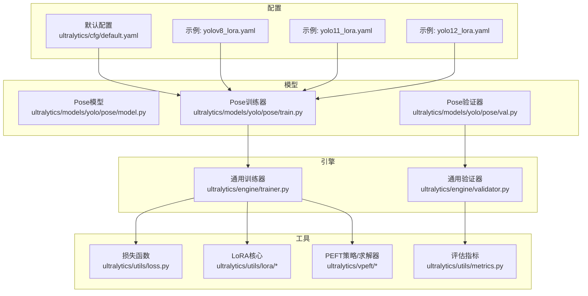
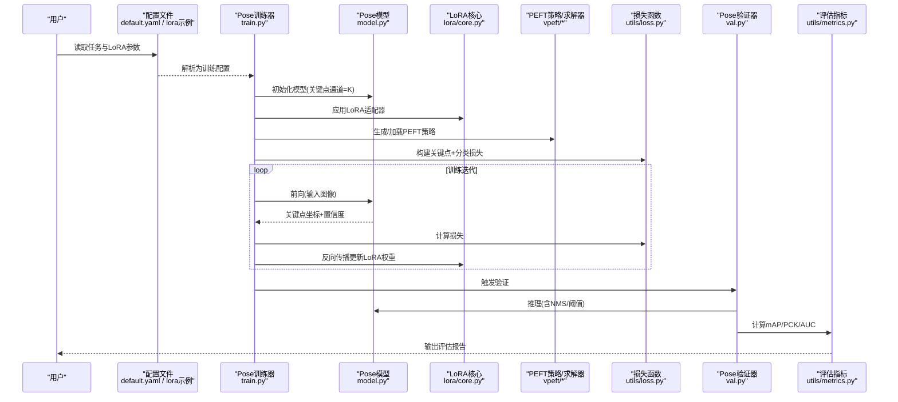
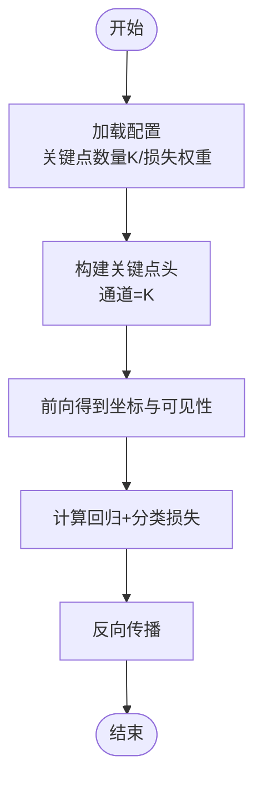
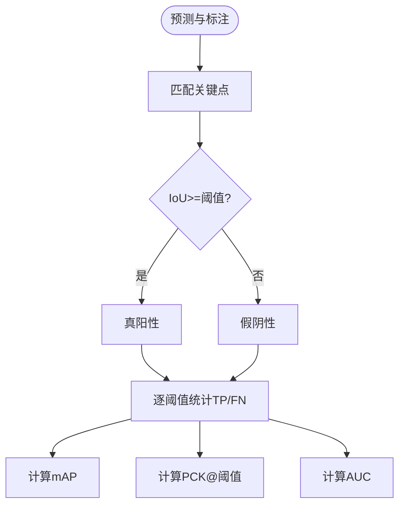
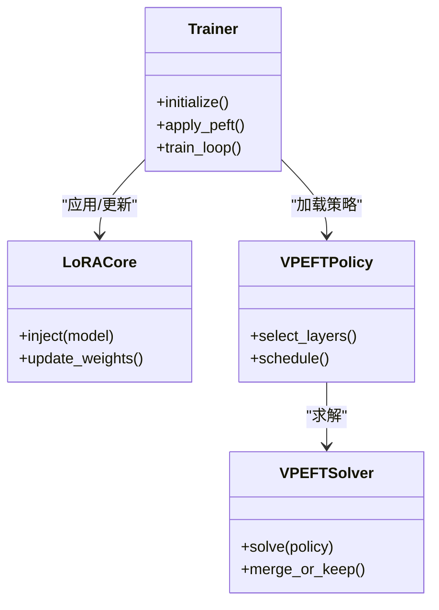
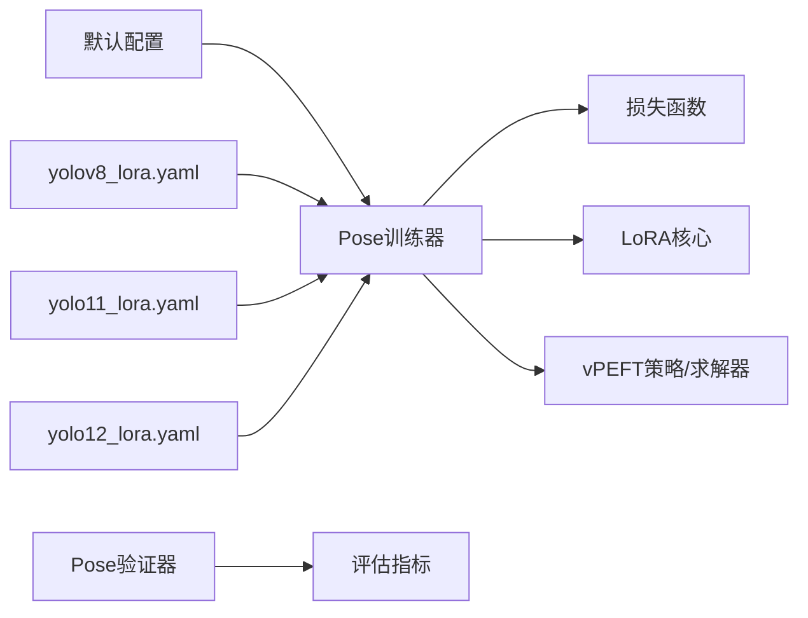

# 姿态估计PEFT配置

<cite>
**本文引用的文件**
- [ultralytics/cfg/default.yaml](file://ultralytics/cfg/default.yaml)
- [ultralytics/models/yolo/pose/model.py](file://ultralytics/models/yolo/pose/model.py)
- [ultralytics/models/yolo/pose/train.py](file://ultralytics/models/yolo/pose/train.py)
- [ultralytics/models/yolo/pose/val.py](file://ultralytics/models/yolo/pose/val.py)
- [ultralytics/utils/loss.py](file://ultralytics/utils/loss.py)
- [ultralytics/utils/metrics.py](file://ultralytics/utils/metrics.py)
- [ultralytics/engine/trainer.py](file://ultralytics/engine/trainer.py)
- [ultralytics/engine/validator.py](file://ultralytics/engine/validator.py)
- [ultralytics/utils/lora/__init__.py](file://ultralytics/utils/lora/__init__.py)
- [ultralytics/utils/lora/core.py](file://ultralytics/utils/lora/core.py)
- [ultralytics/vpeft/policy.py](file://ultralytics/vpeft/policy.py)
- [ultralytics/vpeft/solver.py](file://ultralytics/vpeft/solver.py)
- [examples/lora_examples/yolov8_lora.yaml](file://examples/lora_examples/yolov8_lora.yaml)
- [examples/lora_examples/yolo11_lora.yaml](file://examples/lora_examples/yolo11_lora.yaml)
- [examples/lora_examples/yolo12_lora.yaml](file://examples/lora_examples/yolo12_lora.yaml)
- [docs/en/guides/yolo-pose-perf.md](file://docs/en/guides/yolo-pose-perf.md)
- [scripts/ablation_suite/ablation_peft_coco128.py](file://scripts/ablation_suite/ablation_peft_coco128.py)
- [tests/test_molora.py](file://tests/test_molora.py)
</cite>

## 目录
1. [简介](#简介)
2. [项目结构](#项目结构)
3. [核心组件](#核心组件)
4. [架构总览](#架构总览)
5. [详细组件分析](#详细组件分析)
6. [依赖关系分析](#依赖关系分析)
7. [性能考虑](#性能考虑)
8. [故障排查指南](#故障排查指南)
9. [结论](#结论)
10. [附录](#附录)

## 简介
本文件面向姿态估计任务，提供参数高效微调（PEFT）的完整配置与最佳实践。内容覆盖：
- 人体关键点检测与动物姿态估计的LoRA配置方法
- 关键点数量、坐标归一化与置信度阈值设置
- YOLOv8-Pose、YOLOv11-Pose、YOLOv12-Pose的参数高效微调策略
- 运动分析、医疗康复、动物行为研究等场景的配置示例
- 损失函数选择与评估指标（mAP、PCK、AUC）配置
- 精度优化技巧与实时推理性能调优
- 多物种姿态估计的迁移学习与领域适应策略

## 项目结构
本项目在以下路径中与姿态估计和PEFT相关：
- 模型与训练验证入口：ultralytics/models/yolo/pose/*
- 训练器与验证器：ultralytics/engine/{trainer,validator}.py
- 损失与指标：ultralytics/utils/{loss,metrics}.py
- LoRA与PEFT策略：ultralytics/utils/lora/*、ultralytics/vpeft/*
- 默认配置与示例：ultralytics/cfg/default.yaml、examples/lora_examples/*.yaml
- 文档与脚本：docs/en/guides/yolo-pose-perf.md、scripts/ablation_suite/ablation_peft_coco128.py

图表来源
- [ultralytics/models/yolo/pose/model.py](file://ultralytics/models/yolo/pose/model.py)
- [ultralytics/models/yolo/pose/train.py](file://ultralytics/models/yolo/pose/train.py)
- [ultralytics/models/yolo/pose/val.py](file://ultralytics/models/yolo/pose/val.py)
- [ultralytics/engine/trainer.py](file://ultralytics/engine/trainer.py)
- [ultralytics/engine/validator.py](file://ultralytics/engine/validator.py)
- [ultralytics/utils/loss.py](file://ultralytics/utils/loss.py)
- [ultralytics/utils/metrics.py](file://ultralytics/utils/metrics.py)
- [ultralytics/utils/lora/__init__.py](file://ultralytics/utils/lora/__init__.py)
- [ultralytics/utils/lora/core.py](file://ultralytics/utils/lora/core.py)
- [ultralytics/vpeft/policy.py](file://ultralytics/vpeft/policy.py)
- [ultralytics/vpeft/solver.py](file://ultralytics/vpeft/solver.py)
- [ultralytics/cfg/default.yaml](file://ultralytics/cfg/default.yaml)
- [examples/lora_examples/yolov8_lora.yaml](file://examples/lora_examples/yolov8_lora.yaml)
- [examples/lora_examples/yolo11_lora.yaml](file://examples/lora_examples/yolo11_lora.yaml)
- [examples/lora_examples/yolo12_lora.yaml](file://examples/lora_examples/yolo12_lora.yaml)

章节来源
- [ultralytics/cfg/default.yaml](file://ultralytics/cfg/default.yaml)
- [ultralytics/models/yolo/pose/train.py](file://ultralytics/models/yolo/pose/train.py)
- [ultralytics/models/yolo/pose/val.py](file://ultralytics/models/yolo/pose/val.py)
- [ultralytics/utils/loss.py](file://ultralytics/utils/loss.py)
- [ultralytics/utils/metrics.py](file://ultralytics/utils/metrics.py)
- [ultralytics/utils/lora/__init__.py](file://ultralytics/utils/lora/__init__.py)
- [ultralytics/utils/lora/core.py](file://ultralytics/utils/lora/core.py)
- [ultralytics/vpeft/policy.py](file://ultralytics/vpeft/policy.py)
- [ultralytics/vpeft/solver.py](file://ultralytics/vpeft/solver.py)
- [examples/lora_examples/yolov8_lora.yaml](file://examples/lora_examples/yolov8_lora.yaml)
- [examples/lora_examples/yolo11_lora.yaml](file://examples/lora_examples/yolo11_lora.yaml)
- [examples/lora_examples/yolo12_lora.yaml](file://examples/lora_examples/yolo12_lora.yaml)

## 核心组件
- 姿态模型与任务头
  - 关键点数量由数据集定义决定，模型头通道数需与关键点数量一致。
  - 坐标输出通常采用归一化格式，便于跨分辨率训练与推理。
- 训练器与验证器
  - 训练器负责加载LoRA/PEFT策略、构建损失、执行优化循环。
  - 验证器计算关键点的mAP、PCK、AUC等指标，并支持置信度阈值过滤。
- 损失函数
  - 关键点回归常用BCE或平滑L1类损失；分类分支使用BCE。
- LoRA与PEFT
  - LoRA通过低秩矩阵注入到指定层，减少可训练参数量。
  - vPEFT提供策略与求解器，用于自动选择可适配模块与调度。

章节来源
- [ultralytics/models/yolo/pose/model.py](file://ultralytics/models/yolo/pose/model.py)
- [ultralytics/models/yolo/pose/train.py](file://ultralytics/models/yolo/pose/train.py)
- [ultralytics/models/yolo/pose/val.py](file://ultralytics/models/yolo/pose/val.py)
- [ultralytics/utils/loss.py](file://ultralytics/utils/loss.py)
- [ultralytics/utils/metrics.py](file://ultralytics/utils/metrics.py)
- [ultralytics/utils/lora/__init__.py](file://ultralytics/utils/lora/__init__.py)
- [ultralytics/utils/lora/core.py](file://ultralytics/utils/lora/core.py)
- [ultralytics/vpeft/policy.py](file://ultralytics/vpeft/policy.py)
- [ultralytics/vpeft/solver.py](file://ultralytics/vpeft/solver.py)

## 架构总览
下图展示从配置到训练/验证的关键调用链与数据流。

图表来源
- [ultralytics/models/yolo/pose/train.py](file://ultralytics/models/yolo/pose/train.py)
- [ultralytics/models/yolo/pose/model.py](file://ultralytics/models/yolo/pose/model.py)
- [ultralytics/utils/lora/core.py](file://ultralytics/utils/lora/core.py)
- [ultralytics/vpeft/policy.py](file://ultralytics/vpeft/policy.py)
- [ultralytics/vpeft/solver.py](file://ultralytics/vpeft/solver.py)
- [ultralytics/utils/loss.py](file://ultralytics/utils/loss.py)
- [ultralytics/models/yolo/pose/val.py](file://ultralytics/models/yolo/pose/val.py)
- [ultralytics/utils/metrics.py](file://ultralytics/utils/metrics.py)

## 详细组件分析

### 关键点数量与坐标归一化
- 关键点数量K
  - 由数据集定义（如COCO 17点、自定义动物骨架）。
  - 模型关键点头的通道维度应与K对齐。
- 坐标归一化
  - 训练时建议将关键点坐标归一化至[0,1]区间，以稳定梯度与学习率。
  - 推理阶段根据目标框尺寸还原像素坐标。
- 置信度阈值
  - 验证/推理时可设置关键点置信度阈值，过滤低质量预测。

章节来源
- [ultralytics/models/yolo/pose/model.py](file://ultralytics/models/yolo/pose/model.py)
- [ultralytics/models/yolo/pose/val.py](file://ultralytics/models/yolo/pose/val.py)
- [ultralytics/utils/metrics.py](file://ultralytics/utils/metrics.py)

### 损失函数选择与配置
- 关键点回归损失
  - 常用BCE或平滑L1类损失，对遮挡与小目标更稳健。
- 关键点分类损失
  - 每个关键点二分类（可见/不可见），使用BCE。
- 权重平衡
  - 可通过超参数调节关键点回归与分类损失的权重比。

图表来源
- [ultralytics/utils/loss.py](file://ultralytics/utils/loss.py)
- [ultralytics/models/yolo/pose/model.py](file://ultralytics/models/yolo/pose/model.py)

章节来源
- [ultralytics/utils/loss.py](file://ultralytics/utils/loss.py)
- [ultralytics/models/yolo/pose/train.py](file://ultralytics/models/yolo/pose/train.py)

### 评估指标配置（mAP、PCK、AUC）
- mAP（关键点）
  - 基于IoU阈值的平均精度，衡量关键点定位一致性。
- PCK（Percentage of Correct Keypoints）
  - 按人体尺度或固定阈值判定正确关键点比例。
- AUC（曲线下面积）
  - 在不同阈值下绘制PCK曲线并积分，反映整体鲁棒性。

图表来源
- [ultralytics/utils/metrics.py](file://ultralytics/utils/metrics.py)
- [ultralytics/models/yolo/pose/val.py](file://ultralytics/models/yolo/pose/val.py)

章节来源
- [ultralytics/utils/metrics.py](file://ultralytics/utils/metrics.py)
- [ultralytics/models/yolo/pose/val.py](file://ultralytics/models/yolo/pose/val.py)

### LoRA与PEFT策略（vPEFT）
- LoRA注入位置
  - 常见于注意力或线性层，降低可训练参数量并保持性能。
- 策略与求解器
  - vPEFT提供策略定义与求解流程，自动选择适配层与调度方案。
- 与训练器集成
  - 训练器在初始化后应用LoRA，并在反向传播中仅更新LoRA权重。

图表来源
- [ultralytics/engine/trainer.py](file://ultralytics/engine/trainer.py)
- [ultralytics/utils/lora/core.py](file://ultralytics/utils/lora/core.py)
- [ultralytics/vpeft/policy.py](file://ultralytics/vpeft/policy.py)
- [ultralytics/vpeft/solver.py](file://ultralytics/vpeft/solver.py)

章节来源
- [ultralytics/utils/lora/__init__.py](file://ultralytics/utils/lora/__init__.py)
- [ultralytics/utils/lora/core.py](file://ultralytics/utils/lora/core.py)
- [ultralytics/vpeft/policy.py](file://ultralytics/vpeft/policy.py)
- [ultralytics/vpeft/solver.py](file://ultralytics/vpeft/solver.py)
- [ultralytics/engine/trainer.py](file://ultralytics/engine/trainer.py)

### 不同模型的PEFT策略（YOLOv8-Pose、YOLOv11-Pose、YOLOv12-Pose）
- 共同点
  - 均支持LoRA注入与vPEFT策略；关键点头通道数与数据集K一致。
- 差异点
  - 各版本骨干与颈部结构不同，影响LoRA注入层的选择与效果。
  - 示例配置文件展示了不同版本的LoRA超参与任务设置。

章节来源
- [examples/lora_examples/yolov8_lora.yaml](file://examples/lora_examples/yolov8_lora.yaml)
- [examples/lora_examples/yolo11_lora.yaml](file://examples/lora_examples/yolo11_lora.yaml)
- [examples/lora_examples/yolo12_lora.yaml](file://examples/lora_examples/yolo12_lora.yaml)
- [ultralytics/models/yolo/pose/train.py](file://ultralytics/models/yolo/pose/train.py)

### 应用场景配置示例
- 运动分析
  - 关注关节角度变化，建议使用较高关键点置信度阈值与PCK/AUC联合评估。
- 医疗康复
  - 强调小动作与遮挡鲁棒性，优先平滑L1类损失与严格PCK阈值。
- 动物行为研究
  - 自定义骨架与关键点数量，需确保关键点头通道与K一致，并使用AUC评估跨阈值稳定性。

章节来源
- [ultralytics/models/yolo/pose/model.py](file://ultralytics/models/yolo/pose/model.py)
- [ultralytics/utils/metrics.py](file://ultralytics/utils/metrics.py)
- [docs/en/guides/yolo-pose-perf.md](file://docs/en/guides/yolo-pose-perf.md)

## 依赖关系分析
- 训练链路
  - 训练器依赖损失函数与LoRA核心；vPEFT策略指导LoRA注入与调度。
- 验证链路
  - 验证器依赖指标模块进行mAP/PCK/AUC计算。
- 配置驱动
  - 默认配置与示例LoRA配置驱动训练/验证流程。

图表来源
- [ultralytics/cfg/default.yaml](file://ultralytics/cfg/default.yaml)
- [examples/lora_examples/yolov8_lora.yaml](file://examples/lora_examples/yolov8_lora.yaml)
- [examples/lora_examples/yolo11_lora.yaml](file://examples/lora_examples/yolo11_lora.yaml)
- [examples/lora_examples/yolo12_lora.yaml](file://examples/lora_examples/yolo12_lora.yaml)
- [ultralytics/models/yolo/pose/train.py](file://ultralytics/models/yolo/pose/train.py)
- [ultralytics/models/yolo/pose/val.py](file://ultralytics/models/yolo/pose/val.py)
- [ultralytics/utils/loss.py](file://ultralytics/utils/loss.py)
- [ultralytics/utils/metrics.py](file://ultralytics/utils/metrics.py)
- [ultralytics/utils/lora/core.py](file://ultralytics/utils/lora/core.py)
- [ultralytics/vpeft/policy.py](file://ultralytics/vpeft/policy.py)
- [ultralytics/vpeft/solver.py](file://ultralytics/vpeft/solver.py)

章节来源
- [ultralytics/cfg/default.yaml](file://ultralytics/cfg/default.yaml)
- [ultralytics/models/yolo/pose/train.py](file://ultralytics/models/yolo/pose/train.py)
- [ultralytics/models/yolo/pose/val.py](file://ultralytics/models/yolo/pose/val.py)
- [ultralytics/utils/loss.py](file://ultralytics/utils/loss.py)
- [ultralytics/utils/metrics.py](file://ultralytics/utils/metrics.py)
- [ultralytics/utils/lora/core.py](file://ultralytics/utils/lora/core.py)
- [ultralytics/vpeft/policy.py](file://ultralytics/vpeft/policy.py)
- [ultralytics/vpeft/solver.py](file://ultralytics/vpeft/solver.py)

## 性能考虑
- 精度优化技巧
  - 合理设置关键点数量与归一化范围，避免数值不稳定。
  - 调整关键点回归与分类损失权重，提升小目标与遮挡鲁棒性。
  - 使用PCK与AUC联合评估，避免单一阈值导致的过拟合。
- 实时推理调优
  - 提高关键点置信度阈值以减少误检。
  - 结合NMS与滑动窗口策略，降低重复检测。
  - 导出部署格式（ONNX/TensorRT/OpenVINO）以提升吞吐。

章节来源
- [docs/en/guides/yolo-pose-perf.md](file://docs/en/guides/yolo-pose-perf.md)
- [ultralytics/models/yolo/pose/val.py](file://ultralytics/models/yolo/pose/val.py)
- [ultralytics/utils/metrics.py](file://ultralytics/utils/metrics.py)

## 故障排查指南
- 关键点通道不匹配
  - 症状：训练崩溃或NaN。
  - 处理：确认数据集关键点数量K与模型关键点头通道一致。
- 坐标未归一化
  - 症状：训练发散或收敛缓慢。
  - 处理：启用坐标归一化，检查数据预处理管线。
- 置信度阈值过低
  - 症状：大量误检，PCK下降。
  - 处理：提高关键点置信度阈值，重新评估PCK/AUC。
- LoRA注入失败
  - 症状：参数未更新或无效果。
  - 处理：检查LoRA核心与vPEFT策略配置，确认注入层存在且可训练。

章节来源
- [ultralytics/models/yolo/pose/model.py](file://ultralytics/models/yolo/pose/model.py)
- [ultralytics/utils/lora/core.py](file://ultralytics/utils/lora/core.py)
- [ultralytics/vpeft/policy.py](file://ultralytics/vpeft/policy.py)
- [ultralytics/models/yolo/pose/val.py](file://ultralytics/models/yolo/pose/val.py)

## 结论
通过合理的LoRA与vPEFT策略、关键点数量与归一化配置、损失函数与评估指标的协同设计，可在人体与动物姿态估计任务上实现高效的参数微调。针对不同应用场景，应选择合适的阈值与评估指标，并结合部署优化以获得更好的实时性能。

## 附录
- 快速参考
  - 关键点数量K：由数据集定义，模型关键点头通道需与之匹配。
  - 坐标归一化：训练时使用[0,1]归一化，推理时还原像素坐标。
  - 置信度阈值：根据场景调整，兼顾召回与精度。
  - 损失函数：回归用BCE或平滑L1，分类用BCE，注意权重平衡。
  - 评估指标：mAP、PCK、AUC综合评估定位与可见性。
  - PEFT策略：LoRA注入+策略求解，仅更新少量参数。

章节来源
- [ultralytics/models/yolo/pose/model.py](file://ultralytics/models/yolo/pose/model.py)
- [ultralytics/utils/loss.py](file://ultralytics/utils/loss.py)
- [ultralytics/utils/metrics.py](file://ultralytics/utils/metrics.py)
- [ultralytics/utils/lora/core.py](file://ultralytics/utils/lora/core.py)
- [ultralytics/vpeft/policy.py](file://ultralytics/vpeft/policy.py)
- [ultralytics/vpeft/solver.py](file://ultralytics/vpeft/solver.py)