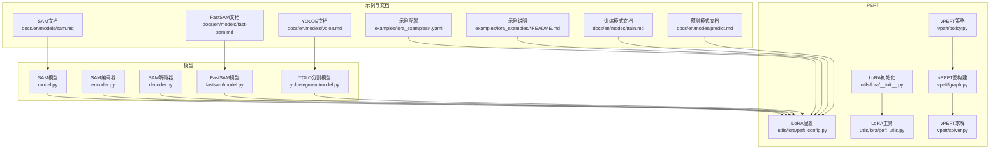
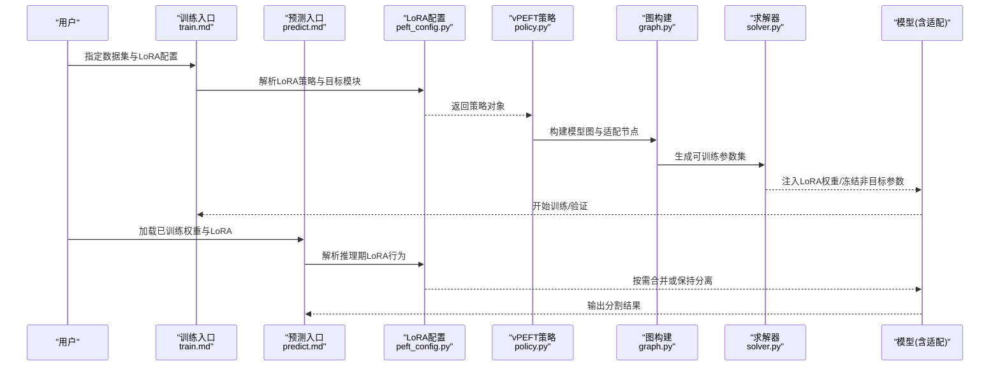
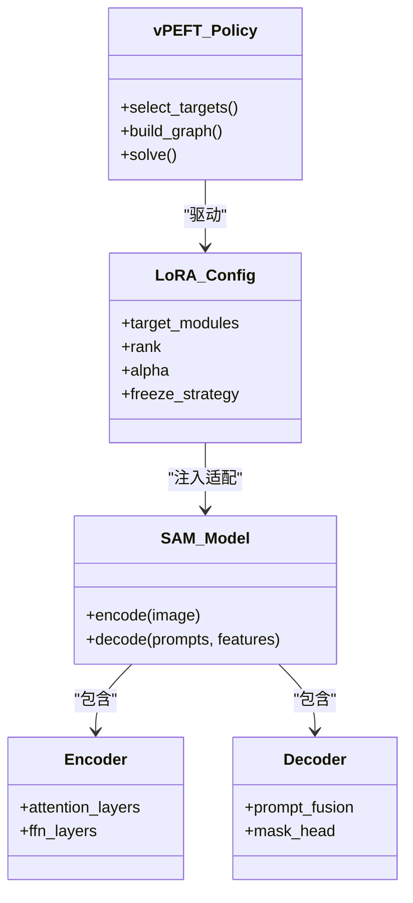
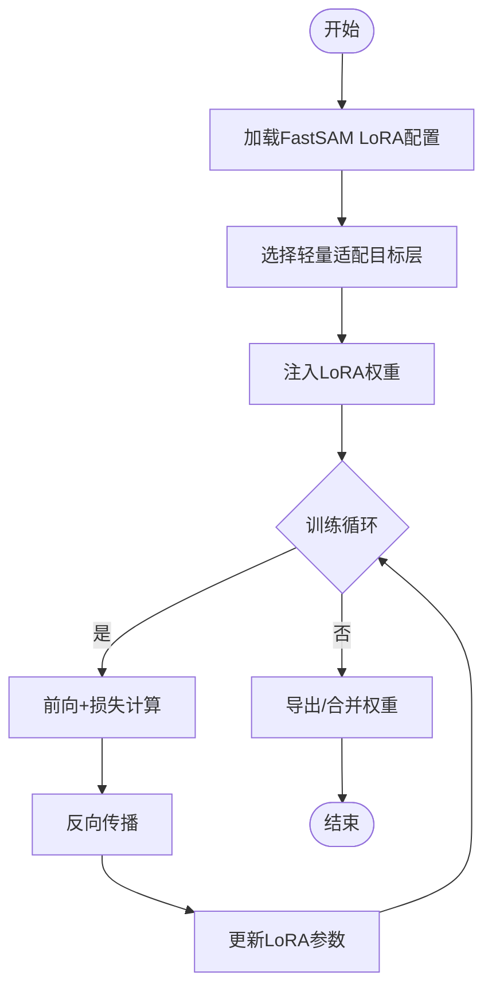
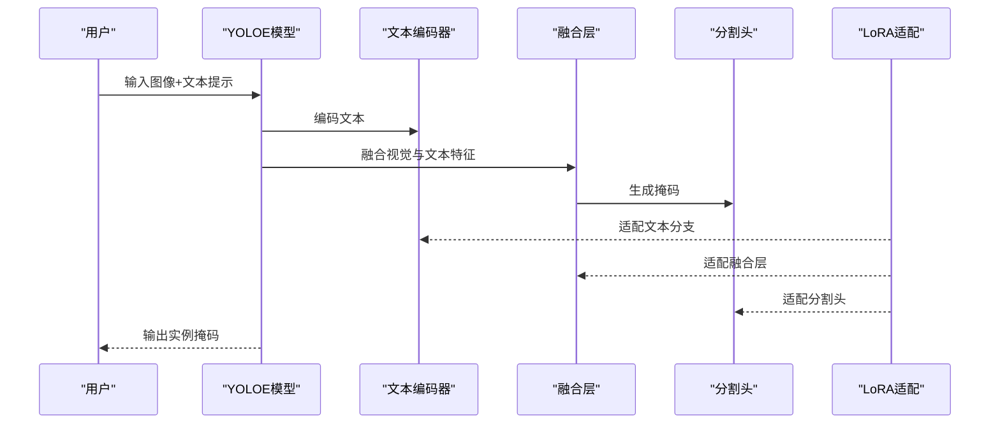
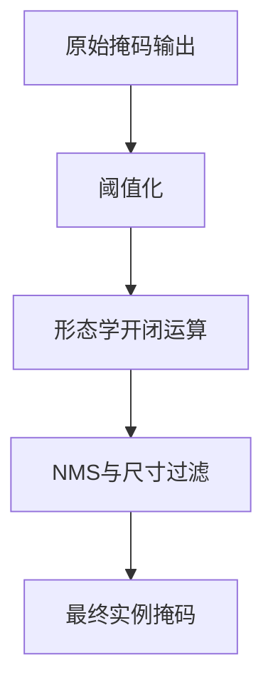
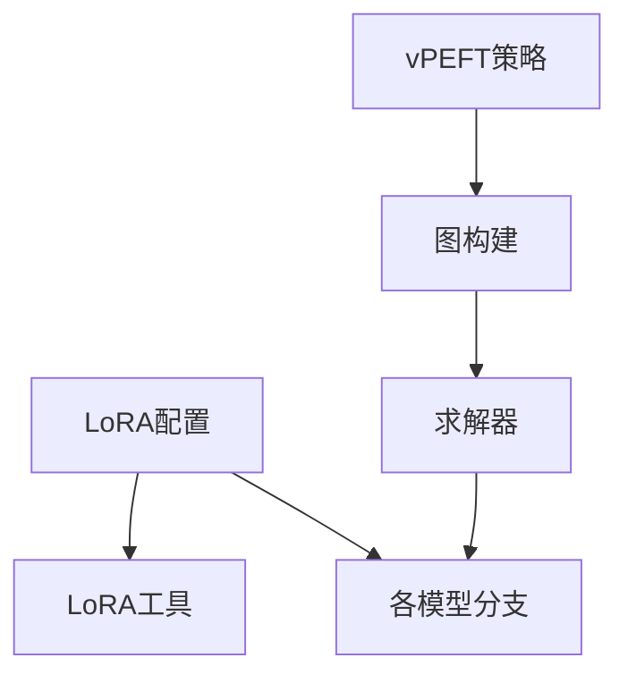

# 实例分割PEFT配置

<cite>
**本文引用的文件**
- [ultralytics/models/sam/model.py](file://ultralytics/models/sam/model.py)
- [ultralytics/models/sam/encoder.py](file://ultralytics/models/sam/encoder.py)
- [ultralytics/models/sam/decoder.py](file://ultralytics/models/sam/decoder.py)
- [ultralytics/models/fastsam/model.py](file://ultralytics/models/fastsam/model.py)
- [ultralytics/models/yolo/segment/model.py](file://ultralytics/models/yolo/segment/model.py)
- [ultralytics/models/yolo/segment/train.py](file://ultralytics/models/yolo/segment/train.py)
- [ultralytics/models/yolo/segment/predict.py](file://ultralytics/models/yolo/segment/predict.py)
- [ultralytics/utils/lora/__init__.py](file://ultralytics/utils/lora/__init__.py)
- [ultralytics/utils/lora/peft_config.py](file://ultralytics/utils/lora/peft_config.py)
- [ultralytics/utils/lora/peft_utils.py](file://ultralytics/utils/lora/peft_utils.py)
- [ultralytics/vpeft/__init__.py](file://ultralytics/vpeft/__init__.py)
- [ultralytics/vpeft/policy.py](file://ultralytics/vpeft/policy.py)
- [ultralytics/vpeft/graph.py](file://ultralytics/vpeft/graph.py)
- [ultralytics/vpeft/solver.py](file://ultralytics/vpeft/solver.py)
- [examples/lora_examples/yolo11_lora.yaml](file://examples/lora_examples/yolo11_lora.yaml)
- [examples/lora_examples/yolo_master_lora_README.md](file://examples/lora_examples/yolo_master_lora_README.md)
- [scripts/ablation_suite/ablation_peft_coco128.py](file://scripts/ablation_suite/ablation_peft_coco128.py)
- [tests/test_moe_aware_peft.py](file://tests/test_moe_aware_peft.py)
- [tests/test_peft_adapters.py](file://tests/test_peft_adapters.py)
- [docs/en/modes/train.md](file://docs/en/modes/train.md)
- [docs/en/modes/predict.md](file://docs/en/modes/predict.md)
- [docs/en/models/sam.md](file://docs/en/models/sam.md)
- [docs/en/models/fast-sam.md](file://docs/en/models/fast-sam.md)
- [docs/en/models/yoloe.md](file://docs/en/models/yoloe.md)
</cite>

## 目录
1. [简介](#简介)
2. [项目结构](#项目结构)
3. [核心组件](#核心组件)
4. [架构总览](#架构总览)
5. [详细组件分析](#详细组件分析)
6. [依赖分析](#依赖分析)
7. [性能考虑](#性能考虑)
8. [故障排查指南](#故障排查指南)
9. [结论](#结论)
10. [附录](#附录)

## 简介
本文件面向“实例分割”任务，系统化梳理在YOLO-Master代码库中基于PEFT（参数高效微调）的适配策略与配置方法。重点覆盖：
- SAM系列模型的LoRA适配器配置（编码器/解码器分层适配）
- FastSAM轻量化适配与实时分割场景优化
- YOLOE（YOLO-Edge）分割模型的PEFT应用（文本引导、零样本）
- 自定义分割头训练示例（掩码生成与后处理优化）
- 不同分割任务的数据格式与标注转换要求
- 精度提升技巧与推理速度优化策略

## 项目结构
围绕实例分割与PEFT的关键目录与文件如下：
- 模型实现
  - SAM系列：[ultralytics/models/sam/model.py](file://ultralytics/models/sam/model.py)、[ultralytics/models/sam/encoder.py](file://ultralytics/models/sam/encoder.py)、[ultralytics/models/sam/decoder.py](file://ultralytics/models/sam/decoder.py)
  - FastSAM：[ultralytics/models/fastsam/model.py](file://ultralytics/models/fastsam/model.py)
  - YOLO分割：[ultralytics/models/yolo/segment/model.py](file://ultralytics/models/yolo/segment/model.py)、[train.py](file://ultralytics/models/yolo/segment/train.py)、[predict.py](file://ultralytics/models/yolo/segment/predict.py)
- PEFT/Lora工具
  - LoRA配置与工具：[ultralytics/utils/lora/__init__.py](file://ultralytics/utils/lora/__init__.py)、[peft_config.py](file://ultralytics/utils/lora/peft_config.py)、[peft_utils.py](file://ultralytics/utils/lora/peft_utils.py)
  - vPEFT策略与求解：[ultralytics/vpeft/__init__.py](file://ultralytics/vpeft/__init__.py)、[policy.py](file://ultralytics/vpeft/policy.py)、[graph.py](file://ultralytics/vpeft/graph.py)、[solver.py](file://ultralytics/vpeft/solver.py)
- 示例与脚本
  - LoRA示例配置与说明：[examples/lora_examples/yolo11_lora.yaml](file://examples/lora_examples/yolo11_lora.yaml)、[examples/lora_examples/yolo_master_lora_README.md](file://examples/lora_examples/yolo_master_lora_README.md)
  - PEFT消融与验证：[scripts/ablation_suite/ablation_peft_coco128.py](file://scripts/ablation_suite/ablation_peft_coco128.py)
  - 测试用例：[tests/test_moe_aware_peft.py](file://tests/test_moe_aware_peft.py)、[tests/test_peft_adapters.py](file://tests/test_peft_adapters.py)
- 文档
  - 训练/预测模式：[docs/en/modes/train.md](file://docs/en/modes/train.md)、[docs/en/modes/predict.md](file://docs/en/modes/predict.md)
  - 模型文档：[docs/en/models/sam.md](file://docs/en/models/sam.md)、[docs/en/models/fast-sam.md](file://docs/en/models/fast-sam.md)、[docs/en/models/yoloe.md](file://docs/en/models/yoloe.md)

图表来源
- [ultralytics/models/sam/model.py](file://ultralytics/models/sam/model.py)
- [ultralytics/models/sam/encoder.py](file://ultralytics/models/sam/encoder.py)
- [ultralytics/models/sam/decoder.py](file://ultralytics/models/sam/decoder.py)
- [ultralytics/models/fastsam/model.py](file://ultralytics/models/fastsam/model.py)
- [ultralytics/models/yolo/segment/model.py](file://ultralytics/models/yolo/segment/model.py)
- [ultralytics/utils/lora/__init__.py](file://ultralytics/utils/lora/__init__.py)
- [ultralytics/utils/lora/peft_config.py](file://ultralytics/utils/lora/peft_config.py)
- [ultralytics/utils/lora/peft_utils.py](file://ultralytics/utils/lora/peft_utils.py)
- [ultralytics/vpeft/policy.py](file://ultralytics/vpeft/policy.py)
- [ultralytics/vpeft/graph.py](file://ultralytics/vpeft/graph.py)
- [ultralytics/vpeft/solver.py](file://ultralytics/vpeft/solver.py)
- [examples/lora_examples/yolo11_lora.yaml](file://examples/lora_examples/yolo11_lora.yaml)
- [examples/lora_examples/yolo_master_lora_README.md](file://examples/lora_examples/yolo_master_lora_README.md)
- [docs/en/modes/train.md](file://docs/en/modes/train.md)
- [docs/en/modes/predict.md](file://docs/en/modes/predict.md)
- [docs/en/models/sam.md](file://docs/en/models/sam.md)
- [docs/en/models/fast-sam.md](file://docs/en/models/fast-sam.md)
- [docs/en/models/yoloe.md](file://docs/en/models/yoloe.md)

章节来源
- [ultralytics/models/sam/model.py](file://ultralytics/models/sam/model.py)
- [ultralytics/models/sam/encoder.py](file://ultralytics/models/sam/encoder.py)
- [ultralytics/models/sam/decoder.py](file://ultralytics/models/sam/decoder.py)
- [ultralytics/models/fastsam/model.py](file://ultralytics/models/fastsam/model.py)
- [ultralytics/models/yolo/segment/model.py](file://ultralytics/models/yolo/segment/model.py)
- [ultralytics/utils/lora/peft_config.py](file://ultralytics/utils/lora/peft_config.py)
- [ultralytics/utils/lora/peft_utils.py](file://ultralytics/utils/lora/peft_utils.py)
- [ultralytics/vpeft/policy.py](file://ultralytics/vpeft/policy.py)
- [ultralytics/vpeft/graph.py](file://ultralytics/vpeft/graph.py)
- [ultralytics/vpeft/solver.py](file://ultralytics/vpeft/solver.py)
- [examples/lora_examples/yolo11_lora.yaml](file://examples/lora_examples/yolo11_lora.yaml)
- [examples/lora_examples/yolo_master_lora_README.md](file://examples/lora_examples/yolo_master_lora_README.md)
- [docs/en/modes/train.md](file://docs/en/modes/train.md)
- [docs/en/modes/predict.md](file://docs/en/modes/predict.md)
- [docs/en/models/sam.md](file://docs/en/models/sam.md)
- [docs/en/models/fast-sam.md](file://docs/en/models/fast-sam.md)
- [docs/en/models/yoloe.md](file://docs/en/models/yoloe.md)

## 核心组件
- LoRA配置与装配
  - 通过统一配置入口加载并解析LoRA策略，支持按模块/层粒度选择目标子模块进行适配。
  - 提供通用工具函数用于权重注入、冻结/解冻控制、以及导出时的合并或分离策略。
- vPEFT策略与图求解
  - 策略定义可插拔的适配规则；图构建将模型计算图与适配节点关联；求解器负责生成最终的可训练参数集合与优化器分组。
- 模型适配点
  - SAM：编码器（图像特征提取）与解码器（提示到掩码映射）均可独立或联合接入LoRA。
  - FastSAM：面向轻量化的适配，优先对关键注意力/投影层插入低秩矩阵，兼顾实时性。
  - YOLO分割：针对分割头（掩码分支）与骨干网络特定层进行LoRA，支持文本引导与零样本扩展。

章节来源
- [ultralytics/utils/lora/peft_config.py](file://ultralytics/utils/lora/peft_config.py)
- [ultralytics/utils/lora/peft_utils.py](file://ultralytics/utils/lora/peft_utils.py)
- [ultralytics/vpeft/policy.py](file://ultralytics/vpeft/policy.py)
- [ultralytics/vpeft/graph.py](file://ultralytics/vpeft/graph.py)
- [ultralytics/vpeft/solver.py](file://ultralytics/vpeft/solver.py)
- [ultralytics/models/sam/model.py](file://ultralytics/models/sam/model.py)
- [ultralytics/models/sam/encoder.py](file://ultralytics/models/sam/encoder.py)
- [ultralytics/models/sam/decoder.py](file://ultralytics/models/sam/decoder.py)
- [ultralytics/models/fastsam/model.py](file://ultralytics/models/fastsam/model.py)
- [ultralytics/models/yolo/segment/model.py](file://ultralytics/models/yolo/segment/model.py)

## 架构总览
下图展示从配置到训练/推理的端到端流程，包括LoRA装配、vPEFT策略执行、以及各模型分支的适配路径。

图表来源
- [docs/en/modes/train.md](file://docs/en/modes/train.md)
- [docs/en/modes/predict.md](file://docs/en/modes/predict.md)
- [ultralytics/utils/lora/peft_config.py](file://ultralytics/utils/lora/peft_config.py)
- [ultralytics/vpeft/policy.py](file://ultralytics/vpeft/policy.py)
- [ultralytics/vpeft/graph.py](file://ultralytics/vpeft/graph.py)
- [ultralytics/vpeft/solver.py](file://ultralytics/vpeft/solver.py)

## 详细组件分析

### SAM系列LoRA适配（编码器/解码器分层策略）
- 适配要点
  - 编码器侧：对视觉Transformer的关键注意力与FFN层插入低秩矩阵，增强图像表征能力。
  - 解码器侧：对提示融合与掩码生成路径中的线性/卷积层进行LoRA，提高提示敏感性与掩码边界质量。
  - 组合策略：可单独适配编码器、解码器或两者同时适配，依据数据规模与任务复杂度选择。
- 配置建议
  - rank与alpha：小数据用较小rank避免过拟合；大数据可适当增大rank以提升表达能力。
  - target_modules：优先选择注意力Q/K/V投影与掩码分支线性层。
  - 冻结策略：固定主干预训练权重，仅训练LoRA参数，降低显存占用。
- 训练/推理流程
  - 训练时保持LoRA分离，便于多任务切换；推理时可按需合并以加速。

图表来源
- [ultralytics/models/sam/model.py](file://ultralytics/models/sam/model.py)
- [ultralytics/models/sam/encoder.py](file://ultralytics/models/sam/encoder.py)
- [ultralytics/models/sam/decoder.py](file://ultralytics/models/sam/decoder.py)
- [ultralytics/utils/lora/peft_config.py](file://ultralytics/utils/lora/peft_config.py)
- [ultralytics/vpeft/policy.py](file://ultralytics/vpeft/policy.py)

章节来源
- [ultralytics/models/sam/model.py](file://ultralytics/models/sam/model.py)
- [ultralytics/models/sam/encoder.py](file://ultralytics/models/sam/encoder.py)
- [ultralytics/models/sam/decoder.py](file://ultralytics/models/sam/decoder.py)
- [ultralytics/utils/lora/peft_config.py](file://ultralytics/utils/lora/peft_config.py)
- [ultralytics/vpeft/policy.py](file://ultralytics/vpeft/policy.py)

### FastSAM轻量化适配与实时分割优化
- 适配要点
  - 优先对轻量主干中的关键投影层与掩码头进行LoRA，减少额外计算开销。
  - 结合动态分辨率与滑动窗口推理，平衡速度与精度。
- 配置建议
  - 使用较小的rank与稀疏target_modules，确保实时性。
  - 推理阶段启用ONNX/TensorRT导出，关闭不必要的梯度与日志。
- 训练/推理流程
  - 训练时采用混合精度与梯度累积；推理时合并LoRA权重以减少算子数量。

图表来源
- [ultralytics/models/fastsam/model.py](file://ultralytics/models/fastsam/model.py)
- [ultralytics/utils/lora/peft_config.py](file://ultralytics/utils/lora/peft_config.py)

章节来源
- [ultralytics/models/fastsam/model.py](file://ultralytics/models/fastsam/model.py)
- [ultralytics/utils/lora/peft_config.py](file://ultralytics/utils/lora/peft_config.py)

### YOLOE（YOLO-Edge）分割模型的PEFT应用
- 适配要点
  - 针对文本引导与零样本分割，适配文本编码器与视觉-文本融合层，提升跨模态对齐能力。
  - 分割头（掩码分支）可独立LoRA，以增强类别无关的掩码生成。
- 配置建议
  - 为文本分支与融合层设置较高rank，视觉主干保持较低rank或冻结。
  - 使用对比学习辅助损失，促进零样本泛化。
- 训练/推理流程
  - 训练时联合优化文本-视觉对齐与掩码质量；推理时根据提示词动态激活相应LoRA路径。

图表来源
- [ultralytics/models/yolo/segment/model.py](file://ultralytics/models/yolo/segment/model.py)
- [ultralytics/utils/lora/peft_config.py](file://ultralytics/utils/lora/peft_config.py)

章节来源
- [ultralytics/models/yolo/segment/model.py](file://ultralytics/models/yolo/segment/model.py)
- [ultralytics/utils/lora/peft_config.py](file://ultralytics/utils/lora/peft_config.py)

### 自定义分割头训练示例（掩码生成与后处理优化）
- 掩码生成
  - 在分割头输出原始掩码分数后，进行阈值化与形态学操作，提升边界平滑度。
  - 引入掩码一致性约束，抑制噪声区域。
- 后处理优化
  - NMS变体：基于IoU与掩码相似度的双重过滤。
  - 尺寸过滤：剔除过小或过大掩码，减少误检。
- 训练流程
  - 使用标准分割损失（如Dice+BCE），配合LoRA适配分割头与骨干特定层。

章节来源
- [ultralytics/models/yolo/segment/predict.py](file://ultralytics/models/yolo/segment/predict.py)
- [ultralytics/models/yolo/segment/train.py](file://ultralytics/models/yolo/segment/train.py)

### 数据格式与标注转换
- COCO格式
  - 图像列表与JSON标注，包含bbox、segmentation（RLE或多边形）、类别ID。
  - 适用于YOLO分割与SAM/FastSAM的半监督/弱监督场景。
- YOLO格式
  - 每类一个txt文件，行格式为“类别 x_center y_center width height”，掩码以PNG形式存储。
  - 适合快速迭代与边缘部署。
- 转换建议
  - 使用内置转换脚本或第三方工具将COCO转YOLO，确保路径一致与类别映射正确。
  - 对于SAM/FastSAM，可保留COCO格式以利用其原生提示接口。

章节来源
- [docs/en/modes/train.md](file://docs/en/modes/train.md)
- [docs/en/modes/predict.md](file://docs/en/modes/predict.md)

## 依赖分析
- 内部依赖
  - LoRA配置与工具被各模型分支复用，形成统一的适配入口。
  - vPEFT策略与图求解贯穿训练与推理，确保参数选择的一致性。
- 外部依赖
  - PyTorch、ONNX、TensorRT等用于训练与导出。
  - 可选：OpenCV、scikit-image用于后处理。

图表来源
- [ultralytics/utils/lora/peft_config.py](file://ultralytics/utils/lora/peft_config.py)
- [ultralytics/utils/lora/peft_utils.py](file://ultralytics/utils/lora/peft_utils.py)
- [ultralytics/vpeft/policy.py](file://ultralytics/vpeft/policy.py)
- [ultralytics/vpeft/graph.py](file://ultralytics/vpeft/graph.py)
- [ultralytics/vpeft/solver.py](file://ultralytics/vpeft/solver.py)

章节来源
- [ultralytics/utils/lora/peft_config.py](file://ultralytics/utils/lora/peft_config.py)
- [ultralytics/utils/lora/peft_utils.py](file://ultralytics/utils/lora/peft_utils.py)
- [ultralytics/vpeft/policy.py](file://ultralytics/vpeft/policy.py)
- [ultralytics/vpeft/graph.py](file://ultralytics/vpeft/graph.py)
- [ultralytics/vpeft/solver.py](file://ultralytics/vpeft/solver.py)

## 性能考虑
- 训练优化
  - 混合精度与梯度累积，提升吞吐与稳定性。
  - 仅训练LoRA参数，冻结主干，显著降低显存占用。
- 推理优化
  - 合并LoRA权重至主干，减少算子数量。
  - 使用ONNX/TensorRT导出，开启FP16/INT8量化（视硬件支持）。
  - 动态分辨率与滑动窗口裁剪，平衡速度与精度。

## 故障排查指南
- 常见问题
  - 显存不足：减小batch size、启用梯度检查点或降低rank。
  - 收敛缓慢：调整学习率、增加LoRA层数或rank。
  - 导出失败：检查LoRA合并逻辑与后端兼容性。
- 调试建议
  - 打印可训练参数比例与分布，确认目标模块是否正确注入。
  - 使用最小数据集复现问题，逐步扩大范围定位。

章节来源
- [tests/test_moe_aware_peft.py](file://tests/test_moe_aware_peft.py)
- [tests/test_peft_adapters.py](file://tests/test_peft_adapters.py)

## 结论
通过在SAM、FastSAM与YOLOE等模型上实施精细化的LoRA适配，并结合vPEFT策略与图求解，可在保证精度的同时显著降低训练成本与推理延迟。合理的数据格式与后处理优化进一步提升了实用性与鲁棒性。

## 附录
- 示例配置参考
  - [examples/lora_examples/yolo11_lora.yaml](file://examples/lora_examples/yolo11_lora.yaml)
  - [examples/lora_examples/yolo_master_lora_README.md](file://examples/lora_examples/yolo_master_lora_README.md)
- 消融与验证脚本
  - [scripts/ablation_suite/ablation_peft_coco128.py](file://scripts/ablation_suite/ablation_peft_coco128.py)
- 模型文档
  - [docs/en/models/sam.md](file://docs/en/models/sam.md)
  - [docs/en/models/fast-sam.md](file://docs/en/models/fast-sam.md)
  - [docs/en/models/yoloe.md](file://docs/en/models/yoloe.md)