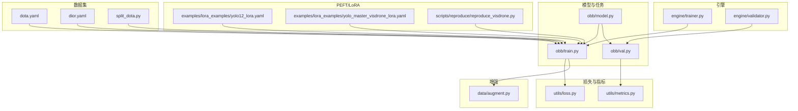
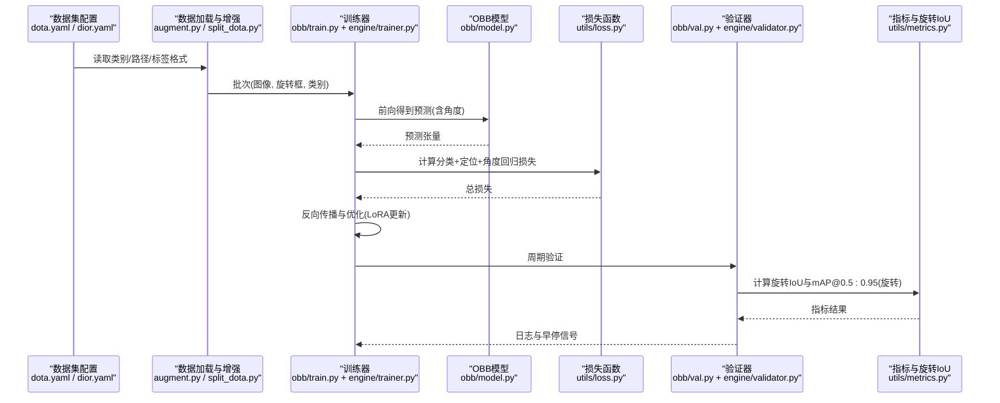
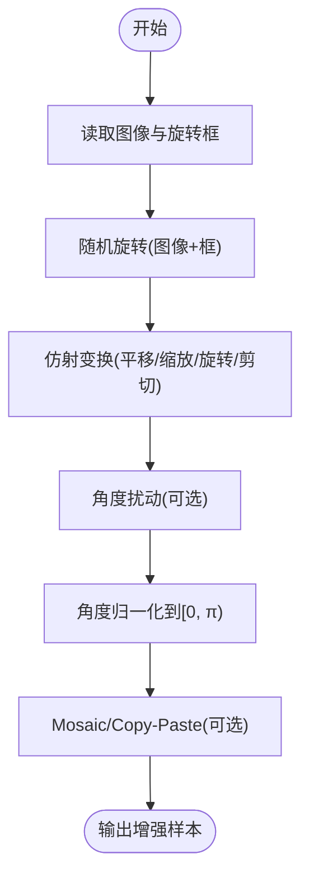
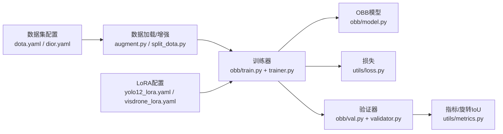

# 旋转边界框检测PEFT配置

<cite>
**本文引用的文件**
- [ultralytics/cfg/datasets/obb/dota.yaml](file://ultralytics/cfg/datasets/obb/dota.yaml)
- [ultralytics/cfg/datasets/obb/dior.yaml](file://ultralytics/cfg/datasets/obb/dior.yaml)
- [ultralytics/data/split_dota.py](file://ultralytics/data/split_dota.py)
- [ultralytics/models/yolo/obb/model.py](file://ultralytics/models/yolo/obb/model.py)
- [ultralytics/models/yolo/obb/train.py](file://ultralytics/models/yolo/obb/train.py)
- [ultralytics/models/yolo/obb/val.py](file://ultralytics/models/yolo/obb/val.py)
- [ultralytics/utils/loss.py](file://ultralytics/utils/loss.py)
- [ultralytics/utils/metrics.py](file://ultralytics/utils/metrics.py)
- [ultralytics/data/augment.py](file://ultralytics/data/augment.py)
- [examples/lora_examples/yolo12_lora.yaml](file://examples/lora_examples/yolo12_lora.yaml)
- [examples/lora_examples/yolo_master_visdrone_lora.yaml](file://examples/lora_examples/yolo_master_visdrone_lora.yaml)
- [scripts/reproduce/reproduce_visdrone.py](file://scripts/reproduce/reproduce_visdrone.py)
- [ultralytics/engine/trainer.py](file://ultralytics/engine/trainer.py)
- [ultralytics/engine/validator.py](file://ultralytics/engine/validator.py)
</cite>

## 目录
1. [简介](#简介)
2. [项目结构](#项目结构)
3. [核心组件](#核心组件)
4. [架构总览](#架构总览)
5. [详细组件分析](#详细组件分析)
6. [依赖关系分析](#依赖关系分析)
7. [性能考虑](#性能考虑)
8. [故障排查指南](#故障排查指南)
9. [结论](#结论)
10. [附录](#附录)

## 简介
本文件面向旋转边界框（OBB）检测任务的参数高效微调（PEFT，以LoRA为主），聚焦以下目标：
- 解释旋转检测与传统水平检测的差异，包括角度表示方法与IoU计算差异。
- 给出DOTA与DIOR数据集的LoRA适配配置要点，涵盖角度回归损失与方向敏感性处理策略。
- 提供无人机航拍、遥感图像分析与船舶检测等场景的配置示例。
- 说明旋转检测特殊数据增强技术（随机旋转、仿射变换、角度扰动）。
- 给出旋转检测评估指标配置（mAP@0.5:0.95 with rotation）与性能优化技巧。

## 项目结构
围绕OBB与PEFT的关键代码与配置分布如下：
- 数据集配置：datasets/obb/dota.yaml、datasets/obb/dior.yaml
- OBB模型与训练/验证：models/yolo/obb/{model,train,val}.py
- 损失与指标：utils/loss.py、utils/metrics.py
- 数据增强：data/augment.py
- DOTA切分工具：data/split_dota.py
- LoRA示例与脚本：examples/lora_examples/*.yaml、scripts/reproduce/reproduce_visdrone.py
- 训练/验证引擎：engine/{trainer,validator}.py

图表来源
- [ultralytics/cfg/datasets/obb/dota.yaml](file://ultralytics/cfg/datasets/obb/dota.yaml)
- [ultralytics/cfg/datasets/obb/dior.yaml](file://ultralytics/cfg/datasets/obb/dior.yaml)
- [ultralytics/data/split_dota.py](file://ultralytics/data/split_dota.py)
- [ultralytics/models/yolo/obb/model.py](file://ultralytics/models/yolo/obb/model.py)
- [ultralytics/models/yolo/obb/train.py](file://ultralytics/models/yolo/obb/train.py)
- [ultralytics/models/yolo/obb/val.py](file://ultralytics/models/yolo/obb/val.py)
- [ultralytics/utils/loss.py](file://ultralytics/utils/loss.py)
- [ultralytics/utils/metrics.py](file://ultralytics/utils/metrics.py)
- [ultralytics/data/augment.py](file://ultralytics/data/augment.py)
- [examples/lora_examples/yolo12_lora.yaml](file://examples/lora_examples/yolo12_lora.yaml)
- [examples/lora_examples/yolo_master_visdrone_lora.yaml](file://examples/lora_examples/yolo_master_visdrone_lora.yaml)
- [scripts/reproduce/reproduce_visdrone.py](file://scripts/reproduce/reproduce_visdrone.py)
- [ultralytics/engine/trainer.py](file://ultralytics/engine/trainer.py)
- [ultralytics/engine/validator.py](file://ultralytics/engine/validator.py)

章节来源
- [ultralytics/cfg/datasets/obb/dota.yaml](file://ultralytics/cfg/datasets/obb/dota.yaml)
- [ultralytics/cfg/datasets/obb/dior.yaml](file://ultralytics/cfg/datasets/obb/dior.yaml)
- [ultralytics/data/split_dota.py](file://ultralytics/data/split_dota.py)
- [ultralytics/models/yolo/obb/model.py](file://ultralytics/models/yolo/obb/model.py)
- [ultralytics/models/yolo/obb/train.py](file://ultralytics/models/yolo/obb/train.py)
- [ultralytics/models/yolo/obb/val.py](file://ultralytics/models/yolo/obb/val.py)
- [ultralytics/utils/loss.py](file://ultralytics/utils/loss.py)
- [ultralytics/utils/metrics.py](file://ultralytics/utils/metrics.py)
- [ultralytics/data/augment.py](file://ultralytics/data/augment.py)
- [examples/lora_examples/yolo12_lora.yaml](file://examples/lora_examples/yolo12_lora.yaml)
- [examples/lora_examples/yolo_master_visdrone_lora.yaml](file://examples/lora_examples/yolo_master_visdrone_lora.yaml)
- [scripts/reproduce/reproduce_visdrone.py](file://scripts/reproduce/reproduce_visdrone.py)
- [ultralytics/engine/trainer.py](file://ultralytics/engine/trainer.py)
- [ultralytics/engine/validator.py](file://ultralytics/engine/validator.py)

## 核心组件
- 数据集配置（DOTA/DIOR）
  - 定义类别数、路径、标签格式与任务类型（obb）。
  - 用于训练/验证管线加载旋转标注与构建OBB专用数据流。
- OBB模型与训练/验证
  - 模型头输出包含类别置信度、中心点坐标、宽高以及角度。
  - 训练阶段组合分类损失、定位损失与角度回归损失；验证阶段使用旋转IoU进行NMS与mAP统计。
- 损失与指标
  - 损失模块提供角度回归损失（如平滑L1或周期性角度损失）与定位损失的权重配比。
  - 指标模块实现旋转IoU计算与mAP@0.5:0.95（旋转）统计。
- 数据增强
  - 支持随机旋转、仿射变换、Mosaic/Copy-Paste等对旋转框友好的增强。
- PEFT/LoRA
  - 通过LoRA适配器注入到主干或检测头关键层，冻结大部分权重，仅训练少量参数。
  - 针对角度敏感分支可单独设置秩与学习率，提升方向表征能力。

章节来源
- [ultralytics/cfg/datasets/obb/dota.yaml](file://ultralytics/cfg/datasets/obb/dota.yaml)
- [ultralytics/cfg/datasets/obb/dior.yaml](file://ultralytics/cfg/datasets/obb/dior.yaml)
- [ultralytics/models/yolo/obb/train.py](file://ultralytics/models/yolo/obb/train.py)
- [ultralytics/models/yolo/obb/val.py](file://ultralytics/models/yolo/obb/val.py)
- [ultralytics/utils/loss.py](file://ultralytics/utils/loss.py)
- [ultralytics/utils/metrics.py](file://ultralytics/utils/metrics.py)
- [ultralytics/data/augment.py](file://ultralytics/data/augment.py)
- [examples/lora_examples/yolo12_lora.yaml](file://examples/lora_examples/yolo12_lora.yaml)
- [examples/lora_examples/yolo_master_visdrone_lora.yaml](file://examples/lora_examples/yolo_master_visdrone_lora.yaml)

## 架构总览
下图展示从数据加载、增强、训练到验证与评估的整体流程，并标注旋转检测特有的环节（角度回归、旋转IoU）。

图表来源
- [ultralytics/cfg/datasets/obb/dota.yaml](file://ultralytics/cfg/datasets/obb/dota.yaml)
- [ultralytics/cfg/datasets/obb/dior.yaml](file://ultralytics/cfg/datasets/obb/dior.yaml)
- [ultralytics/data/augment.py](file://ultralytics/data/augment.py)
- [ultralytics/data/split_dota.py](file://ultralytics/data/split_dota.py)
- [ultralytics/models/yolo/obb/train.py](file://ultralytics/models/yolo/obb/train.py)
- [ultralytics/models/yolo/obb/val.py](file://ultralytics/models/yolo/obb/val.py)
- [ultralytics/utils/loss.py](file://ultralytics/utils/loss.py)
- [ultralytics/utils/metrics.py](file://ultralytics/utils/metrics.py)
- [ultralytics/engine/trainer.py](file://ultralytics/engine/trainer.py)
- [ultralytics/engine/validator.py](file://ultralytics/engine/validator.py)

## 详细组件分析

### 旋转检测 vs 水平检测
- 标注与表示
  - 水平框：通常用(x_min, y_min, x_max, y_max)或中心点+宽高。
  - 旋转框：常用“中心点+宽高+角度”表示，角度定义需与数据集一致（见下节）。
- IoU计算
  - 水平IoU基于矩形交集面积。
  - 旋转IoU基于多边形交集，计算复杂度更高且对角度误差更敏感。
- 损失设计
  - 水平检测仅需定位与分类损失。
  - 旋转检测需额外角度回归损失，并对角度周期性进行处理（避免0°/360°跳变）。
- 评估
  - mAP@0.5:0.95需基于旋转IoU阈值集合统计。

章节来源
- [ultralytics/utils/metrics.py](file://ultralytics/utils/metrics.py)
- [ultralytics/utils/loss.py](file://ultralytics/utils/loss.py)
- [ultralytics/models/yolo/obb/val.py](file://ultralytics/models/yolo/obb/val.py)

### 角度表示方法与约定
- 常见约定
  - 中心角：以图像中心为参考的绝对角度。
  - 左上角角：以左上角顶点为基准的角度。
  - 顺时针角：角度正方向为顺时针。
- 数据集差异
  - DOTA：采用“中心点+宽高+角度”，角度范围通常为[0, π)，顺时针为正。
  - DIOR-R：同样为旋转框，但需注意其角度定义是否与DOTA一致。
- 工程建议
  - 在数据加载与增强中统一角度归一化到[0, π)。
  - 角度回归损失建议使用周期性损失或wrap-around处理，避免0°/π附近梯度不稳定。

章节来源
- [ultralytics/cfg/datasets/obb/dota.yaml](file://ultralytics/cfg/datasets/obb/dota.yaml)
- [ultralytics/cfg/datasets/obb/dior.yaml](file://ultralytics/cfg/datasets/obb/dior.yaml)
- [ultralytics/data/augment.py](file://ultralytics/data/augment.py)

### IoU计算方式（旋转）
- 旋转IoU基于多边形求交，需要稳定地处理退化情况（如极小框、共线边）。
- 阈值扫描：mAP@0.5:0.95需在多个IoU阈值上累计精度-召回曲线。
- 数值稳定性：建议对角度做模运算与裁剪，避免浮点误差导致的非法多边形。

章节来源
- [ultralytics/utils/metrics.py](file://ultralytics/utils/metrics.py)
- [ultralytics/models/yolo/obb/val.py](file://ultralytics/models/yolo/obb/val.py)

### DOTA数据集的LoRA适配配置要点
- 数据准备
  - 使用DOTA官方格式，确保角度范围为[0, π)且顺时针为正。
  - 若原始图像过大，可使用切分脚本生成瓦片，保持旋转框相对坐标一致性。
- 模型与任务
  - 选择OBB任务头，输出包含角度通道。
- 损失与权重
  - 适当提高角度回归损失权重，保证方向敏感性。
- LoRA策略
  - 主干网络低秩适配（较小rank），检测头（尤其是角度分支）可独立设置较高rank与学习率。
  - 冻结BN/统计量或使用EMA稳定训练。
- 增强
  - 启用随机旋转、仿射变换、Mosaic/Copy-Paste，注意角度在增强后仍需归一化。
- 评估
  - 使用旋转IoU计算mAP@0.5:0.95。

章节来源
- [ultralytics/cfg/datasets/obb/dota.yaml](file://ultralytics/cfg/datasets/obb/dota.yaml)
- [ultralytics/data/split_dota.py](file://ultralytics/data/split_dota.py)
- [ultralytics/models/yolo/obb/train.py](file://ultralytics/models/yolo/obb/train.py)
- [ultralytics/utils/loss.py](file://ultralytics/utils/loss.py)
- [ultralytics/utils/metrics.py](file://ultralytics/utils/metrics.py)
- [ultralytics/data/augment.py](file://ultralytics/data/augment.py)
- [examples/lora_examples/yolo12_lora.yaml](file://examples/lora_examples/yolo12_lora.yaml)

### DIOR数据集的LoRA适配配置要点
- 数据准备
  - 确认DIOR-R的标注格式与角度定义，必要时做角度映射到[0, π)。
- 模型与任务
  - 与DOTA一致的OBB任务头与损失配置。
- LoRA策略
  - 若DIOR规模较小，可提高LoRA rank或增加正则化强度，防止过拟合。
- 增强
  - 针对遥感场景，适度控制仿射幅度，避免破坏尺度与纹理特征。
- 评估
  - 同样使用旋转IoU与mAP@0.5:0.95。

章节来源
- [ultralytics/cfg/datasets/obb/dior.yaml](file://ultralytics/cfg/datasets/obb/dior.yaml)
- [ultralytics/models/yolo/obb/train.py](file://ultralytics/models/yolo/obb/train.py)
- [ultralytics/utils/loss.py](file://ultralytics/utils/loss.py)
- [ultralytics/utils/metrics.py](file://ultralytics/utils/metrics.py)
- [ultralytics/data/augment.py](file://ultralytics/data/augment.py)
- [examples/lora_examples/yolo12_lora.yaml](file://examples/lora_examples/yolo12_lora.yaml)

### 实际应用场景配置示例
- 无人机航拍图像检测
  - 特点：目标密集、尺度变化大、视角倾斜明显。
  - 建议：增大随机旋转与仿射幅度；对角度分支LoRA使用中等rank；加强Mosaic/Copy-Paste。
- 遥感图像分析
  - 特点：背景复杂、类间相似度高、长尾分布。
  - 建议：引入类别平衡策略；角度损失权重略高；使用EMA稳定训练。
- 船舶检测
  - 特点：细长目标、方向性强、水面背景干扰。
  - 建议：提高角度回归权重；限制仿射中的剪切幅度；使用高分辨率输入与切片推理。

章节来源
- [ultralytics/models/yolo/obb/train.py](file://ultralytics/models/yolo/obb/train.py)
- [ultralytics/utils/loss.py](file://ultralytics/utils/loss.py)
- [ultralytics/data/augment.py](file://ultralytics/data/augment.py)
- [examples/lora_examples/yolo_master_visdrone_lora.yaml](file://examples/lora_examples/yolo_master_visdrone_lora.yaml)

### 旋转检测的特殊数据增强
- 随机旋转
  - 在[0, 2π)范围内随机旋转图像与对应旋转框，训练后需将角度归一化到[0, π)。
- 仿射变换
  - 平移、缩放、旋转、剪切组合，注意保持旋转框几何一致性。
- 角度扰动
  - 在标签层面添加微小角度噪声，提升角度回归鲁棒性。
- 其他
  - Mosaic/Copy-Paste有助于缓解小目标漏检与背景混淆。

图表来源
- [ultralytics/data/augment.py](file://ultralytics/data/augment.py)

章节来源
- [ultralytics/data/augment.py](file://ultralytics/data/augment.py)

### 评估指标配置（mAP@0.5:0.95 with rotation）
- 指标定义
  - 基于旋转IoU在不同阈值（0.5至0.95步进）上计算AP并平均。
- 配置要点
  - 确保验证阶段使用旋转IoU而非水平IoU。
  - 合理设置NMS阈值与置信度阈值，避免过度抑制。
- 报告
  - 记录总体mAP、各IoU阈值下的AP、各类别AP与PR曲线。

章节来源
- [ultralytics/utils/metrics.py](file://ultralytics/utils/metrics.py)
- [ultralytics/models/yolo/obb/val.py](file://ultralytics/models/yolo/obb/val.py)

### 性能优化技巧
- 训练稳定性
  - 使用EMA平滑权重；对角度分支采用稍高的学习率与正则化。
  - 混合精度训练（AMP）加速，注意数值稳定性。
- 数据侧
  - 预切分大图（如DOTA瓦片）减少I/O与内存峰值。
  - 缓存预处理结果，避免重复计算。
- 模型侧
  - LoRA rank按层差异化设置；角度分支可更大rank。
  - 冻结非关键层，降低显存占用与训练时间。
- 推理侧
  - 切片推理（SAHI）结合旋转NMS，提升小目标召回。
  - 导出ONNX/TensorRT时固定输入尺寸，利用批处理。

章节来源
- [ultralytics/models/yolo/obb/train.py](file://ultralytics/models/yolo/obb/train.py)
- [ultralytics/utils/loss.py](file://ultralytics/utils/loss.py)
- [ultralytics/data/split_dota.py](file://ultralytics/data/split_dota.py)
- [examples/lora_examples/yolo12_lora.yaml](file://examples/lora_examples/yolo12_lora.yaml)

## 依赖关系分析
- 组件耦合
  - 训练器依赖OBB模型、损失与增强；验证器依赖指标与旋转IoU。
  - LoRA配置通过训练器注入到模型特定层。
- 外部依赖
  - 数据集配置文件驱动数据加载；切分脚本辅助大规模数据处理。
- 潜在循环
  - 当前结构分层清晰，未见直接循环依赖。

图表来源
- [ultralytics/cfg/datasets/obb/dota.yaml](file://ultralytics/cfg/datasets/obb/dota.yaml)
- [ultralytics/cfg/datasets/obb/dior.yaml](file://ultralytics/cfg/datasets/obb/dior.yaml)
- [ultralytics/data/augment.py](file://ultralytics/data/augment.py)
- [ultralytics/data/split_dota.py](file://ultralytics/data/split_dota.py)
- [ultralytics/models/yolo/obb/train.py](file://ultralytics/models/yolo/obb/train.py)
- [ultralytics/models/yolo/obb/val.py](file://ultralytics/models/yolo/obb/val.py)
- [ultralytics/utils/loss.py](file://ultralytics/utils/loss.py)
- [ultralytics/utils/metrics.py](file://ultralytics/utils/metrics.py)
- [examples/lora_examples/yolo12_lora.yaml](file://examples/lora_examples/yolo12_lora.yaml)
- [examples/lora_examples/yolo_master_visdrone_lora.yaml](file://examples/lora_examples/yolo_master_visdrone_lora.yaml)
- [ultralytics/engine/trainer.py](file://ultralytics/engine/trainer.py)
- [ultralytics/engine/validator.py](file://ultralytics/engine/validator.py)

章节来源
- [ultralytics/models/yolo/obb/train.py](file://ultralytics/models/yolo/obb/train.py)
- [ultralytics/models/yolo/obb/val.py](file://ultralytics/models/yolo/obb/val.py)
- [ultralytics/utils/loss.py](file://ultralytics/utils/loss.py)
- [ultralytics/utils/metrics.py](file://ultralytics/utils/metrics.py)
- [ultralytics/data/augment.py](file://ultralytics/data/augment.py)
- [ultralytics/data/split_dota.py](file://ultralytics/data/split_dota.py)
- [examples/lora_examples/yolo12_lora.yaml](file://examples/lora_examples/yolo12_lora.yaml)
- [examples/lora_examples/yolo_master_visdrone_lora.yaml](file://examples/lora_examples/yolo_master_visdrone_lora.yaml)
- [ultralytics/engine/trainer.py](file://ultralytics/engine/trainer.py)
- [ultralytics/engine/validator.py](file://ultralytics/engine/validator.py)

## 性能考虑
- 训练效率
  - 使用AMP与多进程数据加载；对大图先切分再训练。
  - LoRA冻结主干，仅训练适配器，显著降低显存与时间成本。
- 收敛稳定性
  - 角度损失权重与学习率需调优；使用EMA与梯度裁剪。
- 推理速度
  - 导出优化格式（ONNX/TensorRT）；固定输入尺寸；批量推理。
- 资源受限部署
  - 量化与剪枝结合LoRA；边缘设备优先选择较小rank与精简增强。

[本节为通用指导，不直接分析具体文件]

## 故障排查指南
- 角度异常
  - 现象：角度接近0°/π时损失震荡或预测翻转。
  - 排查：检查角度归一化与周期性损失；确认数据集角度定义。
- 旋转IoU不稳定
  - 现象：验证阶段mAP波动大。
  - 排查：检查多边形求交的数值稳定性；调整NMS阈值与置信度阈值。
- LoRA未生效
  - 现象：训练集指标无提升。
  - 排查：确认LoRA目标层是否被正确注入；检查学习率与rank设置。
- 数据增强导致标注错乱
  - 现象：训练初期损失异常升高。
  - 排查：验证增强后旋转框与角度的一致性；确保角度归一化。

章节来源
- [ultralytics/utils/loss.py](file://ultralytics/utils/loss.py)
- [ultralytics/utils/metrics.py](file://ultralytics/utils/metrics.py)
- [ultralytics/data/augment.py](file://ultralytics/data/augment.py)
- [examples/lora_examples/yolo12_lora.yaml](file://examples/lora_examples/yolo12_lora.yaml)

## 结论
- 旋转检测的核心在于角度表示、角度回归损失与旋转IoU的协同设计。
- 针对DOTA与DIOR，应严格遵循各自角度约定并进行归一化处理。
- LoRA适配建议对角度分支给予更高容量与学习率，配合稳定的训练策略与合适的增强。
- 在无人机航拍、遥感与船舶检测等场景中，可通过场景化增强与损失权重调优获得更好效果。
- 评估务必使用旋转IoU与mAP@0.5:0.95，确保指标可比性与可靠性。

[本节为总结性内容，不直接分析具体文件]

## 附录
- 快速上手清单
  - 准备数据集配置（DOTA/DIOR）。
  - 选择OBB任务与LoRA配置。
  - 启用随机旋转、仿射与角度扰动。
  - 训练并监控角度损失与mAP@0.5:0.95（旋转）。
  - 导出与部署，必要时进行切片推理。

章节来源
- [ultralytics/cfg/datasets/obb/dota.yaml](file://ultralytics/cfg/datasets/obb/dota.yaml)
- [ultralytics/cfg/datasets/obb/dior.yaml](file://ultralytics/cfg/datasets/obb/dior.yaml)
- [examples/lora_examples/yolo12_lora.yaml](file://examples/lora_examples/yolo12_lora.yaml)
- [examples/lora_examples/yolo_master_visdrone_lora.yaml](file://examples/lora_examples/yolo_master_visdrone_lora.yaml)
- [scripts/reproduce/reproduce_visdrone.py](file://scripts/reproduce/reproduce_visdrone.py)