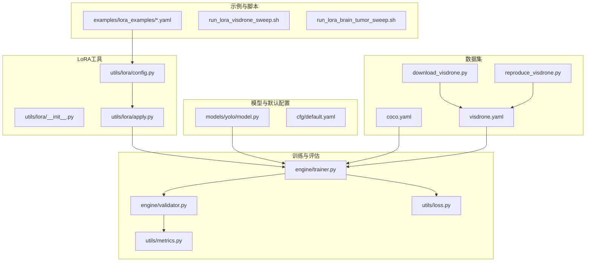
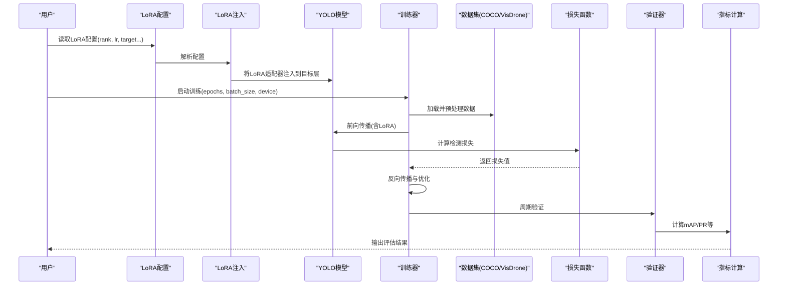
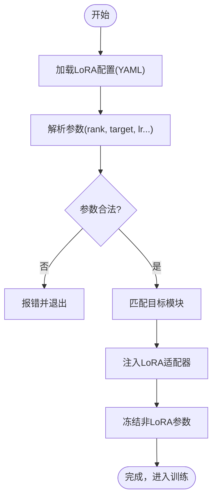
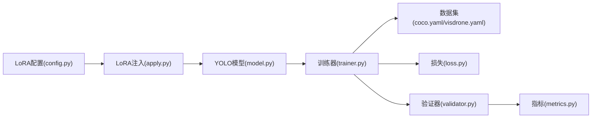

# 目标检测PEFT配置

<cite>
**本文引用的文件**
- [examples/lora_examples/yolov8_lora.yaml](file://examples/lora_examples/yolov8_lora.yaml)
- [examples/lora_examples/yolo11_lora.yaml](file://examples/lora_examples/yolo11_lora.yaml)
- [examples/lora_examples/yolo12_lora.yaml](file://examples/lora_examples/yolo12_lora.yaml)
- [examples/lora_examples/yolo_master_visdrone_lora.yaml](file://examples/lora_examples/yolo_master_visdrone_lora.yaml)
- [examples/lora_examples/yolo_master_brain_tumor_lora.yaml](file://examples/lora_examples/yolo_master_brain_tumor_lora.yaml)
- [examples/lora_examples/run_lora_visdrone_sweep.sh](file://examples/lora_examples/run_lora_visdrone_sweep.sh)
- [examples/lora_examples/run_lora_brain_tumor_sweep.sh](file://examples/lora_examples/run_lora_brain_tumor_sweep.sh)
- [ultralytics/cfg/datasets/detect/coco.yaml](file://ultralytics/cfg/datasets/detect/coco.yaml)
- [ultralytics/cfg/datasets/detect/visdrone.yaml](file://ultralytics/cfg/datasets/detect/visdrone.yaml)
- [scripts/download_visdrone.py](file://scripts/download_visdrone.py)
- [scripts/reproduce_visdrone.py](file://scripts/reproduce_visdrone.py)
- [scripts/fewshot_lora_quick.py](file://scripts/fewshot_lora_quick.py)
- [scripts/fewshot_lora_verify.py](file://scripts/fewshot_lora_verify.py)
- [ultralytics/utils/lora/__init__.py](file://ultralytics/utils/lora/__init__.py)
- [ultralytics/utils/lora/config.py](file://ultralytics/utils/lora/config.py)
- [ultralytics/utils/lora/apply.py](file://ultralytics/utils/lora/apply.py)
- [ultralytics/engine/trainer.py](file://ultralytics/engine/trainer.py)
- [ultralytics/engine/validator.py](file://ultralytics/engine/validator.py)
- [ultralytics/utils/metrics.py](file://ultralytics/utils/metrics.py)
- [ultralytics/utils/loss.py](file://ultralytics/utils/loss.py)
- [ultralytics/models/yolo/model.py](file://ultralytics/models/yolo/model.py)
- [ultralytics/cfg/default.yaml](file://ultralytics/cfg/default.yaml)
</cite>

## 目录
1. [简介](#简介)
2. [项目结构](#项目结构)
3. [核心组件](#核心组件)
4. [架构总览](#架构总览)
5. [详细组件分析](#详细组件分析)
6. [依赖关系分析](#依赖关系分析)
7. [性能考虑](#性能考虑)
8. [故障排查指南](#故障排查指南)
9. [结论](#结论)
10. [附录](#附录)

## 简介
本文件面向目标检测任务，提供基于LoRA的PEFT（参数高效微调）配置与调优指南。内容覆盖YOLOv8、YOLOv11、YOLOv12三类模型的LoRA配置方法，包括rank选择、学习率设置与训练超参调优；给出COCO与VisDrone数据集的微调示例（数据格式、路径配置、类别映射）；并给出医学图像分析（脑肿瘤检测）的小样本学习与领域适应策略。同时说明损失函数选择与评估指标配置，并提供性能优化技巧与常见问题解决方案。

## 项目结构
围绕PEFT与目标检测的关键目录与文件：
- LoRA示例配置与脚本：examples/lora_examples
- 数据集定义：ultralytics/cfg/datasets/detect
- 下载与复现实例：scripts
- LoRA工具与配置解析：ultralytics/utils/lora
- 训练与验证引擎：ultralytics/engine
- 模型入口与默认配置：ultralytics/models/yolo/model.py、ultralytics/cfg/default.yaml

图表来源
- [examples/lora_examples/yolov8_lora.yaml](file://examples/lora_examples/yolov8_lora.yaml)
- [examples/lora_examples/yolo11_lora.yaml](file://examples/lora_examples/yolo11_lora.yaml)
- [examples/lora_examples/yolo12_lora.yaml](file://examples/lora_examples/yolo12_lora.yaml)
- [examples/lora_examples/yolo_master_visdrone_lora.yaml](file://examples/lora_examples/yolo_master_visdrone_lora.yaml)
- [examples/lora_examples/yolo_master_brain_tumor_lora.yaml](file://examples/lora_examples/yolo_master_brain_tumor_lora.yaml)
- [examples/lora_examples/run_lora_visdrone_sweep.sh](file://examples/lora_examples/run_lora_visdrone_sweep.sh)
- [examples/lora_examples/run_lora_brain_tumor_sweep.sh](file://examples/lora_examples/run_lora_brain_tumor_sweep.sh)
- [ultralytics/cfg/datasets/detect/coco.yaml](file://ultralytics/cfg/datasets/detect/coco.yaml)
- [ultralytics/cfg/datasets/detect/visdrone.yaml](file://ultralytics/cfg/datasets/detect/visdrone.yaml)
- [scripts/download_visdrone.py](file://scripts/download_visdrone.py)
- [scripts/reproduce_visdrone.py](file://scripts/reproduce_visdrone.py)
- [ultralytics/utils/lora/__init__.py](file://ultralytics/utils/lora/__init__.py)
- [ultralytics/utils/lora/config.py](file://ultralytics/utils/lora/config.py)
- [ultralytics/utils/lora/apply.py](file://ultralytics/utils/lora/apply.py)
- [ultralytics/engine/trainer.py](file://ultralytics/engine/trainer.py)
- [ultralytics/engine/validator.py](file://ultralytics/engine/validator.py)
- [ultralytics/utils/metrics.py](file://ultralytics/utils/metrics.py)
- [ultralytics/utils/loss.py](file://ultralytics/utils/loss.py)
- [ultralytics/models/yolo/model.py](file://ultralytics/models/yolo/model.py)
- [ultralytics/cfg/default.yaml](file://ultralytics/cfg/default.yaml)

章节来源
- [examples/lora_examples/yolov8_lora.yaml](file://examples/lora_examples/yolov8_lora.yaml)
- [examples/lora_examples/yolo11_lora.yaml](file://examples/lora_examples/yolo11_lora.yaml)
- [examples/lora_examples/yolo12_lora.yaml](file://examples/lora_examples/yolo12_lora.yaml)
- [ultralytics/cfg/datasets/detect/coco.yaml](file://ultralytics/cfg/datasets/detect/coco.yaml)
- [ultralytics/cfg/datasets/detect/visdrone.yaml](file://ultralytics/cfg/datasets/detect/visdrone.yaml)
- [ultralytics/utils/lora/config.py](file://ultralytics/utils/lora/config.py)
- [ultralytics/utils/lora/apply.py](file://ultralytics/utils/lora/apply.py)
- [ultralytics/engine/trainer.py](file://ultralytics/engine/trainer.py)
- [ultralytics/engine/validator.py](file://ultralytics/engine/validator.py)
- [ultralytics/utils/metrics.py](file://ultralytics/utils/metrics.py)
- [ultralytics/utils/loss.py](file://ultralytics/utils/loss.py)
- [ultralytics/models/yolo/model.py](file://ultralytics/models/yolo/model.py)
- [ultralytics/cfg/default.yaml](file://ultralytics/cfg/default.yaml)

## 核心组件
- LoRA配置与注入
  - 配置文件：针对YOLOv8、YOLOv11、YOLOv12分别提供LoRA示例配置，包含rank、target模块、学习率等关键项。
  - 配置解析与注入：通过LoRA工具链加载配置并将适配器应用到指定层或模块。
- 训练与验证
  - 训练器：负责加载数据集、构建模型、应用LoRA、执行前向/反向传播与优化。
  - 验证器：在验证集上计算mAP、precision、recall等指标，支持不同IoU阈值与类别统计。
- 损失与指标
  - 损失：目标检测常用分类与定位损失的组合，可通过配置调整权重。
  - 指标：mAP@0.5:0.95、mAP@0.5、precision、recall等。
- 数据集
  - COCO：标准通用目标检测数据集，提供类别映射与路径模板。
  - VisDrone：无人机视角小目标检测数据集，需按Yolo格式组织。

章节来源
- [ultralytics/utils/lora/config.py](file://ultralytics/utils/lora/config.py)
- [ultralytics/utils/lora/apply.py](file://ultralytics/utils/lora/apply.py)
- [ultralytics/engine/trainer.py](file://ultralytics/engine/trainer.py)
- [ultralytics/engine/validator.py](file://ultralytics/engine/validator.py)
- [ultralytics/utils/metrics.py](file://ultralytics/utils/metrics.py)
- [ultralytics/utils/loss.py](file://ultralytics/utils/loss.py)
- [ultralytics/cfg/datasets/detect/coco.yaml](file://ultralytics/cfg/datasets/detect/coco.yaml)
- [ultralytics/cfg/datasets/detect/visdrone.yaml](file://ultralytics/cfg/datasets/detect/visdrone.yaml)

## 架构总览
下图展示从LoRA配置到训练、验证与指标计算的端到端流程。

图表来源
- [examples/lora_examples/yolov8_lora.yaml](file://examples/lora_examples/yolov8_lora.yaml)
- [examples/lora_examples/yolo11_lora.yaml](file://examples/lora_examples/yolo11_lora.yaml)
- [examples/lora_examples/yolo12_lora.yaml](file://examples/lora_examples/yolo12_lora.yaml)
- [ultralytics/utils/lora/config.py](file://ultralytics/utils/lora/config.py)
- [ultralytics/utils/lora/apply.py](file://ultralytics/utils/lora/apply.py)
- [ultralytics/models/yolo/model.py](file://ultralytics/models/yolo/model.py)
- [ultralytics/engine/trainer.py](file://ultralytics/engine/trainer.py)
- [ultralytics/engine/validator.py](file://ultralytics/engine/validator.py)
- [ultralytics/utils/metrics.py](file://ultralytics/utils/metrics.py)
- [ultralytics/utils/loss.py](file://ultralytics/utils/loss.py)
- [ultralytics/cfg/datasets/detect/coco.yaml](file://ultralytics/cfg/datasets/detect/coco.yaml)
- [ultralytics/cfg/datasets/detect/visdrone.yaml](file://ultralytics/cfg/datasets/detect/visdrone.yaml)

## 详细组件分析

### YOLO系列LoRA配置方法（YOLOv8 / v11 / v12）
- rank参数选择
  - 经验建议：小数据集或轻量模型使用较小rank（如4~16），较大数据集或复杂场景可尝试中等rank（如16~64）。
  - 影响：rank越大可表达能力越强，但显存与计算开销增加，易过拟合风险上升。
- 学习率设置
  - 建议范围：1e-4 ~ 1e-3（根据rank与数据规模调整），配合warmup与余弦退火更稳定。
  - 与rank的关系：rank增大时适当降低学习率以避免不稳定。
- 目标模块选择
  - 常见选择：注意力层、卷积层或检测头部分模块；优先选择对任务敏感的分支。
- 训练超参
  - epochs：小样本10~50轮，常规数据50~150轮。
  - batch_size：受显存限制，尽量大以提升稳定性。
  - 数据增强：几何变换、色彩抖动、MixUp/Copy-Paste等有助于泛化。
- 参考示例配置
  - YOLOv8 LoRA配置示例：[yolov8_lora.yaml](file://examples/lora_examples/yolov8_lora.yaml)
  - YOLOv11 LoRA配置示例：[yolo11_lora.yaml](file://examples/lora_examples/yolo11_lora.yaml)
  - YOLOv12 LoRA配置示例：[yolo12_lora.yaml](file://examples/lora_examples/yolo12_lora.yaml)

章节来源
- [examples/lora_examples/yolov8_lora.yaml](file://examples/lora_examples/yolov8_lora.yaml)
- [examples/lora_examples/yolo11_lora.yaml](file://examples/lora_examples/yolo11_lora.yaml)
- [examples/lora_examples/yolo12_lora.yaml](file://examples/lora_examples/yolo12_lora.yaml)

### 数据集微调示例：COCO与VisDrone
- COCO数据集
  - 类别映射与路径模板由数据集配置文件管理，确保训练/验证/测试路径正确。
  - 参考：[coco.yaml](file://ultralytics/cfg/datasets/detect/coco.yaml)
- VisDrone数据集
  - 数据格式要求：遵循YOLO标注格式（每行一个目标，类别索引+归一化中心坐标+宽高）。
  - 路径配置：在数据集配置中声明train/val/test根目录与类别列表。
  - 下载与准备：可使用脚本自动下载与整理。
  - 参考：
    - 数据集配置：[visdrone.yaml](file://ultralytics/cfg/datasets/detect/visdrone.yaml)
    - 下载脚本：[download_visdrone.py](file://scripts/download_visdrone.py)
    - 复现实例：[reproduce_visdrone.py](file://scripts/reproduce_visdrone.py)
- LoRA微调示例
  - VisDrone LoRA配置示例：[yolo_master_visdrone_lora.yaml](file://examples/lora_examples/yolo_master_visdrone_lora.yaml)
  - 批量搜索脚本：[run_lora_visdrone_sweep.sh](file://examples/lora_examples/run_lora_visdrone_sweep.sh)

章节来源
- [ultralytics/cfg/datasets/detect/coco.yaml](file://ultralytics/cfg/datasets/detect/coco.yaml)
- [ultralytics/cfg/datasets/detect/visdrone.yaml](file://ultralytics/cfg/datasets/detect/visdrone.yaml)
- [scripts/download_visdrone.py](file://scripts/download_visdrone.py)
- [scripts/reproduce_visdrone.py](file://scripts/reproduce_visdrone.py)
- [examples/lora_examples/yolo_master_visdrone_lora.yaml](file://examples/lora_examples/yolo_master_visdrone_lora.yaml)
- [examples/lora_examples/run_lora_visdrone_sweep.sh](file://examples/lora_examples/run_lora_visdrone_sweep.sh)

### 医学图像分析：脑肿瘤检测（小样本学习与领域适应）
- 小样本学习策略
  - 低rank LoRA（如4~8）+ 高正则化（权重衰减、早停）避免过拟合。
  - 强数据增强：随机裁剪、翻转、亮度对比度变化、弹性形变等。
  - 课程学习：先易后难，逐步引入更多困难样本。
- 领域适应策略
  - 预训练权重：使用自然图像或相近模态的预训练权重进行初始化。
  - 特征对齐：在中间层加入域判别辅助损失（可选），提升跨域鲁棒性。
  - 混合精度与梯度累积：缓解显存压力，提高训练稳定性。
- 参考配置与脚本
  - 脑肿瘤LoRA配置示例：[yolo_master_brain_tumor_lora.yaml](file://examples/lora_examples/yolo_master_brain_tumor_lora.yaml)
  - 小样本快速脚本：[fewshot_lora_quick.py](file://scripts/fewshot_lora_quick.py)
  - 小样本验证脚本：[fewshot_lora_verify.py](file://scripts/fewshot_lora_verify.py)
  - 批量搜索脚本：[run_lora_brain_tumor_sweep.sh](file://examples/lora_examples/run_lora_brain_tumor_sweep.sh)

章节来源
- [examples/lora_examples/yolo_master_brain_tumor_lora.yaml](file://examples/lora_examples/yolo_master_brain_tumor_lora.yaml)
- [scripts/fewshot_lora_quick.py](file://scripts/fewshot_lora_quick.py)
- [scripts/fewshot_lora_verify.py](file://scripts/fewshot_lora_verify.py)
- [examples/lora_examples/run_lora_brain_tumor_sweep.sh](file://examples/lora_examples/run_lora_brain_tumor_sweep.sh)

### 损失函数选择与评估指标配置
- 损失函数
  - 分类损失与定位损失组合，可通过配置调整权重以平衡类别不平衡与小目标检测。
  - 参考：[loss.py](file://ultralytics/utils/loss.py)
- 评估指标
  - mAP@0.5:0.95、mAP@0.5、precision、recall等，支持多IoU阈值与逐类统计。
  - 参考：[metrics.py](file://ultralytics/utils/metrics.py)
- 训练与验证流程
  - 训练器负责循环迭代、日志记录与检查点保存。
  - 验证器在验证集上计算指标并输出报告。
  - 参考：
    - [trainer.py](file://ultralytics/engine/trainer.py)
    - [validator.py](file://ultralytics/engine/validator.py)

章节来源
- [ultralytics/utils/loss.py](file://ultralytics/utils/loss.py)
- [ultralytics/utils/metrics.py](file://ultralytics/utils/metrics.py)
- [ultralytics/engine/trainer.py](file://ultralytics/engine/trainer.py)
- [ultralytics/engine/validator.py](file://ultralytics/engine/validator.py)

### LoRA配置解析与注入流程
- 配置解析
  - 从LoRA YAML读取rank、target模块、学习率等参数。
  - 校验参数合法性并生成内部配置对象。
- 适配器注入
  - 遍历模型结构，匹配目标模块名称或类型，插入LoRA适配器。
  - 冻结非LoRA参数，仅更新适配器权重。
- 参考实现
  - 配置解析：[config.py](file://ultralytics/utils/lora/config.py)
  - 注入逻辑：[apply.py](file://ultralytics/utils/lora/apply.py)
  - 模块入口：[__init__.py](file://ultralytics/utils/lora/__init__.py)

图表来源
- [ultralytics/utils/lora/config.py](file://ultralytics/utils/lora/config.py)
- [ultralytics/utils/lora/apply.py](file://ultralytics/utils/lora/apply.py)
- [ultralytics/utils/lora/__init__.py](file://ultralytics/utils/lora/__init__.py)

## 依赖关系分析
- 组件耦合
  - LoRA配置与注入模块与模型结构紧密耦合，需准确识别目标模块。
  - 训练器与验证器依赖数据集配置与损失/指标模块。
- 外部依赖
  - 数据集配置文件提供类别映射与路径模板，直接影响训练与评估。
- 潜在循环依赖
  - 当前结构清晰，未见明显循环依赖。

图表来源
- [ultralytics/utils/lora/config.py](file://ultralytics/utils/lora/config.py)
- [ultralytics/utils/lora/apply.py](file://ultralytics/utils/lora/apply.py)
- [ultralytics/models/yolo/model.py](file://ultralytics/models/yolo/model.py)
- [ultralytics/engine/trainer.py](file://ultralytics/engine/trainer.py)
- [ultralytics/engine/validator.py](file://ultralytics/engine/validator.py)
- [ultralytics/utils/metrics.py](file://ultralytics/utils/metrics.py)
- [ultralytics/utils/loss.py](file://ultralytics/utils/loss.py)
- [ultralytics/cfg/datasets/detect/coco.yaml](file://ultralytics/cfg/datasets/detect/coco.yaml)
- [ultralytics/cfg/datasets/detect/visdrone.yaml](file://ultralytics/cfg/datasets/detect/visdrone.yaml)

章节来源
- [ultralytics/utils/lora/config.py](file://ultralytics/utils/lora/config.py)
- [ultralytics/utils/lora/apply.py](file://ultralytics/utils/lora/apply.py)
- [ultralytics/models/yolo/model.py](file://ultralytics/models/yolo/model.py)
- [ultralytics/engine/trainer.py](file://ultralytics/engine/trainer.py)
- [ultralytics/engine/validator.py](file://ultralytics/engine/validator.py)
- [ultralytics/utils/metrics.py](file://ultralytics/utils/metrics.py)
- [ultralytics/utils/loss.py](file://ultralytics/utils/loss.py)
- [ultralytics/cfg/datasets/detect/coco.yaml](file://ultralytics/cfg/datasets/detect/coco.yaml)
- [ultralytics/cfg/datasets/detect/visdrone.yaml](file://ultralytics/cfg/datasets/detect/visdrone.yaml)

## 性能考虑
- 显存与吞吐
  - 使用混合精度训练与梯度累积提升吞吐。
  - 合理设置batch_size与num_workers，避免I/O瓶颈。
- 训练稳定性
  - Warmup学习率预热、余弦退火调度。
  - 早停与检查点保存，防止过拟合。
- 数据增强
  - 针对小目标（如VisDrone）采用Mosaic、Copy-Paste、缩放增强。
- 评估效率
  - 并行验证、缓存预测结果，减少重复计算。

## 故障排查指南
- 配置错误
  - 检查LoRA配置中的rank、target模块名称是否与模型结构一致。
  - 确认数据集路径与类别映射正确。
- 训练不收敛
  - 降低学习率或缩短Warmup步数。
  - 增加正则化强度或减少rank。
- 指标异常
  - 检查验证集划分与标签格式是否符合YOLO规范。
  - 确认IoU阈值与类别统计配置。
- 参考实现与脚本
  - LoRA工具：[config.py](file://ultralytics/utils/lora/config.py)、[apply.py](file://ultralytics/utils/lora/apply.py)
  - 训练与验证：[trainer.py](file://ultralytics/engine/trainer.py)、[validator.py](file://ultralytics/engine/validator.py)
  - 指标与损失：[metrics.py](file://ultralytics/utils/metrics.py)、[loss.py](file://ultralytics/utils/loss.py)
  - 数据集：[coco.yaml](file://ultralytics/cfg/datasets/detect/coco.yaml)、[visdrone.yaml](file://ultralytics/cfg/datasets/detect/visdrone.yaml)

章节来源
- [ultralytics/utils/lora/config.py](file://ultralytics/utils/lora/config.py)
- [ultralytics/utils/lora/apply.py](file://ultralytics/utils/lora/apply.py)
- [ultralytics/engine/trainer.py](file://ultralytics/engine/trainer.py)
- [ultralytics/engine/validator.py](file://ultralytics/engine/validator.py)
- [ultralytics/utils/metrics.py](file://ultralytics/utils/metrics.py)
- [ultralytics/utils/loss.py](file://ultralytics/utils/loss.py)
- [ultralytics/cfg/datasets/detect/coco.yaml](file://ultralytics/cfg/datasets/detect/coco.yaml)
- [ultralytics/cfg/datasets/detect/visdrone.yaml](file://ultralytics/cfg/datasets/detect/visdrone.yaml)

## 结论
通过LoRA进行目标检测微调可在保持模型主干不变的前提下显著提升特定任务的适配能力。结合合理的rank选择、学习率调度与数据增强策略，能够在COCO与VisDrone等数据集上取得良好效果。对于医学图像等小样本场景，辅以领域适应与正则化手段，可有效缓解过拟合并提升泛化性能。

## 附录
- 默认训练配置参考：[default.yaml](file://ultralytics/cfg/default.yaml)
- 模型入口参考：[model.py](file://ultralytics/models/yolo/model.py)