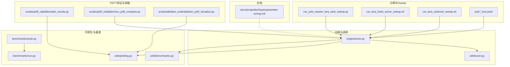
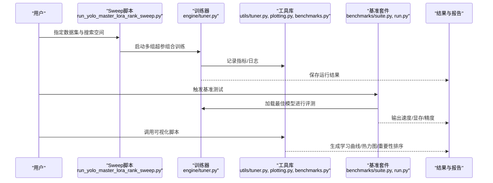
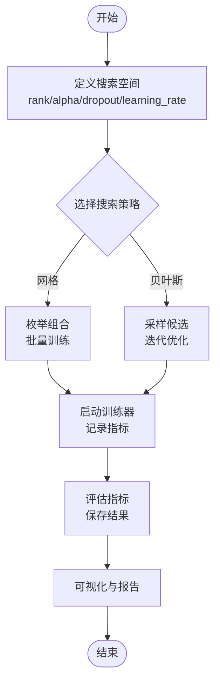
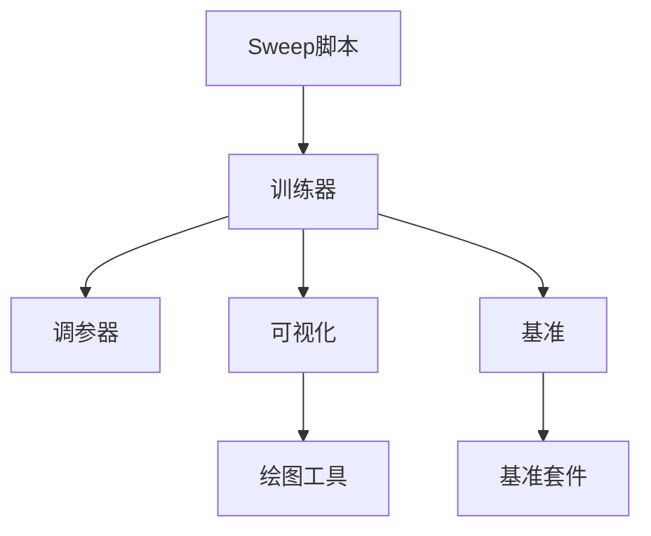

# 超参数调优指南

<cite>
**本文引用的文件**
- [examples/lora_examples/run_yolo_master_lora_rank_sweep.py](file://examples/lora_examples/run_yolo_master_lora_rank_sweep.py)
- [examples/lora_examples/run_lora_brain_tumor_sweep.sh](file://examples/lora_examples/run_lora_brain_tumor_sweep.sh)
- [examples/lora_examples/run_lora_visdrone_sweep.sh](file://examples/lora_examples/run_lora_visdrone_sweep.sh)
- [examples/lora_examples/yolo11_lora.yaml](file://examples/lora_examples/yolo11_lora.yaml)
- [examples/lora_examples/yolo12_lora.yaml](file://examples/lora_examples/yolo12_lora.yaml)
- [examples/lora_examples/yolov8_lora.yaml](file://examples/lora_examples/yolov8_lora.yaml)
- [examples/lora_examples/yolo_master_lora_README.md](file://examples/lora_examples/yolo_master_lora_README.md)
- [ultralytics/utils/tuner.py](file://ultralytics/utils/tuner.py)
- [ultralytics/engine/tuner.py](file://ultralytics/engine/tuner.py)
- [ultralytics/utils/plotting.py](file://ultralytics/utils/plotting.py)
- [ultralytics/utils/benchmarks.py](file://ultralytics/utils/benchmarks.py)
- [scripts/ablation_suite/ablation_peft_visualize.py](file://scripts/ablation_suite/ablation_peft_visualize.py)
- [scripts/peft_validation/plot_results.py](file://scripts/peft_validation/plot_results.py)
- [scripts/peft_validation/run_peft_compare.py](file://scripts/peft_validation/run_peft_compare.py)
- [benchmarks/suite.py](file://benchmarks/suite.py)
- [benchmarks/run.py](file://benchmarks/run.py)
- [examples/molora/compare_coco128_fast.py](file://examples/molora/compare_coco128_fast.py)
- [examples/molora/compare_lora_molora.py](file://examples/molora/compare_lora_molora.py)
- [examples/molora/basic_finetune.py](file://examples/molora/basic_finetune.py)
- [docs/en/guides/hyperparameter-tuning.md](file://docs/en/guides/hyperparameter-tuning.md)
</cite>

## 目录
1. [简介](#简介)
2. [项目结构](#项目结构)
3. [核心组件](#核心组件)
4. [架构总览](#架构总览)
5. [详细组件分析](#详细组件分析)
6. [依赖关系分析](#依赖关系分析)
7. [性能考量](#性能考量)
8. [故障排查指南](#故障排查指南)
9. [结论](#结论)
10. [附录](#附录)

## 简介
本指南面向在YOLO-Master上使用PEFT（以LoRA为主）进行高效微调的工程师与研究者，聚焦以下目标：
- 解释LoRA关键超参数的作用与调优策略（rank、alpha、dropout、learning_rate等）
- 提供网格搜索与贝叶斯优化的自动化调参方法，包括sweep脚本的使用与配置
- 总结不同数据集与任务的最佳超参数范围与经验值
- 文档化超参数敏感性分析与重要性排序方法
- 建立自动化的批量实验管理与结果跟踪系统
- 解释学习率调度、权重衰减与正则化技术的调优方法
- 包含性能基准测试与收敛性分析
- 提供调优结果的可视化与报告生成工具
- 给出过拟合检测与防止策略

## 项目结构
围绕PEFT/LoRA超参调优的相关代码与资源主要分布在如下位置：
- 示例与Sweep脚本：examples/lora_examples
- 训练器与调参器：ultralytics/engine/tuner.py、ultralytics/utils/tuner.py
- 可视化与基准：ultralytics/utils/plotting.py、ultralytics/utils/benchmarks.py、benchmarks/*
- PEFT验证与对比：scripts/peft_validation/*
- 消融与可视化：scripts/ablation_suite/*
- 文档：docs/en/guides/hyperparameter-tuning.md

图表来源
- [examples/lora_examples/run_yolo_master_lora_rank_sweep.py](file://examples/lora_examples/run_yolo_master_lora_rank_sweep.py)
- [examples/lora_examples/run_lora_brain_tumor_sweep.sh](file://examples/lora_examples/run_lora_brain_tumor_sweep.sh)
- [examples/lora_examples/run_lora_visdrone_sweep.sh](file://examples/lora_examples/run_lora_visdrone_sweep.sh)
- [examples/lora_examples/yolo11_lora.yaml](file://examples/lora_examples/yolo11_lora.yaml)
- [examples/lora_examples/yolo12_lora.yaml](file://examples/lora_examples/yolo12_lora.yaml)
- [examples/lora_examples/yolov8_lora.yaml](file://examples/lora_examples/yolov8_lora.yaml)
- [ultralytics/engine/tuner.py](file://ultralytics/engine/tuner.py)
- [ultralytics/utils/tuner.py](file://ultralytics/utils/tuner.py)
- [ultralytics/utils/plotting.py](file://ultralytics/utils/plotting.py)
- [ultralytics/utils/benchmarks.py](file://ultralytics/utils/benchmarks.py)
- [benchmarks/suite.py](file://benchmarks/suite.py)
- [benchmarks/run.py](file://benchmarks/run.py)
- [scripts/peft_validation/plot_results.py](file://scripts/peft_validation/plot_results.py)
- [scripts/peft_validation/run_peft_compare.py](file://scripts/peft_validation/run_peft_compare.py)
- [scripts/ablation_suite/ablation_peft_visualize.py](file://scripts/ablation_suite/ablation_peft_visualize.py)
- [docs/en/guides/hyperparameter-tuning.md](file://docs/en/guides/hyperparameter-tuning.md)

章节来源
- [examples/lora_examples/run_yolo_master_lora_rank_sweep.py](file://examples/lora_examples/run_yolo_master_lora_rank_sweep.py)
- [examples/lora_examples/run_lora_brain_tumor_sweep.sh](file://examples/lora_examples/run_lora_brain_tumor_sweep.sh)
- [examples/lora_examples/run_lora_visdrone_sweep.sh](file://examples/lora_examples/run_lora_visdrone_sweep.sh)
- [examples/lora_examples/yolo11_lora.yaml](file://examples/lora_examples/yolo11_lora.yaml)
- [examples/lora_examples/yolo12_lora.yaml](file://examples/lora_examples/yolo12_lora.yaml)
- [examples/lora_examples/yolov8_lora.yaml](file://examples/lora_examples/yolov8_lora.yaml)
- [ultralytics/engine/tuner.py](file://ultralytics/engine/tuner.py)
- [ultralytics/utils/tuner.py](file://ultralytics/utils/tuner.py)
- [ultralytics/utils/plotting.py](file://ultralytics/utils/plotting.py)
- [ultralytics/utils/benchmarks.py](file://ultralytics/utils/benchmarks.py)
- [benchmarks/suite.py](file://benchmarks/suite.py)
- [benchmarks/run.py](file://benchmarks/run.py)
- [scripts/peft_validation/plot_results.py](file://scripts/peft_validation/plot_results.py)
- [scripts/peft_validation/run_peft_compare.py](file://scripts/peft_validation/run_peft_compare.py)
- [scripts/ablation_suite/ablation_peft_visualize.py](file://scripts/ablation_suite/ablation_peft_visualize.py)
- [docs/en/guides/hyperparameter-tuning.md](file://docs/en/guides/hyperparameter-tuning.md)

## 核心组件
- LoRA关键超参数
  - rank：低秩矩阵的秩，控制可训练参数规模与表达能力。通常从较小值开始，逐步增大观察收益递减点。
  - alpha：缩放系数，影响LoRA更新幅度。常与rank配合使用，保持alpha/rank比值稳定有助于稳定性。
  - dropout：LoRA模块内的随机失活，用于缓解过拟合，尤其在数据量有限时有效。
  - learning_rate：主学习率，对收敛速度与稳定性至关重要；建议结合调度器与warmup。
- 训练与调参引擎
  - 训练器负责加载模型、数据、优化器与调度器，执行训练循环并记录指标。
  - 调参器封装了搜索策略（网格/贝叶斯）、并行执行、结果聚合与可视化。
- 可视化与基准
  - 绘图工具用于绘制学习曲线、超参热力图、重要性排序等。
  - 基准套件用于统一评测推理速度、显存占用与精度指标。
- PEFT验证与消融
  - 提供对比脚本与可视化脚本，便于快速评估不同LoRA配置的效果差异。

章节来源
- [ultralytics/engine/tuner.py](file://ultralytics/engine/tuner.py)
- [ultralytics/utils/tuner.py](file://ultralytics/utils/tuner.py)
- [ultralytics/utils/plotting.py](file://ultralytics/utils/plotting.py)
- [ultralytics/utils/benchmarks.py](file://ultralytics/utils/benchmarks.py)
- [scripts/peft_validation/plot_results.py](file://scripts/peft_validation/plot_results.py)
- [scripts/peft_validation/run_peft_compare.py](file://scripts/peft_validation/run_peft_compare.py)
- [scripts/ablation_suite/ablation_peft_visualize.py](file://scripts/ablation_suite/ablation_peft_visualize.py)

## 架构总览
下图展示了从Sweep脚本到训练器、可视化与基准的整体流程。

图表来源
- [examples/lora_examples/run_yolo_master_lora_rank_sweep.py](file://examples/lora_examples/run_yolo_master_lora_rank_sweep.py)
- [ultralytics/engine/tuner.py](file://ultralytics/engine/tuner.py)
- [ultralytics/utils/tuner.py](file://ultralytics/utils/tuner.py)
- [ultralytics/utils/plotting.py](file://ultralytics/utils/plotting.py)
- [ultralytics/utils/benchmarks.py](file://ultralytics/utils/benchmarks.py)
- [benchmarks/suite.py](file://benchmarks/suite.py)
- [benchmarks/run.py](file://benchmarks/run.py)

## 详细组件分析

### LoRA关键超参数与作用机制
- rank
  - 作用：决定低秩分解的维度，直接影响可训练参数量与模型容量。
  - 调优建议：从小值起步（如4/8），观察验证集指标提升是否饱和；过大可能引入过拟合风险。
- alpha
  - 作用：缩放LoRA增量，影响更新步长与稳定性。
  - 调优建议：与rank保持合理比例（例如alpha≈rank或略小），避免过大导致震荡。
- dropout
  - 作用：在LoRA路径上引入随机失活，增强泛化能力。
  - 调优建议：在小样本场景下尝试中等值（如0.05~0.2），随数据量增加可降低。
- learning_rate
  - 作用：控制参数更新步幅，对收敛速度与稳定性影响显著。
  - 调优建议：结合warmup与余弦退火等调度器；优先在较小范围内精细搜索。

章节来源
- [examples/lora_examples/yolo11_lora.yaml](file://examples/lora_examples/yolo11_lora.yaml)
- [examples/lora_examples/yolo12_lora.yaml](file://examples/lora_examples/yolo12_lora.yaml)
- [examples/lora_examples/yolov8_lora.yaml](file://examples/lora_examples/yolov8_lora.yaml)
- [docs/en/guides/hyperparameter-tuning.md](file://docs/en/guides/hyperparameter-tuning.md)

### 网格搜索与贝叶斯优化自动化调参
- 网格搜索
  - 通过Sweep脚本定义离散超参组合，批量启动训练任务，适合小规模搜索空间。
  - 参考脚本：
    - [examples/lora_examples/run_yolo_master_lora_rank_sweep.py](file://examples/lora_examples/run_yolo_master_lora_rank_sweep.py)
    - [examples/lora_examples/run_lora_brain_tumor_sweep.sh](file://examples/lora_examples/run_lora_brain_tumor_sweep.sh)
    - [examples/lora_examples/run_lora_visdrone_sweep.sh](file://examples/lora_examples/run_lora_visdrone_sweep.sh)
- 贝叶斯优化
  - 利用调参器内置的采样与选择策略，在连续或混合空间中更高效地探索最优解。
  - 参考实现：
    - [ultralytics/utils/tuner.py](file://ultralytics/utils/tuner.py)
    - [ultralytics/engine/tuner.py](file://ultralytics/engine/tuner.py)

图表来源
- [examples/lora_examples/run_yolo_master_lora_rank_sweep.py](file://examples/lora_examples/run_yolo_master_lora_rank_sweep.py)
- [examples/lora_examples/run_lora_brain_tumor_sweep.sh](file://examples/lora_examples/run_lora_brain_tumor_sweep.sh)
- [examples/lora_examples/run_lora_visdrone_sweep.sh](file://examples/lora_examples/run_lora_visdrone_sweep.sh)
- [ultralytics/utils/tuner.py](file://ultralytics/utils/tuner.py)
- [ultralytics/engine/tuner.py](file://ultralytics/engine/tuner.py)

章节来源
- [examples/lora_examples/run_yolo_master_lora_rank_sweep.py](file://examples/lora_examples/run_yolo_master_lora_rank_sweep.py)
- [examples/lora_examples/run_lora_brain_tumor_sweep.sh](file://examples/lora_examples/run_lora_brain_tumor_sweep.sh)
- [examples/lora_examples/run_lora_visdrone_sweep.sh](file://examples/lora_examples/run_lora_visdrone_sweep.sh)
- [ultralytics/utils/tuner.py](file://ultralytics/utils/tuner.py)
- [ultralytics/engine/tuner.py](file://ultralytics/engine/tuner.py)

### 不同数据集与任务的经验范围
- 小样本/细粒度任务（如脑肿瘤分割）
  - 倾向较小的rank与alpha，适度dropout，较低的学习率配合warmup。
  - 参考Sweep脚本：[examples/lora_examples/run_lora_brain_tumor_sweep.sh](file://examples/lora_examples/run_lora_brain_tumor_sweep.sh)
- 大规模通用检测（如VisDrone）
  - 可适当提高rank与alpha，降低dropout，学习率可在较宽范围搜索并结合调度器。
  - 参考Sweep脚本：[examples/lora_examples/run_lora_visdrone_sweep.sh](file://examples/lora_examples/run_lora_visdrone_sweep.sh)
- 模型系列差异（YOLO11/YOLO12/YOLOv8）
  - 不同模型结构的特征提取与检测头复杂度不同，需分别校准LoRA插入位置与超参范围。
  - 参考配置文件：
    - [examples/lora_examples/yolo11_lora.yaml](file://examples/lora_examples/yolo11_lora.yaml)
    - [examples/lora_examples/yolo12_lora.yaml](file://examples/lora_examples/yolo12_lora.yaml)
    - [examples/lora_examples/yolov8_lora.yaml](file://examples/lora_examples/yolov8_lora.yaml)

章节来源
- [examples/lora_examples/run_lora_brain_tumor_sweep.sh](file://examples/lora_examples/run_lora_brain_tumor_sweep.sh)
- [examples/lora_examples/run_lora_visdrone_sweep.sh](file://examples/lora_examples/run_lora_visdrone_sweep.sh)
- [examples/lora_examples/yolo11_lora.yaml](file://examples/lora_examples/yolo11_lora.yaml)
- [examples/lora_examples/yolo12_lora.yaml](file://examples/lora_examples/yolo12_lora.yaml)
- [examples/lora_examples/yolov8_lora.yaml](file://examples/lora_examples/yolov8_lora.yaml)

### 超参数敏感性分析与重要性排序
- 敏感性分析
  - 通过单变量扫描或多维热力图观察指标对超参变化的响应。
  - 参考可视化脚本：
    - [scripts/ablation_suite/ablation_peft_visualize.py](file://scripts/ablation_suite/ablation_peft_visualize.py)
    - [scripts/peft_validation/plot_results.py](file://scripts/peft_validation/plot_results.py)
- 重要性排序
  - 基于多组实验结果计算各超参对目标指标的贡献度（如方差解释、相关性）。
  - 参考绘图工具：
    - [ultralytics/utils/plotting.py](file://ultralytics/utils/plotting.py)

章节来源
- [scripts/ablation_suite/ablation_peft_visualize.py](file://scripts/ablation_suite/ablation_peft_visualize.py)
- [scripts/peft_validation/plot_results.py](file://scripts/peft_validation/plot_results.py)
- [ultralytics/utils/plotting.py](file://ultralytics/utils/plotting.py)

### 自动化批量实验管理与结果跟踪
- 批量管理
  - 使用Sweep脚本与Shell包装脚本组织多任务，支持并发与失败重试。
  - 参考：
    - [examples/lora_examples/run_yolo_master_lora_rank_sweep.py](file://examples/lora_examples/run_yolo_master_lora_rank_sweep.py)
    - [examples/lora_examples/run_lora_brain_tumor_sweep.sh](file://examples/lora_examples/run_lora_brain_tumor_sweep.sh)
    - [examples/lora_examples/run_lora_visdrone_sweep.sh](file://examples/lora_examples/run_lora_visdrone_sweep.sh)
- 结果跟踪
  - 训练器与工具库负责记录指标、保存检查点与日志，便于后续对比与复现。
  - 参考：
    - [ultralytics/engine/tuner.py](file://ultralytics/engine/tuner.py)
    - [ultralytics/utils/tuner.py](file://ultralytics/utils/tuner.py)

章节来源
- [examples/lora_examples/run_yolo_master_lora_rank_sweep.py](file://examples/lora_examples/run_yolo_master_lora_rank_sweep.py)
- [examples/lora_examples/run_lora_brain_tumor_sweep.sh](file://examples/lora_examples/run_lora_brain_tumor_sweep.sh)
- [examples/lora_examples/run_lora_visdrone_sweep.sh](file://examples/lora_examples/run_lora_visdrone_sweep.sh)
- [ultralytics/engine/tuner.py](file://ultralytics/engine/tuner.py)
- [ultralytics/utils/tuner.py](file://ultralytics/utils/tuner.py)

### 学习率调度、权重衰减与正则化
- 学习率调度
  - 推荐结合warmup与余弦退火，避免初期震荡与后期停滞。
  - 参考训练器与工具库：
    - [ultralytics/engine/tuner.py](file://ultralytics/engine/tuner.py)
    - [ultralytics/utils/tuner.py](file://ultralytics/utils/tuner.py)
- 权重衰减与正则化
  - 权重衰减作为L2正则项，抑制过拟合；配合dropout与数据增强效果更佳。
  - 参考配置文件与文档：
    - [examples/lora_examples/yolo11_lora.yaml](file://examples/lora_examples/yolo11_lora.yaml)
    - [docs/en/guides/hyperparameter-tuning.md](file://docs/en/guides/hyperparameter-tuning.md)

章节来源
- [ultralytics/engine/tuner.py](file://ultralytics/engine/tuner.py)
- [ultralytics/utils/tuner.py](file://ultralytics/utils/tuner.py)
- [examples/lora_examples/yolo11_lora.yaml](file://examples/lora_examples/yolo11_lora.yaml)
- [docs/en/guides/hyperparameter-tuning.md](file://docs/en/guides/hyperparameter-tuning.md)

### 性能基准测试与收敛性分析
- 基准测试
  - 使用基准套件统一评测推理速度、显存占用与精度，确保调优后仍满足部署需求。
  - 参考：
    - [benchmarks/suite.py](file://benchmarks/suite.py)
    - [benchmarks/run.py](file://benchmarks/run.py)
    - [ultralytics/utils/benchmarks.py](file://ultralytics/utils/benchmarks.py)
- 收敛性分析
  - 通过训练曲线与验证曲线判断是否收敛、是否存在欠拟合或过拟合。
  - 参考可视化脚本：
    - [scripts/peft_validation/plot_results.py](file://scripts/peft_validation/plot_results.py)
    - [ultralytics/utils/plotting.py](file://ultralytics/utils/plotting.py)

章节来源
- [benchmarks/suite.py](file://benchmarks/suite.py)
- [benchmarks/run.py](file://benchmarks/run.py)
- [ultralytics/utils/benchmarks.py](file://ultralytics/utils/benchmarks.py)
- [scripts/peft_validation/plot_results.py](file://scripts/peft_validation/plot_results.py)
- [ultralytics/utils/plotting.py](file://ultralytics/utils/plotting.py)

### 调优结果可视化与报告生成
- 可视化
  - 绘制学习曲线、超参热力图、重要性排序等，辅助决策。
  - 参考：
    - [ultralytics/utils/plotting.py](file://ultralytics/utils/plotting.py)
    - [scripts/ablation_suite/ablation_peft_visualize.py](file://scripts/ablation_suite/ablation_peft_visualize.py)
- 报告生成
  - 汇总多组实验结果，输出可读报告，便于团队共享与归档。
  - 参考：
    - [examples/lora_examples/yolo_master_lora_README.md](file://examples/lora_examples/yolo_master_lora_README.md)

章节来源
- [ultralytics/utils/plotting.py](file://ultralytics/utils/plotting.py)
- [scripts/ablation_suite/ablation_peft_visualize.py](file://scripts/ablation_suite/ablation_peft_visualize.py)
- [examples/lora_examples/yolo_master_lora_README.md](file://examples/lora_examples/yolo_master_lora_README.md)

### 过拟合检测与防止策略
- 检测方法
  - 观察训练损失与验证损失的差距；若验证损失上升而训练损失下降，可能存在过拟合。
  - 参考可视化脚本：
    - [scripts/peft_validation/plot_results.py](file://scripts/peft_validation/plot_results.py)
- 防止策略
  - 调整dropout、降低rank/alpha、引入权重衰减与数据增强、缩短训练轮次或使用早停。
  - 参考：
    - [ultralytics/utils/plotting.py](file://ultralytics/utils/plotting.py)
    - [docs/en/guides/hyperparameter-tuning.md](file://docs/en/guides/hyperparameter-tuning.md)

章节来源
- [scripts/peft_validation/plot_results.py](file://scripts/peft_validation/plot_results.py)
- [ultralytics/utils/plotting.py](file://ultralytics/utils/plotting.py)
- [docs/en/guides/hyperparameter-tuning.md](file://docs/en/guides/hyperparameter-tuning.md)

## 依赖关系分析
- 组件耦合
  - Sweep脚本依赖训练器与工具库；训练器依赖调参器与可视化/基准工具。
- 外部集成
  - 基准套件与可视化脚本为独立模块，便于扩展新的评测指标与图表类型。

图表来源
- [examples/lora_examples/run_yolo_master_lora_rank_sweep.py](file://examples/lora_examples/run_yolo_master_lora_rank_sweep.py)
- [ultralytics/engine/tuner.py](file://ultralytics/engine/tuner.py)
- [ultralytics/utils/tuner.py](file://ultralytics/utils/tuner.py)
- [ultralytics/utils/plotting.py](file://ultralytics/utils/plotting.py)
- [ultralytics/utils/benchmarks.py](file://ultralytics/utils/benchmarks.py)
- [benchmarks/suite.py](file://benchmarks/suite.py)
- [benchmarks/run.py](file://benchmarks/run.py)

章节来源
- [examples/lora_examples/run_yolo_master_lora_rank_sweep.py](file://examples/lora_examples/run_yolo_master_lora_rank_sweep.py)
- [ultralytics/engine/tuner.py](file://ultralytics/engine/tuner.py)
- [ultralytics/utils/tuner.py](file://ultralytics/utils/tuner.py)
- [ultralytics/utils/plotting.py](file://ultralytics/utils/plotting.py)
- [ultralytics/utils/benchmarks.py](file://ultralytics/utils/benchmarks.py)
- [benchmarks/suite.py](file://benchmarks/suite.py)
- [benchmarks/run.py](file://benchmarks/run.py)

## 性能考量
- 显存与吞吐
  - rank越大，显存占用越高；可通过梯度累积或减小batch size平衡。
- 收敛速度
  - 学习率调度与warmup能显著提升收敛稳定性；过小或过大都会导致震荡或停滞。
- 泛化能力
  - 适当dropout与权重衰减有助于提升泛化；但过度正则会欠拟合。

## 故障排查指南
- 常见问题
  - 训练不收敛：检查学习率与调度器设置；确认数据预处理与标签格式正确。
  - 显存溢出：降低rank或batch size；启用混合精度或梯度裁剪。
  - 结果不可复现：固定随机种子与版本依赖；记录完整超参与环境信息。
- 定位与诊断
  - 使用可视化脚本绘制训练/验证曲线，定位异常阶段。
  - 使用基准套件验证推理性能，排除部署侧问题。

章节来源
- [scripts/peft_validation/plot_results.py](file://scripts/peft_validation/plot_results.py)
- [ultralytics/utils/benchmarks.py](file://ultralytics/utils/benchmarks.py)

## 结论
通过系统化的超参搜索、可视化工具与基准评测，可以在YOLO-Master上高效完成PEFT/LoRA的微调与优化。建议从小规模网格搜索起步，逐步过渡到贝叶斯优化，并结合敏感性分析与重要性排序指导最终配置选择。同时，重视过拟合检测与防止策略，确保模型在真实场景中具备稳健的性能与泛化能力。

## 附录
- 相关文档与示例
  - [examples/lora_examples/yolo_master_lora_README.md](file://examples/lora_examples/yolo_master_lora_README.md)
  - [docs/en/guides/hyperparameter-tuning.md](file://docs/en/guides/hyperparameter-tuning.md)
- 对比与消融
  - [examples/molora/compare_coco128_fast.py](file://examples/molora/compare_coco128_fast.py)
  - [examples/molora/compare_lora_molora.py](file://examples/molora/compare_lora_molora.py)
  - [examples/molora/basic_finetune.py](file://examples/molora/basic_finetune.py)
  - [scripts/peft_validation/run_peft_compare.py](file://scripts/peft_validation/run_peft_compare.py)