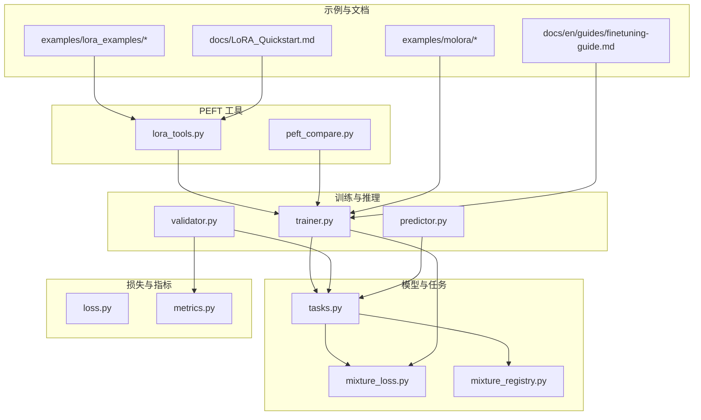
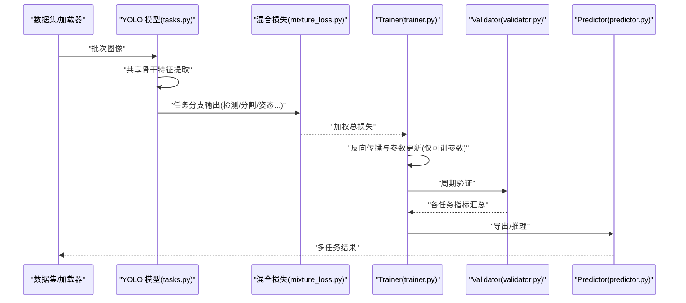
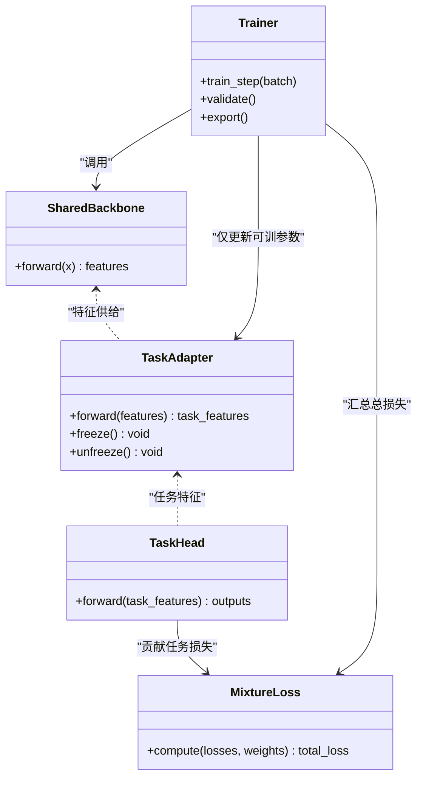
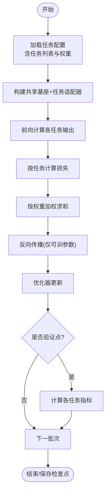
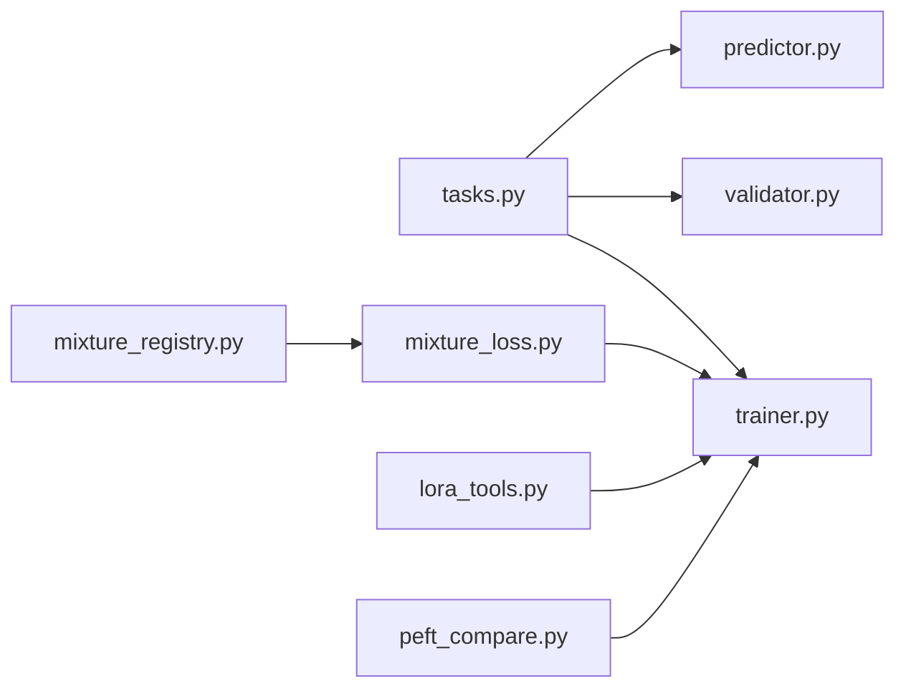

# 多任务学习应用

<cite>
**本文引用的文件**
- [README.md](file://README.md)
- [yolo_master_advanced_modules_analysis.md](file://yolo_master_advanced_modules_analysis.md)
- [YOLO-Master-v260721-MoA-MoE-MoT-PEFT-Planner-深度分析-v4.md](file://YOLO-Master-v260721-MoA-MoE-MoT-PEFT-Planner-深度分析-v4.md)
- [molora_guide.md](file://molora_guide.md)
- [LoRA_Quickstart.md](file://docs/LoRA_Quickstart.md)
- [finetuning-guide.md](file://docs/en/guides/finetuning-guide.md)
- [yolo-architecture.md](file://docs/en/guides/yolo-architecture.md)
- [yolo-performance-metrics.md](file://docs/en/guides/yolo-performance-metrics.md)
- [train-args.md](file://docs/macros/train-args.md)
- [validation-args.md](file://docs/macros/validation-args.md)
- [predict-args.md](file://docs/macros/predict-args.md)
- [export-args.md](file://docs/macros/export-args.md)
- [augmentation-args.md](file://docs/macros/augmentation-args.md)
- [model-yaml-config.md](file://docs/en/guides/model-yaml-config.md)
- [mixture_loss.py](file://ultralytics/nn/mixture_loss.py)
- [mixture_registry.py](file://ultralytics/nn/mixture_registry.py)
- [tasks.py](file://ultralytics/nn/tasks.py)
- [trainer.py](file://ultralytics/engine/trainer.py)
- [validator.py](file://ultralytics/engine/validator.py)
- [predictor.py](file://ultralytics/engine/predictor.py)
- [loss.py](file://ultralytics/utils/loss.py)
- [metrics.py](file://ultralytics/utils/metrics.py)
- [lora_tools.py](file://agent/runtime/cli/lora_tools.py)
- [peft_compare.py](file://agent/runtime/cli/peft_compare.py)
- [test_mixture_loss_composition.py](file://tests/test_mixture_loss_composition.py)
- [test_moe_aware_peft.py](file://tests/test_moe_aware_peft.py)
- [test_peft_adapters.py](file://tests/test_peft_adapters.py)
- [run_lora_brain_tumor_sweep.sh](file://examples/lora_examples/run_lora_brain_tumor_sweep.sh)
- [run_yolo_master_lora_rank_sweep.py](file://examples/lora_examples/run_yolo_master_lora_rank_sweep.py)
- [compare_coco128_fast.py](file://examples/molora/compare_coco128_fast.py)
- [continual_learning.py](file://examples/molora/continual_learning.py)
</cite>

## 目录
1. [简介](#简介)
2. [项目结构](#项目结构)
3. [核心组件](#核心组件)
4. [架构总览](#架构总览)
5. [详细组件分析](#详细组件分析)
6. [依赖关系分析](#依赖关系分析)
7. [性能考量](#性能考量)
8. [故障排查指南](#故障排查指南)
9. [结论](#结论)
10. [附录](#附录)

## 简介
本文件面向在 YOLO-Master 上实现“多任务学习 + 参数高效微调（PEFT）”的工程师与研究者，聚焦以下目标：
- 解释共享基座与任务特定适配器的架构设计、参数共享策略与梯度隔离机制
- 说明多任务训练配置方法，包括任务权重平衡与损失函数组合
- 提供检测、分割、姿态估计等多任务联合训练的端到端示例路径
- 阐述任务间知识迁移机制与优化策略
- 给出多任务学习的评估方法与指标选择建议
- 展示工业检测系统同时处理多个视觉任务的实践方案

## 项目结构
围绕多任务学习与 PEFT 的关键代码与文档分布在如下位置：
- 模型与任务定义：ultralytics/nn/tasks.py、ultralytics/nn/mixture_loss.py、ultralytics/nn/mixture_registry.py
- 训练/验证/推理管线：ultralytics/engine/{trainer, validator, predictor}.py
- 损失与指标：ultralytics/utils/loss.py、ultralytics/utils/metrics.py
- PEFT/Lora 工具与对比脚本：agent/runtime/cli/{lora_tools, peft_compare}.py
- 测试用例：tests/test_mixture_loss_composition.py、tests/test_moe_aware_peft.py、tests/test_peft_adapters.py
- 示例与快速开始：examples/lora_examples/*、examples/molora/*、docs/LoRA_Quickstart.md、docs/en/guides/finetuning-guide.md
- 宏参数参考：docs/macros/{train, validation, predict, export, augmentation}-args.md
- 架构与性能文档：docs/en/guides/{yolo-architecture, yolo-performance-metrics}.md

图表来源
- [tasks.py](file://ultralytics/nn/tasks.py)
- [mixture_loss.py](file://ultralytics/nn/mixture_loss.py)
- [mixture_registry.py](file://ultralytics/nn/mixture_registry.py)
- [trainer.py](file://ultralytics/engine/trainer.py)
- [validator.py](file://ultralytics/engine/validator.py)
- [predictor.py](file://ultralytics/engine/predictor.py)
- [loss.py](file://ultralytics/utils/loss.py)
- [metrics.py](file://ultralytics/utils/metrics.py)
- [lora_tools.py](file://agent/runtime/cli/lora_tools.py)
- [peft_compare.py](file://agent/runtime/cli/peft_compare.py)
- [run_lora_brain_tumor_sweep.sh](file://examples/lora_examples/run_lora_brain_tumor_sweep.sh)
- [run_yolo_master_lora_rank_sweep.py](file://examples/lora_examples/run_yolo_master_lora_rank_sweep.py)
- [compare_coco128_fast.py](file://examples/molora/compare_coco128_fast.py)
- [continual_learning.py](file://examples/molora/continual_learning.py)
- [LoRA_Quickstart.md](file://docs/LoRA_Quickstart.md)
- [finetuning-guide.md](file://docs/en/guides/finetuning-guide.md)

章节来源
- [README.md](file://README.md)
- [yolo_master_advanced_modules_analysis.md](file://yolo_master_advanced_modules_analysis.md)
- [YOLO-Master-v260721-MoA-MoE-MoT-PEFT-Planner-深度分析-v4.md](file://YOLO-Master-v260721-MoA-MoE-MoT-PEFT-Planner-深度分析-v4.md)
- [molora_guide.md](file://molora_guide.md)

## 核心组件
- 共享基座与任务头
  - 共享特征提取器（Backbone）在多任务中统一复用，降低参数量并促进跨任务表征迁移。
  - 任务特定适配器（如 LoRA、MoA/MoE 路由专家等）以轻量模块形式挂载于关键层或任务头前，实现参数高效更新与梯度隔离。
- 多任务损失组合
  - 通过混合损失注册表与组合器将不同任务的损失加权求和，支持动态权重与任务感知调度。
- 训练/验证/推理流水线
  - Trainer 负责多任务前向、损失计算、反向传播与优化器更新；Validator 聚合各任务指标；Predictor 支持多任务输出拼装。
- PEFT 工具链
  - LoRA 工具与对比脚本用于快速装配、冻结/解冻策略控制、权重合并与评测对比。

章节来源
- [tasks.py](file://ultralytics/nn/tasks.py)
- [mixture_loss.py](file://ultralytics/nn/mixture_loss.py)
- [mixture_registry.py](file://ultralytics/nn/mixture_registry.py)
- [trainer.py](file://ultralytics/engine/trainer.py)
- [validator.py](file://ultralytics/engine/validator.py)
- [predictor.py](file://ultralytics/engine/predictor.py)
- [lora_tools.py](file://agent/runtime/cli/lora_tools.py)
- [peft_compare.py](file://agent/runtime/cli/peft_compare.py)

## 架构总览
下图展示了“共享基座 + 多任务适配器”的整体数据流与控制流：输入图像经共享骨干网络得到通用特征，随后按任务分发到各自适配器与任务头，分别计算任务损失并在 Trainer 中汇总进行反向传播。

图表来源
- [tasks.py](file://ultralytics/nn/tasks.py)
- [mixture_loss.py](file://ultralytics/nn/mixture_loss.py)
- [trainer.py](file://ultralytics/engine/trainer.py)
- [validator.py](file://ultralytics/engine/validator.py)
- [predictor.py](file://ultralytics/engine/predictor.py)

## 详细组件分析

### 共享基座与任务特定适配器
- 参数共享策略
  - Backbone 在所有任务中共享，最大化表征复用；任务头与适配器独立，避免负迁移。
  - 通过 PEFT 规划器（见相关深度分析文档）自动识别可插入适配器的位置，并以最小改动注入。
- 梯度隔离机制
  - 仅对适配器与任务头参与反向传播；共享基座可通过冻结或低秩更新（如 LoRA）限制梯度范围。
  - 多任务场景下，不同任务的梯度仅在各自分支内累积，减少相互干扰。

图表来源
- [tasks.py](file://ultralytics/nn/tasks.py)
- [mixture_loss.py](file://ultralytics/nn/mixture_loss.py)
- [trainer.py](file://ultralytics/engine/trainer.py)

章节来源
- [YOLO-Master-v260721-MoA-MoE-MoT-PEFT-Planner-深度分析-v4.md](file://YOLO-Master-v260721-MoA-MoE-MoT-PEFT-Planner-深度分析-v4.md)
- [molora_guide.md](file://molora_guide.md)
- [test_moe_aware_peft.py](file://tests/test_moe_aware_peft.py)
- [test_peft_adapters.py](file://tests/test_peft_adapters.py)

### 多任务训练配置与损失组合
- 任务权重平衡
  - 使用混合损失注册表为每个任务指定权重，支持静态权重与动态调度（如基于任务难度或方差）。
  - 权重可在 YAML 配置或命令行参数中设置，便于实验扫描与复现。
- 损失函数组合
  - 检测、分割、姿态估计等任务损失由统一接口组合，Trainer 在每步计算加权总损失并进行反向传播。
  - 可通过测试用例验证组合正确性与数值稳定性。

图表来源
- [mixture_loss.py](file://ultralytics/nn/mixture_loss.py)
- [mixture_registry.py](file://ultralytics/nn/mixture_registry.py)
- [trainer.py](file://ultralytics/engine/trainer.py)
- [test_mixture_loss_composition.py](file://tests/test_mixture_loss_composition.py)

章节来源
- [mixture_loss.py](file://ultralytics/nn/mixture_loss.py)
- [mixture_registry.py](file://ultralytics/nn/mixture_registry.py)
- [test_mixture_loss_composition.py](file://tests/test_mixture_loss_composition.py)
- [train-args.md](file://docs/macros/train-args.md)

### 多任务联合训练示例（检测 + 分割 + 姿态估计）
- 示例入口
  - 使用 LoRA 示例脚本与 MOLORA 示例脚本作为起点，结合任务 YAML 配置完成多任务训练。
- 关键步骤
  - 准备多任务数据集（包含检测框、分割掩码、关键点标注），在数据配置中声明任务类型与类别数。
  - 在训练配置中启用 PEFT（如 LoRA rank、target modules），并为各任务设置权重。
  - 启动训练后，Trainer 会执行多任务前向、损失组合与反向传播；Validator 周期性输出各任务指标。
- 参考路径
  - 示例脚本与配置文件路径见下方“章节来源”。

章节来源
- [run_lora_brain_tumor_sweep.sh](file://examples/lora_examples/run_lora_brain_tumor_sweep.sh)
- [run_yolo_master_lora_rank_sweep.py](file://examples/lora_examples/run_yolo_master_lora_rank_sweep.py)
- [compare_coco128_fast.py](file://examples/molora/compare_coco128_fast.py)
- [continual_learning.py](file://examples/molora/continual_learning.py)
- [LoRA_Quickstart.md](file://docs/LoRA_Quickstart.md)
- [finetuning-guide.md](file://docs/en/guides/finetuning-guide.md)
- [model-yaml-config.md](file://docs/en/guides/model-yaml-config.md)

### 任务间知识迁移机制与优化策略
- 知识迁移
  - 共享骨干网络承载通用视觉表征，有助于检测、分割、姿态等任务间的正迁移。
  - 任务适配器保持相对独立，避免强耦合导致的负迁移。
- 优化策略
  - 分阶段训练：先预训练共享基座，再解冻部分层或逐步引入更多任务。
  - 动态权重：根据任务损失变化或验证集表现调整权重，缓解任务不平衡。
  - 正则化与早停：防止过拟合与灾难性遗忘。
  - 混合精度与梯度裁剪：提升稳定性与吞吐。

章节来源
- [YOLO-Master-v260721-MoA-MoE-MoT-PEFT-Planner-深度分析-v4.md](file://YOLO-Master-v260721-MoA-MoE-MoT-PEFT-Planner-深度分析-v4.md)
- [molora_guide.md](file://molora_guide.md)
- [train-args.md](file://docs/macros/train-args.md)

### 多任务学习评估方法与指标选择
- 指标体系
  - 检测：mAP@0.5:0.95、Precision/Recall、F1 等
  - 分割：mIoU、Dice、边界 F1
  - 姿态估计：AP、AP@50、OKS 等
- 评估流程
  - Validator 在每个任务上计算对应指标，并按任务维度汇总；可导出曲线与报告。
- 参考文档
  - 性能指标与可视化指南见“性能指标”文档。

章节来源
- [validator.py](file://ultralytics/engine/validator.py)
- [metrics.py](file://ultralytics/utils/metrics.py)
- [yolo-performance-metrics.md](file://docs/en/guides/yolo-performance-metrics.md)

### 实际应用场景：工业检测系统（多任务并行）
- 场景描述
  - 在同一产线上同时完成缺陷检测、部件分割与装配姿态估计，减少多次推理开销，提高一致性。
- 实现要点
  - 数据侧：统一标注格式，确保三类任务样本对齐。
  - 模型侧：共享骨干 + 任务适配器；合理设置任务权重与学习率。
  - 工程侧：批量推理时按任务拆分输出，统一后处理与可视化。
- 参考路径
  - 参见“预测与导出”宏参数与推理示例。

章节来源
- [predict-args.md](file://docs/macros/predict-args.md)
- [export-args.md](file://docs/macros/export-args.md)
- [predictor.py](file://ultralytics/engine/predictor.py)

## 依赖关系分析
- 模块耦合
  - tasks.py 作为模型与任务定义中心，被 trainer/validator/predictor 共同依赖。
  - mixture_loss.py 与 mixture_registry.py 提供损失组合能力，供 trainer 调用。
  - lora_tools.py 与 peft_compare.py 提供 PEFT 装配与对比评测能力。
- 外部依赖
  - PyTorch 生态（张量运算、自动微分）、可选的加速后端（CUDA/TensorRT/ONNX 等）。

图表来源
- [tasks.py](file://ultralytics/nn/tasks.py)
- [mixture_loss.py](file://ultralytics/nn/mixture_loss.py)
- [mixture_registry.py](file://ultralytics/nn/mixture_registry.py)
- [trainer.py](file://ultralytics/engine/trainer.py)
- [validator.py](file://ultralytics/engine/validator.py)
- [predictor.py](file://ultralytics/engine/predictor.py)
- [lora_tools.py](file://agent/runtime/cli/lora_tools.py)
- [peft_compare.py](file://agent/runtime/cli/peft_compare.py)

章节来源
- [tasks.py](file://ultralytics/nn/tasks.py)
- [mixture_loss.py](file://ultralytics/nn/mixture_loss.py)
- [mixture_registry.py](file://ultralytics/nn/mixture_registry.py)
- [trainer.py](file://ultralytics/engine/trainer.py)
- [validator.py](file://ultralytics/engine/validator.py)
- [predictor.py](file://ultralytics/engine/predictor.py)
- [lora_tools.py](file://agent/runtime/cli/lora_tools.py)
- [peft_compare.py](file://agent/runtime/cli/peft_compare.py)

## 性能考量
- 训练效率
  - 使用混合精度、梯度累积与数据并行（DDP）提升吞吐。
  - 合理设置 batch size 与 num_workers，避免 I/O 瓶颈。
- 显存占用
  - 冻结共享基座或使用低秩适配器显著降低显存需求。
  - 按需激活任务分支，减少不必要的前向计算。
- 部署优化
  - 导出为 ONNX/TensorRT 等格式，结合量化与算子融合降低延迟。
  - 多任务输出缓存与批处理，提高在线服务吞吐。

[本节为通用指导，不直接分析具体文件]

## 故障排查指南
- 常见问题
  - 多任务损失不收敛：检查任务权重是否失衡、学习率是否过大、是否存在 NaN。
  - 指标异常：确认标签格式与类别映射是否正确，验证集划分是否合理。
  - PEFT 未生效：确认目标模块是否匹配、冻结/解冻策略是否正确。
- 定位手段
  - 使用对比脚本与日志查看各任务损失与指标趋势。
  - 通过单元测试验证损失组合与数值稳定性。

章节来源
- [peft_compare.py](file://agent/runtime/cli/peft_compare.py)
- [test_mixture_loss_composition.py](file://tests/test_mixture_loss_composition.py)
- [test_moe_aware_peft.py](file://tests/test_moe_aware_peft.py)
- [test_peft_adapters.py](file://tests/test_peft_adapters.py)

## 结论
YOLO-Master 提供了完善的“共享基座 + 任务适配器”的多任务学习框架，结合 PEFT 技术可实现高效的参数共享与梯度隔离。通过混合损失注册表与灵活的训练/验证/推理管线，用户可以在检测、分割、姿态估计等任务上实现稳定的联合训练与迁移学习。配合丰富的示例与文档，能够快速落地到工业级多任务视觉系统中。

[本节为总结性内容，不直接分析具体文件]

## 附录
- 快速开始与指南
  - LoRA 快速入门：docs/LoRA_Quickstart.md
  - 微调指南：docs/en/guides/finetuning-guide.md
  - 模型 YAML 配置：docs/en/guides/model-yaml-config.md
- 宏参数参考
  - 训练/验证/预测/导出/增强参数：docs/macros/*.md
- 架构与性能
  - YOLO 架构与性能指标：docs/en/guides/yolo-architecture.md、docs/en/guides/yolo-performance-metrics.md

[本节为参考资料索引，不直接分析具体文件]