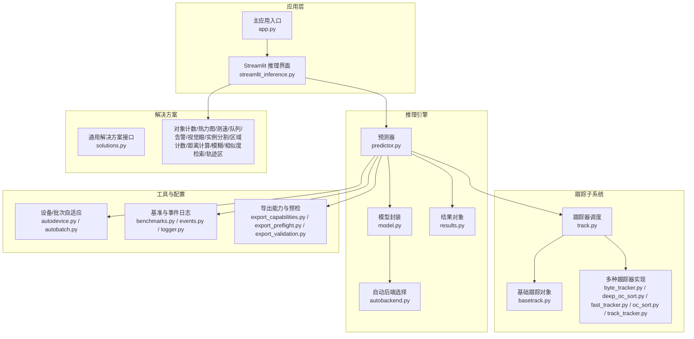
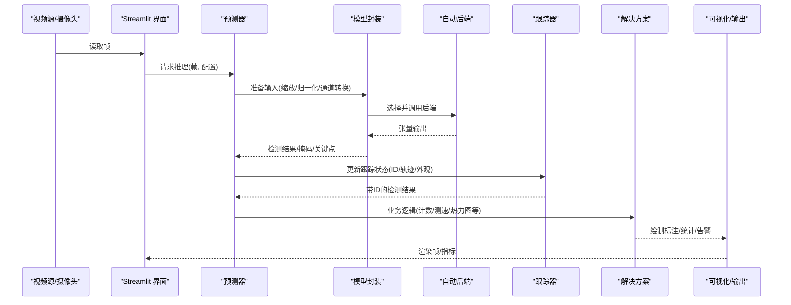
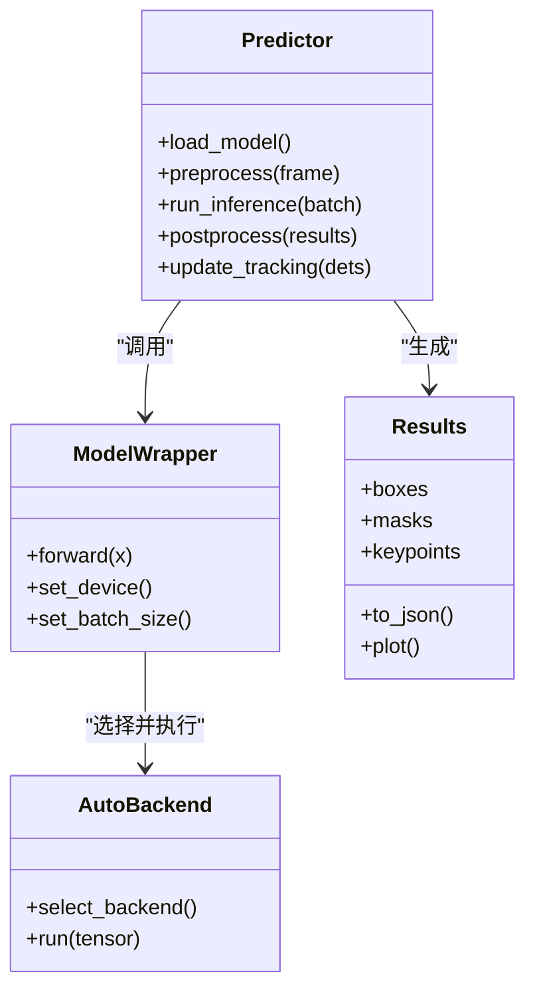
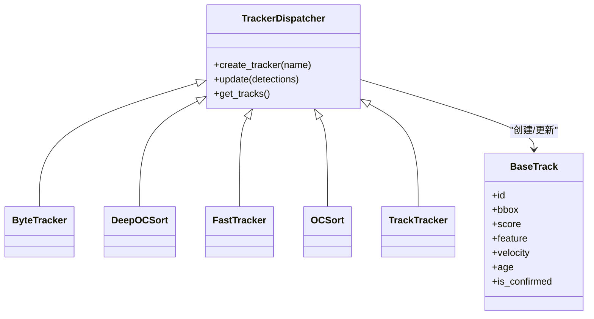
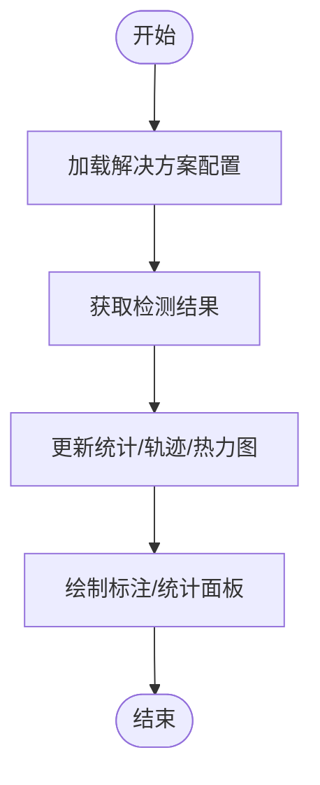
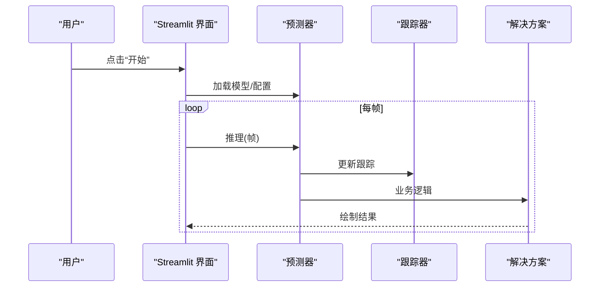
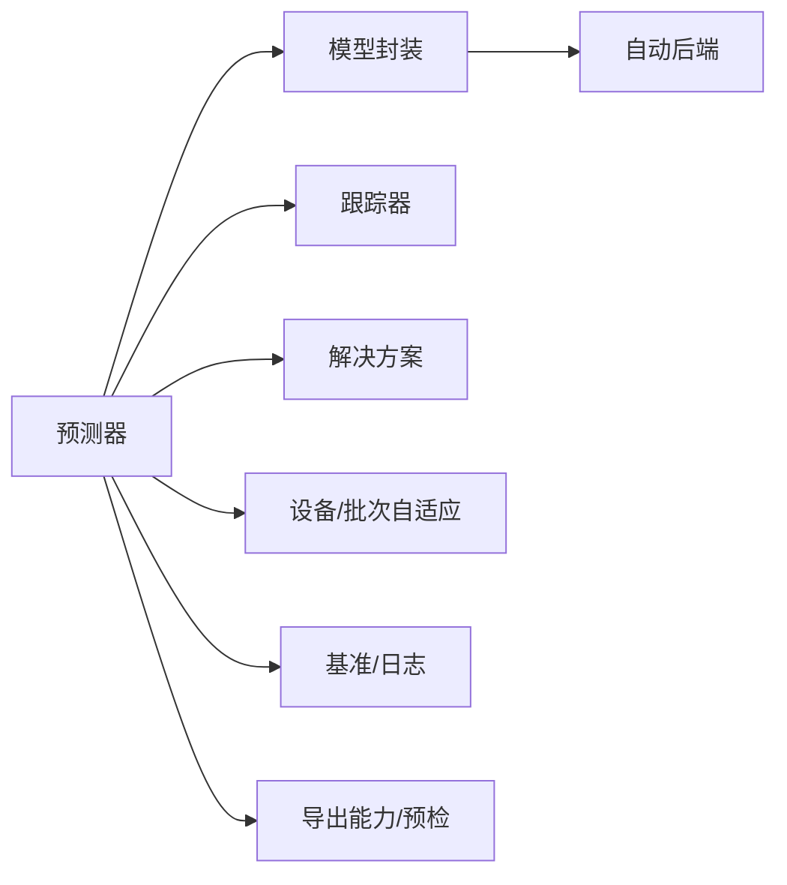

# 实时流式处理

<cite>
**本文引用的文件**
- [app.py](file://app.py)
- [streamlit_inference.py](file://ultralytics/solutions/streamlit_inference.py)
- [predictor.py](file://ultralytics/engine/predictor.py)
- [model.py](file://ultralytics/engine/model.py)
- [autobackend.py](file://ultralytics/nn/autobackend.py)
- [results.py](file://ultralytics/engine/results.py)
- [track.py](file://ultralytics/trackers/track.py)
- [basetrack.py](file://ultralytics/trackers/basetrack.py)
- [byte_tracker.py](file://ultralytics/trackers/byte_tracker.py)
- [deep_oc_sort.py](file://ultralytics/trackers/deep_oc_sort.py)
- [fast_tracker.py](file://ultralytics/trackers/fast_tracker.py)
- [oc_sort.py](file://ultralytics/trackers/oc_sort.py)
- [track_tracker.py](file://ultralytics/trackers/track_tracker.py)
- [solutions.py](file://ultralytics/solutions/solutions.py)
- [object_counter.py](file://ultralytics/solutions/object_counter.py)
- [heatmap.py](file://ultralytics/solutions/heatmap.py)
- [speed_estimation.py](file://ultralytics/solutions/speed_estimation.py)
- [queue_management.py](file://ultralytics/solutions/queue_management.py)
- [security_alarm.py](file://ultralytics/solutions/security_alarm.py)
- [vision_eye.py](file://ultralytics/solutions/vision_eye.py)
- [ai_gym.py](file://ultralytics/solutions/ai_gym.py)
- [instance_segmentation.py](file://ultralytics/solutions/instance_segmentation.py)
- [region_counter.py](file://ultralytics/solutions/region_counter.py)
- [distance_calculation.py](file://ultralytics/solutions/distance_calculation.py)
- [object_blurrer.py](file://ultralytics/solutions/object_blurrer.py)
- [similarity_search.py](file://ultralytics/solutions/similarity_search.py)
- [trackzone.py](file://ultralytics/solutions/trackzone.py)
- [config.py](file://ultralytics/solutions/config.py)
- [torch_utils.py](file://ultralytics/utils/torch_utils.py)
- [autobatch.py](file://ultralytics/utils/autobatch.py)
- [autodevice.py](file://ultralytics/utils/autodevice.py)
- [benchmarks.py](file://ultralytics/utils/benchmarks.py)
- [events.py](file://ultralytics/utils/events.py)
- [logger.py](file://ultralytics/utils/logger.py)
- [errors.py](file://ultralytics/utils/errors.py)
- [export_capabilities.py](file://ultralytics/utils/export_capabilities.py)
- [export_preflight.py](file://ultralytics/utils/export_preflight.py)
- [export_validation.py](file://ultralytics/utils/export_validation.py)
- [peft_compare.py](file://agent/runtime/cli/peft_compare.py)
- [molora_guide.md](file://docs/molora_guide.md)
- [LoRA_Quickstart.md](file://docs/LoRA_Quickstart.md)
- [yolo-thread-safe-inference.md](file://docs/en/guides/yolo-thread-safe-inference.md)
- [streamlit-live-inference.md](file://docs/en/guides/streamlit-live-inference.md)
</cite>

## 目录
1. [简介](#简介)
2. [项目结构](#项目结构)
3. [核心组件](#核心组件)
4. [架构总览](#架构总览)
5. [详细组件分析](#详细组件分析)
6. [依赖关系分析](#依赖关系分析)
7. [性能考虑](#性能考虑)
8. [故障排查指南](#故障排查指南)
9. [结论](#结论)
10. [附录](#附录)

## 简介
本文件面向在 YOLO-Master 中构建“实时流式处理”应用的技术与工程实践，聚焦以下目标：
- PEFT（如 LoRA）模型在实时系统中的部署策略、内存管理与推理优化
- 流式数据处理架构：数据缓冲、批处理与异步推理机制
- 视频流处理的端到端流水线：帧预处理、模型推理与后处理
- 状态保持与上下文信息在连续帧处理中的应用
- 多线程与多进程并发设计，提升系统吞吐
- 性能监控与延迟优化方法，确保实时性
- 错误处理与异常恢复机制，保障稳定性

## 项目结构
本项目围绕 ultralytics 引擎与 solutions 套件提供实时推理能力。关键路径包括：
- 流式 UI 与示例入口：Streamlit 集成与演示脚本
- 推理引擎：预测器、模型封装、自动后端选择
- 跟踪子系统：多算法跟踪器与基础跟踪对象
- 解决方案模块：计数、热力图、测速、区域统计等
- 工具与配置：设备/批次自适应、基准测试、事件日志、导出能力检查

图示来源
- [streamlit_inference.py](file://ultralytics/solutions/streamlit_inference.py)
- [app.py](file://app.py)
- [predictor.py](file://ultralytics/engine/predictor.py)
- [model.py](file://ultralytics/engine/model.py)
- [autobackend.py](file://ultralytics/nn/autobackend.py)
- [results.py](file://ultralytics/engine/results.py)
- [track.py](file://ultralytics/trackers/track.py)
- [basetrack.py](file://ultralytics/trackers/basetrack.py)
- [byte_tracker.py](file://ultralytics/trackers/byte_tracker.py)
- [deep_oc_sort.py](file://ultralytics/trackers/deep_oc_sort.py)
- [fast_tracker.py](file://ultralytics/trackers/fast_tracker.py)
- [oc_sort.py](file://ultralytics/trackers/oc_sort.py)
- [track_tracker.py](file://ultralytics/trackers/track_tracker.py)
- [solutions.py](file://ultralytics/solutions/solutions.py)
- [autodevice.py](file://ultralytics/utils/autodevice.py)
- [autobatch.py](file://ultralytics/utils/autobatch.py)
- [benchmarks.py](file://ultralytics/utils/benchmarks.py)
- [events.py](file://ultralytics/utils/events.py)
- [logger.py](file://ultralytics/utils/logger.py)
- [export_capabilities.py](file://ultralytics/utils/export_capabilities.py)
- [export_preflight.py](file://ultralytics/utils/export_preflight.py)
- [export_validation.py](file://ultralytics/utils/export_validation.py)

章节来源
- [streamlit_inference.py](file://ultralytics/solutions/streamlit_inference.py)
- [app.py](file://app.py)
- [predictor.py](file://ultralytics/engine/predictor.py)
- [model.py](file://ultralytics/engine/model.py)
- [autobackend.py](file://ultralytics/nn/autobackend.py)
- [results.py](file://ultralytics/engine/results.py)
- [track.py](file://ultralytics/trackers/track.py)
- [basetrack.py](file://ultralytics/trackers/basetrack.py)
- [byte_tracker.py](file://ultralytics/trackers/byte_tracker.py)
- [deep_oc_sort.py](file://ultralytics/trackers/deep_oc_sort.py)
- [fast_tracker.py](file://ultralytics/trackers/fast_tracker.py)
- [oc_sort.py](file://ultralytics/trackers/oc_sort.py)
- [track_tracker.py](file://ultralytics/trackers/track_tracker.py)
- [solutions.py](file://ultralytics/solutions/solutions.py)
- [autodevice.py](file://ultralytics/utils/autodevice.py)
- [autobatch.py](file://ultralytics/utils/autobatch.py)
- [benchmarks.py](file://ultralytics/utils/benchmarks.py)
- [events.py](file://ultralytics/utils/events.py)
- [logger.py](file://ultralytics/utils/logger.py)
- [export_capabilities.py](file://ultralytics/utils/export_capabilities.py)
- [export_preflight.py](file://ultralytics/utils/export_preflight.py)
- [export_validation.py](file://ultralytics/utils/export_validation.py)

## 核心组件
- 预测器与模型封装
  - 负责加载模型、选择后端、执行推理、返回结构化结果
  - 与自动设备/批次自适应模块协作，动态调整输入尺寸与批大小
- 自动后端选择
  - 根据可用硬件与导出格式选择最优运行时（如 ONNX/TensorRT/OpenVINO 等）
- 跟踪子系统
  - 统一跟踪接口，支持多种跟踪算法；维护目标 ID、轨迹、外观特征等上下文
- 解决方案模块
  - 提供开箱即用的业务逻辑：计数、热力图、测速、区域统计、告警、相似检索等
- 工具与配置
  - 设备探测、批次自适应、基准测试、事件日志、导出能力校验与预检

章节来源
- [predictor.py](file://ultralytics/engine/predictor.py)
- [model.py](file://ultralytics/engine/model.py)
- [autobackend.py](file://ultralytics/nn/autobackend.py)
- [autodevice.py](file://ultralytics/utils/autodevice.py)
- [autobatch.py](file://ultralytics/utils/autobatch.py)
- [track.py](file://ultralytics/trackers/track.py)
- [basetrack.py](file://ultralytics/trackers/basetrack.py)
- [byte_tracker.py](file://ultralytics/trackers/byte_tracker.py)
- [deep_oc_sort.py](file://ultralytics/trackers/deep_oc_sort.py)
- [fast_tracker.py](file://ultralytics/trackers/fast_tracker.py)
- [oc_sort.py](file://ultralytics/trackers/oc_sort.py)
- [track_tracker.py](file://ultralytics/trackers/track_tracker.py)
- [solutions.py](file://ultralytics/solutions/solutions.py)
- [benchmarks.py](file://ultralytics/utils/benchmarks.py)
- [events.py](file://ultralytics/utils/events.py)
- [logger.py](file://ultralytics/utils/logger.py)
- [export_capabilities.py](file://ultralytics/utils/export_capabilities.py)
- [export_preflight.py](file://ultralytics/utils/export_preflight.py)
- [export_validation.py](file://ultralytics/utils/export_validation.py)

## 架构总览
下图展示从视频源到可视化输出的完整实时流式处理链路，包含预处理、推理、跟踪、后处理与输出。

图示来源
- [streamlit_inference.py](file://ultralytics/solutions/streamlit_inference.py)
- [predictor.py](file://ultralytics/engine/predictor.py)
- [model.py](file://ultralytics/engine/model.py)
- [autobackend.py](file://ultralytics/nn/autobackend.py)
- [track.py](file://ultralytics/trackers/track.py)
- [solutions.py](file://ultralytics/solutions/solutions.py)

## 详细组件分析

### 预测器与结果对象
- 职责
  - 管理推理生命周期：输入预处理、批量调度、结果解析、可视化辅助
  - 与跟踪器交互，将检测转换为可追踪对象
- 关键流程
  - 输入预处理：尺寸适配、归一化、数据类型转换
  - 推理执行：通过模型封装与自动后端进行加速推理
  - 结果解析：置信度过滤、NMS、类别映射、坐标还原
  - 结果对象：统一的检测结果容器，便于后续跟踪与可视化

图示来源
- [predictor.py](file://ultralytics/engine/predictor.py)
- [model.py](file://ultralytics/engine/model.py)
- [autobackend.py](file://ultralytics/nn/autobackend.py)
- [results.py](file://ultralytics/engine/results.py)

章节来源
- [predictor.py](file://ultralytics/engine/predictor.py)
- [model.py](file://ultralytics/engine/model.py)
- [autobackend.py](file://ultralytics/nn/autobackend.py)
- [results.py](file://ultralytics/engine/results.py)

### 跟踪子系统
- 职责
  - 为每帧检测结果分配稳定 ID，维护轨迹、外观特征、运动模型
  - 提供多算法实现以适配不同场景（速度、遮挡、密集程度）
- 关键类
  - 基础跟踪对象：保存 ID、位置、速度、外观等上下文
  - 跟踪器调度：统一接口，选择具体跟踪算法
  - 具体算法：ByteTrack、DeepOC-SORT、FastTracker、OC-SORT、Track-Tracker 等

图示来源
- [track.py](file://ultralytics/trackers/track.py)
- [basetrack.py](file://ultralytics/trackers/basetrack.py)
- [byte_tracker.py](file://ultralytics/trackers/byte_tracker.py)
- [deep_oc_sort.py](file://ultralytics/trackers/deep_oc_sort.py)
- [fast_tracker.py](file://ultralytics/trackers/fast_tracker.py)
- [oc_sort.py](file://ultralytics/trackers/oc_sort.py)
- [track_tracker.py](file://ultralytics/trackers/track_tracker.py)

章节来源
- [track.py](file://ultralytics/trackers/track.py)
- [basetrack.py](file://ultralytics/trackers/basetrack.py)
- [byte_tracker.py](file://ultralytics/trackers/byte_tracker.py)
- [deep_oc_sort.py](file://ultralytics/trackers/deep_oc_sort.py)
- [fast_tracker.py](file://ultralytics/trackers/fast_tracker.py)
- [oc_sort.py](file://ultralytics/trackers/oc_sort.py)
- [track_tracker.py](file://ultralytics/trackers/track_tracker.py)

### 解决方案模块
- 职责
  - 基于检测结果实现常见业务逻辑：计数、热力图、测速、区域统计、告警、相似检索、轨迹区等
- 典型用法
  - 在每帧推理后调用对应解决方案，对结果进行聚合与可视化
  - 与跟踪器结合，实现跨帧稳定的统计与行为分析

图示来源
- [solutions.py](file://ultralytics/solutions/solutions.py)
- [object_counter.py](file://ultralytics/solutions/object_counter.py)
- [heatmap.py](file://ultralytics/solutions/heatmap.py)
- [speed_estimation.py](file://ultralytics/solutions/speed_estimation.py)
- [queue_management.py](file://ultralytics/solutions/queue_management.py)
- [security_alarm.py](file://ultralytics/solutions/security_alarm.py)
- [vision_eye.py](file://ultralytics/solutions/vision_eye.py)
- [instance_segmentation.py](file://ultralytics/solutions/instance_segmentation.py)
- [region_counter.py](file://ultralytics/solutions/region_counter.py)
- [distance_calculation.py](file://ultralytics/solutions/distance_calculation.py)
- [object_blurrer.py](file://ultralytics/solutions/object_blurrer.py)
- [similarity_search.py](file://ultralytics/solutions/similarity_search.py)
- [trackzone.py](file://ultralytics/solutions/trackzone.py)

章节来源
- [solutions.py](file://ultralytics/solutions/solutions.py)
- [object_counter.py](file://ultralytics/solutions/object_counter.py)
- [heatmap.py](file://ultralytics/solutions/heatmap.py)
- [speed_estimation.py](file://ultralytics/solutions/speed_estimation.py)
- [queue_management.py](file://ultralytics/solutions/queue_management.py)
- [security_alarm.py](file://ultralytics/solutions/security_alarm.py)
- [vision_eye.py](file://ultralytics/solutions/vision_eye.py)
- [instance_segmentation.py](file://ultralytics/solutions/instance_segmentation.py)
- [region_counter.py](file://ultralytics/solutions/region_counter.py)
- [distance_calculation.py](file://ultralytics/solutions/distance_calculation.py)
- [object_blurrer.py](file://ultralytics/solutions/object_blurrer.py)
- [similarity_search.py](file://ultralytics/solutions/similarity_search.py)
- [trackzone.py](file://ultralytics/solutions/trackzone.py)

### Streamlit 实时推理界面
- 职责
  - 提供交互式 UI，连接视频源与推理引擎，展示实时结果
  - 支持参数调节、结果可视化、简单控制（开始/停止/重置）
- 关键流程
  - 初始化模型与跟踪器
  - 循环读取帧，调用预测器与解决方案
  - 渲染结果到 Streamlit 画布

图示来源
- [streamlit_inference.py](file://ultralytics/solutions/streamlit_inference.py)
- [predictor.py](file://ultralytics/engine/predictor.py)
- [track.py](file://ultralytics/trackers/track.py)
- [solutions.py](file://ultralytics/solutions/solutions.py)

章节来源
- [streamlit_inference.py](file://ultralytics/solutions/streamlit_inference.py)

## 依赖关系分析
- 组件耦合
  - 预测器强依赖模型封装与自动后端；弱依赖跟踪器与解决方案
  - 跟踪器依赖基础跟踪对象；各算法之间通过统一接口解耦
  - 解决方案依赖检测结果与跟踪结果，不直接依赖底层后端
- 外部依赖
  - 设备与批次自适应：autodevice、autobatch
  - 基准与日志：benchmarks、events、logger
  - 导出能力与预检：export_capabilities、export_preflight、export_validation

图示来源
- [predictor.py](file://ultralytics/engine/predictor.py)
- [model.py](file://ultralytics/engine/model.py)
- [autobackend.py](file://ultralytics/nn/autobackend.py)
- [autodevice.py](file://ultralytics/utils/autodevice.py)
- [autobatch.py](file://ultralytics/utils/autobatch.py)
- [benchmarks.py](file://ultralytics/utils/benchmarks.py)
- [events.py](file://ultralytics/utils/events.py)
- [logger.py](file://ultralytics/utils/logger.py)
- [export_capabilities.py](file://ultralytics/utils/export_capabilities.py)
- [export_preflight.py](file://ultralytics/utils/export_preflight.py)
- [export_validation.py](file://ultralytics/utils/export_validation.py)

章节来源
- [predictor.py](file://ultralytics/engine/predictor.py)
- [model.py](file://ultralytics/engine/model.py)
- [autobackend.py](file://ultralytics/nn/autobackend.py)
- [autodevice.py](file://ultralytics/utils/autodevice.py)
- [autobatch.py](file://ultralytics/utils/autobatch.py)
- [benchmarks.py](file://ultralytics/utils/benchmarks.py)
- [events.py](file://ultralytics/utils/events.py)
- [logger.py](file://ultralytics/utils/logger.py)
- [export_capabilities.py](file://ultralytics/utils/export_capabilities.py)
- [export_preflight.py](file://ultralytics/utils/export_preflight.py)
- [export_validation.py](file://ultralytics/utils/export_validation.py)

## 性能考虑
- 内存管理
  - 复用输入/输出缓冲区，避免频繁分配
  - 使用半精度或量化格式（若后端支持），降低显存占用
  - 及时释放中间张量，减少峰值内存
- 推理优化
  - 选择合适的后端（ONNX/TensorRT/OpenVINO），利用硬件加速
  - 动态调整输入尺寸与批大小，平衡延迟与吞吐
  - 启用内核融合与算子优化（由后端自动完成）
- 流式处理
  - 采用生产者-消费者模式：采集线程、推理线程、后处理线程分离
  - 使用有界队列缓冲帧，防止背压导致丢帧
  - 异步推理：非阻塞提交任务，按序合并结果
- 监控与度量
  - 记录端到端延迟、每阶段耗时、GPU/CPU利用率
  - 设置阈值告警，当延迟超过 SLA 时自动降级（降低分辨率/关闭部分功能）

[本节为通用指导，无需特定文件引用]

## 故障排查指南
- 常见问题定位
  - 设备不可用或显存不足：检查 autodevice 选择与后端兼容性
  - 导出格式不支持：使用 export_capabilities 与 export_preflight 校验
  - 跟踪丢失或 ID 抖动：调整跟踪器参数（匹配阈值、外观权重、丢失容忍度）
  - 结果不稳定：检查置信度阈值、NMS 参数、输入尺寸一致性
- 日志与诊断
  - 使用 logger 与 events 记录关键节点时间与异常
  - 使用 benchmarks 收集延迟分布与吞吐指标
- 异常恢复
  - 捕获后端异常，回退到 CPU 或较低精度模式
  - 对跟踪器进行状态复位，清理无效轨迹
  - 对视频源断连进行重连与缓冲补偿

章节来源
- [autodevice.py](file://ultralytics/utils/autodevice.py)
- [export_capabilities.py](file://ultralytics/utils/export_capabilities.py)
- [export_preflight.py](file://ultralytics/utils/export_preflight.py)
- [export_validation.py](file://ultralytics/utils/export_validation.py)
- [logger.py](file://ultralytics/utils/logger.py)
- [events.py](file://ultralytics/utils/events.py)
- [benchmarks.py](file://ultralytics/utils/benchmarks.py)
- [errors.py](file://ultralytics/utils/errors.py)

## 结论
YOLO-Master 提供了完善的实时流式处理基础设施：从 Streamlit 界面到预测器、自动后端、跟踪器与丰富的解决方案模块。通过合理的内存管理、推理优化、异步流水线与并发设计，可在保证低延迟的同时获得高吞吐。配合导出能力校验、基准测试与日志监控，可实现稳定可靠的在线部署。

[本节为总结，无需特定文件引用]

## 附录

### PEFT（LoRA/MoA）在实时系统的部署策略
- 训练与验证
  - 使用 peft_compare 对比不同适配器与路由策略的效果
  - 参考 molora_guide 与 LoRA_Quickstart 了解微调与打包流程
- 推理期策略
  - 按需加载适配器权重，避免常驻大权重
  - 针对热点场景缓存常用适配器，减少切换开销
  - 结合自动后端与动态批处理，最大化吞吐
- 内存与性能
  - 使用半精度/量化以减少显存占用
  - 合理设置 rank 与激活稀疏度，平衡精度与速度
  - 监控适配器切换延迟，必要时预热与预取

章节来源
- [peft_compare.py](file://agent/runtime/cli/peft_compare.py)
- [molora_guide.md](file://docs/molora_guide.md)
- [LoRA_Quickstart.md](file://docs/LoRA_Quickstart.md)

### 线程安全与并发建议
- 单实例多线程
  - 遵循线程安全推理指南，避免共享状态竞争
  - 使用锁保护全局配置与模型指针
- 多进程并行
  - 每个进程独立模型实例，避免 GPU 资源争用
  - 使用进程间队列传递帧与结果，注意序列化开销

章节来源
- [yolo-thread-safe-inference.md](file://docs/en/guides/yolo-thread-safe-inference.md)

### Streamlit 实时推理示例要点
- 初始化阶段
  - 加载模型与跟踪器，预热一次推理以降低首帧延迟
- 运行阶段
  - 循环读取帧，调用预测器与解决方案
  - 渲染结果到 Streamlit 画布，提供交互控件
- 退出阶段
  - 释放资源，关闭视频源，清理临时文件

章节来源
- [streamlit_live-inference.md](file://docs/en/guides/streamlit-live-inference.md)
- [streamlit_inference.py](file://ultralytics/solutions/streamlit_inference.py)