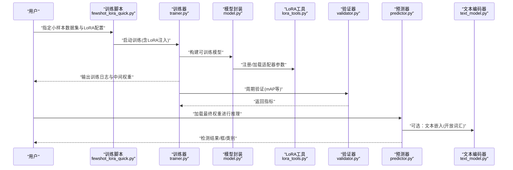
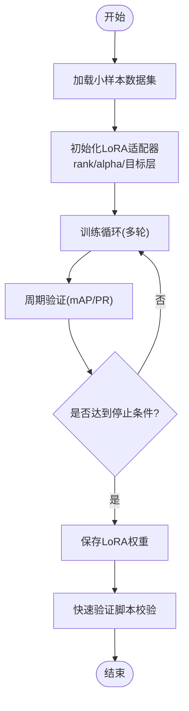
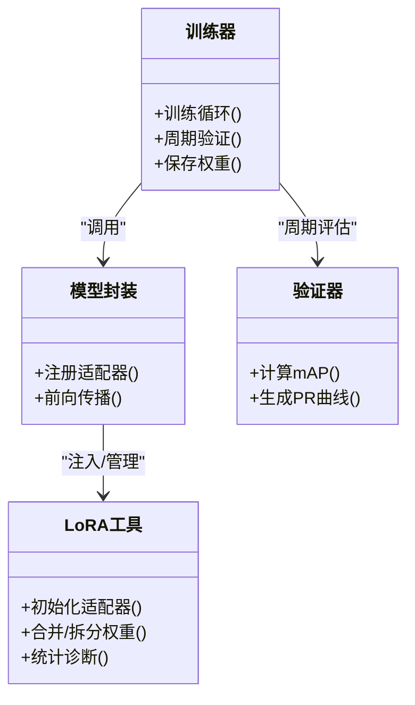
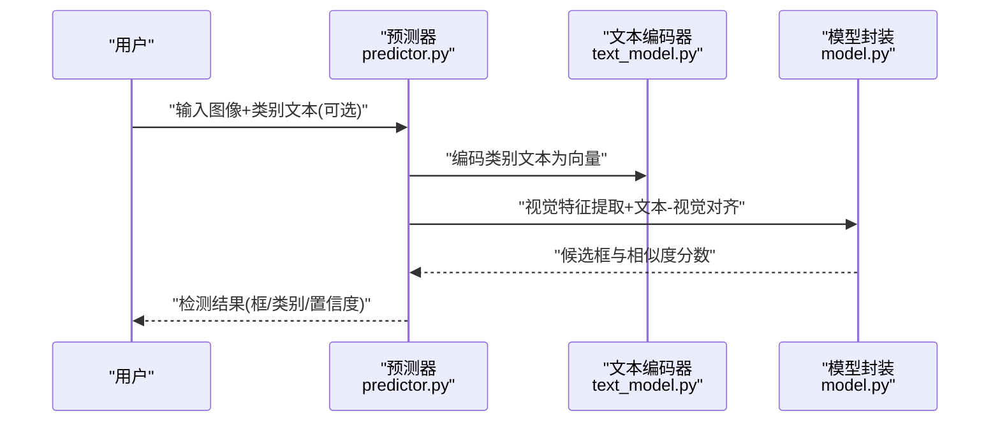
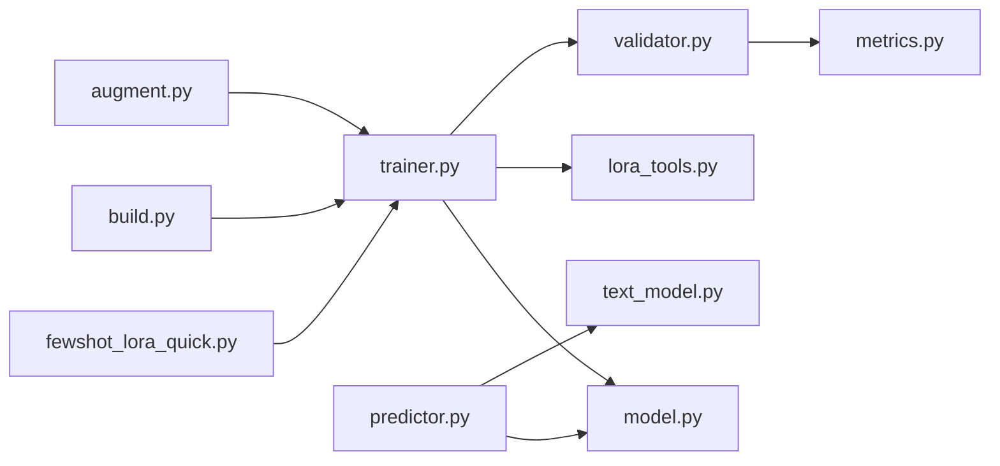

# 小样本学习应用

<cite>
**本文引用的文件**
- [README.md](file://README.md)
- [LoRA_Quickstart.md](file://docs/LoRA_Quickstart.md)
- [molora_guide.md](file://docs/molora_guide.md)
- [domain-specific-lora-tuning.md](file://.plan_archive/domain-specific-lora-tuning.md)
- [fewshot_lora_quick.py](file://scripts/fewshot_lora_quick.py)
- [fewshot_lora_verify.py](file://scripts/fewshot_lora_verify.py)
- [run_fewshot_bg.sh](file://scripts/run_fewshot_bg.sh)
- [ablation_fewshot.py](file://scripts/ablation_suite/ablation_fewshot.py)
- [yolo_master_lora_README.md](file://examples/lora_examples/yolo_master_lora_README.md)
- [yolo11_lora.yaml](file://examples/lora_examples/yolo11_lora.yaml)
- [yolo12_lora.yaml](file://examples/lora_examples/yolo12_lora.yaml)
- [yoloworld_lora.yaml](file://examples/lora_examples/yoloworld_lora.yaml)
- [lora_e2e_smoke.py](file://tests/lora_e2e_smoke.py)
- [test_peft_adapters.py](file://tests/test_peft_adapters.py)
- [metrics.py](file://agent/runtime/evaluation/metrics.py)
- [augment.py](file://ultralytics/data/augment.py)
- [build.py](file://ultralytics/data/build.py)
- [trainer.py](file://ultralytics/engine/trainer.py)
- [predictor.py](file://ultralytics/engine/predictor.py)
- [validator.py](file://ultralytics/engine/validator.py)
- [model.py](file://ultralytics/engine/model.py)
- [text_model.py](file://ultralytics/nn/text_model.py)
- [peft_compare.py](file://agent/runtime/cli/peft_compare.py)
- [lora_tools.py](file://agent/runtime/cli/lora_tools.py)
</cite>

## 目录
1. [简介](#简介)
2. [项目结构](#项目结构)
3. [核心组件](#核心组件)
4. [架构总览](#架构总览)
5. [详细组件分析](#详细组件分析)
6. [依赖关系分析](#依赖关系分析)
7. [性能考量](#性能考量)
8. [故障排查指南](#故障排查指南)
9. [结论](#结论)
10. [附录](#附录)

## 简介
本文件面向在YOLO-Master中落地“小样本学习（Few-Shot Learning, FSL）”的工程师与研究者，聚焦以下目标：
- 解释小样本学习的基本原理及其在目标检测中的典型应用场景。
- 基于LoRA的参数高效微调策略，说明适配器参数初始化与更新规则。
- 提供零样本检测的实现思路，包括文本引导的检测器与开放词汇检测。
- 阐述元学习与度量学习在小样本场景中的应用方式。
- 给出可复现的训练流程与示例路径，展示仅用少量标注样本训练高性能检测器的方法。
- 定义评估指标与基准测试方法，并说明数据增强与合成数据的作用。

## 项目结构
围绕小样本学习与LoRA微调，仓库中与本主题直接相关的代码与文档主要分布在如下位置：
- 脚本与示例
  - scripts: few-shot快速脚本、验证脚本、后台运行脚本、消融实验脚本
  - examples/lora_examples: LoRA任务配置与使用说明
- 引擎与模型
  - ultralytics/engine: 训练、预测、验证、模型封装等核心运行时
  - ultralytics/nn/text_model.py: 文本编码器相关能力（用于开放词汇/零样本）
- 工具与评测
  - agent/runtime/cli: LoRA工具与PEFT对比工具
  - agent/runtime/evaluation/metrics.py: 评估指标实现
- 数据与增强
  - ultralytics/data: 数据集构建与数据增强管线
- 文档与计划
  - docs: LoRA快速入门、MoLoRA指南、领域特定LoRA调优计划
  - .plan_archive: 领域特定LoRA调优方案

```mermaid
graph TB
subgraph "脚本与示例"
A["scripts/fewshot_lora_quick.py"]
B["scripts/fewshot_lora_verify.py"]
C["scripts/run_fewshot_bg.sh"]
D["scripts/ablation_suite/ablation_fewshot.py"]
E["examples/lora_examples/*.yaml"]
end
subgraph "引擎与模型"
F["ultralytics/engine/trainer.py"]
G["ultralytics/engine/predictor.py"]
H["ultralytics/engine/validator.py"]
I["ultralytics/engine/model.py"]
J["ultralytics/nn/text_model.py"]
end
subgraph "工具与评测"
K["agent/runtime/cli/lora_tools.py"]
L["agent/runtime/cli/peft_compare.py"]
M["agent/runtime/evaluation/metrics.py"]
end
subgraph "数据与增强"
N["ultralytics/data/build.py"]
O["ultralytics/data/augment.py"]
end
subgraph "文档与计划"
P["docs/LoRA_Quickstart.md"]
Q["docs/molora_guide.md"]
R[".plan_archive/domain-specific-lora-tuning.md"]
end
A --> F
B --> H
C --> F
D --> F
E --> F
F --> I
G --> I
H --> I
J --> G
K --> F
L --> F
M --> H
N --> F
O --> F
P --> F
Q --> F
R --> F
```

图表来源
- [fewshot_lora_quick.py](file://scripts/fewshot_lora_quick.py)
- [fewshot_lora_verify.py](file://scripts/fewshot_lora_verify.py)
- [run_fewshot_bg.sh](file://scripts/run_fewshot_bg.sh)
- [ablation_fewshot.py](file://scripts/ablation_suite/ablation_fewshot.py)
- [yolo11_lora.yaml](file://examples/lora_examples/yolo11_lora.yaml)
- [yolo12_lora.yaml](file://examples/lora_examples/yolo12_lora.yaml)
- [yoloworld_lora.yaml](file://examples/lora_examples/yoloworld_lora.yaml)
- [trainer.py](file://ultralytics/engine/trainer.py)
- [predictor.py](file://ultralytics/engine/predictor.py)
- [validator.py](file://ultralytics/engine/validator.py)
- [model.py](file://ultralytics/engine/model.py)
- [text_model.py](file://ultralytics/nn/text_model.py)
- [lora_tools.py](file://agent/runtime/cli/lora_tools.py)
- [peft_compare.py](file://agent/runtime/cli/peft_compare.py)
- [metrics.py](file://agent/runtime/evaluation/metrics.py)
- [build.py](file://ultralytics/data/build.py)
- [augment.py](file://ultralytics/data/augment.py)
- [LoRA_Quickstart.md](file://docs/LoRA_Quickstart.md)
- [molora_guide.md](file://docs/molora_guide.md)
- [domain-specific-lora-tuning.md](file://.plan_archive/domain-specific-lora-tuning.md)

章节来源
- [README.md](file://README.md)
- [LoRA_Quickstart.md](file://docs/LoRA_Quickstart.md)
- [molora_guide.md](file://docs/molora_guide.md)
- [domain-specific-lora-tuning.md](file://.plan_archive/domain-specific-lora-tuning.md)

## 核心组件
- 小样本训练入口与验证
  - 快速训练脚本：用于在极少标注样本上启动LoRA微调流程
  - 验证脚本：对微调后的LoRA权重进行快速验证与回归检查
  - 后台运行脚本：便于批量或长时间运行的小样本训练任务
  - 消融实验脚本：系统性地对比不同小样本策略与超参组合
- LoRA与PEFT工具链
  - LoRA工具：负责适配器注入、权重拆分/合并、统计诊断等
  - PEFT对比工具：对比全量微调与LoRA在不同数据集上的表现
- 引擎层
  - 训练器：统一训练循环、优化器调度、EMA、日志记录
  - 预测器：推理阶段加载LoRA权重并进行检测
  - 验证器：计算mAP、精度、召回等指标
  - 模型封装：将LoRA适配与主干网络整合为可训练/可推理对象
- 开放词汇与文本引导
  - 文本编码器：将类别文本映射到语义空间，支撑零样本/开放词汇检测
- 数据与增强
  - 数据集构建：支持小样本子集划分、标签格式转换
  - 数据增强：针对小样本场景的强增强策略，缓解过拟合

章节来源
- [fewshot_lora_quick.py](file://scripts/fewshot_lora_quick.py)
- [fewshot_lora_verify.py](file://scripts/fewshot_lora_verify.py)
- [run_fewshot_bg.sh](file://scripts/run_fewshot_bg.sh)
- [ablation_fewshot.py](file://scripts/ablation_suite/ablation_fewshot.py)
- [lora_tools.py](file://agent/runtime/cli/lora_tools.py)
- [peft_compare.py](file://agent/runtime/cli/peft_compare.py)
- [trainer.py](file://ultralytics/engine/trainer.py)
- [predictor.py](file://ultralytics/engine/predictor.py)
- [validator.py](file://ultralytics/engine/validator.py)
- [model.py](file://ultralytics/engine/model.py)
- [text_model.py](file://ultralytics/nn/text_model.py)
- [build.py](file://ultralytics/data/build.py)
- [augment.py](file://ultralytics/data/augment.py)

## 架构总览
下图展示了小样本学习在YOLO-Master中的端到端流程：从数据准备、LoRA适配器注入、训练、验证到推理与开放词汇检测。

图表来源
- [fewshot_lora_quick.py](file://scripts/fewshot_lora_quick.py)
- [trainer.py](file://ultralytics/engine/trainer.py)
- [model.py](file://ultralytics/engine/model.py)
- [lora_tools.py](file://agent/runtime/cli/lora_tools.py)
- [validator.py](file://ultralytics/engine/validator.py)
- [predictor.py](file://ultralytics/engine/predictor.py)
- [text_model.py](file://ultralytics/nn/text_model.py)

## 详细组件分析

### 小样本训练与验证流程
- 快速训练脚本
  - 作用：以最少样板代码启动小样本LoRA微调，自动选择LoRA目标模块与学习率策略
  - 关键输入：小样本数据集路径、类别列表、LoRA rank/alpha、训练轮数
  - 关键输出：LoRA权重文件、训练曲线、验证指标
- 验证脚本
  - 作用：对已训练的LoRA权重进行快速验证，确保指标稳定且无退化
  - 关键输入：验证集路径、LoRA权重路径
  - 关键输出：mAP@0.5、mAP@[0.5:0.95]、每类精度/召回
- 后台运行脚本
  - 作用：将训练任务放入后台执行，支持断点续训与资源隔离
- 消融实验脚本
  - 作用：系统化对比不同小样本策略（如rank、alpha、冻结层、增强强度）

图表来源
- [fewshot_lora_quick.py](file://scripts/fewshot_lora_quick.py)
- [fewshot_lora_verify.py](file://scripts/fewshot_lora_verify.py)
- [run_fewshot_bg.sh](file://scripts/run_fewshot_bg.sh)
- [ablation_fewshot.py](file://scripts/ablation_suite/ablation_fewshot.py)
- [trainer.py](file://ultralytics/engine/trainer.py)
- [validator.py](file://ultralytics/engine/validator.py)

章节来源
- [fewshot_lora_quick.py](file://scripts/fewshot_lora_quick.py)
- [fewshot_lora_verify.py](file://scripts/fewshot_lora_verify.py)
- [run_fewshot_bg.sh](file://scripts/run_fewshot_bg.sh)
- [ablation_fewshot.py](file://scripts/ablation_suite/ablation_fewshot.py)

### LoRA适配器初始化与更新规则
- 适配器初始化
  - 目标层选择：通常选择卷积/注意力层的线性投影部分，保持主干预训练知识不变
  - 秩(rank)与缩放(alpha)：控制适配器容量与学习步长；小样本场景建议较小rank配合较大alpha
  - 权重初始化：低秩矩阵常采用高斯或小常数初始化，偏置项置零
- 更新规则
  - 梯度只回传到LoRA分支，主干参数冻结或极低学习率
  - 优化器：AdamW或SGD，结合余弦退火或Warmup策略
  - EMA：对LoRA权重使用指数移动平均提升稳定性
- 权重管理
  - 训练时动态注入适配器；导出时可合并或分离存储，便于部署

图表来源
- [trainer.py](file://ultralytics/engine/trainer.py)
- [model.py](file://ultralytics/engine/model.py)
- [lora_tools.py](file://agent/runtime/cli/lora_tools.py)
- [validator.py](file://ultralytics/engine/validator.py)

章节来源
- [lora_tools.py](file://agent/runtime/cli/lora_tools.py)
- [model.py](file://ultralytics/engine/model.py)
- [trainer.py](file://ultralytics/engine/trainer.py)
- [validator.py](file://ultralytics/engine/validator.py)

### 零样本检测与开放词汇检测
- 文本引导检测器
  - 通过文本编码器将类别名称映射为语义向量，与视觉特征对齐，实现无需类别标注的推理
  - 适用于新类别快速上线与跨域迁移
- 开放词汇检测
  - 在训练阶段引入大量开放词汇语料，使模型具备泛化到未见类别的能力
  - 与小样本微调结合：先用开放词汇预训练，再用少量标注进行LoRA适配

图表来源
- [predictor.py](file://ultralytics/engine/predictor.py)
- [text_model.py](file://ultralytics/nn/text_model.py)
- [model.py](file://ultralytics/engine/model.py)

章节来源
- [predictor.py](file://ultralytics/engine/predictor.py)
- [text_model.py](file://ultralytics/nn/text_model.py)
- [model.py](file://ultralytics/engine/model.py)

### 元学习与度量学习在小样本场景的应用
- 元学习
  - 通过多任务/多域训练，让模型学会“如何快速适应新任务”，在仅有少量标注的情况下快速收敛
  - 在YOLO-Master中可通过多源小样本数据集联合训练，配合LoRA实现任务级适配
- 度量学习
  - 将检测问题转化为特征匹配问题，利用距离度量在新类别上进行最近邻或阈值判定
  - 可与开放词汇检测结合，减少对新类别的标注需求

[本节为概念性说明，不直接分析具体文件]

### 数据增强与合成数据
- 数据增强
  - 小样本下强烈依赖增强策略（随机裁剪、MixUp/CutMix、颜色抖动、几何变换等）以提升泛化
  - 建议在训练器中启用强增强，并在验证阶段关闭或减弱
- 合成数据
  - 使用生成式模型或仿真环境合成目标实例，扩充稀有类别样本
  - 注意分布偏移与标注一致性，避免引入噪声

章节来源
- [augment.py](file://ultralytics/data/augment.py)
- [build.py](file://ultralytics/data/build.py)
- [trainer.py](file://ultralytics/engine/trainer.py)

## 依赖关系分析
- 训练链路
  - 训练脚本依赖训练器与模型封装；训练器依赖LoRA工具进行适配器管理
  - 验证器依赖指标实现，输出mAP与PR曲线
- 推理链路
  - 预测器依赖模型封装与文本编码器（开放词汇）
- 数据链路
  - 数据集构建与增强在训练前完成，直接影响小样本下的收敛速度与鲁棒性

图表来源
- [fewshot_lora_quick.py](file://scripts/fewshot_lora_quick.py)
- [trainer.py](file://ultralytics/engine/trainer.py)
- [model.py](file://ultralytics/engine/model.py)
- [lora_tools.py](file://agent/runtime/cli/lora_tools.py)
- [validator.py](file://ultralytics/engine/validator.py)
- [metrics.py](file://agent/runtime/evaluation/metrics.py)
- [predictor.py](file://ultralytics/engine/predictor.py)
- [text_model.py](file://ultralytics/nn/text_model.py)
- [build.py](file://ultralytics/data/build.py)
- [augment.py](file://ultralytics/data/augment.py)

章节来源
- [trainer.py](file://ultralytics/engine/trainer.py)
- [validator.py](file://ultralytics/engine/validator.py)
- [predictor.py](file://ultralytics/engine/predictor.py)
- [model.py](file://ultralytics/engine/model.py)
- [lora_tools.py](file://agent/runtime/cli/lora_tools.py)
- [metrics.py](file://agent/runtime/evaluation/metrics.py)
- [build.py](file://ultralytics/data/build.py)
- [augment.py](file://ultralytics/data/augment.py)

## 性能考量
- 小样本下的过拟合风险
  - 降低模型复杂度（减小LoRA rank），提高正则化强度（Dropout、权重衰减）
  - 使用更强的数据增强与早停策略
- 训练稳定性
  - 使用EMA平滑LoRA权重，结合Warmup与余弦退火学习率调度
  - 监控梯度范数与损失震荡，必要时降低学习率或增大batch size
- 推理效率
  - 导出时可选择合并LoRA权重以减少运行时开销
  - 针对边缘设备，结合量化与剪枝技术

[本节为通用指导，不直接分析具体文件]

## 故障排查指南
- 训练不收敛或指标下降
  - 检查LoRA目标层是否正确注入，确认主干参数是否被意外更新
  - 调整学习率与warmup步数，观察损失曲线是否平滑
- 验证指标异常
  - 确认验证集划分合理，类别分布与训练一致
  - 检查mAP计算逻辑与NMS阈值设置
- 开放词汇检测效果不佳
  - 核对文本编码器的类别词表与训练时的提示模板一致性
  - 适当增加开放词汇预训练数据或调整对齐温度参数

章节来源
- [lora_tools.py](file://agent/runtime/cli/lora_tools.py)
- [peft_compare.py](file://agent/runtime/cli/peft_compare.py)
- [metrics.py](file://agent/runtime/evaluation/metrics.py)
- [validator.py](file://ultralytics/engine/validator.py)
- [predictor.py](file://ultralytics/engine/predictor.py)
- [text_model.py](file://ultralytics/nn/text_model.py)

## 结论
在YOLO-Master中实现小样本学习的关键在于：
- 使用LoRA进行参数高效微调，冻结主干、仅更新轻量适配器
- 结合开放词汇预训练与文本引导，提升对新类别的泛化能力
- 强化数据增强与合成数据，缓解小样本带来的过拟合
- 建立完善的评估与基准体系，持续迭代LoRA策略与超参

[本节为总结性内容，不直接分析具体文件]

## 附录

### 快速上手与参考
- LoRA快速入门
  - 路径：[docs/LoRA_Quickstart.md](file://docs/LoRA_Quickstart.md)
- MoLoRA指南
  - 路径：[docs/molora_guide.md](file://docs/molora_guide.md)
- 领域特定LoRA调优计划
  - 路径：[.plan_archive/domain-specific-lora-tuning.md](file://.plan_archive/domain-specific-lora-tuning.md)
- LoRA示例与配置
  - 路径：[examples/lora_examples/yolo_master_lora_README.md](file://examples/lora_examples/yolo_master_lora_README.md)
  - 配置文件示例：
    - [examples/lora_examples/yolo11_lora.yaml](file://examples/lora_examples/yolo11_lora.yaml)
    - [examples/lora_examples/yolo12_lora.yaml](file://examples/lora_examples/yolo12_lora.yaml)
    - [examples/lora_examples/yoloworld_lora.yaml](file://examples/lora_examples/yoloworld_lora.yaml)

### 小样本训练示例路径
- 快速训练脚本
  - [scripts/fewshot_lora_quick.py](file://scripts/fewshot_lora_quick.py)
- 验证脚本
  - [scripts/fewshot_lora_verify.py](file://scripts/fewshot_lora_verify.py)
- 后台运行脚本
  - [scripts/run_fewshot_bg.sh](file://scripts/run_fewshot_bg.sh)
- 消融实验脚本
  - [scripts/ablation_suite/ablation_fewshot.py](file://scripts/ablation_suite/ablation_fewshot.py)

### 评估指标与基准测试
- 指标实现
  - [agent/runtime/evaluation/metrics.py](file://agent/runtime/evaluation/metrics.py)
- 基准套件与报告
  - [benchmarks/suite.py](file://benchmarks/suite.py)
  - [benchmarks/run.py](file://benchmarks/run.py)
  - [benchmarks/suites.yaml](file://benchmarks/suites.yaml)
- PEFT对比工具
  - [agent/runtime/cli/peft_compare.py](file://agent/runtime/cli/peft_compare.py)

### 单元测试与回归保障
- LoRA端到端冒烟测试
  - [tests/lora_e2e_smoke.py](file://tests/lora_e2e_smoke.py)
- PEFT适配器测试
  - [tests/test_peft_adapters.py](file://tests/test_peft_adapters.py)