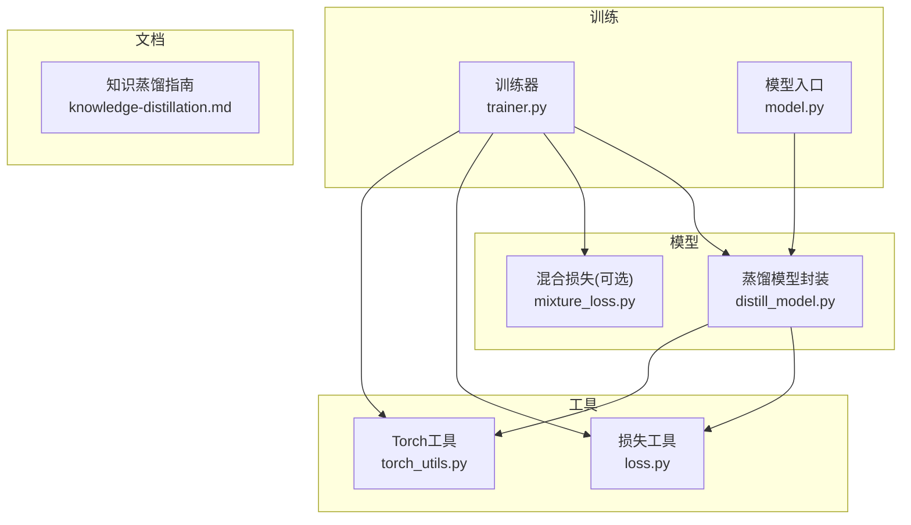
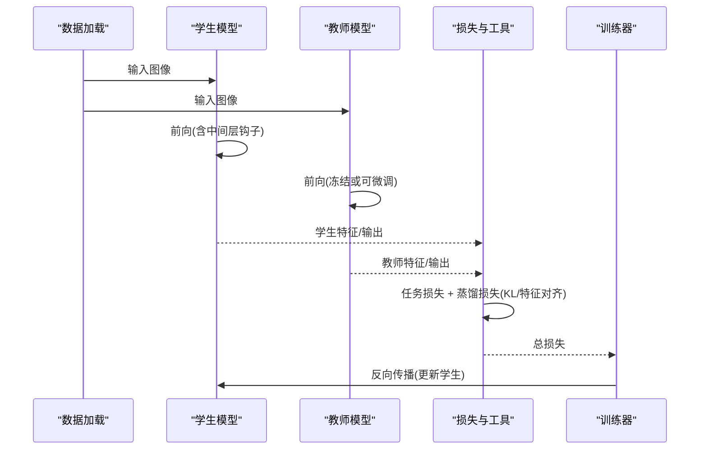
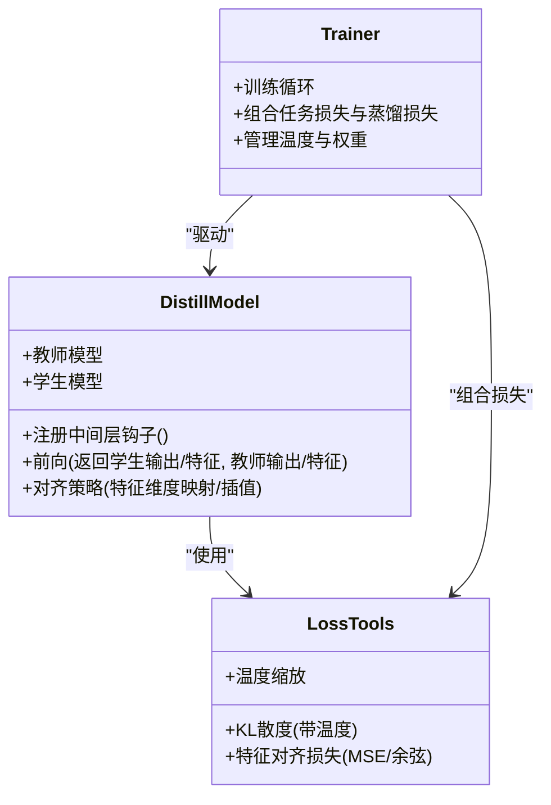
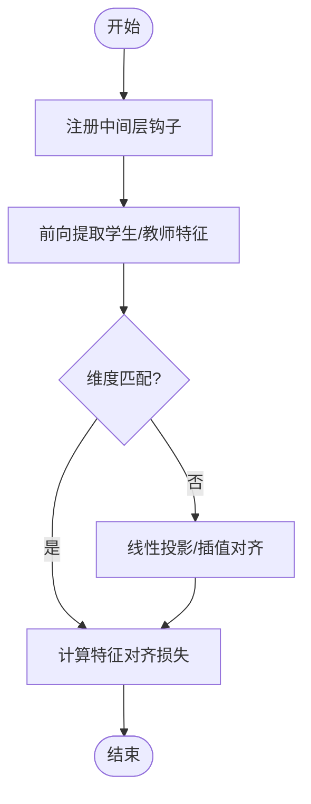
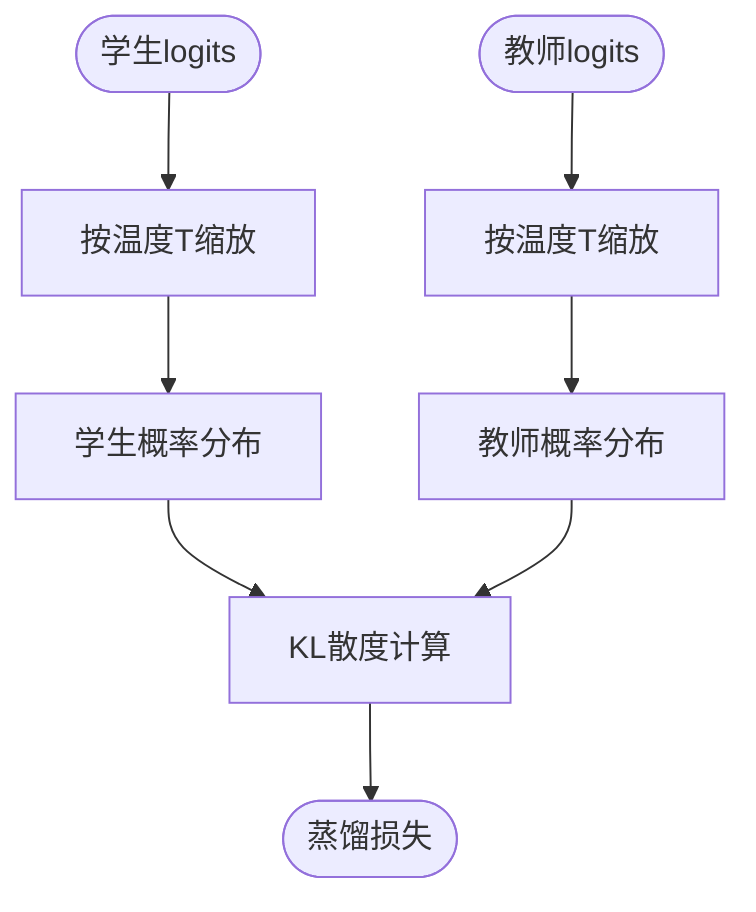
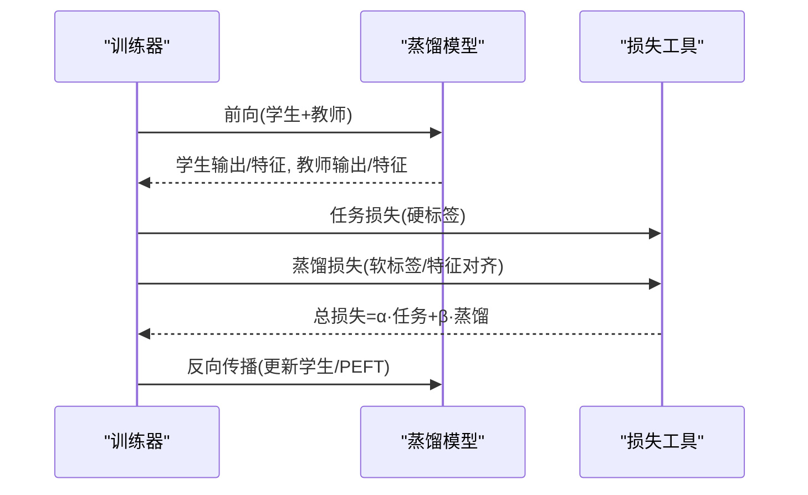
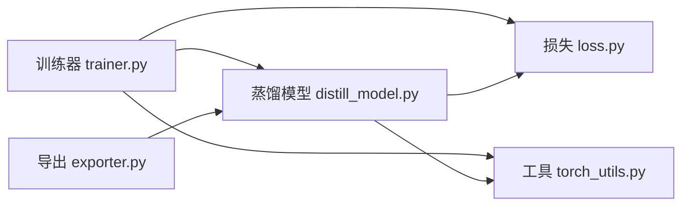

# 知识蒸馏集成

<cite>
**本文引用的文件**
- [distill_model.py](file://ultralytics/nn/distill_model.py)
- [mixture_loss.py](file://ultralytics/nn/mixture_loss.py)
- [trainer.py](file://ultralytics/engine/trainer.py)
- [model.py](file://ultralytics/engine/model.py)
- [exporter.py](file://ultralytics/engine/exporter.py)
- [loss.py](file://ultralytics/utils/loss.py)
- [torch_utils.py](file://ultralytics/utils/torch_utils.py)
- [knowledge-distillation.md](file://docs/en/guides/knowledge-distillation.md)
</cite>

## 目录
1. [简介](#简介)
2. [项目结构](#项目结构)
3. [核心组件](#核心组件)
4. [架构总览](#架构总览)
5. [详细组件分析](#详细组件分析)
6. [依赖关系分析](#依赖关系分析)
7. [性能考量](#性能考量)
8. [故障排查指南](#故障排查指南)
9. [结论](#结论)
10. [附录](#附录)

## 简介
本文件面向YOLO-Master的知识蒸馏集成应用，系统性阐述教师-学生模型架构设计、PEFT在蒸馏中的作用、特征级与输出级蒸馏的实现方法（含中间层特征提取与对齐策略）、训练流程与损失函数设计、温度参数调优与KL散度计算、移动端部署优化场景、效果评估方法与量化结合实践。文档以代码级分析与可视化为主，帮助读者快速理解并落地蒸馏方案。

## 项目结构
本项目将知识蒸馏能力集中在模型构建与训练链路中：
- 模型侧：提供蒸馏模型封装与中间层钩子注册，支持多尺度特征对齐与输出级软标签蒸馏。
- 训练侧：在Trainer中组合任务损失与蒸馏损失，统一调度权重与温度。
- 工具侧：提供通用KL散度、温度缩放等算子与导出辅助。

图表来源
- [distill_model.py](file://ultralytics/nn/distill_model.py)
- [mixture_loss.py](file://ultralytics/nn/mixture_loss.py)
- [trainer.py](file://ultralytics/engine/trainer.py)
- [model.py](file://ultralytics/engine/model.py)
- [loss.py](file://ultralytics/utils/loss.py)
- [torch_utils.py](file://ultralytics/utils/torch_utils.py)
- [knowledge-distillation.md](file://docs/en/guides/knowledge-distillation.md)

章节来源
- [distill_model.py](file://ultralytics/nn/distill_model.py)
- [trainer.py](file://ultralytics/engine/trainer.py)
- [model.py](file://ultralytics/engine/model.py)
- [loss.py](file://ultralytics/utils/loss.py)
- [torch_utils.py](file://ultralytics/utils/torch_utils.py)
- [knowledge-distillation.md](file://docs/en/guides/knowledge-distillation.md)

## 核心组件
- 蒸馏模型封装：负责注入教师模型、注册中间层特征钩子、执行前向时同时收集学生与教师特征，并按配置进行特征对齐与输出蒸馏。
- 训练器集成：在训练循环中组合任务损失与蒸馏损失，管理温度、权重分配与梯度回传路径。
- 损失与工具：提供KL散度、温度缩放、特征对齐损失（如MSE/余弦相似度）等基础算子；可选的混合损失用于复杂任务场景。
- 文档与示例：官方指南提供端到端使用方式与最佳实践。

章节来源
- [distill_model.py](file://ultralytics/nn/distill_model.py)
- [trainer.py](file://ultralytics/engine/trainer.py)
- [loss.py](file://ultralytics/utils/loss.py)
- [torch_utils.py](file://ultralytics/utils/torch_utils.py)
- [knowledge-distillation.md](file://docs/en/guides/knowledge-distillation.md)

## 架构总览
下图展示教师-学生蒸馏的整体数据流与控制流：训练阶段并行或串行执行教师与学生前向，提取中间层特征与最终输出，计算任务损失与蒸馏损失后联合优化学生模型。

图表来源
- [distill_model.py](file://ultralytics/nn/distill_model.py)
- [trainer.py](file://ultralytics/engine/trainer.py)
- [loss.py](file://ultralytics/utils/loss.py)
- [torch_utils.py](file://ultralytics/utils/torch_utils.py)

## 详细组件分析

### 蒸馏模型封装（教师-学生架构与中间层对齐）
- 设计要点
  - 教师模型通常冻结推理，仅用于提供软标签与中间层特征。
  - 学生模型通过钩子机制捕获指定层的特征图，并与教师对应层特征进行对齐。
  - 输出级蒸馏对分类头或检测头的logits进行温度缩放后计算KL散度。
- 关键实现位置
  - 蒸馏模型封装与钩子注册：[distill_model.py](file://ultralytics/nn/distill_model.py)
  - 训练器调用与损失组合：[trainer.py](file://ultralytics/engine/trainer.py)
  - 损失与工具：KL散度、温度缩放等：[loss.py](file://ultralytics/utils/loss.py), [torch_utils.py](file://ultralytics/utils/torch_utils.py)

图表来源
- [distill_model.py](file://ultralytics/nn/distill_model.py)
- [trainer.py](file://ultralytics/engine/trainer.py)
- [loss.py](file://ultralytics/utils/loss.py)
- [torch_utils.py](file://ultralytics/utils/torch_utils.py)

章节来源
- [distill_model.py](file://ultralytics/nn/distill_model.py)
- [trainer.py](file://ultralytics/engine/trainer.py)
- [loss.py](file://ultralytics/utils/loss.py)
- [torch_utils.py](file://ultralytics/utils/torch_utils.py)

### 特征级蒸馏：提取与对齐策略
- 特征提取
  - 在学生模型的关键层注册钩子，获取中间特征张量。
  - 教师模型同样提取对应层级特征，确保语义一致性。
- 对齐策略
  - 维度不一致时采用线性投影或插值重采样至相同形状。
  - 常用损失包括MSE、余弦相似度或结构化正则项。
- 实现参考
  - 特征对齐与损失计算：[distill_model.py](file://ultralytics/nn/distill_model.py), [loss.py](file://ultralytics/utils/loss.py)

图表来源
- [distill_model.py](file://ultralytics/nn/distill_model.py)
- [loss.py](file://ultralytics/utils/loss.py)

章节来源
- [distill_model.py](file://ultralytics/nn/distill_model.py)
- [loss.py](file://ultralytics/utils/loss.py)

### 输出级蒸馏：温度与KL散度
- 温度缩放
  - 对学生与教师的logits除以温度T后再softmax，得到平滑的概率分布。
- KL散度
  - 以教师分布为“软目标”，最小化学生分布与教师分布之间的KL散度。
- 实现参考
  - KL散度与温度处理：[loss.py](file://ultralytics/utils/loss.py), [torch_utils.py](file://ultralytics/utils/torch_utils.py)

图表来源
- [loss.py](file://ultralytics/utils/loss.py)
- [torch_utils.py](file://ultralytics/utils/torch_utils.py)

章节来源
- [loss.py](file://ultralytics/utils/loss.py)
- [torch_utils.py](file://ultralytics/utils/torch_utils.py)

### PEFT在蒸馏中的作用
- 角色定位
  - PEFT（如LoRA）可在学生模型上仅微调低秩适配器，降低显存与算力需求，同时保持蒸馏收益。
  - 在蒸馏过程中，PEFT参数参与梯度更新，而主干网络可冻结或半冻结，提升稳定性与效率。
- 集成点
  - 训练器在组合损失后，针对PEFT参数进行优化；蒸馏模块仍可访问主干特征与输出。
- 参考位置
  - 训练器与模型入口：[trainer.py](file://ultralytics/engine/trainer.py), [model.py](file://ultralytics/engine/model.py)

章节来源
- [trainer.py](file://ultralytics/engine/trainer.py)
- [model.py](file://ultralytics/engine/model.py)

### 蒸馏训练流程与损失权重分配
- 训练流程
  - 数据加载 → 学生/教师前向 → 提取特征与输出 → 计算任务损失与蒸馏损失 → 加权求和 → 反向传播。
- 损失权重
  - 任务损失权重与蒸馏损失权重可按阶段动态调整，例如前期侧重任务学习，后期增强蒸馏引导。
- 参考位置
  - 训练器组合逻辑：[trainer.py](file://ultralytics/engine/trainer.py)
  - 蒸馏模型封装：[distill_model.py](file://ultralytics/nn/distill_model.py)

图表来源
- [trainer.py](file://ultralytics/engine/trainer.py)
- [distill_model.py](file://ultralytics/nn/distill_model.py)
- [loss.py](file://ultralytics/utils/loss.py)

章节来源
- [trainer.py](file://ultralytics/engine/trainer.py)
- [distill_model.py](file://ultralytics/nn/distill_model.py)
- [loss.py](file://ultralytics/utils/loss.py)

### 温度参数调优与KL散度计算
- 温度选择
  - 较低温度保留更多类别区分信息，较高温度使分布更平滑，利于小模型学习。
  - 建议网格搜索或基于验证集指标进行调参。
- KL散度细节
  - 注意数值稳定（加极小常数），避免NaN；对多类别任务需逐类归一化或掩码处理。
- 参考位置
  - KL与温度实现：[loss.py](file://ultralytics/utils/loss.py), [torch_utils.py](file://ultralytics/utils/torch_utils.py)

章节来源
- [loss.py](file://ultralytics/utils/loss.py)
- [torch_utils.py](file://ultralytics/utils/torch_utils.py)

### 模型压缩与加速：移动端部署优化
- 蒸馏收益
  - 学生模型更小、更快，同时保持接近教师模型的精度。
- 部署路径
  - 导出为ONNX/TensorRT/TFLite等格式，结合量化（INT8/FP16）进一步压缩与加速。
- 参考位置
  - 导出工具链：[exporter.py](file://ultralytics/engine/exporter.py)
  - 官方部署指南与平台说明见文档站点（与本仓库配套）。

章节来源
- [exporter.py](file://ultralytics/engine/exporter.py)

### 蒸馏效果评估与性能对比
- 评估指标
  - mAP、FPS、模型大小、内存占用、功耗等。
- 对比方法
  - 基线学生模型 vs 蒸馏学生模型；不同温度/权重配置下的消融实验。
- 参考位置
  - 训练与验证流程：[trainer.py](file://ultralytics/engine/trainer.py)
  - 官方指南：[knowledge-distillation.md](file://docs/en/guides/knowledge-distillation.md)

章节来源
- [trainer.py](file://ultralytics/engine/trainer.py)
- [knowledge-distillation.md](file://docs/en/guides/knowledge-distillation.md)

### 与量化技术的结合
- 训练后量化（PTQ）
  - 先完成蒸馏，再对导出模型进行校准与量化，获得更高吞吐与更低延迟。
- 量化感知训练（QAT）
  - 在蒸馏训练中引入量化噪声模拟，进一步提升部署性能。
- 参考位置
  - 导出与后端集成：[exporter.py](file://ultralytics/engine/exporter.py)

章节来源
- [exporter.py](file://ultralytics/engine/exporter.py)

## 依赖关系分析
- 耦合与内聚
  - 蒸馏模型封装与损失工具高内聚，训练器作为编排者低耦合地组合各模块。
- 外部依赖
  - 依赖PyTorch算子与导出后端；可通过exporter对接多种部署目标。
- 潜在循环依赖
  - 训练器不直接依赖具体损失实现，而是通过接口调用，避免循环依赖。

图表来源
- [trainer.py](file://ultralytics/engine/trainer.py)
- [distill_model.py](file://ultralytics/nn/distill_model.py)
- [loss.py](file://ultralytics/utils/loss.py)
- [torch_utils.py](file://ultralytics/utils/torch_utils.py)
- [exporter.py](file://ultralytics/engine/exporter.py)

章节来源
- [trainer.py](file://ultralytics/engine/trainer.py)
- [distill_model.py](file://ultralytics/nn/distill_model.py)
- [loss.py](file://ultralytics/utils/loss.py)
- [torch_utils.py](file://ultralytics/utils/torch_utils.py)
- [exporter.py](file://ultralytics/engine/exporter.py)

## 性能考量
- 批大小与温度
  - 较大批次有助于稳定KL散度估计；温度过高可能导致梯度信号过弱。
- 特征对齐成本
  - 深层特征对齐可能带来额外计算开销，建议选择性对齐关键层。
- 导出与量化
  - 结合TensorRT/ONNX Runtime与INT8量化，显著提升移动端推理速度。

## 故障排查指南
- 常见错误
  - KL散度出现NaN：检查温度过小或概率分布未归一化。
  - 特征维度不匹配：确认对齐策略（投影/插值）是否正确。
  - 训练不稳定：调整任务损失与蒸馏损失权重比例，或降低学习率。
- 定位方法
  - 打印中间特征范数与分布统计；逐步关闭蒸馏损失验证任务损失收敛性。
- 参考位置
  - 训练器与损失实现：[trainer.py](file://ultralytics/engine/trainer.py), [loss.py](file://ultralytics/utils/loss.py)

章节来源
- [trainer.py](file://ultralytics/engine/trainer.py)
- [loss.py](file://ultralytics/utils/loss.py)

## 结论
YOLO-Master的知识蒸馏集成通过蒸馏模型封装与训练器编排，实现了灵活的特征级与输出级蒸馏，并结合PEFT与导出工具链，形成从训练到部署的完整闭环。合理设置温度与损失权重、选择合适的对齐策略，并在部署阶段结合量化技术，可在移动端等资源受限平台上获得显著的性能与效率提升。

## 附录
- 官方指南与最佳实践
  - 知识蒸馏指南：[knowledge-distillation.md](file://docs/en/guides/knowledge-distillation.md)
- 相关实现文件
  - 蒸馏模型封装：[distill_model.py](file://ultralytics/nn/distill_model.py)
  - 训练器：[trainer.py](file://ultralytics/engine/trainer.py)
  - 损失与工具：[loss.py](file://ultralytics/utils/loss.py), [torch_utils.py](file://ultralytics/utils/torch_utils.py)
  - 导出工具：[exporter.py](file://ultralytics/engine/exporter.py)