# 隐私保护与联邦学习

<cite>
**本文引用的文件**
- [README.md](file://README.md)
- [ultralytics/nn/peft/__init__.py](file://ultralytics/nn/peft/__init__.py)
- [ultralytics/utils/lora/__init__.py](file://ultralytics/utils/lora/__init__.py)
- [examples/lora_examples/yolo_master_lora_README.md](file://examples/lora_examples/yolo_master_lora_README.md)
- [scripts/ablation_suite/ablation_peft_coco128.py](file://scripts/ablation_suite/ablation_peft_coco128.py)
- [scripts/eval_moe_peft.py](file://scripts/eval_moe_peft.py)
- [tests/test_molora.py](file://tests/test_molora.py)
- [tests/test_molora_merge_semantics.py](file://tests/test_molora_merge_semantics.py)
- [tests/test_molora_routing_aware_merge.py](file://tests/test_molora_routing_aware_merge.py)
- [tests/test_vpeft.py](file://tests/test_vpeft.py)
- [ultralytics/vpeft/solver.py](file://ultralytics/vpeft/solver.py)
- [ultralytics/vpeft/policy.py](file://ultralytics/vpeft/policy.py)
- [ultralytics/vpeft/constraints.py](file://ultralytics/vpeft/constraints.py)
- [ultralytics/vpeft/graph.py](file://ultralytics/vpeft/graph.py)
- [ultralytics/engine/trainer.py](file://ultralytics/engine/trainer.py)
- [ultralytics/engine/model.py](file://ultralytics/engine/model.py)
- [ultralytics/utils/dist.py](file://ultralytics/utils/dist.py)
- [ultralytics/utils/export_capabilities.py](file://ultralytics/utils/export_capabilities.py)
- [docs/governance/model-registry.yaml](file://docs/governance/model-registry.yaml)
- [docs/governance/baseline-20260716.md](file://docs/governance/baseline-20260716.md)
</cite>

## 目录
1. [简介](#简介)
2. [项目结构](#项目结构)
3. [核心组件](#核心组件)
4. [架构总览](#架构总览)
5. [详细组件分析](#详细组件分析)
6. [依赖分析](#依赖分析)
7. [性能考虑](#性能考虑)
8. [故障排查指南](#故障排查指南)
9. [结论](#结论)
10. [附录](#附录)

## 简介
本文件面向在YOLO-Master中落地“隐私保护+联邦学习”的工程师与研究者，聚焦以下目标：
- 解释PEFT（参数高效微调）在联邦学习中的优势与应用场景，包括本地微调与全局聚合策略。
- 说明差分隐私在PEFT训练中的应用要点（噪声添加、隐私预算控制）。
- 给出可落地的联邦学习实现框架（客户端训练、服务器聚合、模型同步机制）。
- 提供边缘设备上的隐私部署建议（模型加密与安全传输）。
- 介绍数据脱敏与匿名化方法，保护用户隐私信息。
- 设计通信优化策略以降低带宽消耗与训练时间。
- 结合区块链思路实现可追溯的模型版本管理。

## 项目结构
仓库围绕YOLO系列模型与PEFT生态组织，关键路径如下：
- PEFT与LoRA能力：位于nn/peft与utils/lora，提供适配器注册、权重合并、导出能力等。
- 可视化PEFT选择器vPEFT：位于vpeft，包含策略、约束、图搜索与求解器。
- 训练与推理引擎：engine/trainer与engine/model负责训练循环、验证与导出。
- 分布式工具：utils/dist提供分布式相关辅助。
- 实验与评估脚本：scripts下包含PEFT消融、评估与MOLORA相关测试。
- 治理与文档：docs/governance包含模型注册表与基线文档。

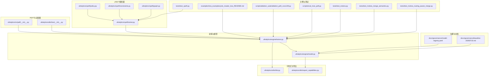

图表来源
- [ultralytics/nn/peft/__init__.py](file://ultralytics/nn/peft/__init__.py)
- [ultralytics/utils/lora/__init__.py](file://ultralytics/utils/lora/__init__.py)
- [ultralytics/vpeft/solver.py](file://ultralytics/vpeft/solver.py)
- [ultralytics/vpeft/policy.py](file://ultralytics/vpeft/policy.py)
- [ultralytics/vpeft/constraints.py](file://ultralytics/vpeft/constraints.py)
- [ultralytics/vpeft/graph.py](file://ultralytics/vpeft/graph.py)
- [ultralytics/engine/trainer.py](file://ultralytics/engine/trainer.py)
- [ultralytics/engine/model.py](file://ultralytics/engine/model.py)
- [ultralytics/utils/dist.py](file://ultralytics/utils/dist.py)
- [ultralytics/utils/export_capabilities.py](file://ultralytics/utils/export_capabilities.py)
- [examples/lora_examples/yolo_master_lora_README.md](file://examples/lora_examples/yolo_master_lora_README.md)
- [scripts/ablation_suite/ablation_peft_coco128.py](file://scripts/ablation_suite/ablation_peft_coco128.py)
- [scripts/eval_moe_peft.py](file://scripts/eval_moe_peft.py)
- [tests/test_molora.py](file://tests/test_molora.py)
- [tests/test_molora_merge_semantics.py](file://tests/test_molora_merge_semantics.py)
- [tests/test_molora_routing_aware_merge.py](file://tests/test_molora_routing_aware_merge.py)
- [tests/test_vpeft.py](file://tests/test_vpeft.py)
- [docs/governance/model-registry.yaml](file://docs/governance/model-registry.yaml)
- [docs/governance/baseline-20260716.md](file://docs/governance/baseline-20260716.md)

章节来源
- [README.md](file://README.md)

## 核心组件
- PEFT与LoRA适配层
  - 提供适配器注册、权重注入与合并能力，便于在大规模预训练模型上仅微调少量参数，降低通信与存储开销。
  - 参考路径：[ultralytics/nn/peft/__init__.py](file://ultralytics/nn/peft/__init__.py)、[ultralytics/utils/lora/__init__.py](file://ultralytics/utils/lora/__init__.py)、[examples/lora_examples/yolo_master_lora_README.md](file://examples/lora_examples/yolo_master_lora_README.md)。
- vPEFT规划器
  - 基于策略、约束与图搜索，自动选择可微或离散化的PEFT方案，兼顾精度与效率。
  - 参考路径：[ultralytics/vpeft/solver.py](file://ultralytics/vpeft/solver.py)、[ultralytics/vpeft/policy.py](file://ultralytics/vpeft/policy.py)、[ultralytics/vpeft/constraints.py](file://ultralytics/vpeft/constraints.py)、[ultralytics/vpeft/graph.py](file://ultralytics/vpeft/graph.py)、[tests/test_vpeft.py](file://tests/test_vpeft.py)。
- 训练与模型引擎
  - trainer负责训练循环、验证与日志；model负责加载、配置与导出；export_capabilities用于导出能力矩阵。
  - 参考路径：[ultralytics/engine/trainer.py](file://ultralytics/engine/trainer.py)、[ultralytics/engine/model.py](file://ultralytics/engine/model.py)、[ultralytics/utils/export_capabilities.py](file://ultralytics/utils/export_capabilities.py)。
- 分布式与通信
  - utils/dist提供分布式辅助，便于后续扩展为联邦学习的客户端-服务器通信。
  - 参考路径：[ultralytics/utils/dist.py](file://ultralytics/utils/dist.py)。
- 实验与评估
  - ablation_peft_coco128.py与eval_moe_peft.py提供PEFT/MoE相关的训练与评估流程入口。
  - 参考路径：[scripts/ablation_suite/ablation_peft_coco128.py](file://scripts/ablation_suite/ablation_peft_coco128.py)、[scripts/eval_moe_peft.py](file://scripts/eval_moe_peft.py)。
- MOLORA与路由感知合并
  - tests覆盖MOLORA的语义、合并与路由感知合并，体现对MoE/路由结构的兼容。
  - 参考路径：[tests/test_molora.py](file://tests/test_molora.py)、[tests/test_molora_merge_semantics.py](file://tests/test_molora_merge_semantics.py)、[tests/test_molora_routing_aware_merge.py](file://tests/test_molora_routing_aware_merge.py)。
- 治理与模型注册
  - model-registry.yaml与baseline文档定义模型版本与基线，可作为联邦学习中模型溯源的基础。
  - 参考路径：[docs/governance/model-registry.yaml](file://docs/governance/model-registry.yaml)、[docs/governance/baseline-20260716.md](file://docs/governance/baseline-20260716.md)。

章节来源
- [ultralytics/nn/peft/__init__.py](file://ultralytics/nn/peft/__init__.py)
- [ultralytics/utils/lora/__init__.py](file://ultralytics/utils/lora/__init__.py)
- [examples/lora_examples/yolo_master_lora_README.md](file://examples/lora_examples/yolo_master_lora_README.md)
- [ultralytics/vpeft/solver.py](file://ultralytics/vpeft/solver.py)
- [ultralytics/vpeft/policy.py](file://ultralytics/vpeft/policy.py)
- [ultralytics/vpeft/constraints.py](file://ultralytics/vpeft/constraints.py)
- [ultralytics/vpeft/graph.py](file://ultralytics/vpeft/graph.py)
- [tests/test_vpeft.py](file://tests/test_vpeft.py)
- [ultralytics/engine/trainer.py](file://ultralytics/engine/trainer.py)
- [ultralytics/engine/model.py](file://ultralytics/engine/model.py)
- [ultralytics/utils/export_capabilities.py](file://ultralytics/utils/export_capabilities.py)
- [ultralytics/utils/dist.py](file://ultralytics/utils/dist.py)
- [scripts/ablation_suite/ablation_peft_coco128.py](file://scripts/ablation_suite/ablation_peft_coco128.py)
- [scripts/eval_moe_peft.py](file://scripts/eval_moe_peft.py)
- [tests/test_molora.py](file://tests/test_molora.py)
- [tests/test_molora_merge_semantics.py](file://tests/test_molora_merge_semantics.py)
- [tests/test_molora_routing_aware_merge.py](file://tests/test_molora_routing_aware_merge.py)
- [docs/governance/model-registry.yaml](file://docs/governance/model-registry.yaml)
- [docs/governance/baseline-20260716.md](file://docs/governance/baseline-20260716.md)

## 架构总览
下图展示在YOLO-Master中构建“隐私保护+联邦学习”的整体架构：客户端侧使用PEFT进行本地微调并可选地加入差分隐私噪声；服务器端执行安全聚合与版本登记；边缘侧通过加密与压缩进行安全传输与部署。

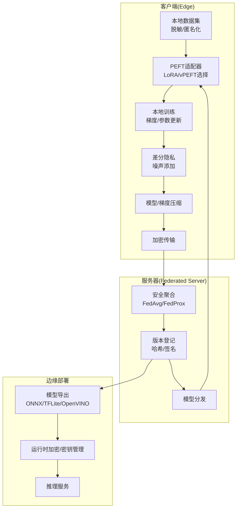

图表来源
- [ultralytics/engine/trainer.py](file://ultralytics/engine/trainer.py)
- [ultralytics/engine/model.py](file://ultralytics/engine/model.py)
- [ultralytics/utils/export_capabilities.py](file://ultralytics/utils/export_capabilities.py)
- [ultralytics/utils/dist.py](file://ultralytics/utils/dist.py)
- [ultralytics/vpeft/solver.py](file://ultralytics/vpeft/solver.py)
- [ultralytics/nn/peft/__init__.py](file://ultralytics/nn/peft/__init__.py)
- [ultralytics/utils/lora/__init__.py](file://ultralytics/utils/lora/__init__.py)
- [docs/governance/model-registry.yaml](file://docs/governance/model-registry.yaml)

## 详细组件分析

### 组件A：PEFT在联邦学习中的本地微调与全局聚合
- 本地微调
  - 利用PEFT仅更新少量参数（如LoRA），显著降低通信量与内存占用，适合资源受限的边缘设备。
  - 训练循环由trainer驱动，可在每个客户端独立运行。
- 全局聚合
  - 服务器端对来自多个客户端的PEFT增量进行加权平均（如FedAvg），也可引入正则项（如FedProx）提升稳定性。
  - 针对MoE/路由结构，可参考MOLORA的路由感知合并策略，确保专家权重与路由一致性。
- 适用场景
  - 多机构协作检测任务、跨域泛化、小样本快速适配。

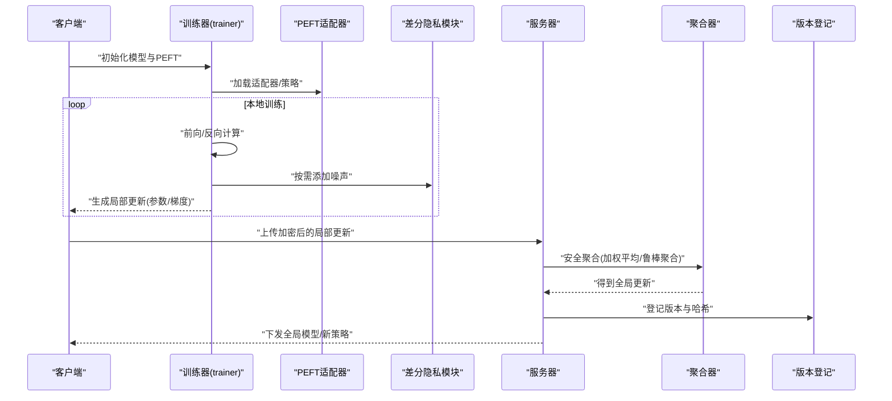

图表来源
- [ultralytics/engine/trainer.py](file://ultralytics/engine/trainer.py)
- [ultralytics/nn/peft/__init__.py](file://ultralytics/nn/peft/__init__.py)
- [ultralytics/utils/lora/__init__.py](file://ultralytics/utils/lora/__init__.py)
- [tests/test_molora.py](file://tests/test_molora.py)
- [tests/test_molora_merge_semantics.py](file://tests/test_molora_merge_semantics.py)
- [tests/test_molora_routing_aware_merge.py](file://tests/test_molora_routing_aware_merge.py)
- [docs/governance/model-registry.yaml](file://docs/governance/model-registry.yaml)

章节来源
- [ultralytics/engine/trainer.py](file://ultralytics/engine/trainer.py)
- [ultralytics/nn/peft/__init__.py](file://ultralytics/nn/peft/__init__.py)
- [ultralytics/utils/lora/__init__.py](file://ultralytics/utils/lora/__init__.py)
- [tests/test_molora.py](file://tests/test_molora.py)
- [tests/test_molora_merge_semantics.py](file://tests/test_molora_merge_semantics.py)
- [tests/test_molora_routing_aware_merge.py](file://tests/test_molora_routing_aware_merge.py)
- [docs/governance/model-registry.yaml](file://docs/governance/model-registry.yaml)

### 组件B：差分隐私在PEFT训练中的应用
- 噪声添加
  - 在客户端侧对局部更新（参数或梯度）按批次或轮次添加噪声，以限制单条样本对全局模型的贡献。
  - 可结合裁剪策略控制更新范数，避免异常值放大隐私泄露风险。
- 隐私预算控制
  - 采用(ε, δ)-差分隐私框架，累计预算随训练轮次增长，需设置每轮预算上限与最大轮次。
  - 可通过自适应调度在早期阶段提高隐私强度，后期逐步放宽以提升收敛性。
- 与PEFT的结合
  - 由于PEFT仅更新少量参数，噪声相对影响较小，更易在有限预算内获得可用精度。

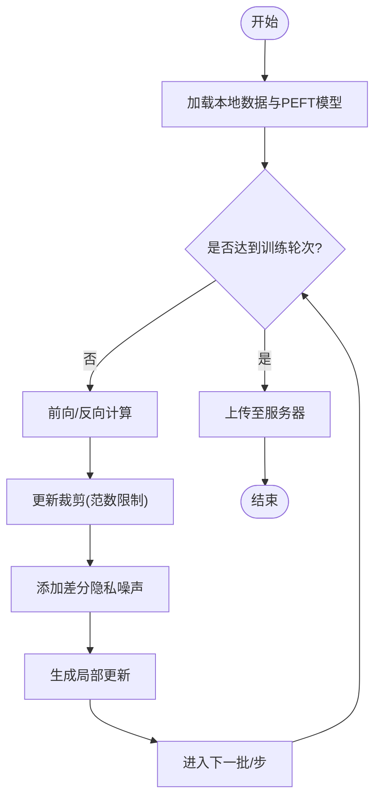

图表来源
- [ultralytics/engine/trainer.py](file://ultralytics/engine/trainer.py)
- [ultralytics/nn/peft/__init__.py](file://ultralytics/nn/peft/__init__.py)
- [ultralytics/utils/lora/__init__.py](file://ultralytics/utils/lora/__init__.py)

章节来源
- [ultralytics/engine/trainer.py](file://ultralytics/engine/trainer.py)
- [ultralytics/nn/peft/__init__.py](file://ultralytics/nn/peft/__init__.py)
- [ultralytics/utils/lora/__init__.py](file://ultralytics/utils/lora/__init__.py)

### 组件C：vPEFT规划器与策略选择
- 策略与约束
  - policy定义可选择的PEFT策略空间，constraints限定可行性条件（如参数量、精度阈值、硬件预算）。
- 图搜索与求解
  - graph构建策略图，solver根据目标函数与约束进行搜索，输出最优或近似最优的PEFT配置。
- 联邦学习价值
  - 在不同客户端异构数据分布与设备上，vPEFT可为各节点定制轻量且高效的微调方案，减少不必要的通信与计算。

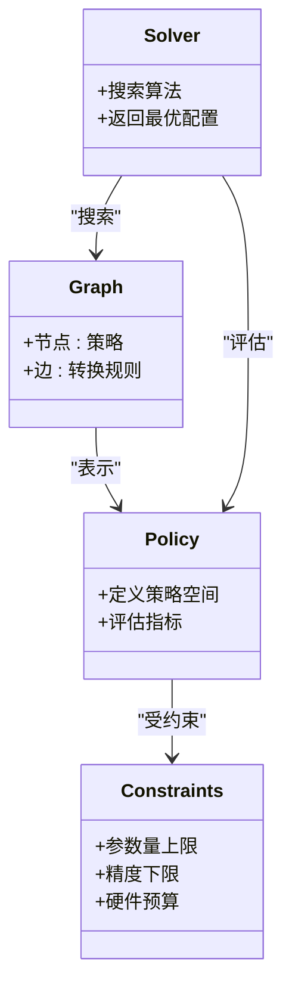

图表来源
- [ultralytics/vpeft/policy.py](file://ultralytics/vpeft/policy.py)
- [ultralytics/vpeft/constraints.py](file://ultralytics/vpeft/constraints.py)
- [ultralytics/vpeft/graph.py](file://ultralytics/vpeft/graph.py)
- [ultralytics/vpeft/solver.py](file://ultralytics/vpeft/solver.py)
- [tests/test_vpeft.py](file://tests/test_vpeft.py)

章节来源
- [ultralytics/vpeft/policy.py](file://ultralytics/vpeft/policy.py)
- [ultralytics/vpeft/constraints.py](file://ultralytics/vpeft/constraints.py)
- [ultralytics/vpeft/graph.py](file://ultralytics/vpeft/graph.py)
- [ultralytics/vpeft/solver.py](file://ultralytics/vpeft/solver.py)
- [tests/test_vpeft.py](file://tests/test_vpeft.py)

### 组件D：MOLORA与路由感知合并（适用于MoE/混合专家）
- 语义与合并
  - 测试覆盖MOLORA的语义一致性与合并逻辑，确保在MoE结构下的正确性。
- 路由感知合并
  - 在聚合时考虑路由分配，避免破坏专家与路由的一致性，提升整体性能与稳定性。
- 联邦学习意义
  - 当客户端参与MoE专家的选择与训练时，路由感知合并能保持全局专家库的一致性与可用性。

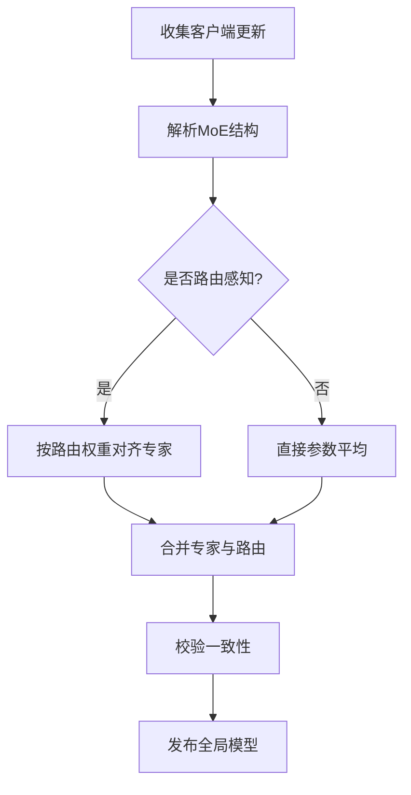

图表来源
- [tests/test_molora.py](file://tests/test_molora.py)
- [tests/test_molora_merge_semantics.py](file://tests/test_molora_merge_semantics.py)
- [tests/test_molora_routing_aware_merge.py](file://tests/test_molora_routing_aware_merge.py)

章节来源
- [tests/test_molora.py](file://tests/test_molora.py)
- [tests/test_molora_merge_semantics.py](file://tests/test_molora_merge_semantics.py)
- [tests/test_molora_routing_aware_merge.py](file://tests/test_molora_routing_aware_merge.py)

### 组件E：边缘设备上的隐私保护部署
- 模型导出
  - 使用export_capabilities支持的格式（如ONNX、TFLite、OpenVINO）将PEFT合并后的模型导出，便于在边缘设备高效推理。
- 安全传输与存储
  - 在传输过程中使用TLS/HTTPS，并在存储时对模型文件进行加密（如AES），密钥由可信环境管理。
- 运行时防护
  - 在边缘侧启用内存保护与反调试，限制模型权重明文暴露面。

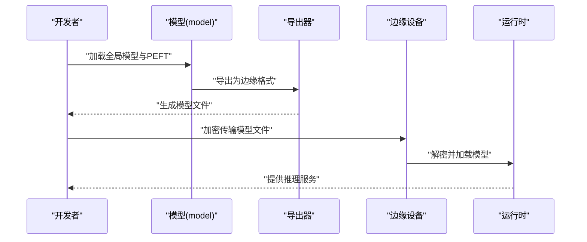

图表来源
- [ultralytics/engine/model.py](file://ultralytics/engine/model.py)
- [ultralytics/utils/export_capabilities.py](file://ultralytics/utils/export_capabilities.py)

章节来源
- [ultralytics/engine/model.py](file://ultralytics/engine/model.py)
- [ultralytics/utils/export_capabilities.py](file://ultralytics/utils/export_capabilities.py)

### 组件F：数据脱敏与匿名化处理
- 脱敏策略
  - 对图像中的敏感区域进行模糊、裁剪或替换；对文本/元数据进行掩码或泛化。
- 匿名化
  - 去除可直接识别身份的字段，采用k-匿名或差分隐私采样等技术降低重识别风险。
- 合规与审计
  - 记录数据处理流水线与版本，配合模型注册表进行端到端审计。

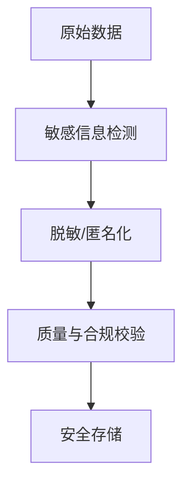

[本节为概念性内容，不直接分析具体源文件]

### 组件G：联邦学习通信优化策略
- 参数/梯度压缩
  - 量化（低比特）、稀疏化（Top-k）、结构化剪枝，减少传输体积。
- 异步与分层聚合
  - 允许部分客户端延迟参与，采用分层聚合降低中心服务器压力。
- 早停与自适应轮次
  - 根据收敛情况动态调整轮次与批量大小，平衡隐私与效率。

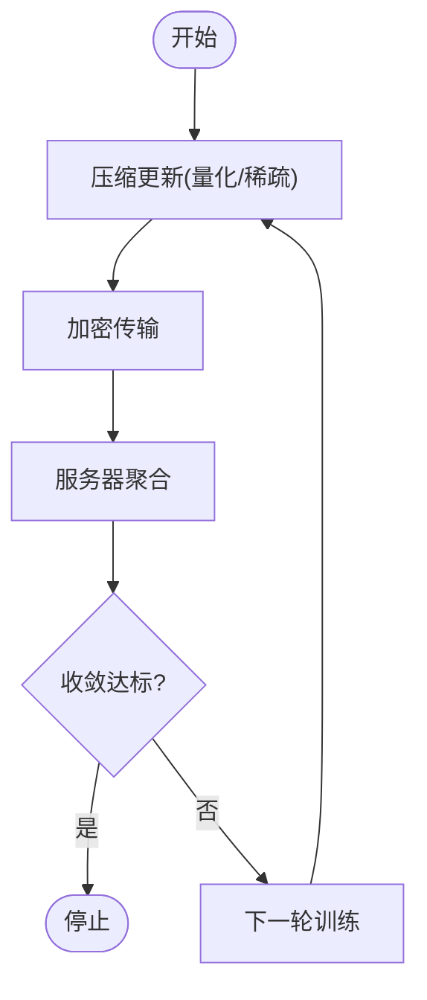

[本节为概念性内容，不直接分析具体源文件]

### 组件H：与区块链结合的模型版本管理
- 链上存证
  - 将模型哈希、版本号、训练元数据写入不可篡改账本，实现可追溯。
- 智能合约
  - 自动化审核与发布流程，确保只有经过验证的模型被纳入全局版本库。
- 与模型注册表集成
  - 将链上ID与本地model-registry.yaml关联，形成统一溯源体系。

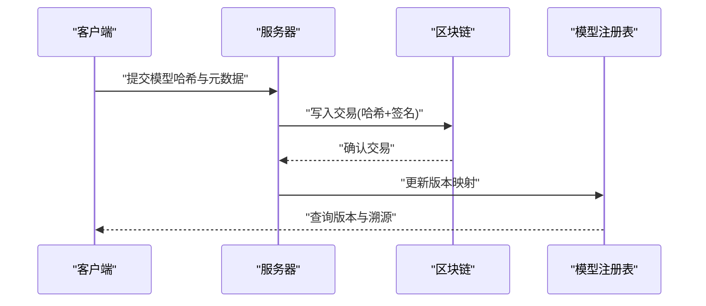

图表来源
- [docs/governance/model-registry.yaml](file://docs/governance/model-registry.yaml)
- [docs/governance/baseline-20260716.md](file://docs/governance/baseline-20260716.md)

章节来源
- [docs/governance/model-registry.yaml](file://docs/governance/model-registry.yaml)
- [docs/governance/baseline-20260716.md](file://docs/governance/baseline-20260716.md)

## 依赖分析
- 组件耦合
  - trainer依赖PEFT与vPEFT进行本地训练与策略选择；model负责加载与导出；dist提供分布式基础。
- 外部依赖
  - 导出能力矩阵与边缘部署格式由export_capabilities统一管理；治理文档为版本溯源提供依据。
- 潜在环依赖
  - 当前结构清晰，未见明显环依赖；建议在新增联邦通信模块时保持单向依赖（客户端→服务器）。

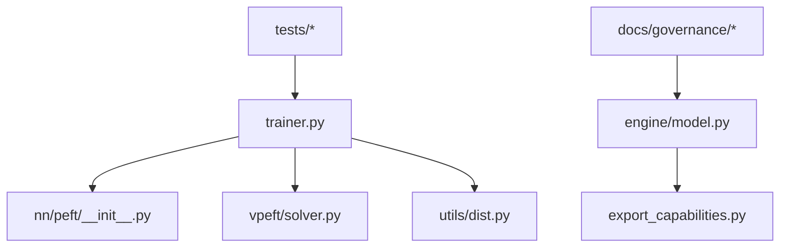

图表来源
- [ultralytics/engine/trainer.py](file://ultralytics/engine/trainer.py)
- [ultralytics/nn/peft/__init__.py](file://ultralytics/nn/peft/__init__.py)
- [ultralytics/vpeft/solver.py](file://ultralytics/vpeft/solver.py)
- [ultralytics/engine/model.py](file://ultralytics/engine/model.py)
- [ultralytics/utils/export_capabilities.py](file://ultralytics/utils/export_capabilities.py)
- [ultralytics/utils/dist.py](file://ultralytics/utils/dist.py)
- [docs/governance/model-registry.yaml](file://docs/governance/model-registry.yaml)
- [docs/governance/baseline-20260716.md](file://docs/governance/baseline-20260716.md)

章节来源
- [ultralytics/engine/trainer.py](file://ultralytics/engine/trainer.py)
- [ultralytics/nn/peft/__init__.py](file://ultralytics/nn/peft/__init__.py)
- [ultralytics/vpeft/solver.py](file://ultralytics/vpeft/solver.py)
- [ultralytics/engine/model.py](file://ultralytics/engine/model.py)
- [ultralytics/utils/export_capabilities.py](file://ultralytics/utils/export_capabilities.py)
- [ultralytics/utils/dist.py](file://ultralytics/utils/dist.py)
- [docs/governance/model-registry.yaml](file://docs/governance/model-registry.yaml)
- [docs/governance/baseline-20260716.md](file://docs/governance/baseline-20260716.md)

## 性能考虑
- 通信压缩
  - 量化与稀疏化可显著降低带宽；结合PEFT的小参数量，进一步减少传输成本。
- 训练效率
  - 使用vPEFT自动选择轻量策略，避免全量微调带来的高开销。
- 边缘推理
  - 导出为合适格式（ONNX/TFLite/OpenVINO）并利用硬件加速，提升吞吐与降低延迟。
- 隐私-精度权衡
  - 合理设置差分隐私预算与裁剪阈值，在隐私保护与模型性能间取得平衡。

[本节为通用指导，不直接分析具体源文件]

## 故障排查指南
- 训练不稳定
  - 检查差分隐私噪声强度与裁剪阈值；适当降低学习率或增加正则项。
- 聚合失败
  - 核对客户端与服务器模型结构一致性；对于MoE/路由结构，确认路由感知合并已启用。
- 导出异常
  - 查看export_capabilities支持矩阵；确保PEFT权重已正确合并到主干模型。
- 版本不一致
  - 对比model-registry.yaml中的版本信息与链上哈希；确保发布流程完整。

章节来源
- [ultralytics/engine/trainer.py](file://ultralytics/engine/trainer.py)
- [ultralytics/utils/export_capabilities.py](file://ultralytics/utils/export_capabilities.py)
- [docs/governance/model-registry.yaml](file://docs/governance/model-registry.yaml)

## 结论
通过在YOLO-Master中整合PEFT、vPEFT与治理文档，可以构建一个可扩展、可追溯且隐私友好的联邦学习系统。结合差分隐私、通信压缩与边缘部署优化，能够在保障用户隐私的同时，显著提升协作训练的实用性与效率。未来可进一步探索更鲁棒的聚合算法与更强的隐私保证机制。

[本节为总结性内容，不直接分析具体源文件]

## 附录
- 快速上手
  - 参考LoRA示例与README，了解如何在YOLO-Master中使用PEFT进行微调与导出。
  - 参考路径：[examples/lora_examples/yolo_master_lora_README.md](file://examples/lora_examples/yolo_master_lora_README.md)、[README.md](file://README.md)。
- 实验与评估
  - 使用ablation与eval脚本复现实验结果，验证PEFT与MOLORA的效果。
  - 参考路径：[scripts/ablation_suite/ablation_peft_coco128.py](file://scripts/ablation_suite/ablation_peft_coco128.py)、[scripts/eval_moe_peft.py](file://scripts/eval_moe_peft.py)。

章节来源
- [examples/lora_examples/yolo_master_lora_README.md](file://examples/lora_examples/yolo_master_lora_README.md)
- [README.md](file://README.md)
- [scripts/ablation_suite/ablation_peft_coco128.py](file://scripts/ablation_suite/ablation_peft_coco128.py)
- [scripts/eval_moe_peft.py](file://scripts/eval_moe_peft.py)