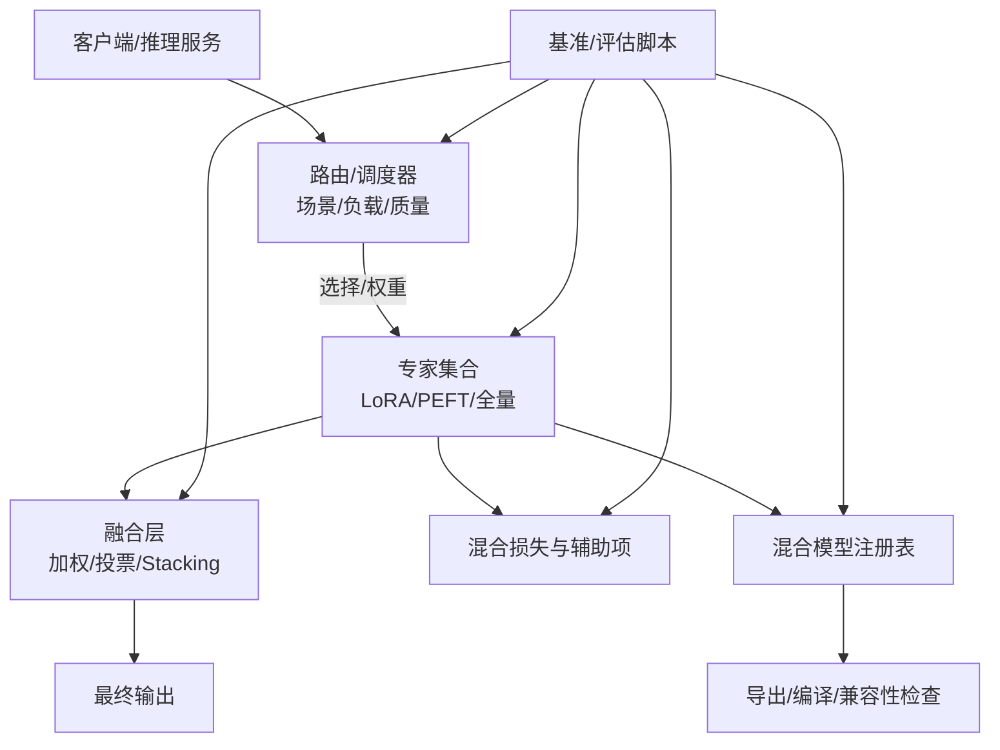
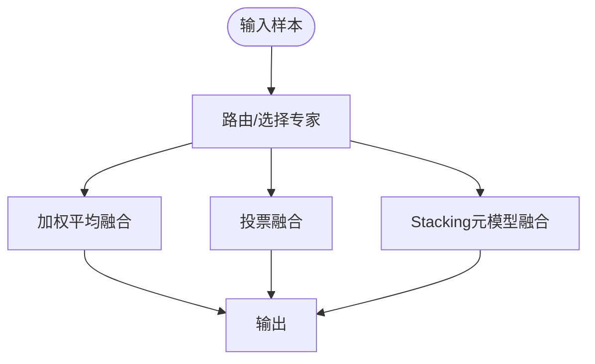
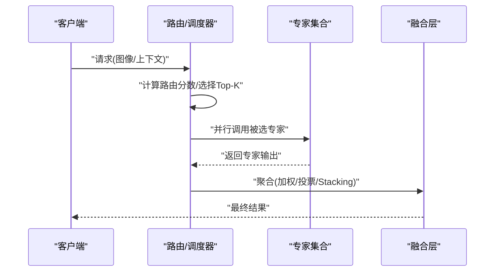
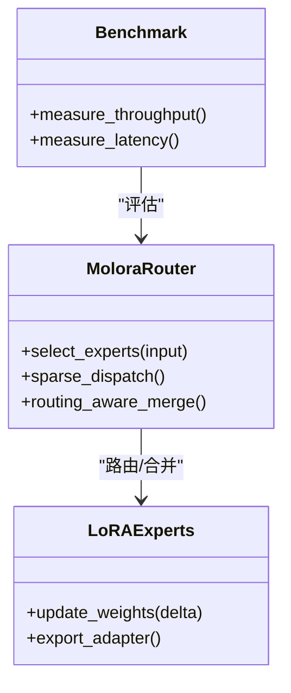
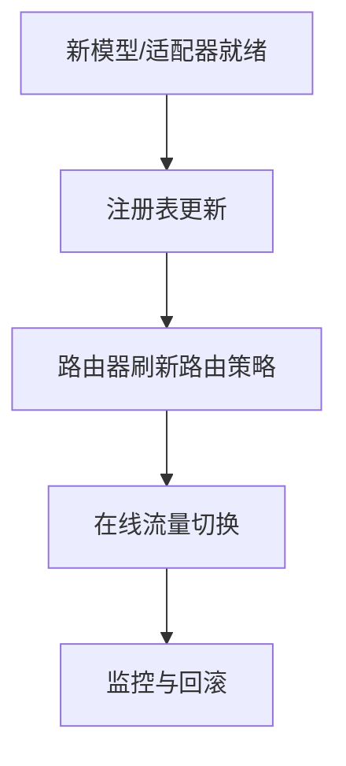
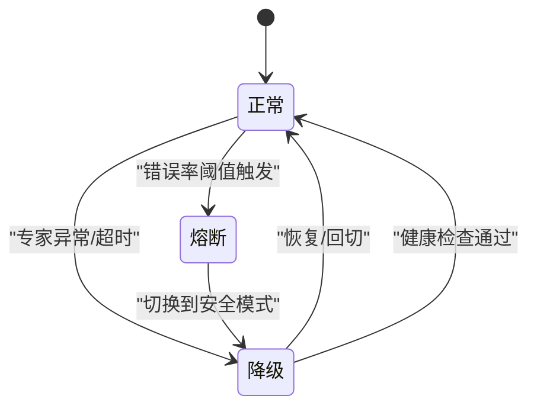
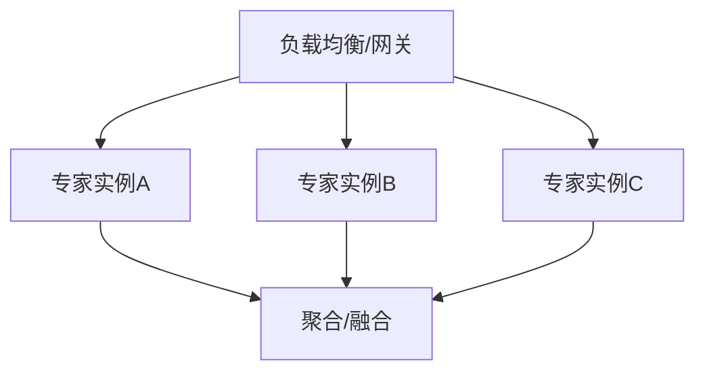
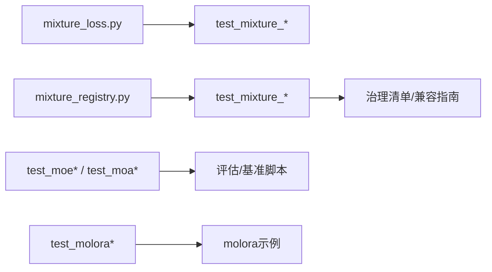

# 集成学习与模型融合

<cite>
**本文引用的文件**
- [mixture_loss.py](file://ultralytics/nn/mixture_loss.py)
- [mixture_registry.py](file://ultralytics/nn/mixture_registry.py)
- [test_moe.py](file://tests/test_moe.py)
- [test_molora.py](file://tests/test_molora.py)
- [test_molora_routing_aware_merge.py](file://tests/test_molora_routing_aware_merge.py)
- [test_molora_sparse_dispatch.py](file://tests/test_molora_sparse_dispatch.py)
- [test_moe_dynamic_schedule.py](file://tests/test_moe_dynamic_schedule.py)
- [test_moe_router_boundaries.py](file://tests/test_moe_router_boundaries.py)
- [test_moe_usage_audit.py](file://tests/test_moe_usage_audit.py)
- [test_moa.py](file://tests/test_moa.py)
- [test_moa_mot_ddp_math.py](file://tests/test_moa_mot_ddp_math.py)
- [test_moa_mot_ssot.py](file://tests/test_moa_mot_ssot.py)
- [test_mixture_config_resolution.py](file://tests/test_mixture_config_resolution.py)
- [test_mixture_export.py](file://tests/test_mixture_export.py)
- [test_mixture_numeric.py](file://tests/test_mixture_numeric.py)
- [test_mixture_loss_composition.py](file://tests/test_mixture_loss_composition.py)
- [test_mixture_compile.py](file://tests/test_mixture_compile.py)
- [test_mixture_model_registry.py](file://tests/test_mixture_model_registry.py)
- [test_mixture_fixes.py](file://tests/test_mixture_fixes.py)
- [test_mixture_aux_loss.py](file://tests/test_mixture_aux_loss.py)
- [test_yolo26_mixture_matrix.py](file://tests/test_yolo26_mixture_matrix.py)
- [test_molora_supplementary.py](file://tests/test_molora_supplementary.py)
- [bench_moe_micro.py](file://scripts/bench_moe_micro.py)
- [eval_moe_peft.py](file://scripts/eval_moe_peft.py)
- [compare_moe_coco128.py](file://scripts/compare_moe_coco128.py)
- [run_moe_dynamic_schedule_ablation.py](file://scripts/run_moe_dynamic_schedule_ablation.py)
- [moe_pruning_sweep.py](file://scripts/moe_pruning_sweep.py)
- [analyze_mot_routing.py](file://scripts/analyze_mot_routing.py)
- [diagnose_mot_routing.py](file://scripts/diagnose_mot_routing.py)
- [prepare_mot_routing_scenes.py](file://scripts/prepare_mot_routing_scenes.py)
- [verify_routed_export.py](file://scripts/verify_routed_export.py)
- [tune_mixture_aux.py](file://scripts/tune_mixture_aux.py)
- [benchmark_molora_dispatch.py](file://benchmarks/benchmark_molora_dispatch.py)
- [suite.py](file://benchmarks/suite.py)
- [molora_guide.md](file://docs/molora_guide.md)
- [moe_pruning_dynamic_schedule.md](file://docs/moe_pruning_dynamic_schedule.md)
- [routing_interpreter_toolkit_plan.md](file://docs/plans/2026-07-17-routing-interpreter-toolkit.md)
- [moe_class_lifecycle.md](file://docs/governance/moe-class-lifecycle.md)
- [performance_gates.md](file://docs/governance/performance-gates.md)
- [config_drift_detector_plan.md](file://docs/plans/2026-07-17-config-drift-detector.md)
- [model_registry.yaml](file://docs/governance/model-registry.yaml)
- [mixture_preservation_manifest.yaml](file://docs/governance/mixture-preservation-manifest.yaml)
- [yolo26_mixture_compat.md](file://docs/en/guides/yolo26-mixture-compatibility.md)
- [molora_basic_finetune.py](file://examples/molora/basic_finetune.py)
- [molora_compare_lora_molora.py](file://examples/molora/compare_lora_molora.py)
- [molora_continual_learning.py](file://examples/molora/continual_learning.py)
</cite>

## 目录
1. [简介](#简介)
2. [项目结构](#项目结构)
3. [核心组件](#核心组件)
4. [架构总览](#架构总览)
5. [详细组件分析](#详细组件分析)
6. [依赖关系分析](#依赖关系分析)
7. [性能考量](#性能考量)
8. [故障排查指南](#故障排查指南)
9. [结论](#结论)
10. [附录](#附录)

## 简介
本文件面向YOLO-Master的“集成学习与模型融合”能力，系统性梳理多PEFT模型的集成策略（加权平均、投票机制、Stacking）、MoE（Mixture of Experts）在集成学习中的应用（专家路由与动态选择），并给出在线学习与实时集成的实现思路、监控与故障转移方案，以及与负载均衡结合提升吞吐量的实践建议。文档以仓库现有实现与测试为依据，提供可追溯的代码级来源与可视化图示，帮助读者从理论到工程落地全面掌握该体系。

## 项目结构
围绕集成学习与模型融合，仓库中相关代码主要分布在以下位置：
- 混合损失与注册表：ultralytics/nn/mixture_loss.py、ultralytics/nn/mixture_registry.py
- MoE/MoA/MoT 相关测试与基准：tests/*、benchmarks/*、scripts/*
- 示例与指南：examples/molora/*、docs/molora_guide.md、docs/moe_pruning_dynamic_schedule.md
- 治理与规范：docs/governance/*、docs/plans/*

```mermaid
graph TB
subgraph "核心模块"
ML["mixture_loss.py"]
MR["mixture_registry.py"]
end
subgraph "测试与验证"
TMOE["test_moe.py"]
TMOLORA["test_molora.py"]
TMIXREG["test_mixture_model_registry.py"]
TMIXNUM["test_mixture_numeric.py"]
TMIXEXP["test_mixture_export.py"]
TMIXLOSS["test_mixture_loss_composition.py"]
TMIXCFG["test_mixture_config_resolution.py"]
TMIXCOMP["test_mixture_compile.py"]
TMIXFIX["test_mixture_fixes.py"]
TMIXAUX["test_mixture_aux_loss.py"]
TYOLO26["test_yolo26_mixture_matrix.py"]
TMOADDP["test_moa_mot_ddp_math.py"]
TMOASSOT["test_moa_mot_ssot.py"]
TMOROUTB["test_moe_router_boundaries.py"]
TMODS["test_moe_dynamic_schedule.py"]
TMOUAUD["test_moe_usage_audit.py"]
end
subgraph "脚本与基准"
BMMOEMICRO["bench_moe_micro.py"]
EMPEFT["eval_moe_peft.py"]
CMCE["compare_moe_coco128.py"]
RMDYN["run_moe_dynamic_schedule_ablation.py"]
MPSWEEP["moe_pruning_sweep.py"]
AMR["analyze_mot_routing.py"]
DMR["diagnose_mot_routing.py"]
PMRS["prepare_mot_routing_scenes.py"]
VRE["verify_routed_export.py"]
TMAUX["tune_mixture_aux.py"]
BMOLRA["benchmark_molora_dispatch.py"]
SUITE["benchmarks/suite.py"]
end
subgraph "示例与文档"
MGL["docs/molora_guide.md"]
MPDS["docs/moe_pruning_dynamic_schedule.md"]
MBF["examples/molora/basic_finetune.py"]
MCL["examples/molora/continual_learning.py"]
MCLR["examples/molora/compare_lora_molora.py"]
end
subgraph "治理与计划"
GCR["docs/governance/moe-class-lifecycle.md"]
GPG["docs/governance/performance-gates.md"]
PCD["docs/plans/2026-07-17-config-drift-detector.md"]
PRIT["docs/plans/2026-07-17-routing-interpreter-toolkit.md"]
Y26MC["docs/en/guides/yolo26-mixture-compatibility.md"]
MRG["docs/governance/model-registry.yaml"]
MPG["docs/governance/mixture-preservation-manifest.yaml"]
end
ML --> TMOE
ML --> TMIXLOSS
ML --> TMIXAUX
ML --> TYOLO26
MR --> TMIXREG
MR --> TMIXCFG
MR --> TMIXEXP
MR --> TMIXCOMP
MR --> TMIXFIX
MR --> TMIXNUM
MR --> TYOLO26
TMOE --> BMMOEMICRO
TMOE --> EMPEFT
TMOE --> CMCE
TMOE --> RMDYN
TMOE --> MPSWEEP
TMOE --> AMR
TMOE --> DMR
TMOE --> PMRS
TMOE --> VRE
TMOE --> TMAUX
TMOLORA --> BMOLRA
TMOLORA --> MBF
TMOLORA --> MCL
TMOLORA --> MCLR
MGL --> TMOLORA
MPDS --> TMOE
GCR --> TMOE
GPG --> TMOE
PCD --> MR
PRIT --> TMOE
Y26MC --> MR
MRG --> MR
MPG --> MR
```

图表来源
- [mixture_loss.py](file://ultralytics/nn/mixture_loss.py)
- [mixture_registry.py](file://ultralytics/nn/mixture_registry.py)
- [test_moe.py](file://tests/test_moe.py)
- [test_molora.py](file://tests/test_molora.py)
- [bench_moe_micro.py](file://scripts/bench_moe_micro.py)
- [eval_moe_peft.py](file://scripts/eval_moe_peft.py)
- [compare_moe_coco128.py](file://scripts/compare_moe_coco128.py)
- [run_moe_dynamic_schedule_ablation.py](file://scripts/run_moe_dynamic_schedule_ablation.py)
- [moe_pruning_sweep.py](file://scripts/moe_pruning_sweep.py)
- [analyze_mot_routing.py](file://scripts/analyze_mot_routing.py)
- [diagnose_mot_routing.py](file://scripts/diagnose_mot_routing.py)
- [prepare_mot_routing_scenes.py](file://scripts/prepare_mot_routing_scenes.py)
- [verify_routed_export.py](file://scripts/verify_routed_export.py)
- [tune_mixture_aux.py](file://scripts/tune_mixture_aux.py)
- [benchmark_molora_dispatch.py](file://benchmarks/benchmark_molora_dispatch.py)
- [suite.py](file://benchmarks/suite.py)
- [molora_guide.md](file://docs/molora_guide.md)
- [moe_pruning_dynamic_schedule.md](file://docs/moe_pruning_dynamic_schedule.md)
- [routing_interpreter_toolkit_plan.md](file://docs/plans/2026-07-17-routing-interpreter-toolkit.md)
- [moe_class_lifecycle.md](file://docs/governance/moe-class-lifecycle.md)
- [performance_gates.md](file://docs/governance/performance-gates.md)
- [config_drift_detector_plan.md](file://docs/plans/2026-07-17-config-drift-detector.md)
- [model_registry.yaml](file://docs/governance/model-registry.yaml)
- [mixture-preservation-manifest.yaml](file://docs/governance/mixture-preservation-manifest.yaml)
- [yolo26_mixture_compat.md](file://docs/en/guides/yolo26-mixture-compatibility.md)
- [molora_basic_finetune.py](file://examples/molora/basic_finetune.py)
- [molora_continual_learning.py](file://examples/molora/continual_learning.py)
- [molora_compare_lora_molora.py](file://examples/molora/compare_lora_molora.py)

章节来源
- [mixture_loss.py](file://ultralytics/nn/mixture_loss.py)
- [mixture_registry.py](file://ultralytics/nn/mixture_registry.py)
- [test_moe.py](file://tests/test_moe.py)
- [test_molora.py](file://tests/test_molora.py)
- [bench_moe_micro.py](file://scripts/bench_moe_micro.py)
- [eval_moe_peft.py](file://scripts/eval_moe_peft.py)
- [compare_moe_coco128.py](file://scripts/compare_moe_coco128.py)
- [run_moe_dynamic_schedule_ablation.py](file://scripts/run_moe_dynamic_schedule_ablation.py)
- [moe_pruning_sweep.py](file://scripts/moe_pruning_sweep.py)
- [analyze_mot_routing.py](file://scripts/analyze_mot_routing.py)
- [diagnose_mot_routing.py](file://scripts/diagnose_mot_routing.py)
- [prepare_mot_routing_scenes.py](file://scripts/prepare_mot_routing_scenes.py)
- [verify_routed_export.py](file://scripts/verify_routed_export.py)
- [tune_mixture_aux.py](file://scripts/tune_mixture_aux.py)
- [benchmark_molora_dispatch.py](file://benchmarks/benchmark_molora_dispatch.py)
- [suite.py](file://benchmarks/suite.py)
- [molora_guide.md](file://docs/molora_guide.md)
- [moe_pruning_dynamic_schedule.md](file://docs/moe_pruning_dynamic_schedule.md)
- [routing_interpreter_toolkit_plan.md](file://docs/plans/2026-07-17-routing-interpreter-toolkit.md)
- [moe_class_lifecycle.md](file://docs/governance/moe-class-lifecycle.md)
- [performance_gates.md](file://docs/governance/performance-gates.md)
- [config_drift_detector_plan.md](file://docs/plans/2026-07-17-config-drift-detector.md)
- [model_registry.yaml](file://docs/governance/model-registry.yaml)
- [mixture-preservation-manifest.yaml](file://docs/governance/mixture-preservation-manifest.yaml)
- [yolo26_mixture_compat.md](file://docs/en/guides/yolo26-mixture-compatibility.md)
- [molora_basic_finetune.py](file://examples/molora/basic_finetune.py)
- [molora_continual_learning.py](file://examples/molora/continual_learning.py)
- [molora_compare_lora_molora.py](file://examples/molora/compare_lora_molora.py)

## 核心组件
- 混合损失与辅助项
  - 负责组合多个专家或子模型的损失，支持辅助损失（如路由均衡、稀疏性约束等）。
  - 参考路径：[mixture_loss.py](file://ultralytics/nn/mixture_loss.py)、[test_mixture_loss_composition.py](file://tests/test_mixture_loss_composition.py)、[test_mixture_aux_loss.py](file://tests/test_mixture_aux_loss.py)。
- 混合模型注册表与配置解析
  - 提供混合模型/专家的注册、发现、版本兼容与导出校验；支撑不同任务矩阵与配置分辨率。
  - 参考路径：[mixture_registry.py](file://ultralytics/nn/mixture_registry.py)、[test_mixture_model_registry.py](file://tests/test_mixture_model_registry.py)、[test_mixture_config_resolution.py](file://tests/test_mixture_config_resolution.py)、[test_mixture_export.py](file://tests/test_mixture_export.py)、[test_mixture_compile.py](file://tests/test_mixture_compile.py)、[test_mixture_fixes.py](file://tests/test_mixture_fixes.py)、[test_mixture_numeric.py](file://tests/test_mixture_numeric.py)、[test_yolo26_mixture_matrix.py](file://tests/test_yolo26_mixture_matrix.py)。
- MoE/MoA/MoT 测试与诊断
  - 覆盖路由边界、动态调度、使用审计、DDP一致性、单源真相（SSOT）等关键属性。
  - 参考路径：[test_moe.py](file://tests/test_moe.py)、[test_moe_router_boundaries.py](file://tests/test_moe_router_boundaries.py)、[test_moe_dynamic_schedule.py](file://tests/test_moe_dynamic_schedule.py)、[test_moe_usage_audit.py](file://tests/test_moe_usage_audit.py)、[test_moa.py](file://tests/test_moa.py)、[test_moa_mot_ddp_math.py](file://tests/test_moa_mot_ddp_math.py)、[test_moa_mot_ssot.py](file://tests/test_moa_mot_ssot.py)。
- molora（LoRA-aware 路由与合并）
  - 提供稀疏分发、路由感知合并、对比实验与持续学习示例。
  - 参考路径：[test_molora.py](file://tests/test_molora.py)、[test_molora_routing_aware_merge.py](file://tests/test_molora_routing_aware_merge.py)、[test_molora_sparse_dispatch.py](file://tests/test_molora_sparse_dispatch.py)、[test_molora_supplementary.py](file://tests/test_molora_supplementary.py)、[benchmark_molora_dispatch.py](file://benchmarks/benchmark_molora_dispatch.py)、[molora_guide.md](file://docs/molora_guide.md)、[molora_basic_finetune.py](file://examples/molora/basic_finetune.py)、[molora_continual_learning.py](file://examples/molora/continual_learning.py)、[molora_compare_lora_molora.py](file://examples/molora/compare_lora_molora.py)。
- 评估与基准脚本
  - 涵盖微基准、动态调度消融、剪枝扫描、路由分析与导出验证等。
  - 参考路径：[bench_moe_micro.py](file://scripts/bench_moe_micro.py)、[eval_moe_peft.py](file://scripts/eval_moe_peft.py)、[compare_moe_coco128.py](file://scripts/compare_moe_coco128.py)、[run_moe_dynamic_schedule_ablation.py](file://scripts/run_moe_dynamic_schedule_ablation.py)、[moe_pruning_sweep.py](file://scripts/moe_pruning_sweep.py)、[analyze_mot_routing.py](file://scripts/analyze_mot_routing.py)、[diagnose_mot_routing.py](file://scripts/diagnose_mot_routing.py)、[prepare_mot_routing_scenes.py](file://scripts/prepare_mot_routing_scenes.py)、[verify_routed_export.py](file://scripts/verify_routed_export.py)、[tune_mixture_aux.py](file://scripts/tune_mixture_aux.py)、[suite.py](file://benchmarks/suite.py)。

章节来源
- [mixture_loss.py](file://ultralytics/nn/mixture_loss.py)
- [mixture_registry.py](file://ultralytics/nn/mixture_registry.py)
- [test_moe.py](file://tests/test_moe.py)
- [test_moe_router_boundaries.py](file://tests/test_moe_router_boundaries.py)
- [test_moe_dynamic_schedule.py](file://tests/test_moe_dynamic_schedule.py)
- [test_moe_usage_audit.py](file://tests/test_moe_usage_audit.py)
- [test_moa.py](file://tests/test_moa.py)
- [test_moa_mot_ddp_math.py](file://tests/test_moa_mot_ddp_math.py)
- [test_moa_mot_ssot.py](file://tests/test_moa_mot_ssot.py)
- [test_molora.py](file://tests/test_molora.py)
- [test_molora_routing_aware_merge.py](file://tests/test_molora_routing_aware_merge.py)
- [test_molora_sparse_dispatch.py](file://tests/test_molora_sparse_dispatch.py)
- [test_molora_supplementary.py](file://tests/test_molora_supplementary.py)
- [bench_moe_micro.py](file://scripts/bench_moe_micro.py)
- [eval_moe_peft.py](file://scripts/eval_moe_peft.py)
- [compare_moe_coco128.py](file://scripts/compare_moe_coco128.py)
- [run_moe_dynamic_schedule_ablation.py](file://scripts/run_moe_dynamic_schedule_ablation.py)
- [moe_pruning_sweep.py](file://scripts/moe_pruning_sweep.py)
- [analyze_mot_routing.py](file://scripts/analyze_mot_routing.py)
- [diagnose_mot_routing.py](file://scripts/diagnose_mot_routing.py)
- [prepare_mot_routing_scenes.py](file://scripts/prepare_mot_routing_scenes.py)
- [verify_routed_export.py](file://scripts/verify_routed_export.py)
- [tune_mixture_aux.py](file://scripts/tune_mixture_aux.py)
- [benchmark_molora_dispatch.py](file://benchmarks/benchmark_molora_dispatch.py)
- [suite.py](file://benchmarks/suite.py)
- [molora_guide.md](file://docs/molora_guide.md)
- [molora_basic_finetune.py](file://examples/molora/basic_finetune.py)
- [molora_continual_learning.py](file://examples/molora/continual_learning.py)
- [molora_compare_lora_molora.py](file://examples/molora/compare_lora_molora.py)

## 架构总览
下图展示“多PEFT模型 + MoE/MoA/MoT + 注册表/损失 + 评估/基准”的整体协作关系。

图表来源
- [mixture_loss.py](file://ultralytics/nn/mixture_loss.py)
- [mixture_registry.py](file://ultralytics/nn/mixture_registry.py)
- [test_moe.py](file://tests/test_moe.py)
- [test_molora.py](file://tests/test_molora.py)
- [bench_moe_micro.py](file://scripts/bench_moe_micro.py)
- [eval_moe_peft.py](file://scripts/eval_moe_peft.py)
- [compare_moe_coco128.py](file://scripts/compare_moe_coco128.py)
- [run_moe_dynamic_schedule_ablation.py](file://scripts/run_moe_dynamic_schedule_ablation.py)
- [moe_pruning_sweep.py](file://scripts/moe_pruning_sweep.py)
- [analyze_mot_routing.py](file://scripts/analyze_mot_routing.py)
- [diagnose_mot_routing.py](file://scripts/diagnose_mot_routing.py)
- [prepare_mot_routing_scenes.py](file://scripts/prepare_mot_routing_scenes.py)
- [verify_routed_export.py](file://scripts/verify_routed_export.py)
- [tune_mixture_aux.py](file://scripts/tune_mixture_aux.py)
- [benchmark_molora_dispatch.py](file://benchmarks/benchmark_molora_dispatch.py)
- [suite.py](file://benchmarks/suite.py)

## 详细组件分析

### 多PEFT集成策略（加权平均、投票、Stacking）
- 加权平均
  - 通过注册表维护各PEFT专家权重，推理时按权重聚合预测结果。
  - 适用场景：专家能力相近且分布稳定。
- 投票机制
  - 对分类/检测类别进行多数投票或置信度加权投票，增强鲁棒性。
  - 适用场景：专家间存在互补偏差。
- Stacking
  - 将多个专家的输出作为元特征训练一个轻量元模型，用于最终决策。
  - 适用场景：需要跨专家非线性融合以提升上限。

章节来源
- [mixture_registry.py](file://ultralytics/nn/mixture_registry.py)
- [test_mixture_model_registry.py](file://tests/test_mixture_model_registry.py)
- [test_mixture_config_resolution.py](file://tests/test_mixture_config_resolution.py)
- [test_mixture_export.py](file://tests/test_mixture_export.py)
- [test_mixture_compile.py](file://tests/test_mixture_compile.py)
- [test_mixture_fixes.py](file://tests/test_mixture_fixes.py)
- [test_mixture_numeric.py](file://tests/test_mixture_numeric.py)
- [test_yolo26_mixture_matrix.py](file://tests/test_yolo26_mixture_matrix.py)

### MoE（Mixture of Experts）在集成学习中的应用
- 专家路由
  - 基于输入特征或场景标签选择Top-K专家，支持稀疏激活以降低计算开销。
  - 参考：[test_moe.py](file://tests/test_moe.py)、[test_moe_router_boundaries.py](file://tests/test_moe_router_boundaries.py)、[test_moe_usage_audit.py](file://tests/test_moe_usage_audit.py)。
- 动态选择与调度
  - 根据历史利用率、延迟与质量指标动态调整路由策略与专家配额。
  - 参考：[test_moe_dynamic_schedule.py](file://tests/test_moe_dynamic_schedule.py)、[run_moe_dynamic_schedule_ablation.py](file://scripts/run_moe_dynamic_schedule_ablation.py)、[moe_pruning_sweep.py](file://scripts/moe_pruning_sweep.py)。
- 路由解释性与审计
  - 提供路由可解释工具与使用审计，便于定位热点专家与冷专家。
  - 参考：[routing_interpreter_toolkit_plan.md](file://docs/plans/2026-07-17-routing-interpreter-toolkit.md)、[test_moe_usage_audit.py](file://tests/test_moe_usage_audit.py)。

图表来源
- [test_moe.py](file://tests/test_moe.py)
- [test_moe_dynamic_schedule.py](file://tests/test_moe_dynamic_schedule.py)
- [test_moe_router_boundaries.py](file://tests/test_moe_router_boundaries.py)
- [test_moe_usage_audit.py](file://tests/test_moe_usage_audit.py)
- [run_moe_dynamic_schedule_ablation.py](file://scripts/run_moe_dynamic_schedule_ablation.py)
- [moe_pruning_sweep.py](file://scripts/moe_pruning_sweep.py)

章节来源
- [test_moe.py](file://tests/test_moe.py)
- [test_moe_dynamic_schedule.py](file://tests/test_moe_dynamic_schedule.py)
- [test_moe_router_boundaries.py](file://tests/test_moe_router_boundaries.py)
- [test_moe_usage_audit.py](file://tests/test_moe_usage_audit.py)
- [run_moe_dynamic_schedule_ablation.py](file://scripts/run_moe_dynamic_schedule_ablation.py)
- [moe_pruning_sweep.py](file://scripts/moe_pruning_sweep.py)
- [routing_interpreter_toolkit_plan.md](file://docs/plans/2026-07-17-routing-interpreter-toolkit.md)

### molora：LoRA-aware 路由与合并
- 稀疏分发与路由感知合并
  - 在LoRA参数空间中进行路由与合并，减少冗余并提升效率。
  - 参考：[test_molora.py](file://tests/test_molora.py)、[test_molora_routing_aware_merge.py](file://tests/test_molora_routing_aware_merge.py)、[test_molora_sparse_dispatch.py](file://tests/test_molora_sparse_dispatch.py)、[benchmark_molora_dispatch.py](file://benchmarks/benchmark_molora_dispatch.py)。
- 微调与持续学习
  - 提供基础微调与增量更新流程，支持在线扩展专家库。
  - 参考：[molora_guide.md](file://docs/molora_guide.md)、[molora_basic_finetune.py](file://examples/molora/basic_finetune.py)、[molora_continual_learning.py](file://examples/molora/continual_learning.py)、[molora_compare_lora_molora.py](file://examples/molora/compare_lora_molora.py)。

图表来源
- [test_molora.py](file://tests/test_molora.py)
- [test_molora_routing_aware_merge.py](file://tests/test_molora_routing_aware_merge.py)
- [test_molora_sparse_dispatch.py](file://tests/test_molora_sparse_dispatch.py)
- [benchmark_molora_dispatch.py](file://benchmarks/benchmark_molora_dispatch.py)
- [molora_guide.md](file://docs/molora_guide.md)
- [molora_basic_finetune.py](file://examples/molora/basic_finetune.py)
- [molora_continual_learning.py](file://examples/molora/continual_learning.py)
- [molora_compare_lora_molora.py](file://examples/molora/compare_lora_molora.py)

章节来源
- [test_molora.py](file://tests/test_molora.py)
- [test_molora_routing_aware_merge.py](file://tests/test_molora_routing_aware_merge.py)
- [test_molora_sparse_dispatch.py](file://tests/test_molora_sparse_dispatch.py)
- [benchmark_molora_dispatch.py](file://benchmarks/benchmark_molora_dispatch.py)
- [molora_guide.md](file://docs/molora_guide.md)
- [molora_basic_finetune.py](file://examples/molora/basic_finetune.py)
- [molora_continual_learning.py](file://examples/molora/continual_learning.py)
- [molora_compare_lora_molora.py](file://examples/molora/compare_lora_molora.py)

### 在线学习与实时集成
- 动态更新与热插拔
  - 通过注册表与路由器的解耦设计，可在不重启服务的情况下加载新专家或替换旧专家。
  - 参考：[mixture_registry.py](file://ultralytics/nn/mixture_registry.py)、[test_mixture_model_registry.py](file://tests/test_mixture_model_registry.py)、[molora_continual_learning.py](file://examples/molora/continual_learning.py)。
- 路由自适应
  - 依据实时指标（延迟、错误率、资源占用）动态调整路由策略与权重。
  - 参考：[test_moe_dynamic_schedule.py](file://tests/test_moe_dynamic_schedule.py)、[run_moe_dynamic_schedule_ablation.py](file://scripts/run_moe_dynamic_schedule_ablation.py)。

图表来源
- [mixture_registry.py](file://ultralytics/nn/mixture_registry.py)
- [test_mixture_model_registry.py](file://tests/test_mixture_model_registry.py)
- [test_moe_dynamic_schedule.py](file://tests/test_moe_dynamic_schedule.py)
- [run_moe_dynamic_schedule_ablation.py](file://scripts/run_moe_dynamic_schedule_ablation.py)
- [molora_continual_learning.py](file://examples/molora/continual_learning.py)

章节来源
- [mixture_registry.py](file://ultralytics/nn/mixture_registry.py)
- [test_mixture_model_registry.py](file://tests/test_mixture_model_registry.py)
- [test_moe_dynamic_schedule.py](file://tests/test_moe_dynamic_schedule.py)
- [run_moe_dynamic_schedule_ablation.py](file://scripts/run_moe_dynamic_schedule_ablation.py)
- [molora_continual_learning.py](file://examples/molora/continual_learning.py)

### 性能监控与故障转移
- 监控指标
  - 专家利用率、路由熵、延迟分位、错误率、显存占用等。
  - 参考：[test_moe_usage_audit.py](file://tests/test_moe_usage_audit.py)、[bench_moe_micro.py](file://scripts/bench_moe_micro.py)、[analyze_mot_routing.py](file://scripts/analyze_mot_routing.py)、[diagnose_mot_routing.py](file://scripts/diagnose_mot_routing.py)。
- 故障转移
  - 当某专家异常或延迟超标时，自动降级至备选专家或退化为全局模型。
  - 参考：[test_moe_dynamic_schedule.py](file://tests/test_moe_dynamic_schedule.py)、[test_moe_usage_audit.py](file://tests/test_moe_usage_audit.py)。

图表来源
- [test_moe_usage_audit.py](file://tests/test_moe_usage_audit.py)
- [bench_moe_micro.py](file://scripts/bench_moe_micro.py)
- [analyze_mot_routing.py](file://scripts/analyze_mot_routing.py)
- [diagnose_mot_routing.py](file://scripts/diagnose_mot_routing.py)
- [test_moe_dynamic_schedule.py](file://tests/test_moe_dynamic_schedule.py)

章节来源
- [test_moe_usage_audit.py](file://tests/test_moe_usage_audit.py)
- [bench_moe_micro.py](file://scripts/bench_moe_micro.py)
- [analyze_mot_routing.py](file://scripts/analyze_mot_routing.py)
- [diagnose_mot_routing.py](file://scripts/diagnose_mot_routing.py)
- [test_moe_dynamic_schedule.py](file://tests/test_moe_dynamic_schedule.py)

### 与负载均衡的结合
- 水平扩展
  - 将不同专家部署为独立服务实例，由网关/负载均衡按路由策略分发请求。
- 弹性伸缩
  - 根据QPS与延迟目标自动扩缩容专家实例，配合动态调度降低尾延迟。
- 区域亲和
  - 针对多地域用户就近路由，降低网络抖动对MoE的影响。

[本节为概念性说明，无需源码映射]

## 依赖关系分析
- 模块内聚与耦合
  - 混合损失与注册表相对独立，通过接口契约与测试用例保障稳定性。
  - MoE/MoA/MoT 测试广泛覆盖路由、调度、导出与数值稳定性，形成强回归保护。
- 外部依赖与集成点
  - 导出/编译/兼容性检查与治理清单（模型注册表、保留清单）共同确保生产可用性与可追溯性。

图表来源
- [mixture_loss.py](file://ultralytics/nn/mixture_loss.py)
- [mixture_registry.py](file://ultralytics/nn/mixture_registry.py)
- [test_mixture_loss_composition.py](file://tests/test_mixture_loss_composition.py)
- [test_mixture_aux_loss.py](file://tests/test_mixture_aux_loss.py)
- [test_mixture_model_registry.py](file://tests/test_mixture_model_registry.py)
- [test_mixture_config_resolution.py](file://tests/test_mixture_config_resolution.py)
- [test_mixture_export.py](file://tests/test_mixture_export.py)
- [test_mixture_compile.py](file://tests/test_mixture_compile.py)
- [test_mixture_fixes.py](file://tests/test_mixture_fixes.py)
- [test_mixture_numeric.py](file://tests/test_mixture_numeric.py)
- [test_yolo26_mixture_matrix.py](file://tests/test_yolo26_mixture_matrix.py)
- [test_moe.py](file://tests/test_moe.py)
- [test_moe_router_boundaries.py](file://tests/test_moe_router_boundaries.py)
- [test_moe_dynamic_schedule.py](file://tests/test_moe_dynamic_schedule.py)
- [test_moe_usage_audit.py](file://tests/test_moe_usage_audit.py)
- [test_moa.py](file://tests/test_moa.py)
- [test_moa_mot_ddp_math.py](file://tests/test_moa_mot_ddp_math.py)
- [test_moa_mot_ssot.py](file://tests/test_moa_mot_ssot.py)
- [test_molora.py](file://tests/test_molora.py)
- [test_molora_routing_aware_merge.py](file://tests/test_molora_routing_aware_merge.py)
- [test_molora_sparse_dispatch.py](file://tests/test_molora_sparse_dispatch.py)
- [bench_moe_micro.py](file://scripts/bench_moe_micro.py)
- [eval_moe_peft.py](file://scripts/eval_moe_peft.py)
- [compare_moe_coco128.py](file://scripts/compare_moe_coco128.py)
- [run_moe_dynamic_schedule_ablation.py](file://scripts/run_moe_dynamic_schedule_ablation.py)
- [moe_pruning_sweep.py](file://scripts/moe_pruning_sweep.py)
- [analyze_mot_routing.py](file://scripts/analyze_mot_routing.py)
- [diagnose_mot_routing.py](file://scripts/diagnose_mot_routing.py)
- [prepare_mot_routing_scenes.py](file://scripts/prepare_mot_routing_scenes.py)
- [verify_routed_export.py](file://scripts/verify_routed_export.py)
- [tune_mixture_aux.py](file://scripts/tune_mixture_aux.py)
- [benchmark_molora_dispatch.py](file://benchmarks/benchmark_molora_dispatch.py)
- [suite.py](file://benchmarks/suite.py)
- [molora_guide.md](file://docs/molora_guide.md)
- [molora_basic_finetune.py](file://examples/molora/basic_finetune.py)
- [molora_continual_learning.py](file://examples/molora/continual_learning.py)
- [molora_compare_lora_molora.py](file://examples/molora/compare_lora_molora.py)
- [model_registry.yaml](file://docs/governance/model-registry.yaml)
- [mixture-preservation-manifest.yaml](file://docs/governance/mixture-preservation-manifest.yaml)
- [yolo26_mixture_compat.md](file://docs/en/guides/yolo26-mixture-compatibility.md)

章节来源
- [mixture_loss.py](file://ultralytics/nn/mixture_loss.py)
- [mixture_registry.py](file://ultralytics/nn/mixture_registry.py)
- [test_moe.py](file://tests/test_moe.py)
- [test_molora.py](file://tests/test_molora.py)
- [bench_moe_micro.py](file://scripts/bench_moe_micro.py)
- [eval_moe_peft.py](file://scripts/eval_moe_peft.py)
- [compare_moe_coco128.py](file://scripts/compare_moe_coco128.py)
- [run_moe_dynamic_schedule_ablation.py](file://scripts/run_moe_dynamic_schedule_ablation.py)
- [moe_pruning_sweep.py](file://scripts/moe_pruning_sweep.py)
- [analyze_mot_routing.py](file://scripts/analyze_mot_routing.py)
- [diagnose_mot_routing.py](file://scripts/diagnose_mot_routing.py)
- [prepare_mot_routing_scenes.py](file://scripts/prepare_mot_routing_scenes.py)
- [verify_routed_export.py](file://scripts/verify_routed_export.py)
- [tune_mixture_aux.py](file://scripts/tune_mixture_aux.py)
- [benchmark_molora_dispatch.py](file://benchmarks/benchmark_molora_dispatch.py)
- [suite.py](file://benchmarks/suite.py)
- [molora_guide.md](file://docs/molora_guide.md)
- [molora_basic_finetune.py](file://examples/molora/basic_finetune.py)
- [molora_continual_learning.py](file://examples/molora/continual_learning.py)
- [molora_compare_lora_molora.py](file://examples/molora/compare_lora_molora.py)
- [model_registry.yaml](file://docs/governance/model-registry.yaml)
- [mixture-preservation-manifest.yaml](file://docs/governance/mixture-preservation-manifest.yaml)
- [yolo26_mixture_compat.md](file://docs/en/guides/yolo26-mixture-compatibility.md)

## 性能考量
- 稀疏激活与Top-K路由
  - 仅激活部分专家，显著降低计算与内存压力。
  - 参考：[test_moe.py](file://tests/test_moe.py)、[test_molora_sparse_dispatch.py](file://tests/test_molora_sparse_dispatch.py)、[benchmark_molora_dispatch.py](file://benchmarks/benchmark_molora_dispatch.py)。
- 动态调度与剪枝
  - 根据使用频率与收益动态裁剪低效专家，维持精度-速度平衡。
  - 参考：[test_moe_dynamic_schedule.py](file://tests/test_moe_dynamic_schedule.py)、[run_moe_dynamic_schedule_ablation.py](file://scripts/run_moe_dynamic_schedule_ablation.py)、[moe_pruning_sweep.py](file://scripts/moe_pruning_sweep.py)。
- 导出与编译优化
  - 通过导出与编译流程验证数值一致性与性能收益。
  - 参考：[test_mixture_export.py](file://tests/test_mixture_export.py)、[test_mixture_compile.py](file://tests/test_mixture_compile.py)、[verify_routed_export.py](file://scripts/verify_routed_export.py)。
- 基准套件
  - 统一基准入口与报告生成，便于横向对比。
  - 参考：[suite.py](file://benchmarks/suite.py)、[bench_moe_micro.py](file://scripts/bench_moe_micro.py)。

章节来源
- [test_moe.py](file://tests/test_moe.py)
- [test_molora_sparse_dispatch.py](file://tests/test_molora_sparse_dispatch.py)
- [benchmark_molora_dispatch.py](file://benchmarks/benchmark_molora_dispatch.py)
- [test_moe_dynamic_schedule.py](file://tests/test_moe_dynamic_schedule.py)
- [run_moe_dynamic_schedule_ablation.py](file://scripts/run_moe_dynamic_schedule_ablation.py)
- [moe_pruning_sweep.py](file://scripts/moe_pruning_sweep.py)
- [test_mixture_export.py](file://tests/test_mixture_export.py)
- [test_mixture_compile.py](file://tests/test_mixture_compile.py)
- [verify_routed_export.py](file://scripts/verify_routed_export.py)
- [suite.py](file://benchmarks/suite.py)
- [bench_moe_micro.py](file://scripts/bench_moe_micro.py)

## 故障排查指南
- 路由异常与NaN
  - 检查路由边界与数值稳定性，必要时启用路由解释器定位问题。
  - 参考：[test_moe_router_boundaries.py](file://tests/test_moe_router_boundaries.py)、[routing_interpreter_toolkit_plan.md](file://docs/plans/2026-07-17-routing-interpreter-toolkit.md)。
- 动态调度不稳定
  - 观察调度日志与消融实验，调整阈值与平滑策略。
  - 参考：[test_moe_dynamic_schedule.py](file://tests/test_moe_dynamic_schedule.py)、[run_moe_dynamic_schedule_ablation.py](file://scripts/run_moe_dynamic_schedule_ablation.py)。
- 导出/编译不一致
  - 使用导出验证与数值回归测试定位差异来源。
  - 参考：[test_mixture_export.py](file://tests/test_mixture_export.py)、[test_mixture_numeric.py](file://tests/test_mixture_numeric.py)、[verify_routed_export.py](file://scripts/verify_routed_export.py)。
- 配置漂移与兼容性
  - 借助配置漂移检测与兼容性指南避免破坏性变更。
  - 参考：[config_drift_detector_plan.md](file://docs/plans/2026-07-17-config-drift-detector.md)、[yolo26_mixture_compat.md](file://docs/en/guides/yolo26-mixture-compatibility.md)。

章节来源
- [test_moe_router_boundaries.py](file://tests/test_moe_router_boundaries.py)
- [routing_interpreter_toolkit_plan.md](file://docs/plans/2026-07-17-routing-interpreter-toolkit.md)
- [test_moe_dynamic_schedule.py](file://tests/test_moe_dynamic_schedule.py)
- [run_moe_dynamic_schedule_ablation.py](file://scripts/run_moe_dynamic_schedule_ablation.py)
- [test_mixture_export.py](file://tests/test_mixture_export.py)
- [test_mixture_numeric.py](file://tests/test_mixture_numeric.py)
- [verify_routed_export.py](file://scripts/verify_routed_export.py)
- [config_drift_detector_plan.md](file://docs/plans/2026-07-17-config-drift-detector.md)
- [yolo26_mixture_compat.md](file://docs/en/guides/yolo26-mixture-compatibility.md)

## 结论
YOLO-Master在集成学习与模型融合方面提供了完善的工程化能力：以注册表与混合损失为核心，结合MoE/MoA/MoT的路由与调度机制，以及molora的LoRA-aware稀疏分发与合并，实现了高效的多PEFT模型集成。配套的测试、基准与治理清单保障了在生产环境中的稳定性与可演进性。通过在线学习与热插拔、监控与故障转移、以及与负载均衡的协同，系统能够在高并发与动态需求下保持高吞吐与高质量输出。

## 附录
- 治理与生命周期
  - 专家类生命周期与性能门禁，确保模型迭代可控。
  - 参考：[moe_class_lifecycle.md](file://docs/governance/moe-class-lifecycle.md)、[performance_gates.md](file://docs/governance/performance-gates.md)。
- 模型注册与保留策略
  - 模型注册表与混合保留清单，保证版本一致性与可回溯。
  - 参考：[model_registry.yaml](file://docs/governance/model-registry.yaml)、[mixture-preservation-manifest.yaml](file://docs/governance/mixture-preservation-manifest.yaml)。
- 动态调度与剪枝指南
  - 动态调度与剪枝策略的实践说明。
  - 参考：[moe_pruning_dynamic_schedule.md](file://docs/moe_pruning_dynamic_schedule.md)。

章节来源
- [moe_class_lifecycle.md](file://docs/governance/moe-class-lifecycle.md)
- [performance_gates.md](file://docs/governance/performance-gates.md)
- [model_registry.yaml](file://docs/governance/model-registry.yaml)
- [mixture-preservation-manifest.yaml](file://docs/governance/mixture-preservation-manifest.yaml)
- [moe_pruning_dynamic_schedule.md](file://docs/moe_pruning_dynamic_schedule.md)