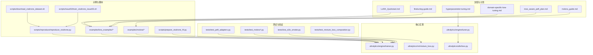
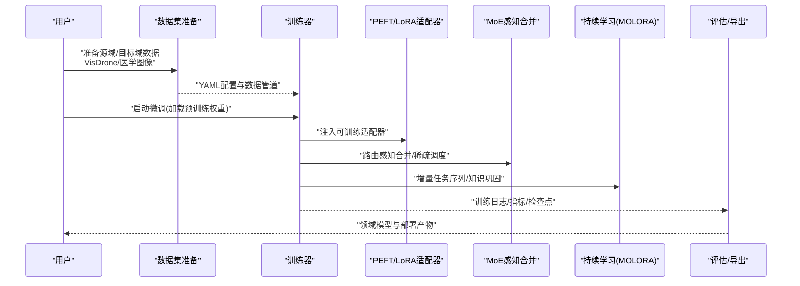
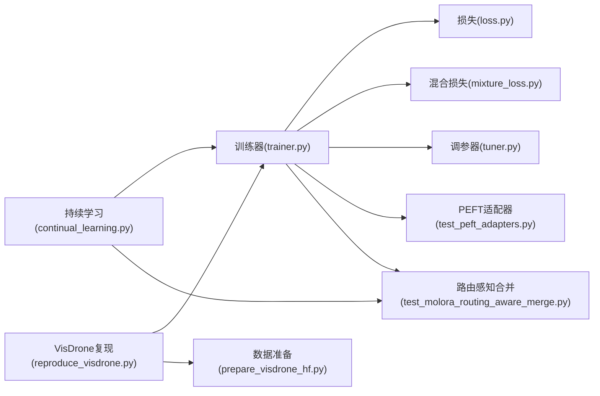

# 领域适应与迁移学习

<cite>
**本文引用的文件**
- [README.md](file://README.md)
- [LoRA_Quickstart.md](file://docs/LoRA_Quickstart.md)
- [finetuning-guide.md](file://docs/en/guides/finetuning-guide.md)
- [hyperparameter-tuning.md](file://docs/en/guides/hyperparameter-tuning.md)
- [yolo_master_lora_README.md](file://examples/lora_examples/yolo_master_lora_README.md)
- [run_yolo_master_lora_rank_sweep.py](file://examples/lora_examples/run_yolo_master_lora_rank_sweep.py)
- [continual_learning.py](file://examples/molora/continual_learning.py)
- [basic_finetune.py](file://examples/molora/basic_finetune.py)
- [compare_lora_molora.py](file://examples/molora/compare_lora_molora.py)
- [reproduce_visdrone.py](file://scripts/reproduce/reproduce_visdrone.py)
- [prepare_visdrone_hf.py](file://scripts/prepare_visdrone_hf.py)
- [download_visdrone_dataset.sh](file://scripts/download_visdrone_dataset.sh)
- [train_visdrone_issue53.sh](file://scripts/issue53/train_visdrone_issue53.sh)
- [probe_visdrone_batch.py](file://scripts/issue53/probe_visdrone_batch.py)
- [molora_guide.md](file://docs/molora_guide.md)
- [domain-specific-lora-tuning.md](file://docs/plans/domain-specific-lora-tuning.md)
- [moe_aware_peft_plan.md](file://docs/plans/moe_aware_peft_plan.md)
- [peft_adapters.py](file://tests/test_peft_adapters.py)
- [test_molora.py](file://tests/test_molora.py)
- [test_molora_merge_semantics.py](file://tests/test_molora_merge_semantics.py)
- [test_molora_routing_aware_merge.py](file://tests/test_molora_routing_aware_merge.py)
- [test_molora_sparse_dispatch.py](file://tests/test_molora_sparse_dispatch.py)
- [test_molora_supplementary.py](file://tests/test_molora_supplementary.py)
- [test_molora_dtype.py](file://tests/test_molora_dtype.py)
- [lora_e2e_smoke.py](file://tests/lora_e2e_smoke.py)
- [lora_rankless_smoke.py](file://tests/lora_rankless_smoke.py)
- [test_mixture_loss_composition.py](file://tests/test_mixture_loss_composition.py)
- [mixture_loss.py](file://ultralytics/nn/mixture_loss.py)
- [trainer.py](file://ultralytics/engine/trainer.py)
- [tuner.py](file://ultralytics/engine/tuner.py)
- [loss.py](file://ultralytics/utils/loss.py)
- [tuner.py](file://ultralytics/utils/tuner.py)
</cite>

## 目录
1. [简介](#简介)
2. [项目结构](#项目结构)
3. [核心组件](#核心组件)
4. [架构总览](#架构总览)
5. [详细组件分析](#详细组件分析)
6. [依赖关系分析](#依赖关系分析)
7. [性能考虑](#性能考虑)
8. [故障排查指南](#故障排查指南)
9. [结论](#结论)
10. [附录](#附录)

## 简介
本文件面向希望在YOLO-Master中开展领域适应与迁移学习的工程师与研究者，系统阐述跨域数据适配、特征对齐、增量学习与灾难性遗忘预防、预训练模型微调策略与超参数调优方法，并提供医学图像检测与无人机目标检测等具体领域的实践案例。文档同时给出从通用模型到特定领域模型的完整迁移流程指引，并汇总相关损失函数设计与正则化技术要点。

## 项目结构
围绕“领域适应与迁移学习”，仓库中与PEFT（含LoRA）、MoE感知微调、持续学习（MOLORA）以及任务复现脚本密切相关的内容分布如下：
- 文档与计划
  - LoRA快速入门与指南
  - 超参搜索与微调指南
  - 领域特定LoRA微调计划与MoE感知PEFT计划
- 示例与脚本
  - LoRA示例与秩扫描脚本
  - MOLORA持续学习与对比脚本
  - VisDrone复现实验与数据准备脚本
- 测试与验证
  - PEFT适配器与MOLORA系列测试
  - 混合损失组合与端到端冒烟测试
- 核心实现
  - 训练器、调参与损失模块

图表来源
- [LoRA_Quickstart.md:1-200](file://docs/LoRA_Quickstart.md#L1-L200)
- [finetuning-guide.md:1-200](file://docs/en/guides/finetuning-guide.md#L1-L200)
- [hyperparameter-tuning.md:1-200](file://docs/en/guides/hyperparameter-tuning.md#L1-L200)
- [domain-specific-lora-tuning.md:1-200](file://docs/plans/domain-specific-lora-tuning.md#L1-L200)
- [moe_aware_peft_plan.md:1-200](file://docs/plans/moe_aware_peft_plan.md#L1-L200)
- [molora_guide.md:1-200](file://docs/molora_guide.md#L1-L200)
- [run_yolo_master_lora_rank_sweep.py:1-200](file://examples/lora_examples/run_yolo_master_lora_rank_sweep.py#L1-L200)
- [continual_learning.py:1-200](file://examples/molora/continual_learning.py#L1-L200)
- [basic_finetune.py:1-200](file://examples/molora/basic_finetune.py#L1-L200)
- [compare_lora_molora.py:1-200](file://examples/molora/compare_lora_molora.py#L1-L200)
- [reproduce_visdrone.py:1-200](file://scripts/reproduce/reproduce_visdrone.py#L1-L200)
- [prepare_visdrone_hf.py:1-200](file://scripts/prepare_visdrone_hf.py#L1-L200)
- [download_visdrone_dataset.sh:1-200](file://scripts/download_visdrone_dataset.sh#L1-L200)
- [train_visdrone_issue53.sh:1-200](file://scripts/issue53/train_visdrone_issue53.sh#L1-L200)
- [test_peft_adapters.py:1-200](file://tests/test_peft_adapters.py#L1-L200)
- [test_molora.py:1-200](file://tests/test_molora.py#L1-L200)
- [test_molora_merge_semantics.py:1-200](file://tests/test_molora_merge_semantics.py#L1-L200)
- [test_molora_routing_aware_merge.py:1-200](file://tests/test_molora_routing_aware_merge.py#L1-L200)
- [test_molora_sparse_dispatch.py:1-200](file://tests/test_molora_sparse_dispatch.py#L1-L200)
- [test_molora_supplementary.py:1-200](file://tests/test_molora_supplementary.py#L1-L200)
- [test_molora_dtype.py:1-200](file://tests/test_molora_dtype.py#L1-L200)
- [lora_e2e_smoke.py:1-200](file://tests/lora_e2e_smoke.py#L1-L200)
- [test_mixture_loss_composition.py:1-200](file://tests/test_mixture_loss_composition.py#L1-L200)
- [trainer.py:1-200](file://ultralytics/engine/trainer.py#L1-L200)
- [tuner.py:1-200](file://ultralytics/engine/tuner.py#L1-L200)
- [loss.py:1-200](file://ultralytics/utils/loss.py#L1-L200)
- [mixture_loss.py:1-200](file://ultralytics/nn/mixture_loss.py#L1-L200)

章节来源
- [README.md:1-200](file://README.md#L1-L200)
- [LoRA_Quickstart.md:1-200](file://docs/LoRA_Quickstart.md#L1-L200)
- [finetuning-guide.md:1-200](file://docs/en/guides/finetuning-guide.md#L1-L200)
- [hyperparameter-tuning.md:1-200](file://docs/en/guides/hyperparameter-tuning.md#L1-L200)
- [domain-specific-lora-tuning.md:1-200](file://docs/plans/domain-specific-lora-tuning.md#L1-L200)
- [moe_aware_peft_plan.md:1-200](file://docs/plans/moe_aware_peft_plan.md#L1-L200)
- [molora_guide.md:1-200](file://docs/molora_guide.md#L1-L200)
- [examples/lora_examples/yolo_master_lora_README.md:1-200](file://examples/lora_examples/yolo_master_lora_README.md#L1-L200)
- [examples/molora/continual_learning.py:1-200](file://examples/molora/continual_learning.py#L1-L200)
- [scripts/reproduce/reproduce_visdrone.py:1-200](file://scripts/reproduce/reproduce_visdrone.py#L1-L200)
- [scripts/prepare_visdrone_hf.py:1-200](file://scripts/prepare_visdrone_hf.py#L1-L200)
- [scripts/download_visdrone_dataset.sh:1-200](file://scripts/download_visdrone_dataset.sh#L1-L200)
- [scripts/issue53/train_visdrone_issue53.sh:1-200](file://scripts/issue53/train_visdrone_issue53.sh#L1-L200)
- [tests/test_peft_adapters.py:1-200](file://tests/test_peft_adapters.py#L1-L200)
- [tests/test_molora.py:1-200](file://tests/test_molora.py#L1-L200)
- [tests/test_molora_merge_semantics.py:1-200](file://tests/test_molora_merge_semantics.py#L1-L200)
- [tests/test_molora_routing_aware_merge.py:1-200](file://tests/test_molora_routing_aware_merge.py#L1-L200)
- [tests/test_molora_sparse_dispatch.py:1-200](file://tests/test_molora_sparse_dispatch.py#L1-L200)
- [tests/test_molora_supplementary.py:1-200](file://tests/test_molora_supplementary.py#L1-L200)
- [tests/test_molora_dtype.py:1-200](file://tests/test_molora_dtype.py#L1-L200)
- [tests/lora_e2e_smoke.py:1-200](file://tests/lora_e2e_smoke.py#L1-L200)
- [tests/test_mixture_loss_composition.py:1-200](file://tests/test_mixture_loss_composition.py#L1-L200)
- [ultralytics/engine/trainer.py:1-200](file://ultralytics/engine/trainer.py#L1-L200)
- [ultralytics/engine/tuner.py:1-200](file://ultralytics/engine/tuner.py#L1-L200)
- [ultralytics/utils/loss.py:1-200](file://ultralytics/utils/loss.py#L1-L200)
- [ultralytics/nn/mixture_loss.py:1-200](file://ultralytics/nn/mixture_loss.py#L1-L200)

## 核心组件
- 训练与微调引擎
  - 训练器负责加载预训练权重、装配PEFT/MoE感知适配器、执行训练循环与评估。
  - 调参器提供自动化超参搜索能力，支持对LoRA秩、学习率、批次大小等进行网格或随机搜索。
- 损失与正则
  - 基础检测损失位于工具层；混合损失模块用于多专家或多任务的加权组合与路由感知合并。
- PEFT与LoRA
  - 通过适配器注入轻量可训练参数，冻结主干以缓解灾难性遗忘，提升跨域泛化效率。
- 持续学习（MOLORA）
  - 提供路由感知合并与稀疏调度机制，在增量任务间保持知识巩固与稳定更新。
- 领域案例脚本
  - VisDrone复现实验与数据准备脚本覆盖数据下载、预处理、训练与问题定位。

章节来源
- [trainer.py:1-200](file://ultralytics/engine/trainer.py#L1-L200)
- [tuner.py:1-200](file://ultralytics/engine/tuner.py#L1-L200)
- [loss.py:1-200](file://ultralytics/utils/loss.py#L1-L200)
- [mixture_loss.py:1-200](file://ultralytics/nn/mixture_loss.py#L1-L200)
- [test_peft_adapters.py:1-200](file://tests/test_peft_adapters.py#L1-L200)
- [test_molora.py:1-200](file://tests/test_molora.py#L1-L200)
- [continual_learning.py:1-200](file://examples/molora/continual_learning.py#L1-L200)
- [reproduce_visdrone.py:1-200](file://scripts/reproduce/reproduce_visdrone.py#L1-L200)

## 架构总览
下图展示从通用预训练模型到领域模型的迁移路径，包括数据准备、PEFT/MoE感知适配、训练与评估闭环，以及持续学习阶段的知识巩固。

图表来源
- [trainer.py:1-200](file://ultralytics/engine/trainer.py#L1-L200)
- [test_peft_adapters.py:1-200](file://tests/test_peft_adapters.py#L1-L200)
- [test_molora.py:1-200](file://tests/test_molora.py#L1-L200)
- [continual_learning.py:1-200](file://examples/molora/continual_learning.py#L1-L200)
- [reproduce_visdrone.py:1-200](file://scripts/reproduce/reproduce_visdrone.py#L1-L200)

## 详细组件分析

### 跨域数据适配与特征对齐
- 原理与方法
  - 使用预训练权重作为强先验，冻结主干网络，仅训练轻量适配器以降低源域-目标域分布差异带来的过拟合风险。
  - 结合数据增强与归一化策略，缩小域内方差与域间偏移。
  - 在MoE场景下，采用路由感知合并与稀疏调度，使不同专家聚焦于特定子域，间接实现特征层面的对齐。
- 关键实现位置
  - 训练器装配适配器与执行训练循环
  - MoE感知合并与路由逻辑
  - 混合损失组合与权重分配
- 建议实践
  - 小步长学习率+较长预热，避免破坏预训练表征
  - 针对目标域特性选择合适的数据增强强度
  - 监控专家使用分布与路由熵，确保负载均衡

章节来源
- [trainer.py:1-200](file://ultralytics/engine/trainer.py#L1-L200)
- [moe_aware_peft_plan.md:1-200](file://docs/plans/moe_aware_peft_plan.md#L1-L200)
- [test_molora_routing_aware_merge.py:1-200](file://tests/test_molora_routing_aware_merge.py#L1-L200)
- [test_molora_sparse_dispatch.py:1-200](file://tests/test_molora_sparse_dispatch.py#L1-L200)
- [test_mixture_loss_composition.py:1-200](file://tests/test_mixture_loss_composition.py#L1-L200)
- [mixture_loss.py:1-200](file://ultralytics/nn/mixture_loss.py#L1-L200)

### 增量学习与灾难性遗忘预防
- 策略
  - 冻结主干，仅更新适配器，保留源域知识
  - 路由感知合并：在新旧任务之间平滑合并专家权重，减少冲突
  - 稀疏调度：限制每步激活的专家数量，降低干扰
  - 知识蒸馏/回放（可选）：利用历史样本或教师模型输出进行正则化
- 关键实现位置
  - MOLORA持续学习脚本与测试套件
  - 合并语义与路由感知合并测试
- 建议实践
  - 为每个新任务维护独立适配器集合
  - 控制学习率衰减与早停策略，防止过度拟合当前任务
  - 定期在全量任务集上进行校验，评估遗忘程度

章节来源
- [continual_learning.py:1-200](file://examples/molora/continual_learning.py#L1-L200)
- [test_molora.py:1-200](file://tests/test_molora.py#L1-L200)
- [test_molora_merge_semantics.py:1-200](file://tests/test_molora_merge_semantics.py#L1-L200)
- [test_molora_routing_aware_merge.py:1-200](file://tests/test_molora_routing_aware_merge.py#L1-L200)
- [test_molora_sparse_dispatch.py:1-200](file://tests/test_molora_sparse_dispatch.py#L1-L200)
- [test_molora_supplementary.py:1-200](file://tests/test_molora_supplementary.py#L1-L200)
- [test_molora_dtype.py:1-200](file://tests/test_molora_dtype.py#L1-L200)

### 预训练模型微调与超参调优
- 微调策略
  - 冻结主干，仅训练适配器；逐步解冻部分高层模块以提升适配能力
  - 使用较小学习率与更长训练轮次，配合余弦退火或分段学习率
- 超参调优
  - LoRA秩、缩放因子、学习率、批次大小、数据增强强度
  - 使用内置调参器进行自动搜索，记录最佳配置
- 关键实现位置
  - LoRA快速入门与示例
  - 秩扫描脚本与结果汇总
  - 超参调优指南与调参器实现

章节来源
- [LoRA_Quickstart.md:1-200](file://docs/LoRA_Quickstart.md#L1-L200)
- [yolo_master_lora_README.md:1-200](file://examples/lora_examples/yolo_master_lora_README.md#L1-L200)
- [run_yolo_master_lora_rank_sweep.py:1-200](file://examples/lora_examples/run_yolo_master_lora_rank_sweep.py#L1-L200)
- [hyperparameter-tuning.md:1-200](file://docs/en/guides/hyperparameter-tuning.md#L1-L200)
- [tuner.py:1-200](file://ultralytics/engine/tuner.py#L1-L200)

### 领域案例：无人机目标检测（VisDrone）
- 数据准备
  - 下载与HuggingFace格式转换脚本
  - YAML配置与数据管道构建
- 训练与调试
  - 复现实验脚本与Issue53训练脚本
  - 批处理探针用于诊断数据与显存问题
- 建议实践
  - 针对航拍小目标增强尺度多样性与裁剪策略
  - 使用更小的锚框与更高的输入分辨率
  - 关注IoU阈值与NMS参数的域适配

章节来源
- [reproduce_visdrone.py:1-200](file://scripts/reproduce/reproduce_visdrone.py#L1-L200)
- [prepare_visdrone_hf.py:1-200](file://scripts/prepare_visdrone_hf.py#L1-L200)
- [download_visdrone_dataset.sh:1-200](file://scripts/download_visdrone_dataset.sh#L1-L200)
- [train_visdrone_issue53.sh:1-200](file://scripts/issue53/train_visdrone_issue53.sh#L1-L200)
- [probe_visdrone_batch.py:1-200](file://scripts/issue53/probe_visdrone_batch.py#L1-L200)

### 领域案例：医学图像检测
- 数据与标注
  - 将医学图像标注转换为YOLO格式，注意类别映射与边界框精度
- 微调策略
  - 冻结主干，仅训练适配器；使用较低学习率与更强正则化
  - 针对病灶小目标调整正负样本比例与损失权重
- 评估与部署
  - 使用交叉验证与外部验证集评估泛化
  - 导出至推理后端并进行延迟与吞吐评测

章节来源
- [finetuning-guide.md:1-200](file://docs/en/guides/finetuning-guide.md#L1-L200)
- [domain-specific-lora-tuning.md:1-200](file://docs/plans/domain-specific-lora-tuning.md#L1-L200)
- [lora_e2e_smoke.py:1-200](file://tests/lora_e2e_smoke.py#L1-L200)
- [lora_rankless_smoke.py:1-200](file://tests/lora_rankless_smoke.py#L1-L200)

### 领域自适应的损失函数设计与正则化
- 设计要点
  - 基础检测损失：分类、回归、置信度校准
  - 混合损失：多任务/多专家加权组合，路由感知合并影响梯度传播
  - 正则化：权重衰减、Dropout、标签平滑、知识蒸馏
- 关键实现位置
  - 基础损失模块
  - 混合损失组合与测试
- 建议实践
  - 根据任务难度动态调整各分支权重
  - 在持续学习中引入历史任务的正则项，抑制遗忘

章节来源
- [loss.py:1-200](file://ultralytics/utils/loss.py#L1-L200)
- [mixture_loss.py:1-200](file://ultralytics/nn/mixture_loss.py#L1-L200)
- [test_mixture_loss_composition.py:1-200](file://tests/test_mixture_loss_composition.py#L1-L200)

### 从通用模型到特定领域模型的迁移流程（代码示例路径）
- 步骤概览
  - 准备数据与YAML配置
  - 加载预训练权重并装配LoRA适配器
  - 启动训练并监控指标
  - 导出模型并在目标域上评估
- 参考示例路径
  - LoRA快速入门与说明
  - 秩扫描脚本与结果汇总
  - 持续学习与对比脚本
  - VisDrone复现实验与数据准备脚本

章节来源
- [LoRA_Quickstart.md:1-200](file://docs/LoRA_Quickstart.md#L1-L200)
- [yolo_master_lora_README.md:1-200](file://examples/lora_examples/yolo_master_lora_README.md#L1-L200)
- [run_yolo_master_lora_rank_sweep.py:1-200](file://examples/lora_examples/run_yolo_master_lora_rank_sweep.py#L1-L200)
- [basic_finetune.py:1-200](file://examples/molora/basic_finetune.py#L1-L200)
- [compare_lora_molora.py:1-200](file://examples/molora/compare_lora_molora.py#L1-L200)
- [reproduce_visdrone.py:1-200](file://scripts/reproduce/reproduce_visdrone.py#L1-L200)
- [prepare_visdrone_hf.py:1-200](file://scripts/prepare_visdrone_hf.py#L1-L200)

## 依赖关系分析
- 组件耦合
  - 训练器依赖损失模块与调参器；PEFT适配器与MoE感知合并由训练器装配
  - 持续学习脚本调用训练器与合并逻辑，形成增量训练闭环
- 外部依赖
  - 数据准备脚本依赖HuggingFace数据集与命令行工具
  - 测试套件覆盖适配器、合并语义、路由感知与稀疏调度等关键路径

图表来源
- [trainer.py:1-200](file://ultralytics/engine/trainer.py#L1-L200)
- [loss.py:1-200](file://ultralytics/utils/loss.py#L1-L200)
- [mixture_loss.py:1-200](file://ultralytics/nn/mixture_loss.py#L1-L200)
- [tuner.py:1-200](file://ultralytics/engine/tuner.py#L1-L200)
- [test_peft_adapters.py:1-200](file://tests/test_peft_adapters.py#L1-L200)
- [test_molora_routing_aware_merge.py:1-200](file://tests/test_molora_routing_aware_merge.py#L1-L200)
- [continual_learning.py:1-200](file://examples/molora/continual_learning.py#L1-L200)
- [reproduce_visdrone.py:1-200](file://scripts/reproduce/reproduce_visdrone.py#L1-L200)
- [prepare_visdrone_hf.py:1-200](file://scripts/prepare_visdrone_hf.py#L1-L200)

章节来源
- [trainer.py:1-200](file://ultralytics/engine/trainer.py#L1-L200)
- [loss.py:1-200](file://ultralytics/utils/loss.py#L1-L200)
- [mixture_loss.py:1-200](file://ultralytics/nn/mixture_loss.py#L1-L200)
- [tuner.py:1-200](file://ultralytics/engine/tuner.py#L1-L200)
- [test_peft_adapters.py:1-200](file://tests/test_peft_adapters.py#L1-L200)
- [test_molora_routing_aware_merge.py:1-200](file://tests/test_molora_routing_aware_merge.py#L1-L200)
- [continual_learning.py:1-200](file://examples/molora/continual_learning.py#L1-L200)
- [reproduce_visdrone.py:1-200](file://scripts/reproduce/reproduce_visdrone.py#L1-L200)
- [prepare_visdrone_hf.py:1-200](file://scripts/prepare_visdrone_hf.py#L1-L200)

## 性能考虑
- 计算与内存
  - 冻结主干显著降低显存占用；LoRA秩越大显存与计算开销越高
  - 混合损失与MoE路由会增加额外计算，需权衡精度与速度
- 训练稳定性
  - 合理设置学习率预热与衰减，避免早期震荡
  - 监控梯度范数与NaN，必要时启用数值稳定技巧
- 部署优化
  - 导出为高效格式并进行量化与编译优化
  - 针对目标设备选择合适的批大小与输入分辨率

[本节为通用指导，不直接分析具体文件]

## 故障排查指南
- 常见问题
  - 数据格式错误：检查YAML与标注一致性
  - 显存不足：减小批次大小、输入分辨率或LoRA秩
  - 训练不稳定：降低学习率、增加预热、检查损失权重
  - 路由失衡：监控专家使用分布，调整稀疏调度与正则
- 诊断工具
  - 批处理探针用于定位数据与显存瓶颈
  - 测试套件覆盖适配器、合并语义与路由感知路径，便于快速回归验证

章节来源
- [probe_visdrone_batch.py:1-200](file://scripts/issue53/probe_visdrone_batch.py#L1-L200)
- [test_peft_adapters.py:1-200](file://tests/test_peft_adapters.py#L1-L200)
- [test_molora_merge_semantics.py:1-200](file://tests/test_molora_merge_semantics.py#L1-L200)
- [test_molora_routing_aware_merge.py:1-200](file://tests/test_molora_routing_aware_merge.py#L1-L200)
- [test_molora_sparse_dispatch.py:1-200](file://tests/test_molora_sparse_dispatch.py#L1-L200)

## 结论
通过在YOLO-Master中集成PEFT/LoRA、MoE感知微调与MOLORA持续学习，可在保持预训练表征的同时高效适配新域。结合合理的损失设计与正则化、严格的超参搜索与稳健的训练工程实践，能够在医学图像检测与无人机目标检测等复杂场景中取得稳定且可部署的性能表现。

[本节为总结性内容，不直接分析具体文件]

## 附录
- 快速上手
  - LoRA快速入门与示例说明
  - 秩扫描脚本与结果汇总
- 领域指南
  - 领域特定LoRA微调计划
  - MoE感知PEFT计划
  - MOLORA指南
- 复现实验
  - VisDrone复现与数据准备脚本
  - Issue53训练与探针脚本

章节来源
- [LoRA_Quickstart.md:1-200](file://docs/LoRA_Quickstart.md#L1-L200)
- [yolo_master_lora_README.md:1-200](file://examples/lora_examples/yolo_master_lora_README.md#L1-L200)
- [run_yolo_master_lora_rank_sweep.py:1-200](file://examples/lora_examples/run_yolo_master_lora_rank_sweep.py#L1-L200)
- [domain-specific-lora-tuning.md:1-200](file://docs/plans/domain-specific-lora-tuning.md#L1-L200)
- [moe_aware_peft_plan.md:1-200](file://docs/plans/moe_aware_peft_plan.md#L1-L200)
- [molora_guide.md:1-200](file://docs/molora_guide.md#L1-L200)
- [reproduce_visdrone.py:1-200](file://scripts/reproduce/reproduce_visdrone.py#L1-L200)
- [prepare_visdrone_hf.py:1-200](file://scripts/prepare_visdrone_hf.py#L1-L200)
- [train_visdrone_issue53.sh:1-200](file://scripts/issue53/train_visdrone_issue53.sh#L1-L200)
- [probe_visdrone_batch.py:1-200](file://scripts/issue53/probe_visdrone_batch.py#L1-L200)