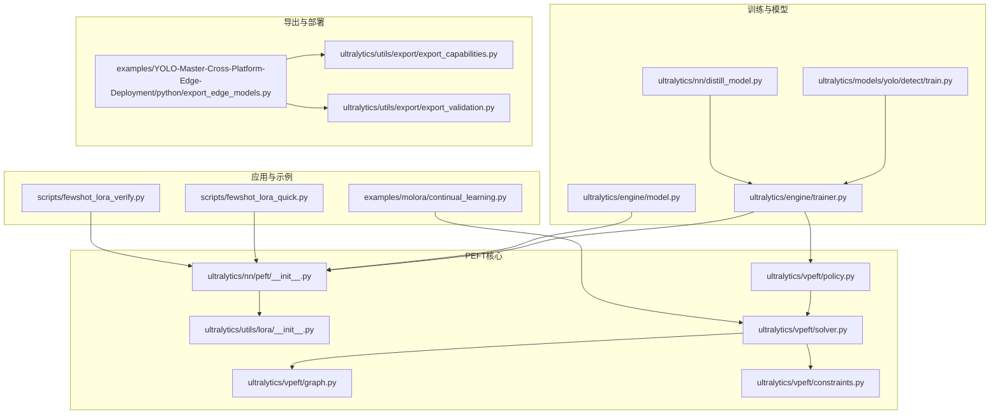
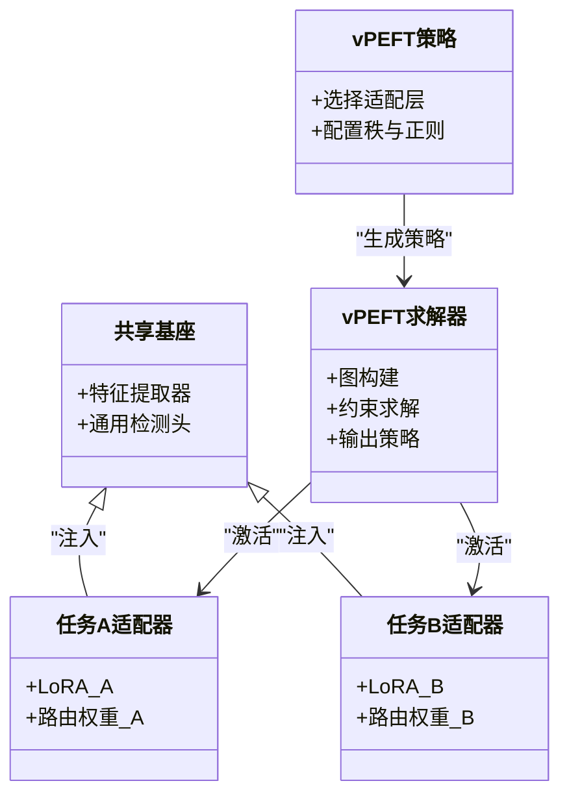
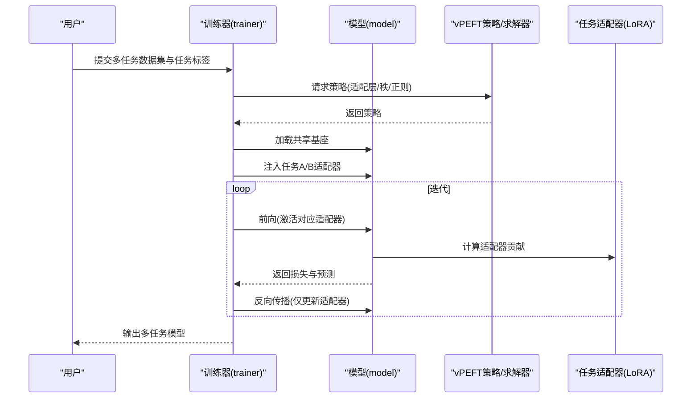
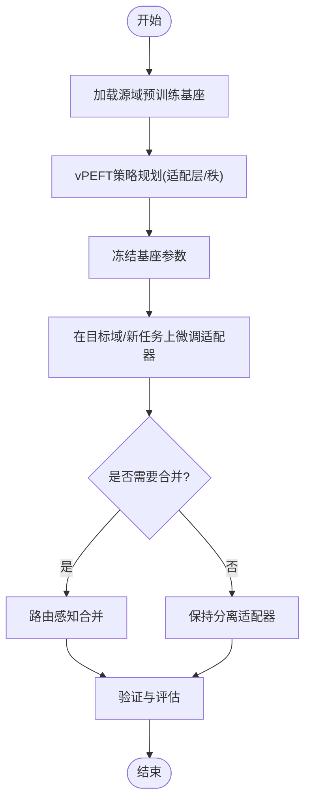
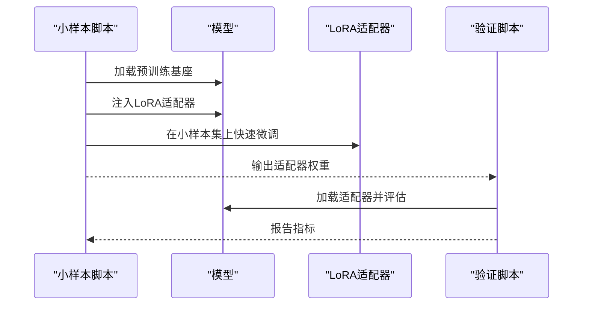
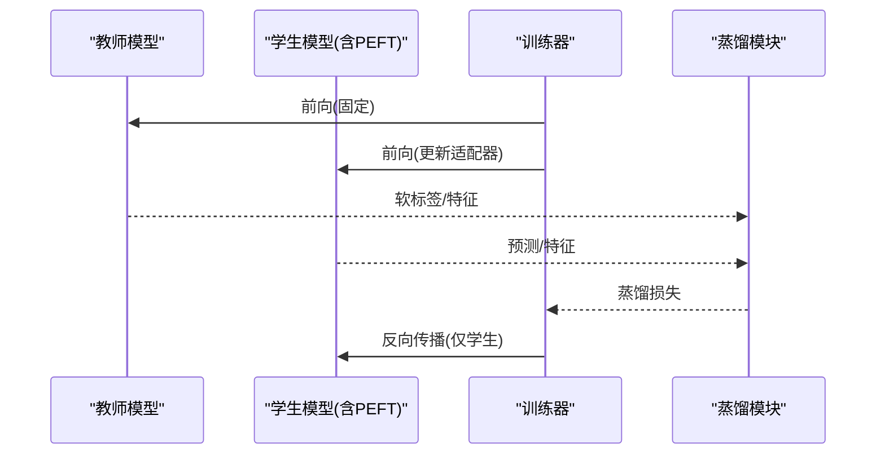
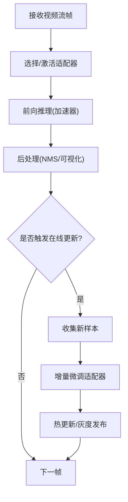
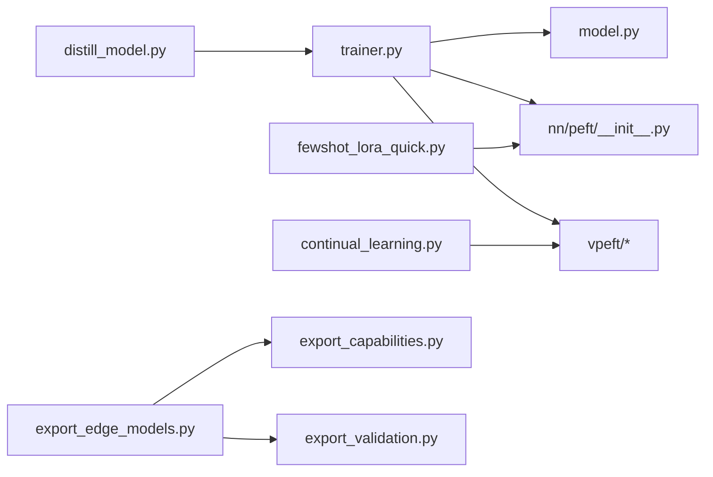

# 高级应用场景

<cite>
**本文引用的文件**
- [ultralytics/nn/peft/__init__.py](file://ultralytics/nn/peft/__init__.py)
- [ultralytics/utils/lora/__init__.py](file://ultralytics/utils/lora/__init__.py)
- [ultralytics/vpeft/__init__.py](file://ultralytics/vpeft/__init__.py)
- [ultralytics/vpeft/policy.py](file://ultralytics/vpeft/policy.py)
- [ultralytics/vpeft/solver.py](file://ultralytics/vpeft/solver.py)
- [ultralytics/vpeft/graph.py](file://ultralytics/vpeft/graph.py)
- [ultralytics/vpeft/constraints.py](file://ultralytics/vpeft/constraints.py)
- [examples/molora/continual_learning.py](file://examples/molora/continual_learning.py)
- [scripts/fewshot_lora_quick.py](file://scripts/fewshot_lora_quick.py)
- [scripts/fewshot_lora_verify.py](file://scripts/fewshot_lora_verify.py)
- [ultralytics/engine/trainer.py](file://ultralytics/engine/trainer.py)
- [ultralytics/engine/model.py](file://ultralytics/engine/model.py)
- [ultralytics/models/yolo/detect/train.py](file://ultralytics/models/yolo/detect/train.py)
- [ultralytics/nn/distill_model.py](file://ultralytics/nn/distill_model.py)
- [examples/YOLO-Master-Cross-Platform-Edge-Deployment/python/export_edge_models.py](file://examples/YOLO-Master-Cross-Platform-Edge-Deployment/python/export_edge_models.py)
- [ultralytics/utils/export/export_capabilities.py](file://ultralytics/utils/export/export_capabilities.py)
- [ultralytics/utils/export/export_validation.py](file://ultralytics/utils/export/export_validation.py)
- [tests/test_molora.py](file://tests/test_molora.py)
- [tests/test_peft_adapters.py](file://tests/test_peft_adapters.py)
- [tests/test_vpeft.py](file://tests/test_vpeft.py)
- [tests/test_molora_merge_semantics.py](file://tests/test_molora_merge_semantics.py)
- [tests/test_molora_routing_aware_merge.py](file://tests/test_molora_routing_aware_merge.py)
- [tests/test_molora_sparse_dispatch.py](file://tests/test_molora_sparse_dispatch.py)
- [tests/test_molora_dtype.py](file://tests/test_molora_dtype.py)
- [tests/test_molora_supplementary.py](file://tests/test_molora_supplementary.py)
</cite>

## 目录
1. [简介](#简介)
2. [项目结构](#项目结构)
3. [核心组件](#核心组件)
4. [架构总览](#架构总览)
5. [详细组件分析](#详细组件分析)
6. [依赖关系分析](#依赖关系分析)
7. [性能考量](#性能考量)
8. [故障排查指南](#故障排查指南)
9. [结论](#结论)
10. [附录](#附录)

## 简介
本文件面向YOLO-Master的PEFT（参数高效微调）技术，聚焦高级应用场景与工程化落地。内容覆盖：
- 多任务学习：共享基座+任务特定适配器的设计模式与训练策略
- 领域适应与迁移学习：跨域数据适配、增量学习与灾难性遗忘预防
- Few-shot与零样本检测：小样本快速适配与开放词汇能力结合
- 知识蒸馏：教师-学生架构下的轻量级适配
- 集成学习：多适配器/路由的融合与部署
- 实时与流式处理：低延迟推理与在线更新
- 隐私保护与联邦学习：安全协作与模型聚合

## 项目结构
围绕PEFT的核心代码分布在以下模块：
- PEFT基础与LoRA工具：ultralytics/nn/peft、ultralytics/utils/lora
- 视觉PEFT规划与求解：ultralytics/vpeft（策略、求解器、图与约束）
- 持续学习与Molara示例：examples/molora/continual_learning.py
- 小样本脚本：scripts/fewshot_lora_quick.py、scripts/fewshot_lora_verify.py
- 训练与模型入口：ultralytics/engine/trainer.py、ultralytics/engine/model.py、ultralytics/models/yolo/detect/train.py
- 知识蒸馏：ultralytics/nn/distill_model.py
- 导出与边缘部署：export_edge_models.py、export_capabilities.py、export_validation.py
- 测试套件：tests下与molora、vpeft、peft适配器相关的用例

图表来源
- [ultralytics/nn/peft/__init__.py](file://ultralytics/nn/peft/__init__.py)
- [ultralytics/utils/lora/__init__.py](file://ultralytics/utils/lora/__init__.py)
- [ultralytics/vpeft/policy.py](file://ultralytics/vpeft/policy.py)
- [ultralytics/vpeft/solver.py](file://ultralytics/vpeft/solver.py)
- [ultralytics/vpeft/graph.py](file://ultralytics/vpeft/graph.py)
- [ultralytics/vpeft/constraints.py](file://ultralytics/vpeft/constraints.py)
- [examples/molora/continual_learning.py](file://examples/molora/continual_learning.py)
- [scripts/fewshot_lora_quick.py](file://scripts/fewshot_lora_quick.py)
- [scripts/fewshot_lora_verify.py](file://scripts/fewshot_lora_verify.py)
- [ultralytics/engine/trainer.py](file://ultralytics/engine/trainer.py)
- [ultralytics/engine/model.py](file://ultralytics/engine/model.py)
- [ultralytics/models/yolo/detect/train.py](file://ultralytics/models/yolo/detect/train.py)
- [ultralytics/nn/distill_model.py](file://ultralytics/nn/distill_model.py)
- [examples/YOLO-Master-Cross-Platform-Edge-Deployment/python/export_edge_models.py](file://examples/YOLO-Master-Cross-Platform-Edge-Deployment/python/export_edge_models.py)
- [ultralytics/utils/export/export_capabilities.py](file://ultralytics/utils/export/export_capabilities.py)
- [ultralytics/utils/export/export_validation.py](file://ultralytics/utils/export/export_validation.py)

章节来源
- [ultralytics/nn/peft/__init__.py](file://ultralytics/nn/peft/__init__.py)
- [ultralytics/utils/lora/__init__.py](file://ultralytics/utils/lora/__init__.py)
- [ultralytics/vpeft/policy.py](file://ultralytics/vpeft/policy.py)
- [ultralytics/vpeft/solver.py](file://ultralytics/vpeft/solver.py)
- [ultralytics/vpeft/graph.py](file://ultralytics/vpeft/graph.py)
- [ultralytics/vpeft/constraints.py](file://ultralytics/vpeft/constraints.py)
- [examples/molora/continual_learning.py](file://examples/molora/continual_learning.py)
- [scripts/fewshot_lora_quick.py](file://scripts/fewshot_lora_quick.py)
- [scripts/fewshot_lora_verify.py](file://scripts/fewshot_lora_verify.py)
- [ultralytics/engine/trainer.py](file://ultralytics/engine/trainer.py)
- [ultralytics/engine/model.py](file://ultralytics/engine/model.py)
- [ultralytics/models/yolo/detect/train.py](file://ultralytics/models/yolo/detect/train.py)
- [ultralytics/nn/distill_model.py](file://ultralytics/nn/distill_model.py)
- [examples/YOLO-Master-Cross-Platform-Edge-Deployment/python/export_edge_models.py](file://examples/YOLO-Master-Cross-Platform-Edge-Deployment/python/export_edge_models.py)
- [ultralytics/utils/export/export_capabilities.py](file://ultralytics/utils/export/export_capabilities.py)
- [ultralytics/utils/export/export_validation.py](file://ultralytics/utils/export/export_validation.py)

## 核心组件
- PEFT与LoRA封装：提供可插拔的适配器注册、权重注入与合并接口，便于在多任务场景下按需激活不同任务适配器。
- vPEFT规划与求解：基于图与约束的策略生成与求解，自动选择适配层、秩与正则项，兼顾精度与参数量。
- 持续学习（Molara）：支持增量任务序列、路由感知合并与稀疏调度，缓解灾难性遗忘。
- 小样本适配：快速LoRA微调与验证流程，适合few-shot与open-vocabulary扩展。
- 蒸馏与导出：在保持轻量化的同时提升泛化；导出时保留适配器或进行路由感知合并。

章节来源
- [ultralytics/nn/peft/__init__.py](file://ultralytics/nn/peft/__init__.py)
- [ultralytics/utils/lora/__init__.py](file://ultralytics/utils/lora/__init__.py)
- [ultralytics/vpeft/policy.py](file://ultralytics/vpeft/policy.py)
- [ultralytics/vpeft/solver.py](file://ultralytics/vpeft/solver.py)
- [ultralytics/vpeft/graph.py](file://ultralytics/vpeft/graph.py)
- [ultralytics/vpeft/constraints.py](file://ultralytics/vpeft/constraints.py)
- [examples/molora/continual_learning.py](file://examples/molora/continual_learning.py)
- [scripts/fewshot_lora_quick.py](file://scripts/fewshot_lora_quick.py)
- [scripts/fewshot_lora_verify.py](file://scripts/fewshot_lora_verify.py)

## 架构总览
下图展示“共享基座 + 任务特定适配器”的多任务架构，以及vPEFT如何为每个任务生成并求解适配策略。

图表来源
- [ultralytics/vpeft/policy.py](file://ultralytics/vpeft/policy.py)
- [ultralytics/vpeft/solver.py](file://ultralytics/vpeft/solver.py)
- [ultralytics/vpeft/graph.py](file://ultralytics/vpeft/graph.py)
- [ultralytics/vpeft/constraints.py](file://ultralytics/vpeft/constraints.py)
- [ultralytics/nn/peft/__init__.py](file://ultralytics/nn/peft/__init__.py)

## 详细组件分析

### 多任务学习：共享基座与任务特定适配器
- 设计要点
  - 共享基座负责通用特征表示与主干推理，降低重复计算。
  - 每个任务拥有独立适配器（如LoRA），通过路由或门控机制动态激活，避免全量微调带来的冲突。
  - vPEFT根据任务需求选择适配位置与秩，控制参数量与性能权衡。
- 训练流程
  - 冻结基座，仅优化各任务适配器权重。
  - 使用任务特定的损失函数与数据加载器，支持交替或多任务联合训练。
- 推理路径
  - 按输入任务标签或上下文选择对应适配器，或将多个适配器以路由方式组合。

图表来源
- [ultralytics/engine/trainer.py](file://ultralytics/engine/trainer.py)
- [ultralytics/engine/model.py](file://ultralytics/engine/model.py)
- [ultralytics/vpeft/policy.py](file://ultralytics/vpeft/policy.py)
- [ultralytics/vpeft/solver.py](file://ultralytics/vpeft/solver.py)
- [ultralytics/nn/peft/__init__.py](file://ultralytics/nn/peft/__init__.py)

章节来源
- [ultralytics/engine/trainer.py](file://ultralytics/engine/trainer.py)
- [ultralytics/engine/model.py](file://ultralytics/engine/model.py)
- [ultralytics/vpeft/policy.py](file://ultralytics/vpeft/policy.py)
- [ultralytics/vpeft/solver.py](file://ultralytics/vpeft/solver.py)
- [ultralytics/nn/peft/__init__.py](file://ultralytics/nn/peft/__init__.py)

### 领域适应与迁移学习：跨域适配与增量学习
- 跨域适配
  - 在源域预训练基础上，冻结基座，仅在目标域上微调少量适配器，实现低成本迁移。
  - 利用vPEFT在不同域间选择差异化的适配层，提高域内表现同时减少域间干扰。
- 增量学习（Molara）
  - 按任务序列逐步引入新适配器，采用路由感知合并与稀疏调度，抑制旧任务退化。
  - 通过约束与正则防止参数漂移过大，维持稳定性。

图表来源
- [examples/molora/continual_learning.py](file://examples/molora/continual_learning.py)
- [ultralytics/vpeft/solver.py](file://ultralytics/vpeft/solver.py)
- [ultralytics/vpeft/constraints.py](file://ultralytics/vpeft/constraints.py)

章节来源
- [examples/molora/continual_learning.py](file://examples/molora/continual_learning.py)
- [ultralytics/vpeft/solver.py](file://ultralytics/vpeft/solver.py)
- [ultralytics/vpeft/constraints.py](file://ultralytics/vpeft/constraints.py)

### 灾难性遗忘预防策略
- 正则与约束
  - 对关键参数施加L2或弹性权重巩固(EWC)类正则，限制重要参数变化幅度。
  - 使用vPEFT约束模块控制新增参数的规模与分布。
- 回放与缓冲
  - 维护少量历史样本缓冲区，在新任务训练中混合回放，稳定旧任务性能。
- 路由与稀疏
  - 通过路由将不同任务的梯度分散到不同专家/适配器，降低耦合与干扰。
- 合并策略
  - 采用路由感知的合并方法，在保留关键信息的同时减少冗余。

章节来源
- [ultralytics/vpeft/constraints.py](file://ultralytics/vpeft/constraints.py)
- [tests/test_molora_merge_semantics.py](file://tests/test_molora_merge_semantics.py)
- [tests/test_molora_routing_aware_merge.py](file://tests/test_molora_routing_aware_merge.py)

### Few-shot与零样本检测
- 小样本学习
  - 使用few-shot脚本快速初始化LoRA，并在极少量标注数据上进行微调。
  - 结合开放词汇分类器（如文本编码器）进行类别对齐，提升零样本能力。
- 验证流程
  - 提供验证脚本用于快速检查小样本适配效果与收敛情况。

图表来源
- [scripts/fewshot_lora_quick.py](file://scripts/fewshot_lora_quick.py)
- [scripts/fewshot_lora_verify.py](file://scripts/fewshot_lora_verify.py)
- [ultralytics/nn/peft/__init__.py](file://ultralytics/nn/peft/__init__.py)

章节来源
- [scripts/fewshot_lora_quick.py](file://scripts/fewshot_lora_quick.py)
- [scripts/fewshot_lora_verify.py](file://scripts/fewshot_lora_verify.py)
- [ultralytics/nn/peft/__init__.py](file://ultralytics/nn/peft/__init__.py)

### 知识蒸馏：教师-学生架构
- 架构
  - 教师模型：较大或更通用的检测模型，提供软标签与中间特征。
  - 学生模型：轻量化基座+PEFT适配器，学习教师的知识与行为。
- 训练
  - 在蒸馏损失与任务损失之间加权，确保学生既拟合真实标签又模仿教师。
  - 冻结教师，仅更新学生及其适配器，降低训练成本。
- 导出
  - 导出时可移除教师，仅保留学生与适配器，便于部署。

图表来源
- [ultralytics/nn/distill_model.py](file://ultralytics/nn/distill_model.py)
- [ultralytics/engine/trainer.py](file://ultralytics/engine/trainer.py)
- [ultralytics/models/yolo/detect/train.py](file://ultralytics/models/yolo/detect/train.py)

章节来源
- [ultralytics/nn/distill_model.py](file://ultralytics/nn/distill_model.py)
- [ultralytics/engine/trainer.py](file://ultralytics/engine/trainer.py)
- [ultralytics/models/yolo/detect/train.py](file://ultralytics/models/yolo/detect/train.py)

### 集成学习与Ensemble方法
- 多适配器融合
  - 针对多个任务或域分别训练适配器，在推理时按场景或置信度加权融合。
- 路由与门控
  - 使用轻量路由网络决定激活哪些适配器，或在边界区域平滑切换。
- 合并与稀疏
  - 采用路由感知合并与稀疏调度，减少冗余并保持性能。

章节来源
- [examples/molora/continual_learning.py](file://examples/molora/continual_learning.py)
- [tests/test_molora_sparse_dispatch.py](file://tests/test_molora_sparse_dispatch.py)
- [tests/test_molora_routing_aware_merge.py](file://tests/test_molora_routing_aware_merge.py)

### 实时系统与流式数据处理
- 低延迟推理
  - 冻结基座，仅加载必要适配器，减少内存占用与计算开销。
  - 使用ONNX/TensorRT等后端加速，配合批量与缓存策略。
- 在线更新
  - 在流式场景中，周期性收集新数据，增量微调适配器，保持模型时效性。
- 导出与部署
  - 使用导出脚本与能力矩阵校验，确保适配器在目标平台正确运行。

章节来源
- [examples/YOLO-Master-Cross-Platform-Edge-Deployment/python/export_edge_models.py](file://examples/YOLO-Master-Cross-Platform-Edge-Deployment/python/export_edge_models.py)
- [ultralytics/utils/export/export_capabilities.py](file://ultralytics/utils/export/export_capabilities.py)
- [ultralytics/utils/export/export_validation.py](file://ultralytics/utils/export/export_validation.py)

### 隐私保护与联邦学习集成
- 本地微调
  - 在各客户端仅更新适配器权重，不上传原始数据，保护隐私。
- 安全聚合
  - 对适配器权重进行差分隐私噪声注入或加密传输，再进行中心聚合。
- 版本与回滚
  - 为每个客户端维护适配器版本，支持回滚与一致性校验。

章节来源
- [ultralytics/nn/peft/__init__.py](file://ultralytics/nn/peft/__init__.py)
- [ultralytics/vpeft/solver.py](file://ultralytics/vpeft/solver.py)

## 依赖关系分析
- 模块耦合
  - trainer与model作为训练与模型入口，依赖PEFT与vPEFT进行策略生成与权重注入。
  - continual_learning与fewshot脚本调用PEFT与vPEFT完成具体场景训练与验证。
  - distill_model与trainer协同实现蒸馏训练。
  - export相关模块确保适配器在导出与部署阶段的一致性。
- 外部依赖
  - 导出与部署依赖目标平台后端（如ONNX/TensorRT），需通过能力矩阵与验证脚本确认兼容性。

图表来源
- [ultralytics/engine/trainer.py](file://ultralytics/engine/trainer.py)
- [ultralytics/engine/model.py](file://ultralytics/engine/model.py)
- [ultralytics/nn/peft/__init__.py](file://ultralytics/nn/peft/__init__.py)
- [ultralytics/vpeft/policy.py](file://ultralytics/vpeft/policy.py)
- [ultralytics/vpeft/solver.py](file://ultralytics/vpeft/solver.py)
- [ultralytics/nn/distill_model.py](file://ultralytics/nn/distill_model.py)
- [examples/molora/continual_learning.py](file://examples/molora/continual_learning.py)
- [scripts/fewshot_lora_quick.py](file://scripts/fewshot_lora_quick.py)
- [examples/YOLO-Master-Cross-Platform-Edge-Deployment/python/export_edge_models.py](file://examples/YOLO-Master-Cross-Platform-Edge-Deployment/python/export_edge_models.py)
- [ultralytics/utils/export/export_capabilities.py](file://ultralytics/utils/export/export_capabilities.py)
- [ultralytics/utils/export/export_validation.py](file://ultralytics/utils/export/export_validation.py)

章节来源
- [ultralytics/engine/trainer.py](file://ultralytics/engine/trainer.py)
- [ultralytics/engine/model.py](file://ultralytics/engine/model.py)
- [ultralytics/nn/peft/__init__.py](file://ultralytics/nn/peft/__init__.py)
- [ultralytics/vpeft/policy.py](file://ultralytics/vpeft/policy.py)
- [ultralytics/vpeft/solver.py](file://ultralytics/vpeft/solver.py)
- [ultralytics/nn/distill_model.py](file://ultralytics/nn/distill_model.py)
- [examples/molora/continual_learning.py](file://examples/molora/continual_learning.py)
- [scripts/fewshot_lora_quick.py](file://scripts/fewshot_lora_quick.py)
- [examples/YOLO-Master-Cross-Platform-Edge-Deployment/python/export_edge_models.py](file://examples/YOLO-Master-Cross-Platform-Edge-Deployment/python/export_edge_models.py)
- [ultralytics/utils/export/export_capabilities.py](file://ultralytics/utils/export/export_capabilities.py)
- [ultralytics/utils/export/export_validation.py](file://ultralytics/utils/export/export_validation.py)

## 性能考量
- 参数量与显存
  - 冻结基座、仅微调适配器显著降低显存与存储开销。
  - 合理设置LoRA秩与正则强度，平衡精度与效率。
- 计算与吞吐
  - 使用路由与稀疏调度减少不必要的计算路径。
  - 导出至目标后端并进行预热与批处理优化，提升吞吐。
- 稳定性
  - 在增量学习中采用回放与约束，避免数值不稳定与发散。

[本节为通用指导，无需列出具体文件来源]

## 故障排查指南
- 适配器未生效
  - 检查策略生成与注入流程是否正确，确认目标层匹配与权重形状一致。
- 灾难性遗忘严重
  - 调整正则强度、增加回放比例、启用路由感知合并。
- 导出失败或不兼容
  - 使用导出能力矩阵与验证脚本定位问题，必要时降级或替换后端。
- 小样本过拟合
  - 降低学习率、增强数据增强、增大正则或减少秩。

章节来源
- [tests/test_peft_adapters.py](file://tests/test_peft_adapters.py)
- [tests/test_vpeft.py](file://tests/test_vpeft.py)
- [tests/test_molora.py](file://tests/test_molora.py)
- [tests/test_molora_dtype.py](file://tests/test_molora_dtype.py)
- [tests/test_molora_supplementary.py](file://tests/test_molora_supplementary.py)

## 结论
YOLO-Master的PEFT体系通过“共享基座+任务特定适配器”的设计，结合vPEFT的策略与求解、Molara的持续学习、蒸馏与导出工具链，覆盖了从多任务、领域适应、few-shot到实时与联邦学习的广泛场景。在实际工程中，建议优先冻结基座、精细化选择适配层与秩，辅以蒸馏与导出优化，以获得高可用、低成本的解决方案。

[本节为总结性内容，无需列出具体文件来源]

## 附录
- 参考用例与脚本
  - 持续学习：examples/molora/continual_learning.py
  - 小样本快速微调与验证：scripts/fewshot_lora_quick.py、scripts/fewshot_lora_verify.py
  - 导出与边缘部署：examples/YOLO-Master-Cross-Platform-Edge-Deployment/python/export_edge_models.py
- 测试与回归
  - 适配器与vPEFT：tests/test_peft_adapters.py、tests/test_vpeft.py
  - Molara系列：tests/test_molora*.py

[本节为索引性内容，无需列出具体文件来源]