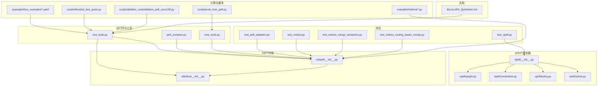
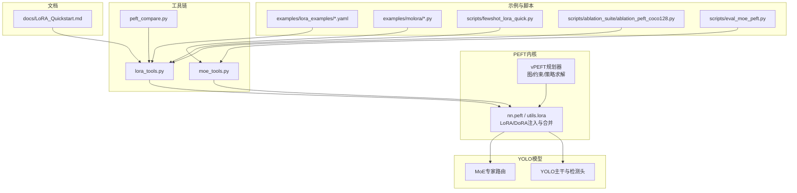
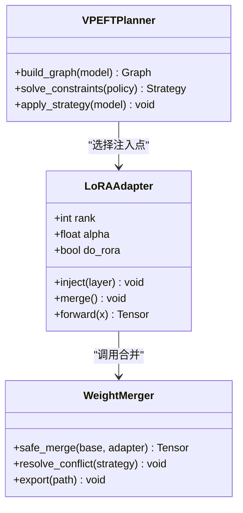
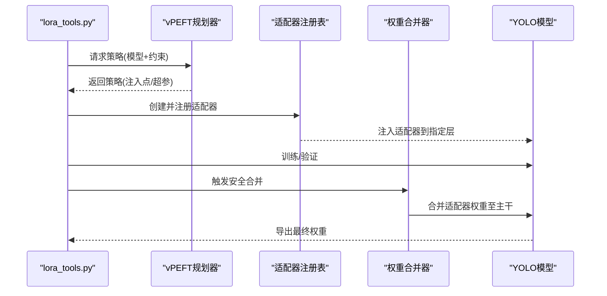
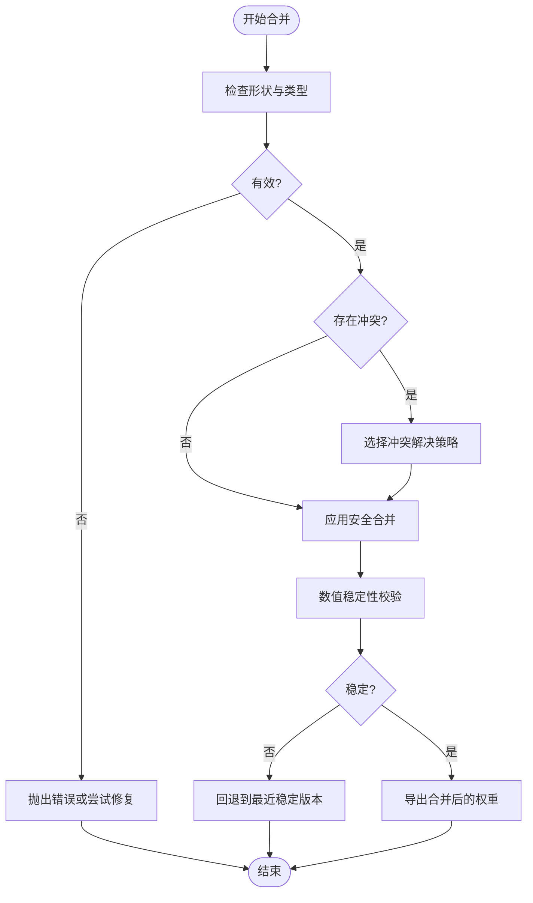
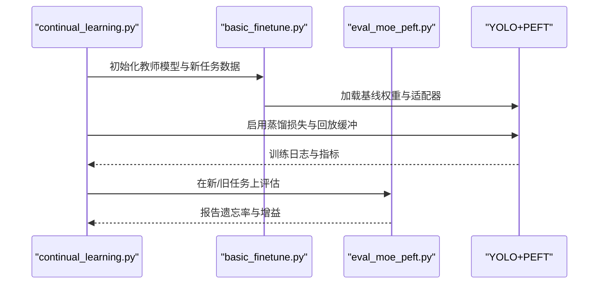
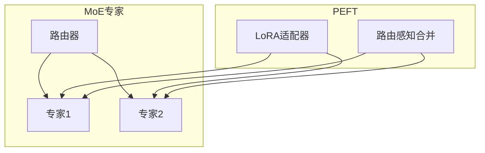
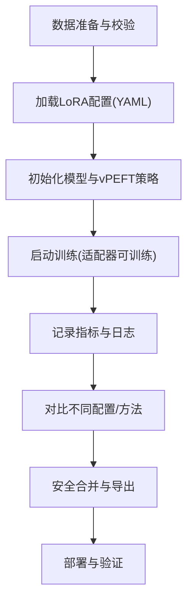
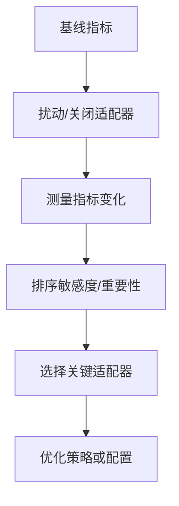
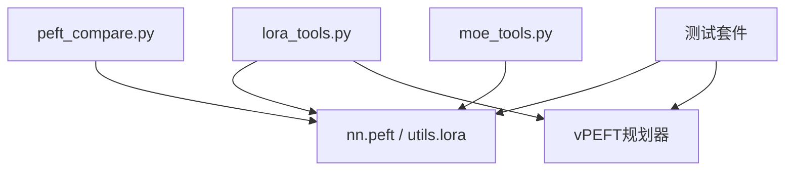

# 参数高效微调系统

<cite>
**本文引用的文件**
- [lora_tools.py](file://agent/runtime/cli/lora_tools.py)
- [peft_compare.py](file://agent/runtime/cli/peft_compare.py)
- [moe_tools.py](file://agent/runtime/cli/moe_tools.py)
- [test_molora.py](file://tests/test_molora.py)
- [test_molora_merge_semantics.py](file://tests/test_molora_merge_semantics.py)
- [test_molora_routing_aware_merge.py](file://tests/test_molora_routing_aware_merge.py)
- [test_peft_adapters.py](file://tests/test_peft_adapters.py)
- [test_vpeft.py](file://tests/test_vpeft.py)
- [vpeft/__init__.py](file://ultralytics/vpeft/__init__.py)
- [vpeft/constraints.py](file://ultralytics/vpeft/constraints.py)
- [vpeft/graph.py](file://ultralytics/vpeft/graph.py)
- [vpeft/policy.py](file://ultralytics/vpeft/policy.py)
- [vpeft/solver.py](file://ultralytics/vpeft/solver.py)
- [nn/peft/__init__.py](file://ultralytics/nn/peft/__init__.py)
- [utils/lora/__init__.py](file://ultralytics/utils/lora/__init__.py)
- [examples/lora_examples/yolo_master_lora_README.md](file://examples/lora_examples/yolo_master_lora_README.md)
- [examples/lora_examples/yolo11_lora.yaml](file://examples/lora_examples/yolo11_lora.yaml)
- [examples/lora_examples/yolo12_lora.yaml](file://examples/lora_examples/yolo12_lora.yaml)
- [examples/lora_examples/yolov8_lora.yaml](file://examples/lora_examples/yolov8_lora.yaml)
- [examples/lora_examples/yolo_master_visdrone_lora.yaml](file://examples/lora_examples/yolo_master_visdrone_lora.yaml)
- [examples/molora/basic_finetune.py](file://examples/molora/basic_finetune.py)
- [examples/molora/continual_learning.py](file://examples/molora/continual_learning.py)
- [scripts/fewshot_lora_quick.py](file://scripts/fewshot_lora_quick.py)
- [scripts/fewshot_lora_verify.py](file://scripts/fewshot_lora_verify.py)
- [scripts/ablation_suite/ablation_peft_coco128.py](file://scripts/ablation_suite/ablation_peft_coco128.py)
- [scripts/eval_moe_peft.py](file://scripts/eval_moe_peft.py)
- [docs/LoRA_Quickstart.md](file://docs/LoRA_Quickstart.md)
</cite>

## 目录
1. [简介](#简介)
2. [项目结构](#项目结构)
3. [核心组件](#核心组件)
4. [架构总览](#架构总览)
5. [详细组件分析](#详细组件分析)
6. [依赖关系分析](#依赖关系分析)
7. [性能考量](#性能考量)
8. [故障排查指南](#故障排查指南)
9. [结论](#结论)
10. [附录](#附录)

## 简介
本技术文档面向YOLO-Master的参数高效微调（PEFT）子系统，聚焦以下目标：
- 解释LoRA在YOLO中的实现原理与适配方式，并说明DoRA等其他PEFT技术的集成与配置方法。
- 阐述适配器管理系统的架构，包括创建、注册、加载与合并机制。
- 解析权重合并算法的实现细节，涵盖安全合并与冲突解决策略。
- 说明增量学习支持，包括灾难性遗忘缓解与知识蒸馏路径。
- 描述PEFT与MoE架构的集成方式与兼容性考虑。
- 提供完整的LoRA训练工作流（数据准备、配置设置、训练监控）。
- 给出适配器敏感性与重要性评估方法。
- 总结PEFT模型导出与部署最佳实践。
- 提供针对不同任务的PEFT配置示例与调优指南。

## 项目结构
围绕PEFT与LoRA的核心代码分布在如下位置：
- 运行时CLI工具：用于LoRA训练辅助、PEFT对比、MoE工具等
- vPEFT规划器：基于图与约束的策略求解器，负责选择可插拔模块与生成策略
- nn.peft与utils.lora：底层适配器封装、权重合并与调度逻辑
- 测试套件：覆盖MOLORA路由感知合并、语义一致性、适配器生命周期等
- 示例与脚本：多任务LoRA配置、少样本快速流程、消融实验与评测脚本
- 文档：LoRA快速开始与相关指南

图表来源
- [lora_tools.py:1-200](file://agent/runtime/cli/lora_tools.py#L1-L200)
- [peft_compare.py:1-200](file://agent/runtime/cli/peft_compare.py#L1-L200)
- [moe_tools.py:1-200](file://agent/runtime/cli/moe_tools.py#L1-L200)
- [vpeft/__init__.py:1-200](file://ultralytics/vpeft/__init__.py#L1-L200)
- [vpeft/graph.py:1-200](file://ultralytics/vpeft/graph.py#L1-L200)
- [vpeft/constraints.py:1-200](file://ultralytics/vpeft/constraints.py#L1-L200)
- [vpeft/policy.py:1-200](file://ultralytics/vpeft/policy.py#L1-L200)
- [vpeft/solver.py:1-200](file://ultralytics/vpeft/solver.py#L1-L200)
- [nn/peft/__init__.py:1-200](file://ultralytics/nn/peft/__init__.py#L1-L200)
- [utils/lora/__init__.py:1-200](file://ultralytics/utils/lora/__init__.py#L1-L200)
- [test_peft_adapters.py:1-200](file://tests/test_peft_adapters.py#L1-L200)
- [test_molora.py:1-200](file://tests/test_molora.py#L1-L200)
- [test_molora_merge_semantics.py:1-200](file://tests/test_molora_merge_semantics.py#L1-L200)
- [test_molora_routing_aware_merge.py:1-200](file://tests/test_molora_routing_aware_merge.py#L1-L200)
- [test_vpeft.py:1-200](file://tests/test_vpeft.py#L1-L200)
- [examples/lora_examples/yolo11_lora.yaml:1-200](file://examples/lora_examples/yolo11_lora.yaml#L1-L200)
- [examples/lora_examples/yolo12_lora.yaml:1-200](file://examples/lora_examples/yolo12_lora.yaml#L1-L200)
- [examples/lora_examples/yolov8_lora.yaml:1-200](file://examples/lora_examples/yolov8_lora.yaml#L1-L200)
- [examples/lora_examples/yolo_master_visdrone_lora.yaml:1-200](file://examples/lora_examples/yolo_master_visdrone_lora.yaml#L1-L200)
- [examples/molora/basic_finetune.py:1-200](file://examples/molora/basic_finetune.py#L1-L200)
- [examples/molora/continual_learning.py:1-200](file://examples/molora/continual_learning.py#L1-L200)
- [scripts/fewshot_lora_quick.py:1-200](file://scripts/fewshot_lora_quick.py#L1-L200)
- [scripts/ablation_suite/ablation_peft_coco128.py:1-200](file://scripts/ablation_suite/ablation_peft_coco128.py#L1-L200)
- [scripts/eval_moe_peft.py:1-200](file://scripts/eval_moe_peft.py#L1-L200)
- [docs/LoRA_Quickstart.md:1-200](file://docs/LoRA_Quickstart.md#L1-L200)

章节来源
- [lora_tools.py:1-200](file://agent/runtime/cli/lora_tools.py#L1-L200)
- [peft_compare.py:1-200](file://agent/runtime/cli/peft_compare.py#L1-L200)
- [moe_tools.py:1-200](file://agent/runtime/cli/moe_tools.py#L1-L200)
- [vpeft/__init__.py:1-200](file://ultralytics/vpeft/__init__.py#L1-L200)
- [vpeft/graph.py:1-200](file://ultralytics/vpeft/graph.py#L1-L200)
- [vpeft/constraints.py:1-200](file://ultralytics/vpeft/constraints.py#L1-L200)
- [vpeft/policy.py:1-200](file://ultralytics/vpeft/policy.py#L1-L200)
- [vpeft/solver.py:1-200](file://ultralytics/vpeft/solver.py#L1-L200)
- [nn/peft/__init__.py:1-200](file://ultralytics/nn/peft/__init__.py#L1-L200)
- [utils/lora/__init__.py:1-200](file://ultralytics/utils/lora/__init__.py#L1-L200)
- [test_peft_adapters.py:1-200](file://tests/test_peft_adapters.py#L1-L200)
- [test_molora.py:1-200](file://tests/test_molora.py#L1-L200)
- [test_molora_merge_semantics.py:1-200](file://tests/test_molora_merge_semantics.py#L1-L200)
- [test_molora_routing_aware_merge.py:1-200](file://tests/test_molora_routing_aware_merge.py#L1-L200)
- [test_vpeft.py:1-200](file://tests/test_vpeft.py#L1-L200)
- [examples/lora_examples/yolo11_lora.yaml:1-200](file://examples/lora_examples/yolo11_lora.yaml#L1-L200)
- [examples/lora_examples/yolo12_lora.yaml:1-200](file://examples/lora_examples/yolo12_lora.yaml#L1-L200)
- [examples/lora_examples/yolov8_lora.yaml:1-200](file://examples/lora_examples/yolov8_lora.yaml#L1-L200)
- [examples/lora_examples/yolo_master_visdrone_lora.yaml:1-200](file://examples/lora_examples/yolo_master_visdrone_lora.yaml#L1-L200)
- [examples/molora/basic_finetune.py:1-200](file://examples/molora/basic_finetune.py#L1-L200)
- [examples/molora/continual_learning.py:1-200](file://examples/molora/continual_learning.py#L1-L200)
- [scripts/fewshot_lora_quick.py:1-200](file://scripts/fewshot_lora_quick.py#L1-L200)
- [scripts/ablation_suite/ablation_peft_coco128.py:1-200](file://scripts/ablation_suite/ablation_peft_coco128.py#L1-L200)
- [scripts/eval_moe_peft.py:1-200](file://scripts/eval_moe_peft.py#L1-L200)
- [docs/LoRA_Quickstart.md:1-200](file://docs/LoRA_Quickstart.md#L1-L200)

## 核心组件
- LoRA与DoRA等PEFT内核
  - 位于nn.peft与utils.lora，提供低秩矩阵注入、可选范数重缩放（DoRA）、以及权重合并接口。
  - 关键职责：插入适配器、维护可训练参数子集、执行前向时叠加更新、导出时安全合并。
- vPEFT规划器
  - 通过图构建与约束求解，自动识别可插拔层与最优策略，输出策略清单供训练与合并使用。
  - 关键职责：模型图扫描、候选集生成、约束校验、策略求解与回退。
- 运行时工具链
  - lora_tools：封装LoRA训练辅助流程（数据准备、配置解析、训练启动、结果汇总）。
  - peft_compare：跨配置或跨方法的对比评测与可视化。
  - moe_tools：与MoE专家路由协同的工具函数（如路由感知合并、专家权重对齐）。
- 测试与验证
  - 覆盖适配器生命周期、MOLORA路由感知合并语义、vPEFT策略正确性等。
- 示例与脚本
  - 提供多任务LoRA配置模板、少样本快速流程、消融实验与评测脚本。

章节来源
- [nn/peft/__init__.py:1-200](file://ultralytics/nn/peft/__init__.py#L1-L200)
- [utils/lora/__init__.py:1-200](file://ultralytics/utils/lora/__init__.py#L1-L200)
- [vpeft/__init__.py:1-200](file://ultralytics/vpeft/__init__.py#L1-L200)
- [lora_tools.py:1-200](file://agent/runtime/cli/lora_tools.py#L1-L200)
- [peft_compare.py:1-200](file://agent/runtime/cli/peft_compare.py#L1-L200)
- [moe_tools.py:1-200](file://agent/runtime/cli/moe_tools.py#L1-L200)
- [test_peft_adapters.py:1-200](file://tests/test_peft_adapters.py#L1-L200)
- [test_molora.py:1-200](file://tests/test_molora.py#L1-L200)
- [test_molora_merge_semantics.py:1-200](file://tests/test_molora_merge_semantics.py#L1-L200)
- [test_molora_routing_aware_merge.py:1-200](file://tests/test_molora_routing_aware_merge.py#L1-L200)
- [test_vpeft.py:1-200](file://tests/test_vpeft.py#L1-L200)
- [examples/lora_examples/yolo11_lora.yaml:1-200](file://examples/lora_examples/yolo11_lora.yaml#L1-L200)
- [examples/lora_examples/yolo12_lora.yaml:1-200](file://examples/lora_examples/yolo12_lora.yaml#L1-L200)
- [examples/lora_examples/yolov8_lora.yaml:1-200](file://examples/lora_examples/yolov8_lora.yaml#L1-L200)
- [examples/lora_examples/yolo_master_visdrone_lora.yaml:1-200](file://examples/lora_examples/yolo_master_visdrone_lora.yaml#L1-L200)
- [examples/molora/basic_finetune.py:1-200](file://examples/molora/basic_finetune.py#L1-L200)
- [examples/molora/continual_learning.py:1-200](file://examples/molora/continual_learning.py#L1-L200)
- [scripts/fewshot_lora_quick.py:1-200](file://scripts/fewshot_lora_quick.py#L1-L200)
- [scripts/ablation_suite/ablation_peft_coco128.py:1-200](file://scripts/ablation_suite/ablation_peft_coco128.py#L1-L200)
- [scripts/eval_moe_peft.py:1-200](file://scripts/eval_moe_peft.py#L1-L200)
- [docs/LoRA_Quickstart.md:1-200](file://docs/LoRA_Quickstart.md#L1-L200)

## 架构总览
下图展示PEFT子系统与YOLO主干、MoE及工具链的交互关系。

图表来源
- [lora_tools.py:1-200](file://agent/runtime/cli/lora_tools.py#L1-L200)
- [peft_compare.py:1-200](file://agent/runtime/cli/peft_compare.py#L1-L200)
- [moe_tools.py:1-200](file://agent/runtime/cli/moe_tools.py#L1-L200)
- [vpeft/__init__.py:1-200](file://ultralytics/vpeft/__init__.py#L1-L200)
- [nn/peft/__init__.py:1-200](file://ultralytics/nn/peft/__init__.py#L1-L200)
- [utils/lora/__init__.py:1-200](file://ultralytics/utils/lora/__init__.py#L1-L200)
- [examples/lora_examples/yolo11_lora.yaml:1-200](file://examples/lora_examples/yolo11_lora.yaml#L1-L200)
- [examples/molora/basic_finetune.py:1-200](file://examples/molora/basic_finetune.py#L1-L200)
- [scripts/fewshot_lora_quick.py:1-200](file://scripts/fewshot_lora_quick.py#L1-L200)
- [scripts/ablation_suite/ablation_peft_coco128.py:1-200](file://scripts/ablation_suite/ablation_peft_coco128.py#L1-L200)
- [scripts/eval_moe_peft.py:1-200](file://scripts/eval_moe_peft.py#L1-L200)
- [docs/LoRA_Quickstart.md:1-200](file://docs/LoRA_Quickstart.md#L1-L200)

## 详细组件分析

### LoRA与DoRA实现原理与在YOLO中的应用
- 原理要点
  - LoRA通过在特定层旁路注入低秩矩阵对，冻结原权重，仅训练小参数量适配器，显著降低显存与计算开销。
  - DoRA在LoRA基础上引入范数重缩放，提升稳定性与收敛质量，适合视觉任务中特征尺度变化较大的场景。
- 在YOLO中的应用
  - 针对卷积层、注意力层或检测头线性层进行适配器注入，保持推理时可通过“安全合并”将适配器权重融合进主干，避免额外开销。
  - 结合vPEFT自动选择可插拔层，减少人工挑选成本。
- 关键实现位置
  - 适配器注入与合并接口：nn.peft与utils.lora
  - 训练与导出流程：lora_tools与示例脚本

图表来源
- [nn/peft/__init__.py:1-200](file://ultralytics/nn/peft/__init__.py#L1-L200)
- [utils/lora/__init__.py:1-200](file://ultralytics/utils/lora/__init__.py#L1-L200)
- [vpeft/__init__.py:1-200](file://ultralytics/vpeft/__init__.py#L1-L200)

章节来源
- [nn/peft/__init__.py:1-200](file://ultralytics/nn/peft/__init__.py#L1-L200)
- [utils/lora/__init__.py:1-200](file://ultralytics/utils/lora/__init__.py#L1-L200)
- [test_peft_adapters.py:1-200](file://tests/test_peft_adapters.py#L1-L200)

### 适配器管理系统：创建、注册、加载与合并
- 创建与注册
  - 通过vPEFT策略生成候选适配器集合，并在模型上按命名空间注册，便于后续定位与批量操作。
- 加载与切换
  - 支持从检查点加载不同任务/数据集的适配器权重，动态切换以进行多任务推理或在线A/B测试。
- 合并机制
  - 提供安全合并接口，确保数值稳定与形状一致；当存在同名冲突时，采用策略化冲突解决（如优先级、加权平均或路由感知合并）。
- 关键实现位置
  - 管理器与合并逻辑：utils.lora与nn.peft
  - 路由感知合并：moe_tools与MOLORA测试用例

图表来源
- [lora_tools.py:1-200](file://agent/runtime/cli/lora_tools.py#L1-L200)
- [vpeft/__init__.py:1-200](file://ultralytics/vpeft/__init__.py#L1-L200)
- [utils/lora/__init__.py:1-200](file://ultralytics/utils/lora/__init__.py#L1-L200)
- [moe_tools.py:1-200](file://agent/runtime/cli/moe_tools.py#L1-L200)

章节来源
- [lora_tools.py:1-200](file://agent/runtime/cli/lora_tools.py#L1-L200)
- [utils/lora/__init__.py:1-200](file://ultralytics/utils/lora/__init__.py#L1-L200)
- [moe_tools.py:1-200](file://agent/runtime/cli/moe_tools.py#L1-L200)
- [test_peft_adapters.py:1-200](file://tests/test_peft_adapters.py#L1-L200)

### 权重合并算法与安全合并、冲突解决
- 安全合并
  - 在合并前进行形状与数据类型校验，必要时进行广播或类型转换，防止运行时错误。
  - 对DoRA范数项进行特殊处理，确保合并后仍满足范数约束。
- 冲突解决策略
  - 优先级策略：根据任务或版本标签决定保留哪个权重。
  - 加权平均：在多任务共享主干时，按权重比例融合。
  - 路由感知合并：结合MoE路由统计，对专家权重进行选择性融合，避免破坏路由能力。
- 关键实现位置
  - 合并与冲突解决：utils.lora与moe_tools
  - 语义一致性测试：test_molora_merge_semantics与test_molora_routing_aware_merge

图表来源
- [utils/lora/__init__.py:1-200](file://ultralytics/utils/lora/__init__.py#L1-L200)
- [moe_tools.py:1-200](file://agent/runtime/cli/moe_tools.py#L1-L200)
- [test_molora_merge_semantics.py:1-200](file://tests/test_molora_merge_semantics.py#L1-L200)
- [test_molora_routing_aware_merge.py:1-200](file://tests/test_molora_routing_aware_merge.py#L1-L200)

章节来源
- [utils/lora/__init__.py:1-200](file://ultralytics/utils/lora/__init__.py#L1-L200)
- [moe_tools.py:1-200](file://agent/runtime/cli/moe_tools.py#L1-L200)
- [test_molora_merge_semantics.py:1-200](file://tests/test_molora_merge_semantics.py#L1-L200)
- [test_molora_routing_aware_merge.py:1-200](file://tests/test_molora_routing_aware_merge.py#L1-L200)

### 增量学习与知识蒸馏
- 灾难性遗忘缓解
  - 通过限制主干更新范围（仅微调适配器），并结合正则化或回放缓冲区，降低旧任务性能退化。
- 知识蒸馏路径
  - 利用教师模型（预训练或上一阶段模型）的输出作为软标签，指导新任务适配器学习，提高泛化与稳定性。
- 关键实现位置
  - 持续学习示例：examples/molora/continual_learning.py
  - 基础微调入口：examples/molora/basic_finetune.py
  - 评测脚本：scripts/eval_moe_peft.py

图表来源
- [examples/molora/continual_learning.py:1-200](file://examples/molora/continual_learning.py#L1-L200)
- [examples/molora/basic_finetune.py:1-200](file://examples/molora/basic_finetune.py#L1-L200)
- [scripts/eval_moe_peft.py:1-200](file://scripts/eval_moe_peft.py#L1-L200)

章节来源
- [examples/molora/continual_learning.py:1-200](file://examples/molora/continual_learning.py#L1-L200)
- [examples/molora/basic_finetune.py:1-200](file://examples/molora/basic_finetune.py#L1-L200)
- [scripts/eval_moe_peft.py:1-200](file://scripts/eval_moe_peft.py#L1-L200)

### PEFT与MoE架构的集成与兼容性
- 集成方式
  - 在MoE专家层附近注入适配器，使任务特定知识在不破坏路由的前提下增强专家表征。
  - 路由感知合并：依据路由统计与专家使用频率，选择性融合专家权重，维持路由均衡。
- 兼容性考虑
  - 确保适配器维度与专家输入输出匹配；在DDP或多卡环境下保证梯度同步与状态一致性。
- 关键实现位置
  - MoE工具：moe_tools
  - MOLORA路由感知合并测试：test_molora_routing_aware_merge与test_molora

图表来源
- [moe_tools.py:1-200](file://agent/runtime/cli/moe_tools.py#L1-L200)
- [test_molora.py:1-200](file://tests/test_molora.py#L1-L200)
- [test_molora_routing_aware_merge.py:1-200](file://tests/test_molora_routing_aware_merge.py#L1-L200)

章节来源
- [moe_tools.py:1-200](file://agent/runtime/cli/moe_tools.py#L1-L200)
- [test_molora.py:1-200](file://tests/test_molora.py#L1-L200)
- [test_molora_routing_aware_merge.py:1-200](file://tests/test_molora_routing_aware_merge.py#L1-L200)

### LoRA训练完整工作流
- 数据准备
  - 使用YOLO格式数据集，确保标注规范与划分合理；参考快速开始文档与示例配置。
- 配置设置
  - 通过YAML定义LoRA超参（rank、alpha、target_layers等），可按任务定制。
- 训练与监控
  - 使用lora_tools启动训练，结合peft_compare进行对比分析与可视化。
- 关键实现位置
  - 快速开始：docs/LoRA_Quickstart.md
  - 示例配置：examples/lora_examples/*.yaml
  - 少样本流程：scripts/fewshot_lora_quick.py与fewshot_lora_verify.py
  - 对比评测：peft_compare.py

图表来源
- [docs/LoRA_Quickstart.md:1-200](file://docs/LoRA_Quickstart.md#L1-L200)
- [examples/lora_examples/yolo11_lora.yaml:1-200](file://examples/lora_examples/yolo11_lora.yaml#L1-L200)
- [examples/lora_examples/yolo12_lora.yaml:1-200](file://examples/lora_examples/yolo12_lora.yaml#L1-L200)
- [examples/lora_examples/yolov8_lora.yaml:1-200](file://examples/lora_examples/yolov8_lora.yaml#L1-L200)
- [examples/lora_examples/yolo_master_visdrone_lora.yaml:1-200](file://examples/lora_examples/yolo_master_visdrone_lora.yaml#L1-L200)
- [scripts/fewshot_lora_quick.py:1-200](file://scripts/fewshot_lora_quick.py#L1-L200)
- [scripts/fewshot_lora_verify.py:1-200](file://scripts/fewshot_lora_verify.py#L1-L200)
- [peft_compare.py:1-200](file://agent/runtime/cli/peft_compare.py#L1-L200)

章节来源
- [docs/LoRA_Quickstart.md:1-200](file://docs/LoRA_Quickstart.md#L1-L200)
- [examples/lora_examples/yolo11_lora.yaml:1-200](file://examples/lora_examples/yolo11_lora.yaml#L1-L200)
- [examples/lora_examples/yolo12_lora.yaml:1-200](file://examples/lora_examples/yolo12_lora.yaml#L1-L200)
- [examples/lora_examples/yolov8_lora.yaml:1-200](file://examples/lora_examples/yolov8_lora.yaml#L1-L200)
- [examples/lora_examples/yolo_master_visdrone_lora.yaml:1-200](file://examples/lora_examples/yolo_master_visdrone_lora.yaml#L1-L200)
- [scripts/fewshot_lora_quick.py:1-200](file://scripts/fewshot_lora_quick.py#L1-L200)
- [scripts/fewshot_lora_verify.py:1-200](file://scripts/fewshot_lora_verify.py#L1-L200)
- [peft_compare.py:1-200](file://agent/runtime/cli/peft_compare.py#L1-L200)

### 适配器敏感性与重要性评估
- 敏感性分析
  - 通过扰动适配器权重或关闭部分适配器，观察任务指标变化，识别关键层与高敏区域。
- 重要性度量
  - 基于梯度范数、激活方差或路由使用频率，量化各适配器对任务贡献度。
- 关键实现位置
  - 适配器测试：test_peft_adapters
  - vPEFT策略与约束：vpeft/*
  - 对比评测：peft_compare.py

图表来源
- [test_peft_adapters.py:1-200](file://tests/test_peft_adapters.py#L1-L200)
- [vpeft/constraints.py:1-200](file://ultralytics/vpeft/constraints.py#L1-L200)
- [vpeft/policy.py:1-200](file://ultralytics/vpeft/policy.py#L1-L200)
- [peft_compare.py:1-200](file://agent/runtime/cli/peft_compare.py#L1-L200)

章节来源
- [test_peft_adapters.py:1-200](file://tests/test_peft_adapters.py#L1-L200)
- [vpeft/constraints.py:1-200](file://ultralytics/vpeft/constraints.py#L1-L200)
- [vpeft/policy.py:1-200](file://ultralytics/vpeft/policy.py#L1-L200)
- [peft_compare.py:1-200](file://agent/runtime/cli/peft_compare.py#L1-L200)

### PEFT模型导出与部署最佳实践
- 导出前检查
  - 确认所有适配器已安全合并，形状与类型一致，无未闭合的上下文状态。
- 平台适配
  - 针对不同后端（ONNX、TensorRT、OpenVINO等）进行预检与验证，确保算子兼容与精度对齐。
- 部署建议
  - 优先使用合并后的静态权重以降低推理延迟；在多任务场景下按需加载适配器，避免全量切换带来的开销。
- 关键实现位置
  - 导出与预检：utils/export_*（由工具链调用）
  - 对比与验证：peft_compare.py与测试套件

章节来源
- [peft_compare.py:1-200](file://agent/runtime/cli/peft_compare.py#L1-L200)
- [test_exports.py:1-200](file://tests/test_exports.py#L1-L200)
- [test_export_preflight.py:1-200](file://tests/test_export_preflight.py#L1-L200)

### 不同任务的PEFT配置示例与调优指南
- 示例配置
  - 提供YOLO11、YOLO12、YOLOv8与VisDrone任务的LoRA配置模板，便于快速上手。
- 调优建议
  - 从小rank开始逐步增大，结合学习率与批次大小进行网格搜索；关注DoRA开启与否对收敛的影响。
  - 针对MoE场景，调整路由感知合并强度，平衡专家多样性与任务性能。
- 关键实现位置
  - 示例配置：examples/lora_examples/*.yaml
  - 快速开始：docs/LoRA_Quickstart.md

章节来源
- [examples/lora_examples/yolo11_lora.yaml:1-200](file://examples/lora_examples/yolo11_lora.yaml#L1-L200)
- [examples/lora_examples/yolo12_lora.yaml:1-200](file://examples/lora_examples/yolo12_lora.yaml#L1-L200)
- [examples/lora_examples/yolov8_lora.yaml:1-200](file://examples/lora_examples/yolov8_lora.yaml#L1-L200)
- [examples/lora_examples/yolo_master_visdrone_lora.yaml:1-200](file://examples/lora_examples/yolo_master_visdrone_lora.yaml#L1-L200)
- [docs/LoRA_Quickstart.md:1-200](file://docs/LoRA_Quickstart.md#L1-L200)

## 依赖关系分析
- 组件耦合
  - lora_tools与nn.peft/utils.lora强耦合，负责训练与合并；vPEFT为上游策略提供者。
  - moe_tools与MOLORA测试用例共同保障路由感知合并的正确性。
- 外部依赖
  - PyTorch张量运算、YOLO模型结构与导出后端。
- 潜在循环依赖
  - 通过分层设计（工具层、内核层、规划层）避免直接循环导入。

图表来源
- [lora_tools.py:1-200](file://agent/runtime/cli/lora_tools.py#L1-L200)
- [peft_compare.py:1-200](file://agent/runtime/cli/peft_compare.py#L1-L200)
- [moe_tools.py:1-200](file://agent/runtime/cli/moe_tools.py#L1-L200)
- [nn/peft/__init__.py:1-200](file://ultralytics/nn/peft/__init__.py#L1-L200)
- [utils/lora/__init__.py:1-200](file://ultralytics/utils/lora/__init__.py#L1-L200)
- [vpeft/__init__.py:1-200](file://ultralytics/vpeft/__init__.py#L1-L200)
- [test_peft_adapters.py:1-200](file://tests/test_peft_adapters.py#L1-L200)
- [test_molora.py:1-200](file://tests/test_molora.py#L1-L200)
- [test_molora_merge_semantics.py:1-200](file://tests/test_molora_merge_semantics.py#L1-L200)
- [test_molora_routing_aware_merge.py:1-200](file://tests/test_molora_routing_aware_merge.py#L1-L200)
- [test_vpeft.py:1-200](file://tests/test_vpeft.py#L1-L200)

章节来源
- [lora_tools.py:1-200](file://agent/runtime/cli/lora_tools.py#L1-L200)
- [peft_compare.py:1-200](file://agent/runtime/cli/peft_compare.py#L1-L200)
- [moe_tools.py:1-200](file://agent/runtime/cli/moe_tools.py#L1-L200)
- [nn/peft/__init__.py:1-200](file://ultralytics/nn/peft/__init__.py#L1-L200)
- [utils/lora/__init__.py:1-200](file://ultralytics/utils/lora/__init__.py#L1-L200)
- [vpeft/__init__.py:1-200](file://ultralytics/vpeft/__init__.py#L1-L200)
- [test_peft_adapters.py:1-200](file://tests/test_peft_adapters.py#L1-L200)
- [test_molora.py:1-200](file://tests/test_molora.py#L1-L200)
- [test_molora_merge_semantics.py:1-200](file://tests/test_molora_merge_semantics.py#L1-L200)
- [test_molora_routing_aware_merge.py:1-200](file://tests/test_molora_routing_aware_merge.py#L1-L200)
- [test_vpeft.py:1-200](file://tests/test_vpeft.py#L1-L200)

## 性能考量
- 内存与计算
  - LoRA/DoRA显著降低可训练参数量，适合资源受限环境；DoRA可能带来轻微额外计算，但有助于收敛稳定性。
- 合并与推理
  - 安全合并后可获得与原始模型一致的推理路径，避免运行时开销；多任务场景下按需加载适配器可减少切换成本。
- 并行与分布式
  - 在DDP环境下需确保适配器梯度同步与状态一致性；MOLORA路由感知合并需考虑收集统计量的通信开销。

## 故障排查指南
- 常见错误
  - 形状不匹配：检查适配器维度与目标层是否一致。
  - 数值不稳定：启用DoRA或降低学习率；检查合并前的数值范围。
  - 路由异常：查看路由统计与专家使用分布，调整路由感知合并强度。
- 诊断工具
  - 使用peft_compare进行对比分析；借助测试套件复现问题路径。
- 关键实现位置
  - 对比与诊断：peft_compare.py
  - 测试用例：test_peft_adapters、test_molora_*、test_vpeft

章节来源
- [peft_compare.py:1-200](file://agent/runtime/cli/peft_compare.py#L1-L200)
- [test_peft_adapters.py:1-200](file://tests/test_peft_adapters.py#L1-L200)
- [test_molora.py:1-200](file://tests/test_molora.py#L1-L200)
- [test_molora_merge_semantics.py:1-200](file://tests/test_molora_merge_semantics.py#L1-L200)
- [test_molora_routing_aware_merge.py:1-200](file://tests/test_molora_routing_aware_merge.py#L1-L200)
- [test_vpeft.py:1-200](file://tests/test_vpeft.py#L1-L200)

## 结论
YOLO-Master的PEFT子系统通过LoRA/DoRA注入、vPEFT自动策略与路由感知合并，实现了高效、稳定且可扩展的微调能力。配合完善的工具链与测试套件，用户可在多任务与MoE场景下快速落地，并获得良好的性能与部署体验。

## 附录
- 快速开始与示例
  - 参考LoRA快速开始文档与各任务YAML配置，结合少样本脚本快速验证。
- 更多阅读
  - 文档与计划文件中包含更深入的架构设计与演进路线。