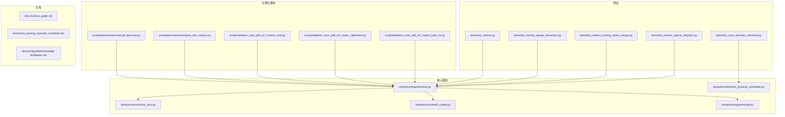
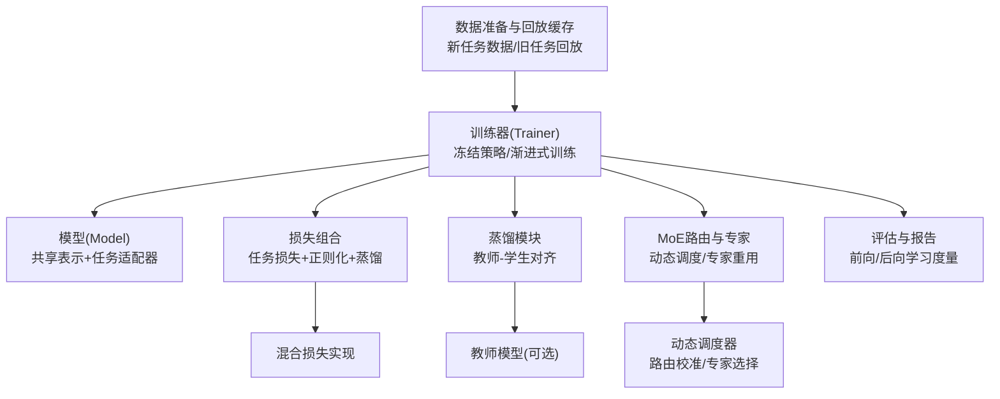
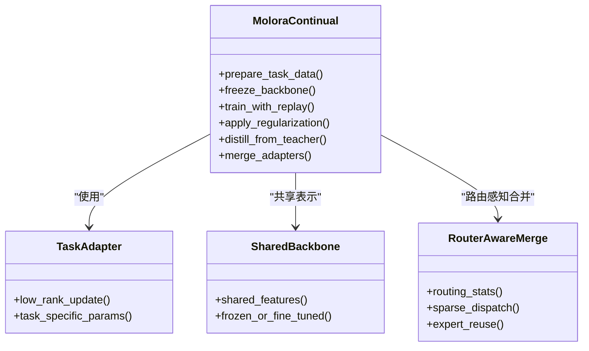
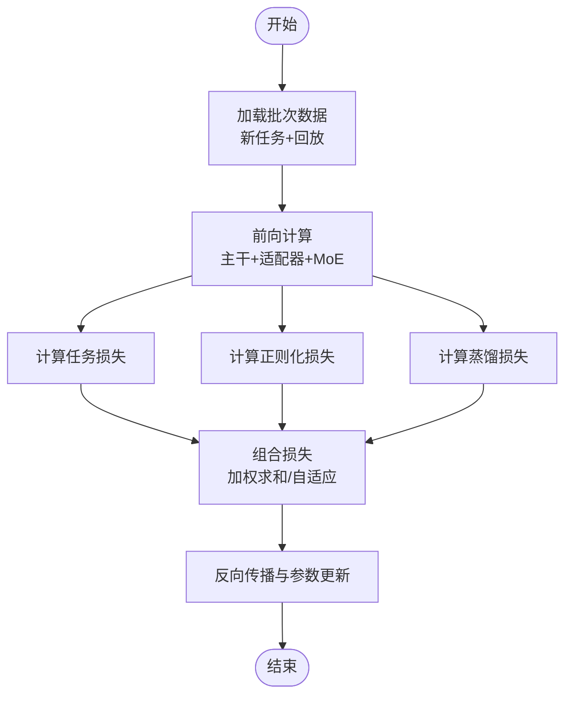
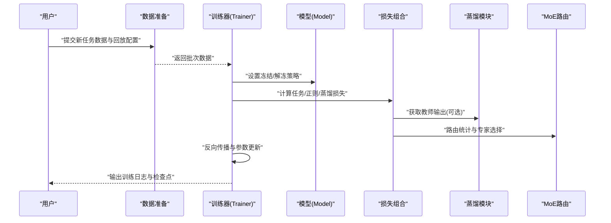
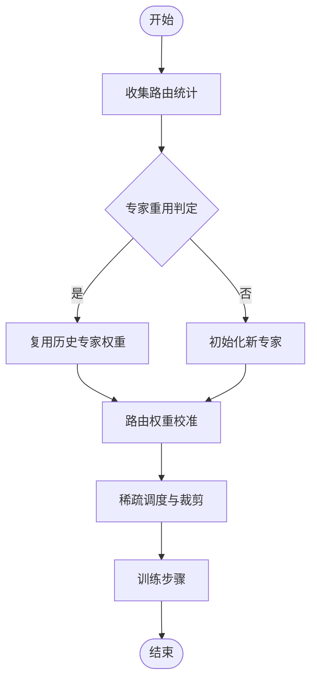
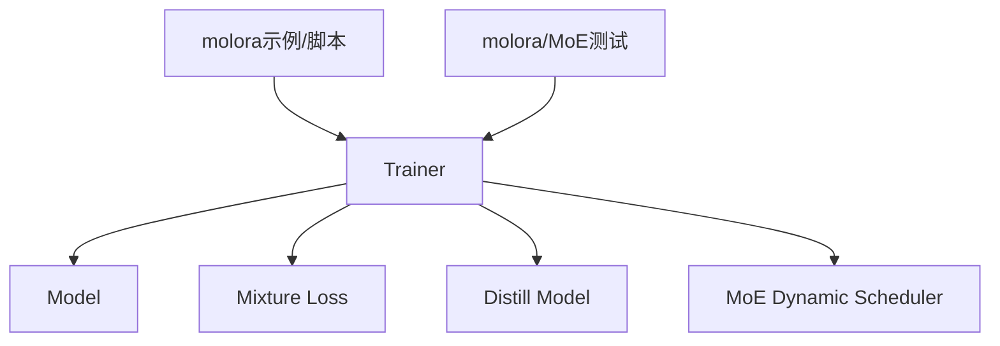

# 增量学习与灾难性遗忘

<cite>
**本文引用的文件**
- [molora_guide.md](file://docs/molora_guide.md)
- [continual_learning.py](file://examples/molora/continual_learning.py)
- [compare_lora_molora.py](file://examples/molora/compare_lora_molora.py)
- [test_molora.py](file://tests/test_molora.py)
- [test_molora_merge_semantics.py](file://tests/test_molora_merge_semantics.py)
- [test_molora_routing_aware_merge.py](file://tests/test_molora_routing_aware_merge.py)
- [test_molora_sparse_dispatch.py](file://tests/test_molora_sparse_dispatch.py)
- [ablation_moe_peft_e1_molora_rank.py](file://scripts/ablation_moe_peft_e1_molora_rank.py)
- [ablation_moe_peft_e2_router_calibration.py](file://scripts/ablation_moe_peft_e2_router_calibration.py)
- [ablation_moe_peft_e3_expert_load_viz.py](file://scripts/ablation_moe_peft_e3_expert_load_viz.py)
- [mixture_loss.py](file://ultralytics/nn/mixture_loss.py)
- [distill_model.py](file://ultralytics/nn/distill_model.py)
- [trainer.py](file://ultralytics/engine/trainer.py)
- [model.py](file://ultralytics/engine/model.py)
- [peft_adapters.py](file://tests/test_peft_adapters.py)
- [moe_dynamic_schedule.py](file://tests/test_moe_dynamic_schedule.py)
- [moe_dynamic_scheduler.py](file://ultralytics/utils/moe_dynamic_scheduler.py)
- [moe_pruning_sweep.py](file://scripts/moe_pruning_sweep.py)
- [moe_pruning_dynamic_schedule.md](file://docs/moe_pruning_dynamic_schedule.md)
- [knowledge_distillation.md](file://docs/en/guides/knowledge-distillation.md)
</cite>

## 目录
1. [引言](#引言)
2. [项目结构](#项目结构)
3. [核心组件](#核心组件)
4. [架构总览](#架构总览)
5. [详细组件分析](#详细组件分析)
6. [依赖关系分析](#依赖关系分析)
7. [性能考量](#性能考量)
8. [故障排查指南](#故障排查指南)
9. [结论](#结论)
10. [附录](#附录)

## 引言
本技术文档围绕YOLO-Master的增量学习系统，系统性阐述灾难性遗忘的理论基础及其在目标检测中的具体表现，并深入解析增量学习的核心算法（经验回放、正则化方法、知识蒸馏），以及molora在持续学习中的应用（动态网络扩展、任务特定适配器与共享表示学习）。同时，文档给出损失函数设计策略、端到端工作流程、评估指标体系、调优指南与最佳实践，并解释与MoE架构结合的增量学习方法（专家重用与路由调整）。

## 项目结构
仓库中与增量学习相关的代码与文档主要分布在以下位置：
- 示例与脚本：examples/molora、scripts/*molora*、scripts/*moe*
- 测试：tests/test_molora*.py、tests/test_moe*.py
- 核心模块：ultralytics/nn/mixture_loss.py、ultralytics/nn/distill_model.py、ultralytics/engine/trainer.py、ultralytics/engine/model.py
- 文档：docs/molora_guide.md、docs/moe_pruning_dynamic_schedule.md、docs/en/guides/knowledge-distillation.md

图表来源
- [continual_learning.py:1-200](file://examples/molora/continual_learning.py#L1-L200)
- [compare_lora_molora.py:1-200](file://examples/molora/compare_lora_molora.py#L1-L200)
- [ablation_moe_peft_e1_molora_rank.py:1-200](file://scripts/ablation_moe_peft_e1_molora_rank.py#L1-L200)
- [ablation_moe_peft_e2_router_calibration.py:1-200](file://scripts/ablation_moe_peft_e2_router_calibration.py#L1-L200)
- [ablation_moe_peft_e3_expert_load_viz.py:1-200](file://scripts/ablation_moe_peft_e3_expert_load_viz.py#L1-L200)
- [test_molora.py:1-200](file://tests/test_molora.py#L1-L200)
- [test_molora_merge_semantics.py:1-200](file://tests/test_molora_merge_semantics.py#L1-L200)
- [test_molora_routing_aware_merge.py:1-200](file://tests/test_molora_routing_aware_merge.py#L1-L200)
- [test_molora_sparse_dispatch.py:1-200](file://tests/test_molora_sparse_dispatch.py#L1-L200)
- [test_moe_dynamic_schedule.py:1-200](file://tests/test_moe_dynamic_schedule.py#L1-L200)
- [mixture_loss.py:1-200](file://ultralytics/nn/mixture_loss.py#L1-L200)
- [distill_model.py:1-200](file://ultralytics/nn/distill_model.py#L1-L200)
- [trainer.py:1-200](file://ultralytics/engine/trainer.py#L1-L200)
- [model.py:1-200](file://ultralytics/engine/model.py#L1-L200)
- [moe_dynamic_scheduler.py:1-200](file://ultralytics/utils/moe_dynamic_scheduler.py#L1-L200)
- [molora_guide.md:1-200](file://docs/molora_guide.md#L1-L200)
- [moe_pruning_dynamic_schedule.md:1-200](file://docs/moe_pruning_dynamic_schedule.md#L1-L200)
- [knowledge_distillation.md:1-200](file://docs/en/guides/knowledge-distillation.md#L1-L200)

章节来源
- [molora_guide.md:1-200](file://docs/molora_guide.md#L1-L200)
- [continual_learning.py:1-200](file://examples/molora/continual_learning.py#L1-L200)
- [compare_lora_molora.py:1-200](file://examples/molora/compare_lora_molora.py#L1-L200)
- [test_molora.py:1-200](file://tests/test_molora.py#L1-L200)
- [test_molora_merge_semantics.py:1-200](file://tests/test_molora_merge_semantics.py#L1-L200)
- [test_molora_routing_aware_merge.py:1-200](file://tests/test_molora_routing_aware_merge.py#L1-L200)
- [test_molora_sparse_dispatch.py:1-200](file://tests/test_molora_sparse_dispatch.py#L1-L200)
- [ablation_moe_peft_e1_molora_rank.py:1-200](file://scripts/ablation_moe_peft_e1_molora_rank.py#L1-L200)
- [ablation_moe_peft_e2_router_calibration.py:1-200](file://scripts/ablation_moe_peft_e2_router_calibration.py#L1-L200)
- [ablation_moe_peft_e3_expert_load_viz.py:1-200](file://scripts/ablation_moe_peft_e3_expert_load_viz.py#L1-L200)
- [mixture_loss.py:1-200](file://ultralytics/nn/mixture_loss.py#L1-L200)
- [distill_model.py:1-200](file://ultralytics/nn/distill_model.py#L1-L200)
- [trainer.py:1-200](file://ultralytics/engine/trainer.py#L1-L200)
- [model.py:1-200](file://ultralytics/engine/model.py#L1-L200)
- [moe_dynamic_scheduler.py:1-200](file://ultralytics/utils/moe_dynamic_scheduler.py#L1-L200)
- [moe_pruning_dynamic_schedule.md:1-200](file://docs/moe_pruning_dynamic_schedule.md#L1-L200)
- [knowledge_distillation.md:1-200](file://docs/en/guides/knowledge-distillation.md#L1-L200)

## 核心组件
- molora持续学习框架
  - 提供增量训练流程、LoRA与molora对比、路由感知合并与稀疏调度等能力。
  - 关键入口与用例参见示例与测试文件。
- MoE相关工具与调度
  - 动态调度器用于专家选择与路由校准，支持专家重用与路由调整。
- 损失与蒸馏
  - 混合损失组合（任务损失、正则化损失、蒸馏损失）与教师-学生蒸馏管线。
- 训练引擎
  - Trainer与Model负责数据加载、冻结策略、渐进式训练与评估集成。

章节来源
- [molora_guide.md:1-200](file://docs/molora_guide.md#L1-L200)
- [continual_learning.py:1-200](file://examples/molora/continual_learning.py#L1-L200)
- [compare_lora_molora.py:1-200](file://examples/molora/compare_lora_molora.py#L1-L200)
- [moe_dynamic_scheduler.py:1-200](file://ultralytics/utils/moe_dynamic_scheduler.py#L1-L200)
- [mixture_loss.py:1-200](file://ultralytics/nn/mixture_loss.py#L1-L200)
- [distill_model.py:1-200](file://ultralytics/nn/distill_model.py#L1-L200)
- [trainer.py:1-200](file://ultralytics/engine/trainer.py#L1-L200)
- [model.py:1-200](file://ultralytics/engine/model.py#L1-L200)

## 架构总览
下图展示增量学习系统在YOLO-Master中的整体架构：数据准备与回放缓存、模型冻结与渐进式训练、损失组合与蒸馏、MoE路由与专家管理、评估与报告生成。

图表来源
- [trainer.py:1-200](file://ultralytics/engine/trainer.py#L1-L200)
- [model.py:1-200](file://ultralytics/engine/model.py#L1-L200)
- [mixture_loss.py:1-200](file://ultralytics/nn/mixture_loss.py#L1-L200)
- [distill_model.py:1-200](file://ultralytics/nn/distill_model.py#L1-L200)
- [moe_dynamic_scheduler.py:1-200](file://ultralytics/utils/moe_dynamic_scheduler.py#L1-L200)

## 详细组件分析

### 灾难性遗忘问题与目标检测中的表现
- 理论基础
  - 增量学习中，模型在新任务上优化时，参数更新会破坏对旧任务的表征，导致性能显著下降。
- 在目标检测中的具体表现
  - 类别分布变化引发边界框回归与分类头偏移；小样本类别易被覆盖；多尺度特征退化；IoU阈值敏感导致mAP快速下滑。
- 缓解思路
  - 经验回放保持旧任务分布；正则化约束重要参数；蒸馏维持旧任务输出一致性；MoE通过专家隔离与路由控制减少干扰。

[本节为概念性说明，不直接分析具体文件]

### 增量学习核心算法
- 经验回放
  - 维护旧任务样本子集，与新任务数据混合训练，稳定分布与表征。
- 正则化方法
  - 对关键参数施加权重衰减或弹性巩固，限制对旧任务重要的参数大幅更新。
- 知识蒸馏
  - 使用教师模型（旧任务模型）输出作为软标签，约束学生模型在新任务训练时的行为，保持输出一致性。

章节来源
- [molora_guide.md:1-200](file://docs/molora_guide.md#L1-L200)
- [knowledge_distillation.md:1-200](file://docs/en/guides/knowledge-distillation.md#L1-L200)
- [distill_model.py:1-200](file://ultralytics/nn/distill_model.py#L1-L200)

### molora在持续学习中的应用
- 动态网络扩展
  - 为新任务引入轻量适配器或新增专家，避免全量重训，降低参数量增长。
- 任务特定适配器
  - LoRA风格的低秩适配模块，针对任务微调，保留共享主干表征。
- 共享表示学习
  - 主干网络共享，任务分支与适配器差异化，平衡迁移与稳定性。
- 路由感知合并与稀疏调度
  - 根据路由统计进行权重合并与专家裁剪，提升效率与泛化。

图表来源
- [continual_learning.py:1-200](file://examples/molora/continual_learning.py#L1-L200)
- [compare_lora_molora.py:1-200](file://examples/molora/compare_lora_molora.py#L1-L200)
- [test_molora_merge_semantics.py:1-200](file://tests/test_molora_merge_semantics.py#L1-L200)
- [test_molora_routing_aware_merge.py:1-200](file://tests/test_molora_routing_aware_merge.py#L1-L200)
- [test_molora_sparse_dispatch.py:1-200](file://tests/test_molora_sparse_dispatch.py#L1-L200)

章节来源
- [molora_guide.md:1-200](file://docs/molora_guide.md#L1-L200)
- [continual_learning.py:1-200](file://examples/molora/continual_learning.py#L1-L200)
- [compare_lora_molora.py:1-200](file://examples/molora/compare_lora_molora.py#L1-L200)
- [test_molora.py:1-200](file://tests/test_molora.py#L1-L200)
- [test_molora_merge_semantics.py:1-200](file://tests/test_molora_merge_semantics.py#L1-L200)
- [test_molora_routing_aware_merge.py:1-200](file://tests/test_molora_routing_aware_merge.py#L1-L200)
- [test_molora_sparse_dispatch.py:1-200](file://tests/test_molora_sparse_dispatch.py#L1-L200)

### 损失函数设计与组合策略
- 任务损失
  - 检测任务的标准损失（分类、回归、分割等），驱动新任务拟合。
- 正则化损失
  - 对关键参数施加惩罚，抑制对旧任务重要的参数漂移。
- 蒸馏损失
  - 基于教师输出的KL散度或MSE，约束学生输出与教师一致。
- 组合策略
  - 加权求和或自适应权重，随训练阶段动态调整，平衡稳定性与可塑性。

图表来源
- [mixture_loss.py:1-200](file://ultralytics/nn/mixture_loss.py#L1-L200)
- [distill_model.py:1-200](file://ultralytics/nn/distill_model.py#L1-L200)
- [trainer.py:1-200](file://ultralytics/engine/trainer.py#L1-L200)

章节来源
- [mixture_loss.py:1-200](file://ultralytics/nn/mixture_loss.py#L1-L200)
- [distill_model.py:1-200](file://ultralytics/nn/distill_model.py#L1-L200)
- [trainer.py:1-200](file://ultralytics/engine/trainer.py#L1-L200)

### 增量学习工作流程
- 新任务数据准备
  - 构建新任务数据集，采样旧任务回放样本，统一预处理与标注格式。
- 模型冻结策略
  - 主干网络部分冻结，仅训练适配器与任务特定模块；逐步解冻以渐进式训练。
- 渐进式训练
  - 分阶段训练：先适配器后主干微调；结合蒸馏与正则化，稳定学习过程。

图表来源
- [continual_learning.py:1-200](file://examples/molora/continual_learning.py#L1-L200)
- [trainer.py:1-200](file://ultralytics/engine/trainer.py#L1-L200)
- [model.py:1-200](file://ultralytics/engine/model.py#L1-L200)
- [mixture_loss.py:1-200](file://ultralytics/nn/mixture_loss.py#L1-L200)
- [distill_model.py:1-200](file://ultralytics/nn/distill_model.py#L1-L200)
- [moe_dynamic_scheduler.py:1-200](file://ultralytics/utils/moe_dynamic_scheduler.py#L1-L200)

章节来源
- [continual_learning.py:1-200](file://examples/molora/continual_learning.py#L1-L200)
- [trainer.py:1-200](file://ultralytics/engine/trainer.py#L1-L200)
- [model.py:1-200](file://ultralytics/engine/model.py#L1-L200)

### 评估指标与平衡度量
- 前向学习
  - 新任务mAP、召回率、精确率，衡量对新知识的吸收能力。
- 后向学习
  - 旧任务mAP下降幅度、平均遗忘率，衡量稳定性。
- 平衡度量
  - 前向-后向权衡曲线、综合得分（如F-Balance），指导超参搜索与早停策略。

[本节为概念性说明，不直接分析具体文件]

### 调优指南与最佳实践
- 回放比例与窗口大小
  - 根据旧任务规模与分布差异调整，避免过度记忆或分布偏移。
- 正则化强度
  - 依据参数重要性估计（如Fisher信息）设定权重，防止过约束。
- 蒸馏温度与权重
  - 温度平滑软标签，权重随训练阶段递减，侧重早期稳定性。
- 适配器秩与学习率
  - 低秩适配配合较小学习率，逐步增大以加速收敛。
- MoE路由与专家裁剪
  - 基于路由统计剪枝低利用率专家，保持容量与效率平衡。

章节来源
- [molora_guide.md:1-200](file://docs/molora_guide.md#L1-L200)
- [moe_pruning_dynamic_schedule.md:1-200](file://docs/moe_pruning_dynamic_schedule.md#L1-L200)
- [moe_dynamic_scheduler.py:1-200](file://ultralytics/utils/moe_dynamic_scheduler.py#L1-L200)

### 与MoE架构结合的增量学习
- 专家重用
  - 复用历史任务中高效专家，减少重复训练成本。
- 路由调整
  - 基于任务特征与路由统计动态调整门控，提升任务特异性与泛化。
- 动态调度与裁剪
  - 按阶段调整专家激活比例，结合稀疏调度降低显存与延迟。

图表来源
- [moe_dynamic_scheduler.py:1-200](file://ultralytics/utils/moe_dynamic_scheduler.py#L1-L200)
- [test_moe_dynamic_schedule.py:1-200](file://tests/test_moe_dynamic_schedule.py#L1-L200)
- [moe_pruning_sweep.py:1-200](file://scripts/moe_pruning_sweep.py#L1-L200)
- [moe_pruning_dynamic_schedule.md:1-200](file://docs/moe_pruning_dynamic_schedule.md#L1-L200)

章节来源
- [moe_dynamic_scheduler.py:1-200](file://ultralytics/utils/moe_dynamic_scheduler.py#L1-L200)
- [test_moe_dynamic_schedule.py:1-200](file://tests/test_moe_dynamic_schedule.py#L1-L200)
- [moe_pruning_sweep.py:1-200](file://scripts/moe_pruning_sweep.py#L1-L200)
- [moe_pruning_dynamic_schedule.md:1-200](file://docs/moe_pruning_dynamic_schedule.md#L1-L200)

## 依赖关系分析
- 组件耦合
  - Trainer依赖Model、损失组合与蒸馏模块；molora示例与脚本通过Trainer接口组织增量训练流程。
- 外部依赖
  - PyTorch生态、MoE调度器、PEFT适配器（LoRA）与评测工具。
- 潜在循环依赖
  - 通过分层接口与回调机制解耦，避免循环导入。

图表来源
- [trainer.py:1-200](file://ultralytics/engine/trainer.py#L1-L200)
- [model.py:1-200](file://ultralytics/engine/model.py#L1-L200)
- [mixture_loss.py:1-200](file://ultralytics/nn/mixture_loss.py#L1-L200)
- [distill_model.py:1-200](file://ultralytics/nn/distill_model.py#L1-L200)
- [moe_dynamic_scheduler.py:1-200](file://ultralytics/utils/moe_dynamic_scheduler.py#L1-L200)
- [continual_learning.py:1-200](file://examples/molora/continual_learning.py#L1-L200)
- [test_molora.py:1-200](file://tests/test_molora.py#L1-L200)

章节来源
- [trainer.py:1-200](file://ultralytics/engine/trainer.py#L1-L200)
- [model.py:1-200](file://ultralytics/engine/model.py#L1-L200)
- [mixture_loss.py:1-200](file://ultralytics/nn/mixture_loss.py#L1-L200)
- [distill_model.py:1-200](file://ultralytics/nn/distill_model.py#L1-L200)
- [moe_dynamic_scheduler.py:1-200](file://ultralytics/utils/moe_dynamic_scheduler.py#L1-L200)
- [continual_learning.py:1-200](file://examples/molora/continual_learning.py#L1-L200)
- [test_molora.py:1-200](file://tests/test_molora.py#L1-L200)

## 性能考量
- 回放缓存与I/O
  - 采用内存映射与预取，减少磁盘瓶颈；合理批大小与数据增强开销。
- 稀疏MoE与路由
  - 控制激活专家数，利用稀疏调度降低计算与通信开销。
- 梯度累积与混合精度
  - 在大模型场景下提升吞吐，注意数值稳定性与NaN防护。
- 早停与监控
  - 基于验证集mAP与遗忘率双指标，避免过拟合与后向退化。

[本节为通用性能建议，不直接分析具体文件]

## 故障排查指南
- 训练不稳定或NaN
  - 检查蒸馏温度与权重、学习率与梯度裁剪；确认混合精度与AMP配置。
- 后向遗忘严重
  - 增加回放比例与正则化强度；提高蒸馏权重；缩短主干解冻步长。
- MoE路由异常
  - 观察路由统计与专家利用率；校准路由权重；必要时裁剪低效专家。
- 适配器合并失败
  - 核对合并语义与稀疏调度一致性；确保路由感知合并的参数维度匹配。

章节来源
- [test_molora_merge_semantics.py:1-200](file://tests/test_molora_merge_semantics.py#L1-L200)
- [test_molora_routing_aware_merge.py:1-200](file://tests/test_molora_routing_aware_merge.py#L1-L200)
- [test_molora_sparse_dispatch.py:1-200](file://tests/test_molora_sparse_dispatch.py#L1-L200)
- [test_moe_dynamic_schedule.py:1-200](file://tests/test_moe_dynamic_schedule.py#L1-L200)

## 结论
YOLO-Master的增量学习系统通过molora框架、MoE路由与专家管理、损失组合与蒸馏，有效缓解灾难性遗忘，实现前向学习与后向稳定的平衡。实践中需结合回放策略、正则化与蒸馏权重调优，并借助路由感知合并与稀疏调度提升效率与泛化。

[本节为总结性内容，不直接分析具体文件]

## 附录
- 参考文档与计划
  - molora指南、MoE动态调度与裁剪文档、知识蒸馏指南。
- 实验与消融
  - 多组消融脚本覆盖rank、路由校准与专家可视化，便于复现与对比。

章节来源
- [molora_guide.md:1-200](file://docs/molora_guide.md#L1-L200)
- [moe_pruning_dynamic_schedule.md:1-200](file://docs/moe_pruning_dynamic_schedule.md#L1-L200)
- [knowledge_distillation.md:1-200](file://docs/en/guides/knowledge-distillation.md#L1-L200)
- [ablation_moe_peft_e1_molora_rank.py:1-200](file://scripts/ablation_moe_peft_e1_molora_rank.py#L1-L200)
- [ablation_moe_peft_e2_router_calibration.py:1-200](file://scripts/ablation_moe_peft_e2_router_calibration.py#L1-L200)
- [ablation_moe_peft_e3_expert_load_viz.py:1-200](file://scripts/ablation_moe_peft_e3_expert_load_viz.py#L1-L200)