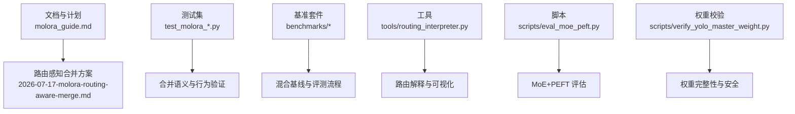
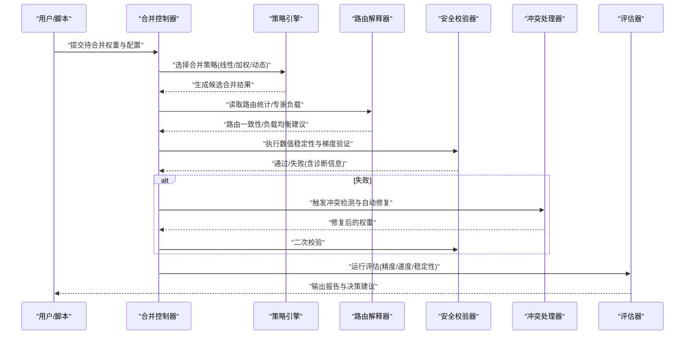
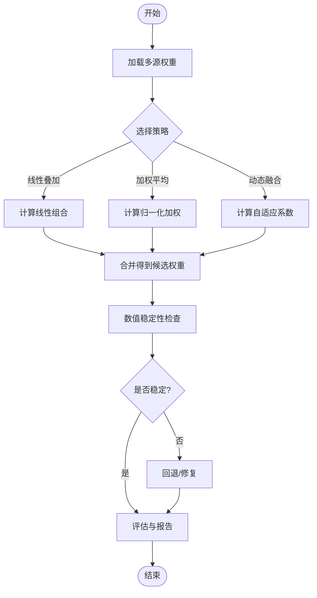
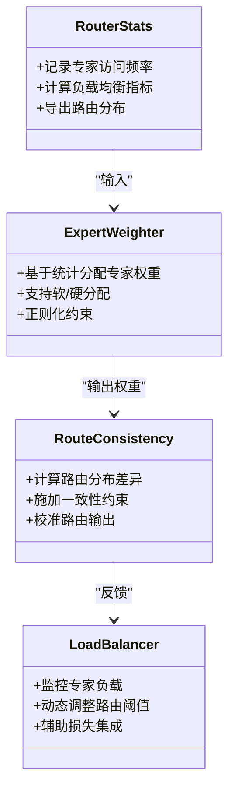
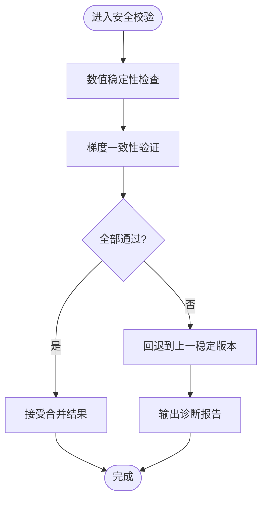
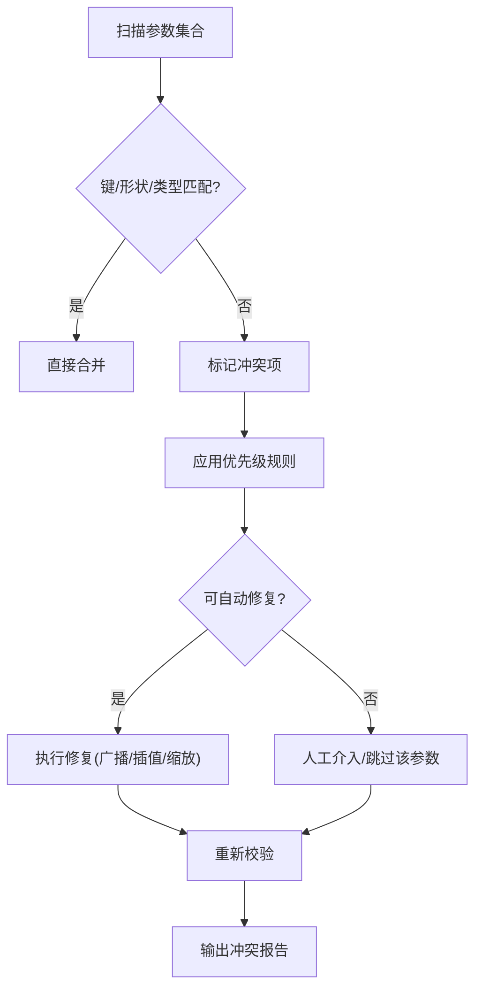
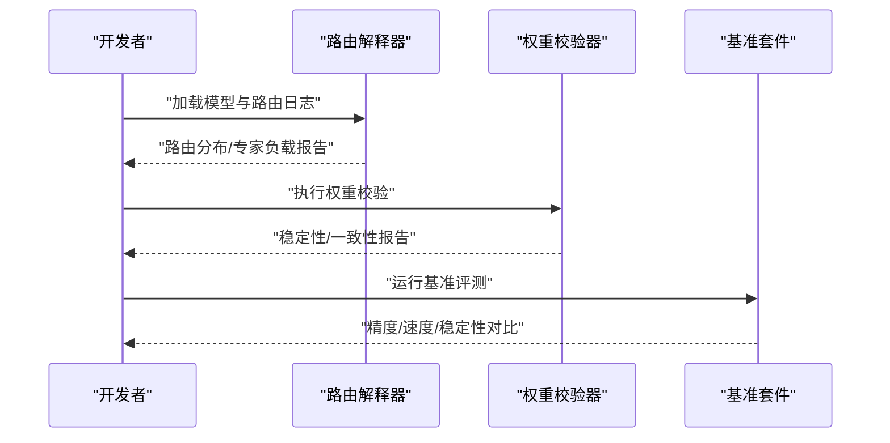
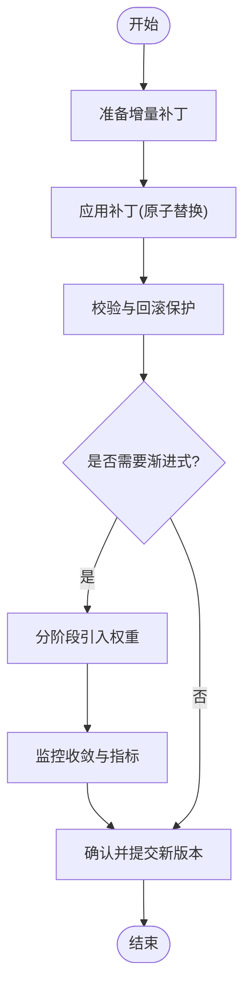
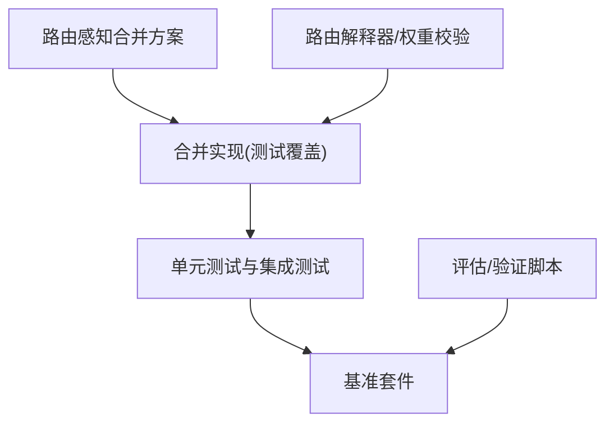

# 权重合并算法

<cite>
**本文引用的文件**
- [molora_guide.md](file://docs/molora_guide.md)
- [2026-07-17-molora-routing-aware-merge.md](file://docs/plans/2026-07-17-molora-routing-aware-merge.md)
- [test_molora_merge_semantics.py](file://tests/test_molora_merge_semantics.py)
- [test_molora_routing_aware_merge.py](file://tests/test_molora_routing_aware_merge.py)
- [test_molora.py](file://tests/test_molora.py)
- [test_molora_dtype.py](file://tests/test_molora_dtype.py)
- [test_molora_sparse_dispatch.py](file://tests/test_molora_sparse_dispatch.py)
- [test_molora_supplementary.py](file://tests/test_molora_supplementary.py)
- [moe_pruning_dynamic_schedule.md](file://docs/moe_pruning_dynamic_schedule.md)
- [mixture_baselines.yaml](file://benchmarks/mixture_baselines.yaml)
- [run.py](file://benchmarks/run.py)
- [suite.py](file://benchmarks/suite.py)
- [eval_moe_peft.py](file://scripts/eval_moe_peft.py)
- [verify_yolo_master_weight.py](file://scripts/verify_yolo_master_weight.py)
- [routing_interpreter.py](file://tools/routing_interpreter.py)
- [routing_interpreter.py](file://ultralytics/utils/routing_interpreter.py)
</cite>

## 目录
1. [简介](#简介)
2. [项目结构](#项目结构)
3. [核心组件](#核心组件)
4. [架构总览](#架构总览)
5. [详细组件分析](#详细组件分析)
6. [依赖关系分析](#依赖关系分析)
7. [性能考量](#性能考量)
8. [故障排查指南](#故障排查指南)
9. [结论](#结论)
10. [附录](#附录)

## 简介
本技术文档聚焦于 YOLO-Master 的权重合并算法，覆盖以下关键主题：
- 数学原理：线性叠加、加权平均与动态融合策略
- MoE 感知合并：专家权重分配、路由一致性保证与负载均衡维护
- 安全合并机制：数值稳定性检查、梯度验证与回退策略
- 冲突检测与解决：参数冲突识别、优先级处理与自动修复
- 合并质量评估：性能保持度、精度损失与推理速度影响
- 策略对比与适用场景
- 监控与调试工具使用
- 增量合并与渐进式合并实现细节

## 项目结构
围绕权重合并相关能力，仓库中涉及的关键位置包括：
- 设计规划与说明：molora 路由感知合并方案与指南
- 测试用例：覆盖语义、路由感知、稀疏调度、数据类型等维度
- 基准与评测：混合基线配置、评测运行脚本与套件
- 工具与诊断：路由解释器、权重校验脚本
- 训练/评估脚本：MoE+PEFT 评估流程与权重验证

图表来源
- [molora_guide.md:1-200](file://docs/molora_guide.md#L1-L200)
- [2026-07-17-molora-routing-aware-merge.md:1-200](file://docs/plans/2026-07-17-molora-routing-aware-merge.md#L1-L200)
- [test_molora_merge_semantics.py:1-200](file://tests/test_molora_merge_semantics.py#L1-L200)
- [test_molora_routing_aware_merge.py:1-200](file://tests/test_molora_routing_aware_merge.py#L1-L200)
- [mixture_baselines.yaml:1-200](file://benchmarks/mixture_baselines.yaml#L1-L200)
- [run.py:1-200](file://benchmarks/run.py#L1-L200)
- [suite.py:1-200](file://benchmarks/suite.py#L1-L200)
- [eval_moe_peft.py:1-200](file://scripts/eval_moe_peft.py#L1-L200)
- [verify_yolo_master_weight.py:1-200](file://scripts/verify_yolo_master_weight.py#L1-L200)
- [routing_interpreter.py:1-200](file://tools/routing_interpreter.py#L1-L200)
- [routing_interpreter.py:1-200](file://ultralytics/utils/routing_interpreter.py#L1-L200)

章节来源
- [molora_guide.md:1-200](file://docs/molora_guide.md#L1-L200)
- [2026-07-17-molora-routing-aware-merge.md:1-200](file://docs/plans/2026-07-17-molora-routing-aware-merge.md#L1-L200)
- [test_molora_merge_semantics.py:1-200](file://tests/test_molora_merge_semantics.py#L1-L200)
- [test_molora_routing_aware_merge.py:1-200](file://tests/test_molora_routing_aware_merge.py#L1-L200)
- [mixture_baselines.yaml:1-200](file://benchmarks/mixture_baselines.yaml#L1-L200)
- [run.py:1-200](file://benchmarks/run.py#L1-L200)
- [suite.py:1-200](file://benchmarks/suite.py#L1-L200)
- [eval_moe_peft.py:1-200](file://scripts/eval_moe_peft.py#L1-L200)
- [verify_yolo_master_weight.py:1-200](file://scripts/verify_yolo_master_weight.py#L1-L200)
- [routing_interpreter.py:1-200](file://tools/routing_interpreter.py#L1-L200)
- [routing_interpreter.py:1-200](file://ultralytics/utils/routing_interpreter.py#L1-L200)

## 核心组件
- 合并策略族
  - 线性叠加：将多个权重按固定系数相加，适用于同构模块的快速组合。
  - 加权平均：对多源权重进行归一化加权，常用于 LoRA/Adapter 的平滑融合。
  - 动态融合：依据输入或任务特征自适应调整融合系数，提升泛化性。
- MoE 感知合并
  - 专家权重分配：基于路由统计或任务先验为不同专家设置差异化权重。
  - 路由一致性：确保合并后模型的路由逻辑与原始路由分布一致，避免退化。
  - 负载均衡：在合并过程中维持各专家的利用率均衡，防止“专家坍塌”。
- 安全合并机制
  - 数值稳定性检查：检测 NaN/Inf、极端范数与条件数异常。
  - 梯度验证：通过小批量前向/反向核对合并前后梯度一致性。
  - 回退策略：当检测到不稳定或退化时，自动回滚到上一稳定版本。
- 冲突检测与解决
  - 参数冲突识别：比对键空间、形状与类型，定位不兼容项。
  - 优先级处理：定义合并优先级（如主干 > 适配器 > 微调），减少覆盖风险。
  - 自动修复：提供插值、缩放、广播对齐等修复手段。
- 合并质量评估
  - 性能保持度：比较合并前后在验证集上的主要指标变化。
  - 精度损失：量化关键类别或边界样本的精度下降幅度。
  - 推理速度影响：统计吞吐与时延变化，评估部署收益。
- 增量与渐进式合并
  - 增量合并：以补丁形式逐步应用新权重，支持热更新。
  - 渐进式合并：分阶段引入新权重，配合学习率衰减与早停，降低震荡。

章节来源
- [molora_guide.md:1-200](file://docs/molora_guide.md#L1-L200)
- [2026-07-17-molora-routing-aware-merge.md:1-200](file://docs/plans/2026-07-17-molora-routing-aware-merge.md#L1-L200)
- [test_molora_merge_semantics.py:1-200](file://tests/test_molora_merge_semantics.py#L1-L200)
- [test_molora_routing_aware_merge.py:1-200](file://tests/test_molora_routing_aware_merge.py#L1-L200)
- [test_molora.py:1-200](file://tests/test_molora.py#L1-L200)
- [test_molora_dtype.py:1-200](file://tests/test_molora_dtype.py#L1-L200)
- [test_molora_sparse_dispatch.py:1-200](file://tests/test_molora_sparse_dispatch.py#L1-L200)
- [test_molora_supplementary.py:1-200](file://tests/test_molora_supplementary.py#L1-L200)
- [moe_pruning_dynamic_schedule.md:1-200](file://docs/moe_pruning_dynamic_schedule.md#L1-L200)
- [mixture_baselines.yaml:1-200](file://benchmarks/mixture_baselines.yaml#L1-L200)
- [run.py:1-200](file://benchmarks/run.py#L1-L200)
- [suite.py:1-200](file://benchmarks/suite.py#L1-L200)
- [eval_moe_peft.py:1-200](file://scripts/eval_moe_peft.py#L1-L200)
- [verify_yolo_master_weight.py:1-200](file://scripts/verify_yolo_master_weight.py#L1-L200)
- [routing_interpreter.py:1-200](file://tools/routing_interpreter.py#L1-L200)
- [routing_interpreter.py:1-200](file://ultralytics/utils/routing_interpreter.py#L1-L200)

## 架构总览
下图展示了权重合并从输入到输出的端到端流程，涵盖策略选择、MoE 感知、安全检查、冲突处理与评估闭环。

图表来源
- [molora_guide.md:1-200](file://docs/molora_guide.md#L1-L200)
- [2026-07-17-molora-routing-aware-merge.md:1-200](file://docs/plans/2026-07-17-molora-routing-aware-merge.md#L1-L200)
- [routing_interpreter.py:1-200](file://tools/routing_interpreter.py#L1-L200)
- [routing_interpreter.py:1-200](file://ultralytics/utils/routing_interpreter.py#L1-L200)
- [eval_moe_peft.py:1-200](file://scripts/eval_moe_peft.py#L1-L200)
- [verify_yolo_master_weight.py:1-200](file://scripts/verify_yolo_master_weight.py#L1-L200)

## 详细组件分析

### 合并策略与数学原理
- 线性叠加
  - 目标：快速组合多源权重，保留各自特性。
  - 要点：需控制系数和以避免放大噪声；对稀疏结构需谨慎广播。
- 加权平均
  - 目标：平滑融合，抑制过拟合风险。
  - 要点：权重归一化、按层/按块粒度调节、考虑参数规模差异。
- 动态融合
  - 目标：根据输入或任务上下文自适应调整融合系数。
  - 要点：可学习门控或基于路由统计的启发式规则；注意训练/推理一致性。

图表来源
- [molora_guide.md:1-200](file://docs/molora_guide.md#L1-L200)
- [test_molora_merge_semantics.py:1-200](file://tests/test_molora_merge_semantics.py#L1-L200)
- [test_molora.py:1-200](file://tests/test_molora.py#L1-L200)

章节来源
- [molora_guide.md:1-200](file://docs/molora_guide.md#L1-L200)
- [test_molora_merge_semantics.py:1-200](file://tests/test_molora_merge_semantics.py#L1-L200)
- [test_molora.py:1-200](file://tests/test_molora.py#L1-L200)

### MoE 感知的合并算法
- 专家权重分配
  - 依据：历史路由频率、任务相关性、专家容量与重要性评分。
  - 方法：软分配（概率）或硬分配（Top-K），结合正则项避免集中化。
- 路由一致性保证
  - 目标：合并后路由分布与原始接近，避免退化。
  - 方法：KL 散度约束、路由输出对齐、校准步骤。
- 负载均衡维护
  - 目标：防止少数专家过载。
  - 方法：辅助损失、容量惩罚、动态重路由。

图表来源
- [2026-07-17-molora-routing-aware-merge.md:1-200](file://docs/plans/2026-07-17-molora-routing-aware-merge.md#L1-L200)
- [test_molora_routing_aware_merge.py:1-200](file://tests/test_molora_routing_aware_merge.py#L1-L200)
- [moe_pruning_dynamic_schedule.md:1-200](file://docs/moe_pruning_dynamic_schedule.md#L1-L200)

章节来源
- [2026-07-17-molora-routing-aware-merge.md:1-200](file://docs/plans/2026-07-17-molora-routing-aware-merge.md#L1-L200)
- [test_molora_routing_aware_merge.py:1-200](file://tests/test_molora_routing_aware_merge.py#L1-L200)
- [moe_pruning_dynamic_schedule.md:1-200](file://docs/moe_pruning_dynamic_schedule.md#L1-L200)

### 安全合并机制
- 数值稳定性检查
  - 检测 NaN/Inf、极大范数、条件数异常。
  - 针对稀疏/门控结构进行逐块校验。
- 梯度验证
  - 在小批量上对比合并前后的梯度差，设定容忍阈值。
- 回退策略
  - 若校验失败，自动回滚至最近稳定快照，并记录诊断日志。

图表来源
- [verify_yolo_master_weight.py:1-200](file://scripts/verify_yolo_master_weight.py#L1-L200)
- [test_molora_dtype.py:1-200](file://tests/test_molora_dtype.py#L1-L200)
- [test_molora_supplementary.py:1-200](file://tests/test_molora_supplementary.py#L1-L200)

章节来源
- [verify_yolo_master_weight.py:1-200](file://scripts/verify_yolo_master_weight.py#L1-L200)
- [test_molora_dtype.py:1-200](file://tests/test_molora_dtype.py#L1-L200)
- [test_molora_supplementary.py:1-200](file://tests/test_molora_supplementary.py#L1-L200)

### 冲突检测与解决算法
- 参数冲突识别
  - 键名不一致、形状不匹配、数据类型不同。
- 优先级处理
  - 定义层级优先级（主干 > 适配器 > 微调），避免误覆盖。
- 自动修复
  - 广播对齐、插值补全、缩放因子估计、缺失参数初始化。

图表来源
- [test_molora_merge_semantics.py:1-200](file://tests/test_molora_merge_semantics.py#L1-L200)
- [test_molora.py:1-200](file://tests/test_molora.py#L1-L200)

章节来源
- [test_molora_merge_semantics.py:1-200](file://tests/test_molora_merge_semantics.py#L1-L200)
- [test_molora.py:1-200](file://tests/test_molora.py#L1-L200)

### 合并质量评估指标
- 性能保持度
  - 对比合并前后在标准数据集上的主要指标（如 mAP）。
- 精度损失
  - 关注困难样本与长尾类别的精度变化。
- 推理速度影响
  - 统计吞吐与延迟，评估部署收益。
- 稳定性与鲁棒性
  - 多次随机种子下的方差、对抗扰动下的表现。

图表来源
- [eval_moe_peft.py:1-200](file://scripts/eval_moe_peft.py#L1-L200)
- [mixture_baselines.yaml:1-200](file://benchmarks/mixture_baselines.yaml#L1-L200)
- [run.py:1-200](file://benchmarks/run.py#L1-L200)
- [suite.py:1-200](file://benchmarks/suite.py#L1-L200)

章节来源
- [eval_moe_peft.py:1-200](file://scripts/eval_moe_peft.py#L1-L200)
- [mixture_baselines.yaml:1-200](file://benchmarks/mixture_baselines.yaml#L1-L200)
- [run.py:1-200](file://benchmarks/run.py#L1-L200)
- [suite.py:1-200](file://benchmarks/suite.py#L1-L200)

### 不同合并策略的对比与适用场景
- 线性叠加
  - 优点：简单高效，适合快速原型。
  - 缺点：可能放大噪声，不适合强异构结构。
  - 适用：同构模块、轻量级适配。
- 加权平均
  - 优点：平滑稳定，易调参。
  - 缺点：可能抹平重要特性。
  - 适用：LoRA/Adapter 融合、多任务共享主干。
- 动态融合
  - 优点：适应性强，能捕捉上下文差异。
  - 缺点：复杂度较高，需额外门控或统计。
  - 适用：MoE 专家融合、跨域迁移。

[本节为概念性总结，无需列出具体文件来源]

### 监控与调试工具使用方法
- 路由解释器
  - 功能：解析路由统计、可视化专家负载与路由分布。
  - 用法：加载模型与路由日志，输出分析报告与可视化图。
- 权重校验脚本
  - 功能：执行数值稳定性检查、形状/类型一致性校验。
  - 用法：指定权重路径与校验选项，生成健康报告。
- 基准套件
  - 功能：统一评测流程，支持多基线与多任务。
  - 用法：配置 YAML，运行 run.py 与 suite.py 获取对比结果。

图表来源
- [routing_interpreter.py:1-200](file://tools/routing_interpreter.py#L1-L200)
- [routing_interpreter.py:1-200](file://ultralytics/utils/routing_interpreter.py#L1-L200)
- [verify_yolo_master_weight.py:1-200](file://scripts/verify_yolo_master_weight.py#L1-L200)
- [run.py:1-200](file://benchmarks/run.py#L1-L200)
- [suite.py:1-200](file://benchmarks/suite.py#L1-L200)

章节来源
- [routing_interpreter.py:1-200](file://tools/routing_interpreter.py#L1-L200)
- [routing_interpreter.py:1-200](file://ultralytics/utils/routing_interpreter.py#L1-L200)
- [verify_yolo_master_weight.py:1-200](file://scripts/verify_yolo_master_weight.py#L1-L200)
- [run.py:1-200](file://benchmarks/run.py#L1-L200)
- [suite.py:1-200](file://benchmarks/suite.py#L1-L200)

### 增量合并与渐进式合并
- 增量合并
  - 以补丁形式应用新权重，支持热更新与版本管理。
  - 关键点：补丁签名、依赖声明、原子替换。
- 渐进式合并
  - 分阶段引入新权重，配合学习率衰减与早停，降低震荡。
  - 关键点：阶段划分、收敛判定、回退窗口。

图表来源
- [test_molora_supplementary.py:1-200](file://tests/test_molora_supplementary.py#L1-L200)
- [test_molora.py:1-200](file://tests/test_molora.py#L1-L200)

章节来源
- [test_molora_supplementary.py:1-200](file://tests/test_molora_supplementary.py#L1-L200)
- [test_molora.py:1-200](file://tests/test_molora.py#L1-L200)

## 依赖关系分析
权重合并相关的依赖关系如下：
- 文档与计划驱动实现与测试
- 测试覆盖语义、路由感知、稀疏调度与数据类型
- 基准套件提供统一的评测入口与配置
- 工具与脚本支撑路由解释、权重校验与评估

图表来源
- [2026-07-17-molora-routing-aware-merge.md:1-200](file://docs/plans/2026-07-17-molora-routing-aware-merge.md#L1-L200)
- [test_molora_merge_semantics.py:1-200](file://tests/test_molora_merge_semantics.py#L1-L200)
- [test_molora_routing_aware_merge.py:1-200](file://tests/test_molora_routing_aware_merge.py#L1-L200)
- [test_molora.py:1-200](file://tests/test_molora.py#L1-L200)
- [test_molora_dtype.py:1-200](file://tests/test_molora_dtype.py#L1-L200)
- [test_molora_sparse_dispatch.py:1-200](file://tests/test_molora_sparse_dispatch.py#L1-L200)
- [test_molora_supplementary.py:1-200](file://tests/test_molora_supplementary.py#L1-L200)
- [run.py:1-200](file://benchmarks/run.py#L1-L200)
- [suite.py:1-200](file://benchmarks/suite.py#L1-L200)
- [routing_interpreter.py:1-200](file://tools/routing_interpreter.py#L1-L200)
- [verify_yolo_master_weight.py:1-200](file://scripts/verify_yolo_master_weight.py#L1-L200)

章节来源
- [2026-07-17-molora-routing-aware-merge.md:1-200](file://docs/plans/2026-07-17-molora-routing-aware-merge.md#L1-L200)
- [test_molora_merge_semantics.py:1-200](file://tests/test_molora_merge_semantics.py#L1-L200)
- [test_molora_routing_aware_merge.py:1-200](file://tests/test_molora_routing_aware_merge.py#L1-L200)
- [test_molora.py:1-200](file://tests/test_molora.py#L1-L200)
- [test_molora_dtype.py:1-200](file://tests/test_molora_dtype.py#L1-L200)
- [test_molora_sparse_dispatch.py:1-200](file://tests/test_molora_sparse_dispatch.py#L1-L200)
- [test_molora_supplementary.py:1-200](file://tests/test_molora_supplementary.py#L1-L200)
- [run.py:1-200](file://benchmarks/run.py#L1-L200)
- [suite.py:1-200](file://benchmarks/suite.py#L1-L200)
- [routing_interpreter.py:1-200](file://tools/routing_interpreter.py#L1-L200)
- [verify_yolo_master_weight.py:1-200](file://scripts/verify_yolo_master_weight.py#L1-L200)

## 性能考量
- 合并开销
  - 大规模参数合并的计算与内存占用，建议分批与流式处理。
- 稀疏与门控结构
  - 稀疏矩阵运算与门控计算的优化，避免不必要的广播。
- 并行与分布式
  - 在多卡环境下进行权重同步与一致性校验，减少通信瓶颈。
- 部署收益
  - 合并后模型的体积、算子融合与编译优化带来的加速效果。

[本节为通用指导，无需列出具体文件来源]

## 故障排查指南
- 常见错误
  - 形状不匹配：检查键空间与广播规则。
  - 数值异常：查看 NaN/Inf 与条件数，启用更严格阈值。
  - 路由退化：检查路由一致性约束与负载均衡辅助损失。
- 诊断步骤
  - 使用路由解释器分析路由分布与专家负载。
  - 使用权重校验脚本定位不稳定参数块。
  - 使用基准套件复现问题并对比基线。
- 回退与恢复
  - 自动回退到上一稳定版本，保留诊断日志以便复盘。

章节来源
- [routing_interpreter.py:1-200](file://tools/routing_interpreter.py#L1-L200)
- [routing_interpreter.py:1-200](file://ultralytics/utils/routing_interpreter.py#L1-L200)
- [verify_yolo_master_weight.py:1-200](file://scripts/verify_yolo_master_weight.py#L1-L200)
- [run.py:1-200](file://benchmarks/run.py#L1-L200)
- [suite.py:1-200](file://benchmarks/suite.py#L1-L200)

## 结论
YOLO-Master 的权重合并体系以策略多样、MoE 感知、安全稳健为核心，辅以完善的评估与诊断工具链。通过合理的策略选择与严格的校验流程，可在保持精度的同时获得部署收益，并在复杂场景下维持路由一致性与负载均衡。

[本节为总结性内容，无需列出具体文件来源]

## 附录
- 术语表
  - MoE：混合专家模型
  - PEFT：参数高效微调
  - LoRA：低秩自适应
  - 路由：将输入分配到不同专家的策略
- 参考链接
  - 路由感知合并方案与指南
  - 测试用例与基准套件
  - 工具与脚本使用说明

[本节为补充信息，无需列出具体文件来源]