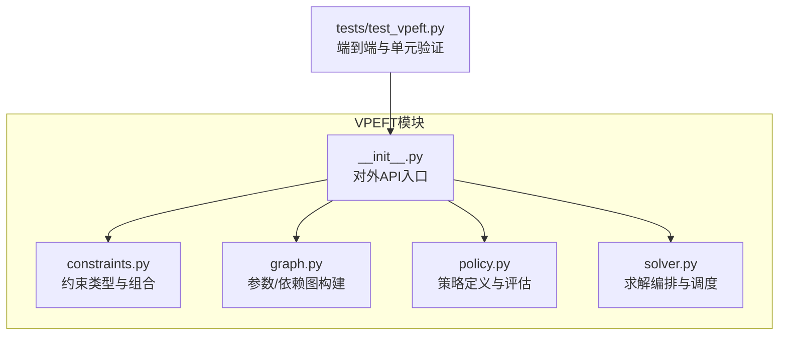
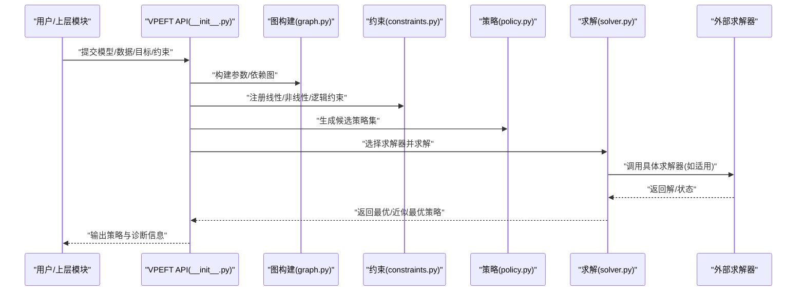
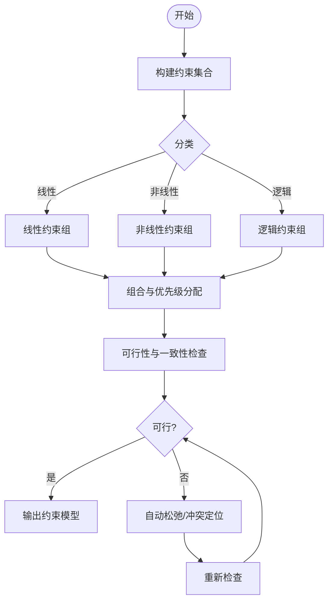
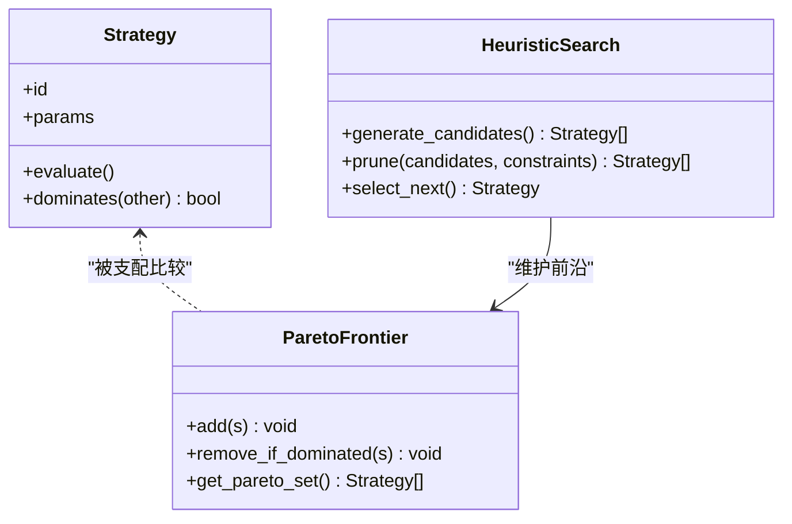
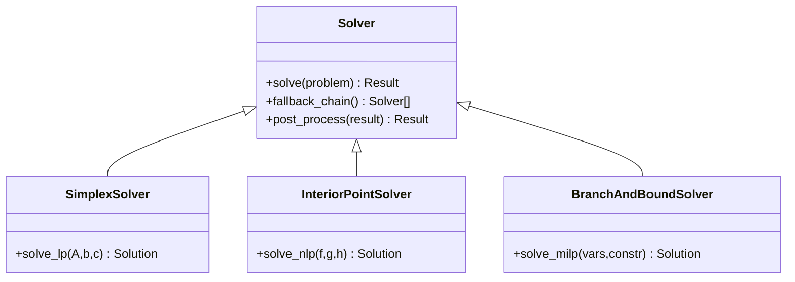
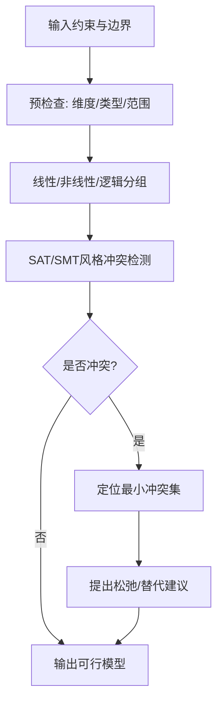
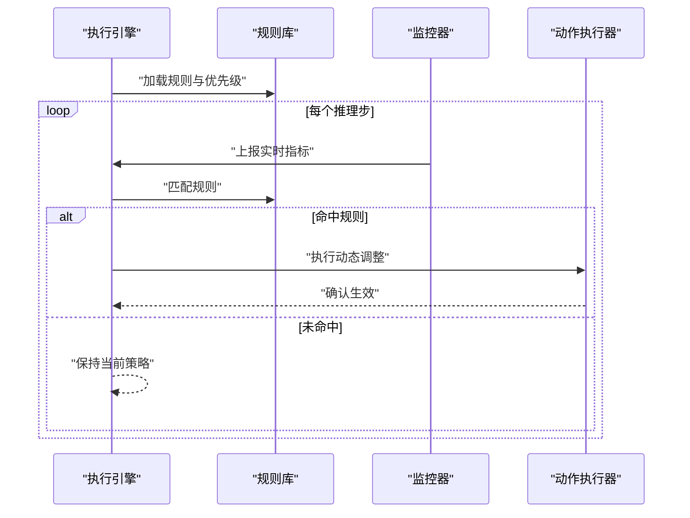
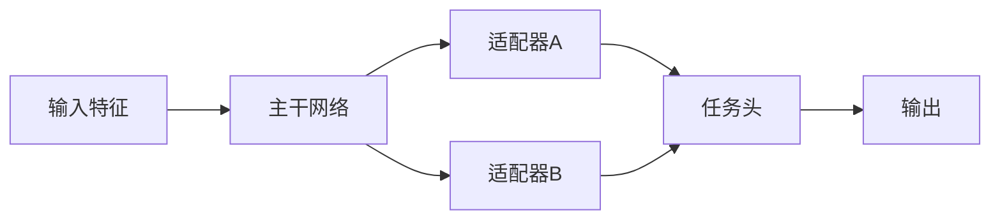
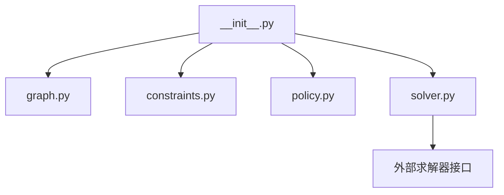

# VPEFT约束求解系统

<cite>
**本文引用的文件**
- [constraints.py](file://ultralytics/vpeft/constraints.py)
- [graph.py](file://ultralytics/vpeft/graph.py)
- [policy.py](file://ultralytics/vpeft/policy.py)
- [solver.py](file://ultralytics/vpeft/solver.py)
- [__init__.py](file://ultralytics/vpeft/__init__.py)
- [test_vpeft.py](file://tests/test_vpeft.py)
</cite>

## 目录
1. [简介](#简介)
2. [项目结构](#项目结构)
3. [核心组件](#核心组件)
4. [架构总览](#架构总览)
5. [详细组件分析](#详细组件分析)
6. [依赖关系分析](#依赖关系分析)
7. [性能考虑](#性能考虑)
8. [故障排查指南](#故障排查指南)
9. [结论](#结论)
10. [附录](#附录)

## 简介
本技术文档面向YOLO-Master的VPEFT（Vision PEFT）约束求解子系统，聚焦以下目标：
- 约束类型系统：线性、非线性与逻辑约束的定义与组合方式
- 策略生成算法：多目标优化、帕累托前沿搜索与启发式决策
- 求解器实现：单纯形法、内点法与分支定界的应用场景与集成点
- 约束验证机制：可行性检查、边界验证与冲突检测
- 策略执行引擎：规则匹配、条件判断与动态调整
- 建模最佳实践与设计模式
- 求解性能优化技巧与调试工具使用指南
- 外部求解器集成与扩展接口

## 项目结构
VPEFT模块位于ultralytics/vpeft下，包含约束建模、图表示、策略定义与求解编排等核心能力。测试用例位于tests/test_vpeft.py，用于覆盖关键路径与回归验证。

图表来源
- [constraints.py](file://ultralytics/vpeft/constraints.py)
- [graph.py](file://ultralytics/vpeft/graph.py)
- [policy.py](file://ultralytics/vpeft/policy.py)
- [solver.py](file://ultralytics/vpeft/solver.py)
- [__init__.py](file://ultralytics/vpeft/__init__.py)
- [test_vpeft.py](file://tests/test_vpeft.py)

章节来源
- [constraints.py](file://ultralytics/vpeft/constraints.py)
- [graph.py](file://ultralytics/vpeft/graph.py)
- [policy.py](file://ultralytics/vpeft/policy.py)
- [solver.py](file://ultralytics/vpeft/solver.py)
- [__init__.py](file://ultralytics/vpeft/__init__.py)
- [test_vpeft.py](file://tests/test_vpeft.py)

## 核心组件
- 约束建模层（constraints.py）
  - 提供线性、非线性与逻辑约束的抽象与组合算子，支持标量与向量形式，便于在PEFT超参空间中进行表达。
- 图表示层（graph.py）
  - 将模型参数、适配器与任务指标映射为有向图，显式刻画依赖关系与传播路径，支撑约束解析与影响分析。
- 策略定义层（policy.py）
  - 描述候选策略的结构、评估函数与偏好排序，支持多目标权衡与启发式选择。
- 求解编排层（solver.py）
  - 统一封装不同求解器（单纯形、内点、分支定界），负责问题构造、求解调用、结果后处理与回退策略。
- 对外API（__init__.py）
  - 暴露高层接口，屏蔽内部细节，提供“建模-求解-执行”的一体化流程。

章节来源
- [constraints.py](file://ultralytics/vpeft/constraints.py)
- [graph.py](file://ultralytics/vpeft/graph.py)
- [policy.py](file://ultralytics/vpeft/policy.py)
- [solver.py](file://ultralytics/vpeft/solver.py)
- [__init__.py](file://ultralytics/vpeft/__init__.py)

## 架构总览
VPEFT采用分层架构：上层通过统一API接收建模输入，中间层进行约束解析与策略生成，底层由多种求解器协同完成优化。

图表来源
- [__init__.py](file://ultralytics/vpeft/__init__.py)
- [graph.py](file://ultralytics/vpeft/graph.py)
- [constraints.py](file://ultralytics/vpeft/constraints.py)
- [policy.py](file://ultralytics/vpeft/policy.py)
- [solver.py](file://ultralytics/vpeft/solver.py)

## 详细组件分析

### 约束类型系统与组合
- 线性约束
  - 以系数矩阵与右端项表达，适用于权重缩放、预算上限、资源配额等可加性限制。
- 非线性约束
  - 涵盖凸/非凸非线性关系，如精度-延迟的非线性折中、稀疏度与性能的幂律关系等。
- 逻辑约束
  - 基于布尔表达式与条件组合，表达互斥、蕴含、若则等规则，例如“启用某适配器则必须满足某阈值”。
- 组合与优先级
  - 支持AND/OR/NOT组合，允许为不同约束赋予优先级或软/硬标记，便于在不可行时进行松弛与回退。

图表来源
- [constraints.py](file://ultralytics/vpeft/constraints.py)

章节来源
- [constraints.py](file://ultralytics/vpeft/constraints.py)

### 策略生成算法
- 多目标优化
  - 同时优化精度、延迟、内存、能耗等多目标，通过加权或Pareto支配关系进行排序。
- 帕累托前沿搜索
  - 维护非支配解集，迭代更新前沿；结合采样与局部搜索提升覆盖率。
- 启发式决策
  - 在大规模搜索空间中引入启发式剪枝、早停与分治策略，平衡质量与时间。

图表来源
- [policy.py](file://ultralytics/vpeft/policy.py)

章节来源
- [policy.py](file://ultralytics/vpeft/policy.py)

### 求解器实现与集成
- 单纯形法
  - 适用于线性规划型子问题，快速找到顶点解；适合预算/配额类线性约束。
- 内点法
  - 对连续可微目标与约束收敛稳定，适合含非线性平滑约束的场景。
- 分支定界
  - 针对离散/混合整数变量，通过上下界剪枝加速搜索；常用于适配器选择、路由开关等离散决策。
- 求解编排
  - solver.py负责问题构造、求解器选择、失败回退与结果标准化。

图表来源
- [solver.py](file://ultralytics/vpeft/solver.py)

章节来源
- [solver.py](file://ultralytics/vpeft/solver.py)

### 约束验证机制
- 可行性检查
  - 在求解前对约束系统进行一致性校验，识别不可行子集。
- 边界验证
  - 确保变量取值范围、梯度范数、激活值范围等在安全区间内。
- 冲突检测
  - 当出现矛盾约束时，定位最小冲突集并提供建议的松弛方案。

图表来源
- [constraints.py](file://ultralytics/vpeft/constraints.py)

章节来源
- [constraints.py](file://ultralytics/vpeft/constraints.py)

### 策略执行引擎
- 规则匹配
  - 将策略转换为可执行规则表，按优先级顺序匹配当前上下文。
- 条件判断
  - 依据运行时指标（延迟、内存、精度）动态触发切换。
- 动态调整
  - 在线微调权重缩放、专家路由比例、LoRA秩等，保持稳定性与鲁棒性。

图表来源
- [policy.py](file://ultralytics/vpeft/policy.py)

章节来源
- [policy.py](file://ultralytics/vpeft/policy.py)

### 图表示与依赖传播
- 节点与边
  - 节点表示参数块、适配器、任务头；边表示依赖与数据流。
- 影响分析
  - 基于拓扑序计算变更影响范围，指导约束作用域与求解粒度。
- 可视化与诊断
  - 导出图结构供离线分析与调试。

图表来源
- [graph.py](file://ultralytics/vpeft/graph.py)

章节来源
- [graph.py](file://ultralytics/vpeft/graph.py)

## 依赖关系分析
- 模块耦合
  - __init__.py作为门面，聚合graph/constraints/policy/solver，降低上层耦合。
  - solver.py可能依赖外部求解库（如线性/非线性/混合整数求解器），通过适配层隔离差异。
- 潜在循环
  - 各模块单向依赖，避免循环导入；如需双向交互，应通过回调或事件总线解耦。
- 外部依赖
  - 外部求解器通过统一接口接入，便于替换与扩展。

图表来源
- [__init__.py](file://ultralytics/vpeft/__init__.py)
- [solver.py](file://ultralytics/vpeft/solver.py)

章节来源
- [__init__.py](file://ultralytics/vpeft/__init__.py)
- [solver.py](file://ultralytics/vpeft/solver.py)

## 性能考虑
- 问题规模控制
  - 对大规模图进行分层与分区，减少单次求解规模。
- 求解器选择
  - 根据约束类型与变量性质自动选择合适求解器，必要时并行尝试多个求解器并择优。
- 缓存与复用
  - 缓存已求解的子问题与前沿点，避免重复计算。
- 数值稳定性
  - 对非线性约束进行正则化与缩放，防止病态条件数导致收敛困难。
- 早停与增量更新
  - 在迭代过程中设置质量阈值与时间预算，达到目标即提前终止。

[本节为通用性能建议，不直接分析具体文件]

## 故障排查指南
- 常见问题
  - 不可行：检查约束冲突与边界设置，查看最小冲突集与松弛建议。
  - 发散/NaN：检查数值缩放、学习率与正则项，必要时切换到更稳健的内点法。
  - 超时：缩小问题规模、增加早停阈值或改用更快的线性求解器。
- 诊断工具
  - 利用图导出与日志记录，定位瓶颈与异常路径。
  - 运行单元测试与端到端用例，复现并对比历史行为。

章节来源
- [test_vpeft.py](file://tests/test_vpeft.py)

## 结论
VPEFT约束求解系统将“建模-求解-执行”闭环整合，通过清晰的约束类型体系、灵活的策略生成与多求解器编排，兼顾了准确性、效率与可扩展性。配合完善的验证机制与调试手段，可在复杂PEFT场景中稳定产出高质量策略。

[本节为总结性内容，不直接分析具体文件]

## 附录
- 建模最佳实践
  - 优先使用线性约束表达可加性限制，仅在必要时引入非线性。
  - 将业务规则转化为逻辑约束，明确优先级与软/硬属性。
  - 在图中显式标注关键依赖，有助于约束作用域与影响分析。
- 设计模式
  - 门面模式：__init__.py对外提供统一入口。
  - 策略模式：不同求解器实现统一接口，便于替换。
  - 观察者模式：执行引擎订阅监控指标，驱动动态调整。
- 扩展接口
  - 新增约束类型：在constraints.py中扩展抽象基类与解析器。
  - 新增求解器：在solver.py中实现统一接口并注册到编排器。
  - 新增策略评估：在policy.py中扩展评估函数与排序规则。

[本节为通用指导，不直接分析具体文件]