# 适配器I/O系统

<cite>
**本文引用的文件**
- [ultralytics/utils/checkpoint_compat.py](file://ultralytics/utils/checkpoint_compat.py)
- [ultralytics/utils/lora/__init__.py](file://ultralytics/utils/lora/__init__.py)
- [ultralytics/utils/lora/adapter_io.py](file://ultralytics/utils/lora/adapter_io.py)
- [ultralytics/utils/lora/adapter_schema.py](file://ultralytics/utils/lora/adapter_schema.py)
- [ultralytics/utils/lora/adapter_registry.py](file://ultralytics/utils/lora/adapter_registry.py)
- [ultralytics/utils/lora/adapter_config.py](file://ultralytics/utils/lora/adapter_config.py)
- [ultralytics/utils/lora/adapter_batch.py](file://ultralytics/utils/lora/adapter_batch.py)
- [ultralytics/utils/lora/adapter_packager.py](file://ultralytics/utils/lora/adapter_packager.py)
- [tests/test_adapter_backend_contract.py](file://tests/test_adapter_backend_contract.py)
- [tests/test_peft_adapters.py](file://tests/test_peft_adapters.py)
- [tests/test_checkpoint_compat.py](file://tests/test_checkpoint_compat.py)
</cite>

## 目录
1. [简介](#简介)
2. [项目结构](#项目结构)
3. [核心组件](#核心组件)
4. [架构总览](#架构总览)
5. [详细组件分析](#详细组件分析)
6. [依赖关系分析](#依赖关系分析)
7. [性能考虑](#性能考虑)
8. [故障排查指南](#故障排查指南)
9. [结论](#结论)
10. [附录](#附录)

## 简介
本文件面向YOLO-Master的“适配器I/O系统”，系统性阐述适配器的文件格式设计（二进制权重、JSON配置与元数据管理）、版本兼容机制（向后兼容、向前迁移、格式升级策略）、配置管理系统（默认配置、用户覆盖、环境变量支持）、检查点兼容性工具（权重验证、结构检查、自动修复）、批量操作接口（并行加载、增量更新、状态同步）、打包与分发最佳实践、错误处理与恢复机制，以及与不同框架的互操作性设计与转换工具。文档以代码级实现为依据，辅以可视化图示，帮助读者快速理解并正确使用该子系统。

## 项目结构
适配器I/O系统主要位于utils/lora子模块中，围绕“Schema定义—IO读写—注册表—配置解析—批处理—打包”形成清晰分层：
- Schema与协议：统一描述适配器结构与字段约束
- IO层：负责二进制权重与JSON配置的读写、校验与迁移
- 注册表：按类型/任务/后端动态发现与实例化适配器
- 配置系统：合并默认配置、用户覆盖与环境变量
- 批处理：提供并发加载、增量更新与状态同步
- 打包：将多文件适配器封装为可分发的包

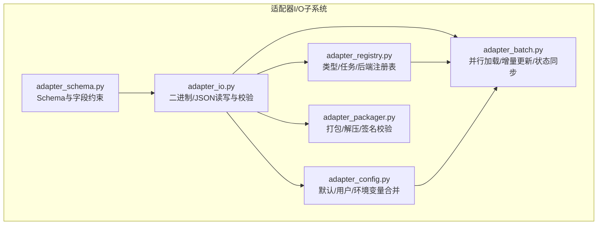

图表来源
- [ultralytics/utils/lora/adapter_schema.py](file://ultralytics/utils/lora/adapter_schema.py)
- [ultralytics/utils/lora/adapter_io.py](file://ultralytics/utils/lora/adapter_io.py)
- [ultralytics/utils/lora/adapter_registry.py](file://ultralytics/utils/lora/adapter_registry.py)
- [ultralytics/utils/lora/adapter_config.py](file://ultralytics/utils/lora/adapter_config.py)
- [ultralytics/utils/lora/adapter_batch.py](file://ultralytics/utils/lora/adapter_batch.py)
- [ultralytics/utils/lora/adapter_packager.py](file://ultralytics/utils/lora/adapter_packager.py)

章节来源
- [ultralytics/utils/lora/adapter_schema.py](file://ultralytics/utils/lora/adapter_schema.py)
- [ultralytics/utils/lora/adapter_io.py](file://ultralytics/utils/lora/adapter_io.py)
- [ultralytics/utils/lora/adapter_registry.py](file://ultralytics/utils/lora/adapter_registry.py)
- [ultralytics/utils/lora/adapter_config.py](file://ultralytics/utils/lora/adapter_config.py)
- [ultralytics/utils/lora/adapter_batch.py](file://ultralytics/utils/lora/adapter_batch.py)
- [ultralytics/utils/lora/adapter_packager.py](file://ultralytics/utils/lora/adapter_packager.py)

## 核心组件
- 适配器Schema与元数据：定义适配器版本、任务类型、后端、参数与权重映射等元信息，作为所有IO操作的契约基础。
- 二进制权重与JSON配置：权重采用紧凑的二进制布局，配置使用JSON；两者通过元数据建立强关联，确保一致性。
- 注册表与工厂：根据任务/后端/类型选择具体适配器实现，避免硬编码分支。
- 配置合并器：从默认配置、用户覆盖、环境变量三源合并，保证可复现性与灵活性。
- 批处理引擎：支持并发加载、增量更新与状态同步，提升吞吐与稳定性。
- 打包器：将多文件适配器打包为单一包，便于分发与部署。

章节来源
- [ultralytics/utils/lora/adapter_schema.py](file://ultralytics/utils/lora/adapter_schema.py)
- [ultralytics/utils/lora/adapter_io.py](file://ultralytics/utils/lora/adapter_io.py)
- [ultralytics/utils/lora/adapter_registry.py](file://ultralytics/utils/lora/adapter_registry.py)
- [ultralytics/utils/lora/adapter_config.py](file://ultralytics/utils/lora/adapter_config.py)
- [ultralytics/utils/lora/adapter_batch.py](file://ultralytics/utils/lora/adapter_batch.py)
- [ultralytics/utils/lora/adapter_packager.py](file://ultralytics/utils/lora/adapter_packager.py)

## 架构总览
下图展示了从“加载请求”到“模型注入”的端到端流程，包括Schema校验、配置合并、权重读取、注册表解析与批处理协调。

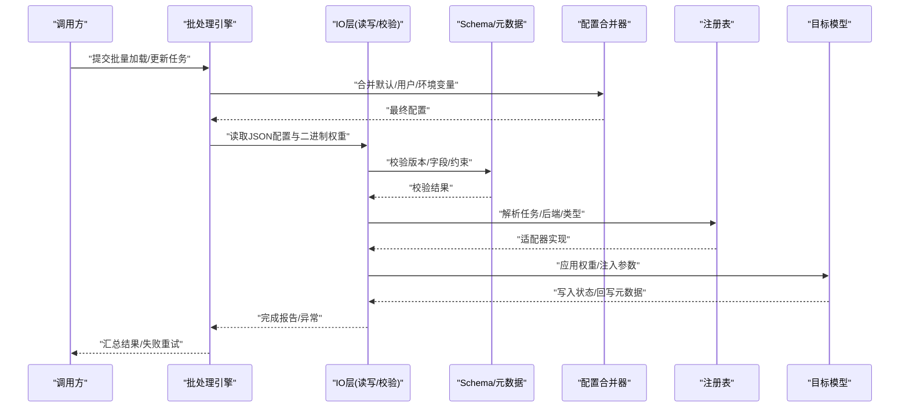

图表来源
- [ultralytics/utils/lora/adapter_io.py](file://ultralytics/utils/lora/adapter_io.py)
- [ultralytics/utils/lora/adapter_schema.py](file://ultralytics/utils/lora/adapter_schema.py)
- [ultralytics/utils/lora/adapter_config.py](file://ultralytics/utils/lora/adapter_config.py)
- [ultralytics/utils/lora/adapter_registry.py](file://ultralytics/utils/lora/adapter_registry.py)
- [ultralytics/utils/lora/adapter_batch.py](file://ultralytics/utils/lora/adapter_batch.py)

## 详细组件分析

### 组件A：Schema与元数据管理
- 职责
  - 定义适配器版本、任务类型、后端、参数、权重映射、哈希指纹等元数据
  - 提供字段校验与约束规则，确保后续IO与迁移的一致性
- 关键设计
  - 版本字段驱动兼容判断
  - 任务/后端枚举用于注册表路由
  - 权重映射表描述张量名与形状/数据类型约束
- 复杂度
  - 校验时间复杂度与字段数量线性相关
  - 空间复杂度与元数据规模线性相关

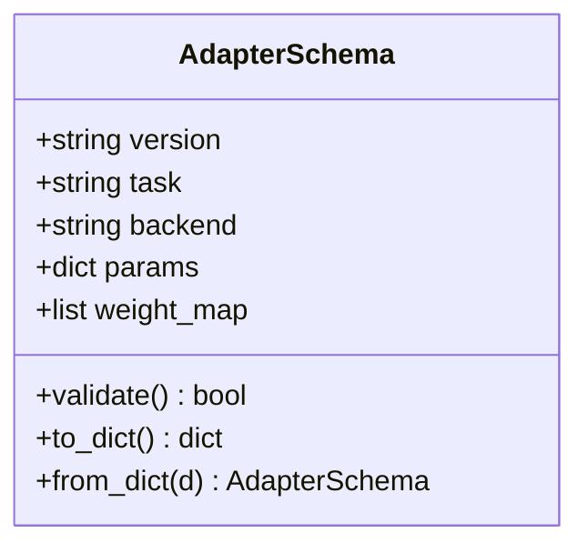

图表来源
- [ultralytics/utils/lora/adapter_schema.py](file://ultralytics/utils/lora/adapter_schema.py)

章节来源
- [ultralytics/utils/lora/adapter_schema.py](file://ultralytics/utils/lora/adapter_schema.py)

### 组件B：二进制权重与JSON配置读写
- 职责
  - 读取/写入JSON配置与二进制权重
  - 计算并校验权重哈希，保障完整性
  - 执行版本检测与必要的数据迁移
- 关键流程
  - 打开压缩包或目录，定位配置文件与权重文件
  - 解析JSON，构建Schema对象
  - 按权重映射顺序读取二进制块，校验长度与dtype
  - 可选：对旧版权重进行就地或副本式迁移
- 错误处理
  - 文件缺失/损坏、哈希不匹配、dtype/shape不一致时抛出明确异常
  - 记录上下文路径与偏移，便于定位

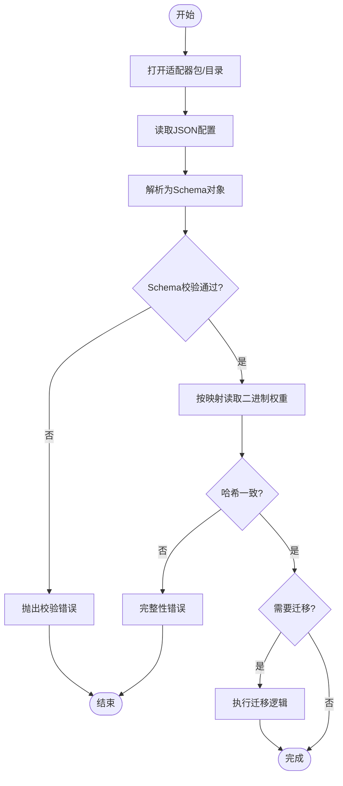

图表来源
- [ultralytics/utils/lora/adapter_io.py](file://ultralytics/utils/lora/adapter_io.py)
- [ultralytics/utils/lora/adapter_schema.py](file://ultralytics/utils/lora/adapter_schema.py)

章节来源
- [ultralytics/utils/lora/adapter_io.py](file://ultralytics/utils/lora/adapter_io.py)

### 组件C：注册表与工厂
- 职责
  - 维护适配器类型/任务/后端的注册表
  - 根据配置中的元数据选择具体实现类
  - 提供按需导入与懒加载能力
- 设计要点
  - 注册装饰器/函数式API，避免循环导入
  - 支持扩展点，第三方可通过插件方式接入

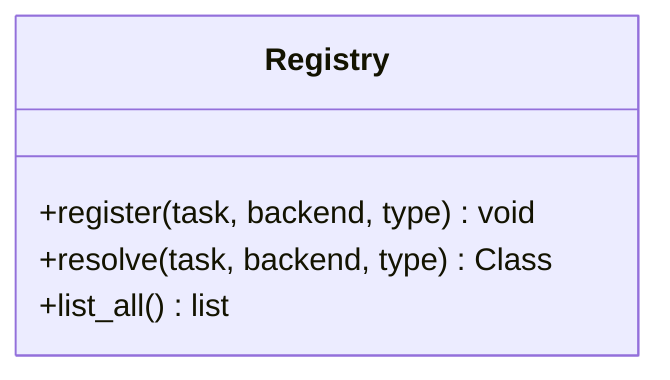

图表来源
- [ultralytics/utils/lora/adapter_registry.py](file://ultralytics/utils/lora/adapter_registry.py)

章节来源
- [ultralytics/utils/lora/adapter_registry.py](file://ultralytics/utils/lora/adapter_registry.py)

### 组件D：配置管理系统
- 职责
  - 合并默认配置、用户覆盖与环境变量
  - 提供键路径访问与类型提示
  - 支持配置漂移检测与审计
- 合并优先级
  - 环境变量 > 用户覆盖 > 默认配置
- 典型用法
  - 在加载前解析配置，决定是否启用调试、日志级别、设备选择等

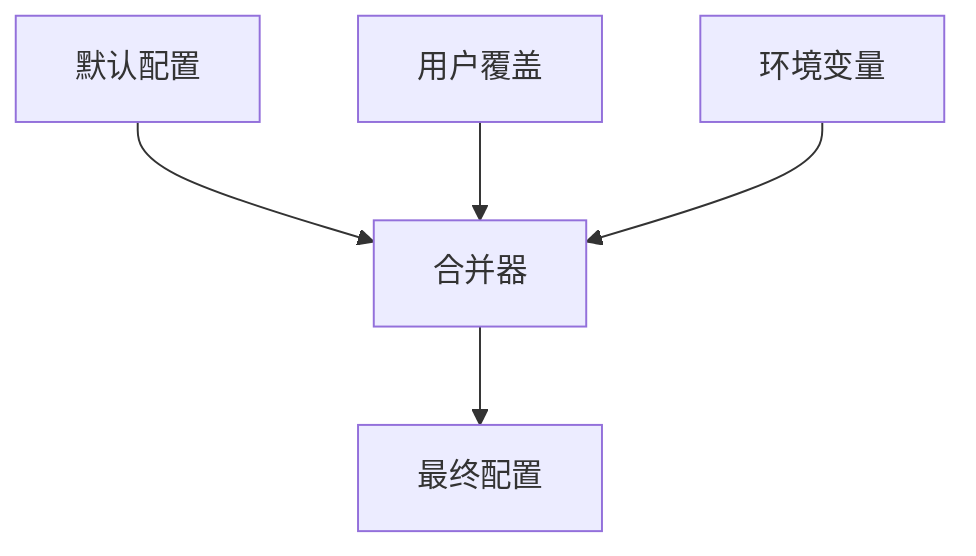

图表来源
- [ultralytics/utils/lora/adapter_config.py](file://ultralytics/utils/lora/adapter_config.py)

章节来源
- [ultralytics/utils/lora/adapter_config.py](file://ultralytics/utils/lora/adapter_config.py)

### 组件E：批处理接口（并行加载、增量更新、状态同步）
- 职责
  - 并发调度多个适配器的加载/更新任务
  - 支持增量更新（仅变更部分权重）
  - 维护任务状态机（待处理/进行中/成功/失败），支持重试与回滚
- 并发模型
  - 基于线程池/进程池的并发控制
  - I/O与CPU阶段分离，减少锁竞争
- 状态同步
  - 原子写入与事务性提交，失败自动回滚

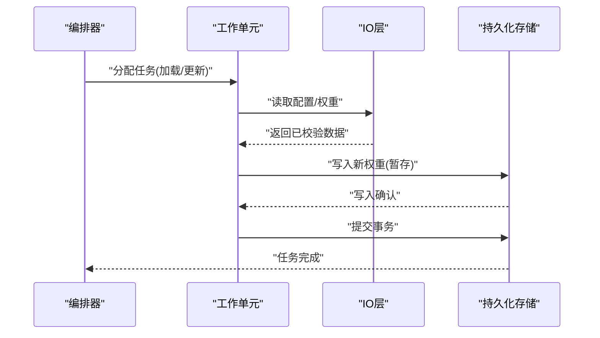

图表来源
- [ultralytics/utils/lora/adapter_batch.py](file://ultralytics/utils/lora/adapter_batch.py)
- [ultralytics/utils/lora/adapter_io.py](file://ultralytics/utils/lora/adapter_io.py)

章节来源
- [ultralytics/utils/lora/adapter_batch.py](file://ultralytics/utils/lora/adapter_batch.py)

### 组件F：打包与分发
- 职责
  - 将JSON配置与二进制权重打包为单一包
  - 生成包级摘要与签名，支持完整性校验
  - 提供解压与清单校验工具
- 最佳实践
  - 包内目录结构固定，便于第三方解析
  - 版本号与任务/后端信息置于包根元数据

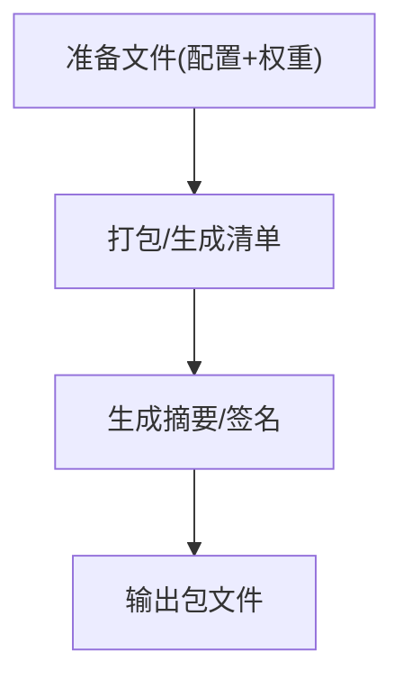

图表来源
- [ultralytics/utils/lora/adapter_packager.py](file://ultralytics/utils/lora/adapter_packager.py)

章节来源
- [ultralytics/utils/lora/adapter_packager.py](file://ultralytics/utils/lora/adapter_packager.py)

### 组件G：检查点兼容性工具
- 职责
  - 权重验证：对比新旧权重哈希，识别差异
  - 结构检查：校验张量名、形状、dtype与映射一致性
  - 自动修复：对已知不兼容项执行安全替换或补齐默认值
- 适用场景
  - 跨版本迁移、跨任务复用、跨后端导出后的校验

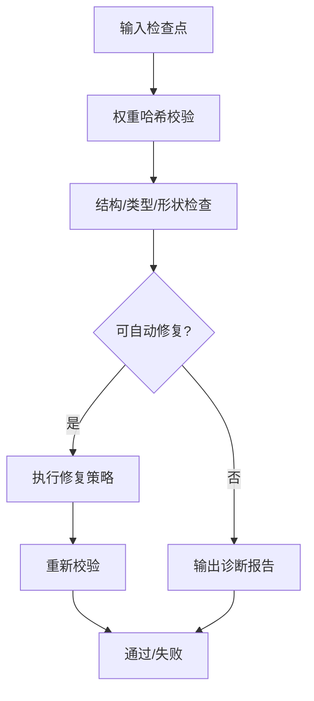

图表来源
- [ultralytics/utils/checkpoint_compat.py](file://ultralytics/utils/checkpoint_compat.py)

章节来源
- [ultralytics/utils/checkpoint_compat.py](file://ultralytics/utils/checkpoint_compat.py)

### 组件H：与不同框架的互操作性与转换工具
- 设计思路
  - 通过注册表抽象后端，屏蔽PyTorch/TensorFlow/JAX等差异
  - 提供转换器将适配器权重映射为目标框架张量格式
- 转换流程
  - 读取适配器权重 → 按映射重命名/重塑 → 序列化为目标格式
  - 保留元数据以便反向追溯

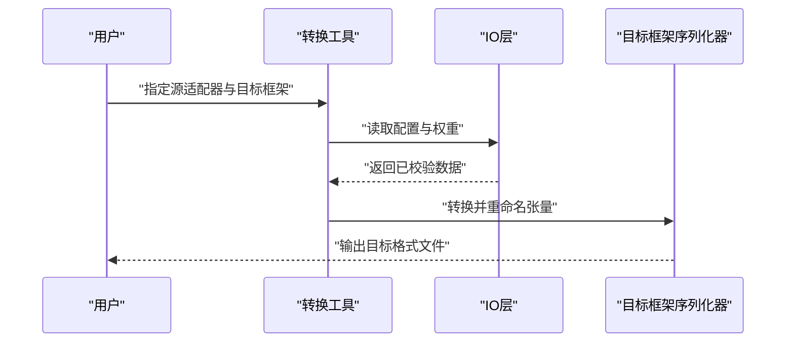

图表来源
- [ultralytics/utils/lora/adapter_io.py](file://ultralytics/utils/lora/adapter_io.py)
- [ultralytics/utils/lora/adapter_registry.py](file://ultralytics/utils/lora/adapter_registry.py)

章节来源
- [ultralytics/utils/lora/adapter_io.py](file://ultralytics/utils/lora/adapter_io.py)
- [ultralytics/utils/lora/adapter_registry.py](file://ultralytics/utils/lora/adapter_registry.py)

## 依赖关系分析
- 内部依赖
  - IO层依赖Schema与配置合并器
  - 批处理依赖IO层与注册表
  - 打包器依赖IO层与文件系统
- 外部依赖
  - 序列化库（JSON/二进制）
  - 哈希与签名库
  - 并发原语（线程/进程池）

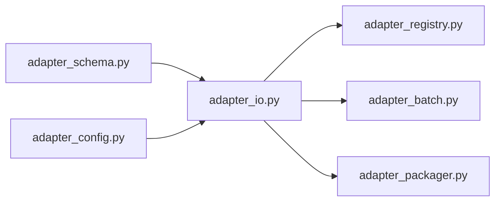

图表来源
- [ultralytics/utils/lora/adapter_schema.py](file://ultralytics/utils/lora/adapter_schema.py)
- [ultralytics/utils/lora/adapter_io.py](file://ultralytics/utils/lora/adapter_io.py)
- [ultralytics/utils/lora/adapter_config.py](file://ultralytics/utils/lora/adapter_config.py)
- [ultralytics/utils/lora/adapter_registry.py](file://ultralytics/utils/lora/adapter_registry.py)
- [ultralytics/utils/lora/adapter_batch.py](file://ultralytics/utils/lora/adapter_batch.py)
- [ultralytics/utils/lora/adapter_packager.py](file://ultralytics/utils/lora/adapter_packager.py)

章节来源
- [ultralytics/utils/lora/adapter_schema.py](file://ultralytics/utils/lora/adapter_schema.py)
- [ultralytics/utils/lora/adapter_io.py](file://ultralytics/utils/lora/adapter_io.py)
- [ultralytics/utils/lora/adapter_config.py](file://ultralytics/utils/lora/adapter_config.py)
- [ultralytics/utils/lora/adapter_registry.py](file://ultralytics/utils/lora/adapter_registry.py)
- [ultralytics/utils/lora/adapter_batch.py](file://ultralytics/utils/lora/adapter_batch.py)
- [ultralytics/utils/lora/adapter_packager.py](file://ultralytics/utils/lora/adapter_packager.py)

## 性能考虑
- I/O优化
  - 预取与流式读取，降低峰值内存占用
  - 批量写入时使用缓冲与异步落盘
- 并发控制
  - 合理设置并发度，避免磁盘/网络瓶颈
  - 任务粒度细化，提高吞吐
- 缓存策略
  - 对频繁使用的配置与Schema进行内存缓存
  - 对只读权重块使用内存映射
- 数值稳定
  - 严格dtype与形状校验，防止隐式广播导致的精度损失

[本节为通用指导，无需特定文件引用]

## 故障排查指南
- 常见问题
  - 版本不兼容：检查Schema版本字段与迁移策略
  - 哈希不匹配：核对包完整性与传输过程
  - dtype/形状不一致：对照权重映射表逐项排查
  - 并发冲突：检查事务提交与回滚路径
- 定位手段
  - 启用详细日志，记录文件路径、偏移与异常堆栈
  - 使用检查点兼容性工具输出诊断报告
  - 最小化复现：剥离无关任务/后端，聚焦问题范围

章节来源
- [tests/test_checkpoint_compat.py](file://tests/test_checkpoint_compat.py)
- [tests/test_adapter_backend_contract.py](file://tests/test_adapter_backend_contract.py)
- [tests/test_peft_adapters.py](file://tests/test_peft_adapters.py)

## 结论
适配器I/O系统通过清晰的Schema契约、稳健的IO与校验、灵活的配置合并、可扩展的注册表以及健壮的批处理与打包能力，实现了高可靠、高性能、易扩展的适配器生命周期管理。配合检查点兼容性工具与多框架互操作设计，可在复杂工程环境中稳定落地。

[本节为总结性内容，无需特定文件引用]

## 附录
- 术语
  - 适配器：针对特定任务/后端/类型的轻量权重与配置集合
  - 检查点：包含权重与元数据的持久化快照
  - 迁移：将旧版格式转换为新版格式的自动化过程
- 参考用例
  - 批量加载多个LoRA适配器并进行增量更新
  - 将PyTorch权重转换为ONNX/TensorRT所需格式
  - 在CI中运行检查点兼容性测试，阻断不兼容发布

[本节为补充说明，无需特定文件引用]