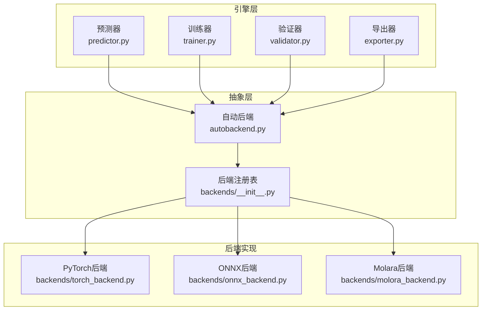
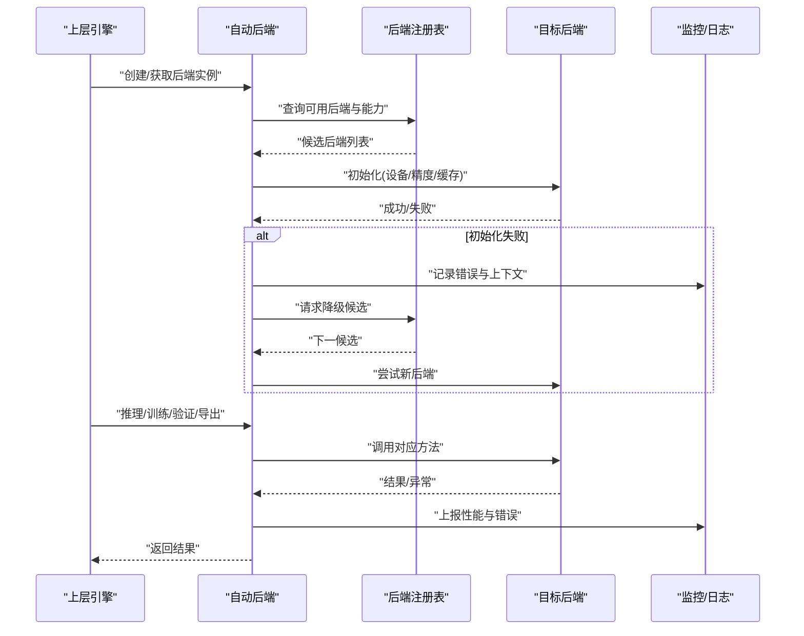
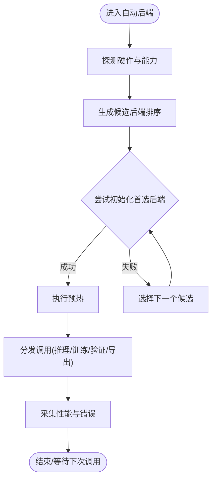
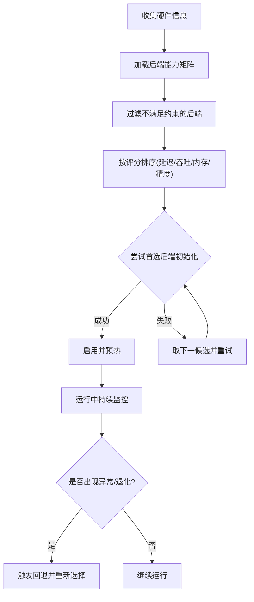
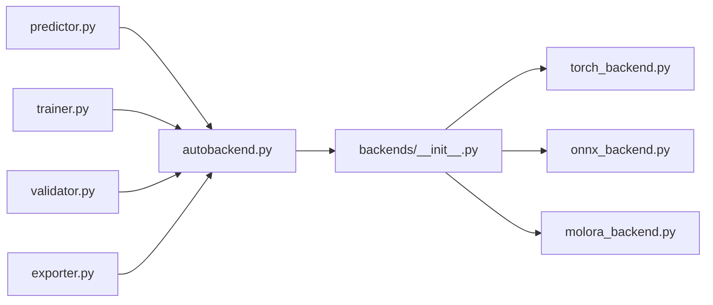

# 适配器后端抽象

<cite>
**本文引用的文件**
- [autobackend.py](file://ultralytics/nn/autobackend.py)
- [__init__.py](file://ultralytics/nn/backends/__init__.py)
- [torch_backend.py](file://ultralytics/nn/backends/torch_backend.py)
- [onnx_backend.py](file://ultralytics/nn/backends/onnx_backend.py)
- [molora_backend.py](file://ultralytics/nn/backends/molora_backend.py)
- [exporter.py](file://ultralytics/engine/exporter.py)
- [predictor.py](file://ultralytics/engine/predictor.py)
- [trainer.py](file://ultralytics/engine/trainer.py)
- [validator.py](file://ultralytics/engine/validator.py)
- [benchmark_molora_dispatch.py](file://benchmarks/benchmark_molora_dispatch.py)
- [test_autobackend_warmup.py](file://tests/test_autobackend_warmup.py)
- [test_model_adapter_facade.py](file://tests/test_model_adapter_facade.py)
- [test_molora_sparse_dispatch.py](file://tests/test_molora_sparse_dispatch.py)
- [test_molora_routing_aware_merge.py](file://tests/test_molora_routing_aware_merge.py)
</cite>

## 目录
1. [简介](#简介)
2. [项目结构](#项目结构)
3. [核心组件](#核心组件)
4. [架构总览](#架构总览)
5. [详细组件分析](#详细组件分析)
6. [依赖关系分析](#依赖关系分析)
7. [性能考量](#性能考量)
8. [故障排查指南](#故障排查指南)
9. [结论](#结论)
10. [附录](#附录)

## 简介
本文件面向YOLO-Master的“适配器后端抽象层”，系统性阐述其统一API、插件注册与生命周期管理，覆盖PyTorch原生、ONNX导出兼容与移动端优化等适配器的实现要点；深入解析回退机制（降级策略、性能监控、错误恢复）；专项文档化Molara后端的稀疏计算、内存优化与路由感知合并；说明后端选择算法（硬件检测、能力评估、动态切换）；提供自定义后端开发指南与模板；并给出基准测试方法与对比分析思路，以及推理引擎集成与部署优化建议。

## 项目结构
后端抽象位于nn模块下，采用“自动后端+多后端实现”的分层设计：
- 自动后端入口负责设备探测、能力评估、后端实例化与生命周期管理
- 各具体后端以插件形式注册到统一接口，对外暴露一致的推理/训练/导出契约
- 上层引擎（预测、训练、验证、导出）通过统一接口调用后端，屏蔽底层差异

图表来源
- [autobackend.py](file://ultralytics/nn/autobackend.py)
- [__init__.py](file://ultralytics/nn/backends/__init__.py)
- [torch_backend.py](file://ultralytics/nn/backends/torch_backend.py)
- [onnx_backend.py](file://ultralytics/nn/backends/onnx_backend.py)
- [molora_backend.py](file://ultralytics/nn/backends/molora_backend.py)
- [predictor.py](file://ultralytics/engine/predictor.py)
- [trainer.py](file://ultralytics/engine/trainer.py)
- [validator.py](file://ultralytics/engine/validator.py)
- [exporter.py](file://ultralytics/engine/exporter.py)

章节来源
- [autobackend.py](file://ultralytics/nn/autobackend.py)
- [__init__.py](file://ultralytics/nn/backends/__init__.py)
- [torch_backend.py](file://ultralytics/nn/backends/torch_backend.py)
- [onnx_backend.py](file://ultralytics/nn/backends/onnx_backend.py)
- [molora_backend.py](file://ultralytics/nn/backends/molora_backend.py)
- [predictor.py](file://ultralytics/engine/predictor.py)
- [trainer.py](file://ultralytics/engine/trainer.py)
- [validator.py](file://ultralytics/engine/validator.py)
- [exporter.py](file://ultralytics/engine/exporter.py)

## 核心组件
- 统一后端接口
  - 定义推理、训练、验证、导出所需的最小契约方法族，确保上层引擎无需关心具体后端差异
  - 约定输入输出张量格式、设备语义、精度与数据类型、批处理与流式处理边界条件
- 插件注册机制
  - 通过注册表集中管理后端实现，支持按名称或能力标签动态加载
  - 提供能力声明与兼容性矩阵，便于自动选择与回退
- 生命周期管理
  - 初始化、预热、运行、清理四个阶段，包含资源分配、缓存预热、异常捕获与状态复位
- 回退机制
  - 基于能力评估与运行时异常的降级路径，如从GPU到CPU、从加速后端到通用后端
  - 性能监控指标采集与错误恢复策略（重试、参数回退、模式切换）

章节来源
- [autobackend.py](file://ultralytics/nn/autobackend.py)
- [__init__.py](file://ultralytics/nn/backends/__init__.py)
- [test_autobackend_warmup.py](file://tests/test_autobackend_warmup.py)

## 架构总览
后端抽象层对上提供一致API，对下聚合多种执行环境。自动后端根据硬件与模型能力选择最优后端，并在失败时触发回退流程。

图表来源
- [autobackend.py](file://ultralytics/nn/autobackend.py)
- [__init__.py](file://ultralytics/nn/backends/__init__.py)
- [predictor.py](file://ultralytics/engine/predictor.py)
- [trainer.py](file://ultralytics/engine/trainer.py)
- [validator.py](file://ultralytics/engine/validator.py)
- [exporter.py](file://ultralytics/engine/exporter.py)

## 详细组件分析

### 自动后端与统一API
- 职责
  - 设备探测与能力评估：识别GPU/CPU、加速器可用性、内存容量、精度支持
  - 后端选择：依据能力评分与约束（如显存阈值、延迟预算）挑选最佳后端
  - 生命周期编排：初始化→预热→运行→清理，贯穿异常与回退
  - 监控与诊断：采集耗时、吞吐、内存峰值、错误码与堆栈摘要
- 关键流程
  - 启动阶段：扫描注册表，构建候选集；按优先级排序
  - 运行阶段：分发调用至选定后端；捕获异常并触发回退
  - 关闭阶段：释放资源、清空缓存、重置统计

图表来源
- [autobackend.py](file://ultralytics/nn/autobackend.py)
- [__init__.py](file://ultralytics/nn/backends/__init__.py)

章节来源
- [autobackend.py](file://ultralytics/nn/autobackend.py)
- [test_autobackend_warmup.py](file://tests/test_autobackend_warmup.py)

### PyTorch原生后端
- 特点
  - 直接利用PyTorch执行图与算子生态，支持动态形状、混合精度、分布式
  - 作为默认与兜底后端，保证功能完整性
- 关注点
  - 内存管理与梯度追踪
  - 与训练/验证/导出流程的无缝衔接
  - 性能调优：算子融合、编译选项、数据管道

章节来源
- [torch_backend.py](file://ultralytics/nn/backends/torch_backend.py)
- [trainer.py](file://ultralytics/engine/trainer.py)
- [validator.py](file://ultralytics/engine/validator.py)
- [exporter.py](file://ultralytics/engine/exporter.py)

### ONNX导出兼容后端
- 特点
  - 针对ONNXRuntime或兼容推理引擎进行优化，静态图、低开销序列化
  - 支持INT8/FP16量化与算子子图优化
- 关注点
  - 导出前检查与能力矩阵校验
  - 运行时IO绑定、内存池与线程并行
  - 与自动后端的互操作：导出成功后优先使用ONNX后端

章节来源
- [onnx_backend.py](file://ultralytics/nn/backends/onnx_backend.py)
- [exporter.py](file://ultralytics/engine/exporter.py)

### Molara后端（稀疏计算、内存优化、路由感知合并）
- 特性
  - 稀疏调度：仅激活必要专家/分支，降低计算与访存
  - 内存优化：分块、复用缓冲区、按需加载专家权重
  - 路由感知合并：在合并/导出阶段考虑路由分布，避免冗余计算
- 适用场景
  - 大规模MoE/MoA模型、边缘端受限设备、高并发推理
- 注意事项
  - 路由校准与稳定性
  - 稀疏度阈值与精度权衡
  - 与训练阶段的稀疏一致性

章节来源
- [molora_backend.py](file://ultralytics/nn/backends/molora_backend.py)
- [test_molora_sparse_dispatch.py](file://tests/test_molora_sparse_dispatch.py)
- [test_molora_routing_aware_merge.py](file://tests/test_molora_routing_aware_merge.py)

### 后端选择算法（硬件检测、能力评估、动态切换）
- 硬件检测
  - GPU/CPU/加速器枚举、驱动版本、显存/内存容量、算力特征
- 能力评估
  - 后端能力标签（精度、稀疏、量化、导出支持）、延迟/吞吐预估、内存占用上限
- 动态切换
  - 运行时异常触发回退；周期性健康检查；热插拔新后端
- 决策流程
  - 过滤不可用后端 → 评分排序 → 尝试初始化 → 失败回退 → 稳定运行

图表来源
- [autobackend.py](file://ultralytics/nn/autobackend.py)
- [__init__.py](file://ultralytics/nn/backends/__init__.py)

章节来源
- [autobackend.py](file://ultralytics/nn/autobackend.py)
- [__init__.py](file://ultralytics/nn/backends/__init__.py)

### 回退机制（降级策略、性能监控、错误恢复）
- 降级策略
  - 精度降级（FP16→FP32）、稀疏关闭、批量大小下调、禁用某些优化
- 性能监控
  - 端到端延迟、吞吐、内存峰值、算子热点、错误率
- 错误恢复
  - 自动重试、参数回退、会话重建、日志与诊断快照

章节来源
- [autobackend.py](file://ultralytics/nn/autobackend.py)
- [test_autobackend_warmup.py](file://tests/test_autobackend_warmup.py)

### 与推理引擎的集成与部署优化
- 集成方式
  - 通过统一API对接ONNXRuntime、TensorRT、OpenVINO等引擎
  - 导出阶段生成可移植模型，运行时由后端自动选择最优引擎
- 部署优化
  - 模型量化与剪枝、算子融合、批内并行、I/O流水线
  - 容器化与镜像裁剪、依赖最小化、安全加固

章节来源
- [exporter.py](file://ultralytics/engine/exporter.py)
- [onnx_backend.py](file://ultralytics/nn/backends/onnx_backend.py)

## 依赖关系分析
- 耦合与内聚
  - 自动后端与注册表松耦合，新增后端只需实现接口并注册
  - 上层引擎仅依赖统一API，不感知后端细节
- 外部依赖
  - PyTorch生态、ONNX及推理引擎、系统硬件驱动
- 潜在循环依赖
  - 通过接口解耦避免循环；注册表为单向依赖

图表来源
- [predictor.py](file://ultralytics/engine/predictor.py)
- [trainer.py](file://ultralytics/engine/trainer.py)
- [validator.py](file://ultralytics/engine/validator.py)
- [exporter.py](file://ultralytics/engine/exporter.py)
- [autobackend.py](file://ultralytics/nn/autobackend.py)
- [__init__.py](file://ultralytics/nn/backends/__init__.py)
- [torch_backend.py](file://ultralytics/nn/backends/torch_backend.py)
- [onnx_backend.py](file://ultralytics/nn/backends/onnx_backend.py)
- [molora_backend.py](file://ultralytics/nn/backends/molora_backend.py)

章节来源
- [predictor.py](file://ultralytics/engine/predictor.py)
- [trainer.py](file://ultralytics/engine/trainer.py)
- [validator.py](file://ultralytics/engine/validator.py)
- [exporter.py](file://ultralytics/engine/exporter.py)
- [autobackend.py](file://ultralytics/nn/autobackend.py)
- [__init__.py](file://ultralytics/nn/backends/__init__.py)
- [torch_backend.py](file://ultralytics/nn/backends/torch_backend.py)
- [onnx_backend.py](file://ultralytics/nn/backends/onnx_backend.py)
- [molora_backend.py](file://ultralytics/nn/backends/molora_backend.py)

## 性能考量
- 基准套件
  - 使用专用基准脚本对不同后端进行延迟/吞吐/内存/能耗测量
  - 覆盖不同输入尺寸、批次、稀疏度与量化配置
- 对比维度
  - 精度损失、稳定性、可扩展性、部署成本
- 优化建议
  - 合理设置稀疏阈值与路由策略
  - 结合硬件特性选择后端与精度
  - 预热与缓存命中优化

章节来源
- [benchmark_molora_dispatch.py](file://benchmarks/benchmark_molora_dispatch.py)

## 故障排查指南
- 常见问题
  - 后端初始化失败：检查驱动、依赖库、显存不足
  - 导出失败：核对导出能力矩阵与算子支持
  - 性能退化：定位热点算子、调整批大小与精度
- 诊断工具
  - 自动后端预热测试、模型适配器门面测试、Molara稀疏与路由合并测试
- 步骤建议
  - 启用详细日志与监控指标
  - 逐步缩小问题范围（单算子/小模型/低分辨率）
  - 回退到PyTorch后端验证是否为特定后端问题

章节来源
- [test_autobackend_warmup.py](file://tests/test_autobackend_warmup.py)
- [test_model_adapter_facade.py](file://tests/test_model_adapter_facade.py)
- [test_molora_sparse_dispatch.py](file://tests/test_molora_sparse_dispatch.py)
- [test_molora_routing_aware_merge.py](file://tests/test_molora_routing_aware_merge.py)

## 结论
该抽象层通过统一API与插件注册机制，将多后端实现解耦于上层引擎，配合自动选择与回退策略，显著提升跨平台与跨设备的鲁棒性与可维护性。Molara后端在稀疏计算与内存优化方面提供了显著收益，适合复杂模型与受限环境。完善的监控与诊断能力有助于快速定位问题与持续优化性能。

## 附录

### 自定义后端开发指南与模板
- 实现要求
  - 遵循统一接口契约（推理/训练/验证/导出）
  - 声明能力标签与兼容性信息
  - 实现生命周期钩子（初始化、预热、清理）
- 注册流程
  - 在注册表中登记后端名称与能力
  - 提供可选的工厂函数用于实例化
- 测试建议
  - 编写端到端用例，覆盖正常路径与异常回退
  - 加入基准套件，评估性能与稳定性

章节来源
- [__init__.py](file://ultralytics/nn/backends/__init__.py)
- [autobackend.py](file://ultralytics/nn/autobackend.py)