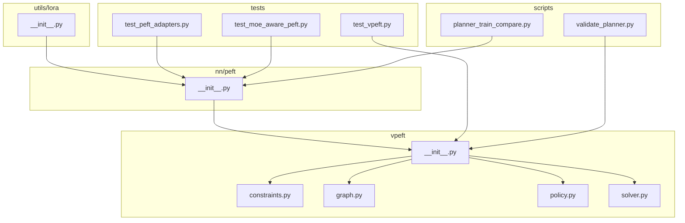
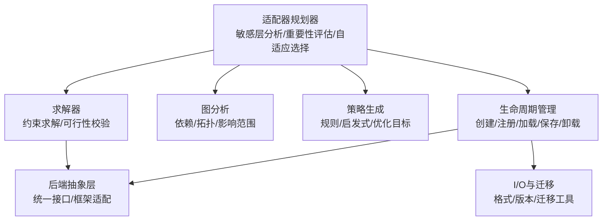
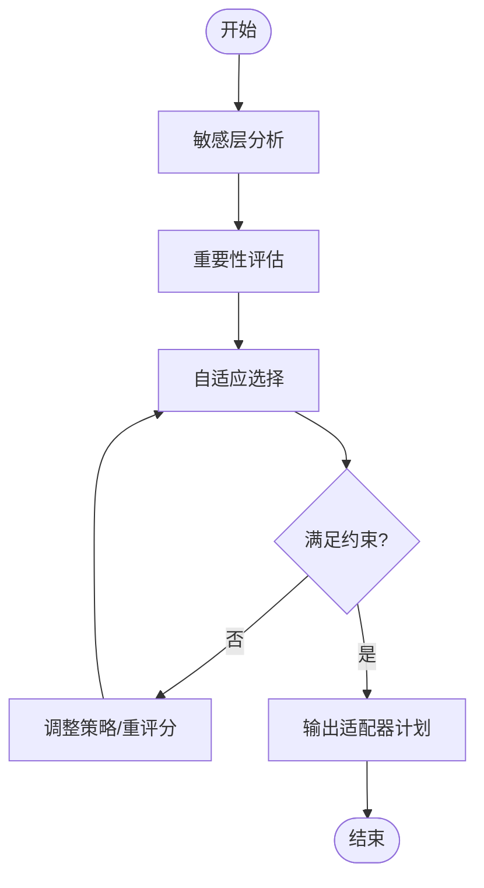
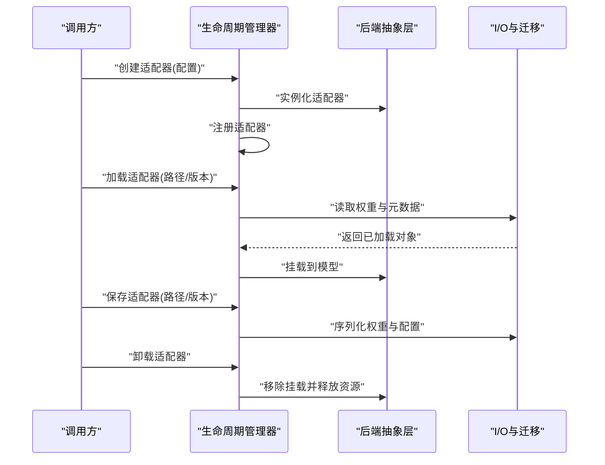
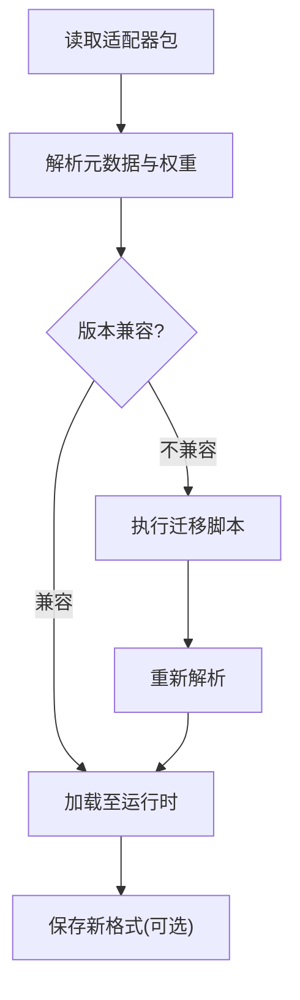
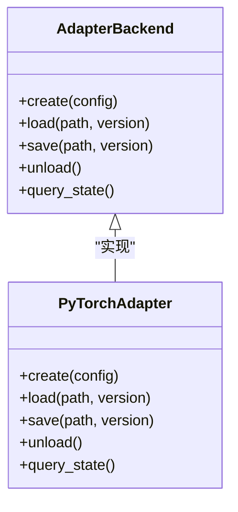
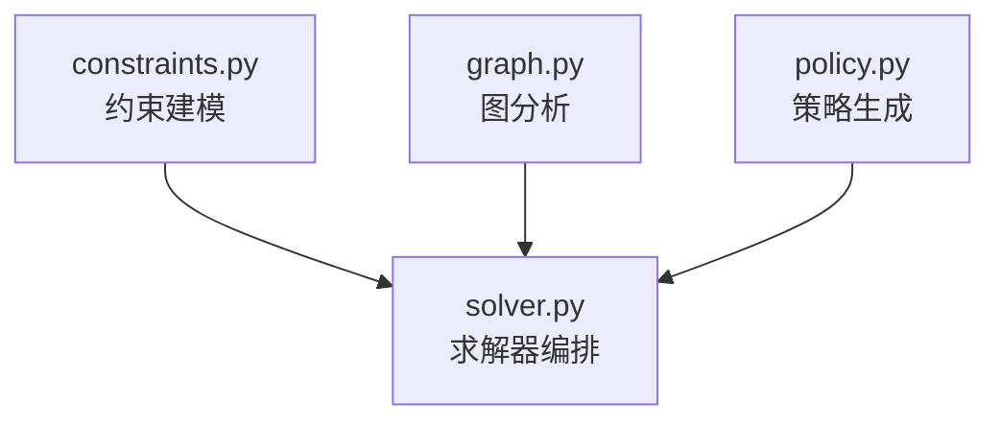
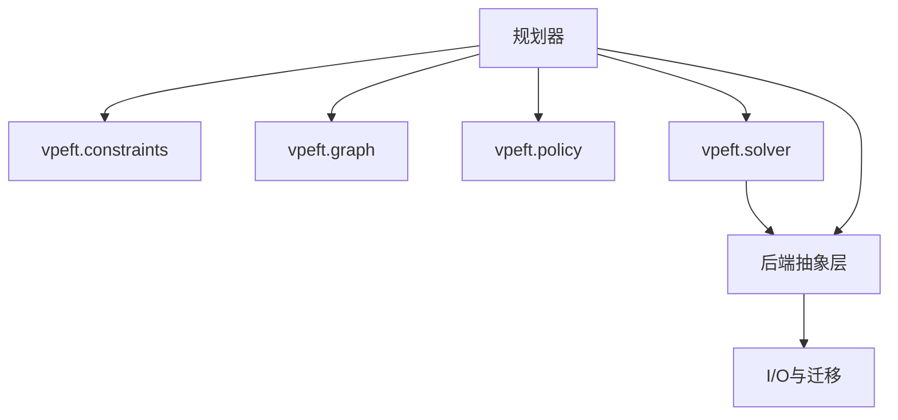

# 适配器管理系统

<cite>
**本文引用的文件**
- [vpeft/__init__.py](file://ultralytics/vpeft/__init__.py)
- [vpeft/constraints.py](file://ultralytics/vpeft/constraints.py)
- [vpeft/graph.py](file://ultralytics/vpeft/graph.py)
- [vpeft/policy.py](file://ultralytics/vpeft/policy.py)
- [vpeft/solver.py](file://ultralytics/vpeft/solver.py)
- [nn/peft/__init__.py](file://ultralytics/nn/peft/__init__.py)
- [utils/lora/__init__.py](file://ultralytics/utils/lora/__init__.py)
- [tests/test_vpeft.py](file://tests/test_vpeft.py)
- [tests/test_peft_adapters.py](file://tests/test_peft_adapters.py)
- [tests/test_moe_aware_peft.py](file://tests/test_moe_aware_peft.py)
- [scripts/validate_planner.py](file://scripts/validate_planner.py)
- [scripts/planner_train_compare.py](file://scripts/planner_train_compare.py)
</cite>

## 目录
1. [简介](#简介)
2. [项目结构](#项目结构)
3. [核心组件](#核心组件)
4. [架构总览](#架构总览)
5. [详细组件分析](#详细组件分析)
6. [依赖关系分析](#依赖关系分析)
7. [性能考量](#性能考量)
8. [故障排查指南](#故障排查指南)
9. [结论](#结论)
10. [附录](#附录)

## 简介
本技术文档面向YOLO-Master的PEFT（参数高效微调）适配器管理系统，聚焦以下目标：
- 解释“适配器规划器”的工作原理：敏感层分析、重要性评估与自适应选择算法。
- 阐述适配器的生命周期管理：创建、注册、加载、保存与卸载机制。
- 说明适配器I/O系统的设计：格式支持、版本兼容性与迁移工具。
- 解释后端抽象层设计：不同框架适配器的统一接口。
- 文档化vpeft模块功能：约束求解、图分析与策略生成。
- 提供适配器管理的API使用示例：批量操作与状态查询。
- 给出冲突解决与依赖管理的最佳实践。
- 解释适配器与MoE架构的集成方式与兼容性考虑。

## 项目结构
围绕PEFT适配器管理的关键代码分布在如下位置：
- vpeft：约束求解、图分析、策略生成与求解器编排。
- nn/peft：模型侧的适配器封装与后端抽象。
- utils/lora：LoRA相关工具与IO能力。
- tests：针对vpeft、适配器与MoE-aware PEFT的测试用例。
- scripts：规划器验证与训练对比脚本。

图表来源
- [vpeft/__init__.py](file://ultralytics/vpeft/__init__.py)
- [vpeft/constraints.py](file://ultralytics/vpeft/constraints.py)
- [vpeft/graph.py](file://ultralytics/vpeft/graph.py)
- [vpeft/policy.py](file://ultralytics/vpeft/policy.py)
- [vpeft/solver.py](file://ultralytics/vpeft/solver.py)
- [nn/peft/__init__.py](file://ultralytics/nn/peft/__init__.py)
- [utils/lora/__init__.py](file://ultralytics/utils/lora/__init__.py)
- [tests/test_vpeft.py](file://tests/test_vpeft.py)
- [tests/test_peft_adapters.py](file://tests/test_peft_adapters.py)
- [tests/test_moe_aware_peft.py](file://tests/test_moe_aware_peft.py)
- [scripts/validate_planner.py](file://scripts/validate_planner.py)
- [scripts/planner_train_compare.py](file://scripts/planner_train_compare.py)

章节来源
- [vpeft/__init__.py](file://ultralytics/vpeft/__init__.py)
- [nn/peft/__init__.py](file://ultralytics/nn/peft/__init__.py)
- [utils/lora/__init__.py](file://ultralytics/utils/lora/__init__.py)
- [tests/test_vpeft.py](file://tests/test_vpeft.py)
- [tests/test_peft_adapters.py](file://tests/test_peft_adapters.py)
- [tests/test_moe_aware_peft.py](file://tests/test_moe_aware_peft.py)
- [scripts/validate_planner.py](file://scripts/validate_planner.py)
- [scripts/planner_train_compare.py](file://scripts/planner_train_compare.py)

## 核心组件
- 适配器规划器
  - 负责敏感层识别、重要性评分与自适应选择，输出可执行的适配器配置计划。
- 生命周期管理器
  - 管理适配器的创建、注册、加载、保存与卸载，确保状态一致性与资源安全释放。
- I/O系统与迁移工具
  - 定义适配器数据格式、版本元数据与向后兼容策略，提供迁移路径。
- 后端抽象层
  - 为不同框架（如PyTorch等）提供统一接口，屏蔽底层差异。
- vpeft模块
  - 提供约束建模、计算图分析、策略生成与求解器编排，支撑规划器决策。

章节来源
- [vpeft/__init__.py](file://ultralytics/vpeft/__init__.py)
- [vpeft/constraints.py](file://ultralytics/vpeft/constraints.py)
- [vpeft/graph.py](file://ultralytics/vpeft/graph.py)
- [vpeft/policy.py](file://ultralytics/vpeft/policy.py)
- [vpeft/solver.py](file://ultralytics/vpeft/solver.py)
- [nn/peft/__init__.py](file://ultralytics/nn/peft/__init__.py)
- [utils/lora/__init__.py](file://ultralytics/utils/lora/__init__.py)

## 架构总览
整体架构由“规划器—求解器—后端抽象—生命周期管理—I/O”五层构成，vpeft作为策略与求解的核心，驱动上层生命周期与I/O流程。

图表来源
- [vpeft/__init__.py](file://ultralytics/vpeft/__init__.py)
- [vpeft/constraints.py](file://ultralytics/vpeft/constraints.py)
- [vpeft/graph.py](file://ultralytics/vpeft/graph.py)
- [vpeft/policy.py](file://ultralytics/vpeft/policy.py)
- [vpeft/solver.py](file://ultralytics/vpeft/solver.py)
- [nn/peft/__init__.py](file://ultralytics/nn/peft/__init__.py)
- [utils/lora/__init__.py](file://ultralytics/utils/lora/__init__.py)

## 详细组件分析

### 适配器规划器
- 敏感层分析
  - 基于模型结构与任务特性，识别对下游任务敏感的模块或权重区域。
- 重要性评估
  - 结合梯度统计、激活分布、路由频率（在MoE场景）等指标进行量化评分。
- 自适应选择算法
  - 在预算约束下，通过策略与求解器选择最优适配器集合，平衡精度与开销。

图表来源
- [vpeft/policy.py](file://ultralytics/vpeft/policy.py)
- [vpeft/graph.py](file://ultralytics/vpeft/graph.py)
- [vpeft/solver.py](file://ultralytics/vpeft/solver.py)

章节来源
- [vpeft/policy.py](file://ultralytics/vpeft/policy.py)
- [vpeft/graph.py](file://ultralytics/vpeft/graph.py)
- [vpeft/solver.py](file://ultralytics/vpeft/solver.py)

### 生命周期管理
- 创建
  - 依据规划结果实例化适配器，分配必要资源并初始化参数。
- 注册
  - 将适配器纳入全局或局部注册表，建立名称到实例的映射。
- 加载
  - 从持久化存储读取权重与元数据，完成热插拔或按需加载。
- 保存
  - 序列化适配器权重与配置，附带版本信息与依赖声明。
- 卸载
  - 清理引用、释放内存与设备资源，保证无泄漏。

图表来源
- [nn/peft/__init__.py](file://ultralytics/nn/peft/__init__.py)
- [utils/lora/__init__.py](file://ultralytics/utils/lora/__init__.py)

章节来源
- [nn/peft/__init__.py](file://ultralytics/nn/peft/__init__.py)
- [utils/lora/__init__.py](file://ultralytics/utils/lora/__init__.py)

### I/O系统与迁移工具
- 格式支持
  - 定义适配器权重与配置的序列化格式，包含元数据（版本、依赖、哈希）。
- 版本兼容性
  - 通过元数据进行向前/向后兼容判断，必要时触发迁移流程。
- 迁移工具
  - 提供旧版格式到新版的转换脚本，确保平滑升级。

图表来源
- [utils/lora/__init__.py](file://ultralytics/utils/lora/__init__.py)

章节来源
- [utils/lora/__init__.py](file://ultralytics/utils/lora/__init__.py)

### 后端抽象层
- 统一接口
  - 对外暴露一致的创建、挂载、卸载与查询方法。
- 框架适配
  - 针对不同框架（如PyTorch）实现具体适配器类，隐藏差异。
- 错误处理
  - 统一异常类型与诊断信息，便于定位问题。

图表来源
- [nn/peft/__init__.py](file://ultralytics/nn/peft/__init__.py)

章节来源
- [nn/peft/__init__.py](file://ultralytics/nn/peft/__init__.py)

### vpeft模块
- 约束求解
  - 将业务需求（预算、精度、延迟）建模为约束，交由求解器判定可行性与最优解。
- 图分析
  - 构建模型计算图与依赖关系，用于影响范围分析与冲突检测。
- 策略生成
  - 根据任务与数据特征生成候选策略，供求解器筛选。

图表来源
- [vpeft/constraints.py](file://ultralytics/vpeft/constraints.py)
- [vpeft/graph.py](file://ultralytics/vpeft/graph.py)
- [vpeft/policy.py](file://ultralytics/vpeft/policy.py)
- [vpeft/solver.py](file://ultralytics/vpeft/solver.py)

章节来源
- [vpeft/constraints.py](file://ultralytics/vpeft/constraints.py)
- [vpeft/graph.py](file://ultralytics/vpeft/graph.py)
- [vpeft/policy.py](file://ultralytics/vpeft/policy.py)
- [vpeft/solver.py](file://ultralytics/vpeft/solver.py)

### API使用示例（概念性）
- 批量创建与注册
  - 输入：适配器配置列表；输出：注册表状态。
- 批量加载与挂载
  - 输入：路径与版本映射；输出：挂载成功清单。
- 批量保存与导出
  - 输入：适配器ID与目标路径；输出：导出报告。
- 状态查询
  - 查询当前已注册/已加载的适配器及其依赖、版本与资源占用。

章节来源
- [tests/test_peft_adapters.py](file://tests/test_peft_adapters.py)
- [tests/test_vpeft.py](file://tests/test_vpeft.py)

### 冲突解决与依赖管理最佳实践
- 冲突检测
  - 基于图分析识别同名/同层冲突，优先采用命名空间隔离或自动重命名策略。
- 依赖排序
  - 依据依赖关系进行拓扑排序，确保加载顺序正确。
- 回滚与一致性
  - 在加载失败时回滚到上一稳定状态，保持注册表与模型挂载一致。

章节来源
- [vpeft/graph.py](file://ultralytics/vpeft/graph.py)
- [vpeft/solver.py](file://ultralytics/vpeft/solver.py)

### 与MoE架构的集成与兼容性
- MoE感知
  - 在重要性评估中引入路由频率与专家利用率，避免热点专家过载。
- 动态调度
  - 结合MoE的动态调度策略，按场景切换适配器组合，提升吞吐与精度。
- 兼容性
  - 确保适配器与MoE路由边界对齐，避免跨边界副作用。

章节来源
- [tests/test_moe_aware_peft.py](file://tests/test_moe_aware_peft.py)
- [scripts/validate_planner.py](file://scripts/validate_planner.py)
- [scripts/planner_train_compare.py](file://scripts/planner_train_compare.py)

## 依赖关系分析
- 内部依赖
  - 规划器依赖vpeft的约束、图与策略模块；求解器协调三者输出。
  - 生命周期管理依赖后端抽象层与I/O模块。
- 外部依赖
  - 框架特定实现（如PyTorch）通过后端抽象层接入。
- 潜在循环依赖
  - 通过分层与接口隔离避免循环，确保单向依赖。

图表来源
- [vpeft/__init__.py](file://ultralytics/vpeft/__init__.py)
- [vpeft/constraints.py](file://ultralytics/vpeft/constraints.py)
- [vpeft/graph.py](file://ultralytics/vpeft/graph.py)
- [vpeft/policy.py](file://ultralytics/vpeft/policy.py)
- [vpeft/solver.py](file://ultralytics/vpeft/solver.py)
- [nn/peft/__init__.py](file://ultralytics/nn/peft/__init__.py)
- [utils/lora/__init__.py](file://ultralytics/utils/lora/__init__.py)

章节来源
- [vpeft/__init__.py](file://ultralytics/vpeft/__init__.py)
- [nn/peft/__init__.py](file://ultralytics/nn/peft/__init__.py)
- [utils/lora/__init__.py](file://ultralytics/utils/lora/__init__.py)

## 性能考量
- 选择策略
  - 在预算内优先选择高收益低开销的适配器，减少冗余。
- 图分析优化
  - 缓存关键图结构，避免重复计算；增量更新依赖关系。
- 后端执行
  - 利用框架特定的算子优化与内存复用，降低加载与挂载开销。
- 批处理
  - 批量创建/加载/保存以减少系统调用与上下文切换。

[本节为通用指导，无需列出具体文件来源]

## 故障排查指南
- 常见问题
  - 版本不兼容：检查元数据中的版本字段与迁移脚本可用性。
  - 依赖缺失：确认依赖链完整且拓扑排序正确。
  - 资源泄漏：核查卸载流程是否释放所有引用与设备资源。
- 诊断建议
  - 启用详细日志，记录创建/加载/保存/卸载各阶段的状态与耗时。
  - 使用测试套件复现问题，定位回归点。

章节来源
- [tests/test_vpeft.py](file://tests/test_vpeft.py)
- [tests/test_peft_adapters.py](file://tests/test_peft_adapters.py)
- [tests/test_moe_aware_peft.py](file://tests/test_moe_aware_peft.py)

## 结论
本系统通过vpeft的约束求解与图分析，结合后端抽象与生命周期管理，实现了可扩展、可移植的PEFT适配器管理能力。配合I/O与迁移工具，可在多框架与MoE环境下稳定运行，并提供高效的批量操作与状态查询能力。

[本节为总结，无需列出具体文件来源]

## 附录
- 术语
  - 适配器：轻量级可插拔的参数集，用于增强或修改模型行为。
  - 规划器：根据任务与约束生成适配器选择计划的组件。
  - 求解器：在约束条件下寻找可行或最优解的组件。
- 参考脚本与测试
  - 规划器验证与训练对比脚本可用于端到端验证与回归测试。

章节来源
- [scripts/validate_planner.py](file://scripts/validate_planner.py)
- [scripts/planner_train_compare.py](file://scripts/planner_train_compare.py)