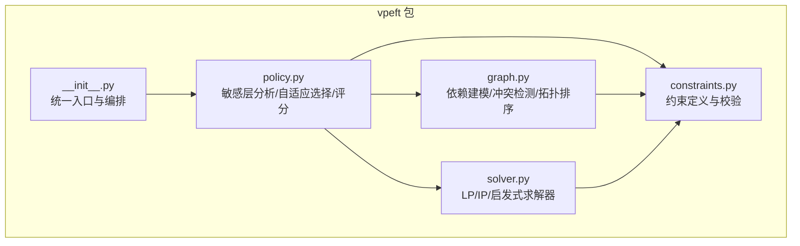
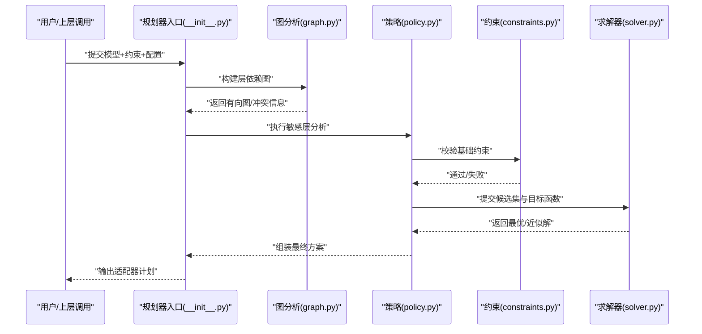
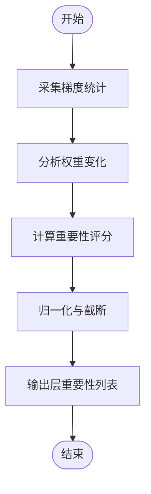
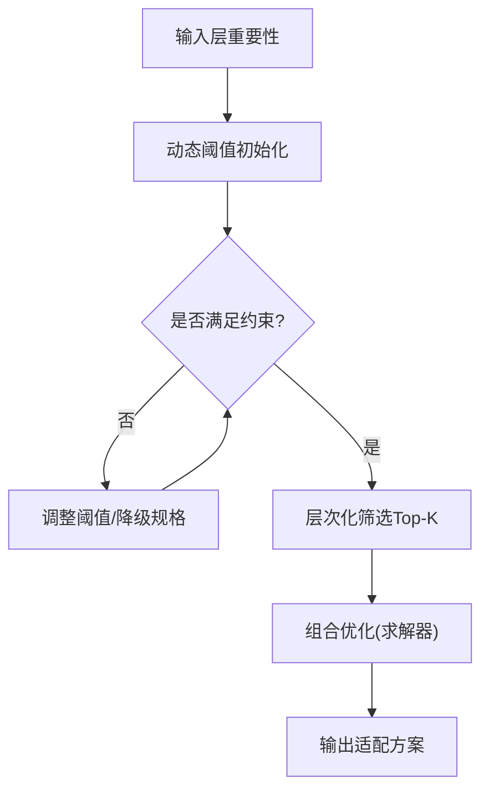
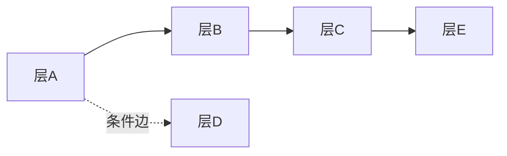
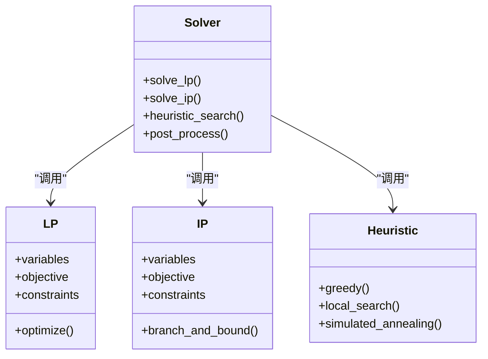
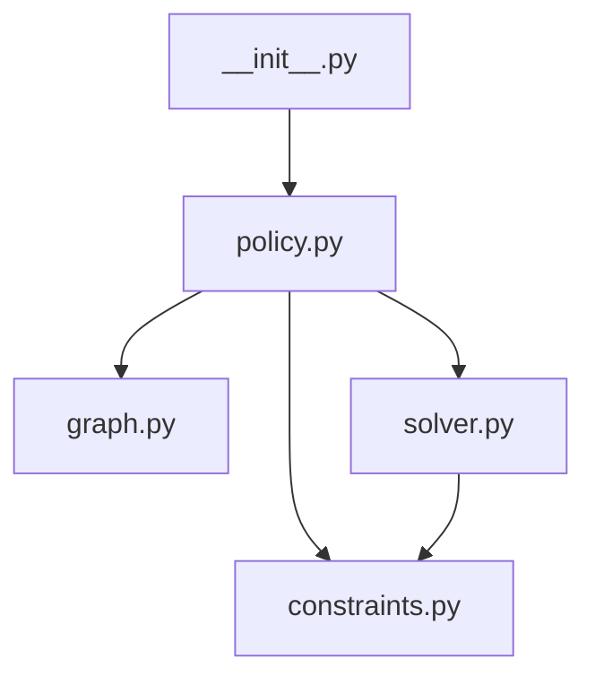

# 适配器规划器

<cite>
**本文引用的文件**
- [vpeft/__init__.py](file://ultralytics/vpeft/__init__.py)
- [vpeft/constraints.py](file://ultralytics/vpeft/constraints.py)
- [vpeft/graph.py](file://ultralytics/vpeft/graph.py)
- [vpeft/policy.py](file://ultralytics/vpeft/policy.py)
- [vpeft/solver.py](file://ultralytics/vpeft/solver.py)
- [test_planner.py](file://tests/test_planner.py)
- [test_planner_enhancement.py](file://tests/test_planner_enhancement.py)
- [test_planner_integration.py](file://tests/test_planner_integration.py)
- [scripts/validate_planner.py](file://scripts/validate_planner.py)
- [scripts/run_planner_lovo_calibration.py](file://scripts/run_planner_lovo_calibration.py)
</cite>

## 目录
1. [简介](#简介)
2. [项目结构](#项目结构)
3. [核心组件](#核心组件)
4. [架构总览](#架构总览)
5. [详细组件分析](#详细组件分析)
6. [依赖关系分析](#依赖关系分析)
7. [性能考虑](#性能考虑)
8. [故障排查指南](#故障排查指南)
9. [结论](#结论)
10. [附录](#附录)

## 简介
本技术文档聚焦于YOLO-Master中的“适配器规划器”，其目标是在给定模型与任务约束的前提下，自动为不同层或模块选择最优的适配器（如LoRA、MoE专家等）配置方案。规划器围绕以下关键能力展开：
- 敏感层分析：通过梯度敏感性评估、权重变化分析与重要性评分机制，识别对任务最关键的层。
- 自适应选择策略：基于动态阈值调整、层次化选择与约束满足求解，在资源预算内最大化收益。
- 图分析模块：建模层间依赖、检测冲突并执行拓扑排序，确保可执行的适配顺序。
- 约束求解器：支持线性规划、整数规划与启发式算法，兼顾最优性与可扩展性。
- 配置与调优：提供丰富的参数选项与调优建议，便于在不同模型和数据集上快速落地。
- MoE集成与优化：面向混合专家架构的适配方案生成与部署优化策略。

## 项目结构
适配器规划器位于 ultralytics/vpeft 子包中，采用分层模块化设计：
- constraints.py：定义与校验各类约束（资源、精度、兼容性等）。
- graph.py：构建层依赖图、冲突检测与拓扑排序。
- policy.py：实现敏感层分析、自适应选择策略与评分机制。
- solver.py：封装约束求解器（线性/整数规划与启发式）。
- __init__.py：对外暴露统一入口与高层API。

图表来源
- [vpeft/__init__.py](file://ultralytics/vpeft/__init__.py)
- [vpeft/constraints.py](file://ultralytics/vpeft/constraints.py)
- [vpeft/graph.py](file://ultralytics/vpeft/graph.py)
- [vpeft/policy.py](file://ultralytics/vpeft/policy.py)
- [vpeft/solver.py](file://ultralytics/vpeft/solver.py)

章节来源
- [vpeft/__init__.py](file://ultralytics/vpeft/__init__.py)
- [vpeft/constraints.py](file://ultralytics/vpeft/constraints.py)
- [vpeft/graph.py](file://ultralytics/vpeft/graph.py)
- [vpeft/policy.py](file://ultralytics/vpeft/policy.py)
- [vpeft/solver.py](file://ultralytics/vpeft/solver.py)

## 核心组件
- 约束系统（constraints.py）
  - 资源类约束：显存、计算量、参数量上限。
  - 精度类约束：最小精度保持、最大退化容忍度。
  - 兼容类约束：设备类型、后端能力、导出格式限制。
  - 自定义扩展点：允许用户注册新的约束类型与校验函数。
- 图分析（graph.py）
  - 依赖建模：将模型层抽象为节点，边表示数据流与控制流依赖。
  - 冲突检测：识别互斥的适配器组合与不可共存配置。
  - 拓扑排序：输出无环的执行序列，保证前向传播时依赖已就绪。
- 策略与评分（policy.py）
  - 敏感层分析：梯度范数/方差、权重更新幅度、重要性打分。
  - 自适应选择：动态阈值、层次化筛选（粗筛→精排）、约束满足求解。
  - 收益函数：综合精度提升、成本开销与稳定性指标。
- 求解器（solver.py）
  - 线性规划（LP）：连续松弛的快速近似解。
  - 整数规划（IP）：离散选择的精确或分支定界解。
  - 启发式：贪心、局部搜索、模拟退火等，用于大规模问题。
- 统一入口（__init__.py）
  - 编排流程：加载模型→构建图→分析敏感层→求解→输出方案。
  - 配置解析：合并默认与用户配置，进行合法性校验。

章节来源
- [vpeft/constraints.py](file://ultralytics/vpeft/constraints.py)
- [vpeft/graph.py](file://ultralytics/vpeft/graph.py)
- [vpeft/policy.py](file://ultralytics/vpeft/policy.py)
- [vpeft/solver.py](file://ultralytics/vpeft/solver.py)
- [vpeft/__init__.py](file://ultralytics/vpeft/__init__.py)

## 架构总览
规划器的端到端流程如下：
- 输入：模型结构、数据集统计、资源与精度约束、目标任务。
- 处理：构建依赖图→敏感层分析→候选集生成→约束校验→求解器优化→输出方案。
- 输出：每层的适配器类型、秩/通道数、激活开关、路由策略（若为MoE）。

图表来源
- [vpeft/__init__.py](file://ultralytics/vpeft/__init__.py)
- [vpeft/graph.py](file://ultralytics/vpeft/graph.py)
- [vpeft/policy.py](file://ultralytics/vpeft/policy.py)
- [vpeft/constraints.py](file://ultralytics/vpeft/constraints.py)
- [vpeft/solver.py](file://ultralytics/vpeft/solver.py)

## 详细组件分析

### 敏感层分析算法（policy.py）
- 梯度敏感性评估
  - 基于反向传播的梯度统计（范数、方差、稀疏度），衡量层对损失变化的敏感度。
  - 可选采样策略：小批量随机样本、任务特定分布、历史训练快照。
- 权重变化分析
  - 监控预训练到微调阶段的权重更新幅度，识别易变层。
  - 结合权重范数与相对变化率，降低噪声影响。
- 重要性评分机制
  - 多指标融合：梯度敏感性×权重变化×任务相关性先验。
  - 归一化与分位数截断，避免极端值主导。
- 输出
  - 每层的重要性分数与置信区间，供后续自适应选择使用。

图表来源
- [vpeft/policy.py](file://ultralytics/vpeft/policy.py)

章节来源
- [vpeft/policy.py](file://ultralytics/vpeft/policy.py)

### 自适应选择策略（policy.py）
- 动态阈值调整
  - 根据全局预算与当前选中比例，动态提高/降低入选门槛。
  - 引入回退机制：当约束不满足时，自动放宽非关键约束或降级适配器规格。
- 层次化选择
  - 粗筛：按重要性分数与成本过滤，保留Top-K候选。
  - 精排：在候选集中进行组合优化，考虑交互效应与冲突。
- 约束满足求解
  - 将选择问题形式化为带约束的优化问题，交由求解器处理。
  - 支持硬约束（必须满足）与软约束（惩罚项）。

图表来源
- [vpeft/policy.py](file://ultralytics/vpeft/policy.py)

章节来源
- [vpeft/policy.py](file://ultralytics/vpeft/policy.py)

### 图分析模块（graph.py）
- 依赖关系建模
  - 节点：模型层/模块；边：张量依赖、控制依赖、共享权重。
  - 支持条件依赖（仅在特定路由路径下生效）。
- 冲突检测
  - 互斥适配器组合（如同一层同时启用多种不相容适配器）。
  - 资源冲突（并行度与内存峰值超限）。
- 拓扑排序
  - 基于Kahn算法或DFS的无环排序，输出可执行序列。
  - 若存在环，报告冲突边并提供消解建议（如拆分层或重命名）。

图表来源
- [vpeft/graph.py](file://ultralytics/vpeft/graph.py)

章节来源
- [vpeft/graph.py](file://ultralytics/vpeft/graph.py)

### 约束求解器（solver.py）
- 线性规划（LP）
  - 变量：连续的选择强度（0~1），适用于快速近似。
  - 目标：最大化加权收益，受限于资源与精度约束。
- 整数规划（IP）
  - 变量：离散选择（0/1），适用于严格组合优化。
  - 方法：分支定界、割平面，支持大规模实例的剪枝。
- 启发式算法
  - 贪心：按性价比排序逐步加入，适合实时场景。
  - 局部搜索/模拟退火：跳出局部最优，提高解质量。
- 结果后处理
  - 可行性修复：对轻微越界进行微调以满足硬约束。
  - 鲁棒性检查：对扰动下的稳定性进行评估。

图表来源
- [vpeft/solver.py](file://ultralytics/vpeft/solver.py)

章节来源
- [vpeft/solver.py](file://ultralytics/vpeft/solver.py)

### 统一入口与编排（__init__.py）
- 配置解析与合并
  - 默认配置、用户覆盖、环境变量的优先级管理。
- 流程编排
  - 依次调用图分析、敏感层分析、约束校验、求解器与后处理。
- 结果序列化
  - 输出JSON/YAML格式的适配器计划，包含每层配置与元数据。

章节来源
- [vpeft/__init__.py](file://ultralytics/vpeft/__init__.py)

## 依赖关系分析
- 内部依赖
  - __init__.py 编排 policy → graph → constraints → solver。
  - policy 依赖 graph 的依赖信息与 constraints 的校验接口。
  - solver 依赖 constraints 提供的约束表达式。
- 外部依赖
  - 数值优化库（如线性/整数规划求解器）。
  - 深度学习框架（PyTorch）以获取梯度与权重信息。
- 潜在循环
  - 通过单向编排避免循环导入；若新增回调需确保单向依赖。

图表来源
- [vpeft/__init__.py](file://ultralytics/vpeft/__init__.py)
- [vpeft/policy.py](file://ultralytics/vpeft/policy.py)
- [vpeft/graph.py](file://ultralytics/vpeft/graph.py)
- [vpeft/constraints.py](file://ultralytics/vpeft/constraints.py)
- [vpeft/solver.py](file://ultralytics/vpeft/solver.py)

章节来源
- [vpeft/__init__.py](file://ultralytics/vpeft/__init__.py)
- [vpeft/policy.py](file://ultralytics/vpeft/policy.py)
- [vpeft/graph.py](file://ultralytics/vpeft/graph.py)
- [vpeft/constraints.py](file://ultralytics/vpeft/constraints.py)
- [vpeft/solver.py](file://ultralytics/vpeft/solver.py)

## 性能考虑
- 敏感层分析的采样策略
  - 使用代表性子集与早停策略减少反向传播开销。
  - 缓存中间统计，避免重复计算。
- 图规模与复杂度
  - 大模型图构建采用惰性加载与增量更新。
  - 冲突检测使用位图或哈希加速。
- 求解器选择
  - 小规模问题优先IP以获得精确解；大规模问题使用LP或启发式。
  - 并行化：对独立子图进行并发求解与合并。
- 内存与带宽
  - 权重与梯度使用半精度或量化存储以降低内存占用。
  - 批处理候选集，减少I/O与序列化开销。

## 故障排查指南
- 常见问题
  - 约束不满足：检查资源上限与精度下限设置，必要时放宽软约束。
  - 图存在环：定位冲突边，考虑层拆分或移除条件依赖。
  - 求解超时：切换至LP或启发式，或缩小候选集规模。
- 诊断工具
  - 验证脚本：运行测试与验证脚本，复现问题并收集日志。
  - 可视化：输出依赖图与选择过程，辅助定位瓶颈。
- 参考用例
  - 单元测试与集成测试覆盖典型场景，可作为回归基线。

章节来源
- [test_planner.py](file://tests/test_planner.py)
- [test_planner_enhancement.py](file://tests/test_planner_enhancement.py)
- [test_planner_integration.py](file://tests/test_planner_integration.py)
- [scripts/validate_planner.py](file://scripts/validate_planner.py)

## 结论
适配器规划器通过“敏感层分析—自适应选择—图分析—约束求解”的闭环流程，能够在复杂模型与多样化约束下自动生成高质量适配器方案。其模块化设计与可扩展接口，使得在不同任务与硬件平台上快速适配成为可能。未来可进一步探索在线学习驱动的动态阈值与跨任务迁移的重要性先验，以提升泛化能力与鲁棒性。

## 附录

### 配置选项与参数调优指南
- 通用配置
  - 资源预算：显存上限、计算量上限、参数量上限。
  - 精度要求：最小mAP/mIoU、最大退化容忍度。
  - 设备与后端：GPU/CPU、推理后端（ONNX/TensorRT/OpenVINO）。
- 敏感层分析
  - 采样批次大小、迭代次数、梯度统计窗口。
  - 权重变化监控周期与平滑系数。
- 自适应选择
  - 初始阈值、阈值步长、回退策略。
  - Top-K候选数量、组合优化深度。
- 求解器
  - LP/IP求解器选择、时间预算、收敛阈值。
  - 启发式算法：迭代次数、温度曲线（模拟退火）。
- 调优建议
  - 从小规模数据集与轻量模型起步，逐步扩大规模。
  - 关注边界案例（极端类别不平衡、低分辨率图像）。
  - 定期校准重要性评分与收益函数权重。

### 实际使用示例
- 为YOLO系列模型生成适配器方案
  - 准备模型与数据集配置文件。
  - 设置资源与精度约束，运行规划器生成计划。
  - 导出计划为JSON/YAML，用于后续训练或部署。
- 为VisDrone数据集定制方案
  - 针对小目标与密集场景调整重要性先验。
  - 放宽部分软约束以提升召回率。
- 参考脚本
  - 使用验证与校准脚本快速上手与复现实验。

章节来源
- [scripts/validate_planner.py](file://scripts/validate_planner.py)
- [scripts/run_planner_lovo_calibration.py](file://scripts/run_planner_lovo_calibration.py)

### 与MoE架构的集成方式与性能优化策略
- 集成方式
  - 在policy中增加MoE专家选择维度，结合路由概率与负载均衡。
  - 在graph中建模专家间的共享与互斥关系。
  - 在solver中引入专家容量与负载均衡约束。
- 性能优化
  - 专家裁剪：依据使用频率与贡献度剔除低效专家。
  - 动态调度：根据输入特征动态激活子集专家，降低延迟。
  - 缓存与预热：对常用专家路径进行预热，减少冷启动开销。