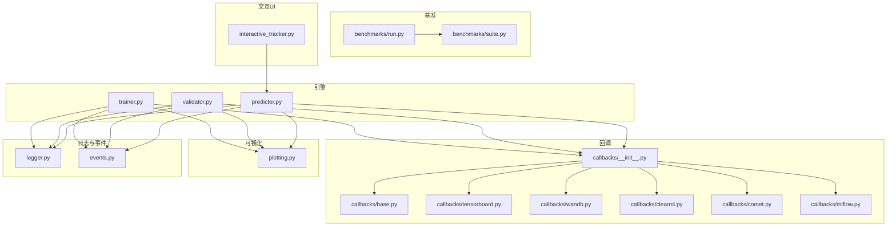
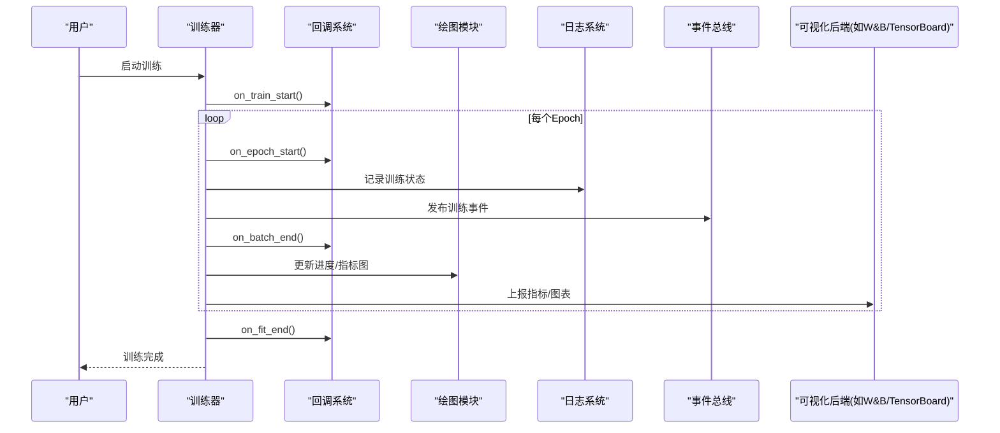
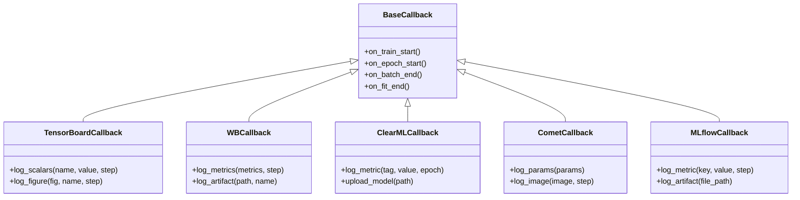
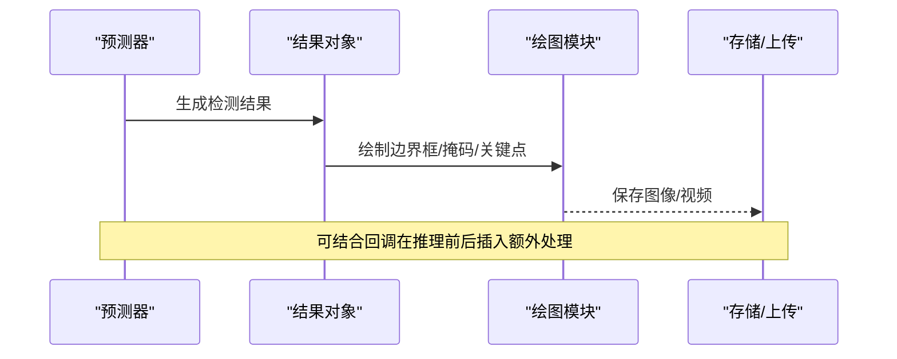
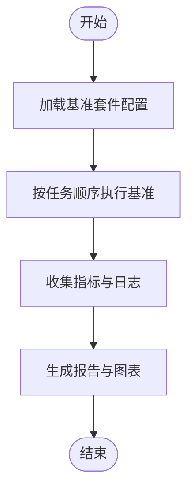
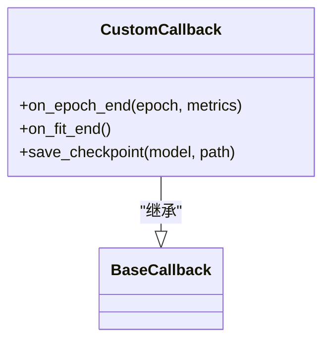
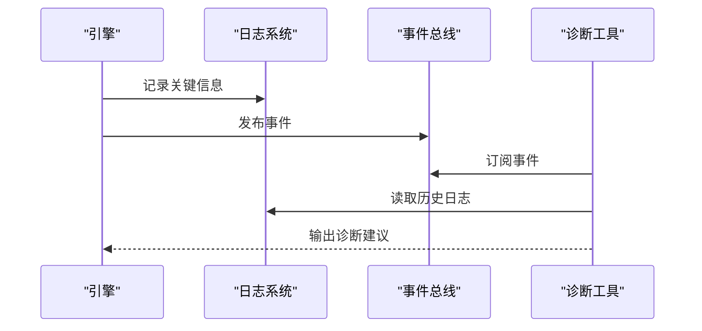
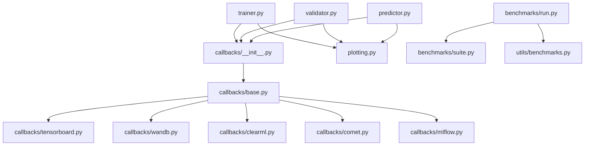

# 可视化和调试

<cite>
**本文引用的文件**
- [app.py](file://app.py)
- [engine/trainer.py](file://ultralytics/engine/trainer.py)
- [engine/validator.py](file://ultralytics/engine/validator.py)
- [engine/predictor.py](file://ultralytics/engine/predictor.py)
- [utils/callbacks/__init__.py](file://ultralytics/utils/callbacks/__init__.py)
- [utils/callbacks/base.py](file://ultralytics/utils/callbacks/base.py)
- [utils/callbacks/tensorboard.py](file://ultralytics/utils/callbacks/tensorboard.py)
- [utils/callbacks/clearml.py](file://ultralytics/utils/callbacks/clearml.py)
- [utils/callbacks/comet.py](file://ultralytics/utils/callbacks/comet.py)
- [utils/callbacks/wandb.py](file://ultralytics/utils/callbacks/wandb.py)
- [utils/callbacks/mlflow.py](file://ultralytics/utils/callbacks/mlflow.py)
- [utils/plotting.py](file://ultralytics/utils/plotting.py)
- [utils/benchmarks.py](file://ultralytics/utils/benchmarks.py)
- [utils/logger.py](file://ultralytics/utils/logger.py)
- [utils/events.py](file://ultralytics/utils/events.py)
- [benchmarks/run.py](file://benchmarks/run.py)
- [benchmarks/suite.py](file://benchmarks/suite.py)
- [examples/YOLO-Interactive-Tracking-UI/interactive_tracker.py](file://examples/YOLO-Interactive-Tracking-UI/interactive_tracker.py)
</cite>

## 目录
1. [简介](#简介)
2. [项目结构](#项目结构)
3. [核心组件](#核心组件)
4. [架构总览](#架构总览)
5. [详细组件分析](#详细组件分析)
6. [依赖关系分析](#依赖关系分析)
7. [性能考量](#性能考量)
8. [故障排查指南](#故障排查指南)
9. [结论](#结论)
10. [附录](#附录)

## 简介
本文件面向YOLO-Master的可视化与调试系统，覆盖训练期可视化（损失曲线、指标图表、进度监控）、推理结果可视化（边界框、掩码、关键点）、性能分析与基准测试工具、自定义回调开发与集成、调试与诊断工具、日志系统与事件追踪、性能瓶颈与内存泄漏检测、可视化定制与导出、交互式调试界面使用指南、常见问题诊断流程与解决方案，以及实验报告与结果分析工具链。

## 项目结构
与可视化与调试相关的代码主要分布在以下模块：
- 引擎层：训练器、验证器、预测器负责在关键生命周期阶段触发回调与记录指标
- 回调子系统：统一的事件钩子机制，内置多种后端（TensorBoard、Weights & Biases、ClearML、Comet、MLflow）
- 绘图与可视化：统一的绘图API，支持绘制训练曲线、混淆矩阵、PR/AUC等
- 基准测试：端到端基准套件与运行脚本，提供吞吐、延迟、精度对比
- 日志与事件：结构化日志与事件总线，便于追踪与诊断
- 交互界面：示例交互式跟踪UI，用于在线调试与结果审查

图示来源
- [engine/trainer.py](file://ultralytics/engine/trainer.py)
- [engine/validator.py](file://ultralytics/engine/validator.py)
- [engine/predictor.py](file://ultralytics/engine/predictor.py)
- [utils/callbacks/__init__.py](file://ultralytics/utils/callbacks/__init__.py)
- [utils/callbacks/base.py](file://ultralytics/utils/callbacks/base.py)
- [utils/callbacks/tensorboard.py](file://ultralytics/utils/callbacks/tensorboard.py)
- [utils/callbacks/wandb.py](file://ultralytics/utils/callbacks/wandb.py)
- [utils/callbacks/clearml.py](file://ultralytics/utils/callbacks/clearml.py)
- [utils/callbacks/comet.py](file://ultralytics/utils/callbacks/comet.py)
- [utils/callbacks/mlflow.py](file://ultralytics/utils/callbacks/mlflow.py)
- [utils/plotting.py](file://ultralytics/utils/plotting.py)
- [benchmarks/run.py](file://benchmarks/run.py)
- [benchmarks/suite.py](file://benchmarks/suite.py)
- [utils/logger.py](file://ultralytics/utils/logger.py)
- [utils/events.py](file://ultralytics/utils/events.py)
- [examples/YOLO-Interactive-Tracking-UI/interactive_tracker.py](file://examples/YOLO-Interactive-Tracking-UI/interactive_tracker.py)

章节来源
- [engine/trainer.py](file://ultralytics/engine/trainer.py)
- [engine/validator.py](file://ultralytics/engine/validator.py)
- [engine/predictor.py](file://ultralytics/engine/predictor.py)
- [utils/callbacks/__init__.py](file://ultralytics/utils/callbacks/__init__.py)
- [utils/callbacks/base.py](file://ultralytics/utils/callbacks/base.py)
- [utils/plotting.py](file://ultralytics/utils/plotting.py)
- [benchmarks/run.py](file://benchmarks/run.py)
- [benchmarks/suite.py](file://benchmarks/suite.py)
- [utils/logger.py](file://ultralytics/utils/logger.py)
- [utils/events.py](file://ultralytics/utils/events.py)
- [examples/YOLO-Interactive-Tracking-UI/interactive_tracker.py](file://examples/YOLO-Interactive-Tracking-UI/interactive_tracker.py)

## 核心组件
- 训练器与验证器：在训练/验证的关键阶段（如每个epoch、每个batch、模型保存、评估完成）触发回调，记录指标并驱动可视化
- 回调系统：基于基类扩展的统一事件接口，内置多后端可视化与实验管理
- 绘图模块：封装常用图表绘制逻辑，供训练/验证/推理后处理调用
- 基准测试：提供标准任务与配置，输出吞吐、延迟、精度等指标
- 日志与事件：结构化日志与事件总线，贯穿训练/验证/推理全链路
- 交互UI：基于示例的实时跟踪与可视化界面，辅助调试

章节来源
- [engine/trainer.py](file://ultralytics/engine/trainer.py)
- [engine/validator.py](file://ultralytics/engine/validator.py)
- [utils/callbacks/base.py](file://ultralytics/utils/callbacks/base.py)
- [utils/plotting.py](file://ultralytics/utils/plotting.py)
- [benchmarks/run.py](file://benchmarks/run.py)
- [utils/logger.py](file://ultralytics/utils/logger.py)
- [utils/events.py](file://ultralytics/utils/events.py)

## 架构总览
下图展示训练期的可视化与调试数据流：引擎在关键节点触发回调，回调将指标写入各后端；同时通过绘图模块生成图表；日志与事件贯穿全程，便于追踪与诊断。

图示来源
- [engine/trainer.py](file://ultralytics/engine/trainer.py)
- [utils/callbacks/__init__.py](file://ultralytics/utils/callbacks/__init__.py)
- [utils/plotting.py](file://ultralytics/utils/plotting.py)
- [utils/logger.py](file://ultralytics/utils/logger.py)
- [utils/events.py](file://ultralytics/utils/events.py)
- [utils/callbacks/wandb.py](file://ultralytics/utils/callbacks/wandb.py)
- [utils/callbacks/tensorboard.py](file://ultralytics/utils/callbacks/tensorboard.py)

## 详细组件分析

### 训练期可视化：损失曲线、指标图表与进度监控
- 触发点：训练器在每个epoch和batch结束时调用回调，记录损失与指标
- 绘图：绘图模块根据指标序列生成曲线图，并在训练过程中刷新
- 后端：回调系统可将指标同步到外部平台（如W&B、TensorBoard、ClearML、Comet、MLflow），实现远程监控与协作
- 进度：结合日志与事件，可在控制台或外部系统中查看训练进度与异常

图示来源
- [utils/callbacks/base.py](file://ultralytics/utils/callbacks/base.py)
- [utils/callbacks/tensorboard.py](file://ultralytics/utils/callbacks/tensorboard.py)
- [utils/callbacks/wandb.py](file://ultralytics/utils/callbacks/wandb.py)
- [utils/callbacks/clearml.py](file://ultralytics/utils/callbacks/clearml.py)
- [utils/callbacks/comet.py](file://ultralytics/utils/callbacks/comet.py)
- [utils/callbacks/mlflow.py](file://ultralytics/utils/callbacks/mlflow.py)

章节来源
- [engine/trainer.py](file://ultralytics/engine/trainer.py)
- [utils/callbacks/__init__.py](file://ultralytics/utils/callbacks/__init__.py)
- [utils/callbacks/base.py](file://ultralytics/utils/callbacks/base.py)
- [utils/plotting.py](file://ultralytics/utils/plotting.py)

### 推理结果可视化：边界框、掩码与关键点标注
- 预测器在推理完成后生成检测结果，并通过绘图模块进行可视化
- 支持目标检测（边界框）、实例分割（掩码）、姿态估计（关键点）等任务的可视化
- 可通过回调或后处理脚本将可视化结果保存到本地或上传至实验管理平台

图示来源
- [engine/predictor.py](file://ultralytics/engine/predictor.py)
- [utils/plotting.py](file://ultralytics/utils/plotting.py)

章节来源
- [engine/predictor.py](file://ultralytics/engine/predictor.py)
- [utils/plotting.py](file://ultralytics/utils/plotting.py)

### 性能分析与基准测试工具
- 基准套件：定义标准任务与配置，统一执行并汇总结果
- 运行脚本：提供命令行入口，支持批量任务、参数扫描与结果导出
- 指标：吞吐（FPS）、延迟（ms）、精度（mAP等）、资源占用（GPU/CPU/内存）

图示来源
- [benchmarks/suite.py](file://benchmarks/suite.py)
- [benchmarks/run.py](file://benchmarks/run.py)
- [utils/benchmarks.py](file://ultralytics/utils/benchmarks.py)

章节来源
- [benchmarks/run.py](file://benchmarks/run.py)
- [benchmarks/suite.py](file://benchmarks/suite.py)
- [utils/benchmarks.py](file://ultralytics/utils/benchmarks.py)

### 自定义回调的开发与集成
- 开发步骤：
  - 继承回调基类，重写所需的生命周期方法
  - 在回调中访问训练/验证上下文与指标
  - 将自定义逻辑（如模型快照、指标聚合、告警）写入日志或外部系统
- 集成方式：
  - 在训练器初始化时注册自定义回调
  - 确保回调与内置回调兼容，避免重复上报或冲突

图示来源
- [utils/callbacks/base.py](file://ultralytics/utils/callbacks/base.py)
- [utils/callbacks/__init__.py](file://ultralytics/utils/callbacks/__init__.py)

章节来源
- [utils/callbacks/base.py](file://ultralytics/utils/callbacks/base.py)
- [utils/callbacks/__init__.py](file://ultralytics/utils/callbacks/__init__.py)

### 调试工具与诊断功能
- 日志系统：结构化日志记录训练/验证/推理关键路径，支持分级与过滤
- 事件总线：发布与订阅训练事件，便于跨模块诊断与追踪
- 诊断脚本：针对特定问题（如路由、MoE、DDP）的诊断与分析工具

图示来源
- [utils/logger.py](file://ultralytics/utils/logger.py)
- [utils/events.py](file://ultralytics/utils/events.py)

章节来源
- [utils/logger.py](file://ultralytics/utils/logger.py)
- [utils/events.py](file://ultralytics/utils/events.py)

### 日志系统与事件追踪机制
- 日志：统一入口，支持控制台与文件输出，包含时间戳、级别、模块信息
- 事件：以键值对形式记录训练/验证/推理关键节点，便于检索与回放
- 集成：回调与引擎均通过日志与事件对外暴露可观测性

章节来源
- [utils/logger.py](file://ultralytics/utils/logger.py)
- [utils/events.py](file://ultralytics/utils/events.py)

### 性能瓶颈分析与内存泄漏检测
- 瓶颈定位：
  - 使用基准套件测量不同阶段的耗时与吞吐
  - 结合日志与事件分析热点路径
- 内存泄漏检测：
  - 定期采样进程内存与显存使用情况
  - 检查张量释放与缓存策略，避免引用残留
- 优化建议：
  - 调整批大小与数据加载策略
  - 启用混合精度与编译优化（如适用）

章节来源
- [utils/benchmarks.py](file://ultralytics/utils/benchmarks.py)
- [utils/logger.py](file://ultralytics/utils/logger.py)

### 可视化结果的定制与导出
- 定制：
  - 通过回调在训练/验证/推理前后插入自定义绘图逻辑
  - 复用绘图模块的通用函数，保持风格一致
- 导出：
  - 将图表与结果保存为图片、HTML或JSON
  - 上传至实验管理平台，便于团队协作与版本管理

章节来源
- [utils/plotting.py](file://ultralytics/utils/plotting.py)
- [utils/callbacks/wandb.py](file://ultralytics/utils/callbacks/wandb.py)
- [utils/callbacks/tensorboard.py](file://ultralytics/utils/callbacks/tensorboard.py)

### 交互式调试界面使用指南
- 示例界面：交互式跟踪UI，支持实时查看跟踪结果、调整阈值、回放历史帧
- 使用方法：
  - 启动示例脚本，加载模型与数据源
  - 在界面中切换任务类型（检测/分割/姿态）
  - 导出当前视图与结果

章节来源
- [examples/YOLO-Interactive-Tracking-UI/interactive_tracker.py](file://examples/YOLO-Interactive-Tracking-UI/interactive_tracker.py)

## 依赖关系分析
- 耦合度：
  - 引擎与回调松耦合，通过事件与接口通信
  - 绘图模块独立，被多处复用
- 外部依赖：
  - 可视化后端（W&B、TensorBoard、ClearML、Comet、MLflow）
  - 基准测试所需的第三方库（如psutil、pandas等）

图示来源
- [engine/trainer.py](file://ultralytics/engine/trainer.py)
- [engine/validator.py](file://ultralytics/engine/validator.py)
- [engine/predictor.py](file://ultralytics/engine/predictor.py)
- [utils/callbacks/__init__.py](file://ultralytics/utils/callbacks/__init__.py)
- [utils/callbacks/base.py](file://ultralytics/utils/callbacks/base.py)
- [utils/callbacks/tensorboard.py](file://ultralytics/utils/callbacks/tensorboard.py)
- [utils/callbacks/wandb.py](file://ultralytics/utils/callbacks/wandb.py)
- [utils/callbacks/clearml.py](file://ultralytics/utils/callbacks/clearml.py)
- [utils/callbacks/comet.py](file://ultralytics/utils/callbacks/comet.py)
- [utils/callbacks/mlflow.py](file://ultralytics/utils/callbacks/mlflow.py)
- [utils/plotting.py](file://ultralytics/utils/plotting.py)
- [benchmarks/run.py](file://benchmarks/run.py)
- [benchmarks/suite.py](file://benchmarks/suite.py)
- [utils/benchmarks.py](file://ultralytics/utils/benchmarks.py)

章节来源
- [utils/callbacks/__init__.py](file://ultralytics/utils/callbacks/__init__.py)
- [utils/callbacks/base.py](file://ultralytics/utils/callbacks/base.py)
- [benchmarks/run.py](file://benchmarks/run.py)
- [benchmarks/suite.py](file://benchmarks/suite.py)

## 性能考量
- 训练期：
  - 合理设置批大小与数据加载线程数，避免I/O瓶颈
  - 使用混合精度与梯度累积提升吞吐
- 推理期：
  - 选择合适的前端与后端（ONNX/TensorRT/OpenVINO等）
  - 开启动态形状与批处理优化
- 可视化：
  - 控制图表刷新频率，避免阻塞主循环
  - 异步上传大文件，减少网络开销

[本节为通用指导，不直接分析具体文件]

## 故障排查指南
- 常见问题：
  - 指标未上报：检查回调是否成功初始化与连接
  - 图表缺失：确认绘图模块输入数据格式与维度
  - 基准失败：核对环境依赖与数据集路径
- 诊断流程：
  - 查看日志中的错误堆栈与警告
  - 通过事件总线检索关键节点的状态
  - 使用诊断脚本复现问题并定位根因

章节来源
- [utils/logger.py](file://ultralytics/utils/logger.py)
- [utils/events.py](file://ultralytics/utils/events.py)

## 结论
YOLO-Master的可视化与调试系统以回调为核心，结合绘图、日志与事件总线，形成完整的可观测性与可调试性框架。通过基准测试与交互界面，用户可高效地进行性能分析与结果审查。遵循本文档的实践建议，可有效提升训练与推理的可控性与可维护性。

[本节为总结，不直接分析具体文件]

## 附录
- 快速上手：
  - 启动训练并启用W&B或TensorBoard回调
  - 运行基准套件获取性能基线
  - 使用交互UI进行在线调试
- 参考命令与路径：
  - 训练器与验证器位于引擎目录
  - 回调与绘图位于utils目录
  - 基准套件位于benchmarks目录
  - 交互UI示例位于examples目录

[本节为补充说明，不直接分析具体文件]