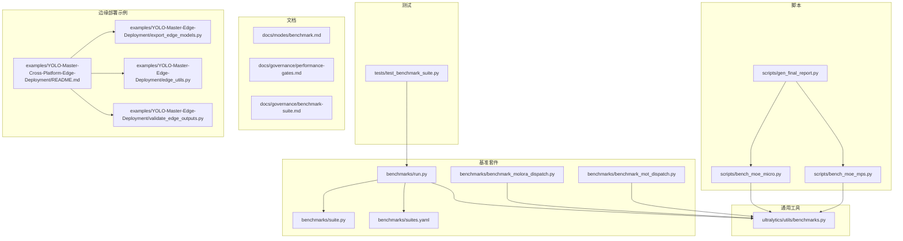
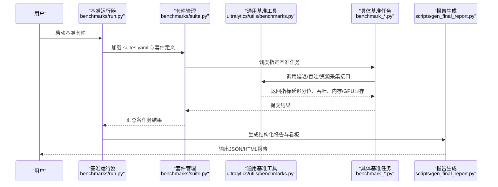
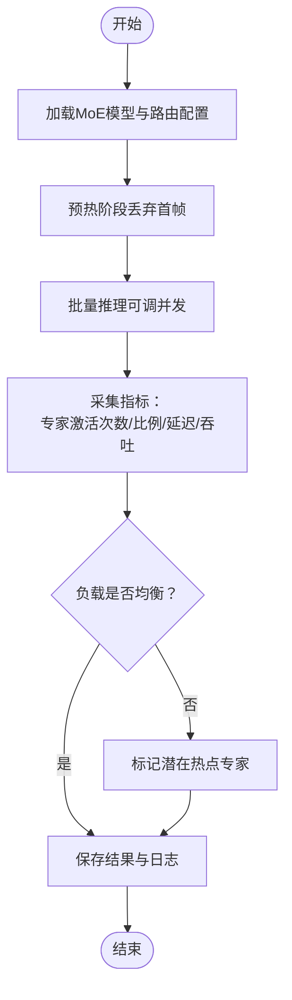
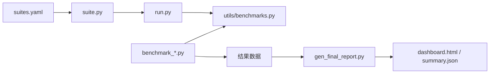

# 性能分析与基准测试

<cite>
**本文引用的文件**
- [benchmarks/run.py](file://benchmarks/run.py)
- [benchmarks/suite.py](file://benchmarks/suite.py)
- [benchmarks/suites.yaml](file://benchmarks/suites.yaml)
- [benchmarks/benchmark_molora_dispatch.py](file://benchmarks/benchmark_molora_dispatch.py)
- [benchmarks/benchmark_mot_dispatch.py](file://benchmarks/benchmark_mot_dispatch.py)
- [ultralytics/utils/benchmarks.py](file://ultralytics/utils/benchmarks.py)
- [scripts/bench_moe_micro.py](file://scripts/bench_moe_micro.py)
- [scripts/bench_moe_mps.py](file://scripts/bench_moe_mps.py)
- [tests/test_benchmark_suite.py](file://tests/test_benchmark_suite.py)
- [docs/governance/performance-gates.md](file://docs/governance/performance-gates.md)
- [docs/governance/benchmark-suite.md](file://docs/governance/benchmark-suite.md)
- [docs/modes/benchmark.md](file://docs/modes/benchmark.md)
- [examples/YOLO-Master-Cross-Platform-Edge-Deployment/README.md](file://examples/YOLO-Master-Cross-Platform-Edge-Deployment/README.md)
- [examples/YOLO-Master-Edge-Deployment/edge_utils.py](file://examples/YOLO-Master-Edge-Deployment/edge_utils.py)
- [examples/YOLO-Master-Edge-Deployment/export_edge_models.py](file://examples/YOLO-Master-Edge-Deployment/export_edge_models.py)
- [examples/YOLO-Master-Edge-Deployment/validate_edge_outputs.py](file://examples/YOLO-Master-Edge-Deployment/validate_edge_outputs.py)
- [scripts/gen_final_report.py](file://scripts/gen_final_report.py)
- [scripts/ablation_reports/dashboard.html](file://scripts/ablation_reports/dashboard.html)
- [scripts/ablation_reports/summary.json](file://scripts/ablation_reports/summary.json)
</cite>

## 目录
1. [简介](#简介)
2. [项目结构](#项目结构)
3. [核心组件](#核心组件)
4. [架构总览](#架构总览)
5. [详细组件分析](#详细组件分析)
6. [依赖关系分析](#依赖关系分析)
7. [性能考量](#性能考量)
8. [故障排查指南](#故障排查指南)
9. [结论](#结论)
10. [附录](#附录)

## 简介
本技术文档面向YOLO-Master的性能分析与基准测试系统，聚焦以下目标：
- 模型推理性能测试工具的使用方法：延迟测量、吞吐量分析、资源消耗监控
- 不同硬件平台（CPU、GPU、边缘设备）的基准测试流程与结果解读
- MoE模型的专家路由性能分析与负载均衡评估
- 内存使用分析与GPU显存优化的诊断方法
- 性能瓶颈识别与调优建议的分析工具
- 自定义基准测试用例的开发与集成方法
- 大规模数据集的性能评估与回归测试流程
- 性能数据的可视化与报告生成方法

## 项目结构
与性能分析和基准测试相关的代码主要分布在以下位置：
- benchmarks：基准套件定义与运行入口
- ultralytics/utils/benchmarks.py：通用基准工具（延迟、吞吐、预热等）
- scripts：MoE微基准、MPS基准、报告生成脚本
- tests：基准套件单元测试
- docs：基准模式说明与治理规范
- examples：跨平台与边缘部署示例（含导出与验证）

图表来源
- [benchmarks/run.py](file://benchmarks/run.py)
- [benchmarks/suite.py](file://benchmarks/suite.py)
- [benchmarks/suites.yaml](file://benchmarks/suites.yaml)
- [benchmarks/benchmark_molora_dispatch.py](file://benchmarks/benchmark_molora_dispatch.py)
- [benchmarks/benchmark_mot_dispatch.py](file://benchmarks/benchmark_mot_dispatch.py)
- [ultralytics/utils/benchmarks.py](file://ultralytics/utils/benchmarks.py)
- [scripts/bench_moe_micro.py](file://scripts/bench_moe_micro.py)
- [scripts/bench_moe_mps.py](file://scripts/bench_moe_mps.py)
- [tests/test_benchmark_suite.py](file://tests/test_benchmark_suite.py)
- [docs/modes/benchmark.md](file://docs/modes/benchmark.md)
- [docs/governance/performance-gates.md](file://docs/governance/performance-gates.md)
- [docs/governance/benchmark-suite.md](file://docs/governance/benchmark-suite.md)
- [examples/YOLO-Master-Cross-Platform-Edge-Deployment/README.md](file://examples/YOLO-Master-Cross-Platform-Edge-Deployment/README.md)
- [examples/YOLO-Master-Edge-Deployment/edge_utils.py](file://examples/YOLO-Master-Edge-Deployment/edge_utils.py)
- [examples/YOLO-Master-Edge-Deployment/export_edge_models.py](file://examples/YOLO-Master-Edge-Deployment/export_edge_models.py)
- [examples/YOLO-Master-Edge-Deployment/validate_edge_outputs.py](file://examples/YOLO-Master-Edge-Deployment/validate_edge_outputs.py)

章节来源
- [benchmarks/run.py](file://benchmarks/run.py)
- [benchmarks/suite.py](file://benchmarks/suite.py)
- [benchmarks/suites.yaml](file://benchmarks/suites.yaml)
- [ultralytics/utils/benchmarks.py](file://ultralytics/utils/benchmarks.py)
- [scripts/bench_moe_micro.py](file://scripts/bench_moe_micro.py)
- [scripts/bench_moe_mps.py](file://scripts/bench_moe_mps.py)
- [tests/test_benchmark_suite.py](file://tests/test_benchmark_suite.py)
- [docs/modes/benchmark.md](file://docs/modes/benchmark.md)
- [docs/governance/performance-gates.md](file://docs/governance/performance-gates.md)
- [docs/governance/benchmark-suite.md](file://docs/governance/benchmark-suite.md)
- [examples/YOLO-Master-Cross-Platform-Edge-Deployment/README.md](file://examples/YOLO-Master-Cross-Platform-Edge-Deployment/README.md)
- [examples/YOLO-Master-Edge-Deployment/edge_utils.py](file://examples/YOLO-Master-Edge-Deployment/edge_utils.py)
- [examples/YOLO-Master-Edge-Deployment/export_edge_models.py](file://examples/YOLO-Master-Edge-Deployment/export_edge_models.py)
- [examples/YOLO-Master-Edge-Deployment/validate_edge_outputs.py](file://examples/YOLO-Master-Edge-Deployment/validate_edge_outputs.py)

## 核心组件
- 基准套件运行器：负责加载套件配置、调度具体基准任务、汇总指标并输出结果。
- 通用基准工具：提供延迟统计、吞吐计算、预热策略、设备检测与资源采集接口。
- MoE专项基准：针对专家路由与负载分布的微基准，支持多后端（如CUDA/MPS）。
- 边缘部署示例：涵盖模型导出、运行时验证与跨平台部署流程。
- 报告与可视化：将基准结果聚合为结构化数据与HTML看板。

章节来源
- [benchmarks/run.py](file://benchmarks/run.py)
- [benchmarks/suite.py](file://benchmarks/suite.py)
- [ultralytics/utils/benchmarks.py](file://ultralytics/utils/benchmarks.py)
- [scripts/bench_moe_micro.py](file://scripts/bench_moe_micro.py)
- [scripts/bench_moe_mps.py](file://scripts/bench_moe_mps.py)
- [examples/YOLO-Master-Cross-Platform-Edge-Deployment/README.md](file://examples/YOLO-Master-Cross-Platform-Edge-Deployment/README.md)
- [scripts/gen_final_report.py](file://scripts/gen_final_report.py)

## 架构总览
下图展示了从“基准套件定义”到“执行与度量”，再到“报告与可视化”的整体流程。

图表来源
- [benchmarks/run.py](file://benchmarks/run.py)
- [benchmarks/suite.py](file://benchmarks/suite.py)
- [benchmarks/suites.yaml](file://benchmarks/suites.yaml)
- [benchmarks/benchmark_molora_dispatch.py](file://benchmarks/benchmark_molora_dispatch.py)
- [benchmarks/benchmark_mot_dispatch.py](file://benchmarks/benchmark_mot_dispatch.py)
- [ultralytics/utils/benchmarks.py](file://ultralytics/utils/benchmarks.py)
- [scripts/gen_final_report.py](file://scripts/gen_final_report.py)

## 详细组件分析

### 基准套件与运行器
- 套件定义：通过YAML描述基准任务集合、参数与环境约束，便于按场景组织测试。
- 运行器：解析套件、创建任务实例、并行或串行执行、收集指标并持久化。
- 关键职责：
  - 参数注入与设备选择（CPU/GPU/MPS）
  - 预热与冷启动控制
  - 指标聚合（P50/P90/P99、均值、方差）
  - 失败重试与错误上报

章节来源
- [benchmarks/suites.yaml](file://benchmarks/suites.yaml)
- [benchmarks/suite.py](file://benchmarks/suite.py)
- [benchmarks/run.py](file://benchmarks/run.py)

### 通用基准工具（延迟/吞吐/资源）
- 延迟测量：
  - 支持多次迭代统计，剔除首帧预热影响
  - 输出分位数与置信区间估计
- 吞吐分析：
  - 基于固定时间窗口的请求批处理计数
  - 支持并发度调节与队列长度限制
- 资源监控：
  - CPU利用率、内存占用
  - GPU显存峰值与平均占用（CUDA/MPS）
- 设备抽象：
  - 自动检测可用设备与驱动能力
  - 统一接口屏蔽后端差异

章节来源
- [ultralytics/utils/benchmarks.py](file://ultralytics/utils/benchmarks.py)

### MoE专家路由与负载均衡基准
- 路由性能：
  - 统计每个专家的激活频率与分配比例
  - 评估路由决策开销与稳定性
- 负载均衡：
  - 计算Gini系数或熵以衡量负载不均衡程度
  - 对比不同路由策略下的负载分布
- 后端适配：
  - CUDA路径优化与MPS路径验证
  - 异常路径（NaN/Inf）检测与回退

章节来源
- [benchmarks/benchmark_molora_dispatch.py](file://benchmarks/benchmark_molora_dispatch.py)
- [benchmarks/benchmark_mot_dispatch.py](file://benchmarks/benchmark_mot_dispatch.py)
- [scripts/bench_moe_micro.py](file://scripts/bench_moe_micro.py)
- [scripts/bench_moe_mps.py](file://scripts/bench_moe_mps.py)

#### MoE路由性能分析流程图

图表来源
- [benchmarks/benchmark_molora_dispatch.py](file://benchmarks/benchmark_molora_dispatch.py)
- [benchmarks/benchmark_mot_dispatch.py](file://benchmarks/benchmark_mot_dispatch.py)
- [scripts/bench_moe_micro.py](file://scripts/bench_moe_micro.py)

### 边缘设备部署与验证
- 模型导出：
  - 针对不同后端（ONNX/TensorRT/OpenVINO等）进行导出
  - 检查导出能力矩阵与兼容性
- 运行时验证：
  - 在边缘设备上执行推理并校验输出一致性
  - 记录延迟与显存占用
- 跨平台参考：
  - 提供Jetson、树莓派等平台的部署指引与脚本

章节来源
- [examples/YOLO-Master-Cross-Platform-Edge-Deployment/README.md](file://examples/YOLO-Master-Cross-Platform-Edge-Deployment/README.md)
- [examples/YOLO-Master-Edge-Deployment/export_edge_models.py](file://examples/YOLO-Master-Edge-Deployment/export_edge_models.py)
- [examples/YOLO-Master-Edge-Deployment/edge_utils.py](file://examples/YOLO-Master-Edge-Deployment/edge_utils.py)
- [examples/YOLO-Master-Edge-Deployment/validate_edge_outputs.py](file://examples/YOLO-Master-Edge-Deployment/validate_edge_outputs.py)

### 报告与可视化
- 结构化报告：
  - JSON格式汇总各任务指标、环境信息与版本指纹
- HTML看板：
  - 展示趋势图、分位数对比、专家负载热力图等
- 自动化生成：
  - 基于基准结果自动生成最终报告与摘要

章节来源
- [scripts/gen_final_report.py](file://scripts/gen_final_report.py)
- [scripts/ablation_reports/dashboard.html](file://scripts/ablation_reports/dashboard.html)
- [scripts/ablation_reports/summary.json](file://scripts/ablation_reports/summary.json)

## 依赖关系分析
- 套件层依赖运行器与配置文件；运行器依赖套件管理与通用基准工具。
- 具体基准任务依赖通用基准工具提供的延迟/吞吐/资源接口。
- 报告生成依赖基准任务的输出结构与元数据。

图表来源
- [benchmarks/suites.yaml](file://benchmarks/suites.yaml)
- [benchmarks/suite.py](file://benchmarks/suite.py)
- [benchmarks/run.py](file://benchmarks/run.py)
- [benchmarks/benchmark_molora_dispatch.py](file://benchmarks/benchmark_molora_dispatch.py)
- [benchmarks/benchmark_mot_dispatch.py](file://benchmarks/benchmark_mot_dispatch.py)
- [ultralytics/utils/benchmarks.py](file://ultralytics/utils/benchmarks.py)
- [scripts/gen_final_report.py](file://scripts/gen_final_report.py)
- [scripts/ablation_reports/dashboard.html](file://scripts/ablation_reports/dashboard.html)
- [scripts/ablation_reports/summary.json](file://scripts/ablation_reports/summary.json)

章节来源
- [benchmarks/suites.yaml](file://benchmarks/suites.yaml)
- [benchmarks/suite.py](file://benchmarks/suite.py)
- [benchmarks/run.py](file://benchmarks/run.py)
- [ultralytics/utils/benchmarks.py](file://ultralytics/utils/benchmarks.py)
- [scripts/gen_final_report.py](file://scripts/gen_final_report.py)

## 性能考量
- 预热与冷启动：
  - 首次推理包含初始化与编译开销，应排除在统计之外
- 并发与批大小：
  - 吞吐随并发度提升而增加，但需避免队列溢出与OOM
- 设备差异：
  - CPU路径受线程数与NUMA影响；GPU路径受显存带宽与内核融合影响
- MoE路由：
  - 热点专家会导致尾延迟升高，需结合路由策略与剪枝/校准
- 内存与显存：
  - 监控峰值与碎片，必要时启用梯度释放与缓存回收

[本节为通用指导，无需特定文件引用]

## 故障排查指南
- 常见错误定位：
  - 设备不可用或驱动缺失：检查设备检测逻辑与后端可用性
  - 显存不足：降低批大小或并发度，启用显存清理
  - NaN/Inf：检查数值稳定性与路由权重范围
- 调试手段：
  - 开启详细日志与中间指标输出
  - 使用MPS/CUDA路径分别验证，隔离平台问题
- 回归测试：
  - 通过基准套件单元测试确保关键路径稳定

章节来源
- [tests/test_benchmark_suite.py](file://tests/test_benchmark_suite.py)
- [scripts/bench_moe_mps.py](file://scripts/bench_moe_mps.py)
- [scripts/bench_moe_micro.py](file://scripts/bench_moe_micro.py)

## 结论
本系统提供了端到端的性能分析与基准测试能力，覆盖延迟、吞吐、资源监控与MoE路由评估，并通过标准化套件与报告机制保障可重复性与可追溯性。建议在CI中集成性能门禁与回归测试，持续跟踪模型与后端的演进对性能的影响。

[本节为总结，无需特定文件引用]

## 附录

### 使用方法速览
- 运行基准套件：
  - 通过运行器加载套件配置并执行任务
- 查看文档：
  - 参考基准模式说明与治理规范
- 边缘部署：
  - 参考跨平台与边缘部署示例中的导出与验证流程

章节来源
- [docs/modes/benchmark.md](file://docs/modes/benchmark.md)
- [docs/governance/performance-gates.md](file://docs/governance/performance-gates.md)
- [docs/governance/benchmark-suite.md](file://docs/governance/benchmark-suite.md)
- [examples/YOLO-Master-Cross-Platform-Edge-Deployment/README.md](file://examples/YOLO-Master-Cross-Platform-Edge-Deployment/README.md)