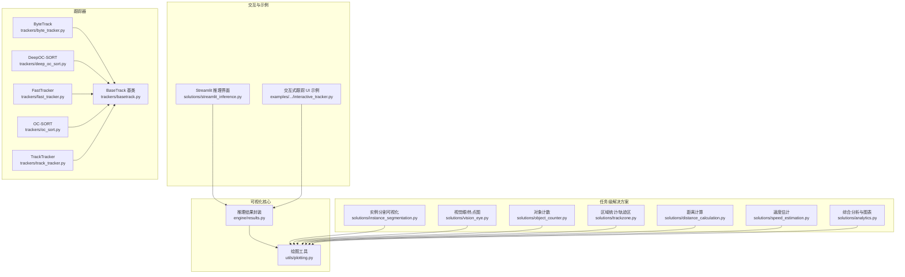
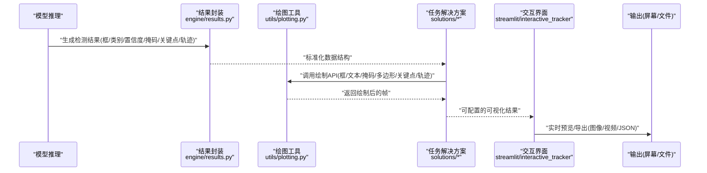
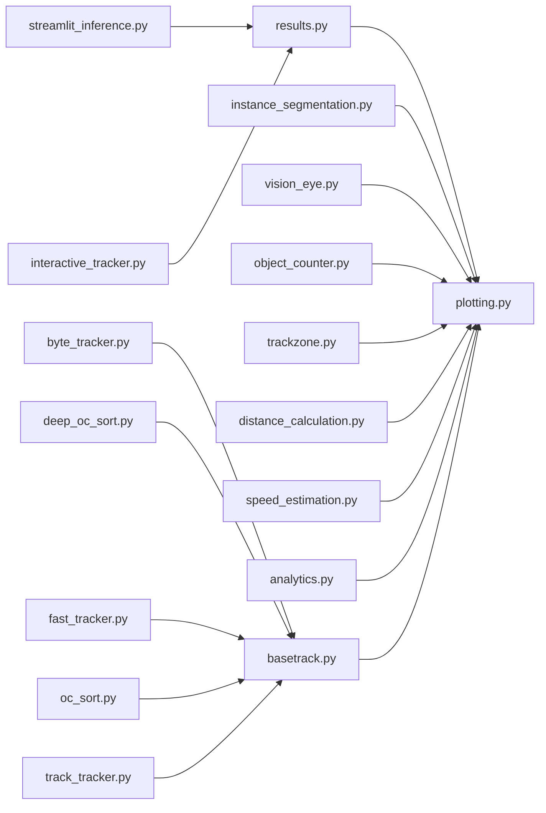

# 推理结果可视化

<cite>
**本文引用的文件**
- [ultralytics/utils/plotting.py](file://ultralytics/utils/plotting.py)
- [ultralytics/engine/results.py](file://ultralytics/engine/results.py)
- [ultralytics/solutions/streamlit_inference.py](file://ultralytics/solutions/streamlit_inference.py)
- [examples/YOLO-Interactive-Tracking-UI/interactive_tracker.py](file://examples/YOLO-Interactive-Tracking-UI/interactive_tracker.py)
- [ultralytics/solutions/instance_segmentation.py](file://ultralytics/solutions/instance_segmentation.py)
- [ultralytics/solutions/vision_eye.py](file://ultralytics/solutions/vision_eye.py)
- [ultralytics/solutions/object_counter.py](file://ultralytics/solutions/object_counter.py)
- [ultralytics/solutions/trackzone.py](file://ultralytics/solutions/trackzone.py)
- [ultralytics/solutions/distance_calculation.py](file://ultralytics/solutions/distance_calculation.py)
- [ultralytics/solutions/speed_estimation.py](file://ultralytics/solutions/speed_estimation.py)
- [ultralytics/solutions/analytics.py](file://ultralytics/solutions/analytics.py)
- [ultralytics/trackers/basetrack.py](file://ultralytics/trackers/basetrack.py)
- [ultralytics/trackers/byte_tracker.py](file://ultralytics/trackers/byte_tracker.py)
- [ultralytics/trackers/deep_oc_sort.py](file://ultralytics/trackers/deep_oc_sort.py)
- [ultralytics/trackers/fast_tracker.py](file://ultralytics/trackers/fast_tracker.py)
- [ultralytics/trackers/oc_sort.py](file://ultralytics/trackers/oc_sort.py)
- [ultralytics/trackers/track_tracker.py](file://ultralytics/trackers/track_tracker.py)
</cite>

## 目录
1. [简介](#简介)
2. [项目结构](#项目结构)
3. [核心组件](#核心组件)
4. [架构总览](#架构总览)
5. [详细组件分析](#详细组件分析)
6. [依赖关系分析](#依赖关系分析)
7. [性能考虑](#性能考虑)
8. [故障排查指南](#故障排查指南)
9. [结论](#结论)
10. [附录](#附录)

## 简介
本技术文档聚焦于 YOLO-Master 的推理结果可视化系统，覆盖以下能力：
- 目标检测：边界框绘制、类别标签与置信度标注、颜色映射方案
- 实例分割：掩码叠加与多边形绘制
- 姿态估计：关键点连接线与骨骼结构可视化
- 多目标跟踪：轨迹绘制与 ID 保持显示
- 交互式界面：实时预览、参数调整、结果导出
- 自定义样式与主题配置
- 批量处理优化策略
- 视频流处理与实时渲染的性能优化技巧

## 项目结构
可视化相关代码主要分布在以下模块：
- 通用绘图工具与数据绑定：ultralytics/utils/plotting.py、ultralytics/engine/results.py
- 解决方案层（面向任务）：ultralytics/solutions/*（如实例分割、视觉眼、计数、测距、速度估计等）
- 交互与演示：examples/YOLO-Interactive-Tracking-UI/interactive_tracker.py、ultralytics/solutions/streamlit_inference.py
- 跟踪器实现：ultralytics/trackers/*（提供轨迹、ID 等元数据）

图示来源
- [ultralytics/utils/plotting.py](file://ultralytics/utils/plotting.py)
- [ultralytics/engine/results.py](file://ultralytics/engine/results.py)
- [ultralytics/solutions/instance_segmentation.py](file://ultralytics/solutions/instance_segmentation.py)
- [ultralytics/solutions/vision_eye.py](file://ultralytics/solutions/vision_eye.py)
- [ultralytics/solutions/object_counter.py](file://ultralytics/solutions/object_counter.py)
- [ultralytics/solutions/trackzone.py](file://ultralytics/solutions/trackzone.py)
- [ultralytics/solutions/distance_calculation.py](file://ultralytics/solutions/distance_calculation.py)
- [ultralytics/solutions/speed_estimation.py](file://ultralytics/solutions/speed_estimation.py)
- [ultralytics/solutions/analytics.py](file://ultralytics/solutions/analytics.py)
- [ultralytics/solutions/streamlit_inference.py](file://ultralytics/solutions/streamlit_inference.py)
- [examples/YOLO-Interactive-Tracking-UI/interactive_tracker.py](file://examples/YOLO-Interactive-Tracking-UI/interactive_tracker.py)
- [ultralytics/trackers/byte_tracker.py](file://ultralytics/trackers/byte_tracker.py)
- [ultralytics/trackers/deep_oc_sort.py](file://ultralytics/trackers/deep_oc_sort.py)
- [ultralytics/trackers/fast_tracker.py](file://ultralytics/trackers/fast_tracker.py)
- [ultralytics/trackers/oc_sort.py](file://ultralytics/trackers/oc_sort.py)
- [ultralytics/trackers/track_tracker.py](file://ultralytics/trackers/track_tracker.py)
- [ultralytics/trackers/basetrack.py](file://ultralytics/trackers/basetrack.py)

章节来源
- [ultralytics/utils/plotting.py](file://ultralytics/utils/plotting.py)
- [ultralytics/engine/results.py](file://ultralytics/engine/results.py)
- [ultralytics/solutions/streamlit_inference.py](file://ultralytics/solutions/streamlit_inference.py)
- [examples/YOLO-Interactive-Tracking-UI/interactive_tracker.py](file://examples/YOLO-Interactive-Tracking-UI/interactive_tracker.py)

## 核心组件
- 绘图工具集（utils/plotting.py）
  - 负责统一的绘制原语：矩形框、文本、线段、多边形、半透明蒙版、颜色映射、字体与字号控制、透明度与线宽设置等。
  - 提供对检测结果（框、类别、置信度）、分割掩码、关键点及骨架边、轨迹点序列的统一绘制接口。
- 推理结果封装（engine/results.py）
  - 将模型输出标准化为统一的数据结构，包含框坐标、类别索引、置信度、分割掩码、关键点坐标、跟踪 ID、轨迹历史等字段，供绘图工具直接消费。
- 任务级解决方案（solutions/*）
  - 在通用绘图之上，组合业务逻辑与可视化：例如实例分割的掩码叠加、视觉眼的热力图叠加、计数与测距/速度估计的指标绘制、轨迹区的统计展示等。
- 交互界面（streamlit_inference.py、interactive_tracker.py）
  - 提供实时预览、参数调节（阈值、颜色、透明度、线宽、字体大小等）、结果导出（图像/视频/JSON）等能力。
- 跟踪器（trackers/*）
  - 维护目标 ID、轨迹点序列、匹配状态等，为可视化提供轨迹绘制与 ID 显示所需数据。

章节来源
- [ultralytics/utils/plotting.py](file://ultralytics/utils/plotting.py)
- [ultralytics/engine/results.py](file://ultralytics/engine/results.py)
- [ultralytics/solutions/instance_segmentation.py](file://ultralytics/solutions/instance_segmentation.py)
- [ultralytics/solutions/vision_eye.py](file://ultralytics/solutions/vision_eye.py)
- [ultralytics/solutions/object_counter.py](file://ultralytics/solutions/object_counter.py)
- [ultralytics/solutions/trackzone.py](file://ultralytics/solutions/trackzone.py)
- [ultralytics/solutions/distance_calculation.py](file://ultralytics/solutions/distance_calculation.py)
- [ultralytics/solutions/speed_estimation.py](file://ultralytics/solutions/speed_estimation.py)
- [ultralytics/solutions/analytics.py](file://ultralytics/solutions/analytics.py)
- [ultralytics/solutions/streamlit_inference.py](file://ultralytics/solutions/streamlit_inference.py)
- [examples/YOLO-Interactive-Tracking-UI/interactive_tracker.py](file://examples/YOLO-Interactive-Tracking-UI/interactive_tracker.py)
- [ultralytics/trackers/basetrack.py](file://ultralytics/trackers/basetrack.py)
- [ultralytics/trackers/byte_tracker.py](file://ultralytics/trackers/byte_tracker.py)
- [ultralytics/trackers/deep_oc_sort.py](file://ultralytics/trackers/deep_oc_sort.py)
- [ultralytics/trackers/fast_tracker.py](file://ultralytics/trackers/fast_tracker.py)
- [ultralytics/trackers/oc_sort.py](file://ultralytics/trackers/oc_sort.py)
- [ultralytics/trackers/track_tracker.py](file://ultralytics/trackers/track_tracker.py)

## 架构总览
下图展示了从“推理结果”到“最终可视化画面”的关键路径，以及各组件之间的依赖关系。

图示来源
- [ultralytics/engine/results.py](file://ultralytics/engine/results.py)
- [ultralytics/utils/plotting.py](file://ultralytics/utils/plotting.py)
- [ultralytics/solutions/instance_segmentation.py](file://ultralytics/solutions/instance_segmentation.py)
- [ultralytics/solutions/streamlit_inference.py](file://ultralytics/solutions/streamlit_inference.py)
- [examples/YOLO-Interactive-Tracking-UI/interactive_tracker.py](file://examples/YOLO-Interactive-Tracking-UI/interactive_tracker.py)

## 详细组件分析

### 目标检测可视化（边界框、类别标签、置信度、颜色映射）
- 绘制流程
  - 从 results 中读取框坐标、类别索引与置信度
  - 使用绘图工具绘制矩形框、文本标签（类别+置信度）
  - 通过颜色映射为不同类别分配稳定色板
- 关键要点
  - 文本位置与背景遮罩避免遮挡
  - 线宽与字体大小随分辨率自适应
  - 置信度阈值过滤低分结果
- 典型调用路径
  - 参考：[ultralytics/utils/plotting.py](file://ultralytics/utils/plotting.py)、[ultralytics/engine/results.py](file://ultralytics/engine/results.py)

章节来源
- [ultralytics/utils/plotting.py](file://ultralytics/utils/plotting.py)
- [ultralytics/engine/results.py](file://ultralytics/engine/results.py)

### 实例分割可视化（掩码叠加、多边形绘制）
- 绘制流程
  - 读取每个实例的掩码与轮廓
  - 将掩码以半透明方式叠加到原图
  - 可选绘制多边形轮廓增强边界可见性
- 关键要点
  - 掩码缩放至输入尺寸，注意插值与边界对齐
  - 透明度可调，避免遮挡重要信息
  - 多边形采样与简化以提升性能
- 典型调用路径
  - 参考：[ultralytics/solutions/instance_segmentation.py](file://ultralytics/solutions/instance_segmentation.py)、[ultralytics/utils/plotting.py](file://ultralytics/utils/plotting.py)

章节来源
- [ultralytics/solutions/instance_segmentation.py](file://ultralytics/solutions/instance_segmentation.py)
- [ultralytics/utils/plotting.py](file://ultralytics/utils/plotting.py)

### 姿态估计可视化（关键点连线、骨骼结构）
- 绘制流程
  - 读取关键点坐标与骨架连接关系
  - 按预设骨骼顺序绘制线段与关键点标记
- 关键要点
  - 关键点可见性阈值过滤
  - 骨架颜色与粗细区分关节与肢体
  - 支持旋转/缩放后坐标变换一致性
- 典型调用路径
  - 参考：[ultralytics/utils/plotting.py](file://ultralytics/utils/plotting.py)、[ultralytics/engine/results.py](file://ultralytics/engine/results.py)

章节来源
- [ultralytics/utils/plotting.py](file://ultralytics/utils/plotting.py)
- [ultralytics/engine/results.py](file://ultralytics/engine/results.py)

### 多目标跟踪可视化（轨迹绘制、ID 保持显示）
- 绘制流程
  - 从跟踪器获取每目标的 ID 与轨迹点序列
  - 绘制轨迹折线（可带时间衰减或渐变色）
  - 在目标附近显示 ID 标签
- 关键要点
  - 轨迹平滑与抽稀以降低渲染开销
  - ID 稳定性与丢失恢复策略影响显示连续性
  - 轨迹长度限制与内存管理
- 典型调用路径
  - 参考：[ultralytics/trackers/basetrack.py](file://ultralytics/trackers/basetrack.py)、[ultralytics/trackers/byte_tracker.py](file://ultralytics/trackers/byte_tracker.py)、[ultralytics/trackers/deep_oc_sort.py](file://ultralytics/trackers/deep_oc_sort.py)、[ultralytics/trackers/fast_tracker.py](file://ultralytics/trackers/fast_tracker.py)、[ultralytics/trackers/oc_sort.py](file://ultralytics/trackers/oc_sort.py)、[ultralytics/trackers/track_tracker.py](file://ultralytics/trackers/track_tracker.py)、[ultralytics/utils/plotting.py](file://ultralytics/utils/plotting.py)

章节来源
- [ultralytics/trackers/basetrack.py](file://ultralytics/trackers/basetrack.py)
- [ultralytics/trackers/byte_tracker.py](file://ultralytics/trackers/byte_tracker.py)
- [ultralytics/trackers/deep_oc_sort.py](file://ultralytics/trackers/deep_oc_sort.py)
- [ultralytics/trackers/fast_tracker.py](file://ultralytics/trackers/fast_tracker.py)
- [ultralytics/trackers/oc_sort.py](file://ultralytics/trackers/oc_sort.py)
- [ultralytics/trackers/track_tracker.py](file://ultralytics/trackers/track_tracker.py)
- [ultralytics/utils/plotting.py](file://ultralytics/utils/plotting.py)

### 交互式可视化界面（实时预览、参数调整、结果导出）
- 功能概览
  - 实时预览：加载摄像头/视频流，逐帧推理并绘制
  - 参数调整：阈值、颜色、透明度、线宽、字体大小、是否显示掩码/关键点/轨迹等
  - 结果导出：保存当前帧图像、录制视频、导出结构化结果（JSON）
- 典型入口
  - Streamlit 界面：[ultralytics/solutions/streamlit_inference.py](file://ultralytics/solutions/streamlit_inference.py)
  - 交互式跟踪示例：[examples/YOLO-Interactive-Tracking-UI/interactive_tracker.py](file://examples/YOLO-Interactive-Tracking-UI/interactive_tracker.py)
- 用户操作建议
  - 先调阈值与类别过滤，再微调颜色与透明度
  - 大数据量场景关闭不必要的可视化（如掩码/轨迹）
  - 导出前确认分辨率与编码格式

章节来源
- [ultralytics/solutions/streamlit_inference.py](file://ultralytics/solutions/streamlit_inference.py)
- [examples/YOLO-Interactive-Tracking-UI/interactive_tracker.py](file://examples/YOLO-Interactive-Tracking-UI/interactive_tracker.py)

### 自定义可视化样式与主题配置
- 可配置项
  - 颜色映射：类别到颜色的映射表、随机种子、色板风格
  - 线条与文本：线宽、字体大小、文本背景透明度、边框圆角
  - 掩码与多边形：透明度、轮廓宽度、采样密度
  - 轨迹：颜色渐变、最大长度、平滑系数
- 配置位置
  - 绘图工具集中式参数：[ultralytics/utils/plotting.py](file://ultralytics/utils/plotting.py)
  - 任务级解决方案中的默认样式：如 [ultralytics/solutions/instance_segmentation.py](file://ultralytics/solutions/instance_segmentation.py)、[ultralytics/solutions/vision_eye.py](file://ultralytics/solutions/vision_eye.py)
- 最佳实践
  - 将常用样式封装为“主题”，通过配置文件或环境变量切换
  - 针对深色/浅色背景分别设计对比度更高的配色

章节来源
- [ultralytics/utils/plotting.py](file://ultralytics/utils/plotting.py)
- [ultralytics/solutions/instance_segmentation.py](file://ultralytics/solutions/instance_segmentation.py)
- [ultralytics/solutions/vision_eye.py](file://ultralytics/solutions/vision_eye.py)

### 批量处理的可视化优化策略
- 批内并行
  - 对批次内样本并行绘制，减少 Python 层循环开销
- 资源复用
  - 重用画布、颜色缓存、字体对象，避免重复创建
- 降采样与抽稀
  - 对高分辨率图像进行下采样绘制，必要时再放大输出
  - 轨迹点与多边形顶点抽稀
- 异步与流水线
  - 推理、绘制、I/O 分离，使用队列缓冲帧
- 存储与传输
  - 批量导出时采用高效编码（如 H.264/H.265），按需压缩质量

章节来源
- [ultralytics/utils/plotting.py](file://ultralytics/utils/plotting.py)
- [ultralytics/solutions/streamlit_inference.py](file://ultralytics/solutions/streamlit_inference.py)

### 视频流处理与实时渲染的性能优化技巧
- 解码与预处理
  - 使用硬件加速解码（NVDEC/VAAPI/MediaFoundation）
  - 预分配缓冲区，减少内存分配抖动
- 推理与绘制
  - 固定输入尺寸，避免频繁 resize
  - 关闭不必要的可视化通道（掩码/轨迹/关键点）
- 渲染与输出
  - 使用 GPU 后端渲染（如 OpenGL/Vulkan）或更快的 GUI 库
  - 降低输出分辨率或帧率，平衡流畅度与细节
- 监控与诊断
  - 记录端到端延迟、GPU/CPU 占用、丢帧率，定位瓶颈

章节来源
- [ultralytics/solutions/streamlit_inference.py](file://ultralytics/solutions/streamlit_inference.py)
- [examples/YOLO-Interactive-Tracking-UI/interactive_tracker.py](file://examples/YOLO-Interactive-Tracking-UI/interactive_tracker.py)

## 依赖关系分析
- 组件耦合
  - solutions/* 强依赖 plotting 与 results；tracking 子系统通过 basetrack 协议提供轨迹数据
- 外部依赖
  - 图形库（OpenCV/GUI）、编解码库（FFmpeg/硬件编解码）、Web 框架（Streamlit）
- 潜在环依赖
  - 确保 solutions 不反向导入 trackers，仅通过 results 与 plotting 解耦

图示来源
- [ultralytics/engine/results.py](file://ultralytics/engine/results.py)
- [ultralytics/utils/plotting.py](file://ultralytics/utils/plotting.py)
- [ultralytics/solutions/instance_segmentation.py](file://ultralytics/solutions/instance_segmentation.py)
- [ultralytics/solutions/vision_eye.py](file://ultralytics/solutions/vision_eye.py)
- [ultralytics/solutions/object_counter.py](file://ultralytics/solutions/object_counter.py)
- [ultralytics/solutions/trackzone.py](file://ultralytics/solutions/trackzone.py)
- [ultralytics/solutions/distance_calculation.py](file://ultralytics/solutions/distance_calculation.py)
- [ultralytics/solutions/speed_estimation.py](file://ultralytics/solutions/speed_estimation.py)
- [ultralytics/solutions/analytics.py](file://ultralytics/solutions/analytics.py)
- [ultralytics/trackers/basetrack.py](file://ultralytics/trackers/basetrack.py)
- [ultralytics/trackers/byte_tracker.py](file://ultralytics/trackers/byte_tracker.py)
- [ultralytics/trackers/deep_oc_sort.py](file://ultralytics/trackers/deep_oc_sort.py)
- [ultralytics/trackers/fast_tracker.py](file://ultralytics/trackers/fast_tracker.py)
- [ultralytics/trackers/oc_sort.py](file://ultralytics/trackers/oc_sort.py)
- [ultralytics/trackers/track_tracker.py](file://ultralytics/trackers/track_tracker.py)
- [ultralytics/solutions/streamlit_inference.py](file://ultralytics/solutions/streamlit_inference.py)
- [examples/YOLO-Interactive-Tracking-UI/interactive_tracker.py](file://examples/YOLO-Interactive-Tracking-UI/interactive_tracker.py)

## 性能考虑
- 渲染管线
  - 合并多次绘制调用，减少上下文切换
  - 使用批量绘制 API 与纹理上传优化
- 内存与缓存
  - 缓存颜色映射、字体、掩码模板
  - 限制轨迹长度与多边形顶点数
- I/O 与编码
  - 选择合适编码器与质量等级，避免 CPU 过载
  - 落盘采用异步写入与缓冲
- 设备利用
  - 尽可能在 GPU 上完成预处理/后处理与绘制
  - 合理分配线程池，避免锁竞争

## 故障排查指南
- 常见问题
  - 标签重叠或遮挡：调整文本位置、背景透明度或字体大小
  - 掩码错位：检查坐标缩放与裁剪边界
  - 轨迹闪烁或断裂：检查跟踪器 ID 稳定性与轨迹平滑参数
  - 实时卡顿：关闭非必要可视化、降低分辨率/帧率、启用硬件解码
- 定位方法
  - 逐步开启可视化选项，观察性能变化
  - 打印关键路径耗时（解码、推理、绘制、编码）
  - 使用系统监控工具观察 CPU/GPU/内存占用

章节来源
- [ultralytics/solutions/streamlit_inference.py](file://ultralytics/solutions/streamlit_inference.py)
- [examples/YOLO-Interactive-Tracking-UI/interactive_tracker.py](file://examples/YOLO-Interactive-Tracking-UI/interactive_tracker.py)

## 结论
YOLO-Master 的可视化体系以统一的绘图工具与标准化的结果封装为核心，结合任务级解决方案与交互式界面，提供了从检测、分割、姿态到跟踪的全栈可视化能力。通过合理的样式配置、批量优化与视频流性能调优，可在保证可视效果的同时满足实时性与大规模处理需求。

## 附录
- 快速上手
  - 启动 Streamlit 界面进行实时预览与导出：参考 [ultralytics/solutions/streamlit_inference.py](file://ultralytics/solutions/streamlit_inference.py)
  - 运行交互式跟踪示例：参考 [examples/YOLO-Interactive-Tracking-UI/interactive_tracker.py](file://examples/YOLO-Interactive-Tracking-UI/interactive_tracker.py)
- 扩展建议
  - 新增可视化元素时，优先在 plotting 中实现通用绘制函数，再由 solutions 组合调用
  - 为不同任务定义独立的主题配置，便于一键切换