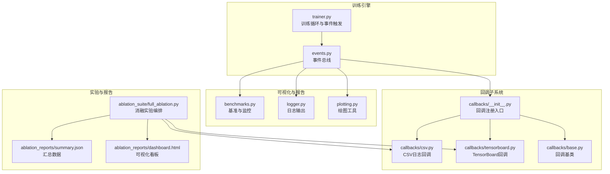
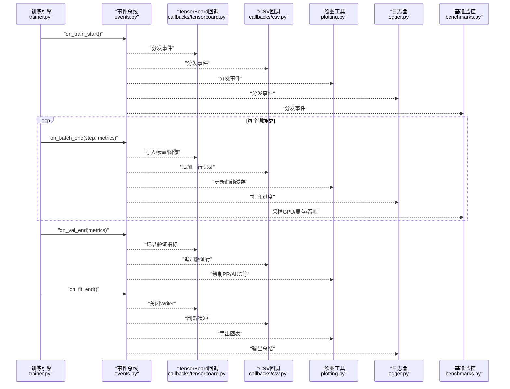
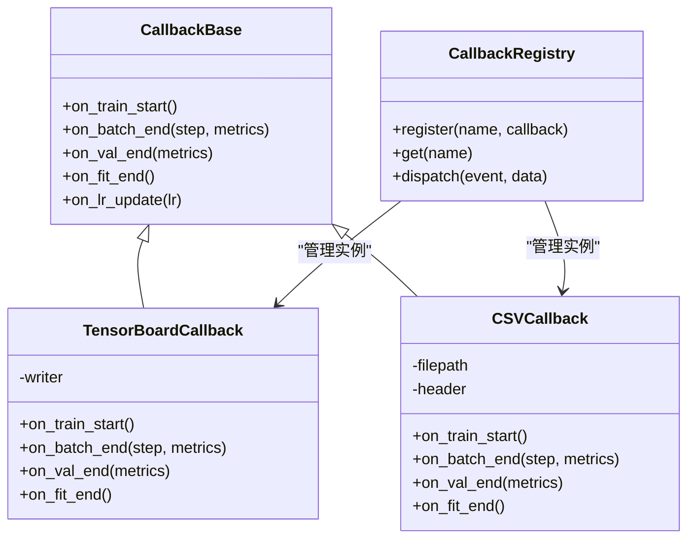
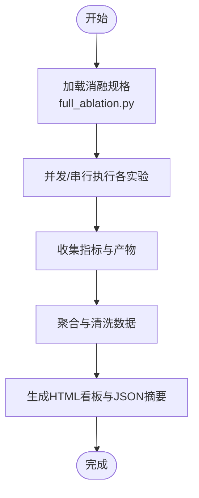
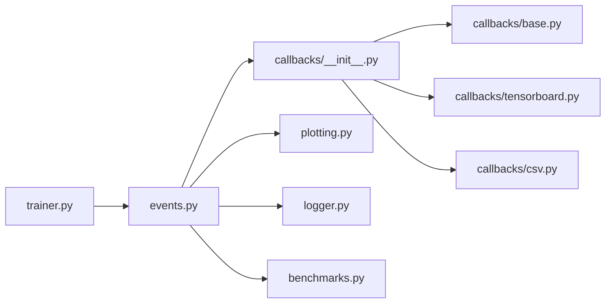

# 训练可视化

<cite>
**本文引用的文件**
- [engine/trainer.py](file://ultralytics/engine/trainer.py)
- [utils/callbacks/__init__.py](file://ultralytics/utils/callbacks/__init__.py)
- [utils/callbacks/base.py](file://ultralytics/utils/callbacks/base.py)
- [utils/callbacks/tensorboard.py](file://ultralytics/utils/callbacks/tensorboard.py)
- [utils/callbacks/csv.py](file://ultralytics/utils/callbacks/csv.py)
- [utils/events.py](file://ultralytics/utils/events.py)
- [utils/plotting.py](file://ultralytics/utils/plotting.py)
- [utils/logger.py](file://ultralytics/utils/logger.py)
- [utils/benchmarks.py](file://ultralytics/utils/benchmarks.py)
- [scripts/ablation_suite/full_ablation.py](file://scripts/ablation_suite/full_ablation.py)
- [scripts/ablation_reports/dashboard.html](file://scripts/ablation_reports/dashboard.html)
- [scripts/ablation_reports/summary.json](file://scripts/ablation_reports/summary.json)
- [examples/YOLOv8-MNN-CPP/main.py](file://examples/YOLOv8-MNN-CPP/main.py)
</cite>

## 目录
1. [简介](#简介)
2. [项目结构](#项目结构)
3. [核心组件](#核心组件)
4. [架构总览](#架构总览)
5. [详细组件分析](#详细组件分析)
6. [依赖关系分析](#依赖关系分析)
7. [性能考量](#性能考量)
8. [故障排查指南](#故障排查指南)
9. [结论](#结论)
10. [附录](#附录)

## 简介
本技术文档面向YOLO-Master的训练可视化系统，聚焦于训练过程中的图表与指标可视化（损失曲线、学习率变化、评估指标趋势等），并深入说明以下能力：
- TensorBoard集成与CSV日志记录
- 自定义回调开发方法
- 训练进度监控工具（GPU利用率、显存占用、训练速度）
- 实验对比与消融研究报告生成
- 训练异常检测与诊断工具链
- 可视化配置选项与自定义图表开发指南
- 分布式训练环境下的可视化方案

## 项目结构
训练可视化相关代码主要分布在以下模块：
- 训练引擎与事件总线：负责在训练生命周期中触发事件、收集指标并分发给回调
- 回调子系统：提供TensorBoard、CSV等内置回调，以及扩展点用于自定义回调
- 绘图与报告：将指标绘制为图表或导出为HTML/JSON报告
- 基准与监控：采集训练速度、GPU/显存使用等运行时信息
- 消融实验脚本：批量运行不同配置并汇总结果，生成对比报告

图示来源
- [engine/trainer.py](file://ultralytics/engine/trainer.py)
- [utils/events.py](file://ultralytics/utils/events.py)
- [utils/callbacks/__init__.py](file://ultralytics/utils/callbacks/__init__.py)
- [utils/callbacks/base.py](file://ultralytics/utils/callbacks/base.py)
- [utils/callbacks/tensorboard.py](file://ultralytics/utils/callbacks/tensorboard.py)
- [utils/callbacks/csv.py](file://ultralytics/utils/callbacks/csv.py)
- [utils/plotting.py](file://ultralytics/utils/plotting.py)
- [utils/logger.py](file://ultralytics/utils/logger.py)
- [utils/benchmarks.py](file://ultralytics/utils/benchmarks.py)
- [scripts/ablation_suite/full_ablation.py](file://scripts/ablation_suite/full_ablation.py)
- [scripts/ablation_reports/dashboard.html](file://scripts/ablation_reports/dashboard.html)
- [scripts/ablation_reports/summary.json](file://scripts/ablation_reports/summary.json)

章节来源
- [engine/trainer.py](file://ultralytics/engine/trainer.py)
- [utils/callbacks/__init__.py](file://ultralytics/utils/callbacks/__init__.py)
- [utils/callbacks/base.py](file://ultralytics/utils/callbacks/base.py)
- [utils/callbacks/tensorboard.py](file://ultralytics/utils/callbacks/tensorboard.py)
- [utils/callbacks/csv.py](file://ultralytics/utils/callbacks/csv.py)
- [utils/events.py](file://ultralytics/utils/events.py)
- [utils/plotting.py](file://ultralytics/utils/plotting.py)
- [utils/logger.py](file://ultralytics/utils/logger.py)
- [utils/benchmarks.py](file://ultralytics/utils/benchmarks.py)
- [scripts/ablation_suite/full_ablation.py](file://scripts/ablation_suite/full_ablation.py)
- [scripts/ablation_reports/dashboard.html](file://scripts/ablation_reports/dashboard.html)
- [scripts/ablation_reports/summary.json](file://scripts/ablation_reports/summary.json)

## 核心组件
- 训练引擎与事件总线
  - 训练循环在关键阶段（初始化、每步、每轮、验证结束、训练结束等）触发事件，携带指标字典与上下文。
  - 事件总线统一分发，确保回调可插拔且互不干扰。
- 回调子系统
  - 提供基类定义回调接口，内置TensorBoard与CSV回调，支持用户自定义回调扩展。
  - 回调订阅事件，执行记录、绘图、保存模型、发送通知等操作。
- 可视化与报告
  - 绘图工具将指标转换为曲线图、散点图等；日志器输出结构化文本；基准模块采集训练速度与硬件资源。
- 消融实验与报告
  - 编排多组实验，聚合结果，生成HTML看板与JSON摘要，便于横向对比与复现。

章节来源
- [utils/callbacks/base.py](file://ultralytics/utils/callbacks/base.py)
- [utils/callbacks/__init__.py](file://ultralytics/utils/callbacks/__init__.py)
- [utils/events.py](file://ultralytics/utils/events.py)
- [utils/plotting.py](file://ultralytics/utils/plotting.py)
- [utils/logger.py](file://ultralytics/utils/logger.py)
- [utils/benchmarks.py](file://ultralytics/utils/benchmarks.py)

## 架构总览
下图展示了训练过程中从“事件触发”到“回调处理”再到“可视化输出”的端到端流程。

图示来源
- [engine/trainer.py](file://ultralytics/engine/trainer.py)
- [utils/events.py](file://ultralytics/utils/events.py)
- [utils/callbacks/tensorboard.py](file://ultralytics/utils/callbacks/tensorboard.py)
- [utils/callbacks/csv.py](file://ultralytics/utils/callbacks/csv.py)
- [utils/plotting.py](file://ultralytics/utils/plotting.py)
- [utils/logger.py](file://ultralytics/utils/logger.py)
- [utils/benchmarks.py](file://ultralytics/utils/benchmarks.py)

## 详细组件分析

### 训练引擎与事件总线
- 职责
  - 管理训练生命周期，维护优化器、调度器、EMA、验证器等。
  - 在关键节点调用事件总线，附带当前步数、指标、配置等信息。
- 关键点
  - 事件命名规范清晰，如“开始/结束/批/验证/学习率更新”等。
  - 指标字典包含损失分量、学习率、评估指标、时间戳等。
- 建议
  - 新增指标时优先通过事件传递，避免耦合具体回调实现。

章节来源
- [engine/trainer.py](file://ultralytics/engine/trainer.py)
- [utils/events.py](file://ultralytics/utils/events.py)

### 回调子系统（基类与注册）
- 设计模式
  - 基于观察者模式：回调订阅事件，事件总线负责分发。
  - 基类定义统一接口，便于扩展与测试。
- 内置回调
  - TensorBoard回调：将标量、图像、直方图写入TensorBoard日志目录。
  - CSV回调：以表格形式持久化指标，便于离线分析与自动化流水线。
- 扩展点
  - 自定义回调只需继承基类并实现相应钩子方法，即可接入训练流程。

图示来源
- [utils/callbacks/base.py](file://ultralytics/utils/callbacks/base.py)
- [utils/callbacks/tensorboard.py](file://ultralytics/utils/callbacks/tensorboard.py)
- [utils/callbacks/csv.py](file://ultralytics/utils/callbacks/csv.py)
- [utils/callbacks/__init__.py](file://ultralytics/utils/callbacks/__init__.py)

章节来源
- [utils/callbacks/base.py](file://ultralytics/utils/callbacks/base.py)
- [utils/callbacks/__init__.py](file://ultralytics/utils/callbacks/__init__.py)
- [utils/callbacks/tensorboard.py](file://ultralytics/utils/callbacks/tensorboard.py)
- [utils/callbacks/csv.py](file://ultralytics/utils/callbacks/csv.py)

### TensorBoard集成
- 功能
  - 记录损失曲线、学习率、评估指标（mAP、精度、召回率等）。
  - 可选记录权重直方图、梯度分布、预测图像与标注叠加。
- 配置要点
  - 指定日志目录、刷新频率、是否启用图像记录。
  - 在分布式环境下，仅主进程写入以避免重复。
- 最佳实践
  - 合理控制图像记录频率，避免I/O瓶颈。
  - 对大模型权重直方图按需开启，关注关键层。

章节来源
- [utils/callbacks/tensorboard.py](file://ultralytics/utils/callbacks/tensorboard.py)

### CSV日志记录
- 功能
  - 将每步/每轮的指标追加至CSV文件，便于后续统计与可视化。
  - 支持列头自动推断与增量写入。
- 使用场景
  - 离线分析、自动化报表、CI/CD中的指标断言。
- 注意事项
  - 大训练任务建议定期刷新缓冲，避免内存增长。
  - 跨进程写入需保证原子性与顺序性。

章节来源
- [utils/callbacks/csv.py](file://ultralytics/utils/callbacks/csv.py)

### 自定义回调开发指南
- 步骤
  - 继承回调基类，实现所需钩子方法。
  - 在回调注册表中注册新回调，或在训练启动参数中启用。
- 常见用例
  - 动态早停、学习率策略调整、模型快照、告警通知、外部系统上报。
- 示例路径
  - 参考现有回调结构与事件签名进行扩展。

章节来源
- [utils/callbacks/base.py](file://ultralytics/utils/callbacks/base.py)
- [utils/callbacks/__init__.py](file://ultralytics/utils/callbacks/__init__.py)

### 训练进度监控工具（GPU利用率、显存、训练速度）
- 指标
  - GPU利用率、显存峰值/均值、每步耗时、吞吐量（样本/秒）、I/O等待占比。
- 采集方式
  - 通过基准模块定时采样，结合事件总线在关键节点上报。
- 可视化
  - 实时曲线展示，阈值告警，历史对比。
- 分布式注意
  - 仅在主设备采集，或使用集合操作聚合多卡指标。

章节来源
- [utils/benchmarks.py](file://ultralytics/utils/benchmarks.py)
- [utils/events.py](file://ultralytics/utils/events.py)

### 实验对比与消融研究报告生成
- 编排
  - 通过消融脚本并行/串行运行多组配置，收集指标与产物。
- 报告
  - 生成HTML看板与JSON摘要，包含关键指标、超参、运行环境。
- 复用
  - 支持导入已有结果进行再分析与对比。

图示来源
- [scripts/ablation_suite/full_ablation.py](file://scripts/ablation_suite/full_ablation.py)
- [scripts/ablation_reports/dashboard.html](file://scripts/ablation_reports/dashboard.html)
- [scripts/ablation_reports/summary.json](file://scripts/ablation_reports/summary.json)

章节来源
- [scripts/ablation_suite/full_ablation.py](file://scripts/ablation_suite/full_ablation.py)
- [scripts/ablation_reports/dashboard.html](file://scripts/ablation_reports/dashboard.html)
- [scripts/ablation_reports/summary.json](file://scripts/ablation_reports/summary.json)

### 训练过程异常检测与诊断工具链
- 检测项
  - NaN/Inf损失、梯度爆炸、学习率异常、验证指标停滞、I/O阻塞、OOM。
- 手段
  - 回调中插入检查逻辑，触发早停或回滚；日志器输出堆栈与上下文；基准模块识别性能退化。
- 诊断
  - 结合TensorBoard直方图定位问题层；CSV回溯定位异常步；看板快速发现退化实验。

章节来源
- [utils/logger.py](file://ultralytics/utils/logger.py)
- [utils/benchmarks.py](file://ultralytics/utils/benchmarks.py)
- [utils/callbacks/tensorboard.py](file://ultralytics/utils/callbacks/tensorboard.py)
- [utils/callbacks/csv.py](file://ultralytics/utils/callbacks/csv.py)

### 可视化配置选项与自定义图表
- 配置项
  - 日志目录、刷新频率、是否记录图像/直方图、CSV路径、看板主题等。
- 自定义图表
  - 基于绘图工具封装业务图表（如路由分配、专家负载、MoE门控分布）。
  - 通过回调在合适时机调用绘图函数，并输出到看板或本地文件。

章节来源
- [utils/plotting.py](file://ultralytics/utils/plotting.py)
- [utils/callbacks/tensorboard.py](file://ultralytics/utils/callbacks/tensorboard.py)
- [utils/callbacks/csv.py](file://ultralytics/utils/callbacks/csv.py)

### 分布式训练环境下的可视化解决方案
- 原则
  - 仅主进程写入TensorBoard与CSV，避免重复与竞争。
  - 指标聚合采用集合通信，确保全局一致性。
- 实践
  - 在回调中检测设备角色，按角色分支执行。
  - 看板与报告由主进程生成，其他进程只负责计算与上报。

章节来源
- [utils/callbacks/tensorboard.py](file://ultralytics/utils/callbacks/tensorboard.py)
- [utils/callbacks/csv.py](file://ultralytics/utils/callbacks/csv.py)
- [utils/events.py](file://ultralytics/utils/events.py)

## 依赖关系分析
- 低耦合高内聚
  - 事件总线解耦训练引擎与回调，回调之间相互独立。
- 直接依赖
  - 训练引擎依赖事件总线；回调依赖绘图、日志、基准模块。
- 潜在风险
  - 回调过多或频繁I/O可能影响训练速度；需在刷新频率与记录粒度间权衡。

图示来源
- [engine/trainer.py](file://ultralytics/engine/trainer.py)
- [utils/events.py](file://ultralytics/utils/events.py)
- [utils/callbacks/__init__.py](file://ultralytics/utils/callbacks/__init__.py)
- [utils/callbacks/base.py](file://ultralytics/utils/callbacks/base.py)
- [utils/callbacks/tensorboard.py](file://ultralytics/utils/callbacks/tensorboard.py)
- [utils/callbacks/csv.py](file://ultralytics/utils/callbacks/csv.py)
- [utils/plotting.py](file://ultralytics/utils/plotting.py)
- [utils/logger.py](file://ultralytics/utils/logger.py)
- [utils/benchmarks.py](file://ultralytics/utils/benchmarks.py)

章节来源
- [engine/trainer.py](file://ultralytics/engine/trainer.py)
- [utils/events.py](file://ultralytics/utils/events.py)
- [utils/callbacks/__init__.py](file://ultralytics/utils/callbacks/__init__.py)
- [utils/callbacks/base.py](file://ultralytics/utils/callbacks/base.py)
- [utils/callbacks/tensorboard.py](file://ultralytics/utils/callbacks/tensorboard.py)
- [utils/callbacks/csv.py](file://ultralytics/utils/callbacks/csv.py)
- [utils/plotting.py](file://ultralytics/utils/plotting.py)
- [utils/logger.py](file://ultralytics/utils/logger.py)
- [utils/benchmarks.py](file://ultralytics/utils/benchmarks.py)

## 性能考量
- I/O开销
  - 控制TensorBoard与CSV的刷新频率，避免每步写入造成瓶颈。
- 图像记录
  - 仅在验证阶段或低频记录图像，减少磁盘压力。
- 直方图与权重
  - 按需开启，关注关键层，避免全量记录导致延迟。
- 监控采样
  - 降低采样频率，使用滑动窗口统计，平衡实时性与开销。
- 分布式
  - 仅主进程写入，聚合指标后再上报，减少网络与磁盘竞争。

[本节为通用指导，无需特定文件引用]

## 故障排查指南
- 常见问题
  - TensorBoard无数据：检查日志目录权限与主进程写入逻辑。
  - CSV缺失字段：确认事件指标字典键名一致，回调头生成正确。
  - 训练卡顿：排查I/O瓶颈与图像/直方图记录频率。
  - 指标异常：查看NaN/Inf检测与梯度直方图，定位不稳定层。
- 诊断步骤
  - 启用详细日志，定位异常步；回放CSV与TensorBoard，对比前后行为。
  - 使用基准模块分析吞吐与资源利用，识别热点。
  - 针对MoE/MoA等复杂结构，借助路由解释器与专用回调观察门控与专家负载。

章节来源
- [utils/logger.py](file://ultralytics/utils/logger.py)
- [utils/benchmarks.py](file://ultralytics/utils/benchmarks.py)
- [utils/callbacks/tensorboard.py](file://ultralytics/utils/callbacks/tensorboard.py)
- [utils/callbacks/csv.py](file://ultralytics/utils/callbacks/csv.py)

## 结论
YOLO-Master的训练可视化系统以事件驱动为核心，通过可插拔的回调机制实现了灵活的指标记录与可视化。结合TensorBoard、CSV、绘图工具与基准监控，既能满足日常训练观测，也能支撑大规模消融实验与分布式部署。建议在工程实践中遵循“低频写入、按需记录、主进程集中输出”的原则，以获得稳定高效的可视化体验。

[本节为总结性内容，无需特定文件引用]

## 附录
- 快速上手
  - 启用TensorBoard：在训练参数中指定日志目录与刷新频率。
  - 启用CSV：设置CSV路径，确保可写目录。
  - 自定义回调：继承基类并注册，实现业务需求。
- 示例参考
  - 参考示例脚本了解基本用法与参数组合。

章节来源
- [examples/YOLOv8-MNN-CPP/main.py](file://examples/YOLOv8-MNN-CPP/main.py)