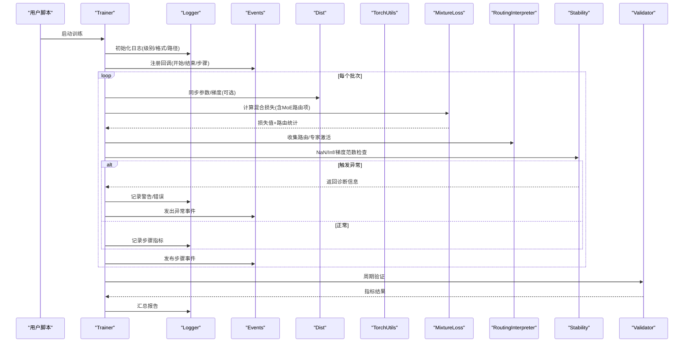
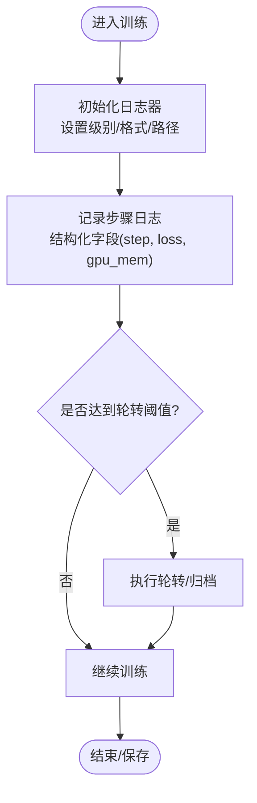
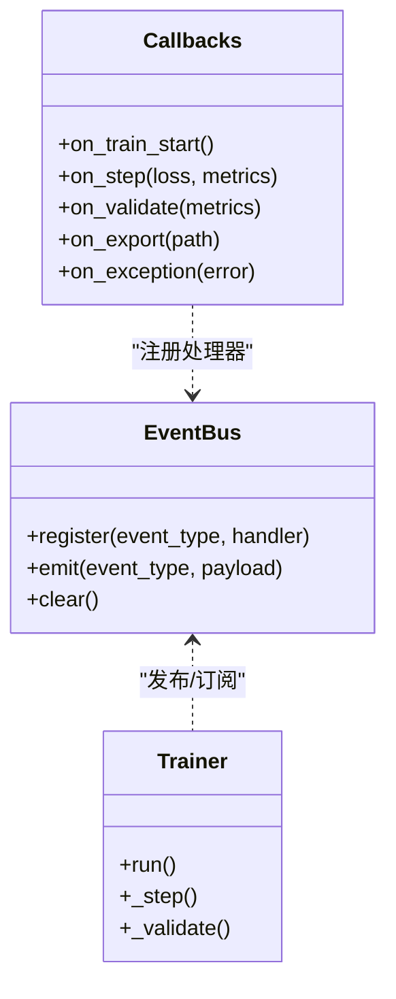
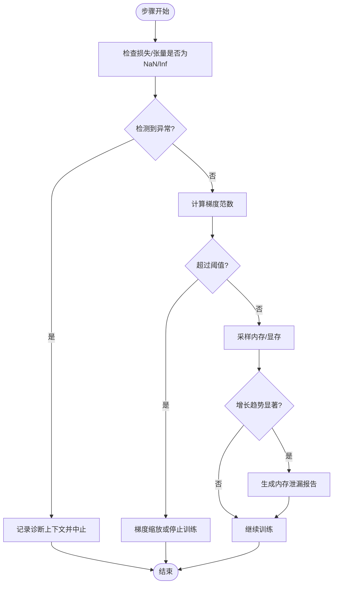
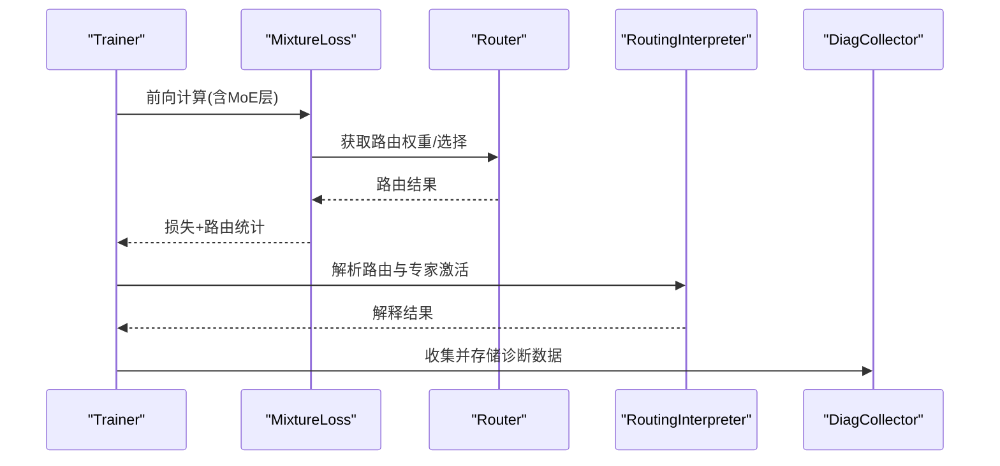
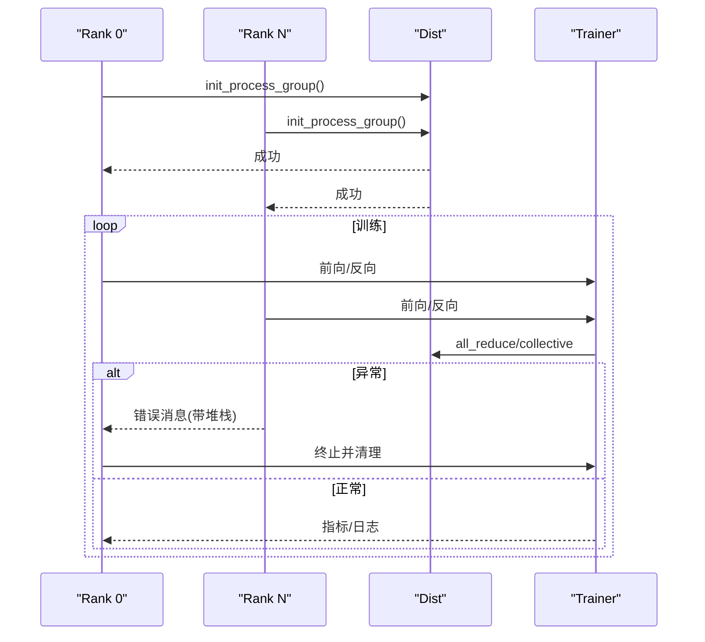
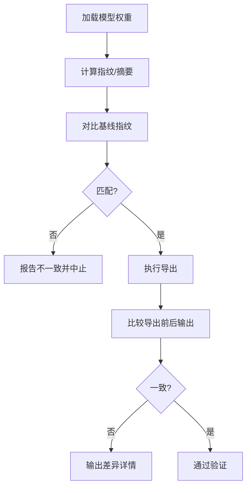
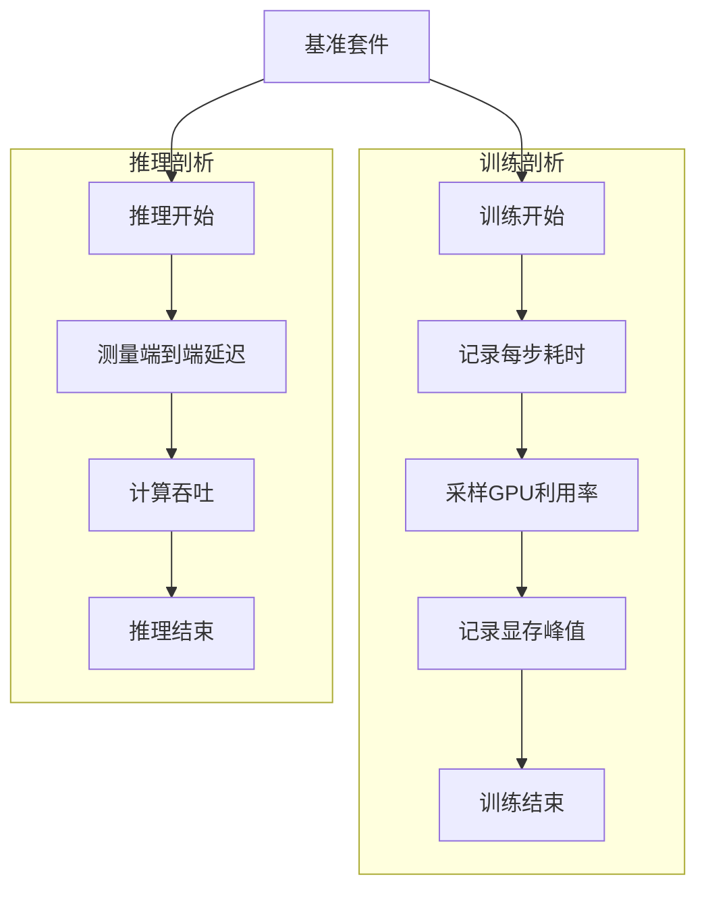
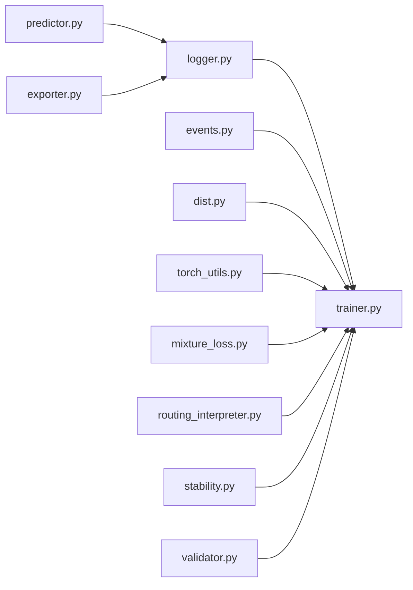

# 调试工具与诊断

<cite>
**本文引用的文件**
- [logger.py](file://ultralytics/utils/logger.py)
- [events.py](file://ultralytics/utils/events.py)
- [dist.py](file://ultralytics/utils/dist.py)
- [torch_utils.py](file://ultralytics/utils/torch_utils.py)
- [errors.py](file://ultralytics/utils/errors.py)
- [trainer.py](file://ultralytics/engine/trainer.py)
- [validator.py](file://ultralytics/engine/validator.py)
- [predictor.py](file://ultralytics/engine/predictor.py)
- [exporter.py](file://ultralytics/engine/exporter.py)
- [mixture_loss.py](file://ultralytics/nn/mixture_loss.py)
- [routing_interpreter.py](file://ultralytics/utils/routing_interpreter.py)
- [config_drift_detector.py](file://tools/config_drift_detector.py)
- [routing_interpreter_tool.py](file://tools/routing_interpreter.py)
- [stability.py](file://agent/runtime/cli/stability.py)
- [validate.py](file://agent/runtime/cli/validate.py)
- [moe_tools.py](file://agent/runtime/cli/moe_tools.py)
- [test_moe_validation_collectives.py](file://tests/test_moe_validation_collectives.py)
- [test_ddp_error_propagation_e2e.py](file://tests/test_ddp_error传播_e2e.py)
- [test_metrics_numerical_stability.py](file://tests/test_metrics_numerical_stability.py)
- [benchmarks/suite.py](file://benchmarks/suite.py)
</cite>

## 目录
1. [简介](#简介)
2. [项目结构](#项目结构)
3. [核心组件](#核心组件)
4. [架构总览](#架构总览)
5. [详细组件分析](#详细组件分析)
6. [依赖关系分析](#依赖关系分析)
7. [性能考虑](#性能考虑)
8. [故障排除指南](#故障排除指南)
9. [结论](#结论)
10. [附录](#附录)

## 简介
本文件面向YOLO-Master的调试与诊断系统，聚焦以下目标：
- 日志系统的配置与使用（级别、结构化输出、文件管理）
- 事件追踪机制与调试钩子
- 自动诊断工具（NaN检测、梯度爆炸检查、内存泄漏检测）
- MoE路由诊断与专家激活分析
- 分布式训练环境下的调试方法与错误定位
- 模型权重验证与一致性检查
- 交互式调试会话与断点调试最佳实践
- 性能剖析工具的集成与使用
- 系统化故障排除流程与常见问题解决方案

## 项目结构
调试与诊断相关能力分布在多个模块中：
- 日志与事件：utils/logger.py、utils/events.py
- 分布式与设备：utils/dist.py、utils/torch_utils.py
- 训练/验证/推理/导出：engine/trainer.py、engine/validator.py、engine/predictor.py、engine/exporter.py
- 数值稳定性与MoE：nn/mixture_loss.py、utils/routing_interpreter.py
- 诊断工具：tools/config_drift_detector.py、tools/routing_interpreter.py、agent/runtime/cli/*
- 测试用例：tests/*（覆盖MoE集体通信、DDP错误传播、数值稳定性等）
- 基准套件：benchmarks/suite.py

```mermaid
graph TB
subgraph "日志与事件"
L["logger.py"]
E["events.py"]
end
subgraph "训练与评估"
T["trainer.py"]
V["validator.py"]
P["predictor.py"]
X["exporter.py"]
end
subgraph "数值与MoE"
ML["mixture_loss.py"]
RIU["utils/routing_interpreter.py"]
end
subgraph "诊断工具"
CDD["tools/config_drift_detector.py"]
RIT["tools/routing_interpreter.py"]
STB["agent/runtime/cli/stability.py"]
VAL["agent/runtime/cli/validate.py"]
MOE["agent/runtime/cli/moe_tools.py"]
end
subgraph "分布式与设备"
D["utils/dist.py"]
TU["utils/torch_utils.py"]
end
subgraph "测试与基准"
TS1["tests/test_moe_validation_collectives.py"]
TS2["tests/test_ddp_error_propagation_e2e.py"]
TS3["tests/test_metrics_numerical_stability.py"]
B["benchmarks/suite.py"]
end
L --> T
L --> V
L --> P
L --> X
E --> T
E --> V
E --> P
E --> X
D --> T
D --> V
TU --> T
TU --> V
ML --> T
RIU --> T
CDD --> T
RIT --> T
STB --> T
VAL --> V
MOE --> T
TS1 --> T
TS2 --> T
TS3 --> T
B --> T
```

图表来源
- [logger.py](file://ultralytics/utils/logger.py)
- [events.py](file://ultralytics/utils/events.py)
- [trainer.py](file://ultralytics/engine/trainer.py)
- [validator.py](file://ultralytics/engine/validator.py)
- [predictor.py](file://ultralytics/engine/predictor.py)
- [exporter.py](file://ultralytics/engine/exporter.py)
- [mixture_loss.py](file://ultralytics/nn/mixture_loss.py)
- [routing_interpreter.py](file://ultralytics/utils/routing_interpreter.py)
- [config_drift_detector.py](file://tools/config_drift_detector.py)
- [routing_interpreter_tool.py](file://tools/routing_interpreter.py)
- [stability.py](file://agent/runtime/cli/stability.py)
- [validate.py](file://agent/runtime/cli/validate.py)
- [moe_tools.py](file://agent/runtime/cli/moe_tools.py)
- [dist.py](file://ultralytics/utils/dist.py)
- [torch_utils.py](file://ultralytics/utils/torch_utils.py)
- [test_moe_validation_collectives.py](file://tests/test_moe_validation_collectives.py)
- [test_ddp_error_propagation_e2e.py](file://tests/test_ddp_error传播_e2e.py)
- [test_metrics_numerical_stability.py](file://tests/test_metrics_numerical_stability.py)
- [benchmarks/suite.py](file://benchmarks/suite.py)

章节来源
- [logger.py](file://ultralytics/utils/logger.py)
- [events.py](file://ultralytics/utils/events.py)
- [trainer.py](file://ultralytics/engine/trainer.py)
- [validator.py](file://ultralytics/engine/validator.py)
- [predictor.py](file://ultralytics/engine/predictor.py)
- [exporter.py](file://ultralytics/engine/exporter.py)
- [mixture_loss.py](file://ultralytics/nn/mixture_loss.py)
- [routing_interpreter.py](file://ultralytics/utils/routing_interpreter.py)
- [config_drift_detector.py](file://tools/config_drift_detector.py)
- [routing_interpreter_tool.py](file://tools/routing_interpreter.py)
- [stability.py](file://agent/runtime/cli/stability.py)
- [validate.py](file://agent/runtime/cli/validate.py)
- [moe_tools.py](file://agent/runtime/cli/moe_tools.py)
- [dist.py](file://ultralytics/utils/dist.py)
- [torch_utils.py](file://ultralytics/utils/torch_utils.py)
- [test_moe_validation_collectives.py](file://tests/test_moe_validation_collectives.py)
- [test_ddp_error_propagation_e2e.py](file://tests/test_ddp_error传播_e2e.py)
- [test_metrics_numerical_stability.py](file://tests/test_metrics_numerical_stability.py)
- [benchmarks/suite.py](file://benchmarks/suite.py)

## 核心组件
- 日志子系统：统一日志接口、分级控制、结构化字段、文件轮转与路径管理。
- 事件系统：训练/验证/推理生命周期事件、回调注册、跨进程广播。
- 分布式辅助：多进程初始化、错误传播、根进程标识、NCCL/进程组状态检查。
- 数值稳定性：NaN/Inf检测、梯度范数监控、损失与指标异常告警。
- MoE诊断：路由选择统计、专家激活分布、负载不均衡检测、路由解释器。
- 配置漂移检测：对比当前配置与基线，报告差异并阻断潜在风险。
- 自动化校验：权重一致性、导出前后一致性、集合通信正确性。
- 性能剖析：训练/推理阶段耗时采集、GPU利用率、内存峰值记录。

章节来源
- [logger.py](file://ultralytics/utils/logger.py)
- [events.py](file://ultralytics/utils/events.py)
- [dist.py](file://ultralytics/utils/dist.py)
- [torch_utils.py](file://ultralytics/utils/torch_utils.py)
- [mixture_loss.py](file://ultralytics/nn/mixture_loss.py)
- [routing_interpreter.py](file://ultralytics/utils/routing_interpreter.py)
- [config_drift_detector.py](file://tools/config_drift_detector.py)

## 架构总览
下图展示调试与诊断在训练主循环中的集成位置与数据流。

图表来源
- [trainer.py](file://ultralytics/engine/trainer.py)
- [logger.py](file://ultralytics/utils/logger.py)
- [events.py](file://ultralytics/utils/events.py)
- [dist.py](file://ultralytics/utils/dist.py)
- [torch_utils.py](file://ultralytics/utils/torch_utils.py)
- [mixture_loss.py](file://ultralytics/nn/mixture_loss.py)
- [routing_interpreter.py](file://ultralytics/utils/routing_interpreter.py)
- [stability.py](file://agent/runtime/cli/stability.py)
- [validator.py](file://ultralytics/engine/validator.py)

## 详细组件分析

### 日志系统（级别、结构化、文件管理）
- 日志级别：支持从DEBUG到CRITICAL的多级输出；可通过环境变量或配置对象切换。
- 结构化输出：为关键事件附加JSON字段（如step、loss、gpu_mem、rank），便于聚合与分析。
- 文件管理：按任务/实验目录组织，支持轮转与保留策略；根进程负责写入，其他进程仅本地缓冲。
- 控制台与文件双写：训练时同时输出到终端与文件，便于交互与归档。

图表来源
- [logger.py](file://ultralytics/utils/logger.py)
- [trainer.py](file://ultralytics/engine/trainer.py)

章节来源
- [logger.py](file://ultralytics/utils/logger.py)
- [trainer.py](file://ultralytics/engine/trainer.py)

### 事件追踪与调试钩子
- 事件类型：训练开始/结束、每步、验证、导出、异常等。
- 回调注册：通过事件总线注册自定义处理器，用于上报指标、触发快照、发送告警。
- 跨进程广播：在多进程环境下，事件由根进程广播，确保一致性与去重。
- 调试钩子：在关键节点插入钩子，允许注入诊断逻辑而不修改核心代码。

图表来源
- [events.py](file://ultralytics/utils/events.py)
- [trainer.py](file://ultralytics/engine/trainer.py)

章节来源
- [events.py](file://ultralytics/utils/events.py)
- [trainer.py](file://ultralytics/engine/trainer.py)

### 自动诊断工具（NaN检测、梯度爆炸、内存泄漏）
- NaN/Inf检测：对损失、关键张量进行isfinite检查，发现异常立即中断并输出诊断上下文。
- 梯度爆炸：跟踪梯度范数，超过阈值时记录并可选择缩放或停止训练。
- 内存泄漏：周期性采样显存/内存占用，识别持续增长趋势并生成报告。
- 集成点：在训练循环与验证阶段调用，结合事件系统上报。

图表来源
- [stability.py](file://agent/runtime/cli/stability.py)
- [torch_utils.py](file://ultralytics/utils/torch_utils.py)
- [trainer.py](file://ultralytics/engine/trainer.py)

章节来源
- [stability.py](file://agent/runtime/cli/stability.py)
- [torch_utils.py](file://ultralytics/utils/torch_utils.py)
- [trainer.py](file://ultralytics/engine/trainer.py)

### MoE路由诊断与专家激活分析
- 路由统计：记录每步被选中的专家ID、选择概率、负载均衡项。
- 专家激活分布：统计各专家的调用频次与激活强度，识别“热点”与“冷点”。
- 路由解释器：将路由决策映射到输入特征维度，帮助理解专家分工。
- 集成点：在损失计算后收集路由元数据，供后续分析与可视化。

图表来源
- [mixture_loss.py](file://ultralytics/nn/mixture_loss.py)
- [routing_interpreter.py](file://ultralytics/utils/routing_interpreter.py)
- [trainer.py](file://ultralytics/engine/trainer.py)

章节来源
- [mixture_loss.py](file://ultralytics/nn/mixture_loss.py)
- [routing_interpreter.py](file://ultralytics/utils/routing_interpreter.py)
- [trainer.py](file://ultralytics/engine/trainer.py)

### 分布式训练调试与错误定位
- 进程组初始化：确保所有进程成功加入，失败时快速失败并输出原因。
- 错误传播：非根进程异常信息汇聚至根进程，附带堆栈与上下文。
- 状态检查：定期探测NCCL/进程组健康度，避免静默挂起。
- 根进程职责：仅根进程写入日志/保存权重，减少竞争与重复。

图表来源
- [dist.py](file://ultralytics/utils/dist.py)
- [trainer.py](file://ultralytics/engine/trainer.py)

章节来源
- [dist.py](file://ultralytics/utils/dist.py)
- [trainer.py](file://ultralytics/engine/trainer.py)

### 模型权重验证与一致性检查
- 权重指纹：对模型参数生成哈希指纹，用于版本管理与回归比对。
- 导出一致性：比较导出前后权重与输出，确保转换无损。
- 集合通信一致性：验证多进程下权重/指标的一致性。
- 工具链：提供CLI与API以一键执行校验。

图表来源
- [validate.py](file://agent/runtime/cli/validate.py)
- [exporter.py](file://ultralytics/engine/exporter.py)
- [test_moe_validation_collectives.py](file://tests/test_moe_validation_collectives.py)

章节来源
- [validate.py](file://agent/runtime/cli/validate.py)
- [exporter.py](file://ultralytics/engine/exporter.py)
- [test_moe_validation_collectives.py](file://tests/test_moe_validation_collectives.py)

### 交互式调试与断点最佳实践
- 条件断点：仅在特定rank或特定样本上触发，避免阻塞其他进程。
- 局部变量快照：在断点处保存关键张量与中间结果，便于离线分析。
- 最小复现：基于事件与日志重建问题场景，降低定位成本。
- 安全退出：在断点调试后恢复默认行为，避免影响生产运行。

章节来源
- [trainer.py](file://ultralytics/engine/trainer.py)
- [events.py](file://ultralytics/utils/events.py)

### 性能剖析集成与使用
- 训练剖析：记录每步耗时、GPU利用率、内存峰值，输出时序图。
- 推理剖析：测量端到端延迟、吞吐、算子耗时分布。
- 基准套件：提供标准化基准，便于不同配置/硬件对比。
- 集成方式：通过事件回调或装饰器注入剖析逻辑，按需启用。

图表来源
- [benchmarks/suite.py](file://benchmarks/suite.py)
- [trainer.py](file://ultralytics/engine/trainer.py)
- [predictor.py](file://ultralytics/engine/predictor.py)

章节来源
- [benchmarks/suite.py](file://benchmarks/suite.py)
- [trainer.py](file://ultralytics/engine/trainer.py)
- [predictor.py](file://ultralytics/engine/predictor.py)

## 依赖关系分析
- 低耦合高内聚：日志与事件作为基础设施，被训练/验证/推理广泛复用。
- 外部依赖：分布式通信依赖NCCL/进程组；性能剖析依赖PyTorch内置工具。
- 潜在环依赖：避免在事件回调中直接导入训练器，采用延迟导入或接口抽象。

图表来源
- [logger.py](file://ultralytics/utils/logger.py)
- [events.py](file://ultralytics/utils/events.py)
- [dist.py](file://ultralytics/utils/dist.py)
- [torch_utils.py](file://ultralytics/utils/torch_utils.py)
- [mixture_loss.py](file://ultralytics/nn/mixture_loss.py)
- [routing_interpreter.py](file://ultralytics/utils/routing_interpreter.py)
- [stability.py](file://agent/runtime/cli/stability.py)
- [trainer.py](file://ultralytics/engine/trainer.py)
- [validator.py](file://ultralytics/engine/validator.py)
- [predictor.py](file://ultralytics/engine/predictor.py)
- [exporter.py](file://ultralytics/engine/exporter.py)

章节来源
- [logger.py](file://ultralytics/utils/logger.py)
- [events.py](file://ultralytics/utils/events.py)
- [dist.py](file://ultralytics/utils/dist.py)
- [torch_utils.py](file://ultralytics/utils/torch_utils.py)
- [mixture_loss.py](file://ultralytics/nn/mixture_loss.py)
- [routing_interpreter.py](file://ultralytics/utils/routing_interpreter.py)
- [stability.py](file://agent/runtime/cli/stability.py)
- [trainer.py](file://ultralytics/engine/trainer.py)
- [validator.py](file://ultralytics/engine/validator.py)
- [predictor.py](file://ultralytics/engine/predictor.py)
- [exporter.py](file://ultralytics/engine/exporter.py)

## 性能考虑
- 日志开销：在高吞吐场景下，建议降低DEBUG级别或使用异步写入。
- 事件频率：避免在每步都触发重型回调，必要时合并或降采样。
- 诊断开关：NaN/梯度/内存检查可按阶段启用，减少额外计算。
- 剖析粒度：训练阶段按epoch或固定步数采样，推理阶段按请求采样。

## 故障排除指南
- 常见错误分类
  - 数值不稳定：NaN/Inf、梯度爆炸、损失震荡
  - 分布式问题：进程组初始化失败、NCCL超时、错误未传播
  - 资源问题：显存不足、内存泄漏、I/O瓶颈
  - 配置问题：配置漂移、导出不一致、权重损坏
- 定位技巧
  - 使用结构化日志过滤关键字段（rank、step、loss）
  - 借助事件回调捕获异常上下文与堆栈
  - 利用MoE路由解释器定位专家失衡
  - 通过一致性检查快速确认权重/导出问题
- 解决步骤
  - 缩小范围：最小复现实例、单卡验证、关闭非必要特性
  - 逐步启用诊断：先NaN/Inf，再梯度范数，最后内存采样
  - 交叉验证：对比不同配置/数据集/硬件平台
  - 回归测试：引入自动化用例防止复发

章节来源
- [errors.py](file://ultralytics/utils/errors.py)
- [test_ddp_error_propagation_e2e.py](file://tests/test_ddp_error传播_e2e.py)
- [test_metrics_numerical_stability.py](file://tests/test_metrics_numerical_stability.py)
- [config_drift_detector.py](file://tools/config_drift_detector.py)

## 结论
YOLO-Master的调试与诊断体系围绕日志、事件、数值稳定性、MoE诊断、分布式健壮性与一致性检查构建。通过合理的配置与开关，可在不影响性能的前提下获得强大的可观测性与排障能力。建议在研发与生产环境中持续集成这些工具，形成闭环的质量保障。

## 附录
- 常用命令与入口
  - 训练：参考trainer.py中的训练主循环与回调
  - 验证：参考validator.py中的指标计算与报告
  - 推理：参考predictor.py中的批处理与剖析
  - 导出：参考exporter.py中的权重与输出一致性检查
  - 诊断工具：参考tools与agent/runtime/cli下的脚本
- 参考测试用例
  - MoE集体通信一致性：test_moe_validation_collectives.py
  - DDP错误传播：test_ddp_error_propagation_e2e.py
  - 数值稳定性：test_metrics_numerical_stability.py