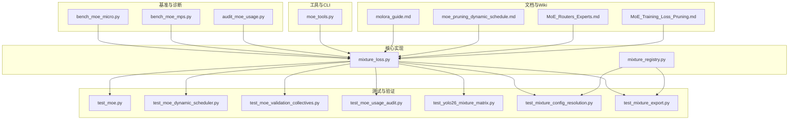
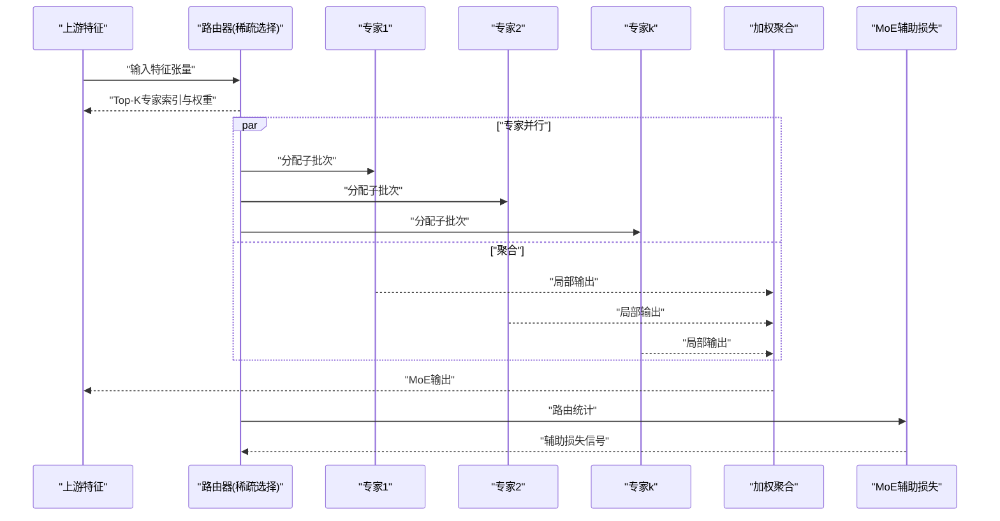
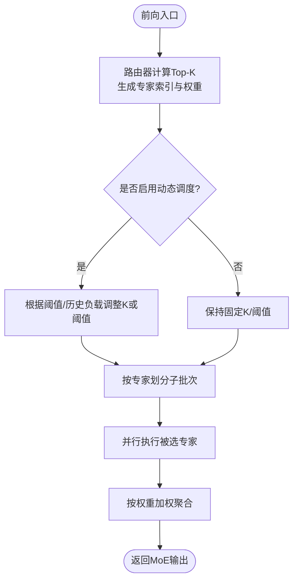
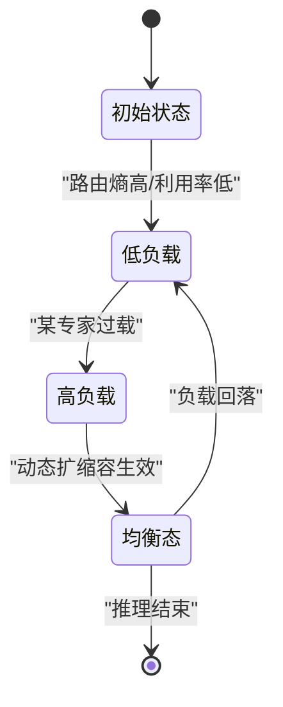
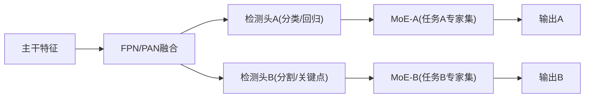
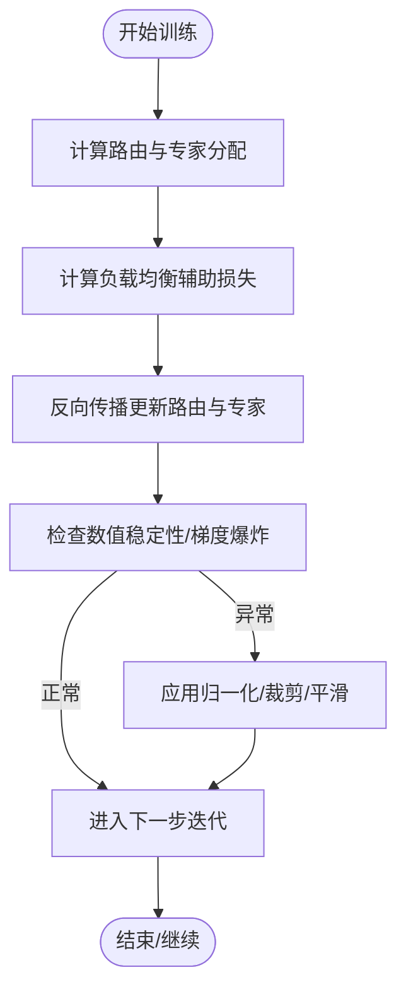
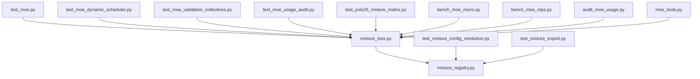

# MoE架构设计

<cite>
**本文引用的文件**
- [mixture_loss.py](file://ultralytics/nn/mixture_loss.py)
- [mixture_registry.py](file://ultralytics/nn/mixture_registry.py)
- [test_moe.py](file://tests/test_moe.py)
- [test_moe_dynamic_scheduler.py](file://tests/test_moe_dynamic_scheduler.py)
- [test_moe_validation_collectives.py](file://tests/test_moe_validation_collectives.py)
- [test_moe_usage_audit.py](file://tests/test_moe_usage_audit.py)
- [bench_moe_micro.py](file://scripts/bench_moe_micro.py)
- [bench_moe_mps.py](file://scripts/bench_moe_mps.py)
- [audit_moe_usage.py](file://scripts/audit_moe_usage.py)
- [moe_tools.py](file://agent/runtime/cli/moe_tools.py)
- [yolo26_mixture_matrix.py](file://tests/test_yolo26_mixture_matrix.py)
- [test_mixture_config_resolution.py](file://tests/test_mixture_config_resolution.py)
- [test_mixture_export.py](file://tests/test_mixture_export.py)
- [molora_guide.md](file://docs/molora_guide.md)
- [moe_pruning_dynamic_schedule.md](file://docs/moe_pruning_dynamic_schedule.md)
- [MoE_Routers_Experts.md](file://wiki/MoE/MoE_Routers_Experts.md)
- [MoE_Training_Loss_Pruning.md](file://wiki/MoE/MoE_Training_Loss_Pruning.md)
</cite>

## 目录
1. [引言](#引言)
2. [项目结构](#项目结构)
3. [核心组件](#核心组件)
4. [架构总览](#架构总览)
5. [详细组件分析](#详细组件分析)
6. [依赖关系分析](#依赖关系分析)
7. [性能与内存优化](#性能与内存优化)
8. [故障排查指南](#故障排查指南)
9. [结论](#结论)
10. [附录：配置参数与最佳实践](#附录配置参数与最佳实践)

## 引言
本文件面向YOLO-Master的混合专家（Mixture of Experts, MoE）架构，系统性阐述其设计理念、实现要点与工程化落地。内容覆盖：
- 专家并行、稀疏激活与负载均衡的核心思想
- 基础MoE模块的前向流程、路由选择与输出聚合
- 动态MoE的运行时专家选择与自适应路由
- 在YOLO检测头中的集成方式（特征融合与任务特定专家）
- 训练稳定性与收敛性保障机制
- 性能优化与内存管理策略
- 与标准YOLO的对比分析与适用场景建议

## 项目结构
仓库中与MoE相关的代码与文档分布在以下位置：
- 核心实现与注册表：ultralytics/nn/mixture_loss.py、ultralytics/nn/mixture_registry.py
- 测试与验证：tests/test_moe*.py、tests/test_yolo26_mixture_matrix.py、tests/test_mixture_*.py
- 基准与诊断脚本：scripts/bench_moe_micro.py、scripts/bench_moe_mps.py、scripts/audit_moe_usage.py
- 工具与CLI：agent/runtime/cli/moe_tools.py
- 文档与Wiki：docs/molora_guide.md、docs/moe_pruning_dynamic_schedule.md、wiki/MoE/*.md

图表来源
- [mixture_loss.py](file://ultralytics/nn/mixture_loss.py)
- [mixture_registry.py](file://ultralytics/nn/mixture_registry.py)
- [test_moe.py](file://tests/test_moe.py)
- [test_moe_dynamic_scheduler.py](file://tests/test_moe_dynamic_scheduler.py)
- [test_moe_validation_collectives.py](file://tests/test_moe_validation_collectives.py)
- [test_moe_usage_audit.py](file://tests/test_moe_usage_audit.py)
- [test_yolo26_mixture_matrix.py](file://tests/test_yolo26_mixture_matrix.py)
- [test_mixture_config_resolution.py](file://tests/test_mixture_config_resolution.py)
- [test_mixture_export.py](file://tests/test_mixture_export.py)
- [bench_moe_micro.py](file://scripts/bench_moe_micro.py)
- [bench_moe_mPS.py](file://scripts/bench_moe_mps.py)
- [audit_moe_usage.py](file://scripts/audit_moe_usage.py)
- [moe_tools.py](file://agent/runtime/cli/moe_tools.py)
- [molora_guide.md](file://docs/molora_guide.md)
- [moe_pruning_dynamic_schedule.md](file://docs/moe_pruning_dynamic_schedule.md)
- [MoE_Routers_Experts.md](file://wiki/MoE/MoE_Routers_Experts.md)
- [MoE_Training_Loss_Pruning.md](file://wiki/MoE/MoE_Training_Loss_Pruning.md)

章节来源
- [mixture_loss.py](file://ultralytics/nn/mixture_loss.py)
- [mixture_registry.py](file://ultralytics/nn/mixture_registry.py)
- [test_moe.py](file://tests/test_moe.py)
- [test_moe_dynamic_scheduler.py](file://tests/test_moe_dynamic_scheduler.py)
- [test_moe_validation_collectives.py](file://tests/test_moe_validation_collectives.py)
- [test_moe_usage_audit.py](file://tests/test_moe_usage_audit.py)
- [bench_moe_micro.py](file://scripts/bench_moe_micro.py)
- [bench_moe_mps.py](file://scripts/bench_moe_mps.py)
- [audit_moe_usage.py](file://scripts/audit_moe_usage.py)
- [moe_tools.py](file://agent/runtime/cli/moe_tools.py)
- [molora_guide.md](file://docs/molora_guide.md)
- [moe_pruning_dynamic_schedule.md](file://docs/moe_pruning_dynamic_schedule.md)
- [MoE_Routers_Experts.md](file://wiki/MoE/MoE_Routers_Experts.md)
- [MoE_Training_Loss_Pruning.md](file://wiki/MoE/MoE_Training_Loss_Pruning.md)

## 核心组件
- 损失与辅助项
  - 组合式MoE损失与辅助项计算，用于控制路由分布与负载平衡。
  - 参考路径：[mixture_loss.py](file://ultralytics/nn/mixture_loss.py)
- 注册表与配置解析
  - 提供MoE相关模块、路由策略与专家配置的注册与解析能力。
  - 参考路径：[mixture_registry.py](file://ultralytics/nn/mixture_registry.py)
- 测试套件
  - 覆盖MoE前向、动态调度、分布式校验、使用审计、导出与配置解析等关键路径。
  - 参考路径：
    - [test_moe.py](file://tests/test_moe.py)
    - [test_moe_dynamic_scheduler.py](file://tests/test_moe_dynamic_scheduler.py)
    - [test_moe_validation_collectives.py](file://tests/test_moe_validation_collectives.py)
    - [test_moe_usage_audit.py](file://tests/test_moe_usage_audit.py)
    - [test_yolo26_mixture_matrix.py](file://tests/test_yolo26_mixture_matrix.py)
    - [test_mixture_config_resolution.py](file://tests/test_mixture_config_resolution.py)
    - [test_mixture_export.py](file://tests/test_mixture_export.py)
- 基准与诊断
  - 微基准与设备侧（如MPS）性能评估；使用审计与路由解释工具链。
  - 参考路径：
    - [bench_moe_micro.py](file://scripts/bench_moe_micro.py)
    - [bench_moe_mps.py](file://scripts/bench_moe_mps.py)
    - [audit_moe_usage.py](file://scripts/audit_moe_usage.py)
- CLI与工具
  - 提供MoE运行期工具能力（如路由统计、专家裁剪、动态调度开关等）。
  - 参考路径：[moe_tools.py](file://agent/runtime/cli/moe_tools.py)
- 文档与Wiki
  - 路由与专家说明、训练损失与剪枝策略、动态调度与Molora指南。
  - 参考路径：
    - [MoE_Routers_Experts.md](file://wiki/MoE/MoE_Routers_Experts.md)
    - [MoE_Training_Loss_Pruning.md](file://wiki/MoE/MoE_Training_Loss_Pruning.md)
    - [molora_guide.md](file://docs/molora_guide.md)
    - [moe_pruning_dynamic_schedule.md](file://docs/moe_pruning_dynamic_schedule.md)

章节来源
- [mixture_loss.py](file://ultralytics/nn/mixture_loss.py)
- [mixture_registry.py](file://ultralytics/nn/mixture_registry.py)
- [test_moe.py](file://tests/test_moe.py)
- [test_moe_dynamic_scheduler.py](file://tests/test_moe_dynamic_scheduler.py)
- [test_moe_validation_collectives.py](file://tests/test_moe_validation_collectives.py)
- [test_moe_usage_audit.py](file://tests/test_moe_usage_audit.py)
- [test_yolo26_mixture_matrix.py](file://tests/test_yolo26_mixture_matrix.py)
- [test_mixture_config_resolution.py](file://tests/test_mixture_config_resolution.py)
- [test_mixture_export.py](file://tests/test_mixture_export.py)
- [bench_moe_micro.py](file://scripts/bench_moe_micro.py)
- [bench_moe_mps.py](file://scripts/bench_moe_mps.py)
- [audit_moe_usage.py](file://scripts/audit_moe_usage.py)
- [moe_tools.py](file://agent/runtime/cli/moe_tools.py)
- [MoE_Routers_Experts.md](file://wiki/MoE/MoE_Routers_Experts.md)
- [MoE_Training_Loss_Pruning.md](file://wiki/MoE/MoE_Training_Loss_Pruning.md)
- [molora_guide.md](file://docs/molora_guide.md)
- [moe_pruning_dynamic_schedule.md](file://docs/moe_pruning_dynamic_schedule.md)

## 架构总览
下图展示MoE在YOLO-Master中的整体定位与交互：输入特征进入MoE层，由路由器进行稀疏选择，多个专家并行处理，最终按权重聚合输出，并计算辅助损失以维持负载均衡。

图表来源
- [mixture_loss.py](file://ultralytics/nn/mixture_loss.py)
- [test_moe.py](file://tests/test_moe.py)
- [test_moe_dynamic_scheduler.py](file://tests/test_moe_dynamic_scheduler.py)
- [test_moe_validation_collectives.py](file://tests/test_moe_validation_collectives.py)
- [moe_tools.py](file://agent/runtime/cli/moe_tools.py)

## 详细组件分析

### 基础MoE模块：前向传播、路由与聚合
- 前向流程
  - 接收上游特征，经路由器生成稀疏路由（Top-K），将样本分派到对应专家。
  - 各专家独立计算后，按路由权重对输出进行加权求和得到最终结果。
- 路由选择机制
  - 支持Top-K稀疏激活，K为可配超参；路由权重通常来自门控网络或相似度打分。
  - 动态模式下，路由阈值与K可在训练/推理阶段自适应调整。
- 输出聚合策略
  - 采用加权聚合，保证梯度回传时各专家贡献可导且稳定。
- 关键实现参考
  - 损失与辅助项：[mixture_loss.py](file://ultralytics/nn/mixture_loss.py)
  - 路由与注册：[mixture_registry.py](file://ultralytics/nn/mixture_registry.py)
  - 行为验证用例：[test_moe.py](file://tests/test_moe.py)

图表来源
- [test_moe.py](file://tests/test_moe.py)
- [test_moe_dynamic_scheduler.py](file://tests/test_moe_dynamic_scheduler.py)
- [moe_tools.py](file://agent/runtime/cli/moe_tools.py)

章节来源
- [mixture_loss.py](file://ultralytics/nn/mixture_loss.py)
- [mixture_registry.py](file://ultralytics/nn/mixture_registry.py)
- [test_moe.py](file://tests/test_moe.py)
- [test_moe_dynamic_scheduler.py](file://tests/test_moe_dynamic_scheduler.py)
- [moe_tools.py](file://agent/runtime/cli/moe_tools.py)

### 动态MoE：运行时专家选择与自适应路由
- 设计思想
  - 在训练或推理过程中依据当前样本难度、历史负载与路由置信度动态调整专家数量与阈值，提升吞吐与精度权衡。
- 自适应策略
  - 基于路由熵/置信度阈值触发扩容或收缩；结合全局负载统计进行再平衡。
- 验证与工具
  - 动态调度测试：[test_moe_dynamic_scheduler.py](file://tests/test_moe_dynamic_scheduler.py)
  - 使用审计与可视化：[audit_moe_usage.py](file://scripts/audit_moe_usage.py)、[moe_tools.py](file://agent/runtime/cli/moe_tools.py)
  - 文档参考：[moe_pruning_dynamic_schedule.md](file://docs/moe_pruning_dynamic_schedule.md)

图表来源
- [test_moe_dynamic_scheduler.py](file://tests/test_moe_dynamic_scheduler.py)
- [moe_tools.py](file://agent/runtime/cli/moe_tools.py)
- [moe_pruning_dynamic_schedule.md](file://docs/moe_pruning_dynamic_schedule.md)

章节来源
- [test_moe_dynamic_scheduler.py](file://tests/test_moe_dynamic_scheduler.py)
- [audit_moe_usage.py](file://scripts/audit_moe_usage.py)
- [moe_tools.py](file://agent/runtime/cli/moe_tools.py)
- [moe_pruning_dynamic_schedule.md](file://docs/moe_pruning_dynamic_schedule.md)

### 在YOLO检测头中的集成：特征融合与任务特定专家
- 集成方式
  - 将MoE替换或嵌入至检测头的多尺度特征融合分支，使不同任务（分类、回归、分割等）拥有专属专家集合，增强任务特化能力。
- 矩阵与兼容性
  - YOLO26混合矩阵与任务矩阵验证用例：[test_yolo26_mixture_matrix.py](file://tests/test_yolo26_mixture_matrix.py)
- 路由与专家说明
  - Wiki文档提供路由与专家设计的背景与约束：[MoE_Routers_Experts.md](file://wiki/MoE/MoE_Routers_Experts.md)

图表来源
- [test_yolo26_mixture_matrix.py](file://tests/test_yolo26_mixture_matrix.py)
- [MoE_Routers_Experts.md](file://wiki/MoE/MoE_Routers_Experts.md)

章节来源
- [test_yolo26_mixture_matrix.py](file://tests/test_yolo26_mixture_matrix.py)
- [MoE_Routers_Experts.md](file://wiki/MoE/MoE_Routers_Experts.md)

### 训练稳定性与收敛性保障
- 辅助损失与负载均衡
  - 通过辅助损失惩罚路由集中度过高的情况，促使专家间更均匀地参与计算。
  - 参考：[mixture_loss.py](file://ultralytics/nn/mixture_loss.py)、[MoE_Training_Loss_Pruning.md](file://wiki/MoE/MoE_Training_Loss_Pruning.md)
- 分布式一致性校验
  - 在多卡环境下确保路由统计与聚合的一致性，避免数据并行导致的偏差。
  - 参考：[test_moe_validation_collectives.py](file://tests/test_moe_validation_collectives.py)
- 数值稳定性
  - 路由权重归一化、指数平滑与防NaN保护等技巧在测试中覆盖。
  - 参考：[test_moe.py](file://tests/test_moe.py)

图表来源
- [mixture_loss.py](file://ultralytics/nn/mixture_loss.py)
- [test_moe_validation_collectives.py](file://tests/test_moe_validation_collectives.py)
- [MoE_Training_Loss_Pruning.md](file://wiki/MoE/MoE_Training_Loss_Pruning.md)

章节来源
- [mixture_loss.py](file://ultralytics/nn/mixture_loss.py)
- [test_moe_validation_collectives.py](file://tests/test_moe_validation_collectives.py)
- [test_moe.py](file://tests/test_moe.py)
- [MoE_Training_Loss_Pruning.md](file://wiki/MoE/MoE_Training_Loss_Pruning.md)

### 配置参数与解析
- 关键参数
  - 专家数量、Top-K、路由策略（如softmax温度、阈值）、负载均衡系数、动态调度开关与阈值。
- 配置解析与导出
  - 配置解析与导出兼容性的测试用例：
    - [test_mixture_config_resolution.py](file://tests/test_mixture_config_resolution.py)
    - [test_mixture_export.py](file://tests/test_mixture_export.py)
- 注册表
  - 路由与专家的注册与查找逻辑位于注册表中。
  - 参考：[mixture_registry.py](file://ultralytics/nn/mixture_registry.py)

章节来源
- [test_mixture_config_resolution.py](file://tests/test_mixture_config_resolution.py)
- [test_mixture_export.py](file://tests/test_mixture_export.py)
- [mixture_registry.py](file://ultralytics/nn/mixture_registry.py)

## 依赖关系分析
- 模块耦合
  - mixture_loss.py与mixture_registry.py为核心依赖，其他测试与脚本围绕二者展开。
- 外部依赖
  - 分布式通信与设备后端（如CUDA/MPS）在基准与测试中被覆盖。
- 潜在循环依赖
  - 通过注册表解耦路由与专家的具体实现，降低直接耦合风险。

图表来源
- [mixture_loss.py](file://ultralytics/nn/mixture_loss.py)
- [mixture_registry.py](file://ultralytics/nn/mixture_registry.py)
- [test_moe.py](file://tests/test_moe.py)
- [test_moe_dynamic_scheduler.py](file://tests/test_moe_dynamic_scheduler.py)
- [test_moe_validation_collectives.py](file://tests/test_moe_validation_collectives.py)
- [test_moe_usage_audit.py](file://tests/test_moe_usage_audit.py)
- [test_yolo26_mixture_matrix.py](file://tests/test_yolo26_mixture_matrix.py)
- [test_mixture_config_resolution.py](file://tests/test_mixture_config_resolution.py)
- [test_mixture_export.py](file://tests/test_mixture_export.py)
- [bench_moe_micro.py](file://scripts/bench_moe_micro.py)
- [bench_moe_mps.py](file://scripts/bench_moe_mps.py)
- [audit_moe_usage.py](file://scripts/audit_moe_usage.py)
- [moe_tools.py](file://agent/runtime/cli/moe_tools.py)

章节来源
- [mixture_loss.py](file://ultralytics/nn/mixture_loss.py)
- [mixture_registry.py](file://ultralytics/nn/mixture_registry.py)
- [test_moe.py](file://tests/test_moe.py)
- [test_moe_dynamic_scheduler.py](file://tests/test_moe_dynamic_scheduler.py)
- [test_moe_validation_collectives.py](file://tests/test_moe_validation_collectives.py)
- [test_moe_usage_audit.py](file://tests/test_moe_usage_audit.py)
- [test_yolo26_mixture_matrix.py](file://tests/test_yolo26_mixture_matrix.py)
- [test_mixture_config_resolution.py](file://tests/test_mixture_config_resolution.py)
- [test_mixture_export.py](file://tests/test_mixture_export.py)
- [bench_moe_micro.py](file://scripts/bench_moe_micro.py)
- [bench_moe_mps.py](file://scripts/bench_moe_mps.py)
- [audit_moe_usage.py](file://scripts/audit_moe_usage.py)
- [moe_tools.py](file://agent/runtime/cli/moe_tools.py)

## 性能与内存优化
- 稀疏激活与批内并行
  - 仅激活Top-K专家，减少计算量；利用GPU并行执行被选专家。
- 路由开销控制
  - 路由计算应轻量，必要时缓存历史路由统计以降低重复计算。
- 内存复用与零拷贝
  - 尽量复用中间张量，避免不必要的复制；在专家间共享只读权重。
- 设备侧优化
  - 针对MPS/CUDA等设备进行算子级优化与内核融合；参考基准脚本。
- 动态调度收益
  - 在推理阶段按需扩缩专家，兼顾延迟与吞吐。

章节来源
- [bench_moe_micro.py](file://scripts/bench_moe_micro.py)
- [bench_moe_mps.py](file://scripts/bench_moe_mps.py)
- [moe_tools.py](file://agent/runtime/cli/moe_tools.py)
- [molora_guide.md](file://docs/molora_guide.md)

## 故障排查指南
- 路由不稳定或NaN
  - 检查路由权重归一化与温度参数；查看辅助损失是否过大导致梯度异常。
  - 参考：[test_moe.py](file://tests/test_moe.py)、[mixture_loss.py](file://ultralytics/nn/mixture_loss.py)
- 负载均衡失效
  - 观察专家使用率分布，适当增大负载均衡系数或引入动态调度。
  - 参考：[audit_moe_usage.py](file://scripts/audit_moe_usage.py)、[moe_tools.py](file://agent/runtime/cli/moe_tools.py)
- 分布式不一致
  - 确认collective操作顺序与同步点；参考一致性校验用例。
  - 参考：[test_moe_validation_collectives.py](file://tests/test_moe_validation_collectives.py)
- 配置漂移或导出失败
  - 核对配置解析与导出兼容性；参考配置与导出测试。
  - 参考：[test_mixture_config_resolution.py](file://tests/test_mixture_config_resolution.py)、[test_mixture_export.py](file://tests/test_mixture_export.py)

章节来源
- [test_moe.py](file://tests/test_moe.py)
- [mixture_loss.py](file://ultralytics/nn/mixture_loss.py)
- [audit_moe_usage.py](file://scripts/audit_moe_usage.py)
- [moe_tools.py](file://agent/runtime/cli/moe_tools.py)
- [test_moe_validation_collectives.py](file://tests/test_moe_validation_collectives.py)
- [test_mixture_config_resolution.py](file://tests/test_mixture_config_resolution.py)
- [test_mixture_export.py](file://tests/test_mixture_export.py)

## 结论
YOLO-Master的MoE架构通过稀疏激活与负载均衡辅助损失，在保持高效的同时显著增强了模型容量与任务特化能力。动态调度进一步提升了部署灵活性。配合完善的测试、基准与工具链，MoE在复杂视觉任务中具有良好扩展性与工程可用性。

## 附录：配置参数与最佳实践
- 推荐参数范围
  - 专家数量：根据任务复杂度与显存预算设定；小任务可少而精，大任务可多而专。
  - Top-K：1~3常见，兼顾稀疏性与表达能力。
  - 路由温度：较低温度更尖锐，较高温度更平滑，需与辅助损失系数协同调优。
  - 负载均衡系数：过小易导致“赢家通吃”，过大可能抑制学习。
  - 动态调度阈值：依据路由熵与历史负载设置，避免频繁抖动。
- 最佳实践
  - 先固定K与路由策略，逐步引入动态调度；监控专家使用率与辅助损失曲线。
  - 在检测头中为不同任务配置专属专家集，提高任务分离度。
  - 使用基准脚本在不同设备上验证延迟与吞吐，结合导出流程确保部署一致。

章节来源
- [molora_guide.md](file://docs/molora_guide.md)
- [moe_pruning_dynamic_schedule.md](file://docs/moe_pruning_dynamic_schedule.md)
- [test_mixture_config_resolution.py](file://tests/test_mixture_config_resolution.py)
- [test_mixture_export.py](file://tests/test_mixture_export.py)
- [bench_moe_micro.py](file://scripts/bench_moe_micro.py)
- [bench_moe_mps.py](file://scripts/bench_moe_mps.py)