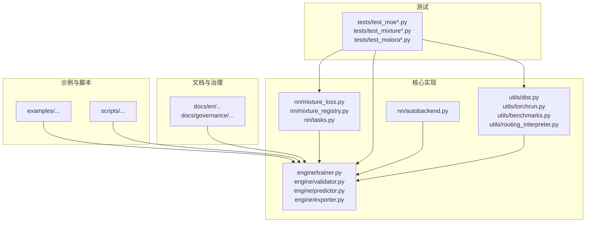
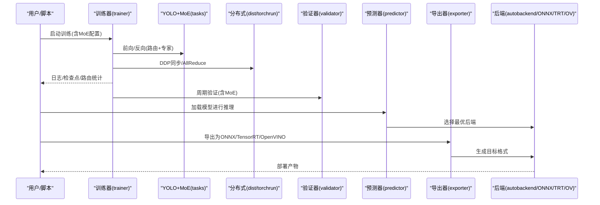
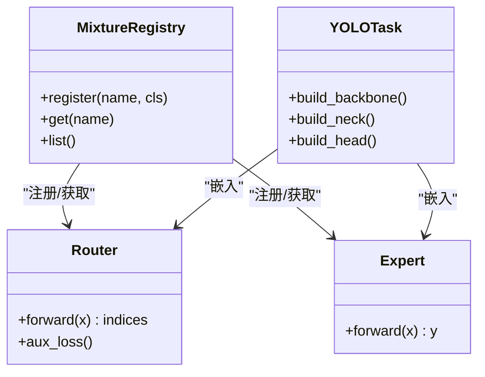
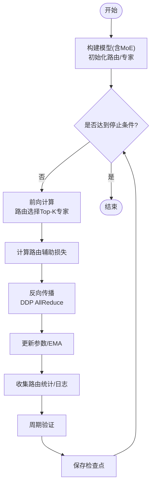
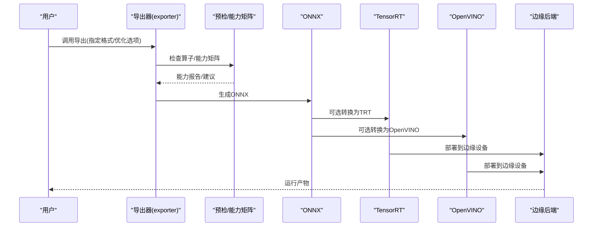
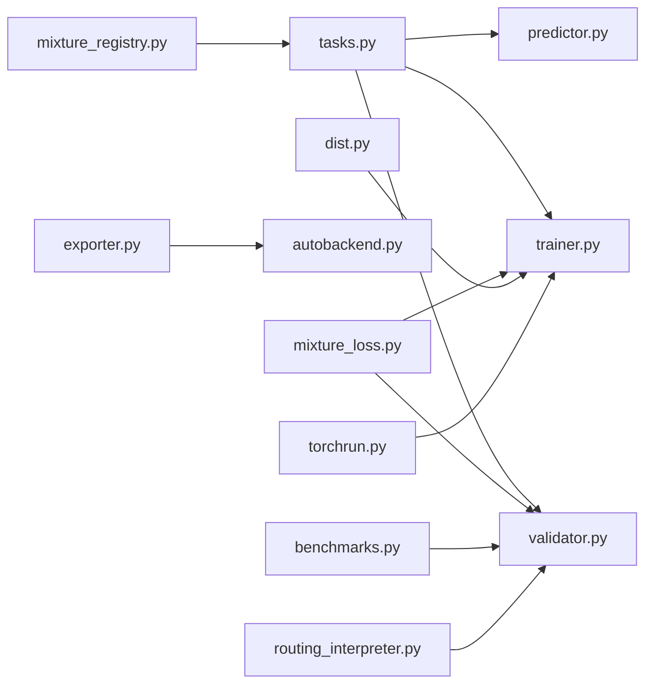

# MoE集成与部署

<cite>
**本文引用的文件**
- [mixture_loss.py](file://ultralytics/nn/mixture_loss.py)
- [mixture_registry.py](file://ultralytics/nn/mixture_registry.py)
- [autobackend.py](file://ultralytics/nn/autobackend.py)
- [exporter.py](file://ultralytics/engine/exporter.py)
- [trainer.py](file://ultralytics/engine/trainer.py)
- [validator.py](file://ultralytics/engine/validator.py)
- [predictor.py](file://ultralytics/engine/predictor.py)
- [tasks.py](file://ultralytics/nn/tasks.py)
- [dist.py](file://ultralytics/utils/dist.py)
- [torchrun.py](file://ultralytics/utils/torchrun.py)
- [benchmarks.py](file://ultralytics/utils/benchmarks.py)
- [routing_interpreter.py](file://ultralytics/utils/routing_interpreter.py)
- [test_moe.py](file://tests/test_moe.py)
- [test_moe_ddp_fixes.py](file://tests/test_moe_ddp_fixes.py)
- [test_moe_dynamic_schedule.py](file://tests/test_moe_dynamic_schedule.py)
- [test_molora.py](file://tests/test_molora.py)
- [test_molora_sparse_dispatch.py](file://tests/test_molora_sparse_dispatch.py)
- [test_molora_routing_aware_merge.py](file://tests/test_molora_routing_aware_merge.py)
- [test_export_capability_matrix.py](file://tests/test_export_capability_matrix.py)
- [test_onnx_export_fix.py](file://tests/test_onnx_export_fix.py)
- [test_mixture_export.py](file://tests/test_mixture_export.py)
- [test_mixture_config_resolution.py](file://tests/test_mixture_config_resolution.py)
- [test_mixture_numeric.py](file://tests/test_mixture_numeric.py)
- [test_mixture_aux_loss.py](file://tests/test_mixture_aux_loss.py)
- [test_mixture_compile.py](file://tests/test_mixture_compile.py)
- [test_mixture_model_registry.py](file://tests/test_mixture_model_registry.py)
- [test_mixture_config_registry.py](file://tests/test_mixture_config_registry.py)
- [test_mixture_loss_composition.py](file://tests/test_mixture_loss_composition.py)
- [test_mixture_fixes.py](file://tests/test_mixture_fixes.py)
- [test_moe_usage_audit.py](file://tests/test_moe_usage_audit.py)
- [test_moe_validation_collectives.py](file://tests/test_moe_validation_collectives.py)
- [test_moe_variant_contract.py](file://tests/test_moe_variant_contract.py)
- [test_moe_router_boundaries.py](file://tests/test_moe_router_boundaries.py)
- [test_moe_ssot.py](file://tests/test_moe_ssot.py)
- [test_moe_amp_index_add.py](file://tests/test_moe_amp_index_add.py)
- [test_moe_aware_peft.py](file://tests/test_moe_aware_peft.py)
- [test_molora_dtype.py](file://tests/test_molora_dtype.py)
- [test_molora_merge_semantics.py](file://tests/test_molora_merge_semantics.py)
- [test_molora_supplementary.py](file://tests/test_molora_supplementary.py)
- [test_yolo26_mixture_matrix.py](file://tests/test_yolo26_mixture_matrix.py)
- [test_yolo26_task_matrix.py](file://tests/test_yolo26_task_matrix.py)
- [yolo26.md](file://docs/en/models/yolo26.md)
- [yolo26-mixture-compatibility.md](file://docs/en/guides/yolo26-mixture-compatibility.md)
- [model-deployment-options.md](file://docs/en/guides/model-deployment-options.md)
- [model-deployment-practices.md](file://docs/en/guides/model-deployment-practices.md)
- [model-monitoring-and-maintenance.md](file://docs/en/guides/model-monitoring-and-maintenance.md)
- [yolo-performance-metrics.md](file://docs/en/guides/yolo-performance-metrics.md)
- [yolo-common-issues.md](file://docs/en/guides/yolo-common-issues.md)
- [onnx.md](file://docs/en/integrations/onnx.md)
- [tensorrt.md](file://docs/en/integrations/tensorrt.md)
- [openvino.md](file://docs/en/integrations/openvino.md)
- [edge-tpu.md](file://docs/en/integrations/edge-tpu.md)
- [nvidia-jetson.md](file://docs/en/guides/nvidia-jetson.md)
- [deepstream-nvidia-jetson.md](file://docs/en/guides/deepstream-nvidia-jetson.md)
- [triton-inference-server.md](file://docs/en/guides/triton-inference-server.md)
- [benchmark.md](file://docs/en/modes/benchmark.md)
- [export.md](file://docs/en/modes/export.md)
- [train.md](file://docs/en/modes/train.md)
- [val.md](file://docs/en/modes/val.md)
- [predict.md](file://docs/en/modes/predict.md)
- [molora_guide.md](file://docs/molora_guide.md)
- [moe_pruning_dynamic_schedule.md](file://docs/moe_pruning_dynamic_schedule.md)
- [governance/moe-class-lifecycle.md](file://docs/governance/moe-class-lifecycle.md)
- [governance/performance-gates.md](file://docs/governance/performance-gates.md)
- [governance/routing-interpretability.md](file://docs/governance/routing-interpretability.md)
- [governance/config-drift-detection.md](file://docs/governance/config-drift-detection.md)
- [governance/export-capability-matrix.yaml](file://docs/governance/export-capability-matrix.yaml)
- [governance/mixture-preservation-manifest.yaml](file://docs/governance/mixture-preservation-manifest.yaml)
- [scripts/bench_moe_micro.py](file://scripts/bench_moe_micro.py)
- [scripts/bench_moe_mps.py](file://scripts/bench_moe_mps.py)
- [scripts/audit_moe_usage.py](file://scripts/audit_moe_usage.py)
- [scripts/run_moe_dynamic_schedule_ablation.py](file://scripts/run_moe_dynamic_schedule_ablation.py)
- [scripts/eval_moe_peft.py](file://scripts/eval_moe_peft.py)
- [scripts/compare_moe_coco128.py](file://scripts/compare_moe_coco128.py)
- [scripts/compare_moe_v0_12_voc.py](file://scripts/compare_moe_v0_12_voc.py)
- [scripts/compare_moe_v0_13_15_voc.py](file://scripts/compare_moe_v0_13_15_voc.py)
- [scripts/moe_pruning_sweep.py](file://scripts/moe_pruning_sweep.py)
- [scripts/validate_routed_export.py](file://scripts/validate_routed_export.py)
- [examples/YOLO-Master-EsMoE-VisDrone-Edge/README.md](file://examples/YOLO-Master-EsMoE-VisDrone-Edge/README.md)
- [examples/YOLO-Master-Edge-Deployment/README.md](file://examples/YOLO-Master-Edge-Deployment/README.md)
- [examples/YOLO-Master-Cross-Platform-Edge-Deployment/README.md](file://examples/YOLO-Master-Cross-Platform-Edge-Deployment/README.md)
</cite>

## 目录
1. [简介](#简介)
2. [项目结构](#项目结构)
3. [核心组件](#核心组件)
4. [架构总览](#架构总览)
5. [详细组件分析](#详细组件分析)
6. [依赖关系分析](#依赖关系分析)
7. [性能考量](#性能考量)
8. [故障排查指南](#故障排查指南)
9. [结论](#结论)
10. [附录](#附录)

## 简介
本技术文档聚焦于YOLO-Master的Mixture-of-Experts（MoE）集成与部署，覆盖以下关键主题：
- MoE在YOLO骨干、颈部与检测头的嵌入方式与契约
- 训练流程与配置，包括分布式训练与数据并行策略
- 模型导出与优化：ONNX、TensorRT及边缘设备部署
- 服务化部署：批量推理、流式处理与资源管理
- 监控与维护：性能监控、异常检测与自动扩缩容
- 基准测试与评估方法
- 最佳实践与常见问题解决方案
- 迁移与升级指南
- 与现有YOLO生态系统的兼容性与互操作性

## 项目结构
仓库围绕“核心实现 + 工具脚本 + 文档 + 示例 + 测试”组织。与MoE相关的核心代码集中在nn层（混合模块、路由、损失）、engine层（训练/验证/预测/导出）、utils层（分布式、基准、路由解释器），以及大量针对MoE的测试与治理文档。

图表来源
- [mixture_loss.py](file://ultralytics/nn/mixture_loss.py)
- [mixture_registry.py](file://ultralytics/nn/mixture_registry.py)
- [tasks.py](file://ultralytics/nn/tasks.py)
- [trainer.py](file://ultralytics/engine/trainer.py)
- [validator.py](file://ultralytics/engine/validator.py)
- [predictor.py](file://ultralytics/engine/predictor.py)
- [exporter.py](file://ultralytics/engine/exporter.py)
- [autobackend.py](file://ultralytics/nn/autobackend.py)
- [dist.py](file://ultralytics/utils/dist.py)
- [torchrun.py](file://ultralytics/utils/torchrun.py)
- [benchmarks.py](file://ultralytics/utils/benchmarks.py)
- [routing_interpreter.py](file://ultralytics/utils/routing_interpreter.py)

章节来源
- [mixture_loss.py](file://ultralytics/nn/mixture_loss.py)
- [mixture_registry.py](file://ultralytics/nn/mixture_registry.py)
- [tasks.py](file://ultralytics/nn/tasks.py)
- [trainer.py](file://ultralytics/engine/trainer.py)
- [validator.py](file://ultralytics/engine/validator.py)
- [predictor.py](file://ultralytics/engine/predictor.py)
- [exporter.py](file://ultralytics/engine/exporter.py)
- [autobackend.py](file://ultralytics/nn/autobackend.py)
- [dist.py](file://ultralytics/utils/dist.py)
- [torchrun.py](file://ultralytics/utils/torchrun.py)
- [benchmarks.py](file://ultralytics/utils/benchmarks.py)
- [routing_interpreter.py](file://ultralytics/utils/routing_interpreter.py)

## 核心组件
- 混合模块注册表与契约：提供统一的专家网络与路由器接口，支持动态调度、稀疏激活与可插拔专家。
- 路由与辅助损失：包含负载均衡、门控权重统计与路由可解释性指标，确保多专家均衡使用。
- 任务装配：将MoE模块注入到YOLO主干、颈部或检测头位置，保持原有任务接口不变。
- 训练/验证/预测引擎：对MoE进行端到端支持，包括DDP通信、EMA、AMP与路由统计收集。
- 导出与后端：统一导出入口，适配ONNX/TensorRT/OpenVINO等后端，并保证路由逻辑在导出后正确执行。
- 分布式与基准：基于torchrun与自定义分布式工具，提供微基准与MPS/CPU/GPU跨平台基准。

章节来源
- [mixture_registry.py](file://ultralytics/nn/mixture_registry.py)
- [mixture_loss.py](file://ultralytics/nn/mixture_loss.py)
- [tasks.py](file://ultralytics/nn/tasks.py)
- [trainer.py](file://ultralytics/engine/trainer.py)
- [validator.py](file://ultralytics/engine/validator.py)
- [predictor.py](file://ultralytics/engine/predictor.py)
- [exporter.py](file://ultralytics/engine/exporter.py)
- [autobackend.py](file://ultralytics/nn/autobackend.py)
- [dist.py](file://ultralytics/utils/dist.py)
- [torchrun.py](file://ultralytics/utils/torchrun.py)
- [benchmarks.py](file://ultralytics/utils/benchmarks.py)

## 架构总览
下图展示从训练到推理/导出的完整链路，标注了MoE在各阶段的参与点。

图表来源
- [trainer.py](file://ultralytics/engine/trainer.py)
- [tasks.py](file://ultralytics/nn/tasks.py)
- [dist.py](file://ultralytics/utils/dist.py)
- [torchrun.py](file://ultralytics/utils/torchrun.py)
- [validator.py](file://ultralytics/engine/validator.py)
- [predictor.py](file://ultralytics/engine/predictor.py)
- [exporter.py](file://ultralytics/engine/exporter.py)
- [autobackend.py](file://ultralytics/nn/autobackend.py)

## 详细组件分析

### 组件A：MoE模块与路由（骨干/颈部/检测头嵌入）
- 嵌入位置：通过任务装配将MoE插入到主干特征提取、颈部融合或检测头分支中，保持输入输出张量形状与任务语义一致。
- 路由机制：每层可选Top-K专家激活，结合负载均衡辅助损失，避免专家倾斜。
- 契约与注册：通过注册表统一管理专家类型、路由策略与参数，便于扩展新专家与路由算法。
- 兼容性：在不改变上层接口的前提下，以“透明替换”的方式接入YOLO各阶段。

图表来源
- [mixture_registry.py](file://ultralytics/nn/mixture_registry.py)
- [tasks.py](file://ultralytics/nn/tasks.py)

章节来源
- [mixture_registry.py](file://ultralytics/nn/mixture_registry.py)
- [tasks.py](file://ultralytics/nn/tasks.py)

### 组件B：训练流程与分布式策略
- 训练主循环：构建模型与数据管道，执行前向/反向，累积路由统计与辅助损失，周期性保存检查点。
- 分布式训练：基于torchrun与自定义分布式工具，支持DDP；对MoE的路由统计与梯度进行AllReduce聚合。
- AMP与EMA：启用混合精度加速训练，指数移动平均提升稳定性。
- 验证与早停：按间隔执行验证，记录mAP、F1、延迟等指标，结合路由健康度进行决策。

图表来源
- [trainer.py](file://ultralytics/engine/trainer.py)
- [dist.py](file://ultralytics/utils/dist.py)
- [torchrun.py](file://ultralytics/utils/torchrun.py)
- [mixture_loss.py](file://ultralytics/nn/mixture_loss.py)

章节来源
- [trainer.py](file://ultralytics/engine/trainer.py)
- [dist.py](file://ultralytics/utils/dist.py)
- [torchrun.py](file://ultralytics/utils/torchrun.py)
- [mixture_loss.py](file://ultralytics/nn/mixture_loss.py)

### 组件C：导出与优化（ONNX/TensorRT/OpenVINO/边缘）
- 导出入口：统一导出API，支持动态轴、算子能力矩阵与预检。
- 路由固化：在导出时可选择将路由逻辑固化为静态图，或在运行时保留动态路由。
- 后端优化：根据目标平台选择ONNX Runtime、TensorRT、OpenVINO等后端，并进行量化与内核融合。
- 边缘部署：面向Jetson、EdgeTPU等平台提供专用脚本与说明。

图表来源
- [exporter.py](file://ultralytics/engine/exporter.py)
- [autobackend.py](file://ultralytics/nn/autobackend.py)
- [test_export_capability_matrix.py](file://tests/test_export_capability_matrix.py)
- [test_onnx_export_fix.py](file://tests/test_onnx_export_fix.py)
- [test_mixture_export.py](file://tests/test_mixture_export.py)

章节来源
- [exporter.py](file://ultralytics/engine/exporter.py)
- [autobackend.py](file://ultralytics/nn/autobackend.py)
- [test_export_capability_matrix.py](file://tests/test_export_capability_matrix.py)
- [test_onnx_export_fix.py](file://tests/test_onnx_export_fix.py)
- [test_mixture_export.py](file://tests/test_mixture_export.py)

### 组件D：服务化部署（批量/流式/资源管理）
- 批量推理：通过预测器批处理输入，结合后端优化提升吞吐。
- 流式处理：结合视频流与切片推理，降低延迟。
- 资源管理：依据设备能力与负载动态调整批大小、并发数与内存占用。
- 服务端集成：提供与Triton等推理服务器的对接指南。

章节来源
- [predictor.py](file://ultralytics/engine/predictor.py)
- [autobackend.py](file://ultralytics/nn/autobackend.py)
- [triton-inference-server.md](file://docs/en/guides/triton-inference-server.md)
- [model-deployment-options.md](file://docs/en/guides/model-deployment-options.md)
- [model-deployment-practices.md](file://docs/en/guides/model-deployment-practices.md)

### 组件E：监控与维护（性能/异常/扩缩容）
- 性能监控：采集延迟、吞吐、GPU利用率、路由专家使用分布等指标。
- 异常检测：检测NaN/Inf、路由崩溃、专家过载等异常模式。
- 自动扩缩容：基于指标阈值触发实例增减，保障SLA。
- 路由可解释性：利用路由解释器分析专家选择路径与场景相关性。

章节来源
- [routing_interpreter.py](file://ultralytics/utils/routing_interpreter.py)
- [benchmarks.py](file://ultralytics/utils/benchmarks.py)
- [model-monitoring-and-maintenance.md](file://docs/en/guides/model-monitoring-and-maintenance.md)
- [governance/routing-interpretability.md](file://docs/governance/routing-interpretability.md)

### 组件F：基准测试与评估
- 基准套件：提供端到端基准与微基准，覆盖不同硬件与后端。
- 评估指标：mAP、F1、延迟、吞吐、显存占用、路由健康度。
- 对比实验：与基线或非MoE版本进行对比，验证收益与代价。

章节来源
- [benchmarks.py](file://ultralytics/utils/benchmarks.py)
- [benchmark.md](file://docs/en/modes/benchmark.md)
- [yolo-performance-metrics.md](file://docs/en/guides/yolo-performance-metrics.md)
- [scripts/bench_moe_micro.py](file://scripts/bench_moe_micro.py)
- [scripts/bench_moe_mps.py](file://scripts/bench_moe_mPS.py)

### 组件G：PEFT与MoE协同（LoRA/MoLaRa）
- PEFT感知：在MoE上下文中应用LoRA等参数高效微调，避免破坏路由与专家结构。
- MoLaRa：路由感知的合并策略，兼顾性能与效率。
- 评估与消融：提供脚本与测试验证不同策略的效果。

章节来源
- [test_moe_aware_peft.py](file://tests/test_moe_aware_peft.py)
- [test_molora.py](file://tests/test_molora.py)
- [test_molora_sparse_dispatch.py](file://tests/test_molora_sparse_dispatch.py)
- [test_molora_routing_aware_merge.py](file://tests/test_molora_routing_aware_merge.py)
- [test_molora_dtype.py](file://tests/test_molora_dtype.py)
- [test_molora_merge_semantics.py](file://tests/test_molora_merge_semantics.py)
- [test_molora_supplementary.py](file://tests/test_molora_supplementary.py)
- [molora_guide.md](file://docs/molora_guide.md)

## 依赖关系分析
- 内部耦合：
  - tasks负责装配MoE到YOLO各阶段，trainer/validator/predictor依赖其接口。
  - mixture_registry与mixture_loss为MoE核心，被tasks与训练/验证流程广泛使用。
  - exporter与autobackend共同决定导出与运行时后端行为。
- 外部依赖：
  - torchrun与dist用于分布式训练。
  - ONNX/TensorRT/OpenVINO等后端用于导出与部署。
  - 基准与路由解释器用于分析与诊断。

图表来源
- [tasks.py](file://ultralytics/nn/tasks.py)
- [trainer.py](file://ultralytics/engine/trainer.py)
- [validator.py](file://ultralytics/engine/validator.py)
- [predictor.py](file://ultralytics/engine/predictor.py)
- [mixture_registry.py](file://ultralytics/nn/mixture_registry.py)
- [mixture_loss.py](file://ultralytics/nn/mixture_loss.py)
- [exporter.py](file://ultralytics/engine/exporter.py)
- [autobackend.py](file://ultralytics/nn/autobackend.py)
- [dist.py](file://ultralytics/utils/dist.py)
- [torchrun.py](file://ultralytics/utils/torchrun.py)
- [benchmarks.py](file://ultralytics/utils/benchmarks.py)
- [routing_interpreter.py](file://ultralytics/utils/routing_interpreter.py)

章节来源
- [tasks.py](file://ultralytics/nn/tasks.py)
- [trainer.py](file://ultralytics/engine/trainer.py)
- [validator.py](file://ultralytics/engine/validator.py)
- [predictor.py](file://ultralytics/engine/predictor.py)
- [mixture_registry.py](file://ultralytics/nn/mixture_registry.py)
- [mixture_loss.py](file://ultralytics/nn/mixture_loss.py)
- [exporter.py](file://ultralytics/engine/exporter.py)
- [autobackend.py](file://ultralytics/nn/autobackend.py)
- [dist.py](file://ultralytics/utils/dist.py)
- [torchrun.py](file://ultralytics/utils/torchrun.py)
- [benchmarks.py](file://ultralytics/utils/benchmarks.py)
- [routing_interpreter.py](file://ultralytics/utils/routing_interpreter.py)

## 性能考量
- 路由开销：Top-K选择与专家激活带来额外计算，需权衡K值与专家规模。
- 负载均衡：辅助损失与路由统计有助于避免专家倾斜，但会引入通信与统计成本。
- 导出优化：在ONNX/TensorRT/OpenVINO中进行算子融合与量化，显著降低延迟。
- 批大小与并发：在服务端根据设备能力调优批大小与线程/进程数。
- 硬件差异：CPU/GPU/NPU/Jetson等不同平台的算子支持与内存带宽差异较大，需针对性优化。

[本节为通用指导，不直接分析具体文件]

## 故障排查指南
- 训练不稳定：检查路由辅助损失权重、学习率与AMP设置；关注路由统计与专家使用分布。
- 导出失败：核对算子能力矩阵与预检报告，必要时降级或替换不支持的算子。
- 推理错误：确认后端选择与模型格式匹配，检查动态轴与输入形状。
- 分布式问题：验证DDP初始化、环境变量与节点通信；定位AllReduce异常。
- 路由异常：使用路由解释器分析专家选择路径，识别热点与冷专家。

章节来源
- [test_moe_ddp_fixes.py](file://tests/test_moe_ddp_fixes.py)
- [test_moe_dynamic_schedule.py](file://tests/test_moe_dynamic_schedule.py)
- [test_moe_router_boundaries.py](file://tests/test_moe_router_boundaries.py)
- [test_moe_ssot.py](file://tests/test_moe_ssot.py)
- [test_moe_amp_index_add.py](file://tests/test_moe_amp_index_add.py)
- [test_moe_validation_collectives.py](file://tests/test_moe_validation_collectives.py)
- [test_moe_variant_contract.py](file://tests/test_moe_variant_contract.py)
- [test_moe_usage_audit.py](file://tests/test_moe_usage_audit.py)
- [test_mixture_aux_loss.py](file://tests/test_mixture_aux_loss.py)
- [test_mixture_numeric.py](file://tests/test_mixture_numeric.py)
- [test_mixture_compile.py](file://tests/test_mixture_compile.py)
- [test_mixture_model_registry.py](file://tests/test_mixture_model_registry.py)
- [test_mixture_config_registry.py](file://tests/test_mixture_config_registry.py)
- [test_mixture_loss_composition.py](file://tests/test_mixture_loss_composition.py)
- [test_mixture_fixes.py](file://tests/test_mixture_fixes.py)
- [test_moe.py](file://tests/test_moe.py)
- [routing_interpreter.py](file://ultralytics/utils/routing_interpreter.py)
- [dist.py](file://ultralytics/utils/dist.py)
- [torchrun.py](file://ultralytics/utils/torchrun.py)

## 结论
YOLO-Master的MoE集成在保持原有任务接口的同时，提供了灵活的路由与专家机制，并通过完善的训练、导出、部署与监控工具链，实现了从研发到生产的全链路支持。建议在工程中优先关注路由健康度、导出能力矩阵与服务端资源管理，以获得稳定且高效的部署效果。

[本节为总结，不直接分析具体文件]

## 附录

### A. 训练与配置要点
- 训练模式：参考训练模式文档与治理中的性能门禁。
- 配置解析：确保混合配置解析与注册表一致性。
- 动态调度与剪枝：结合动态调度与专家剪枝策略，平衡性能与容量。

章节来源
- [train.md](file://docs/en/modes/train.md)
- [governance/performance-gates.md](file://docs/governance/performance-gates.md)
- [test_mixture_config_resolution.py](file://tests/test_mixture_config_resolution.py)
- [moe_pruning_dynamic_schedule.md](file://docs/moe_pruning_dynamic_schedule.md)
- [scripts/run_moe_dynamic_schedule_ablation.py](file://scripts/run_moe_dynamic_schedule_ablation.py)

### B. 导出与优化清单
- 导出模式：参考导出模式文档与能力矩阵。
- ONNX/TensorRT/OpenVINO：遵循对应集成文档进行转换与优化。
- 边缘部署：参考边缘部署示例与指南。

章节来源
- [export.md](file://docs/en/modes/export.md)
- [test_export_capability_matrix.py](file://tests/test_export_capability_matrix.py)
- [onnx.md](file://docs/en/integrations/onnx.md)
- [tensorrt.md](file://docs/en/integrations/tensorrt.md)
- [openvino.md](file://docs/en/integrations/openvino.md)
- [edge-tpu.md](file://docs/en/integrations/edge-tpu.md)
- [nvidia-jetson.md](file://docs/en/guides/nvidia-jetson.md)
- [deepstream-nvidia-jetson.md](file://docs/en/guides/deepstream-nvidia-jetson.md)
- [examples/YOLO-Master-EsMoE-VisDrone-Edge/README.md](file://examples/YOLO-Master-EsMoE-VisDrone-Edge/README.md)
- [examples/YOLO-Master-Edge-Deployment/README.md](file://examples/YOLO-Master-Edge-Deployment/README.md)
- [examples/YOLO-Master-Cross-Platform-Edge-Deployment/README.md](file://examples/YOLO-Master-Cross-Platform-Edge-Deployment/README.md)

### C. 服务化与监控
- 服务模式：参考Triton与部署实践文档。
- 监控维护：参考监控与维护指南。
- 路由可解释性：参考治理文档与路由解释器。

章节来源
- [triton-inference-server.md](file://docs/en/guides/triton-inference-server.md)
- [model-deployment-options.md](file://docs/en/guides/model-deployment-options.md)
- [model-deployment-practices.md](file://docs/en/guides/model-deployment-practices.md)
- [model-monitoring-and-maintenance.md](file://docs/en/guides/model-monitoring-and-maintenance.md)
- [governance/routing-interpretability.md](file://docs/governance/routing-interpretability.md)
- [routing_interpreter.py](file://ultralytics/utils/routing_interpreter.py)

### D. 基准与评估
- 基准模式：参考基准模式文档与性能指标指南。
- 评估脚本：使用提供的基准与对比脚本。

章节来源
- [benchmark.md](file://docs/en/modes/benchmark.md)
- [yolo-performance-metrics.md](file://docs/en/guides/yolo-performance-metrics.md)
- [scripts/bench_moe_micro.py](file://scripts/bench_moe_micro.py)
- [scripts/bench_moe_mPS.py](file://scripts/bench_moe_mPS.py)
- [scripts/compare_moe_coco128.py](file://scripts/compare_moe_coco128.py)
- [scripts/compare_moe_v0_12_voc.py](file://scripts/compare_moe_v0_12_voc.py)
- [scripts/compare_moe_v0_13_15_voc.py](file://scripts/compare_moe_v0_13_15_voc.py)
- [scripts/moe_pruning_sweep.py](file://scripts/moe_pruning_sweep.py)
- [scripts/eval_moe_peft.py](file://scripts/eval_moe_peft.py)

### E. 迁移与升级
- 版本兼容：参考YOLO26混合兼容性与治理清单。
- 类生命周期：遵循MoE类生命周期规范。
- 配置漂移检测：使用治理工具检测配置漂移。

章节来源
- [yolo26.md](file://docs/en/models/yolo26.md)
- [yolo26-mixture-compatibility.md](file://docs/en/guides/yolo26-mixture-compatibility.md)
- [governance/moe-class-lifecycle.md](file://docs/governance/moe-class-lifecycle.md)
- [governance/config-drift-detection.md](file://docs/governance/config-drift-detection.md)
- [governance/export-capability-matrix.yaml](file://docs/governance/export-capability-matrix.yaml)
- [governance/mixture-preservation-manifest.yaml](file://docs/governance/mixture-preservation-manifest.yaml)

### F. 最佳实践与常见问题
- 最佳实践：合理设置Top-K与专家规模；启用路由辅助损失；定期校准路由；导出前进行能力矩阵校验。
- 常见问题：参考常见问题文档与相关测试用例。

章节来源
- [yolo-common-issues.md](file://docs/en/guides/yolo-common-issues.md)
- [test_moe.py](file://tests/test_moe.py)
- [test_moe_ddp_fixes.py](file://tests/test_moe_ddp_fixes.py)
- [test_moe_dynamic_schedule.py](file://tests/test_moe_dynamic_schedule.py)
- [test_moe_router_boundaries.py](file://tests/test_moe_router_boundaries.py)
- [test_moe_ssot.py](file://tests/test_moe_ssot.py)
- [test_moe_amp_index_add.py](file://tests/test_moe_amp_index_add.py)
- [test_moe_validation_collectives.py](file://tests/test_moe_validation_collectives.py)
- [test_moe_variant_contract.py](file://tests/test_moe_variant_contract.py)
- [test_moe_usage_audit.py](file://tests/test_moe_usage_audit.py)

### G. 与YOLO生态的兼容性与互操作
- 任务矩阵：确保MoE在不同任务下的兼容性。
- 导出能力矩阵：遵循能力矩阵与预检流程。
- 审计与回归：使用审计脚本与回归测试保障一致性。

章节来源
- [test_yolo26_task_matrix.py](file://tests/test_yolo26_task_matrix.py)
- [test_yolo26_mixture_matrix.py](file://tests/test_yolo26_mixture_matrix.py)
- [test_export_capability_matrix.py](file://tests/test_export_capability_matrix.py)
- [scripts/audit_moe_usage.py](file://scripts/audit_moe_usage.py)
- [scripts/validate_routed_export.py](file://scripts/validate_routed_export.py)