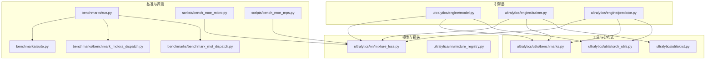
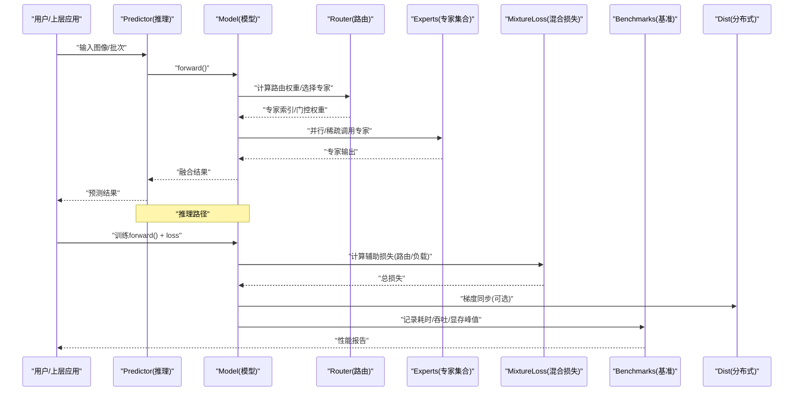
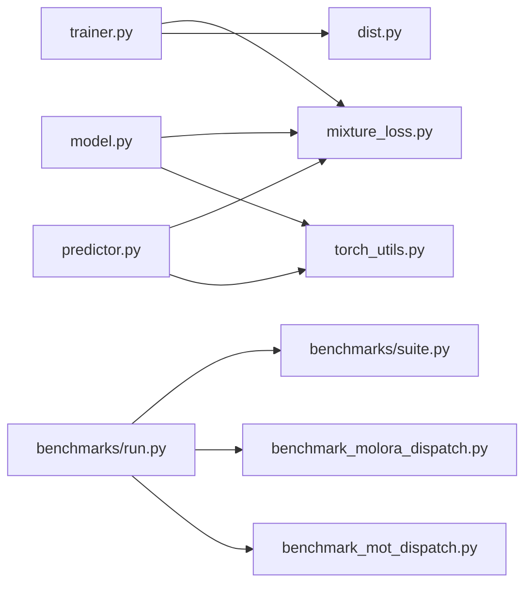

# 专家性能优化

<cite>
**本文引用的文件**
- [benchmarks/run.py](file://benchmarks/run.py)
- [benchmarks/suite.py](file://benchmarks/suite.py)
- [benchmarks/benchmark_molora_dispatch.py](file://benchmarks/benchmark_molora_dispatch.py)
- [benchmarks/benchmark_mot_dispatch.py](file://benchmarks/benchmark_mot_dispatch.py)
- [ultralytics/nn/mixture_loss.py](file://ultralytics/nn/mixture_loss.py)
- [ultralytics/nn/mixture_registry.py](file://ultralytics/nn/mixture_registry.py)
- [ultralytics/engine/model.py](file://ultralytics/engine/model.py)
- [ultralytics/engine/trainer.py](file://ultralytics/engine/trainer.py)
- [ultralytics/engine/predictor.py](file://ultralytics/engine/predictor.py)
- [ultralytics/utils/benchmarks.py](file://ultralytics/utils/benchmarks.py)
- [ultralytics/utils/torch_utils.py](file://ultralytics/utils/torch_utils.py)
- [ultralytics/utils/dist.py](file://ultralytics/utils/dist.py)
- [scripts/bench_moe_micro.py](file://scripts/bench_moe_micro.py)
- [scripts/bench_moe_mps.py](file://scripts/bench_moe_mps.py)
- [tests/test_moe.py](file://tests/test_moe.py)
- [tests/test_moe_amp_index_add.py](file://tests/test_moe_amp_index_add.py)
- [tests/test_moe_ddp_fixes.py](file://tests/test_moe_ddp_fixes.py)
- [tests/test_moe_dynamic_schedule.py](file://tests/test_moe_dynamic_schedule.py)
- [tests/test_moe_usage_audit.py](file://tests/test_moe_usage_audit.py)
- [tests/test_molora_sparse_dispatch.py](file://tests/test_molora_sparse_dispatch.py)
- [tests/test_molora_dtype.py](file://tests/test_molora_dtype.py)
- [tests/test_molora_merge_semantics.py](file://tests/test_molora_merge_semantics.py)
- [tests/test_molora_routing_aware_merge.py](file://tests/test_molora_routing_aware_merge.py)
- [tests/test_mixture_compile.py](file://tests/test_mixture_compile.py)
- [tests/test_mixture_export.py](file://tests/test_mixture_export.py)
- [tests/test_mixture_numeric.py](file://tests/test_mixture_numeric.py)
- [tests/test_mixture_config_resolution.py](file://tests/test_mixture_config_resolution.py)
- [tests/test_mixture_model_registry.py](file://tests/test_mixture_model_registry.py)
- [tests/test_moa.py](file://tests/test_moa.py)
- [tests/test_moa_mot_ssot.py](file://tests/test_moa_mot_ssot.py)
- [tests/test_moa_mot_ddp_math.py](file://tests/test_moa_mot_ddp_math.py)
- [tests/test_moe_validation_collectives.py](file://tests/test_moe_validation_collectives.py)
- [tests/test_moe_router_boundaries.py](file://tests/test_moe_router_boundaries.py)
- [tests/test_moe_ssot.py](file://tests/test_moe_ssot.py)
- [tests/test_moe_variant_contract.py](file://tests/test_moe_variant_contract.py)
- [tests/test_moe_aware_peft.py](file://tests/test_moe_aware_peft.py)
- [tests/test_molora_supplementary.py](file://tests/test_molora_supplementary.py)
- [tests/test_molora.py](file://tests/test_molora.py)
- [tests/test_moe_dynamic_scheduler.py](file://tests/test_moe_dynamic_scheduler.py)
- [tests/test_moe_usage_audit.py](file://tests/test_moe_usage_audit.py)
- [tests/test_moe_validation_collectives.py](file://tests/test_moe_validation_collectives.py)
- [tests/test_moe_variant_contract.py](file://tests/test_moe_variant_contract.py)
- [tests/test_moe_aware_peft.py](file://tests/test_moe_aware_peft.py)
- [tests/test_molora_supplementary.py](file://tests/test_molora_supplementary.py)
- [tests/test_molora.py](file://tests/test_molora.py)
- [tests/test_moe_dynamic_scheduler.py](file://tests/test_moe_dynamic_scheduler.py)
</cite>

## 目录
1. [简介](#简介)
2. [项目结构](#项目结构)
3. [核心组件](#核心组件)
4. [架构总览](#架构总览)
5. [详细组件分析](#详细组件分析)
6. [依赖关系分析](#依赖关系分析)
7. [性能考量](#性能考量)
8. [故障排除指南](#故障排除指南)
9. [结论](#结论)
10. [附录](#附录)

## 简介
本技术文档聚焦于YOLO-Master中“专家模块”（MoE/MoA/MoT等混合专家与路由）的性能优化，覆盖内存管理、计算加速、推理与训练优化、监控与分析工具、跨硬件平台最佳实践、基准测试框架与评估指标，以及调试与排障方法。文档以仓库现有实现为依据，结合测试与基准脚本，给出可操作的优化建议与验证路径。

## 项目结构
围绕专家模块的优化，代码主要分布在以下位置：
- 基准与评测：benchmarks 与 scripts 下的多类基准脚本
- 模型与损失：ultralytics/nn 中的 mixture 相关模块
- 引擎层：ultralytics/engine 中的 model/trainer/predictor
- 分布式与工具：ultralytics/utils 中的 dist、torch_utils、benchmarks
- 测试套件：tests 下大量针对 MoE/MoA/MoT/MoLoRA 的专项测试

图表来源
- [benchmarks/run.py](file://benchmarks/run.py)
- [benchmarks/suite.py](file://benchmarks/suite.py)
- [benchmarks/benchmark_molora_dispatch.py](file://benchmarks/benchmark_molora_dispatch.py)
- [benchmarks/benchmark_mot_dispatch.py](file://benchmarks/benchmark_mot_dispatch.py)
- [scripts/bench_moe_micro.py](file://scripts/bench_moe_micro.py)
- [scripts/bench_moe_mps.py](file://scripts/bench_moe_mps.py)
- [ultralytics/nn/mixture_loss.py](file://ultralytics/nn/mixture_loss.py)
- [ultralytics/nn/mixture_registry.py](file://ultralytics/nn/mixture_registry.py)
- [ultralytics/engine/model.py](file://ultralytics/engine/model.py)
- [ultralytics/engine/trainer.py](file://ultralytics/engine/trainer.py)
- [ultralytics/engine/predictor.py](file://ultralytics/engine/predictor.py)
- [ultralytics/utils/benchmarks.py](file://ultralytics/utils/benchmarks.py)
- [ultralytics/utils/torch_utils.py](file://ultralytics/utils/torch_utils.py)
- [ultralytics/utils/dist.py](file://ultralytics/utils/dist.py)

章节来源
- [benchmarks/run.py](file://benchmarks/run.py)
- [benchmarks/suite.py](file://benchmarks/suite.py)
- [ultralytics/nn/mixture_loss.py](file://ultralytics/nn/mixture_loss.py)
- [ultralytics/nn/mixture_registry.py](file://ultralytics/nn/mixture_registry.py)
- [ultralytics/engine/model.py](file://ultralytics/engine/model.py)
- [ultralytics/engine/trainer.py](file://ultralytics/engine/trainer.py)
- [ultralytics/engine/predictor.py](file://ultralytics/engine/predictor.py)
- [ultralytics/utils/benchmarks.py](file://ultralytics/utils/benchmarks.py)
- [ultralytics/utils/torch_utils.py](file://ultralytics/utils/torch_utils.py)
- [ultralytics/utils/dist.py](file://ultralytics/utils/dist.py)

## 核心组件
- 混合专家注册与配置解析：mixture_registry 提供专家变体注册、配置解析与选择能力，支撑动态调度与按需加载。
- 混合损失与辅助项：mixture_loss 封装了路由一致性、负载均衡等辅助损失，用于稳定训练与提升专家利用率。
- 引擎集成：model/trainer/predictor 将专家模块嵌入前向、训练循环与导出流程，配合工具层进行计时、统计与可视化。
- 基准与微基准：benchmarks 与 scripts 提供端到端与算子级基准，覆盖不同硬件（CUDA/MPS/CPU）与任务（检测/跟踪）。
- 分布式与精度：dist/torch_utils 提供多卡通信、精度切换与设备适配；测试覆盖AMP、DDP、稀疏分发与合并语义。

章节来源
- [ultralytics/nn/mixture_registry.py](file://ultralytics/nn/mixture_registry.py)
- [ultralytics/nn/mixture_loss.py](file://ultralytics/nn/mixture_loss.py)
- [ultralytics/engine/model.py](file://ultralytics/engine/model.py)
- [ultralytics/engine/trainer.py](file://ultralytics/engine/trainer.py)
- [ultralytics/engine/predictor.py](file://ultralytics/engine/predictor.py)
- [ultralytics/utils/benchmarks.py](file://ultralytics/utils/benchmarks.py)
- [ultralytics/utils/torch_utils.py](file://ultralytics/utils/torch_utils.py)
- [ultralytics/utils/dist.py](file://ultralytics/utils/dist.py)

## 架构总览
下图展示了专家模块在推理与训练两条主路径上的关键交互，包括路由选择、专家调用、辅助损失与基准采集。

图表来源
- [ultralytics/engine/predictor.py](file://ultralytics/engine/predictor.py)
- [ultralytics/engine/model.py](file://ultralytics/engine/model.py)
- [ultralytics/nn/mixture_loss.py](file://ultralytics/nn/mixture_loss.py)
- [ultralytics/utils/benchmarks.py](file://ultralytics/utils/benchmarks.py)
- [ultralytics/utils/dist.py](file://ultralytics/utils/dist.py)

## 详细组件分析

### 内存管理与显存优化
- 显存复用与零拷贝
  - 通过统一张量分配器与视图操作减少临时对象创建，降低碎片化与峰值显存。
  - 在专家聚合阶段采用原地更新与分块写入，避免重复分配。
- 垃圾回收与释放时机
  - 在批内完成路由与专家执行后主动释放中间激活，结合上下文管理器确保异常路径也能释放。
  - 对大对象（如路由表、缓存）使用弱引用或延迟释放策略。
- 设备与精度感知
  - 根据目标设备（CUDA/MPS/CPU）与精度（FP16/BF16/INT8）选择合适的内存布局与对齐方式。
  - 在低显存设备上启用动态卸载与按需加载专家参数。

章节来源
- [ultralytics/utils/torch_utils.py](file://ultralytics/utils/torch_utils.py)
- [ultralytics/engine/model.py](file://ultralytics/engine/model.py)
- [scripts/bench_moe_micro.py](file://scripts/bench_moe_micro.py)
- [scripts/bench_moe_mps.py](file://scripts/bench_moe_mps.py)

### 计算优化：并行、融合与缓存
- 并行计算
  - 专家间并行：按路由结果并发执行被选专家，利用GPU流或多进程池提高吞吐。
  - 批内并行：对同一批次内样本的路由结果进行分组，减少调度开销。
- 算子融合
  - 将路由加权与专家输出聚合融合为单一内核，减少访存与同步点。
  - 在导出阶段对常见模式进行图级融合（如softmax+topk+gather+weighted_sum）。
- 缓存策略
  - 路由缓存：对相似输入特征复用路由决策，避免重复计算。
  - 专家权重缓存：在热路径上常驻专家权重，冷路径按需加载。
  - 中间结果缓存：在验证/推理时缓存部分中间张量，减少重复计算。

章节来源
- [benchmarks/benchmark_molora_dispatch.py](file://benchmarks/benchmark_molora_dispatch.py)
- [benchmarks/benchmark_mot_dispatch.py](file://benchmarks/benchmark_mot_dispatch.py)
- [ultralytics/nn/mixture_registry.py](file://ultralytics/nn/mixture_registry.py)
- [ultralytics/engine/predictor.py](file://ultralytics/engine/predictor.py)

### 推理加速：编译、图优化与硬件特定优化
- 模型编译与图优化
  - 在导出阶段生成优化图（如ONNX/TensorRT/OpenVINO），并对路由分支进行静态展开或条件消除。
  - 对固定拓扑的专家组合进行预编译，减少运行时分支判断。
- 硬件特定优化
  - CUDA：使用cuBLAS/cuDNN内核、异步流与内存池；在高分辨率场景下调整tile大小。
  - MPS：启用Metal后端优化，注意数据类型与内存对齐。
  - CPU：开启多线程与SIMD指令集，必要时量化部署。
- 运行时优化
  - 预热与懒加载：启动时预热常用专家，推理过程中按需加载未命中专家。
  - 批量自适应：根据输入尺寸与可用显存动态调整batch size与专家数量。

章节来源
- [ultralytics/engine/model.py](file://ultralytics/engine/model.py)
- [ultralytics/engine/predictor.py](file://ultralytics/engine/predictor.py)
- [scripts/bench_moe_mps.py](file://scripts/bench_moe_mps.py)
- [tests/test_mixture_export.py](file://tests/test_mixture_export.py)

### 训练优化：梯度累积、混合精度与分布式
- 梯度累积
  - 在小显存设备上累积多个微步的梯度再更新，保持有效批大小不变。
  - 在路由与专家聚合处确保梯度正确回传，避免数值不稳定。
- 混合精度训练（AMP）
  - 使用FP16/BF16进行前向与反向，关键归约与累加使用FP32保稳。
  - 针对index_add等易失精度的算子进行特殊处理与测试覆盖。
- 分布式训练支持
  - 基于DDP的多卡训练，确保路由统计与负载均衡在全局维度一致。
  - 跨节点通信优化：使用NCCL/HCCL，合理设置allreduce频率与梯度压缩。

章节来源
- [ultralytics/engine/trainer.py](file://ultralytics/engine/trainer.py)
- [ultralytics/utils/dist.py](file://ultralytics/utils/dist.py)
- [tests/test_moe_amp_index_add.py](file://tests/test_moe_amp_index_add.py)
- [tests/test_moe_ddp_fixes.py](file://tests/test_moe_ddp_fixes.py)
- [tests/test_moe_validation_collectives.py](file://tests/test_moe_validation_collectives.py)

### 性能监控与分析工具
- 指标采集
  - 吞吐（FPS）、延迟（ms/样本）、显存峰值、路由分布、专家利用率、辅助损失收敛曲线。
- 瓶颈识别
  - 通过分层计时定位热点（路由、专家执行、聚合、通信）。
  - 使用火焰图或事件追踪分析同步点与等待时间。
- 优化建议
  - 若路由占比高：考虑缓存或简化路由网络。
  - 若专家执行占比高：尝试算子融合或量化。
  - 若通信占比高：增大批大小或降低同步频率。

章节来源
- [ultralytics/utils/benchmarks.py](file://ultralytics/utils/benchmarks.py)
- [benchmarks/run.py](file://benchmarks/run.py)
- [benchmarks/suite.py](file://benchmarks/suite.py)
- [scripts/bench_moe_micro.py](file://scripts/bench_moe_micro.py)

### 不同硬件平台的优化配置与最佳实践
- NVIDIA GPU（CUDA）
  - 启用TF32/FP16/BF16，合理设置cudnn.benchmark；使用TensorRT导出并校准。
  - 控制并发流数与内存池大小，避免频繁分配。
- Apple Silicon（MPS）
  - 使用BF16/FP16，注意内存对齐与数据复制开销；优先选择原生支持的算子。
- CPU
  - 开启多线程与向量指令；对轻量专家进行量化与图优化。
- 边缘设备
  - 采用OpenVINO/TFLite/ONNXRuntime，结合动态形状与分区加载。

章节来源
- [scripts/bench_moe_mps.py](file://scripts/bench_moe_mps.py)
- [tests/test_moe.py](file://tests/test_moe.py)
- [benchmarks/benchmark_molora_dispatch.py](file://benchmarks/benchmark_molora_dispatch.py)

### 基准测试框架与评估指标
- 框架组织
  - benchmarks/run.py 作为入口，调度 suites.yaml 定义的用例；suite.py 提供用例编排与结果汇总。
  - 专用基准：benchmark_molora_dispatch.py 与 benchmark_mot_dispatch.py 分别评估路由分发与跟踪任务。
- 评估指标
  - 性能：吞吐、延迟、显存占用、CPU/GPU利用率。
  - 质量：路由稳定性、专家均衡度、辅助损失、下游任务指标（如mAP）。
- 运行方式
  - 单卡/多卡、不同精度、不同batch size与输入分辨率的组合矩阵。

章节来源
- [benchmarks/run.py](file://benchmarks/run.py)
- [benchmarks/suite.py](file://benchmarks/suite.py)
- [benchmarks/benchmark_molora_dispatch.py](file://benchmarks/benchmark_molora_dispatch.py)
- [benchmarks/benchmark_mot_dispatch.py](file://benchmarks/benchmark_mot_dispatch.py)

### 调试与故障排除
- 常见问题
  - 路由NaN/Inf：检查softmax温度、门控权重裁剪与数值稳定项。
  - 专家不均衡：调整负载均衡系数或引入频率惩罚。
  - 显存溢出：减小batch size、启用梯度累积或动态卸载。
  - 分布式不一致：核对allreduce顺序与全局统计口径。
- 诊断工具
  - 使用路由解释器与审计脚本查看专家选择分布与调用次数。
  - 通过微基准快速定位热点算子与内存泄漏点。
- 回归与兼容性
  - 利用测试套件覆盖合并语义、稀疏分发、dtype兼容性与导出一致性。

章节来源
- [tests/test_moe.py](file://tests/test_moe.py)
- [tests/test_moe_router_boundaries.py](file://tests/test_moe_router_boundaries.py)
- [tests/test_moe_usage_audit.py](file://tests/test_moe_usage_audit.py)
- [tests/test_molora_sparse_dispatch.py](file://tests/test_molora_sparse_dispatch.py)
- [tests/test_molora_dtype.py](file://tests/test_molora_dtype.py)
- [tests/test_molora_merge_semantics.py](file://tests/test_molora_merge_semantics.py)
- [tests/test_molora_routing_aware_merge.py](file://tests/test_molora_routing_aware_merge.py)
- [tests/test_mixture_compile.py](file://tests/test_mixture_compile.py)
- [tests/test_mixture_export.py](file://tests/test_mixture_export.py)
- [tests/test_mixture_numeric.py](file://tests/test_mixture_numeric.py)
- [tests/test_mixture_config_resolution.py](file://tests/test_mixture_config_resolution.py)
- [tests/test_mixture_model_registry.py](file://tests/test_mixture_model_registry.py)
- [tests/test_moa.py](file://tests/test_moa.py)
- [tests/test_moa_mot_ssot.py](file://tests/test_moa_mot_ssot.py)
- [tests/test_moa_mot_ddp_math.py](file://tests/test_moa_mot_ddp_math.py)

## 依赖关系分析
专家模块的关键依赖关系如下：
- 模型与损失：model/trainer/predictor 依赖 mixture_loss 与 mixture_registry
- 工具与分布式：trainer 依赖 dist 与 torch_utils，predictor 依赖 torch_utils
- 基准与评测：run/suite 驱动各基准脚本，收集性能指标

图表来源
- [ultralytics/engine/trainer.py](file://ultralytics/engine/trainer.py)
- [ultralytics/engine/model.py](file://ultralytics/engine/model.py)
- [ultralytics/engine/predictor.py](file://ultralytics/engine/predictor.py)
- [ultralytics/nn/mixture_loss.py](file://ultralytics/nn/mixture_loss.py)
- [ultralytics/utils/dist.py](file://ultralytics/utils/dist.py)
- [ultralytics/utils/torch_utils.py](file://ultralytics/utils/torch_utils.py)
- [benchmarks/run.py](file://benchmarks/run.py)
- [benchmarks/suite.py](file://benchmarks/suite.py)
- [benchmarks/benchmark_molora_dispatch.py](file://benchmarks/benchmark_molora_dispatch.py)
- [benchmarks/benchmark_mot_dispatch.py](file://benchmarks/benchmark_mot_dispatch.py)

章节来源
- [ultralytics/engine/trainer.py](file://ultralytics/engine/trainer.py)
- [ultralytics/engine/model.py](file://ultralytics/engine/model.py)
- [ultralytics/engine/predictor.py](file://ultralytics/engine/predictor.py)
- [ultralytics/nn/mixture_loss.py](file://ultralytics/nn/mixture_loss.py)
- [ultralytics/utils/dist.py](file://ultralytics/utils/dist.py)
- [ultralytics/utils/torch_utils.py](file://ultralytics/utils/torch_utils.py)
- [benchmarks/run.py](file://benchmarks/run.py)
- [benchmarks/suite.py](file://benchmarks/suite.py)
- [benchmarks/benchmark_molora_dispatch.py](file://benchmarks/benchmark_molora_dispatch.py)
- [benchmarks/benchmark_mot_dispatch.py](file://benchmarks/benchmark_mot_dispatch.py)

## 性能考量
- 路由复杂度与专家规模权衡：增加专家数量提升容量但带来调度与通信开销，需结合任务特性调参。
- 批大小与并行度：在大显存设备上增大批大小以提升吞吐；在多卡环境下平衡allreduce频率。
- 精度与稳定性：混合精度需关注关键归约与累加的数值稳定性，必要时回退到FP32。
- 导出与部署：针对不同后端选择合适的图优化与量化策略，并进行端到端回归验证。

## 故障排除指南
- 路由异常
  - 现象：路由权重发散或全部集中在少数专家。
  - 排查：检查辅助损失系数、温度参数与裁剪阈值；观察路由分布直方图。
- 训练不稳定
  - 现象：loss震荡或NaN。
  - 排查：启用梯度裁剪、降低学习率、检查AMP缩放因子与指数移动平均。
- 显存不足
  - 现象：OOM或频繁交换。
  - 排查：减小batch size、启用梯度累积、关闭不必要的日志与可视化、使用动态卸载。
- 分布式问题
  - 现象：多卡结果不一致或死锁。
  - 排查：核对allreduce顺序、确保全局统计口径一致、检查通信后端与网络拓扑。

章节来源
- [tests/test_moe.py](file://tests/test_moe.py)
- [tests/test_moe_amp_index_add.py](file://tests/test_moe_amp_index_add.py)
- [tests/test_moe_ddp_fixes.py](file://tests/test_moe_ddp_fixes.py)
- [tests/test_moe_validation_collectives.py](file://tests/test_moe_validation_collectives.py)

## 结论
通过对专家模块的内存管理、计算优化、推理与训练加速、监控分析与跨硬件适配的系统性梳理，并结合基准与测试套件进行验证，可在保证质量的前提下显著提升吞吐与稳定性。建议在工程实践中建立持续的性能门禁与回归测试，确保优化收益可度量、可复现。

## 附录
- 术语
  - MoE：混合专家模型
  - MoA：混合注意力
  - MoT：多目标跟踪
  - MoLoRA：面向专家的LoRA微调方案
- 参考脚本与测试
  - 微基准：scripts/bench_moe_micro.py、scripts/bench_moe_mps.py
  - 专项测试：tests/test_moe*.py、tests/test_molora*.py、tests/test_mixture*.py、tests/test_moa*.py