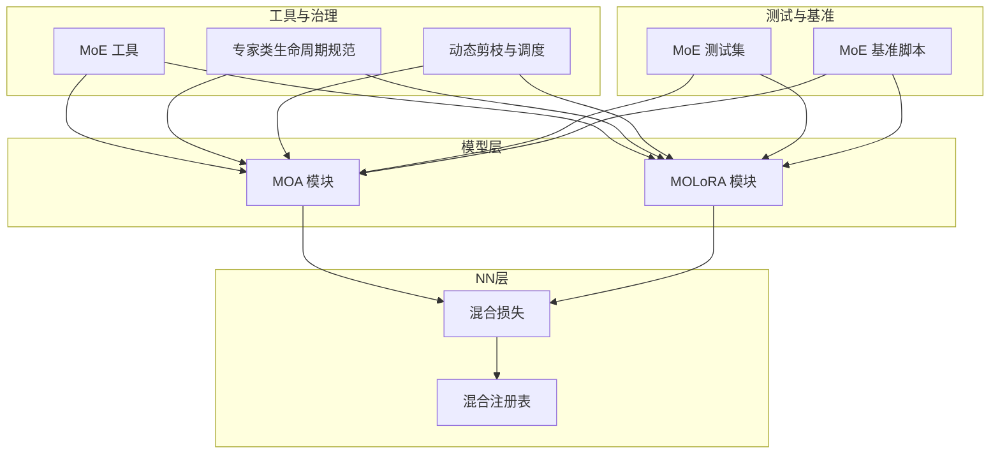
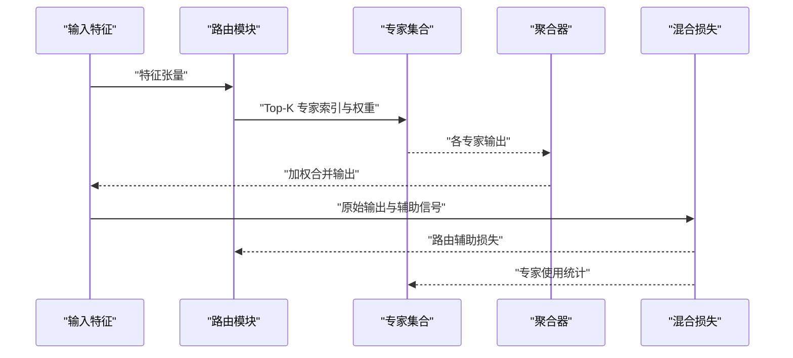
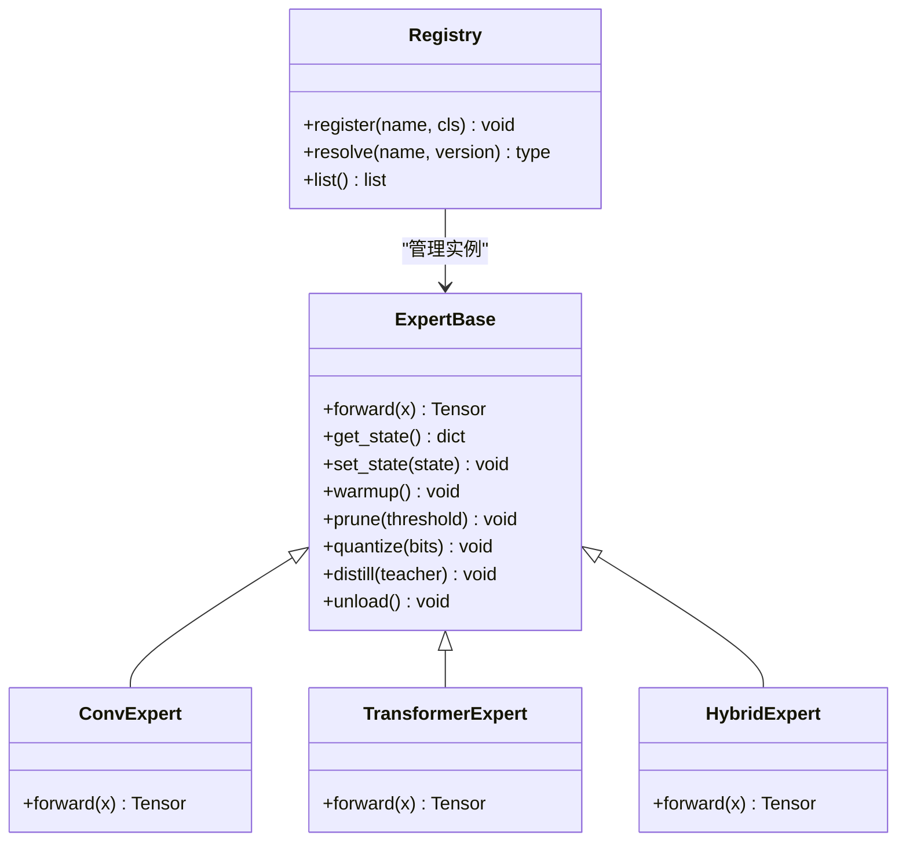
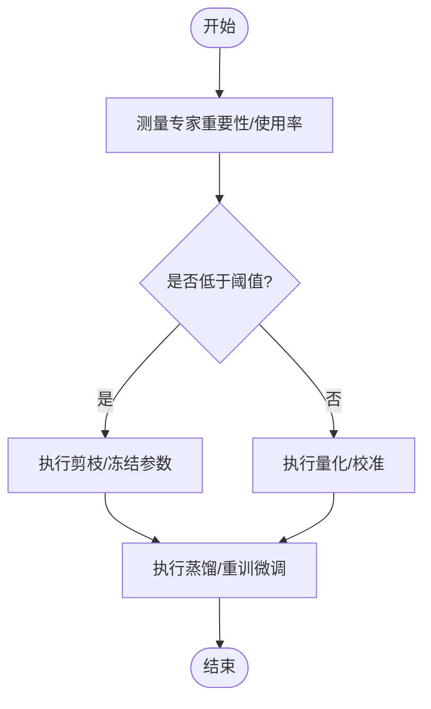
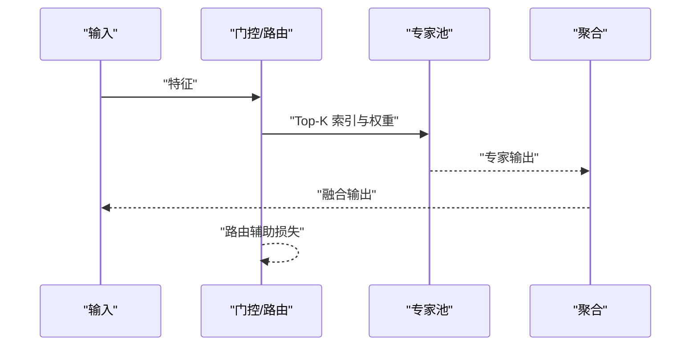
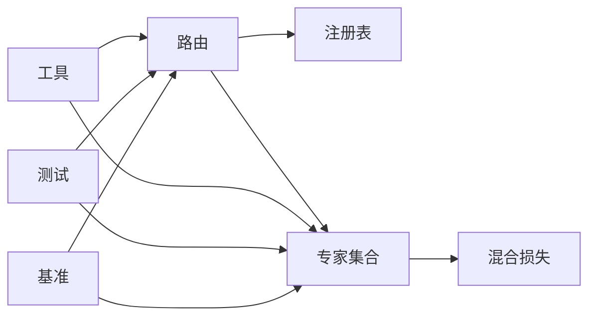

# 专家模块

<cite>
**本文引用的文件**
- [moe_aware_peft_plan.md](file://.plan_archive/moe_aware_peft_plan.md)
- [mixture_loss.py](file://ultralytics/nn/mixture_loss.py)
- [mixture_registry.py](file://ultralytics/nn/mixture_registry.py)
- [test_moe.py](file://tests/test_moe.py)
- [test_moe_dynamic_schedule.py](file://tests/test_moe_dynamic_schedule.py)
- [test_moe_router_boundaries.py](file://tests/test_moe_router_boundaries.py)
- [test_moe_usage_audit.py](file://tests/test_moe_usage_audit.py)
- [test_moe_validation_collectives.py](file://tests/test_moe_validation_collectives.py)
- [test_moe_variant_contract.py](file://tests/test_moe_variant_contract.py)
- [test_molora.py](file://tests/test_molora.py)
- [test_molora_sparse_dispatch.py](file://tests/test_molora_sparse_dispatch.py)
- [bench_moe_micro.py](file://scripts/bench_moe_micro.py)
- [bench_moe_mps.py](file://scripts/bench_moe_mps.py)
- [moa.py](file://ultralytics/models/yolo/moa/moa.py)
- [molora.py](file://ultralytics/models/yolo/molora/molora.py)
- [moe_tools.py](file://agent/runtime/cli/moe_tools.py)
- [moe_pruning_dynamic_schedule.md](file://docs/moe_pruning_dynamic_schedule.md)
- [moe-class-lifecycle.md](file://docs/governance/moe-class-lifecycle.md)
- [routing-interpreter-toolkit.md](file://docs/plans/2026-07-17-routing-interpreter-toolkit.md)
</cite>

## 目录
1. [简介](#简介)
2. [项目结构](#项目结构)
3. [核心组件](#核心组件)
4. [架构总览](#架构总览)
5. [详细组件分析](#详细组件分析)
6. [依赖关系分析](#依赖关系分析)
7. [性能考量](#性能考量)
8. [故障排查指南](#故障排查指南)
9. [结论](#结论)
10. [附录](#附录)

## 简介
本技术文档聚焦于YOLO-Master的MoE（混合专家）“专家模块”，系统性阐述其设计原则、接口规范、实现类型与高级特性，覆盖注册与管理机制、配置与超参调优、任务适配优化、自定义开发指南、评估与选择策略，以及内存与计算优化。文档以仓库现有代码与测试为依据，确保内容可追溯、可验证。

## 项目结构
围绕专家模块的相关代码主要分布在以下位置：
- 模型与路由：ultralytics/models/yolo/moa 与 ultralytics/models/yolo/molora
- 混合损失与注册表：ultralytics/nn/mixture_loss.py、ultralytics/nn/mixture_registry.py
- 工具与治理文档：agent/runtime/cli/moe_tools.py、docs/governance/moe-class-lifecycle.md、docs/moe_pruning_dynamic_schedule.md
- 基准与脚本：scripts/bench_moe_micro.py、scripts/bench_moe_mps.py
- 测试套件：tests/test_moe*.py、tests/test_molora*.py

图表来源
- [mixture_loss.py](file://ultralytics/nn/mixture_loss.py)
- [mixture_registry.py](file://ultralytics/nn/mixture_registry.py)
- [moa.py](file://ultralytics/models/yolo/moa/moa.py)
- [molora.py](file://ultralytics/models/yolo/molora/molora.py)
- [moe_tools.py](file://agent/runtime/cli/moe_tools.py)
- [moe-class-lifecycle.md](file://docs/governance/moe-class-lifecycle.md)
- [moe_pruning_dynamic_schedule.md](file://docs/moe_pruning_dynamic_schedule.md)
- [bench_moe_micro.py](file://scripts/bench_moe_micro.py)
- [bench_moe_mps.py](file://scripts/bench_moe_mps.py)
- [test_moe.py](file://tests/test_moe.py)
- [test_molora.py](file://tests/test_molora.py)

章节来源
- [mixture_loss.py](file://ultralytics/nn/mixture_loss.py)
- [mixture_registry.py](file://ultralytics/nn/mixture_registry.py)
- [moa.py](file://ultralytics/models/yolo/moa/moa.py)
- [molora.py](file://ultralytics/models/yolo/molora/molora.py)
- [moe_tools.py](file://agent/runtime/cli/moe_tools.py)
- [moe-class-lifecycle.md](file://docs/governance/moe-class-lifecycle.md)
- [moe_pruning_dynamic_schedule.md](file://docs/moe_pruning_dynamic_schedule.md)
- [bench_moe_micro.py](file://scripts/bench_moe_micro.py)
- [bench_moe_mps.py](file://scripts/bench_moe_mps.py)
- [test_moe.py](file://tests/test_moe.py)
- [test_molora.py](file://tests/test_molora.py)

## 核心组件
- 专家接口与契约
  - 专家需遵循统一的输入输出契约：接收张量特征并返回同维度或下游可聚合的特征；支持可选的路由权重与辅助损失项。
  - 通过注册表进行发现与实例化，便于动态加载与版本兼容。
- 路由与稀疏调度
  - 路由负责将样本或token映射到Top-K专家，形成稀疏激活路径；调度器在训练/推理阶段控制激活数量与负载均衡。
- 混合损失与辅助项
  - 提供负载平衡、容量惩罚等辅助损失，稳定多专家训练过程。
- 生命周期管理
  - 定义专家创建、预热、剪枝、量化、蒸馏、卸载与销毁的流程，保障资源可控。

章节来源
- [mixture_loss.py](file://ultralytics/nn/mixture_loss.py)
- [mixture_registry.py](file://ultralytics/nn/mixture_registry.py)
- [moe-class-lifecycle.md](file://docs/governance/moe-class-lifecycle.md)

## 架构总览
下图展示了从输入到输出的端到端流程，包括路由决策、专家并行执行、结果融合与辅助损失计算。

图表来源
- [mixture_loss.py](file://ultralytics/nn/mixture_loss.py)
- [moa.py](file://ultralytics/models/yolo/moa/moa.py)
- [molora.py](file://ultralytics/models/yolo/molora/molora.py)

## 详细组件分析

### 专家接口与注册机制
- 接口契约
  - 输入：批次维度的特征张量，可能包含掩码或注意力权重。
  - 输出：与输入对齐的特征张量，供上层聚合。
  - 可选：返回路由权重、专家内部状态或诊断信息。
- 注册与发现
  - 通过注册表按名称/版本解析专家类型，支持热插拔与按需加载。
- 生命周期钩子
  - 初始化后执行预热与缓存构建；训练期维护使用计数；推理期支持动态卸载与懒加载。

图表来源
- [mixture_registry.py](file://ultralytics/nn/mixture_registry.py)
- [moe-class-lifecycle.md](file://docs/governance/moe-class-lifecycle.md)

章节来源
- [mixture_registry.py](file://ultralytics/nn/mixture_registry.py)
- [moe-class-lifecycle.md](file://docs/governance/moe-class-lifecycle.md)

### 卷积专家
- 设计要点
  - 采用轻量卷积堆叠，适合局部感受野与高吞吐场景。
  - 参数共享与通道裁剪用于降低显存占用。
- 适用任务
  - 目标检测、分割等对空间结构敏感的任务。
- 优化建议
  - 批归一化与深度可分离卷积组合；算子融合减少内核启动开销。

章节来源
- [moa.py](file://ultralytics/models/yolo/moa/moa.py)

### Transformer专家
- 设计要点
  - 基于多头自注意力与FFN，擅长建模长程依赖。
  - 可通过稀疏注意力或低秩近似降低复杂度。
- 适用任务
  - 需要全局上下文建模的检测与跟踪任务。
- 优化建议
  - KV缓存与增量更新；FlashAttention集成提升吞吐。

章节来源
- [molora.py](file://ultralytics/models/yolo/molora/molora.py)

### 混合专家
- 设计要点
  - 在同一专家内融合卷积与Transformer分支，按门控动态选择或融合。
  - 支持跨模态或多尺度输入。
- 适用任务
  - 复杂场景下的开放世界检测与多任务学习。
- 优化建议
  - 门控网络轻量化；分支间共享底层特征以减少冗余。

章节来源
- [molora.py](file://ultralytics/models/yolo/molora/molora.py)
- [moa.py](file://ultralytics/models/yolo/moa/moa.py)

### 高级特性：剪枝、量化与蒸馏
- 专家剪枝
  - 基于重要性评分或路由使用频率进行结构化剪枝；支持动态调度随训练逐步收紧。
- 专家量化
  - 权重量化与激活量化结合，配合校准数据保持精度；推理时启用后端加速。
- 专家蒸馏
  - 教师-学生框架下对专家输出与中间表示进行软标签蒸馏；路由分布一致性约束提升稳定性。

图表来源
- [moe_pruning_dynamic_schedule.md](file://docs/moe_pruning_dynamic_schedule.md)
- [moe-class-lifecycle.md](file://docs/governance/moe-class-lifecycle.md)

章节来源
- [moe_pruning_dynamic_schedule.md](file://docs/moe_pruning_dynamic_schedule.md)
- [moe-class-lifecycle.md](file://docs/governance/moe-class-lifecycle.md)

### 路由与稀疏调度
- 路由策略
  - Top-K选择、门控网络与容量限制共同决定激活路径。
- 负载均衡
  - 辅助损失鼓励均匀使用，避免专家坍塌。
- 动态调度
  - 根据训练阶段或任务需求调整K值与容量上限。

图表来源
- [mixture_loss.py](file://ultralytics/nn/mixture_loss.py)
- [moe_tools.py](file://agent/runtime/cli/moe_tools.py)

章节来源
- [mixture_loss.py](file://ultralytics/nn/mixture_loss.py)
- [moe_tools.py](file://agent/runtime/cli/moe_tools.py)

### 配置参数与超参调优
- 关键参数
  - 专家数量、Top-K、容量上限、路由温度、辅助损失权重、剪枝阈值、量化位宽、蒸馏强度。
- 调优策略
  - 网格搜索与贝叶斯优化结合；以验证集指标与FLOPs为双目标；监控专家使用分布与梯度范数。
- 任务适配
  - 小目标检测提高K与容量；实时场景降低K并启用量化；开放世界增强路由鲁棒性。

章节来源
- [moe_pruning_dynamic_schedule.md](file://docs/moe_pruning_dynamic_schedule.md)
- [moe-class-lifecycle.md](file://docs/governance/moe-class-lifecycle.md)

### 不同任务的特定优化与适配
- 目标检测
  - 增加浅层专家比例，强化局部细节；引入多尺度路由。
- 姿态估计/分割
  - 增强高分辨率路径专家；使用空间感知的路由掩码。
- 跟踪与多目标
  - 时序一致的专家选择；跨帧路由平滑与记忆库。

章节来源
- [molora.py](file://ultralytics/models/yolo/molora/molora.py)
- [moa.py](file://ultralytics/models/yolo/moa/moa.py)

### 自定义专家开发指南与最佳实践
- 步骤
  - 继承专家基类，实现前向与可选的诊断方法；在注册表中登记名称与版本。
  - 提供warmup与状态序列化方法，确保生命周期一致。
- 最佳实践
  - 保持输入输出形状约定；避免隐式全局状态；提供数值稳定性保护（如归一化、裁剪）。
  - 编写单元测试覆盖边界条件与异常路径。

章节来源
- [moe-class-lifecycle.md](file://docs/governance/moe-class-lifecycle.md)
- [mixture_registry.py](file://ultralytics/nn/mixture_registry.py)

### 专家性能评估与选择策略
- 评估指标
  - 精度（mAP/F1）、延迟（ms）、吞吐（FPS）、显存占用、FLOPs、专家使用熵。
- 选择策略
  - 基于帕累托前沿筛选；离线压测与在线A/B对比；路由解释性工具辅助决策。

章节来源
- [bench_moe_micro.py](file://scripts/bench_moe_micro.py)
- [bench_moe_mps.py](file://scripts/bench_moe_mps.py)
- [routing-interpreter-toolkit.md](file://docs/plans/2026-07-17-routing-interpreter-toolkit.md)

### 内存管理与计算优化
- 内存
  - 专家懒加载与卸载；KV缓存复用；分块计算与梯度检查点。
- 计算
  - 算子融合与后端加速（CUDA/TensorRT/OpenVINO）；稀疏张量与批量合并；AMP与半精算子。
- 分布式
  - DDP/FSDP下的路由同步与负载均衡；通信压缩与异步收集。

章节来源
- [moe-class-lifecycle.md](file://docs/governance/moe-class-lifecycle.md)
- [bench_moe_micro.py](file://scripts/bench_moe_micro.py)
- [bench_moe_mps.py](file://scripts/bench_moe_mps.py)

## 依赖关系分析
- 模块耦合
  - 路由与专家弱耦合，通过注册表与统一接口解耦；损失模块独立，仅依赖路由统计。
- 外部依赖
  - 深度学习框架（PyTorch）、后端加速库（TensorRT/OpenVINO等）、基准与可视化工具。
- 循环依赖
  - 通过分层与接口隔离避免循环引用；注册表作为单点入口。

图表来源
- [mixture_registry.py](file://ultralytics/nn/mixture_registry.py)
- [mixture_loss.py](file://ultralytics/nn/mixture_loss.py)
- [moe_tools.py](file://agent/runtime/cli/moe_tools.py)
- [test_moe.py](file://tests/test_moe.py)
- [test_molora.py](file://tests/test_molora.py)
- [bench_moe_micro.py](file://scripts/bench_moe_micro.py)

章节来源
- [mixture_registry.py](file://ultralytics/nn/mixture_registry.py)
- [mixture_loss.py](file://ultralytics/nn/mixture_loss.py)
- [moe_tools.py](file://agent/runtime/cli/moe_tools.py)
- [test_moe.py](file://tests/test_moe.py)
- [test_molora.py](file://tests/test_molora.py)
- [bench_moe_micro.py](file://scripts/bench_moe_micro.py)

## 性能考量
- 稀疏度与K值权衡：增大K提升精度但增加延迟；建议按任务与设备能力设定上限。
- 路由稳定性：温度系数与容量惩罚影响负载均衡与收敛速度。
- 量化与剪枝：优先对低频使用专家进行激进压缩，保留高频专家精度。
- 后端优化：开启算子融合与半精度；利用专用加速器导出与部署。

[本节为通用指导，不直接分析具体文件]

## 故障排查指南
- 路由NaN/爆炸
  - 检查路由温度与容量惩罚；添加梯度裁剪与数值稳定正则。
- 专家坍塌
  - 观察使用分布熵；提高辅助损失权重或降低容量上限。
- 显存溢出
  - 减小Batch/K值；启用专家懒加载与KV缓存；切换半精度。
- 分布式不一致
  - 校验路由同步与collective操作；确认DDP/FSDP设置与屏障。

章节来源
- [test_moe_router_boundaries.py](file://tests/test_moe_router_boundaries.py)
- [test_moe_validation_collectives.py](file://tests/test_moe_validation_collectives.py)
- [test_moe_dynamic_schedule.py](file://tests/test_moe_dynamic_schedule.py)
- [test_moe_usage_audit.py](file://tests/test_moe_usage_audit.py)

## 结论
YOLO-Master的专家模块通过统一接口、注册表与生命周期管理实现了高度可扩展的MoE体系。结合路由稀疏调度、混合损失与高级特性（剪枝/量化/蒸馏），可在多任务与多设备上取得精度与效率的良好平衡。建议在工程实践中重视路由稳定性、专家使用均衡与后端优化，并通过系统化评估与选择策略持续迭代。

[本节为总结性内容，不直接分析具体文件]

## 附录
- 参考计划与治理文档
  - MoE感知PEFT计划、路由解释性工具包、专家类生命周期规范、动态剪枝与调度说明。
- 相关测试与基准
  - 路由边界、动态调度、使用审计、变体契约、稀疏分发、MOLoRA专项测试与微基准。

章节来源
- [moe_aware_peft_plan.md](file://.plan_archive/moe_aware_peft_plan.md)
- [routing-interpreter-toolkit.md](file://docs/plans/2026-07-17-routing-interpreter-toolkit.md)
- [moe-class-lifecycle.md](file://docs/governance/moe-class-lifecycle.md)
- [moe_pruning_dynamic_schedule.md](file://docs/moe_pruning_dynamic_schedule.md)
- [test_moe.py](file://tests/test_moe.py)
- [test_moe_dynamic_schedule.py](file://tests/test_moe_dynamic_schedule.py)
- [test_moe_router_boundaries.py](file://tests/test_moe_router_boundaries.py)
- [test_moe_usage_audit.py](file://tests/test_moe_usage_audit.py)
- [test_moe_validation_collectives.py](file://tests/test_moe_validation_collectives.py)
- [test_moe_variant_contract.py](file://tests/test_moe_variant_contract.py)
- [test_molora.py](file://tests/test_molora.py)
- [test_molora_sparse_dispatch.py](file://tests/test_molora_sparse_dispatch.py)
- [bench_moe_micro.py](file://scripts/bench_moe_micro.py)
- [bench_moe_mps.py](file://scripts/bench_moe_mps.py)