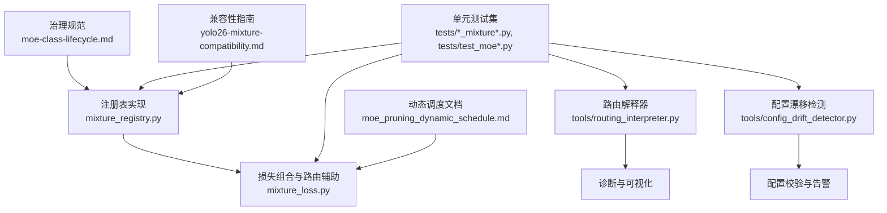
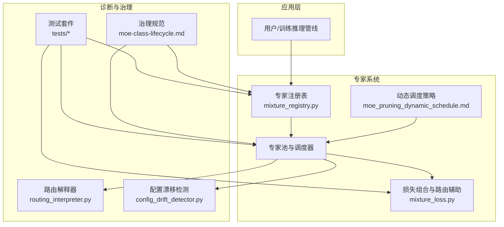
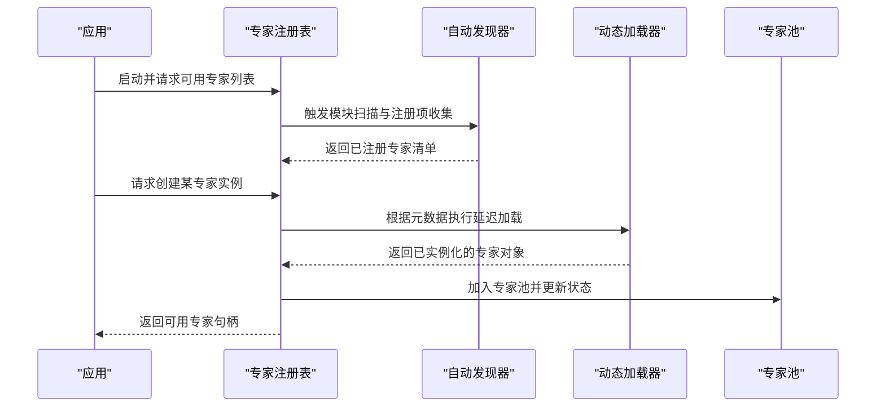
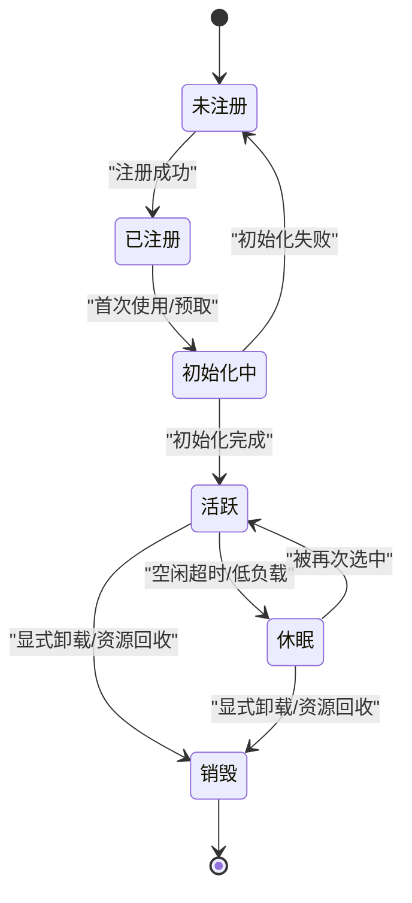
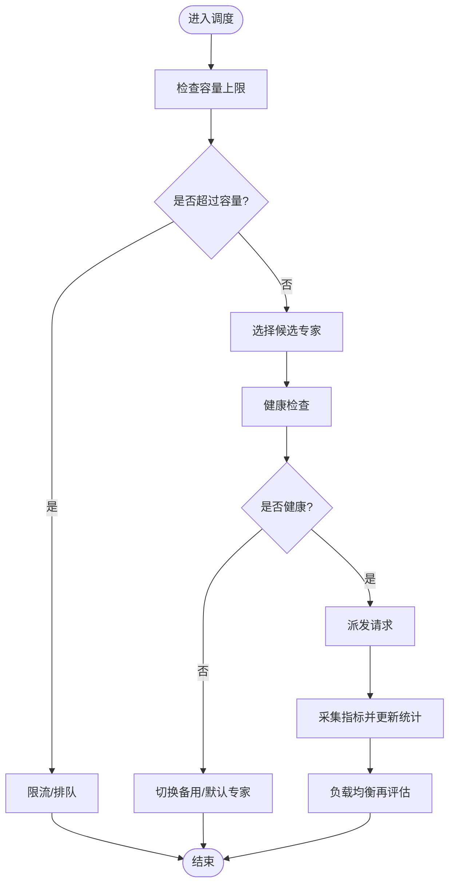
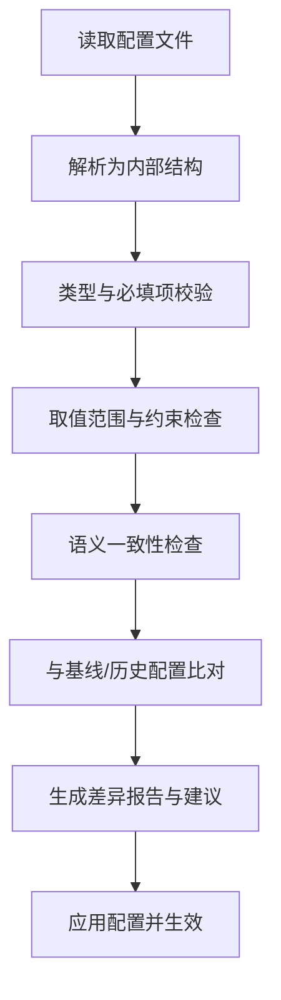
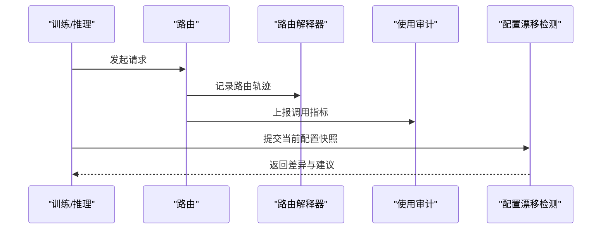
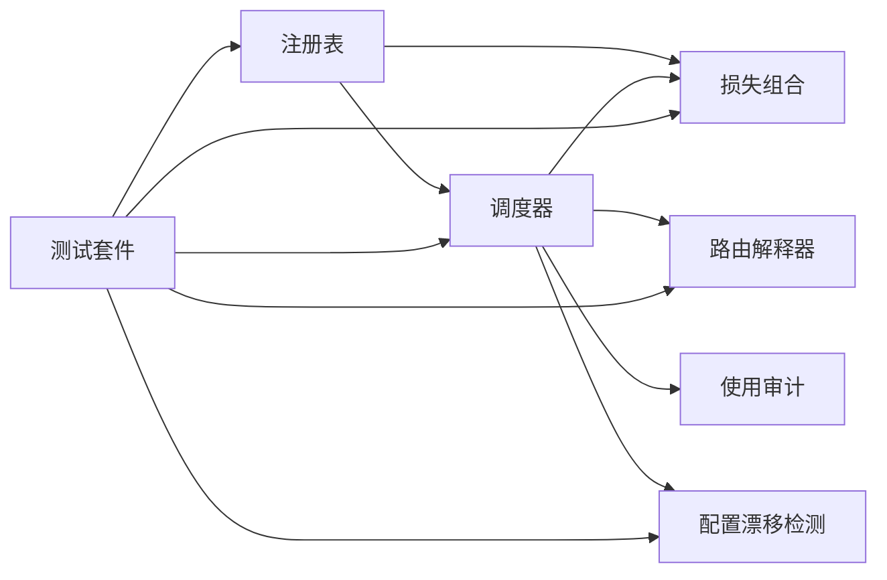

# 专家管理与注册

<cite>
**本文引用的文件**
- [moe-class-lifecycle.md](file://docs/governance/moe-class-lifecycle.md)
- [mixture_registry.py](file://ultralytics/nn/mixture_registry.py)
- [mixture_loss.py](file://ultralytics/nn/mixture_loss.py)
- [test_mixture_config_registry.py](file://tests/test_mixture_config_registry.py)
- [test_mixture_model_registry.py](file://tests/test_mixture_model_registry.py)
- [test_moe.py](file://tests/test_moe.py)
- [test_moe_dynamic_scheduler.py](file://tests/test_moe_dynamic_scheduler.py)
- [test_moe_usage_audit.py](file://tests/test_moe_usage_audit.py)
- [routing_interpreter.py](file://tools/routing_interpreter.py)
- [routing_interpreter.py](file://ultralytics/utils/routing_interpreter.py)
- [config_drift_detector.py](file://tools/config_drift_detector.py)
- [test_config_drift_detector.py](file://tests/test_config_drift_detector.py)
- [moe_pruning_dynamic_schedule.md](file://docs/moe_pruning_dynamic_schedule.md)
- [yolo26-mixture-compatibility.md](file://docs/en/guides/yolo26-mixture-compatibility.md)
</cite>

## 目录
1. [简介](#简介)
2. [项目结构](#项目结构)
3. [核心组件](#核心组件)
4. [架构总览](#架构总览)
5. [详细组件分析](#详细组件分析)
6. [依赖关系分析](#依赖关系分析)
7. [性能考量](#性能考量)
8. [故障排查指南](#故障排查指南)
9. [结论](#结论)
10. [附录](#附录)

## 简介
本技术文档聚焦于 YOLO-Master 的“专家管理与注册系统”，围绕以下目标展开：
- 专家注册机制与自动发现、动态加载流程
- 专家生命周期管理（初始化、激活、休眠、销毁）
- 专家池管理策略（容量控制、负载均衡、故障恢复）
- 配置解析与验证机制（配置文件格式、参数检查）
- 版本兼容性与迁移策略
- 自定义专家的注册与集成指南
- 监控与诊断工具使用方法
- 专家管理的 API 接口与编程模式

## 项目结构
与专家管理与注册相关的代码与文档主要分布在如下位置：
- 治理与规范：docs/governance/moe-class-lifecycle.md
- 运行时注册表与损失组合：ultralytics/nn/mixture_registry.py、ultralytics/nn/mixture_loss.py
- 路由解释器与配置漂移检测：tools/routing_interpreter.py、tools/config_drift_detector.py
- 单元测试覆盖注册、调度、审计与兼容性：tests/*_mixture*.py、tests/test_moe*.py、tests/test_config_drift_detector.py
- 文档与指南：docs/moe_pruning_dynamic_schedule.md、docs/en/guides/yolo26-mixture-compatibility.md

图表来源
- [moe-class-lifecycle.md](file://docs/governance/moe-class-lifecycle.md)
- [mixture_registry.py](file://ultralytics/nn/mixture_registry.py)
- [mixture_loss.py](file://ultralytics/nn/mixture_loss.py)
- [routing_interpreter.py](file://tools/routing_interpreter.py)
- [config_drift_detector.py](file://tools/config_drift_detector.py)
- [test_mixture_config_registry.py](file://tests/test_mixture_config_registry.py)
- [test_mixture_model_registry.py](file://tests/test_mixture_model_registry.py)
- [test_moe.py](file://tests/test_moe.py)
- [test_moe_dynamic_scheduler.py](file://tests/test_moe_dynamic_scheduler.py)
- [test_moe_usage_audit.py](file://tests/test_moe_usage_audit.py)
- [test_config_drift_detector.py](file://tests/test_config_drift_detector.py)
- [moe_pruning_dynamic_schedule.md](file://docs/moe_pruning_dynamic_schedule.md)
- [yolo26-mixture-compatibility.md](file://docs/en/guides/yolo26-mixture-compatibility.md)

章节来源
- [moe-class-lifecycle.md](file://docs/governance/moe-class-lifecycle.md)
- [mixture_registry.py](file://ultralytics/nn/mixture_registry.py)
- [mixture_loss.py](file://ultralytics/nn/mixture_loss.py)
- [routing_interpreter.py](file://tools/routing_interpreter.py)
- [config_drift_detector.py](file://tools/config_drift_detector.py)
- [test_mixture_config_registry.py](file://tests/test_mixture_config_registry.py)
- [test_mixture_model_registry.py](file://tests/test_mixture_model_registry.py)
- [test_moe.py](file://tests/test_moe.py)
- [test_moe_dynamic_scheduler.py](file://tests/test_moe_dynamic_scheduler.py)
- [test_moe_usage_audit.py](file://tests/test_moe_usage_audit.py)
- [test_config_drift_detector.py](file://tests/test_config_drift_detector.py)
- [moe_pruning_dynamic_schedule.md](file://docs/moe_pruning_dynamic_schedule.md)
- [yolo26-mixture-compatibility.md](file://docs/en/guides/yolo26-mixture-compatibility.md)

## 核心组件
- 专家注册表（Mixture Registry）
  - 负责专家类的集中注册、查找与实例化，支持按任务或模块维度进行分组。
  - 提供元数据描述（如能力标签、版本约束、资源需求），用于后续调度与兼容性检查。
- 损失组合与路由辅助（Mixture Loss）
  - 将多个专家输出进行加权融合，计算组合损失；同时为路由提供可微或启发式信号。
- 路由解释器（Routing Interpreter）
  - 对路由决策进行解释与可视化，便于定位负载倾斜、冷热点分布与异常路径。
- 配置漂移检测（Config Drift Detector）
  - 对比当前配置与基线/历史配置，识别不兼容变更并给出修复建议。
- 测试套件
  - 覆盖注册表行为、动态调度策略、使用审计、配置校验等关键路径，保障稳定性与可演进性。

章节来源
- [mixture_registry.py](file://ultralytics/nn/mixture_registry.py)
- [mixture_loss.py](file://ultralytics/nn/mixture_loss.py)
- [routing_interpreter.py](file://tools/routing_interpreter.py)
- [config_drift_detector.py](file://tools/config_drift_detector.py)
- [test_mixture_config_registry.py](file://tests/test_mixture_config_registry.py)
- [test_mixture_model_registry.py](file://tests/test_mixture_model_registry.py)
- [test_moe.py](file://tests/test_moe.py)
- [test_moe_dynamic_scheduler.py](file://tests/test_moe_dynamic_scheduler.py)
- [test_moe_usage_audit.py](file://tests/test_moe_usage_audit.py)

## 架构总览
下图展示了专家管理与注册系统的整体架构与交互关系。

图表来源
- [mixture_registry.py](file://ultralytics/nn/mixture_registry.py)
- [mixture_loss.py](file://ultralytics/nn/mixture_loss.py)
- [routing_interpreter.py](file://tools/routing_interpreter.py)
- [config_drift_detector.py](file://tools/config_drift_detector.py)
- [moe-pruning-dynamic-schedule.md](file://docs/moe_pruning_dynamic_schedule.md)
- [moe-class-lifecycle.md](file://docs/governance/moe-class-lifecycle.md)
- [test_mixture_config_registry.py](file://tests/test_mixture_config_registry.py)
- [test_mixture_model_registry.py](file://tests/test_mixture_model_registry.py)
- [test_moe.py](file://tests/test_moe.py)
- [test_moe_dynamic_scheduler.py](file://tests/test_moe_dynamic_scheduler.py)
- [test_moe_usage_audit.py](file://tests/test_moe_usage_audit.py)

## 详细组件分析

### 专家注册与自动发现
- 注册入口
  - 通过注册表提供的装饰器或显式注册函数，将专家类与其元数据绑定到全局命名空间。
  - 支持按任务/模块维度进行分组，便于后续路由与选择。
- 自动发现
  - 启动时扫描已导入模块中的注册标记，构建索引；若采用插件式扩展，可通过约定目录或包名进行扫描。
- 动态加载
  - 按需延迟加载专家权重与后端资源，避免冷启动开销；首次访问时完成实例化与预热。
- 元数据契约
  - 包含能力标签、输入输出签名、设备要求、版本约束、资源预算等，供调度器与校验器使用。

图表来源
- [mixture_registry.py](file://ultralytics/nn/mixture_registry.py)
- [test_mixture_model_registry.py](file://tests/test_mixture_model_registry.py)
- [test_mixture_config_registry.py](file://tests/test_mixture_config_registry.py)

章节来源
- [mixture_registry.py](file://ultralytics/nn/mixture_registry.py)
- [test_mixture_model_registry.py](file://tests/test_mixture_model_registry.py)
- [test_mixture_config_registry.py](file://tests/test_mixture_config_registry.py)

### 专家生命周期管理
- 阶段定义
  - 初始化：加载权重、分配内存、建立缓存与统计信息。
  - 激活：进入就绪态，参与路由与调度。
  - 休眠：长时间无调用或达到阈值后释放部分资源，保留轻量上下文。
  - 销毁：彻底释放资源并从池中移除。
- 状态机
  - 各阶段转换需满足前置条件（如预热完成、健康检查通过）。
  - 异常路径需具备回退与重试策略，确保系统稳定。

图表来源
- [moe-class-lifecycle.md](file://docs/governance/moe-class-lifecycle.md)

章节来源
- [moe-class-lifecycle.md](file://docs/governance/moe-class-lifecycle.md)

### 专家池管理策略
- 容量控制
  - 基于最大并发、内存/显存上限与优先级队列限制池大小，防止过载。
- 负载均衡
  - 结合路由权重与实时指标（QPS、延迟、错误率）进行再平衡，避免热点专家拥塞。
- 故障恢复
  - 健康探针定期检测专家状态；失败则隔离并重试，必要时降级至备用专家或默认路径。
- 动态调度
  - 依据任务特征与历史使用分布，动态调整专家集合与路由策略，提升吞吐与能效。

图表来源
- [moe_pruning_dynamic_schedule.md](file://docs/moe_pruning_dynamic_schedule.md)
- [test_moe_dynamic_scheduler.py](file://tests/test_moe_dynamic_scheduler.py)

章节来源
- [moe_pruning_dynamic_schedule.md](file://docs/moe_pruning_dynamic_schedule.md)
- [test_moe_dynamic_scheduler.py](file://tests/test_moe_dynamic_scheduler.py)

### 配置解析与验证机制
- 配置来源
  - 支持 YAML/JSON 等结构化配置，描述专家集合、路由策略、资源配额与兼容性约束。
- 解析流程
  - 读取配置 -> 类型校验 -> 默认值填充 -> 语义校验（如互斥字段、范围检查）-> 生成不可变配置对象。
- 漂移检测
  - 与基线/历史版本对比，识别破坏性变更并给出迁移建议。
- 测试覆盖
  - 针对注册表配置、模型注册配置、漂移检测等进行端到端断言。

图表来源
- [config_drift_detector.py](file://tools/config_drift_detector.py)
- [test_config_drift_detector.py](file://tests/test_config_drift_detector.py)
- [test_mixture_config_registry.py](file://tests/test_mixture_config_registry.py)
- [test_mixture_model_registry.py](file://tests/test_mixture_model_registry.py)

章节来源
- [config_drift_detector.py](file://tools/config_drift_detector.py)
- [test_config_drift_detector.py](file://tests/test_config_drift_detector.py)
- [test_mixture_config_registry.py](file://tests/test_mixture_config_registry.py)
- [test_mixture_model_registry.py](file://tests/test_mixture_model_registry.py)

### 版本兼容性与迁移策略
- 兼容性矩阵
  - 明确不同版本间专家接口、权重格式与路由协议的变化点。
- 迁移步骤
  - 向后兼容优先；必要时提供适配器或转换器；灰度发布与回滚策略。
- 自动化校验
  - 在 CI 中运行兼容性测试，确保升级路径可靠。

章节来源
- [yolo26-mixture-compatibility.md](file://docs/en/guides/yolo26-mixture-compatibility.md)

### 自定义专家注册与集成指南
- 开发步骤
  - 实现专家接口（输入输出签名、能力标签、资源声明）。
  - 在模块中完成注册（装饰器或显式注册函数）。
  - 编写单元测试覆盖注册、加载、调度与错误路径。
- 集成要点
  - 遵循元数据契约，确保路由与调度器能正确理解与选择。
  - 提供健康检查与日志埋点，便于监控与排障。
- 参考用例
  - 查看现有测试中对注册表与模型注册的用法，作为最佳实践参考。

章节来源
- [test_mixture_model_registry.py](file://tests/test_mixture_model_registry.py)
- [test_mixture_config_registry.py](file://tests/test_mixture_config_registry.py)
- [test_moe.py](file://tests/test_moe.py)

### 监控与诊断工具
- 路由解释器
  - 输出路由决策的可解释视图，包括专家选择比例、路径长度、异常分支等。
- 使用审计
  - 记录专家调用频次、耗时、错误率，支撑容量规划与优化。
- 配置漂移检测
  - 持续监控配置变化，提前预警潜在风险。

图表来源
- [routing_interpreter.py](file://tools/routing_interpreter.py)
- [routing_interpreter.py](file://ultralytics/utils/routing_interpreter.py)
- [test_moe_usage_audit.py](file://tests/test_moe_usage_audit.py)
- [config_drift_detector.py](file://tools/config_drift_detector.py)

章节来源
- [routing_interpreter.py](file://tools/routing_interpreter.py)
- [routing_interpreter.py](file://ultralytics/utils/routing_interpreter.py)
- [test_moe_usage_audit.py](file://tests/test_moe_usage_audit.py)
- [config_drift_detector.py](file://tools/config_drift_detector.py)

### API 接口与编程模式
- 注册表 API
  - 提供查询、注册、实例化与批量操作接口，支持按标签/版本筛选。
- 损失组合 API
  - 暴露组合策略与权重更新接口，便于在线调优。
- 编程模式
  - 推荐以“声明式注册 + 命令式调用”的方式组织代码，保持清晰边界与可测试性。

章节来源
- [mixture_registry.py](file://ultralytics/nn/mixture_registry.py)
- [mixture_loss.py](file://ultralytics/nn/mixture_loss.py)

## 依赖关系分析
- 组件耦合
  - 注册表为核心枢纽，被调度器、损失组合与测试套件共同依赖。
  - 路由解释器与配置漂移检测为横向支撑，降低耦合度。
- 外部依赖
  - 配置解析库、序列化与日志框架等通用基础设施。
- 循环依赖
  - 通过分层与接口抽象避免直接循环引用。

图表来源
- [mixture_registry.py](file://ultralytics/nn/mixture_registry.py)
- [mixture_loss.py](file://ultralytics/nn/mixture_loss.py)
- [routing_interpreter.py](file://tools/routing_interpreter.py)
- [config_drift_detector.py](file://tools/config_drift_detector.py)
- [test_mixture_config_registry.py](file://tests/test_mixture_config_registry.py)
- [test_mixture_model_registry.py](file://tests/test_mixture_model_registry.py)
- [test_moe.py](file://tests/test_moe.py)
- [test_moe_dynamic_scheduler.py](file://tests/test_moe_dynamic_scheduler.py)
- [test_moe_usage_audit.py](file://tests/test_moe_usage_audit.py)

章节来源
- [mixture_registry.py](file://ultralytics/nn/mixture_registry.py)
- [mixture_loss.py](file://ultralytics/nn/mixture_loss.py)
- [routing_interpreter.py](file://tools/routing_interpreter.py)
- [config_drift_detector.py](file://tools/config_drift_detector.py)
- [test_mixture_config_registry.py](file://tests/test_mixture_config_registry.py)
- [test_mixture_model_registry.py](file://tests/test_mixture_model_registry.py)
- [test_moe.py](file://tests/test_moe.py)
- [test_moe_dynamic_scheduler.py](file://tests/test_moe_dynamic_scheduler.py)
- [test_moe_usage_audit.py](file://tests/test_moe_usage_audit.py)

## 性能考量
- 延迟与吞吐
  - 通过懒加载、批处理与缓存减少首帧延迟；利用并行路由提升吞吐。
- 资源占用
  - 设置专家池上限与淘汰策略，避免 OOM；对热点专家进行分片与副本化。
- 路由效率
  - 使用轻量级路由打分与近似最近邻检索，降低选择开销。
- 观测与调优
  - 借助路由解释器与使用审计定位瓶颈，结合动态调度策略持续优化。

## 故障排查指南
- 常见问题
  - 注册失败：检查模块导入顺序与注册装饰器是否正确。
  - 加载失败：确认权重路径、设备可用性与权限。
  - 路由异常：查看路由解释器输出，定位热点与死锁路径。
  - 配置冲突：使用配置漂移检测生成差异报告并按建议修复。
- 定位步骤
  - 启用详细日志与审计；复现最小用例；逐步缩小范围。
- 恢复策略
  - 隔离故障专家、切换到备用路径；必要时回滚配置与版本。

章节来源
- [routing_interpreter.py](file://tools/routing_interpreter.py)
- [config_drift_detector.py](file://tools/config_drift_detector.py)
- [test_moe_usage_audit.py](file://tests/test_moe_usage_audit.py)
- [test_config_drift_detector.py](file://tests/test_config_drift_detector.py)

## 结论
YOLO-Master 的专家管理与注册系统通过清晰的注册表、稳健的生命周期管理、灵活的调度策略以及完善的诊断与治理工具，实现了高内聚、低耦合与可扩展的专家生态。配合严格的配置校验与兼容性策略，系统在演进过程中保持了稳定性与可维护性。

## 附录
- 术语
  - 专家：具备特定能力的可插拔模块。
  - 路由：根据输入特征与上下文选择专家的策略。
  - 专家池：承载专家实例及其状态的容器。
- 参考文档
  - 治理规范、动态调度说明与兼容性指南详见对应文件。