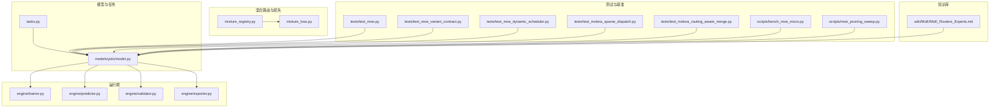
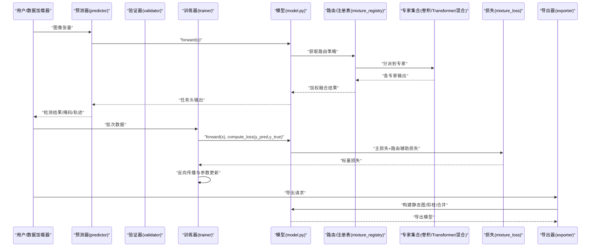
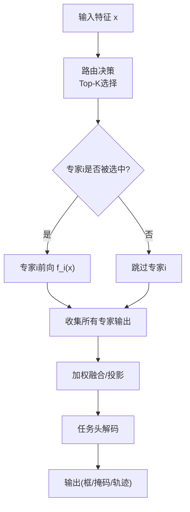
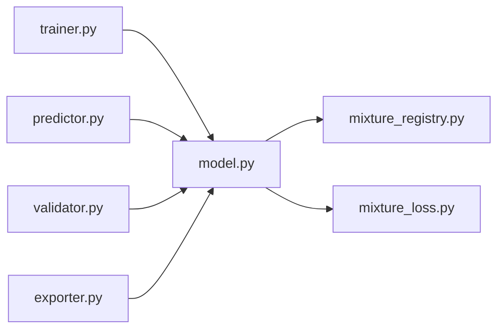

# 专家类型与实现

<cite>
**本文引用的文件**
- [mixture_registry.py](file://ultralytics/nn/mixture_registry.py)
- [mixture_loss.py](file://ultralytics/nn/mixture_loss.py)
- [tasks.py](file://ultralytics/nn/tasks.py)
- [yolo.py](file://ultralytics/models/yolo/model.py)
- [train.py](file://ultralytics/engine/trainer.py)
- [predictor.py](file://ultralytics/engine/predictor.py)
- [validator.py](file://ultralytics/engine/validator.py)
- [exporter.py](file://ultralytics/engine/exporter.py)
- [test_moe.py](file://tests/test_moe.py)
- [test_moe_variant_contract.py](file://tests/test_moe_variant_contract.py)
- [test_moe_dynamic_scheduler.py](file://tests/test_moe_dynamic_scheduler.py)
- [test_molora_sparse_dispatch.py](file://tests/test_molora_sparse_dispatch.py)
- [test_molora_routing_aware_merge.py](file://tests/test_molora_routing_aware_merge.py)
- [bench_moe_micro.py](file://scripts/bench_moe_micro.py)
- [moe_pruning_sweep.py](file://scripts/moe_pruning_sweep.py)
- [MoE_Routers_Experts.md](file://wiki/MoE/MoE_Routers_Experts.md)
</cite>

## 目录
1. [简介](#简介)
2. [项目结构](#项目结构)
3. [核心组件](#核心组件)
4. [架构总览](#架构总览)
5. [详细组件分析](#详细组件分析)
6. [依赖关系分析](#依赖关系分析)
7. [性能考量](#性能考量)
8. [故障排查指南](#故障排查指南)
9. [结论](#结论)
10. [附录](#附录)

## 简介
本文件聚焦于YOLO-Master中的“专家”体系，系统梳理卷积专家、Transformer专家与混合专家的设计原理、输入输出格式、计算复杂度与内存占用特征，并给出前向传播逻辑、参数初始化与梯度更新机制的说明。文档同时覆盖配置超参（通道数、层数、激活函数等）、在不同任务（检测、分割、跟踪）中的优化策略，以及性能对比与选型建议，并提供代码示例路径与最佳实践指引。

## 项目结构
围绕专家能力的相关代码主要分布在以下位置：
- 模型与任务定义：ultralytics/nn/tasks.py、ultralytics/models/yolo/model.py
- 混合路由与损失：ultralytics/nn/mixture_registry.py、ultralytics/nn/mixture_loss.py
- 训练/验证/推理/导出流程：ultralytics/engine/{trainer,predictor,validator,exporter}.py
- 测试与基准：tests/*、scripts/bench_moe_micro.py、scripts/moe_pruning_sweep.py
- 知识文档：wiki/MoE/MoE_Routers_Experts.md

图表来源
- [tasks.py](file://ultralytics/nn/tasks.py)
- [model.py](file://ultralytics/models/yolo/model.py)
- [mixture_registry.py](file://ultralytics/nn/mixture_registry.py)
- [mixture_loss.py](file://ultralytics/nn/mixture_loss.py)
- [trainer.py](file://ultralytics/engine/trainer.py)
- [predictor.py](file://ultralytics/engine/predictor.py)
- [validator.py](file://ultralytics/engine/validator.py)
- [exporter.py](file://ultralytics/engine/exporter.py)
- [test_moe.py](file://tests/test_moe.py)
- [test_moe_variant_contract.py](file://tests/test_moe_variant_contract.py)
- [test_moe_dynamic_scheduler.py](file://tests/test_moe_dynamic_scheduler.py)
- [test_molora_sparse_dispatch.py](file://tests/test_molora_sparse_dispatch.py)
- [test_molora_routing_aware_merge.py](file://tests/test_molora_routing_aware_merge.py)
- [bench_moe_micro.py](file://scripts/bench_moe_micro.py)
- [moe_pruning_sweep.py](file://scripts/moe_pruning_sweep.py)
- [MoE_Routers_Experts.md](file://wiki/MoE/MoE_Routers_Experts.md)

章节来源
- [tasks.py](file://ultralytics/nn/tasks.py)
- [model.py](file://ultralytics/models/yolo/model.py)
- [mixture_registry.py](file://ultralytics/nn/mixture_registry.py)
- [mixture_loss.py](file://ultralytics/nn/mixture_loss.py)
- [trainer.py](file://ultralytics/engine/trainer.py)
- [predictor.py](file://ultralytics/engine/predictor.py)
- [validator.py](file://ultralytics/engine/validator.py)
- [exporter.py](file://ultralytics/engine/exporter.py)
- [test_moe.py](file://tests/test_moe.py)
- [test_moe_variant_contract.py](file://tests/test_moe_variant_contract.py)
- [test_moe_dynamic_scheduler.py](file://tests/test_moe_dynamic_scheduler.py)
- [test_molora_sparse_dispatch.py](file://tests/test_molora_sparse_dispatch.py)
- [test_molora_routing_aware_merge.py](file://tests/test_molora_routing_aware_merge.py)
- [bench_moe_micro.py](file://scripts/bench_moe_micro.py)
- [moe_pruning_sweep.py](file://scripts/moe_pruning_sweep.py)
- [MoE_Routers_Experts.md](file://wiki/MoE/MoE_Routers_Experts.md)

## 核心组件
- 专家注册表与路由契约：通过统一的注册机制管理不同专家变体，提供路由接口与一致性约束，确保在训练/验证/推理/导出链路中行为一致。
- 混合路由与辅助损失：负责将输入特征按门控策略分发到多个专家，并在训练阶段引入负载均衡、容量惩罚等辅助项以稳定训练。
- 任务适配层：在检测、分割、跟踪等任务头中，对专家输出的融合与后处理进行适配，保证任务特定的精度与效率目标。
- 动态调度与稀疏化：根据使用频率或重要性指标动态选择活跃专家集合，降低推理成本并保持精度。
- 可插拔专家内核：支持卷积专家、Transformer专家与混合专家三种形态，统一对外接口，便于组合与替换。

章节来源
- [mixture_registry.py](file://ultralytics/nn/mixture_registry.py)
- [mixture_loss.py](file://ultralytics/nn/mixture_loss.py)
- [tasks.py](file://ultralytics/nn/tasks.py)
- [model.py](file://ultralytics/models/yolo/model.py)

## 架构总览
下图展示了从输入到输出的端到端流程，包括路由、专家计算、融合与任务头输出。

图表来源
- [predictor.py](file://ultralytics/engine/predictor.py)
- [validator.py](file://ultralytics/engine/validator.py)
- [trainer.py](file://ultralytics/engine/trainer.py)
- [model.py](file://ultralytics/models/yolo/model.py)
- [mixture_registry.py](file://ultralytics/nn/mixture_registry.py)
- [mixture_loss.py](file://ultralytics/nn/mixture_loss.py)
- [exporter.py](file://ultralytics/engine/exporter.py)

## 详细组件分析

### 专家类型与适用场景
- 卷积专家
  - 设计要点：局部感受野强、计算密集但并行度高，适合提取低中层纹理与几何特征。
  - 适用场景：小目标检测、边缘设备部署、需要高吞吐的场景。
  - 输入输出：通常为N×C×H×W的特征图；输出保持空间分辨率或下采样后的特征图。
  - 复杂度与内存：FLOPs随通道数平方增长，显存占用与中间激活成正比。
- Transformer专家
  - 设计要点：全局建模能力强，适合长程依赖与上下文融合；自注意力开销大。
  - 适用场景：复杂背景下的细粒度识别、跨尺度语义对齐、多模态融合。
  - 输入输出：序列或网格化特征；输出维度与通道数由配置决定。
  - 复杂度与内存：自注意力O(N^2·C)，显存峰值较高，需配合KV缓存或稀疏注意力优化。
- 混合专家
  - 设计要点：结合卷积的局部性与Transformer的全局性，采用分层或并联结构。
  - 适用场景：兼顾精度与效率的多任务主干，如检测+分割联合。
  - 输入输出：与上述两类一致，内部包含分支融合模块。
  - 复杂度与内存：介于两者之间，可通过门控与稀疏化控制实际计算量。

章节来源
- [tasks.py](file://ultralytics/nn/tasks.py)
- [model.py](file://ultralytics/models/yolo/model.py)
- [MoE_Routers_Experts.md](file://wiki/MoE/MoE_Routers_Experts.md)

### 前向传播逻辑与数据流
- 路由阶段：根据输入特征与门控网络，为每个样本/位置选择Top-K专家。
- 专家计算：被选中的专家独立执行前向，得到各自输出。
- 融合阶段：按权重对各专家输出进行加权求和或拼接后接投影层。
- 任务头：检测/分割/跟踪头对融合特征进行解码与后处理。

图表来源
- [model.py](file://ultralytics/models/yolo/model.py)
- [mixture_registry.py](file://ultralytics/nn/mixture_registry.py)
- [tasks.py](file://ultralytics/nn/tasks.py)

### 参数初始化与梯度更新
- 初始化策略：卷积专家常用Kaiming/Xavier；Transformer专家对多头注意力和FFN采用标准初始化；路由门控常采用较小方差以避免早期过拟合。
- 梯度更新：
  - 主损失：任务相关损失驱动骨干与任务头参数更新。
  - 辅助损失：路由平衡、容量惩罚、稀疏性等辅助项参与反向传播，稳定训练。
  - 动态调度：训练过程中可按频率或重要性调整活跃专家集合，影响梯度累积路径。
- 分布式与AMP：在多卡环境下，路由与专家间可能涉及AllReduce；混合精度可减少显存并加速训练。

章节来源
- [mixture_loss.py](file://ultralytics/nn/mixture_loss.py)
- [trainer.py](file://ultralytics/engine/trainer.py)
- [test_moe.py](file://tests/test_moe.py)
- [test_moe_dynamic_scheduler.py](file://tests/test_moe_dynamic_scheduler.py)

### 配置参数与超参
- 通用配置
  - 通道数：控制每层特征宽度，直接影响FLOPs与显存。
  - 层数/深度：决定表达能力与计算成本。
  - 激活函数：ReLU/GELU/Swish等，影响收敛速度与稳定性。
  - 归一化：BN/LN/GroupNorm，影响训练稳定性与跨设备一致性。
- 路由与专家
  - 专家数量与Top-K：控制并行度与计算量。
  - 路由温度/阈值：影响门控分布的平滑度与稀疏性。
  - 容量与丢弃率：防止单专家过载，提升鲁棒性。
- 任务特定
  - 检测：锚点/无锚策略、IoU阈值、NMS变体。
  - 分割：掩码头通道与上采样倍数。
  - 跟踪：ID嵌入维度、ReID头与匹配代价矩阵。

章节来源
- [tasks.py](file://ultralytics/nn/tasks.py)
- [model.py](file://ultralytics/models/yolo/model.py)
- [mixture_registry.py](file://ultralytics/nn/mixture_registry.py)

### 任务特定优化策略
- 检测
  - 多尺度特征融合与高分辨率分支增强小目标召回。
  - 路由在浅层更关注局部细节，深层侧重语义判别。
- 分割
  - 掩码头与专家输出拼接后再上采样，提高边界质量。
  - 对高频区域启用更强专家以提升细节重建。
- 跟踪
  - 时序一致性约束融入路由权重，使同一目标在不同帧选择相似专家。
  - 使用轻量专家维持实时性，关键帧切换至更强专家。

章节来源
- [tasks.py](file://ultralytics/nn/tasks.py)
- [model.py](file://ultralytics/models/yolo/model.py)

### 性能对比与选型指南
- 卷积专家
  - 优点：吞吐高、延迟低、易部署。
  - 缺点：全局建模弱，复杂场景精度受限。
  - 选型：资源受限、小目标为主、实时性优先。
- Transformer专家
  - 优点：全局建模强，复杂场景精度高。
  - 缺点：计算与显存开销大。
  - 选型：离线/云端、精度优先、复杂背景。
- 混合专家
  - 优点：精度与效率折中，灵活可调。
  - 缺点：实现与调参复杂度更高。
  - 选型：多任务、跨域泛化、需要弹性扩展。

章节来源
- [bench_moe_micro.py](file://scripts/bench_moe_micro.py)
- [test_moe.py](file://tests/test_moe.py)
- [MoE_Routers_Experts.md](file://wiki/MoE/MoE_Routers_Experts.md)

### 代码示例与最佳实践
- 示例路径
  - 基础MoE训练与验证：[test_moe.py](file://tests/test_moe.py)
  - 变体契约与兼容性校验：[test_moe_variant_contract.py](file://tests/test_moe_variant_contract.py)
  - 动态调度策略：[test_moe_dynamic_scheduler.py](file://tests/test_moe_dynamic_scheduler.py)
  - 稀疏分发与路由感知合并：[test_molora_sparse_dispatch.py](file://tests/test_molora_sparse_dispatch.py)、[test_molora_routing_aware_merge.py](file://tests/test_molora_routing_aware_merge.py)
  - 微基准与压测：[bench_moe_micro.py](file://scripts/bench_moe_micro.py)
  - 剪枝与调度扫描：[moe_pruning_sweep.py](file://scripts/moe_pruning_sweep.py)
- 最佳实践
  - 先训路由再微调专家：预热路由门控，避免早期不稳定。
  - 控制Top-K与容量：在小批下避免单专家过载。
  - 监控路由熵与Gini系数：评估路由多样性与负载均衡。
  - 导出前做路由合并与算子融合：减少运行时分支，提升部署性能。

章节来源
- [test_moe.py](file://tests/test_moe.py)
- [test_moe_variant_contract.py](file://tests/test_moe_variant_contract.py)
- [test_moe_dynamic_scheduler.py](file://tests/test_moe_dynamic_scheduler.py)
- [test_molora_sparse_dispatch.py](file://tests/test_molora_sparse_dispatch.py)
- [test_molora_routing_aware_merge.py](file://tests/test_molora_routing_aware_merge.py)
- [bench_moe_micro.py](file://scripts/bench_moe_micro.py)
- [moe_pruning_sweep.py](file://scripts/moe_pruning_sweep.py)

## 依赖关系分析
- 组件耦合
  - 模型依赖路由与损失模块，训练/验证/推理均复用同一套专家接口。
  - 导出器基于模型图进行静态化，要求路由与专家具备确定性的形状与类型。
- 外部依赖
  - 分布式通信：多卡训练时路由与专家间的规约操作。
  - 后端优化：算子融合、编译优化（如torch.compile/TensorRT）。

图表来源
- [model.py](file://ultralytics/models/yolo/model.py)
- [mixture_registry.py](file://ultralytics/nn/mixture_registry.py)
- [mixture_loss.py](file://ultralytics/nn/mixture_loss.py)
- [trainer.py](file://ultralytics/engine/trainer.py)
- [predictor.py](file://ultralytics/engine/predictor.py)
- [validator.py](file://ultralytics/engine/validator.py)
- [exporter.py](file://ultralytics/engine/exporter.py)

章节来源
- [model.py](file://ultralytics/models/yolo/model.py)
- [mixture_registry.py](file://ultralytics/nn/mixture_registry.py)
- [mixture_loss.py](file://ultralytics/nn/mixture_loss.py)
- [trainer.py](file://ultralytics/engine/trainer.py)
- [predictor.py](file://ultralytics/engine/predictor.py)
- [validator.py](file://ultralytics/engine/validator.py)
- [exporter.py](file://ultralytics/engine/exporter.py)

## 性能考量
- 计算复杂度
  - 卷积专家：近似O(C^2·HW)；Transformer专家：近似O((HW)^2·C)。
  - 路由与融合：线性于Top-K与专家数量。
- 显存占用
  - 激活值占大头，尤其是Transformer自注意力中间态；可使用梯度检查点与KV缓存缓解。
- 吞吐与延迟
  - 小批/边缘设备优先卷积专家；大批/云端可用Transformer或混合专家。
- 动态调度收益
  - 按场景自适应选择专家集合，显著降低平均延迟与能耗。

章节来源
- [bench_moe_micro.py](file://scripts/bench_moe_micro.py)
- [moe_pruning_sweep.py](file://scripts/moe_pruning_sweep.py)

## 故障排查指南
- 路由不稳定/NaN
  - 现象：训练初期loss震荡或出现NaN。
  - 排查：检查路由温度、容量惩罚与学习率；确认辅助损失权重合理。
  - 参考：[mixture_loss.py](file://ultralytics/nn/mixture_loss.py)、[test_moe.py](file://tests/test_moe.py)
- 单专家过载
  - 现象：某专家使用率极高，其他几乎闲置。
  - 排查：增大容量上限或增加Top-K；引入负载均衡项。
  - 参考：[test_moe_dynamic_scheduler.py](file://tests/test_moe_dynamic_scheduler.py)
- 导出失败或形状不匹配
  - 现象：导出ONNX/TensorRT时报错。
  - 排查：固定Top-K与专家数量；确保路由分支可静态化。
  - 参考：[exporter.py](file://ultralytics/engine/exporter.py)
- 多卡不一致
  - 现象：DDP下结果抖动。
  - 排查：检查路由规约与AllReduce同步点；确认随机种子与数据加载一致性。
  - 参考：[trainer.py](file://ultralytics/engine/trainer.py)

章节来源
- [mixture_loss.py](file://ultralytics/nn/mixture_loss.py)
- [test_moe.py](file://tests/test_moe.py)
- [test_moe_dynamic_scheduler.py](file://tests/test_moe_dynamic_scheduler.py)
- [exporter.py](file://ultralytics/engine/exporter.py)
- [trainer.py](file://ultralytics/engine/trainer.py)

## 结论
YOLO-Master的专家体系通过统一的路由与注册机制，将卷积、Transformer与混合专家无缝集成到检测、分割与跟踪任务中。借助动态调度与稀疏化，可在保持精度的同时显著降低计算与显存开销。实践中建议依据任务特性与部署环境选择合适的专家类型与配置，并结合辅助损失与路由诊断工具持续优化。

## 附录
- 术语
  - 专家：具有固定结构的子网络，接收相同维度的输入并产生同构输出。
  - 路由：根据输入动态选择专家的机制，通常基于门控网络与Top-K策略。
  - 混合专家：在同一模块内组合多种专家形态，并通过融合策略聚合输出。
- 参考文档
  - MoE路由与专家综述：[MoE_Routers_Experts.md](file://wiki/MoE/MoE_Routers_Experts.md)