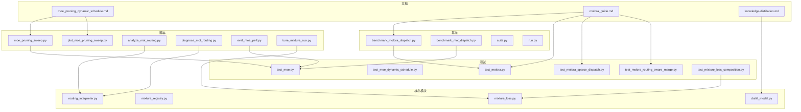
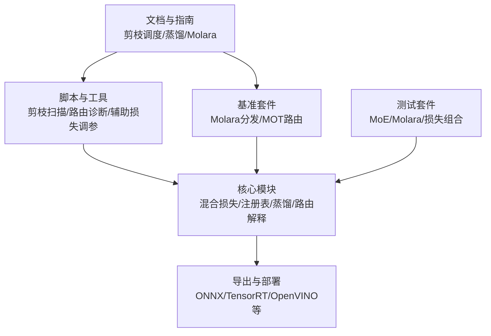
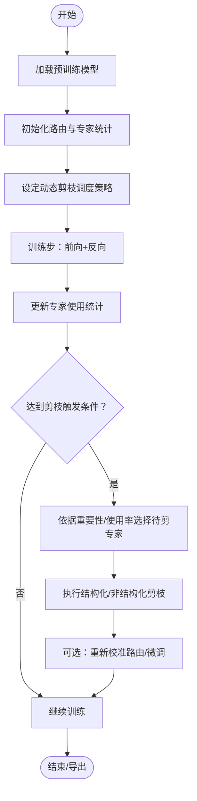
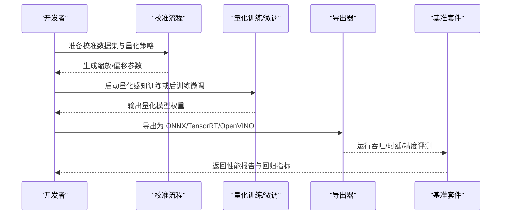
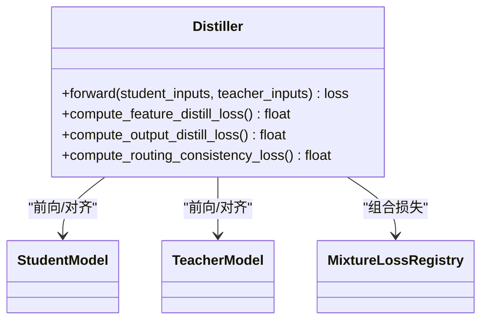
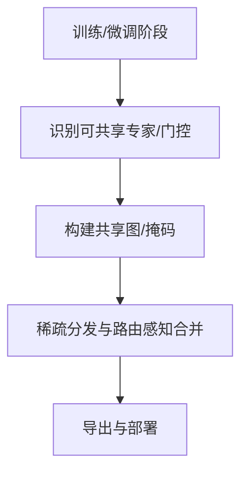
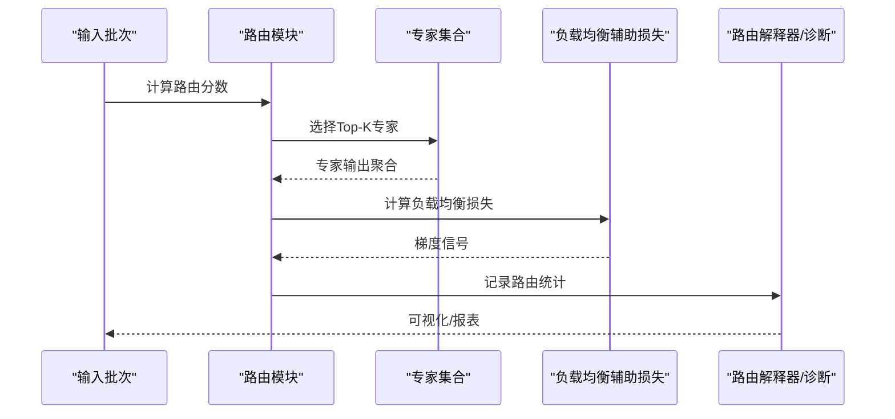
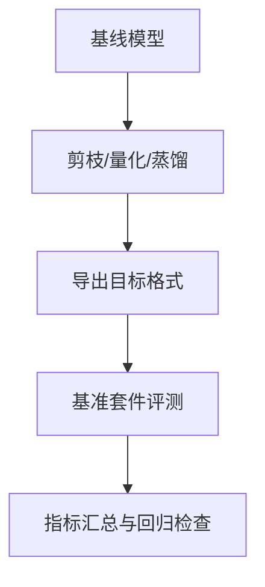
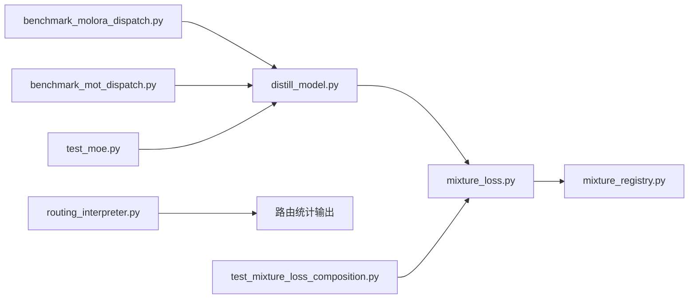

# 高级专家特性

<cite>
**本文引用的文件**
- [moe_pruning_dynamic_schedule.md](file://docs/moe_pruning_dynamic_schedule.md)
- [molora_guide.md](file://docs/molora_guide.md)
- [knowledge-distillation.md](file://docs/en/guides/knowledge-distillation.md)
- [benchmark_molora_dispatch.py](file://benchmarks/benchmark_molora_dispatch.py)
- [benchmark_mot_dispatch.py](file://benchmarks/benchmark_mot_dispatch.py)
- [suite.py](file://benchmarks/suite.py)
- [run.py](file://benchmarks/run.py)
- [test_moe.py](file://tests/test_moe.py)
- [test_moe_dynamic_schedule.py](file://tests/test_moe_dynamic_schedule.py)
- [test_molora.py](file://tests/test_molora.py)
- [test_molora_sparse_dispatch.py](file://tests/test_molora_sparse_dispatch.py)
- [test_molora_routing_aware_merge.py](file://tests/test_molora_routing_aware_merge.py)
- [test_mixture_loss_composition.py](file://tests/test_mixture_loss_composition.py)
- [mixture_loss.py](file://ultralytics/nn/mixture_loss.py)
- [mixture_registry.py](file://ultralytics/nn/mixture_registry.py)
- [distill_model.py](file://ultralytics/nn/distill_model.py)
- [routing_interpreter.py](file://tools/routing_interpreter.py)
- [analyze_mot_routing.py](file://scripts/analyze_mot_routing.py)
- [diagnose_mot_routing.py](file://scripts/diagnose_mot_routing.py)
- [moe_pruning_sweep.py](file://scripts/moe_pruning_sweep.py)
- [plot_moe_pruning_sweep.py](file://scripts/plot_moe_pruning_sweep.py)
- [eval_moe_peft.py](file://scripts/eval_moe_peft.py)
- [tune_mixture_aux.py](file://scripts/tune_mixture_aux.py)
</cite>

## 目录
1. [引言](#引言)
2. [项目结构](#项目结构)
3. [核心组件](#核心组件)
4. [架构总览](#架构总览)
5. [详细组件分析](#详细组件分析)
6. [依赖关系分析](#依赖关系分析)
7. [性能考量](#性能考量)
8. [故障排查指南](#故障排查指南)
9. [结论](#结论)
10. [附录](#附录)

## 引言
本技术文档聚焦于 YOLO-Master 的高级专家特性，围绕以下主题展开：
- 专家剪枝（结构化与非结构化）的原理、实现与效果评估
- 专家量化（INT8、动态量化、静态量化）的配置方法与性能影响
- 专家蒸馏机制（教师-学生模型知识迁移、损失函数设计）
- 专家压缩与稀疏化（权重共享、参数共享策略）
- 专家自适应调整（动态专家选择、负载均衡）
- 配置示例与调优指南
- 性能基准测试与效果评估方法

## 项目结构
本项目在文档、基准、脚本与测试中提供了丰富的 MoE/MoA 相关能力与工具链。与“高级专家特性”直接相关的组织方式如下：
- 文档层：MoE 剪枝调度、Molara 指南、知识蒸馏指南等
- 基准层：针对路由分发、多目标跟踪场景的基准套件
- 脚本层：剪枝扫描、路由诊断、辅助损失调参、PEFT 评估等
- 测试层：覆盖 MoE、Molara、路由感知合并、混合损失组合等关键路径
- 核心模块层：混合损失、注册表、蒸馏模型等

图表来源
- [moe_pruning_dynamic_schedule.md:1-200](file://docs/moe_pruning_dynamic_schedule.md#L1-L200)
- [molora_guide.md:1-200](file://docs/molora_guide.md#L1-L200)
- [knowledge-distillation.md:1-200](file://docs/en/guides/knowledge-distillation.md#L1-L200)
- [benchmark_molora_dispatch.py:1-200](file://benchmarks/benchmark_molora_dispatch.py#L1-L200)
- [benchmark_mot_dispatch.py:1-200](file://benchmarks/benchmark_mot_dispatch.py#L1-L200)
- [suite.py:1-200](file://benchmarks/suite.py#L1-L200)
- [run.py:1-200](file://benchmarks/run.py#L1-L200)
- [moe_pruning_sweep.py:1-200](file://scripts/moe_pruning_sweep.py#L1-L200)
- [plot_moe_pruning_sweep.py:1-200](file://scripts/plot_moe_pruning_sweep.py#L1-L200)
- [analyze_mot_routing.py:1-200](file://scripts/analyze_mot_routing.py#L1-L200)
- [diagnose_mot_routing.py:1-200](file://scripts/diagnose_mot_routing.py#L1-L200)
- [eval_moe_peft.py:1-200](file://scripts/eval_moe_peft.py#L1-L200)
- [tune_mixture_aux.py:1-200](file://scripts/tune_mixture_aux.py#L1-L200)
- [test_moe.py:1-200](file://tests/test_moe.py#L1-L200)
- [test_moe_dynamic_schedule.py:1-200](file://tests/test_moe_dynamic_schedule.py#L1-L200)
- [test_molora.py:1-200](file://tests/test_molora.py#L1-L200)
- [test_molora_sparse_dispatch.py:1-200](file://tests/test_molora_sparse_dispatch.py#L1-L200)
- [test_molora_routing_aware_merge.py:1-200](file://tests/test_molora_routing_aware_merge.py#L1-L200)
- [test_mixture_loss_composition.py:1-200](file://tests/test_mixture_loss_composition.py#L1-L200)
- [mixture_loss.py:1-200](file://ultralytics/nn/mixture_loss.py#L1-L200)
- [mixture_registry.py:1-200](file://ultralytics/nn/mixture_registry.py#L1-L200)
- [distill_model.py:1-200](file://ultralytics/nn/distill_model.py#L1-L200)
- [routing_interpreter.py:1-200](file://tools/routing_interpreter.py#L1-L200)

章节来源
- [moe_pruning_dynamic_schedule.md:1-200](file://docs/moe_pruning_dynamic_schedule.md#L1-L200)
- [molora_guide.md:1-200](file://docs/molora_guide.md#L1-L200)
- [knowledge-distillation.md:1-200](file://docs/en/guides/knowledge-distillation.md#L1-L200)
- [benchmark_molora_dispatch.py:1-200](file://benchmarks/benchmark_molora_dispatch.py#L1-L200)
- [benchmark_mot_dispatch.py:1-200](file://benchmarks/benchmark_mot_dispatch.py#L1-L200)
- [suite.py:1-200](file://benchmarks/suite.py#L1-L200)
- [run.py:1-200](file://benchmarks/run.py#L1-L200)
- [moe_pruning_sweep.py:1-200](file://scripts/moe_pruning_sweep.py#L1-L200)
- [plot_moe_pruning_sweep.py:1-200](file://scripts/plot_moe_pruning_sweep.py#L1-L200)
- [analyze_mot_routing.py:1-200](file://scripts/analyze_mot_routing.py#L1-L200)
- [diagnose_mot_routing.py:1-200](file://scripts/diagnose_mot_routing.py#L1-L200)
- [eval_moe_peft.py:1-200](file://scripts/eval_moe_peft.py#L1-L200)
- [tune_mixture_aux.py:1-200](file://scripts/tune_mixture_aux.py#L1-L200)
- [test_moe.py:1-200](file://tests/test_moe.py#L1-L200)
- [test_moe_dynamic_schedule.py:1-200](file://tests/test_moe_dynamic_schedule.py#L1-L200)
- [test_molora.py:1-200](file://tests/test_molora.py#L1-L200)
- [test_molora_sparse_dispatch.py:1-200](file://tests/test_molora_sparse_dispatch.py#L1-L200)
- [test_molora_routing_aware_merge.py:1-200](file://tests/test_molora_routing_aware_merge.py#L1-L200)
- [test_mixture_loss_composition.py:1-200](file://tests/test_mixture_loss_composition.py#L1-L200)
- [mixture_loss.py:1-200](file://ultralytics/nn/mixture_loss.py#L1-L200)
- [mixture_registry.py:1-200](file://ultralytics/nn/mixture_registry.py#L1-L200)
- [distill_model.py:1-200](file://ultralytics/nn/distill_model.py#L1-L200)
- [routing_interpreter.py:1-200](file://tools/routing_interpreter.py#L1-L200)

## 核心组件
- 混合损失与注册表：提供 MoE/MoA 训练所需的辅助损失、路由约束与损失组合接口，并通过注册表管理不同任务/变体的损失策略。
- 蒸馏模型：封装教师-学生模型的蒸馏流程与损失组合，支持特征级与输出级对齐。
- 路由解释器与诊断：对路由决策进行可视化与统计，帮助定位负载不均衡与热点专家。
- 基准套件：面向 Molara 路由分发与 MOT 场景的路由效率与吞吐评测。
- 剪枝与调度：提供动态剪枝策略与扫描脚本，支持按层/按专家的稀疏化与再训练。
- 测试套件：覆盖 MoE 行为、动态调度、Molara 稀疏分发、路由感知合并与混合损失组合的正确性与数值稳定性。

章节来源
- [mixture_loss.py:1-200](file://ultralytics/nn/mixture_loss.py#L1-L200)
- [mixture_registry.py:1-200](file://ultralytics/nn/mixture_registry.py#L1-L200)
- [distill_model.py:1-200](file://ultralytics/nn/distill_model.py#L1-L200)
- [routing_interpreter.py:1-200](file://tools/routing_interpreter.py#L1-L200)
- [benchmark_molora_dispatch.py:1-200](file://benchmarks/benchmark_molora_dispatch.py#L1-L200)
- [benchmark_mot_dispatch.py:1-200](file://benchmarks/benchmark_mot_dispatch.py#L1-L200)
- [moe_pruning_sweep.py:1-200](file://scripts/moe_pruning_sweep.py#L1-L200)
- [test_moe.py:1-200](file://tests/test_moe.py#L1-L200)
- [test_molora.py:1-200](file://tests/test_molora.py#L1-L200)
- [test_molora_sparse_dispatch.py:1-200](file://tests/test_molora_sparse_dispatch.py#L1-L200)
- [test_molora_routing_aware_merge.py:1-200](file://tests/test_molora_routing_aware_merge.py#L1-L200)
- [test_mixture_loss_composition.py:1-200](file://tests/test_mixture_loss_composition.py#L1-L200)

## 架构总览
下图展示了“高级专家特性”的关键子系统及其交互关系：文档与指南驱动脚本与基准；脚本与基准通过核心模块（损失、注册表、蒸馏、路由解释）完成训练、评估与诊断；测试保障各子系统的正确性。

图表来源
- [moe_pruning_dynamic_schedule.md:1-200](file://docs/moe_pruning_dynamic_schedule.md#L1-L200)
- [molora_guide.md:1-200](file://docs/molora_guide.md#L1-L200)
- [knowledge-distillation.md:1-200](file://docs/en/guides/knowledge-distillation.md#L1-L200)
- [moe_pruning_sweep.py:1-200](file://scripts/moe_pruning_sweep.py#L1-L200)
- [analyze_mot_routing.py:1-200](file://scripts/analyze_mot_routing.py#L1-L200)
- [diagnose_mot_routing.py:1-200](file://scripts/diagnose_mot_routing.py#L1-L200)
- [benchmark_molora_dispatch.py:1-200](file://benchmarks/benchmark_molora_dispatch.py#L1-L200)
- [benchmark_mot_dispatch.py:1-200](file://benchmarks/benchmark_mot_dispatch.py#L1-L200)
- [mixture_loss.py:1-200](file://ultralytics/nn/mixture_loss.py#L1-L200)
- [mixture_registry.py:1-200](file://ultralytics/nn/mixture_registry.py#L1-L200)
- [distill_model.py:1-200](file://ultralytics/nn/distill_model.py#L1-L200)
- [routing_interpreter.py:1-200](file://tools/routing_interpreter.py#L1-L200)
- [test_moe.py:1-200](file://tests/test_moe.py#L1-L200)
- [test_molora.py:1-200](file://tests/test_molora.py#L1-L200)
- [test_mixture_loss_composition.py:1-200](file://tests/test_mixture_loss_composition.py#L1-L200)

## 详细组件分析

### 专家剪枝（结构化与非结构化）
- 原理概述
  - 结构化剪枝：按通道/头/专家粒度移除整块计算单元，保持张量形状规整，利于加速推理与部署。
  - 非结构化剪枝：对细粒度权重置零，获得高稀疏度，但需要稀疏算子或后处理以发挥收益。
- 实现要点
  - 动态剪枝调度：根据训练阶段逐步提高稀疏率，结合路由使用频率与重要性指标进行专家淘汰。
  - 剪枝扫描：遍历稀疏率、阈值、保留比例等超参，生成可复现实验结果与曲线。
- 应用效果
  - 在保持精度的前提下显著降低计算量与内存占用；配合导出优化可获得端到端时延下降。
- 配置与调优建议
  - 从低稀疏率起步，观察路由分布与精度变化，逐步提升；对热点专家采用更保守的阈值。
  - 结合辅助损失（如负载均衡项）稳定训练。

图表来源
- [moe_pruning_dynamic_schedule.md:1-200](file://docs/moe_pruning_dynamic_schedule.md#L1-L200)
- [moe_pruning_sweep.py:1-200](file://scripts/moe_pruning_sweep.py#L1-L200)
- [plot_moe_pruning_sweep.py:1-200](file://scripts/plot_moe_pruning_sweep.py#L1-L200)
- [test_moe.py:1-200](file://tests/test_moe.py#L1-L200)
- [test_moe_dynamic_schedule.py:1-200](file://tests/test_moe_dynamic_schedule.py#L1-L200)

章节来源
- [moe_pruning_dynamic_schedule.md:1-200](file://docs/moe_pruning_dynamic_schedule.md#L1-L200)
- [moe_pruning_sweep.py:1-200](file://scripts/moe_pruning_sweep.py#L1-L200)
- [plot_moe_pruning_sweep.py:1-200](file://scripts/plot_moe_pruning_sweep.py#L1-L200)
- [test_moe.py:1-200](file://tests/test_moe.py#L1-L200)
- [test_moe_dynamic_schedule.py:1-200](file://tests/test_moe_dynamic_schedule.py#L1-L200)

### 专家量化（INT8、动态量化、静态量化）
- 原理概述
  - INT8 量化：将权重/激活映射到 8bit 整数域，减少存储与带宽压力。
  - 动态量化：在运行时按批次统计范围，便于快速部署但可能引入额外开销。
  - 静态量化：离线校准数据上统计范围，推理时固定缩放因子，延迟更低。
- 配置方法
  - 量化目标：优先量化专家内部线性层与门控层，避免破坏路由判别能力。
  - 校准集：使用代表性样本覆盖长尾类别与复杂场景，确保分布估计准确。
  - 回退策略：对不稳定层（如小维度或高频层）回退至 FP16/FP32。
- 性能影响
  - 通常带来显存与带宽下降，推理吞吐提升；需关注精度回落并配合微调恢复。
- 与剪枝协同
  - 先剪枝后量化更易收敛；量化后再做结构化剪枝可进一步压缩。

图表来源
- [benchmark_molora_dispatch.py:1-200](file://benchmarks/benchmark_molora_dispatch.py#L1-L200)
- [benchmark_mot_dispatch.py:1-200](file://benchmarks/benchmark_mot_dispatch.py#L1-L200)
- [suite.py:1-200](file://benchmarks/suite.py#L1-L200)
- [run.py:1-200](file://benchmarks/run.py#L1-L200)

章节来源
- [benchmark_molora_dispatch.py:1-200](file://benchmarks/benchmark_molora_dispatch.py#L1-L200)
- [benchmark_mot_dispatch.py:1-200](file://benchmarks/benchmark_mot_dispatch.py#L1-L200)
- [suite.py:1-200](file://benchmarks/suite.py#L1-L200)
- [run.py:1-200](file://benchmarks/run.py#L1-L200)

### 专家蒸馏（教师-学生模型与损失设计）
- 知识迁移
  - 特征级蒸馏：对齐中间层表示，增强学生模型的特征表达能力。
  - 输出级蒸馏：对齐预测分布，提升分类/检测质量。
- 损失函数设计
  - 组合损失：主任务损失 + 蒸馏损失（KL/余弦/对比等），可按阶段调节权重。
  - 路由蒸馏：对学生路由与教师路由的一致性施加约束，促进专家分工稳定。
- 训练流程
  - 冻结教师或联合微调；分阶段切换蒸馏强度；结合课程学习逐步增加难度。

图表来源
- [distill_model.py:1-200](file://ultralytics/nn/distill_model.py#L1-L200)
- [mixture_loss.py:1-200](file://ultralytics/nn/mixture_loss.py#L1-L200)
- [mixture_registry.py:1-200](file://ultralytics/nn/mixture_registry.py#L1-L200)
- [test_mixture_loss_composition.py:1-200](file://tests/test_mixture_loss_composition.py#L1-L200)

章节来源
- [knowledge-distillation.md:1-200](file://docs/en/guides/knowledge-distillation.md#L1-L200)
- [distill_model.py:1-200](file://ultralytics/nn/distill_model.py#L1-L200)
- [mixture_loss.py:1-200](file://ultralytics/nn/mixture_loss.py#L1-L200)
- [mixture_registry.py:1-200](file://ultralytics/nn/mixture_registry.py#L1-L200)
- [test_mixture_loss_composition.py:1-200](file://tests/test_mixture_loss_composition.py#L1-L200)

### 专家压缩与稀疏化（权重共享与参数共享）
- 权重共享
  - 跨任务/跨阶段的专家权重复用，减少冗余参数，适合多任务或多模态场景。
- 参数共享策略
  - 路由门控参数共享：在多分支结构中共享门控网络，降低路由复杂度。
  - 专家内部参数共享：对相似任务的专家共享部分层，仅微调差异部分。
- 稀疏化与路由感知合并
  - 基于路由重要性的稀疏分发与合并，避免无关专家参与计算，提升吞吐。

图表来源
- [molora_guide.md:1-200](file://docs/molora_guide.md#L1-L200)
- [test_molora_sparse_dispatch.py:1-200](file://tests/test_molora_sparse_dispatch.py#L1-L200)
- [test_molora_routing_aware_merge.py:1-200](file://tests/test_molora_routing_aware_merge.py#L1-L200)

章节来源
- [molora_guide.md:1-200](file://docs/molora_guide.md#L1-L200)
- [test_molora_sparse_dispatch.py:1-200](file://tests/test_molora_sparse_dispatch.py#L1-L200)
- [test_molora_routing_aware_merge.py:1-200](file://tests/test_molora_routing_aware_merge.py#L1-L200)

### 专家自适应调整（动态专家选择与负载均衡）
- 动态专家选择
  - 根据输入特征与历史路由统计，动态选择 Top-K 专家，减少无效计算。
- 负载均衡
  - 通过辅助损失惩罚热点专家，鼓励均匀分配；结合动态调度在训练中逐步放宽/收紧约束。
- 监控与诊断
  - 使用路由解释器与诊断脚本统计专家使用率、Gini 系数、路由熵等指标，指导调参。

图表来源
- [moe_pruning_dynamic_schedule.md:1-200](file://docs/moe_pruning_dynamic_schedule.md#L1-L200)
- [routing_interpreter.py:1-200](file://tools/routing_interpreter.py#L1-L200)
- [analyze_mot_routing.py:1-200](file://scripts/analyze_mot_routing.py#L1-L200)
- [diagnose_mot_routing.py:1-200](file://scripts/diagnose_mot_routing.py#L1-L200)
- [test_moe_dynamic_schedule.py:1-200](file://tests/test_moe_dynamic_schedule.py#L1-L200)

章节来源
- [moe_pruning_dynamic_schedule.md:1-200](file://docs/moe_pruning_dynamic_schedule.md#L1-L200)
- [routing_interpreter.py:1-200](file://tools/routing_interpreter.py#L1-L200)
- [analyze_mot_routing.py:1-200](file://scripts/analyze_mot_routing.py#L1-L200)
- [diagnose_mot_routing.py:1-200](file://scripts/diagnose_mot_routing.py#L1-L200)
- [test_moe_dynamic_schedule.py:1-200](file://tests/test_moe_dynamic_schedule.py#L1-L200)

### 配置示例与调优指南
- 剪枝
  - 起始稀疏率：建议从较低值开始，逐步提升；关注路由分布与精度曲线。
  - 触发频率：按 epoch 或 step 触发，结合验证集指标早停。
- 量化
  - 校准集规模：覆盖主要类别与困难样本；必要时分层设置量化策略。
  - 回退层：对不稳定层回退至更高精度，平衡速度与精度。
- 蒸馏
  - 损失权重：随训练阶段递增蒸馏权重；对路由一致性损失适度加权。
  - 教师模型：可选择更大规模或同构更强版本，保证知识质量。
- 自适应
  - 负载均衡系数：初始较小，逐步增大；结合路由熵监控避免过度平滑。
  - Top-K 选择：根据任务复杂度与资源限制调整。

章节来源
- [moe_pruning_dynamic_schedule.md:1-200](file://docs/moe_pruning_dynamic_schedule.md#L1-L200)
- [molora_guide.md:1-200](file://docs/molora_guide.md#L1-L200)
- [knowledge-distillation.md:1-200](file://docs/en/guides/knowledge-distillation.md#L1-L200)
- [tune_mixture_aux.py:1-200](file://scripts/tune_mixture_aux.py#L1-L200)

### 性能基准测试与效果评估方法
- 基准套件
  - Molara 路由分发基准：评估不同路由策略下的吞吐与时延。
  - MOT 路由基准：在多目标跟踪场景下评估路由效率与精度。
- 评估指标
  - 精度：mAP、召回率、F1 等任务指标。
  - 效率：吞吐（FPS）、时延（ms）、显存占用、能耗。
  - 路由健康度：专家使用分布、Gini 系数、路由熵。
- 实验流程
  - 基线训练 → 剪枝/量化/蒸馏 → 导出 → 基准评测 → 回归检查。

图表来源
- [benchmark_molora_dispatch.py:1-200](file://benchmarks/benchmark_molora_dispatch.py#L1-L200)
- [benchmark_mot_dispatch.py:1-200](file://benchmarks/benchmark_mot_dispatch.py#L1-L200)
- [suite.py:1-200](file://benchmarks/suite.py#L1-L200)
- [run.py:1-200](file://benchmarks/run.py#L1-L200)
- [eval_moe_peft.py:1-200](file://scripts/eval_moe_peft.py#L1-L200)

章节来源
- [benchmark_molora_dispatch.py:1-200](file://benchmarks/benchmark_molora_dispatch.py#L1-L200)
- [benchmark_mot_dispatch.py:1-200](file://benchmarks/benchmark_mot_dispatch.py#L1-L200)
- [suite.py:1-200](file://benchmarks/suite.py#L1-L200)
- [run.py:1-200](file://benchmarks/run.py#L1-L200)
- [eval_moe_peft.py:1-200](file://scripts/eval_moe_peft.py#L1-L200)

## 依赖关系分析
- 模块耦合
  - 混合损失与注册表被蒸馏与 MoE 训练广泛依赖，形成稳定的核心契约。
  - 路由解释器与诊断脚本依赖路由统计输出，用于可视化与问题定位。
  - 基准套件与测试套件共同保障功能正确性与性能回归。
- 外部依赖
  - 导出器对接多种后端（ONNX/TensorRT/OpenVINO 等），受平台能力矩阵约束。
- 潜在循环依赖
  - 通过注册表与接口抽象解耦，避免直接循环导入。

图表来源
- [mixture_loss.py:1-200](file://ultralytics/nn/mixture_loss.py#L1-L200)
- [mixture_registry.py:1-200](file://ultralytics/nn/mixture_registry.py#L1-L200)
- [distill_model.py:1-200](file://ultralytics/nn/distill_model.py#L1-L200)
- [routing_interpreter.py:1-200](file://tools/routing_interpreter.py#L1-L200)
- [benchmark_molora_dispatch.py:1-200](file://benchmarks/benchmark_molora_dispatch.py#L1-L200)
- [benchmark_mot_dispatch.py:1-200](file://benchmarks/benchmark_mot_dispatch.py#L1-L200)
- [test_mixture_loss_composition.py:1-200](file://tests/test_mixture_loss_composition.py#L1-L200)
- [test_moe.py:1-200](file://tests/test_moe.py#L1-L200)

章节来源
- [mixture_loss.py:1-200](file://ultralytics/nn/mixture_loss.py#L1-L200)
- [mixture_registry.py:1-200](file://ultralytics/nn/mixture_registry.py#L1-L200)
- [distill_model.py:1-200](file://ultralytics/nn/distill_model.py#L1-L200)
- [routing_interpreter.py:1-200](file://tools/routing_interpreter.py#L1-L200)
- [benchmark_molora_dispatch.py:1-200](file://benchmarks/benchmark_molora_dispatch.py#L1-L200)
- [benchmark_mot_dispatch.py:1-200](file://benchmarks/benchmark_mot_dispatch.py#L1-L200)
- [test_mixture_loss_composition.py:1-200](file://tests/test_mixture_loss_composition.py#L1-L200)
- [test_moe.py:1-200](file://tests/test_moe.py#L1-L200)

## 性能考量
- 路由开销：Top-K 选择与聚合在大批次下可能成为瓶颈，可通过批内并行与缓存优化。
- 稀疏计算：非结构化稀疏需依赖稀疏内核或后处理，结构化剪枝更易落地。
- 量化误差：校准集代表性不足会导致精度波动，建议分层量化与回退策略。
- 蒸馏稳定性：蒸馏权重过大易导致过拟合教师，建议课程式递增与早停。
- 导出优化：结合目标后端特性（如 TensorRT 插件、OpenVINO IR 优化）进一步提升吞吐。

[本节为通用指导，无需特定文件引用]

## 故障排查指南
- 路由异常
  - 现象：某专家长期未被选择或过载。
  - 排查：使用路由解释器与诊断脚本查看使用分布与熵；调整负载均衡系数与 Top-K。
- 精度回退
  - 现象：剪枝/量化后 mAP 下降明显。
  - 排查：检查稀疏率/量化策略是否过于激进；进行微调或回退不稳定层。
- 训练不稳定
  - 现象：损失震荡或 NaN。
  - 排查：检查蒸馏损失权重与路由一致性损失；减小学习率或启用梯度裁剪。
- 导出失败
  - 现象：导出到目标后端报错。
  - 排查：核对导出能力矩阵与算子支持；简化自定义算子或使用兼容模式。

章节来源
- [routing_interpreter.py:1-200](file://tools/routing_interpreter.py#L1-L200)
- [analyze_mot_routing.py:1-200](file://scripts/analyze_mot_routing.py#L1-L200)
- [diagnose_mot_routing.py:1-200](file://scripts/diagnose_mot_routing.py#L1-L200)
- [test_moe.py:1-200](file://tests/test_moe.py#L1-L200)
- [test_molora.py:1-200](file://tests/test_molora.py#L1-L200)
- [test_mixture_loss_composition.py:1-200](file://tests/test_mixture_loss_composition.py#L1-L200)

## 结论
YOLO-Master 的高级专家特性通过剪枝、量化、蒸馏、压缩与自适应调整等多维手段，实现了在精度、效率与部署友好性之间的良好平衡。借助完善的基准套件、诊断工具与测试覆盖，用户可在不同任务与平台上快速迭代并获得可复现的性能收益。建议在工程实践中遵循“先剪枝后量化、蒸馏渐进、路由健康监控”的策略，以获得稳健的端到端效果。

[本节为总结，无需特定文件引用]

## 附录
- 术语
  - MoE：Mixture of Experts，专家混合模型
  - MoA：Mixture of Attention，注意力混合
  - Molara：路由感知的稀疏分发与合并方案
  - PEFT：参数高效微调
- 参考
  - 剪枝调度文档、Molara 指南、知识蒸馏指南、基准套件与测试用例

[本节为补充信息，无需特定文件引用]