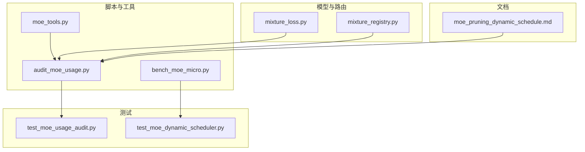
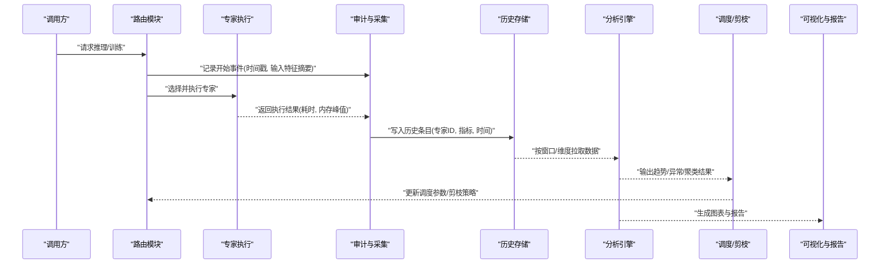
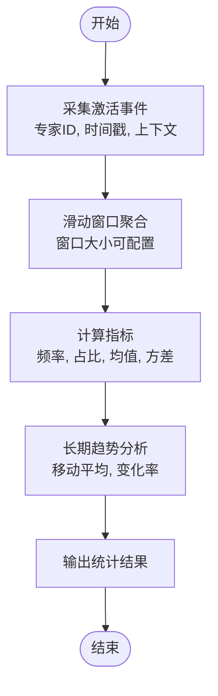
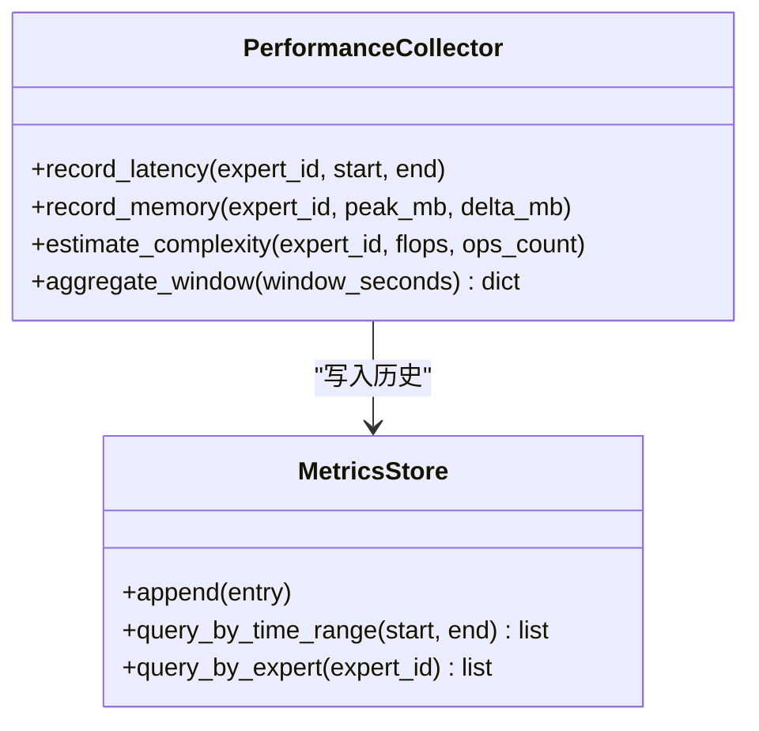
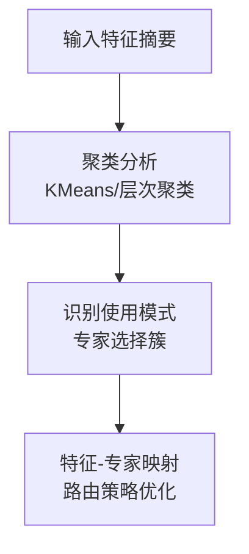
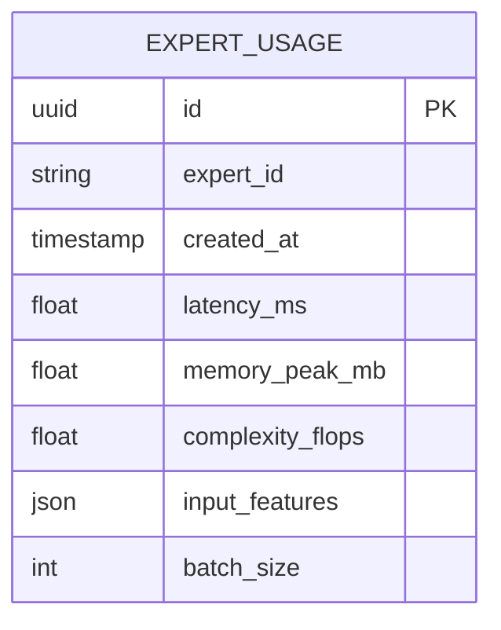
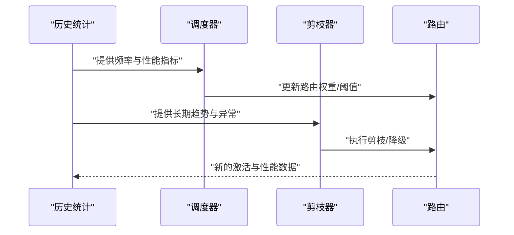
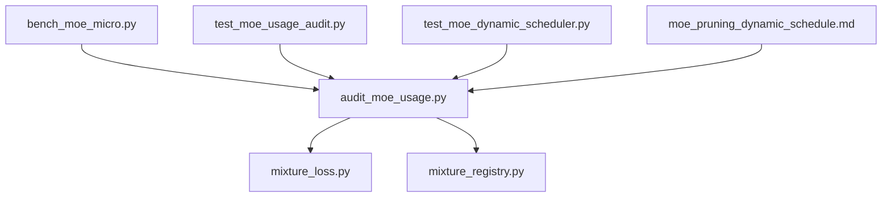

# 专家使用历史统计

<cite>
**本文引用的文件**
- [moe_pruning_dynamic_schedule.md](file://docs/moe_pruning_dynamic_schedule.md)
- [audit_moe_usage.py](file://scripts/audit_moe_usage.py)
- [bench_moe_micro.py](file://scripts/bench_moe_micro.py)
- [test_moe_usage_audit.py](file://tests/test_moe_usage_audit.py)
- [test_moe_dynamic_scheduler.py](file://tests/test_moe_dynamic_scheduler.py)
- [mixture_loss.py](file://ultralytics/nn/mixture_loss.py)
- [mixture_registry.py](file://ultralytics/nn/mixture_registry.py)
- [moe_tools.py](file://agent/runtime/cli/moe_tools.py)
</cite>

## 目录
1. [简介](#简介)
2. [项目结构](#项目结构)
3. [核心组件](#核心组件)
4. [架构总览](#架构总览)
5. [详细组件分析](#详细组件分析)
6. [依赖关系分析](#依赖关系分析)
7. [性能考量](#性能考量)
8. [故障排查指南](#故障排查指南)
9. [结论](#结论)
10. [附录](#附录)

## 简介
本技术文档聚焦于YOLO-Master的MoE（Mixture of Experts）专家使用历史统计系统，围绕以下目标展开：
- 专家激活频率统计的实现原理：实时收集、滑动窗口计算与长期趋势分析
- 专家性能指标采集与分析：响应时间、内存占用、计算复杂度
- 专家使用模式识别与聚类分析：输入特征与专家选择的关联
- 历史数据存储格式与查询接口：支持时间序列分析与批量统计
- 历史统计对专家调度与剪枝决策的支持
- 历史数据可视化工具与报告生成器
- 历史数据管理与维护策略：清理与归档
- 基于历史分析的优化建议

## 项目结构
与“专家使用历史统计”直接相关的代码与文档主要分布在如下位置：
- 脚本层：用于审计、基准测试与动态调度评估
- 测试层：覆盖审计与动态调度逻辑的正确性与稳定性
- 模型与路由层：提供混合路由与损失相关的基础设施
- 文档层：包含动态调度与剪枝策略的设计说明

图表来源
- [audit_moe_usage.py:1-200](file://scripts/audit_moe_usage.py#L1-L200)
- [bench_moe_micro.py:1-200](file://scripts/bench_moe_micro.py#L1-L200)
- [moe_tools.py:1-200](file://agent/runtime/cli/moe_tools.py#L1-L200)
- [test_moe_usage_audit.py:1-200](file://tests/test_moe_usage_audit.py#L1-L200)
- [test_moe_dynamic_scheduler.py:1-200](file://tests/test_moe_dynamic_scheduler.py#L1-L200)
- [mixture_loss.py:1-200](file://ultralytics/nn/mixture_loss.py#L1-L200)
- [mixture_registry.py:1-200](file://ultralytics/nn/mixture_registry.py#L1-L200)
- [moe_pruning_dynamic_schedule.md:1-200](file://docs/moe_pruning_dynamic_schedule.md#L1-L200)

章节来源
- [audit_moe_usage.py:1-200](file://scripts/audit_moe_usage.py#L1-L200)
- [bench_moe_micro.py:1-200](file://scripts/bench_moe_micro.py#L1-L200)
- [moe_tools.py:1-200](file://agent/runtime/cli/moe_tools.py#L1-L200)
- [test_moe_usage_audit.py:1-200](file://tests/test_moe_usage_audit.py#L1-L200)
- [test_moe_dynamic_scheduler.py:1-200](file://tests/test_moe_dynamic_scheduler.py#L1-L200)
- [mixture_loss.py:1-200](file://ultralytics/nn/mixture_loss.py#L1-L200)
- [mixture_registry.py:1-200](file://ultralytics/nn/mixture_registry.py#L1-L200)
- [moe_pruning_dynamic_schedule.md:1-200](file://docs/moe_pruning_dynamic_schedule.md#L1-L200)

## 核心组件
- 审计与采集模块：负责在推理或训练过程中捕获专家选择、激活次数、耗时与资源消耗等指标，并写入历史存储。
- 滑动窗口与趋势分析：基于时间窗口聚合近期统计，同时维护长期趋势以识别冷热点专家与漂移现象。
- 动态调度与剪枝策略：依据历史统计结果调整专家权重、路由阈值或执行剪枝计划，提升吞吐与能效。
- 可视化与报告：将历史统计结果输出为图表与报告，辅助运维与算法工程师进行诊断与调优。

章节来源
- [audit_moe_usage.py:1-200](file://scripts/audit_moe_usage.py#L1-L200)
- [bench_moe_micro.py:1-200](file://scripts/bench_moe_micro.py#L1-L200)
- [moe_pruning_dynamic_schedule.md:1-200](file://docs/moe_pruning_dynamic_schedule.md#L1-L200)

## 架构总览
整体流程从数据采集到分析再到决策闭环，关键路径如下：
- 数据采集：在路由与专家执行前后埋点，记录专家ID、激活时间戳、耗时、内存峰值、输入特征摘要等
- 存储与索引：按时间序列组织数据，支持按专家、时间范围、任务类型等多维查询
- 分析引擎：滑动窗口聚合、长期趋势拟合、异常检测与模式聚类
- 决策与执行：根据分析结果更新调度参数或触发剪枝动作
- 可视化与报告：生成时序图、热力图、分布图与文本报告

图表来源
- [audit_moe_usage.py:1-200](file://scripts/audit_moe_usage.py#L1-L200)
- [bench_moe_micro.py:1-200](file://scripts/bench_moe_micro.py#L1-L200)
- [moe_pruning_dynamic_schedule.md:1-200](file://docs/moe_pruning_dynamic_schedule.md#L1-L200)

## 详细组件分析

### 专家激活频率统计
- 实时收集：在路由阶段与专家执行阶段埋点，记录每次激活的时间戳、专家ID与上下文信息
- 滑动窗口计算：按固定时间窗口（如分钟/小时）聚合激活计数，计算窗口内频率与占比
- 长期趋势分析：维护滚动均值、方差与变化率，识别冷热点转移与周期性波动

图表来源
- [audit_moe_usage.py:1-200](file://scripts/audit_moe_usage.py#L1-L200)
- [bench_moe_micro.py:1-200](file://scripts/bench_moe_micro.py#L1-L200)

章节来源
- [audit_moe_usage.py:1-200](file://scripts/audit_moe_usage.py#L1-L200)
- [bench_moe_micro.py:1-200](file://scripts/bench_moe_micro.py#L1-L200)

### 专家性能指标采集与分析
- 响应时间：记录专家执行的起止时间差，支持分位数统计（P50/P90/P99）
- 内存占用：采集专家执行期间的内存峰值与增量，结合批大小与输入尺寸归一化
- 计算复杂度：估算FLOPs或算子数量，结合硬件利用率评估效率

图表来源
- [bench_moe_micro.py:1-200](file://scripts/bench_moe_micro.py#L1-L200)
- [audit_moe_usage.py:1-200](file://scripts/audit_moe_usage.py#L1-L200)

章节来源
- [bench_moe_micro.py:1-200](file://scripts/bench_moe_micro.py#L1-L200)
- [audit_moe_usage.py:1-200](file://scripts/audit_moe_usage.py#L1-L200)

### 专家使用模式识别与聚类分析
- 特征工程：提取输入特征摘要（如类别分布、图像尺寸、场景标签）与专家选择向量
- 聚类方法：使用无监督聚类（如KMeans或层次聚类）发现典型使用模式
- 关联分析：建立输入特征簇与专家选择模式的映射，指导路由策略优化

图表来源
- [audit_moe_usage.py:1-200](file://scripts/audit_moe_usage.py#L1-L200)
- [bench_moe_micro.py:1-200](file://scripts/bench_moe_micro.py#L1-L200)

章节来源
- [audit_moe_usage.py:1-200](file://scripts/audit_moe_usage.py#L1-L200)
- [bench_moe_micro.py:1-200](file://scripts/bench_moe_micro.py#L1-L200)

### 历史数据存储格式与查询接口
- 存储格式：每条记录包含专家ID、时间戳、指标字典（延迟、内存、复杂度）、输入特征摘要与批次信息
- 查询接口：支持按时间范围、专家ID、任务类型、批次大小等条件过滤与聚合
- 批量统计：提供窗口聚合、分位数统计、趋势拟合等批量分析能力

图表来源
- [audit_moe_usage.py:1-200](file://scripts/audit_moe_usage.py#L1-L200)
- [bench_moe_micro.py:1-200](file://scripts/bench_moe_micro.py#L1-L200)

章节来源
- [audit_moe_usage.py:1-200](file://scripts/audit_moe_usage.py#L1-L200)
- [bench_moe_micro.py:1-200](file://scripts/bench_moe_micro.py#L1-L200)

### 历史统计对专家调度与剪枝决策的支持
- 动态调度：依据滑动窗口内的激活频率与性能指标，动态调整专家权重或路由阈值
- 剪枝策略：对长期低激活且高延迟的专家进行剪枝或降级，释放资源给热点专家
- 反馈闭环：调度与剪枝结果再次进入历史统计，形成持续优化的闭环

图表来源
- [moe_pruning_dynamic_schedule.md:1-200](file://docs/moe_pruning_dynamic_schedule.md#L1-L200)
- [audit_moe_usage.py:1-200](file://scripts/audit_moe_usage.py#L1-L200)

章节来源
- [moe_pruning_dynamic_schedule.md:1-200](file://docs/moe_pruning_dynamic_schedule.md#L1-L200)
- [audit_moe_usage.py:1-200](file://scripts/audit_moe_usage.py#L1-L200)

### 可视化工具与报告生成器
- 可视化：生成专家激活时序图、延迟分布直方图、内存占用曲线与专家热力图
- 报告：汇总窗口统计、趋势分析、异常检测结果与调度/剪枝建议
- 集成：通过脚本或API导出图表与报告，便于纳入监控平台

章节来源
- [audit_moe_usage.py:1-200](file://scripts/audit_moe_usage.py#L1-L200)
- [bench_moe_micro.py:1-200](file://scripts/bench_moe_micro.py#L1-L200)

### 历史数据管理与维护策略
- 数据清理：定期删除过期窗口数据，保留长期趋势摘要
- 归档机制：将冷数据压缩归档至低成本存储，保持在线查询性能
- 一致性校验：对历史数据进行完整性与一致性检查，防止脏数据影响分析

章节来源
- [audit_moe_usage.py:1-200](file://scripts/audit_moe_usage.py#L1-L200)
- [bench_moe_micro.py:1-200](file://scripts/bench_moe_micro.py#L1-L200)

### 基于历史分析的优化建议
- 路由策略：根据聚类结果与特征-专家映射优化路由规则，减少跨域切换
- 资源分配：为热点专家预留更多资源，降低尾延迟
- 模型裁剪：对长尾专家进行LoRA微调或合并，平衡精度与效率

章节来源
- [moe_pruning_dynamic_schedule.md:1-200](file://docs/moe_pruning_dynamic_schedule.md#L1-L200)
- [audit_moe_usage.py:1-200](file://scripts/audit_moe_usage.py#L1-L200)

## 依赖关系分析
- 审计与基准脚本依赖路由与损失模块提供的上下文与指标
- 测试用例验证审计与动态调度的正确性
- 文档驱动调度与剪枝策略的设计与演进

图表来源
- [audit_moe_usage.py:1-200](file://scripts/audit_moe_usage.py#L1-L200)
- [bench_moe_micro.py:1-200](file://scripts/bench_moe_micro.py#L1-L200)
- [test_moe_usage_audit.py:1-200](file://tests/test_moe_usage_audit.py#L1-L200)
- [test_moe_dynamic_scheduler.py:1-200](file://tests/test_moe_dynamic_scheduler.py#L1-L200)
- [mixture_loss.py:1-200](file://ultralytics/nn/mixture_loss.py#L1-L200)
- [mixture_registry.py:1-200](file://ultralytics/nn/mixture_registry.py#L1-L200)
- [moe_pruning_dynamic_schedule.md:1-200](file://docs/moe_pruning_dynamic_schedule.md#L1-L200)

章节来源
- [audit_moe_usage.py:1-200](file://scripts/audit_moe_usage.py#L1-L200)
- [bench_moe_micro.py:1-200](file://scripts/bench_moe_micro.py#L1-L200)
- [test_moe_usage_audit.py:1-200](file://tests/test_moe_usage_audit.py#L1-L200)
- [test_moe_dynamic_scheduler.py:1-200](file://tests/test_moe_dynamic_scheduler.py#L1-L200)
- [mixture_loss.py:1-200](file://ultralytics/nn/mixture_loss.py#L1-L200)
- [mixture_registry.py:1-200](file://ultralytics/nn/mixture_registry.py#L1-L200)
- [moe_pruning_dynamic_schedule.md:1-200](file://docs/moe_pruning_dynamic_schedule.md#L1-L200)

## 性能考量
- 采样与降频：在高吞吐场景下采用采样策略降低审计开销
- 异步写入：将历史数据写入操作异步化，避免阻塞主路径
- 窗口大小权衡：较短窗口提高灵敏度但噪声较大，较长窗口平滑但滞后明显
- 内存控制：限制历史数据缓存大小，及时淘汰旧窗口数据

## 故障排查指南
- 指标缺失：检查埋点是否生效，确认路由与专家执行边界是否正确
- 数据不一致：核对时间戳对齐与批次信息一致性，确保聚合口径统一
- 调度失效：验证分析结果到调度参数的映射逻辑，检查阈值与权重更新
- 报告异常：确认可视化与报告生成器的输入数据完整与格式正确

章节来源
- [test_moe_usage_audit.py:1-200](file://tests/test_moe_usage_audit.py#L1-L200)
- [test_moe_dynamic_scheduler.py:1-200](file://tests/test_moe_dynamic_scheduler.py#L1-L200)

## 结论
专家使用历史统计系统通过实时采集、滑动窗口与长期趋势分析，为MoE的动态调度与剪枝提供了可靠的数据基础。结合可视化与报告工具，运维与算法团队能够高效定位瓶颈、优化路由策略与资源配置，实现精度与效率的平衡。

## 附录
- 术语表：专家、路由、滑动窗口、动态调度、剪枝
- 参考文档：动态调度与剪枝策略设计说明
- 示例脚本：审计与基准测试入口