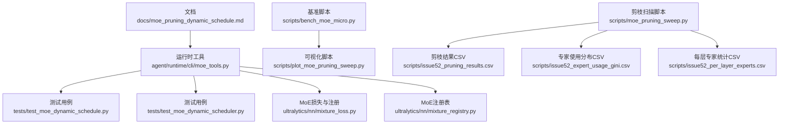
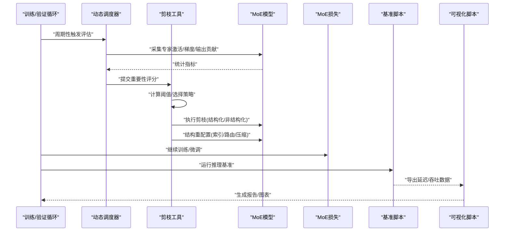
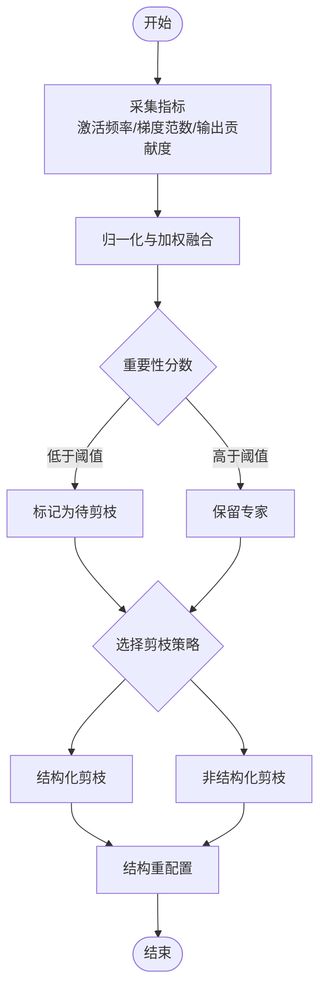
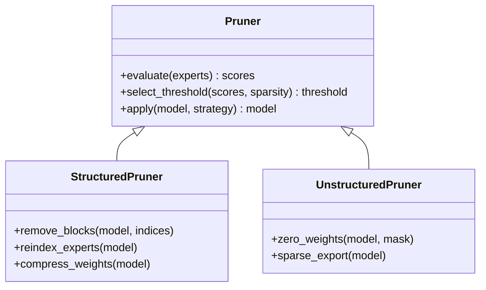
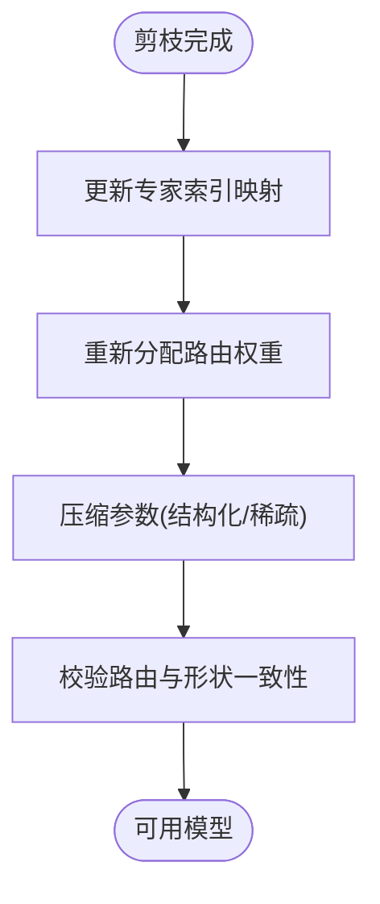
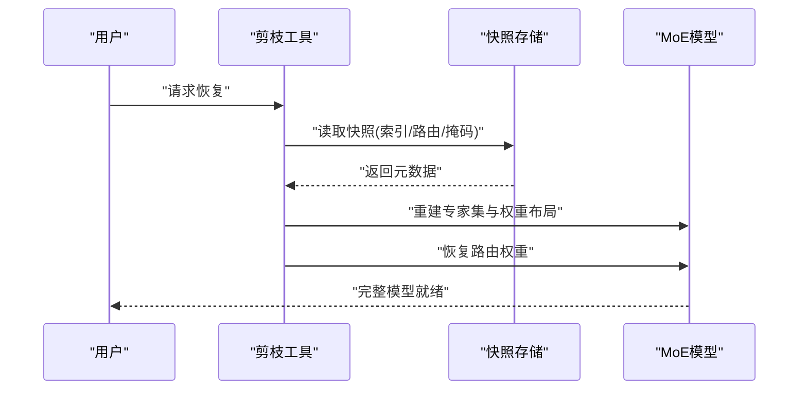
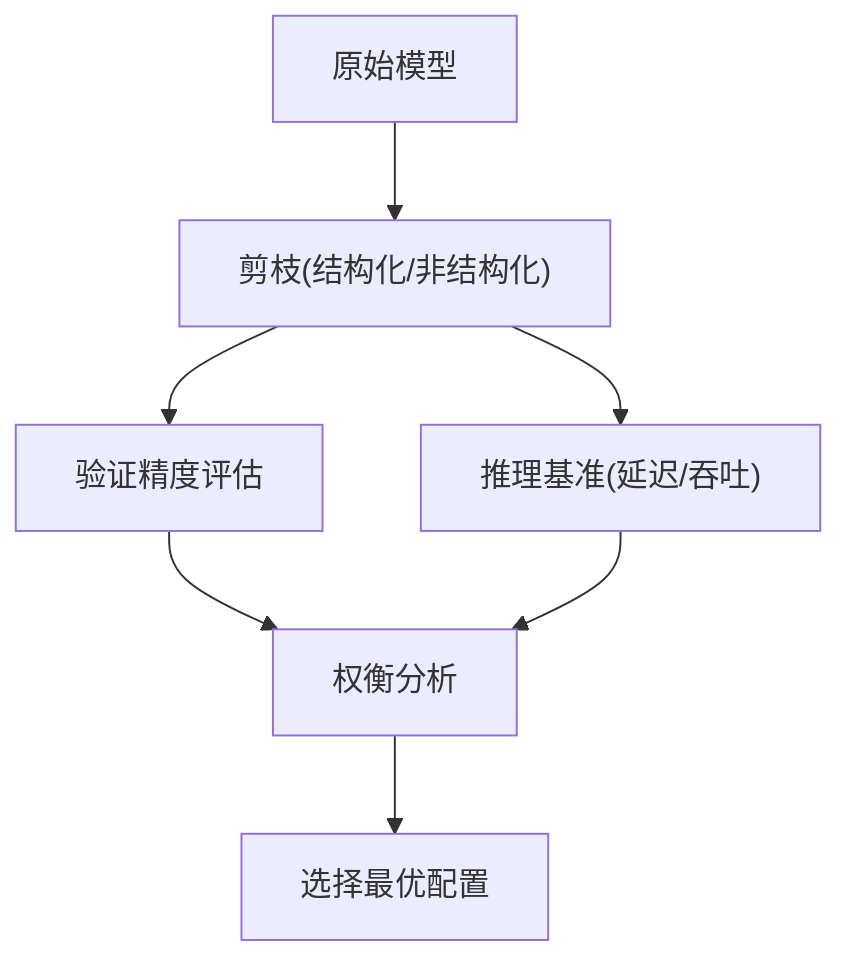
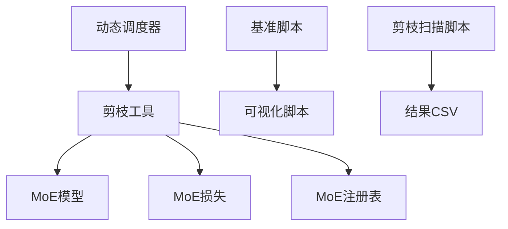

# 专家剪枝机制

<cite>
**本文引用的文件**
- [moe_pruning_dynamic_schedule.md](file://docs/moe_pruning_dynamic_schedule.md)
- [moe_tools.py](file://agent/runtime/cli/moe_tools.py)
- [test_moe_dynamic_scheduler.py](file://tests/test_moe_dynamic_scheduler.py)
- [test_moe_dynamic_schedule.py](file://tests/test_moe_dynamic_schedule.py)
- [mixture_loss.py](file://ultralytics/nn/mixture_loss.py)
- [mixture_registry.py](file://ultralytics/nn/mixture_registry.py)
- [bench_moe_micro.py](file://scripts/bench_moe_micro.py)
- [plot_moe_pruning_sweep.py](file://scripts/plot_moe_pruning_sweep.py)
- [issue52_pruning_results.csv](file://scripts/issue52_pruning_results.csv)
- [issue52_expert_usage_gini.csv](file://scripts/issue52_expert_usage_gini.csv)
- [issue52_per_layer_experts.csv](file://scripts/issue52_per_layer_experts.csv)
- [moe_pruning_sweep.py](file://scripts/moe_pruning_sweep.py)
</cite>

## 目录
1. [简介](#简介)
2. [项目结构](#项目结构)
3. [核心组件](#核心组件)
4. [架构总览](#架构总览)
5. [详细组件分析](#详细组件分析)
6. [依赖关系分析](#依赖关系分析)
7. [性能考量](#性能考量)
8. [故障排查指南](#故障排查指南)
9. [结论](#结论)
10. [附录](#附录)

## 简介
本技术文档聚焦于YOLO-Master中MoE（Mixture of Experts）专家的剪枝机制，系统性阐述以下方面：
- 专家重要性评估算法：基于激活频率、梯度范数与输出贡献度的度量方法
- 剪枝策略实现：结构化与非结构化剪枝的区别与应用场景
- 剪枝过程中的结构重配置：专家索引更新、路由权重重新分配与模型参数压缩
- 可逆性与恢复机制：从剪枝状态恢复到完整模型
- 精度与推理速度影响分析
- 剪枝配置参数说明与调优指南
- 监控指标与可视化分析工具
- 不同数据集与任务下的剪枝策略推荐方案

## 项目结构
围绕MoE专家剪枝的相关代码与文档主要分布在如下位置：
- 文档与计划：docs/moe_pruning_dynamic_schedule.md
- 运行时工具：agent/runtime/cli/moe_tools.py
- 测试用例：tests/test_moe_dynamic_schedule.py、tests/test_moe_dynamic_scheduler.py
- MoE损失与注册：ultralytics/nn/mixture_loss.py、ultralytics/nn/mixture_registry.py
- 基准与可视化：scripts/bench_moe_micro.py、scripts/plot_moe_pruning_sweep.py
- 剪枝实验脚本与结果：scripts/moe_pruning_sweep.py、scripts/issue52_*.csv

图表来源
- [moe_pruning_dynamic_schedule.md:1-200](file://docs/moe_pruning_dynamic_schedule.md#L1-L200)
- [moe_tools.py:1-200](file://agent/runtime/cli/moe_tools.py#L1-L200)
- [test_moe_dynamic_schedule.py:1-200](file://tests/test_moe_dynamic_schedule.py#L1-L200)
- [test_moe_dynamic_scheduler.py:1-200](file://tests/test_moe_dynamic_scheduler.py#L1-L200)
- [mixture_loss.py:1-200](file://ultralytics/nn/mixture_loss.py#L1-L200)
- [mixture_registry.py:1-200](file://ultralytics/nn/mixture_registry.py#L1-L200)
- [bench_moe_micro.py:1-200](file://scripts/bench_moe_micro.py#L1-L200)
- [plot_moe_pruning_sweep.py:1-200](file://scripts/plot_moe_pruning_sweep.py#L1-L200)
- [moe_pruning_sweep.py:1-200](file://scripts/moe_pruning_sweep.py#L1-L200)
- [issue52_pruning_results.csv:1-200](file://scripts/issue52_pruning_results.csv#L1-L200)
- [issue52_expert_usage_gini.csv:1-200](file://scripts/issue52_expert_usage_gini.csv#L1-L200)
- [issue52_per_layer_experts.csv:1-200](file://scripts/issue52_per_layer_experts.csv#L1-L200)

章节来源
- [moe_pruning_dynamic_schedule.md:1-200](file://docs/moe_pruning_dynamic_schedule.md#L1-L200)
- [moe_tools.py:1-200](file://agent/runtime/cli/moe_tools.py#L1-L200)
- [test_moe_dynamic_schedule.py:1-200](file://tests/test_moe_dynamic_schedule.py#L1-L200)
- [test_moe_dynamic_scheduler.py:1-200](file://tests/test_moe_dynamic_scheduler.py#L1-L200)
- [mixture_loss.py:1-200](file://ultralytics/nn/mixture_loss.py#L1-L200)
- [mixture_registry.py:1-200](file://ultralytics/nn/mixture_registry.py#L1-L200)
- [bench_moe_micro.py:1-200](file://scripts/bench_moe_micro.py#L1-L200)
- [plot_moe_pruning_sweep.py:1-200](file://scripts/plot_moe_pruning_sweep.py#L1-L200)
- [moe_pruning_sweep.py:1-200](file://scripts/moe_pruning_sweep.py#L1-L200)
- [issue52_pruning_results.csv:1-200](file://scripts/issue52_pruning_results.csv#L1-L200)
- [issue52_expert_usage_gini.csv:1-200](file://scripts/issue52_expert_usage_gini.csv#L1-L200)
- [issue52_per_layer_experts.csv:1-200](file://scripts/issue52_per_layer_experts.csv#L1-L200)

## 核心组件
- 动态调度与剪枝策略
  - 动态调度器负责在训练或验证阶段按周期评估专家重要性并执行剪枝决策。其接口与行为由测试用例覆盖，确保稳定性与可重复性。
- 运行时剪枝工具
  - 提供剪枝流程的CLI/函数式入口，包括重要性计算、阈值选择、结构重配置与导出等能力。
- MoE损失与注册
  - 损失模块包含路由辅助项与专家负载均衡相关项；注册表用于集中管理MoE变体与配置解析。
- 基准与可视化
  - 微基准脚本用于测量剪枝前后推理延迟与吞吐；可视化脚本将剪枝扫描结果绘制为曲线与热力图。
- 剪枝扫描与结果
  - 扫描脚本遍历不同剪枝率与策略组合，生成CSV结果，便于后续分析与对比。

章节来源
- [test_moe_dynamic_schedule.py:1-200](file://tests/test_moe_dynamic_schedule.py#L1-L200)
- [test_moe_dynamic_scheduler.py:1-200](file://tests/test_moe_dynamic_scheduler.py#L1-L200)
- [moe_tools.py:1-200](file://agent/runtime/cli/moe_tools.py#L1-L200)
- [mixture_loss.py:1-200](file://ultralytics/nn/mixture_loss.py#L1-L200)
- [mixture_registry.py:1-200](file://ultralytics/nn/mixture_registry.py#L1-L200)
- [bench_moe_micro.py:1-200](file://scripts/bench_moe_micro.py#L1-L200)
- [plot_moe_pruning_sweep.py:1-200](file://scripts/plot_moe_pruning_sweep.py#L1-L200)
- [moe_pruning_sweep.py:1-200](file://scripts/moe_pruning_sweep.py#L1-L200)

## 架构总览
下图展示了剪枝流程的整体数据与控制流：从重要性评估到剪枝决策，再到结构重配置与导出，最后进行基准与可视化。

图表来源
- [moe_tools.py:1-200](file://agent/runtime/cli/moe_tools.py#L1-L200)
- [test_moe_dynamic_schedule.py:1-200](file://tests/test_moe_dynamic_schedule.py#L1-L200)
- [test_moe_dynamic_scheduler.py:1-200](file://tests/test_moe_dynamic_scheduler.py#L1-L200)
- [mixture_loss.py:1-200](file://ultralytics/nn/mixture_loss.py#L1-L200)
- [bench_moe_micro.py:1-200](file://scripts/bench_moe_micro.py#L1-L200)
- [plot_moe_pruning_sweep.py:1-200](file://scripts/plot_moe_pruning_sweep.py#L1-L200)

## 详细组件分析

### 专家重要性评估算法
- 基于激活频率
  - 统计每个专家在前向传播中被选中的次数或比例，作为“使用度”指标。低使用度专家更可能被剪枝。
- 基于梯度范数
  - 聚合专家参数的梯度范数（如L2范数），反映该专家对损失的敏感度。梯度范数小的专家对优化贡献较低。
- 基于输出贡献度
  - 通过扰动专家输出或屏蔽专家路径，观察对最终输出的变化幅度，量化其对任务性能的贡献。
- 综合评分与阈值
  - 将上述指标归一化后加权融合，得到专家重要性分数；依据目标稀疏度或固定阈值决定剪枝集合。

图表来源
- [moe_tools.py:1-200](file://agent/runtime/cli/moe_tools.py#L1-L200)
- [test_moe_dynamic_schedule.py:1-200](file://tests/test_moe_dynamic_schedule.py#L1-L200)
- [test_moe_dynamic_scheduler.py:1-200](file://tests/test_moe_dynamic_scheduler.py#L1-L200)

章节来源
- [moe_tools.py:1-200](file://agent/runtime/cli/moe_tools.py#L1-L200)
- [test_moe_dynamic_schedule.py:1-200](file://tests/test_moe_dynamic_schedule.py#L1-L200)
- [test_moe_dynamic_scheduler.py:1-200](file://tests/test_moe_dynamic_scheduler.py#L1-L200)

### 剪枝策略实现：结构化 vs 非结构化
- 结构化剪枝
  - 以整块维度为单位移除专家（例如整行/整列或整专家通道），保持张量规整性，利于硬件加速与部署。
  - 适用场景：边缘设备部署、追求稳定吞吐与低延迟。
- 非结构化剪枝
  - 以细粒度权重为零化为主，稀疏矩阵存储与算子支持要求更高，通常带来更大压缩比但推理开销可能不稳定。
  - 适用场景：离线压缩、需要极致参数压缩且具备稀疏推理后端。

图表来源
- [moe_tools.py:1-200](file://agent/runtime/cli/moe_tools.py#L1-L200)
- [test_moe_dynamic_schedule.py:1-200](file://tests/test_moe_dynamic_schedule.py#L1-L200)

章节来源
- [moe_tools.py:1-200](file://agent/runtime/cli/moe_tools.py#L1-L200)
- [test_moe_dynamic_schedule.py:1-200](file://tests/test_moe_dynamic_schedule.py#L1-L200)

### 结构重配置机制
- 专家索引更新
  - 剪枝后需重建专家映射表，使路由逻辑指向新的有效专家ID，避免越界与空洞。
- 路由权重重新分配
  - 根据剩余专家的使用分布与重要性，调整路由门控权重，维持负载均衡与稳定性。
- 模型参数压缩
  - 删除被剪枝专家对应的参数块；对于非结构化剪枝，采用稀疏格式或掩码保存以减少体积。

图表来源
- [moe_tools.py:1-200](file://agent/runtime/cli/moe_tools.py#L1-L200)
- [test_moe_dynamic_scheduler.py:1-200](file://tests/test_moe_dynamic_scheduler.py#L1-L200)

章节来源
- [moe_tools.py:1-200](file://agent/runtime/cli/moe_tools.py#L1-L200)
- [test_moe_dynamic_scheduler.py:1-200](file://tests/test_moe_dynamic_scheduler.py#L1-L200)

### 可逆性与恢复机制
- 快照与元数据
  - 在剪枝前保存专家索引映射、路由权重与掩码信息，以便回滚。
- 恢复流程
  - 加载快照，重建完整专家集，恢复路由权重与参数布局，再执行可选的微调以修复精度。
- 注意事项
  - 确保备份中包含所有必要的元数据；恢复后建议进行轻量微调以缓解分布偏移。

图表来源
- [moe_tools.py:1-200](file://agent/runtime/cli/moe_tools.py#L1-L200)
- [test_moe_dynamic_schedule.py:1-200](file://tests/test_moe_dynamic_schedule.py#L1-L200)

章节来源
- [moe_tools.py:1-200](file://agent/runtime/cli/moe_tools.py#L1-L200)
- [test_moe_dynamic_schedule.py:1-200](file://tests/test_moe_dynamic_schedule.py#L1-L200)

### 精度与推理速度影响分析
- 精度影响
  - 剪枝会改变专家容量与路由分布，可能导致精度下降；可通过选择性保留关键专家与微调缓解。
- 推理速度
  - 结构化剪枝通常能显著降低延迟与内存占用；非结构化剪枝在具备稀疏推理后端时可获得更好收益。
- 评估方式
  - 使用微基准脚本测量不同剪枝率下的延迟与吞吐，结合验证集精度进行权衡。

图表来源
- [bench_moe_micro.py:1-200](file://scripts/bench_moe_micro.py#L1-L200)
- [plot_moe_pruning_sweep.py:1-200](file://scripts/plot_moe_pruning_sweep.py#L1-L200)

章节来源
- [bench_moe_micro.py:1-200](file://scripts/bench_moe_micro.py#L1-L200)
- [plot_moe_pruning_sweep.py:1-200](file://scripts/plot_moe_pruning_sweep.py#L1-L200)

### 剪枝配置参数说明与调优指南
- 关键参数
  - 剪枝率：控制整体稀疏程度
  - 策略类型：结构化或非结构化
  - 重要性阈值：决定专家去留的临界值
  - 评估窗口：统计激活/梯度的时间窗口大小
  - 恢复开关：是否启用快照与恢复
- 调优建议
  - 从小剪枝率起步，逐步增加并监控精度与延迟变化
  - 优先尝试结构化剪枝以获得稳定的部署收益
  - 若精度下降明显，启用微调或提高阈值

章节来源
- [moe_pruning_sweep.py:1-200](file://scripts/moe_pruning_sweep.py#L1-L200)
- [plot_moe_pruning_sweep.py:1-200](file://scripts/plot_moe_pruning_sweep.py#L1-L200)

### 监控指标与可视化分析工具
- 监控指标
  - 专家使用分布（Gini系数）、每层专家数量、剪枝前后精度与延迟
- 可视化工具
  - 扫描结果绘图脚本可将多组实验结果汇总为曲线与表格，便于对比不同策略与剪枝率的效果

章节来源
- [issue52_expert_usage_gini.csv:1-200](file://scripts/issue52_expert_usage_gini.csv#L1-L200)
- [issue52_per_layer_experts.csv:1-200](file://scripts/issue52_per_layer_experts.csv#L1-L200)
- [plot_moe_pruning_sweep.py:1-200](file://scripts/plot_moe_pruning_sweep.py#L1-L200)

### 不同数据集与任务的剪枝策略推荐
- 小样本/高噪声数据集
  - 倾向保守剪枝率与结构化剪枝，配合微调提升鲁棒性
- 大规模检测/分割任务
  - 可适度提高剪枝率，重点保留高频专家；关注路由均衡以避免热点
- 边缘部署场景
  - 首选结构化剪枝，结合导出优化与量化，最大化吞吐与最小化延迟

章节来源
- [moe_pruning_sweep.py:1-200](file://scripts/moe_pruning_sweep.py#L1-L200)
- [bench_moe_micro.py:1-200](file://scripts/bench_moe_micro.py#L1-L200)

## 依赖关系分析
- 组件耦合
  - 动态调度器依赖剪枝工具与MoE模型；剪枝工具依赖损失与注册表以获取路由与专家信息
- 外部依赖
  - 基准与可视化脚本依赖数据处理与绘图库；CSV结果用于离线分析

图表来源
- [moe_tools.py:1-200](file://agent/runtime/cli/moe_tools.py#L1-L200)
- [mixture_loss.py:1-200](file://ultralytics/nn/mixture_loss.py#L1-L200)
- [mixture_registry.py:1-200](file://ultralytics/nn/mixture_registry.py#L1-L200)
- [bench_moe_micro.py:1-200](file://scripts/bench_moe_micro.py#L1-L200)
- [plot_moe_pruning_sweep.py:1-200](file://scripts/plot_moe_pruning_sweep.py#L1-L200)
- [moe_pruning_sweep.py:1-200](file://scripts/moe_pruning_sweep.py#L1-L200)

章节来源
- [moe_tools.py:1-200](file://agent/runtime/cli/moe_tools.py#L1-L200)
- [mixture_loss.py:1-200](file://ultralytics/nn/mixture_loss.py#L1-L200)
- [mixture_registry.py:1-200](file://ultralytics/nn/mixture_registry.py#L1-L200)
- [bench_moe_micro.py:1-200](file://scripts/bench_moe_micro.py#L1-L200)
- [plot_moe_pruning_sweep.py:1-200](file://scripts/plot_moe_pruning_sweep.py#L1-L200)
- [moe_pruning_sweep.py:1-200](file://scripts/moe_pruning_sweep.py#L1-L200)

## 性能考量
- 结构化剪枝更适合生产部署，因其保持张量规整性，易于编译器与后端优化
- 非结构化剪枝在具备稀疏推理后端时可取得更高压缩比，但需注意算子支持与稳定性
- 建议在剪枝后进行轻量微调，以恢复因专家减少带来的精度损失
- 使用微基准在不同设备上测量延迟与吞吐，结合业务SLA选择合适配置

[本节为通用指导，不直接分析具体文件]

## 故障排查指南
- 常见问题
  - 路由越界：检查专家索引映射是否正确更新
  - 精度骤降：降低剪枝率或提高阈值，必要时启用微调
  - 推理异常：确认剪枝后的模型结构与导出格式一致
- 定位手段
  - 查看专家使用分布CSV与每层专家统计CSV，识别热点与空洞
  - 使用基准脚本复现延迟问题，定位瓶颈层

章节来源
- [issue52_expert_usage_gini.csv:1-200](file://scripts/issue52_expert_usage_gini.csv#L1-L200)
- [issue52_per_layer_experts.csv:1-200](file://scripts/issue52_per_layer_experts.csv#L1-L200)
- [bench_moe_micro.py:1-200](file://scripts/bench_moe_micro.py#L1-L200)

## 结论
YOLO-Master的MoE专家剪枝机制通过多维重要性评估与灵活的剪枝策略，实现了在精度与效率之间的良好平衡。结构化剪枝适合部署导向的场景，而非结构化剪枝适用于极致压缩需求。通过动态调度、结构重配置与可逆恢复机制，系统提供了稳健的剪枝生命周期管理。结合监控指标与可视化工具，用户可在不同数据集与任务下快速找到最优剪枝配置。

[本节为总结性内容，不直接分析具体文件]

## 附录
- 参考文档与计划
  - 动态调度与剪枝计划文档提供了高层设计与约束条件
- 示例与脚本
  - 剪枝扫描与可视化脚本便于批量实验与结果对比
- 结果样例
  - CSV结果文件可用于离线分析与报告生成

章节来源
- [moe_pruning_dynamic_schedule.md:1-200](file://docs/moe_pruning_dynamic_schedule.md#L1-L200)
- [moe_pruning_sweep.py:1-200](file://scripts/moe_pruning_sweep.py#L1-L200)
- [issue52_pruning_results.csv:1-200](file://scripts/issue52_pruning_results.csv#L1-L200)