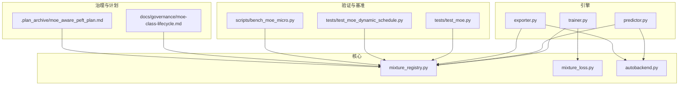
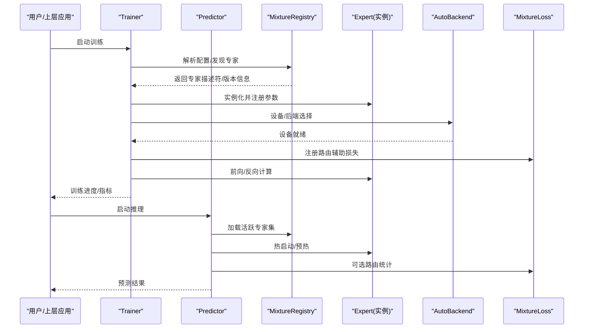
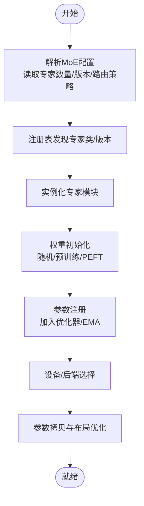
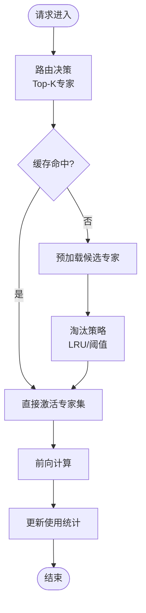
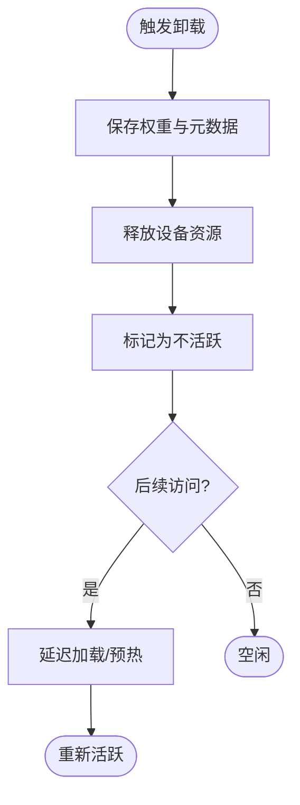
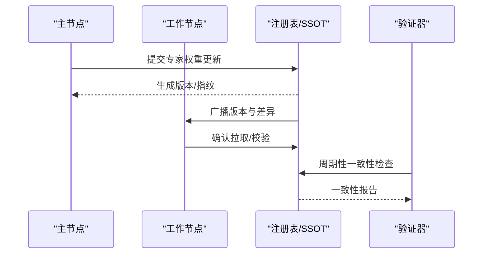
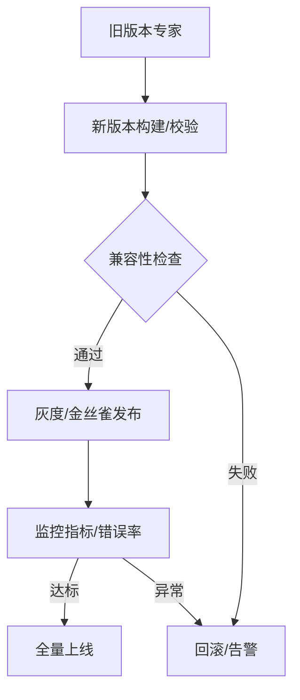
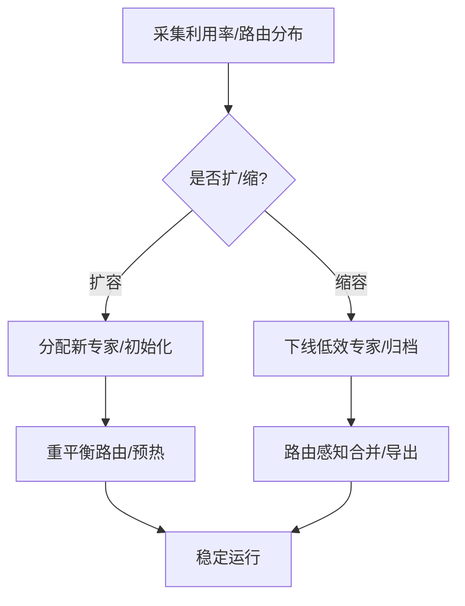
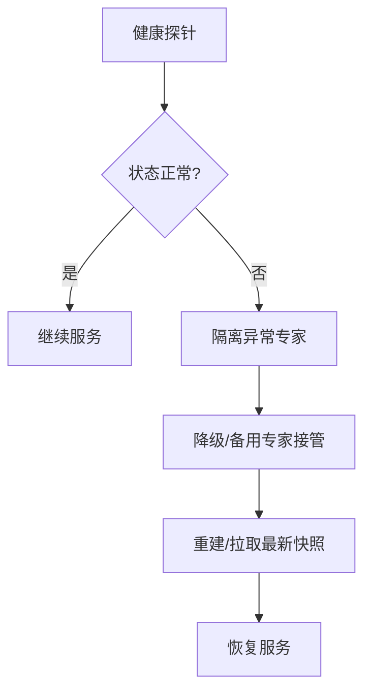
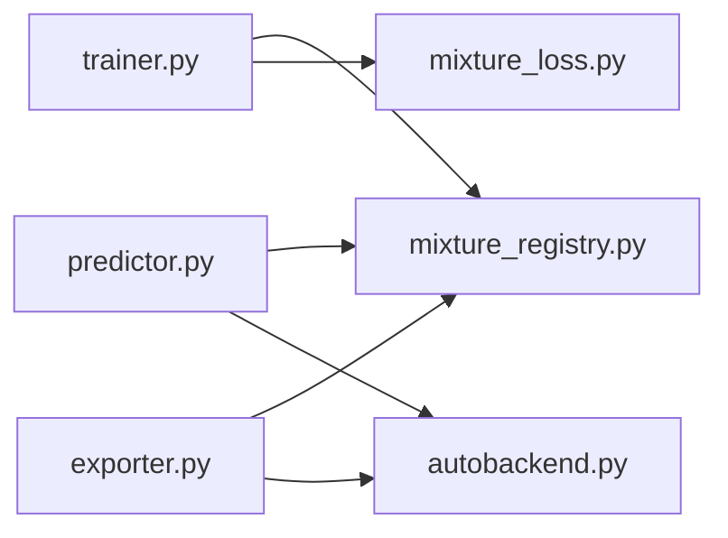

# 专家生命周期管理

<cite>
**本文引用的文件**
- [moe_aware_peft_plan.md](file://.plan_archive/moe_aware_peft_plan.md)
- [mixture_loss.py](file://ultralytics/nn/mixture_loss.py)
- [mixture_registry.py](file://ultralytics/nn/mixture_registry.py)
- [autobackend.py](file://ultralytics/nn/autobackend.py)
- [trainer.py](file://ultralytics/engine/trainer.py)
- [predictor.py](file://ultralytics/engine/predictor.py)
- [exporter.py](file://ultralytics/engine/exporter.py)
- [test_moe.py](file://tests/test_moe.py)
- [test_moe_dynamic_schedule.py](file://tests/test_moe_dynamic_schedule.py)
- [test_moe_ssot.py](file://tests/test_moe_ssot.py)
- [test_moe_validation_collectives.py](file://tests/test_moe_validation_collectives.py)
- [test_molora_routing_aware_merge.py](file://tests/test_molora_routing_aware_merge.py)
- [test_molora_sparse_dispatch.py](file://tests/test_molora_sparse_dispatch.py)
- [bench_moe_micro.py](file://scripts/bench_moe_micro.py)
- [check_moe_ssot.py](file://scripts/check_moe_ssot.py)
- [audit_moe_usage.py](file://scripts/audit_moe_usage.py)
- [moe_pruning_dynamic_schedule.md](file://docs/moe_pruning_dynamic_schedule.md)
- [moe-class-lifecycle.md](file://docs/governance/moe-class-lifecycle.md)
</cite>

## 目录
1. [简介](#简介)
2. [项目结构](#项目结构)
3. [核心组件](#核心组件)
4. [架构总览](#架构总览)
5. [详细组件分析](#详细组件分析)
6. [依赖关系分析](#依赖关系分析)
7. [性能考量](#性能考量)
8. [故障排查指南](#故障排查指南)
9. [结论](#结论)
10. [附录](#附录)

## 简介
本技术文档聚焦于YOLO-Master的MoE（混合专家）“专家生命周期管理”子系统，围绕以下目标展开：
- 专家初始化：权重初始化、参数注册与设备部署
- 热启动机制：预加载策略、内存管理与快速切换
- 冷卸载实现：状态保存、资源释放与延迟加载
- 分布式一致性：多进程/多卡下的状态同步与SSOT（单一事实源）
- 版本管理与兼容性检查：模型升级平滑过渡
- 动态扩缩容：专家池按需扩展与收缩
- 健康检查与故障恢复：异常检测与自愈
- 监控指标与日志：可观测性设计
- 对系统性能与可用性的影响评估

## 项目结构
与专家生命周期相关的代码主要分布在以下位置：
- 核心模块与注册表：ultralytics/nn/mixture_registry.py、ultralytics/nn/mixture_loss.py
- 训练/推理入口：ultralytics/engine/trainer.py、ultralytics/engine/predictor.py、ultralytics/engine/exporter.py
- 自动后端适配：ultralytics/nn/autobackend.py
- 测试与基准：tests/*、scripts/bench_moe_micro.py
- 治理与设计文档：docs/governance/moe-class-lifecycle.md、.plan_archive/moe_aware_peft_plan.md

图表来源
- [mixture_registry.py](file://ultralytics/nn/mixture_registry.py)
- [mixture_loss.py](file://ultralytics/nn/mixture_loss.py)
- [autobackend.py](file://ultralytics/nn/autobackend.py)
- [trainer.py](file://ultralytics/engine/trainer.py)
- [predictor.py](file://ultralytics/engine/predictor.py)
- [exporter.py](file://ultralytics/engine/exporter.py)
- [test_moe.py](file://tests/test_moe.py)
- [test_moe_dynamic_schedule.py](file://tests/test_moe_dynamic_schedule.py)
- [bench_moe_micro.py](file://scripts/bench_moe_micro.py)
- [moe-class-lifecycle.md](file://docs/governance/moe-class-lifecycle.md)
- [moe_aware_peft_plan.md](file://.plan_archive/moe_aware_peft_plan.md)

章节来源
- [moe-class-lifecycle.md](file://docs/governance/moe-class-lifecycle.md)
- [moe_aware_peft_plan.md](file://.plan_archive/moe_aware_peft_plan.md)

## 核心组件
- 专家注册表与发现：负责专家类/版本的注册、查找与选择，支撑动态扩缩容与版本兼容。
- 专家调度与路由：在训练/推理路径中根据路由策略激活相应专家，配合损失辅助项进行负载均衡。
- 设备与后端适配：将专家参数放置到正确设备并选择最优执行后端，保障跨平台一致性与性能。
- 训练/推理集成：在trainer/predictor中完成专家实例化、预热、切换与统计收集。
- 导出与合并：在exporter中处理专家权重导出与路由感知合并，确保部署形态一致。

章节来源
- [mixture_registry.py](file://ultralytics/nn/mixture_registry.py)
- [mixture_loss.py](file://ultralytics/nn/mixture_loss.py)
- [autobackend.py](file://ultralytics/nn/autobackend.py)
- [trainer.py](file://ultralytics/engine/trainer.py)
- [predictor.py](file://ultralytics/engine/predictor.py)
- [exporter.py](file://ultralytics/engine/exporter.py)

## 架构总览
下图展示了从训练/推理入口到专家生命周期关键阶段的调用链与数据流。

图表来源
- [trainer.py](file://ultralytics/engine/trainer.py)
- [predictor.py](file://ultralytics/engine/predictor.py)
- [mixture_registry.py](file://ultralytics/nn/mixture_registry.py)
- [autobackend.py](file://ultralytics/nn/autobackend.py)
- [mixture_loss.py](file://ultralytics/nn/mixture_loss.py)

## 详细组件分析

### 专家初始化流程（权重初始化、参数注册、设备部署）
- 权重初始化：由专家类或注册表提供的初始化策略完成，支持随机/预训练/LoRA等来源。
- 参数注册：在模块构建阶段将专家参数纳入优化器与EMA跟踪。
- 设备部署：通过自动后端选择目标设备（CPU/GPU/NPU），并进行必要的类型转换与内存对齐。

图表来源
- [mixture_registry.py](file://ultralytics/nn/mixture_registry.py)
- [autobackend.py](file://ultralytics/nn/autobackend.py)
- [trainer.py](file://ultralytics/engine/trainer.py)

章节来源
- [mixture_registry.py](file://ultralytics/nn/mixture_registry.py)
- [autobackend.py](file://ultralytics/nn/autobackend.py)
- [trainer.py](file://ultralytics/engine/trainer.py)

### 热启动机制（预加载、内存管理、快速切换）
- 预加载策略：按路由热点或历史使用频率预取候选专家至显存/内存。
- 内存管理：采用LRU/容量上限/分片缓存控制峰值占用，避免OOM。
- 快速切换：保持多份专家权重驻留，基于路由结果零拷贝切换激活集。

图表来源
- [predictor.py](file://ultralytics/engine/predictor.py)
- [mixture_registry.py](file://ultralytics/nn/mixture_registry.py)

章节来源
- [predictor.py](file://ultralytics/engine/predictor.py)
- [mixture_registry.py](file://ultralytics/nn/mixture_registry.py)

### 冷卸载实现（状态保存、资源释放、延迟加载）
- 状态保存：将专家权重与元数据（版本、哈希、路由统计）持久化到磁盘/对象存储。
- 资源释放：从设备移除权重，关闭句柄，清理临时缓冲。
- 延迟加载：按需从持久化介质恢复，结合预取降低首访延迟。

图表来源
- [mixture_registry.py](file://ultralytics/nn/mixture_registry.py)
- [exporter.py](file://ultralytics/engine/exporter.py)

章节来源
- [mixture_registry.py](file://ultralytics/nn/mixture_registry.py)
- [exporter.py](file://ultralytics/engine/exporter.py)

### 分布式一致性（状态同步与SSOT）
- 单一事实源：训练侧维护权威专家状态，其他副本通过集合通信保持一致。
- 校验与修复：定期比对专家权重指纹，不一致时触发拉取/回滚。
- 验证阶段：在多卡环境下对路由与聚合进行端到端校验。

图表来源
- [test_moe_ssot.py](file://tests/test_moe_ssot.py)
- [test_moe_validation_collectives.py](file://tests/test_moe_validation_collectives.py)
- [check_moe_ssot.py](file://scripts/check_moe_ssot.py)

章节来源
- [test_moe_ssot.py](file://tests/test_moe_ssot.py)
- [test_moe_validation_collectives.py](file://tests/test_moe_validation_collectives.py)
- [check_moe_ssot.py](file://scripts/check_moe_ssot.py)

### 版本管理与兼容性检查（平滑升级）
- 版本登记：每次专家权重变更生成版本号与指纹，记录能力矩阵与依赖。
- 兼容性检查：对比新旧版本的路由接口、张量形状、数据类型与导出产物。
- 灰度发布：并行运行新旧版本，逐步切流，失败自动回滚。

图表来源
- [test_molora_routing_aware_merge.py](file://tests/test_molora_routing_aware_merge.py)
- [exporter.py](file://ultralytics/engine/exporter.py)

章节来源
- [test_molora_routing_aware_merge.py](file://tests/test_molora_routing_aware_merge.py)
- [exporter.py](file://ultralytics/engine/exporter.py)

### 动态扩缩容（专家池按需调整）
- 扩容：依据负载/路由Gini系数/利用率阈值新增专家，并初始化权重。
- 缩容：识别低效专家，冻结/剪枝或下线，保留快照以便恢复。
- 调度策略：结合路由感知合并与稀疏分发，减少切换开销。

图表来源
- [test_moe_dynamic_schedule.py](file://tests/test_moe_dynamic_schedule.py)
- [bench_moe_micro.py](file://scripts/bench_moe_micro.py)
- [moe_pruning_dynamic_schedule.md](file://docs/moe_pruning_dynamic_schedule.md)

章节来源
- [test_moe_dynamic_schedule.py](file://tests/test_moe_dynamic_schedule.py)
- [bench_moe_micro.py](file://scripts/bench_moe_micro.py)
- [moe_pruning_dynamic_schedule.md](file://docs/moe_pruning_dynamic_schedule.md)

### 健康检查与故障恢复
- 健康探针：定期检查专家可调用性、数值稳定性（NaN/Inf）、路由收敛性。
- 自愈策略：异常专家隔离、降级路由、自动替换与重建。
- 审计追踪：记录专家使用轨迹与异常事件，便于定位根因。

图表来源
- [audit_moe_usage.py](file://scripts/audit_moe_usage.py)
- [test_moe.py](file://tests/test_moe.py)

章节来源
- [audit_moe_usage.py](file://scripts/audit_moe_usage.py)
- [test_moe.py](file://tests/test_moe.py)

### 监控指标与日志记录
- 关键指标：专家激活率、路由熵、吞吐/延迟、显存占用、一致性校验通过率。
- 日志维度：请求级路由决策、专家加载/卸载事件、异常堆栈与诊断上下文。
- 可视化：结合基准脚本与审计工具输出，形成仪表盘。

章节来源
- [bench_moe_micro.py](file://scripts/bench_moe_micro.py)
- [audit_moe_usage.py](file://scripts/audit_moe_usage.py)
- [test_moe.py](file://tests/test_moe.py)

## 依赖关系分析
- 组件耦合：
  - trainer/predictor依赖注册表进行专家发现与选择；
  - autobackend提供设备/后端抽象，被推理与导出复用；
  - mixture_loss提供路由辅助损失，参与训练优化。
- 外部依赖：
  - 分布式通信（DDP/集合操作）用于一致性校验与广播；
  - 存储介质用于专家快照与灰度发布。

图表来源
- [trainer.py](file://ultralytics/engine/trainer.py)
- [predictor.py](file://ultralytics/engine/predictor.py)
- [exporter.py](file://ultralytics/engine/exporter.py)
- [mixture_registry.py](file://ultralytics/nn/mixture_registry.py)
- [mixture_loss.py](file://ultralytics/nn/mixture_loss.py)
- [autobackend.py](file://ultralytics/nn/autobackend.py)

章节来源
- [trainer.py](file://ultralytics/engine/trainer.py)
- [predictor.py](file://ultralytics/engine/predictor.py)
- [exporter.py](file://ultralytics/engine/exporter.py)
- [mixture_registry.py](file://ultralytics/nn/mixture_registry.py)
- [mixture_loss.py](file://ultralytics/nn/mixture_loss.py)
- [autobackend.py](file://ultralytics/nn/autobackend.py)

## 性能考量
- 热启动与缓存命中率直接影响首帧延迟与吞吐；建议结合路由热点与批大小调优。
- 动态扩缩容引入的预热/合并成本需与收益权衡，建议在低峰期执行。
- 分布式一致性校验会带来额外通信开销，应控制频率与粒度。
- 导出与路由感知合并可能改变算子图，需回归验证精度与延迟。

[本节为通用指导，无需特定文件引用]

## 故障排查指南
- 常见问题
  - 专家未激活/路由为空：检查路由阈值与Top-K设置、缓存命中与预取策略。
  - 显存溢出：限制并发专家数、启用分片缓存与淘汰策略。
  - 一致性不一致：核对版本指纹、网络连通性与集合通信配置。
  - 导出后精度下降：确认路由感知合并与量化/格式转换步骤。
- 定位手段
  - 使用审计脚本查看专家使用轨迹与异常事件。
  - 使用基准脚本复现延迟/吞吐问题，定位瓶颈。
  - 开启更细粒度的日志与指标上报。

章节来源
- [audit_moe_usage.py](file://scripts/audit_moe_usage.py)
- [bench_moe_micro.py](file://scripts/bench_moe_micro.py)
- [test_moe.py](file://tests/test_moe.py)

## 结论
通过注册表驱动的生命周期管理、热/冷态切换、分布式一致性、版本兼容与动态扩缩容，YOLO-Master的MoE子系统能够在保证精度的同时提升资源利用与可用性。合理的监控与故障恢复机制进一步增强了系统的鲁棒性。

[本节为总结，无需特定文件引用]

## 附录
- 相关设计与治理文档
  - [moe-class-lifecycle.md](file://docs/governance/moe-class-lifecycle.md)
  - [moe_aware_peft_plan.md](file://.plan_archive/moe_aware_peft_plan.md)
  - [moe_pruning_dynamic_schedule.md](file://docs/moe_pruning_dynamic_schedule.md)

章节来源
- [moe-class-lifecycle.md](file://docs/governance/moe-class-lifecycle.md)
- [moe_aware_peft_plan.md](file://.plan_archive/moe_aware_peft_plan.md)
- [moe_pruning_dynamic_schedule.md](file://docs/moe_pruning_dynamic_schedule.md)