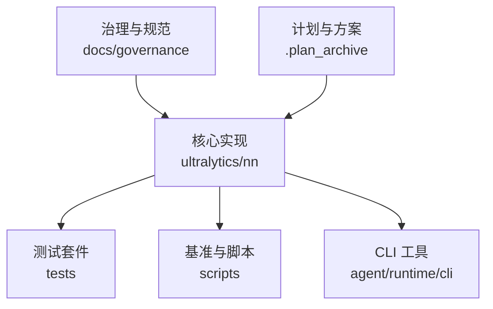
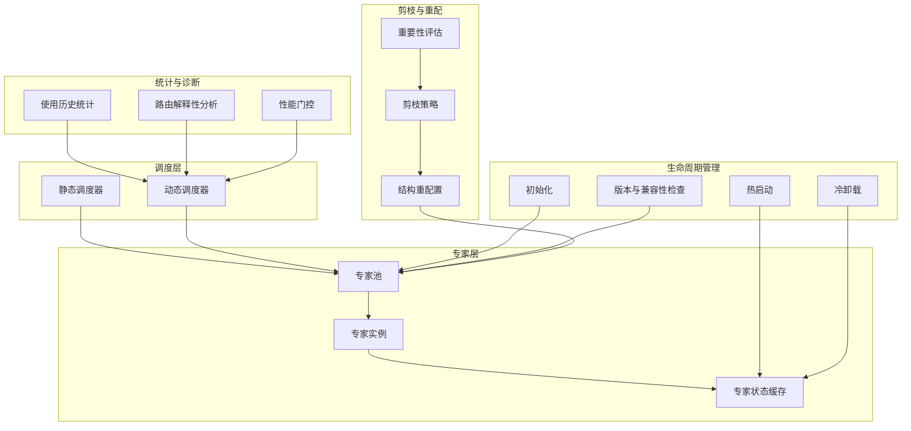
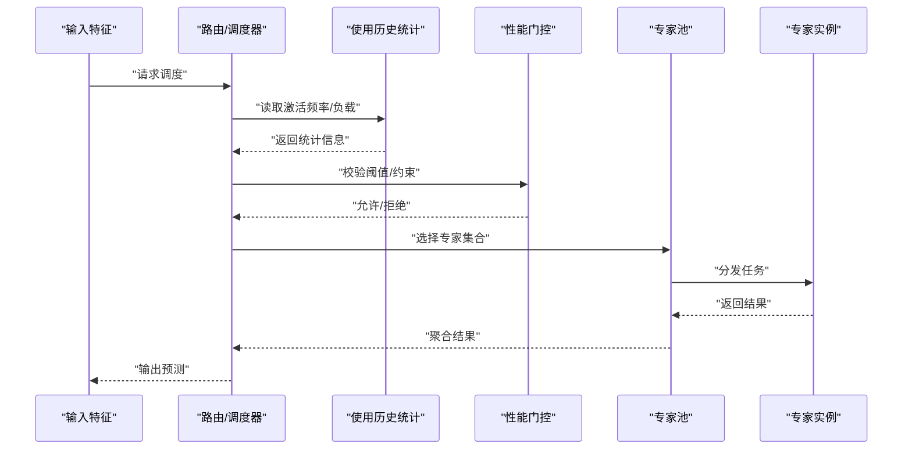
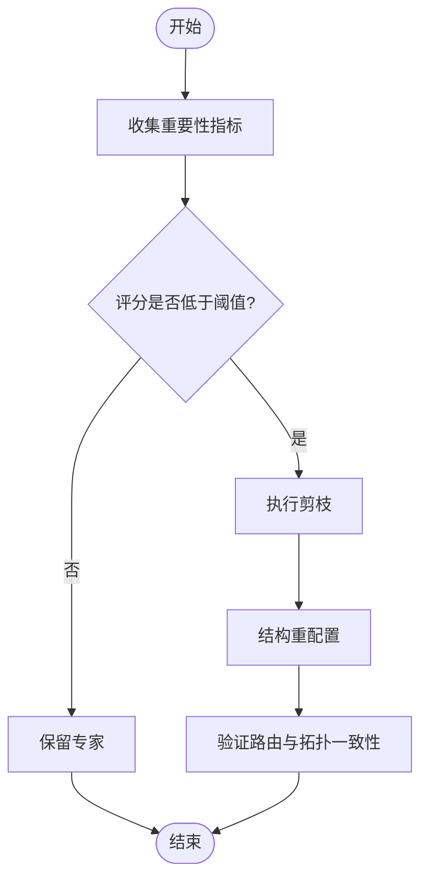
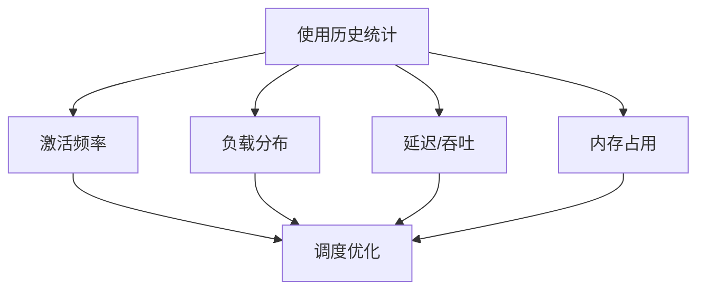
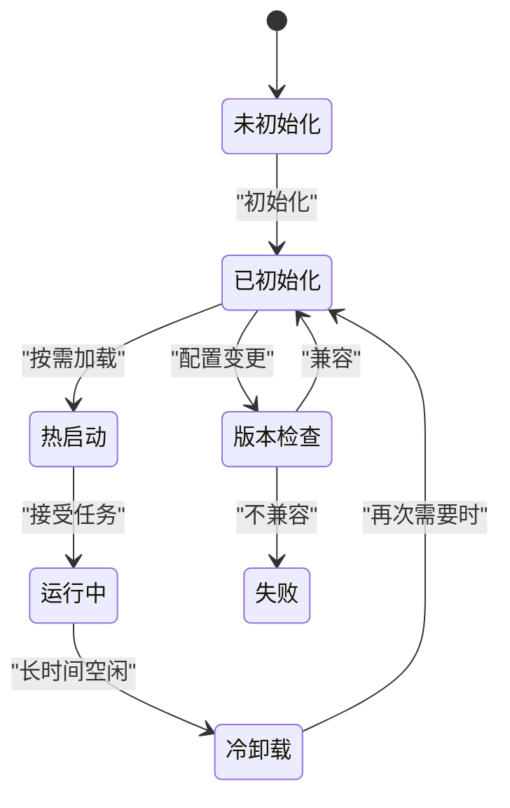
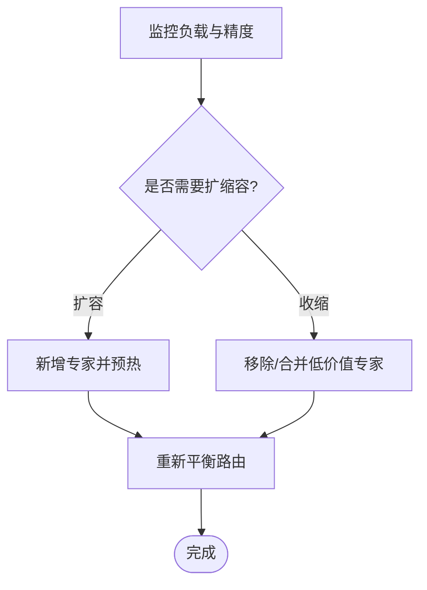
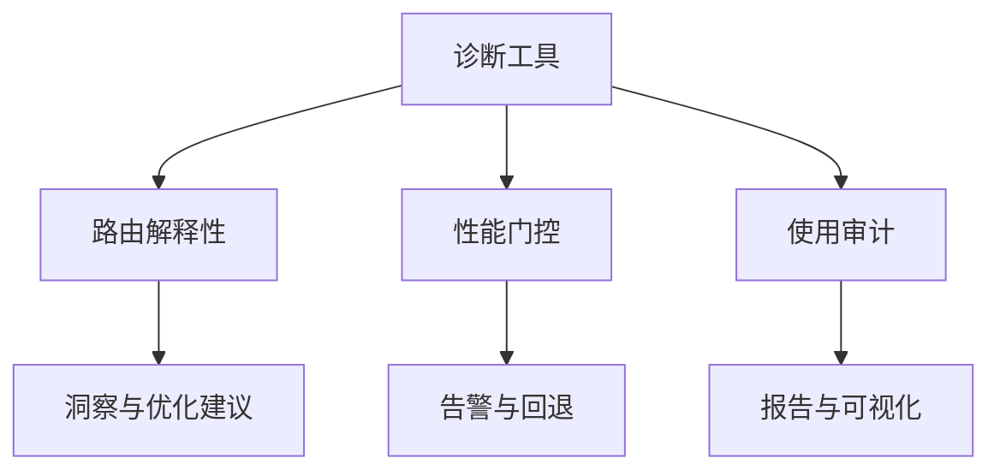
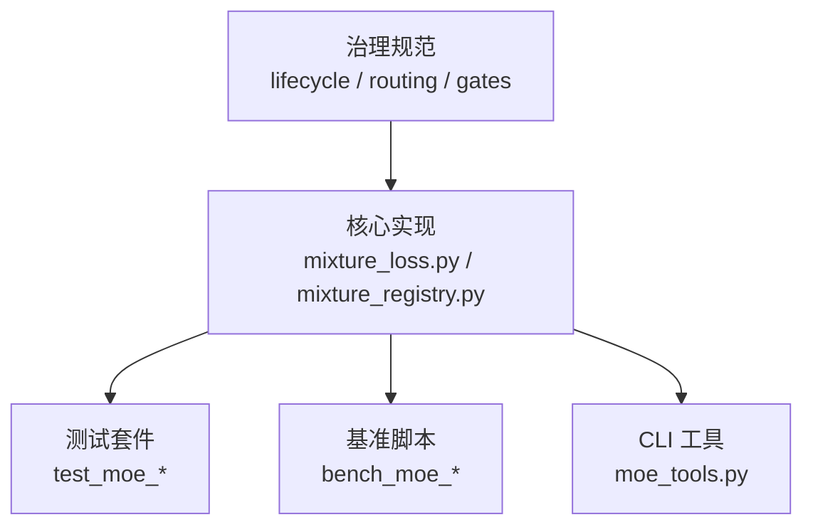

# 专家管理与调度

<cite>
**本文引用的文件**
- [moe_pruning_dynamic_schedule.md](file://docs/moe_pruning_dynamic_schedule.md)
- [mixture_loss.py](file://ultralytics/nn/mixture_loss.py)
- [mixture_registry.py](file://ultralytics/nn/mixture_registry.py)
- [test_moe_dynamic_schedule.py](file://tests/test_moe_dynamic_schedule.py)
- [test_moe_dynamic_scheduler.py](file://tests/test_moe_dynamic_scheduler.py)
- [test_moe_usage_audit.py](file://tests/test_moe_usage_audit.py)
- [bench_moe_micro.py](file://scripts/bench_moe_micro.py)
- [bench_moe_mps.py](file://scripts/bench_moe_mps.py)
- [audit_moe_usage.py](file://scripts/audit_moe_usage.py)
- [moe_tools.py](file://agent/runtime/cli/moe_tools.py)
- [moe_aware_peft_plan.md](file://.plan_archive/moe_aware_peft_plan.md)
- [moe-class-lifecycle.md](file://docs/governance/moe-class-lifecycle.md)
- [routing-interpretability.md](file://docs/governance/routing-interpretability.md)
- [performance-gates.md](file://docs/governance/performance-gates.md)
</cite>

## 目录
1. [简介](#简介)
2. [项目结构](#项目结构)
3. [核心组件](#核心组件)
4. [架构总览](#架构总览)
5. [详细组件分析](#详细组件分析)
6. [依赖关系分析](#依赖关系分析)
7. [性能考量](#性能考量)
8. [故障排除指南](#故障排除指南)
9. [结论](#结论)
10. [附录](#附录)

## 简介
本技术文档聚焦于YOLO-Master的MoE（Mixture of Experts）专家管理与调度系统，围绕以下目标展开：
- 专家调度器设计原理与策略：静态调度与动态调度
- 专家剪枝机制：重要性评估、剪枝策略与结构重配置
- 专家使用历史统计与分析工具：激活频率与性能指标收集
- 专家生命周期管理：初始化、热启动与冷卸载
- 专家配置的版本管理与兼容性检查
- 专家池的动态扩展与收缩
- 专家管理的API接口与使用示例
- 监控与诊断工具
- 调度对训练效率与推理性能的影响
- 最佳实践与故障排除

## 项目结构
与专家管理与调度相关的代码与文档主要分布在如下位置：
- 设计与治理文档：docs/governance 下的 MoE 相关规范
- 核心实现：ultralytics/nn 下的混合模型损失与注册表
- 测试用例：tests 下覆盖动态调度、使用审计等
- 基准与脚本：scripts 下提供微基准、MPS 基准与使用审计
- CLI 工具：agent/runtime/cli/moe_tools.py 提供专家管理工具
- 计划与方案：.plan_archive 中的 MoE-aware PEFT 规划

图表来源
- [moe-pruning-dynamic-schedule.md](file://docs/moe_pruning_dynamic_schedule.md)
- [mixture_loss.py](file://ultralytics/nn/mixture_loss.py)
- [mixture_registry.py](file://ultralytics/nn/mixture_registry.py)
- [test_moe_dynamic_schedule.py](file://tests/test_moe_dynamic_schedule.py)
- [test_moe_dynamic_scheduler.py](file://tests/test_moe_dynamic_scheduler.py)
- [test_moe_usage_audit.py](file://tests/test_moe_usage_audit.py)
- [bench_moe_micro.py](file://scripts/bench_moe_micro.py)
- [bench_moe_mps.py](file://scripts/bench_moe_mps.py)
- [audit_moe_usage.py](file://scripts/audit_moe_usage.py)
- [moe_tools.py](file://agent/runtime/cli/moe_tools.py)
- [moe_aware_peft_plan.md](file://.plan_archive/moe_aware_peft_plan.md)

章节来源
- [moe_pruning_dynamic_schedule.md](file://docs/moe_pruning_dynamic_schedule.md)
- [mixture_loss.py](file://ultralytics/nn/mixture_loss.py)
- [mixture_registry.py](file://ultralytics/nn/mixture_registry.py)
- [test_moe_dynamic_schedule.py](file://tests/test_moe_dynamic_schedule.py)
- [test_moe_dynamic_scheduler.py](file://tests/test_moe_dynamic_scheduler.py)
- [test_moe_usage_audit.py](file://tests/test_moe_usage_audit.py)
- [bench_moe_micro.py](file://scripts/bench_moe_micro.py)
- [bench_moe_mps.py](file://scripts/bench_moe_mps.py)
- [audit_moe_usage.py](file://scripts/audit_moe_usage.py)
- [moe_tools.py](file://agent/runtime/cli/moe_tools.py)
- [moe_aware_peft_plan.md](file://.plan_archive/moe_aware_peft_plan.md)

## 核心组件
- 专家调度器
  - 负责在训练与推理阶段根据输入特征选择专家子集，支持静态与动态两种策略。
  - 动态调度通常基于路由权重或在线统计进行自适应选择；静态调度则依据预定义规则或离线分析结果固定映射。
- 专家剪枝模块
  - 通过重要性评估（如激活贡献、梯度幅度、路由权重分布）识别低价值专家，执行剪枝并触发结构重配置以维持计算图一致性。
- 使用历史统计与分析
  - 采集专家激活频率、负载分布、延迟与吞吐等指标，用于指导调度与剪枝决策。
- 生命周期管理
  - 涵盖专家初始化、热启动（按需加载到显存）、冷卸载（从显存释放），以及状态持久化与恢复。
- 配置版本管理与兼容性检查
  - 确保不同版本的专家配置、路由策略与网络拓扑兼容，避免运行时错误。
- 专家池动态扩缩容
  - 根据负载与任务需求动态增加或减少专家数量，保持整体容量与精度平衡。
- API 与工具
  - 提供面向用户的API与CLI工具，便于集成到训练/推理流水线与运维流程中。
- 监控与诊断
  - 内置路由解释性分析与性能门控，辅助定位瓶颈与异常。

章节来源
- [moe_pruning_dynamic_schedule.md](file://docs/moe_pruning_dynamic_schedule.md)
- [moe-class-lifecycle.md](file://docs/governance/moe-class-lifecycle.md)
- [routing-interpretability.md](file://docs/governance/routing-interpretability.md)
- [performance-gates.md](file://docs/governance/performance-gates.md)

## 架构总览
下图展示了专家管理与调度的关键子系统及其交互关系。

图表来源
- [moe_pruning_dynamic_schedule.md](file://docs/moe_pruning_dynamic_schedule.md)
- [moe-class-lifecycle.md](file://docs/governance/moe-class-lifecycle.md)
- [routing-interpretability.md](file://docs/governance/routing-interpretability.md)
- [performance-gates.md](file://docs/governance/performance-gates.md)

## 详细组件分析

### 专家调度器（静态与动态）
- 设计要点
  - 静态调度：基于离线分析或固定策略将输入映射到特定专家集合，降低运行时开销，适合稳定场景。
  - 动态调度：根据在线统计（如激活频率、路由权重）实时选择专家，提升资源利用率与泛化能力。
- 关键流程
  - 输入特征进入调度器，计算路由分数或匹配规则，生成专家索引与权重。
  - 若启用动态策略，结合历史统计与性能门控调整选择阈值与负载均衡。
  - 输出专家调用指令，交由专家池执行。

图表来源
- [test_moe_dynamic_schedule.py](file://tests/test_moe_dynamic_schedule.py)
- [test_moe_dynamic_scheduler.py](file://tests/test_moe_dynamic_scheduler.py)
- [routing-interpretability.md](file://docs/governance/routing-interpretability.md)
- [performance-gates.md](file://docs/governance/performance-gates.md)

章节来源
- [test_moe_dynamic_schedule.py](file://tests/test_moe_dynamic_schedule.py)
- [test_moe_dynamic_scheduler.py](file://tests/test_moe_dynamic_scheduler.py)
- [routing-interpretability.md](file://docs/governance/routing-interpretability.md)
- [performance-gates.md](file://docs/governance/performance-gates.md)

### 专家剪枝机制（重要性评估、剪枝策略、结构重配置）
- 重要性评估
  - 基于路由权重分布、激活贡献度、梯度幅度等多维度指标量化专家价值。
- 剪枝策略
  - 按阈值或Top-K比例移除低价值专家，同时考虑类别/任务均衡与容量下限。
- 结构重配置
  - 更新路由映射与专家索引，重新构建计算图，确保训练/推理一致性。

图表来源
- [moe_pruning_dynamic_schedule.md](file://docs/moe_pruning_dynamic_schedule.md)

章节来源
- [moe_pruning_dynamic_schedule.md](file://docs/moe_pruning_dynamic_schedule.md)

### 使用历史统计与分析工具
- 指标采集
  - 专家激活频率、负载分布、延迟、吞吐、内存占用等。
- 分析用途
  - 指导动态调度参数调优、剪枝阈值设定与容量规划。
- 工具与脚本
  - 提供审计脚本与基准脚本，便于批量分析与可视化。

图表来源
- [test_moe_usage_audit.py](file://tests/test_moe_usage_audit.py)
- [audit_moe_usage.py](file://scripts/audit_moe_usage.py)
- [bench_moe_micro.py](file://scripts/bench_moe_micro.py)
- [bench_moe_mps.py](file://scripts/bench_moe_mps.py)

章节来源
- [test_moe_usage_audit.py](file://tests/test_moe_usage_audit.py)
- [audit_moe_usage.py](file://scripts/audit_moe_usage.py)
- [bench_moe_micro.py](file://scripts/bench_moe_micro.py)
- [bench_moe_mps.py](file://scripts/bench_moe_mps.py)

### 专家生命周期管理（初始化、热启动、冷卸载、版本与兼容性）
- 初始化
  - 创建专家实例、分配设备、加载权重与路由映射。
- 热启动
  - 按需将专家加载至显存，支持并发访问与快速切换。
- 冷卸载
  - 长时间不用的专家从显存释放，降低峰值内存占用。
- 版本与兼容性检查
  - 校验专家配置、路由策略与网络拓扑的版本一致性，防止运行时错误。

图表来源
- [moe-class-lifecycle.md](file://docs/governance/moe-class-lifecycle.md)

章节来源
- [moe-class-lifecycle.md](file://docs/governance/moe-class-lifecycle.md)

### 专家池的动态扩展与收缩
- 扩展
  - 当负载升高或精度下降时，动态添加新专家，并进行预热与校准。
- 收缩
  - 当负载降低或存在冗余专家时，合并或移除低价值专家，释放资源。
- 约束
  - 保证容量下限、负载均衡与路由一致性。

图表来源
- [moe_pruning_dynamic_schedule.md](file://docs/moe_pruning_dynamic_schedule.md)

章节来源
- [moe_pruning_dynamic_schedule.md](file://docs/moe_pruning_dynamic_schedule.md)

### API 接口与使用示例
- 典型API
  - 调度控制：设置静态/动态策略、阈值与负载均衡参数
  - 生命周期：初始化、热启动、冷卸载、状态保存/恢复
  - 剪枝与重配：执行剪枝、重建路由映射
  - 统计与诊断：导出使用历史、路由解释性报告
- 使用示例
  - 在训练前配置调度策略与阈值
  - 在推理路径中启用动态调度与热启动
  - 定期运行审计脚本，生成分析报告
  - 基于性能门控自动调整调度参数

章节来源
- [moe_tools.py](file://agent/runtime/cli/moe_tools.py)
- [moe_aware_peft_plan.md](file://.plan_archive/moe_aware_peft_plan.md)

### 监控与诊断工具
- 路由解释性分析
  - 可视化路由权重与专家选择路径，帮助理解调度行为。
- 性能门控
  - 基于延迟、吞吐与内存阈值触发告警与回退策略。
- 审计与基准
  - 提供使用审计与微基准脚本，支撑持续优化。

图表来源
- [routing-interpretability.md](file://docs/governance/routing-interpretability.md)
- [performance-gates.md](file://docs/governance/performance-gates.md)
- [audit_moe_usage.py](file://scripts/audit_moe_usage.py)

章节来源
- [routing-interpretability.md](file://docs/governance/routing-interpretability.md)
- [performance-gates.md](file://docs/governance/performance-gates.md)
- [audit_moe_usage.py](file://scripts/audit_moe_usage.py)

## 依赖关系分析
- 核心依赖
  - 混合模型损失与注册表为MoE模块提供基础支持与统一接口。
- 测试与基准
  - 测试覆盖动态调度与使用审计，基准脚本提供性能评估能力。
- 治理与规范
  - 治理文档定义了生命周期、路由解释性与性能门控的要求。

图表来源
- [mixture_loss.py](file://ultralytics/nn/mixture_loss.py)
- [mixture_registry.py](file://ultralytics/nn/mixture_registry.py)
- [test_moe_dynamic_schedule.py](file://tests/test_moe_dynamic_schedule.py)
- [test_moe_dynamic_scheduler.py](file://tests/test_moe_dynamic_scheduler.py)
- [test_moe_usage_audit.py](file://tests/test_moe_usage_audit.py)
- [bench_moe_micro.py](file://scripts/bench_moe_micro.py)
- [bench_moe_mps.py](file://scripts/bench_moe_mps.py)
- [moe_tools.py](file://agent/runtime/cli/moe_tools.py)
- [moe-class-lifecycle.md](file://docs/governance/moe-class-lifecycle.md)
- [routing-interpretability.md](file://docs/governance/routing-interpretability.md)
- [performance-gates.md](file://docs/governance/performance-gates.md)

章节来源
- [mixture_loss.py](file://ultralytics/nn/mixture_loss.py)
- [mixture_registry.py](file://ultralytics/nn/mixture_registry.py)
- [test_moe_dynamic_schedule.py](file://tests/test_moe_dynamic_schedule.py)
- [test_moe_dynamic_scheduler.py](file://tests/test_moe_dynamic_scheduler.py)
- [test_moe_usage_audit.py](file://tests/test_moe_usage_audit.py)
- [bench_moe_micro.py](file://scripts/bench_moe_micro.py)
- [bench_moe_mps.py](file://scripts/bench_moe_mps.py)
- [moe_tools.py](file://agent/runtime/cli/moe_tools.py)
- [moe-class-lifecycle.md](file://docs/governance/moe-class-lifecycle.md)
- [routing-interpretability.md](file://docs/governance/routing-interpretability.md)
- [performance-gates.md](file://docs/governance/performance-gates.md)

## 性能考量
- 训练效率
  - 动态调度可提升并行度与负载均衡，但需权衡路由计算开销。
  - 剪枝可减少计算量，但可能影响精度，需配合重要性评估与重配置。
- 推理性能
  - 热启动与专家池缓存可降低首帧延迟，冷卸载有助于控制峰值内存。
  - 性能门控可在高负载时降级策略，保障稳定性。
- 资源利用
  - 通过使用历史统计与路由解释性分析，优化专家容量与调度阈值。

[本节为通用指导，无需具体文件引用]

## 故障排除指南
- 常见问题
  - 路由不稳定：检查路由解释性报告与性能门控阈值，必要时回退到静态调度。
  - 显存不足：启用冷卸载与按需热启动，调整专家池大小与批大小。
  - 精度下降：审查剪枝阈值与重要性评估指标，逐步放宽剪枝比例。
  - 版本不兼容：执行版本与兼容性检查，确保配置与拓扑一致。
- 诊断步骤
  - 运行使用审计脚本，导出激活频率与负载分布。
  - 查看路由解释性报告，定位热点专家与长尾问题。
  - 使用微基准与MPS基准评估不同策略的性能差异。

章节来源
- [routing-interpretability.md](file://docs/governance/routing-interpretability.md)
- [performance-gates.md](file://docs/governance/performance-gates.md)
- [audit_moe_usage.py](file://scripts/audit_moe_usage.py)
- [bench_moe_micro.py](file://scripts/bench_moe_micro.py)
- [bench_moe_mps.py](file://scripts/bench_moe_mps.py)

## 结论
YOLO-Master的MoE专家管理与调度系统通过静态与动态调度、剪枝与重配置、生命周期管理与监控诊断，实现了高效且可扩展的专家生态。合理配置调度策略与阈值、持续监控与优化，能够在训练与推理阶段取得更好的性能与资源利用效果。

[本节为总结，无需具体文件引用]

## 附录
- 最佳实践
  - 先静态后动态：在稳定场景优先使用静态调度，再逐步引入动态策略。
  - 渐进式剪枝：从小比例剪枝开始，结合重要性评估与精度验证逐步推进。
  - 定期审计：周期性运行审计与基准脚本，跟踪指标变化并调整策略。
  - 版本治理：严格进行版本与兼容性检查，避免运行时不一致。
- 参考文档与计划
  - MoE-aware PEFT 规划与治理规范提供了更深入的策略与约束说明。

章节来源
- [moe_aware_peft_plan.md](file://.plan_archive/moe_aware_peft_plan.md)
- [moe-class-lifecycle.md](file://docs/governance/moe-class-lifecycle.md)
- [routing-interpretability.md](file://docs/governance/routing-interpretability.md)
- [performance-gates.md](file://docs/governance/performance-gates.md)