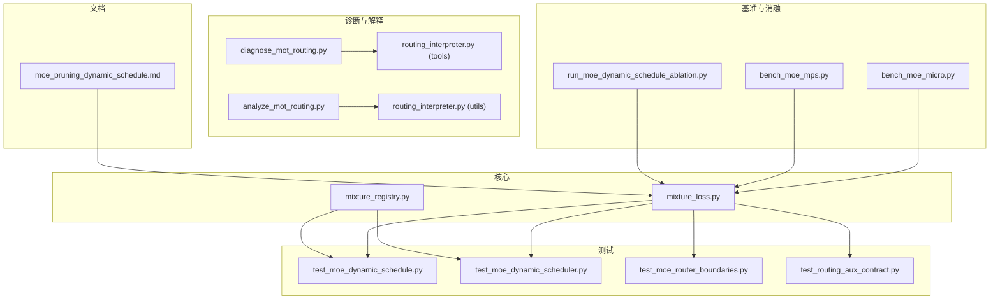
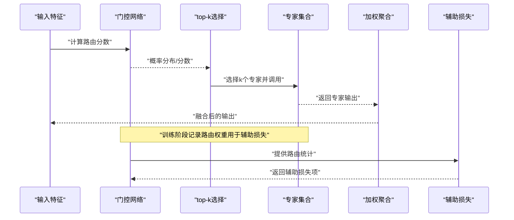
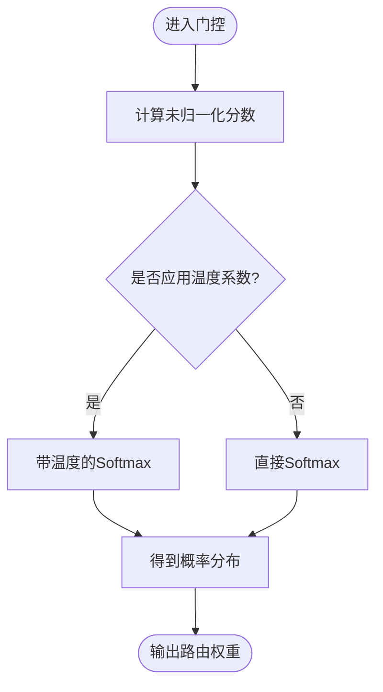
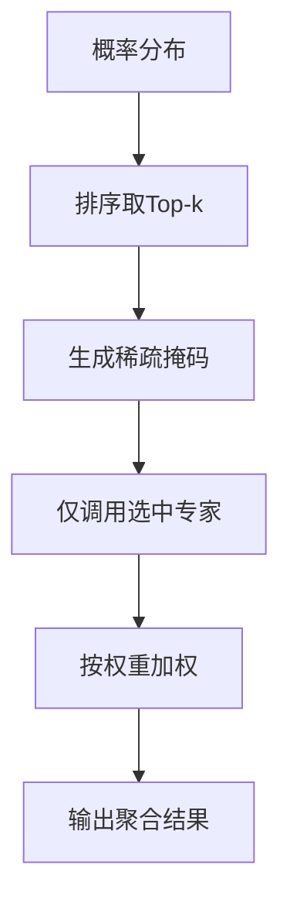
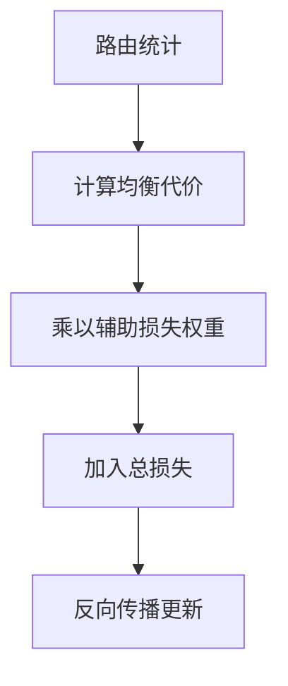
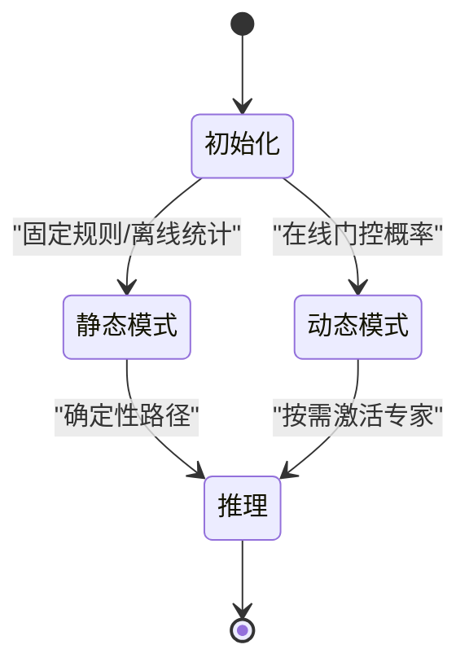
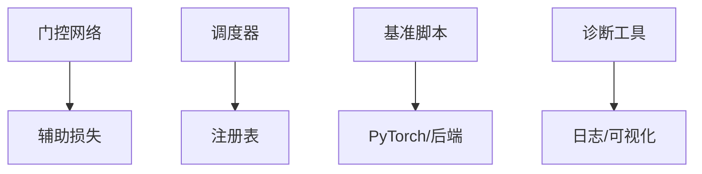

# 专家调度器

<cite>
**本文引用的文件**
- [mixture_loss.py](file://ultralytics/nn/mixture_loss.py)
- [mixture_registry.py](file://ultralytics/nn/mixture_registry.py)
- [test_moe_dynamic_schedule.py](file://tests/test_moe_dynamic_schedule.py)
- [test_moe_dynamic_scheduler.py](file://tests/test_moe_dynamic_scheduler.py)
- [test_moe_router_boundaries.py](file://tests/test_moe_router_boundaries.py)
- [test_routing_aux_contract.py](file://tests/test_routing_aux_contract.py)
- [bench_moe_micro.py](file://scripts/bench_moe_micro.py)
- [bench_moe_mps.py](file://scripts/bench_moe_mps.py)
- [run_moe_dynamic_schedule_ablation.py](file://scripts/run_moe_dynamic_schedule_ablation.py)
- [diagnose_mot_routing.py](file://scripts/diagnose_mot_routing.py)
- [analyze_mot_routing.py](file://scripts/analyze_mot_routing.py)
- [routing_interpreter.py](file://tools/routing_interpreter.py)
- [routing_interpreter.py](file://ultralytics/utils/routing_interpreter.py)
- [moe_pruning_dynamic_schedule.md](file://docs/moe_pruning_dynamic_schedule.md)
</cite>

## 目录
1. [简介](#简介)
2. [项目结构](#项目结构)
3. [核心组件](#核心组件)
4. [架构总览](#架构总览)
5. [详细组件分析](#详细组件分析)
6. [依赖关系分析](#依赖关系分析)
7. [性能考量](#性能考量)
8. [故障排查指南](#故障排查指南)
9. [结论](#结论)
10. [附录](#附录)

## 简介
本技术文档聚焦于YOLO-Master的MoE（混合专家）专家调度器，系统阐述静态与动态调度策略的实现原理、门控网络设计、基于路由权重的专家选择算法、负载均衡机制与辅助损失。文档同时覆盖训练与推理阶段的行为差异、配置参数（top-k、辅助损失权重、温度系数）、性能优化（专家预加载、缓存、并行处理）、API接口与使用示例、监控指标与调试工具，以及调度策略对模型性能与训练稳定性的影响和最佳实践建议。

## 项目结构
围绕MoE调度器的关键代码与资源分布如下：
- 核心实现与注册表
  - 混合损失与路由辅助损失：[mixture_loss.py](file://ultralytics/nn/mixture_loss.py)
  - 混合模块注册表与契约：[mixture_registry.py](file://ultralytics/nn/mixture_registry.py)
- 测试与验证
  - 动态调度与边界约束：[test_moe_dynamic_schedule.py](file://tests/test_moe_dynamic_schedule.py)、[test_moe_dynamic_scheduler.py](file://tests/test_moe_dynamic_scheduler.py)、[test_moe_router_boundaries.py](file://tests/test_moe_router_boundaries.py)
  - 路由辅助损失契约：[test_routing_aux_contract.py](file://tests/test_routing_aux_contract.py)
- 基准与消融
  - 微基准与MPS平台基准：[bench_moe_micro.py](file://scripts/bench_moe_micro.py)、[bench_moe_mps.py](file://scripts/bench_moe_mps.py)
  - 动态调度消融脚本：[run_moe_dynamic_schedule_ablation.py](file://scripts/run_moe_dynamic_schedule_ablation.py)
- 诊断与解释
  - MOT场景路由诊断与分析：[diagnose_mot_routing.py](file://scripts/diagnose_mot_routing.py)、[analyze_mot_routing.py](file://scripts/analyze_mot_routing.py)
  - 路由解释器（工具与运行时）：[routing_interpreter.py](file://tools/routing_interpreter.py)、[routing_interpreter.py](file://ultralytics/utils/routing_interpreter.py)
- 文档
  - 动态调度与剪枝说明：[moe_pruning_dynamic_schedule.md](file://docs/moe_pruning_dynamic_schedule.md)

**图表来源**
- [mixture_loss.py](file://ultralytics/nn/mixture_loss.py)
- [mixture_registry.py](file://ultralytics/nn/mixture_registry.py)
- [test_moe_dynamic_schedule.py](file://tests/test_moe_dynamic_schedule.py)
- [test_moe_dynamic_scheduler.py](file://tests/test_moe_dynamic_scheduler.py)
- [test_moe_router_boundaries.py](file://tests/test_moe_router_boundaries.py)
- [test_routing_aux_contract.py](file://tests/test_routing_aux_contract.py)
- [bench_moe_micro.py](file://scripts/bench_moe_micro.py)
- [bench_moe_mps.py](file://scripts/bench_moe_mps.py)
- [run_moe_dynamic_schedule_ablation.py](file://scripts/run_moe_dynamic_schedule_ablation.py)
- [diagnose_mot_routing.py](file://scripts/diagnose_mot_routing.py)
- [analyze_mot_routing.py](file://scripts/analyze_mot_routing.py)
- [routing_interpreter.py](file://tools/routing_interpreter.py)
- [routing_interpreter.py](file://ultralytics/utils/routing_interpreter.py)
- [moe_pruning_dynamic_schedule.md](file://docs/moe_pruning_dynamic_schedule.md)

**章节来源**
- [mixture_loss.py](file://ultralytics/nn/mixture_loss.py)
- [mixture_registry.py](file://ultralytics/nn/mixture_registry.py)
- [test_moe_dynamic_schedule.py](file://tests/test_moe_dynamic_schedule.py)
- [test_moe_dynamic_scheduler.py](file://tests/test_moe_dynamic_scheduler.py)
- [test_moe_router_boundaries.py](file://tests/test_moe_router_boundaries.py)
- [test_routing_aux_contract.py](file://tests/test_routing_aux_contract.py)
- [bench_moe_micro.py](file://scripts/bench_moe_micro.py)
- [bench_moe_mps.py](file://scripts/bench_moe_mps.py)
- [run_moe_dynamic_schedule_ablation.py](file://scripts/run_moe_dynamic_schedule_ablation.py)
- [diagnose_mot_routing.py](file://scripts/diagnose_mot_routing.py)
- [analyze_mot_routing.py](file://scripts/analyze_mot_routing.py)
- [routing_interpreter.py](file://tools/routing_interpreter.py)
- [routing_interpreter.py](file://ultralytics/utils/routing_interpreter.py)
- [moe_pruning_dynamic_schedule.md](file://docs/moe_pruning_dynamic_schedule.md)

## 核心组件
- 路由与门控网络
  - 负责将输入特征映射到专家概率分布，支持温度系数调节选择锐度。
  - 在训练时输出软路由权重；在推理时可切换为硬选择或近似硬选择以提升吞吐。
- 专家选择与聚合
  - top-k选择策略：从门控概率中选择k个专家进行计算并加权求和。
  - 稀疏激活：仅激活被选中的专家，降低计算量。
- 负载均衡与辅助损失
  - 通过辅助损失鼓励各专家均匀使用，避免“专家坍缩”。
  - 辅助损失权重可配置，以平衡主任务损失与均衡目标。
- 静态与动态调度
  - 静态调度：按固定规则或离线统计分配专家，适合部署期确定性路径。
  - 动态调度：在线根据输入特征的门控概率选择专家，灵活适配数据分布变化。
- 注册与契约
  - 通过注册表管理不同MoE变体与路由策略，确保训练/推理一致性与可扩展性。

**章节来源**
- [mixture_loss.py](file://ultralytics/nn/mixture_loss.py)
- [mixture_registry.py](file://ultralytics/nn/mixture_registry.py)
- [test_moe_dynamic_schedule.py](file://tests/test_moe_dynamic_schedule.py)
- [test_moe_dynamic_scheduler.py](file://tests/test_moe_dynamic_scheduler.py)
- [test_moe_router_boundaries.py](file://tests/test_moe_router_boundaries.py)
- [test_routing_aux_contract.py](file://tests/test_routing_aux_contract.py)

## 架构总览
下图展示调度器在训练与推理阶段的整体交互流程，包括门控网络、top-k选择、专家执行与结果聚合，以及辅助损失的注入点。

**图表来源**
- [mixture_loss.py](file://ultralytics/nn/mixture_loss.py)
- [mixture_registry.py](file://ultralytics/nn/mixture_registry.py)

## 详细组件分析

### 门控网络与路由权重
- 功能要点
  - 输入特征经线性变换后得到未归一化分数，再通过Softmax（受温度系数控制）得到概率分布。
  - 温度系数越大，分布越平滑；越小则更尖锐，接近硬选择。
- 训练与推理差异
  - 训练：保留完整概率分布以计算辅助损失。
  - 推理：可启用近似硬选择以降低开销，或在导出后采用静态路径。
- 相关实现参考
  - 路由辅助损失与统计收集：[mixture_loss.py](file://ultralytics/nn/mixture_loss.py)
  - 路由契约与注册：[mixture_registry.py](file://ultralytics/nn/mixture_registry.py)

**图表来源**
- [mixture_loss.py](file://ultralytics/nn/mixture_loss.py)

**章节来源**
- [mixture_loss.py](file://ultralytics/nn/mixture_loss.py)
- [mixture_registry.py](file://ultralytics/nn/mixture_registry.py)

### top-k选择与稀疏激活
- 功能要点
  - 依据概率分布选取前k个专家，其余专家置零，形成稀疏激活模式。
  - k值越大，计算量越高但表达能力更强；k值越小，速度更快但可能欠拟合。
- 训练与推理差异
  - 训练：通常保持稳定的k值以保证梯度稳定。
  - 推理：可根据延迟预算动态调整k或采用近似硬选择。
- 相关实现参考
  - 动态调度行为与边界约束测试：[test_moe_dynamic_schedule.py](file://tests/test_moe_dynamic_schedule.py)、[test_moe_dynamic_scheduler.py](file://tests/test_moe_dynamic_scheduler.py)

**图表来源**
- [test_moe_dynamic_schedule.py](file://tests/test_moe_dynamic_schedule.py)
- [test_moe_dynamic_scheduler.py](file://tests/test_moe_dynamic_scheduler.py)

**章节来源**
- [test_moe_dynamic_schedule.py](file://tests/test_moe_dynamic_schedule.py)
- [test_moe_dynamic_scheduler.py](file://tests/test_moe_dynamic_scheduler.py)

### 负载均衡与辅助损失
- 功能要点
  - 辅助损失基于路由统计（如各专家被选择的频率）构建，促使专家使用均衡。
  - 辅助损失权重控制均衡目标的强度，过大可能导致主任务性能下降。
- 训练与推理差异
  - 训练：必须启用辅助损失以维持长期稳定性。
  - 推理：不计算辅助损失，仅使用路由选择与聚合。
- 相关实现参考
  - 辅助损失契约与数值稳定性测试：[test_routing_aux_contract.py](file://tests/test_routing_aux_contract.py)
  - 路由边界与鲁棒性测试：[test_moe_router_boundaries.py](file://tests/test_moe_router_boundaries.py)

**图表来源**
- [test_routing_aux_contract.py](file://tests/test_routing_aux_contract.py)
- [test_moe_router_boundaries.py](file://tests/test_moe_router_boundaries.py)

**章节来源**
- [test_routing_aux_contract.py](file://tests/test_routing_aux_contract.py)
- [test_moe_router_boundaries.py](file://tests/test_moe_router_boundaries.py)

### 静态调度与动态调度
- 静态调度
  - 特点：专家选择规则固定或离线确定，推理路径确定性强，便于导出与部署。
  - 适用：边缘设备、低延迟场景、需要可重复行为的流水线。
- 动态调度
  - 特点：在线根据输入特征的门控概率选择专家，适应数据分布变化。
  - 适用：通用检测、开放世界任务、多模态场景。
- 相关实现参考
  - 动态调度消融与对比：[run_moe_dynamic_schedule_ablation.py](file://scripts/run_moe_dynamic_schedule_ablation.py)
  - 动态调度与剪枝文档：[moe_pruning_dynamic_schedule.md](file://docs/moe_pruning_dynamic_schedule.md)

**图表来源**
- [run_moe_dynamic_schedule_ablation.py](file://scripts/run_moe_dynamic_schedule_ablation.py)
- [moe_pruning_dynamic_schedule.md](file://docs/moe_pruning_dynamic_schedule.md)

**章节来源**
- [run_moe_dynamic_schedule_ablation.py](file://scripts/run_moe_dynamic_schedule_ablation.py)
- [moe_pruning_dynamic_schedule.md](file://docs/moe_pruning_dynamic_schedule.md)

### 配置参数说明
- top-k
  - 描述：每次选择的前k个专家数量。
  - 影响：k越大，精度潜力更高但延迟增加；k越小，速度更快但可能牺牲能力。
  - 建议：在验证集上扫描k值，结合延迟预算选择。
- 辅助损失权重
  - 描述：控制负载均衡目标的强度。
  - 影响：过大导致主任务学习受阻；过小无法抑制专家坍缩。
  - 建议：从小值开始逐步增大，观察专家使用分布与主任务指标。
- 温度系数
  - 描述：控制门控概率分布的锐度。
  - 影响：温度高→分布平滑→更多专家参与；温度低→分布尖锐→更接近硬选择。
  - 建议：训练时使用适中温度；推理时可尝试更低温度以获得更确定的路径。

**章节来源**
- [mixture_loss.py](file://ultralytics/nn/mixture_loss.py)
- [moe_pruning_dynamic_schedule.md](file://docs/moe_pruning_dynamic_schedule.md)

### 训练与推理阶段行为差异
- 训练阶段
  - 门控网络输出完整概率分布，用于辅助损失计算。
  - 动态调度在线选择专家，记录路由统计以驱动均衡。
- 推理阶段
  - 可选择近似硬选择或静态路径以减少开销。
  - 不计算辅助损失，仅执行路由选择与专家聚合。
- 相关实现参考
  - 动态调度行为与契约：[test_moe_dynamic_schedule.py](file://tests/test_moe_dynamic_schedule.py)、[test_routing_aux_contract.py](file://tests/test_routing_aux_contract.py)

**章节来源**
- [test_moe_dynamic_schedule.py](file://tests/test_moe_dynamic_schedule.py)
- [test_routing_aux_contract.py](file://tests/test_routing_aux_contract.py)

### 性能优化技术
- 专家预加载
  - 在批内或序列级预取即将使用的专家权重，减少访存等待。
- 缓存机制
  - 缓存门控结果或中间路由统计，避免重复计算。
- 并行处理
  - 利用多进程或多GPU并行执行被选中的专家，提升吞吐。
- 相关实现参考
  - 微基准与MPS平台基准：[bench_moe_micro.py](file://scripts/bench_moe_micro.py)、[bench_moe_mps.py](file://scripts/bench_moe_mps.py)

**章节来源**
- [bench_moe_micro.py](file://scripts/bench_moe_micro.py)
- [bench_moe_mps.py](file://scripts/bench_moe_mps.py)

### API接口与使用示例
- 典型接口
  - 路由配置对象：包含top-k、温度系数、辅助损失权重等字段。
  - 调度器实例：提供forward方法，在训练/推理模式下自动切换行为。
  - 注册表查询：通过注册表获取特定MoE变体的默认配置。
- 使用示例（概念性步骤）
  - 创建路由配置并设置top-k、温度系数与辅助损失权重。
  - 初始化调度器并绑定专家集合。
  - 在训练循环中调用forward，记录辅助损失。
  - 在推理阶段关闭辅助损失，必要时启用近似硬选择。
- 相关实现参考
  - 注册表与契约：[mixture_registry.py](file://ultralytics/nn/mixture_registry.py)
  - 路由辅助损失：[mixture_loss.py](file://ultralytics/nn/mixture_loss.py)

**章节来源**
- [mixture_registry.py](file://ultralytics/nn/mixture_registry.py)
- [mixture_loss.py](file://ultralytics/nn/mixture_loss.py)

### 监控指标与调试工具
- 监控指标
  - 专家使用分布：各专家被选择的频率与占比。
  - 路由熵：衡量门控分布的不确定性。
  - 辅助损失值：反映负载均衡效果。
  - 延迟与吞吐：每层或全局的推理耗时与样本/秒。
- 调试工具
  - 路由解释器（工具版）：[routing_interpreter.py](file://tools/routing_interpreter.py)
  - 路由解释器（运行时）：[routing_interpreter.py](file://ultralytics/utils/routing_interpreter.py)
  - MOT场景诊断与分析：[diagnose_mot_routing.py](file://scripts/diagnose_mot_routing.py)、[analyze_mot_routing.py](file://scripts/analyze_mot_routing.py)
- 相关实现参考
  - 路由解释器与诊断脚本：见上述文件

**章节来源**
- [routing_interpreter.py](file://tools/routing_interpreter.py)
- [routing_interpreter.py](file://ultralytics/utils/routing_interpreter.py)
- [diagnose_mot_routing.py](file://scripts/diagnose_mot_routing.py)
- [analyze_mot_routing.py](file://scripts/analyze_mot_routing.py)

### 调度策略对性能与稳定性的影响
- 性能
  - 动态调度在复杂数据上更具适应性，但引入额外门控计算。
  - 静态调度在部署期更稳定且易于优化，但泛化能力受限。
- 稳定性
  - 辅助损失权重过高可能导致主任务收敛缓慢。
  - 温度系数过低易造成专家坍缩，需配合均衡目标与正则化。
- 相关实现参考
  - 路由边界与鲁棒性测试：[test_moe_router_boundaries.py](file://tests/test_moe_router_boundaries.py)
  - 动态调度消融：[run_moe_dynamic_schedule_ablation.py](file://scripts/run_moe_dynamic_schedule_ablation.py)

**章节来源**
- [test_moe_router_boundaries.py](file://tests/test_moe_router_boundaries.py)
- [run_moe_dynamic_schedule_ablation.py](file://scripts/run_moe_dynamic_schedule_ablation.py)

### 最佳实践与场景配置
- 通用检测
  - 推荐：动态调度，中等top-k（如3-5），适度温度系数（如0.8-1.2），辅助损失权重较小（如0.01-0.05）。
- 开放世界/多模态
  - 推荐：动态调度，较高top-k（如5-7），较低温度系数以增强确定性，适当提高辅助损失权重。
- 边缘部署
  - 推荐：静态调度或近似硬选择，固定top-k，关闭辅助损失，启用专家预加载与缓存。
- 相关实现参考
  - 动态调度与剪枝文档：[moe_pruning_dynamic_schedule.md](file://docs/moe_pruning_dynamic_schedule.md)

**章节来源**
- [moe_pruning_dynamic_schedule.md](file://docs/moe_pruning_dynamic_schedule.md)

## 依赖关系分析
- 组件耦合
  - 路由与损失强耦合：辅助损失依赖路由统计。
  - 调度器与注册表松耦合：通过注册表获取配置与变体。
- 外部依赖
  - 基准脚本依赖PyTorch与平台后端（如CUDA/MPS）。
  - 诊断工具依赖日志与可视化库。
- 潜在循环依赖
  - 注册表应避免直接导入具体调度器实现，保持扩展性。

**图表来源**
- [mixture_loss.py](file://ultralytics/nn/mixture_loss.py)
- [mixture_registry.py](file://ultralytics/nn/mixture_registry.py)
- [bench_moe_micro.py](file://scripts/bench_moe_micro.py)
- [diagnose_mot_routing.py](file://scripts/diagnose_mot_routing.py)

**章节来源**
- [mixture_loss.py](file://ultralytics/nn/mixture_loss.py)
- [mixture_registry.py](file://ultralytics/nn/mixture_registry.py)
- [bench_moe_micro.py](file://scripts/bench_moe_micro.py)
- [diagnose_mot_routing.py](file://scripts/diagnose_mot_routing.py)

## 性能考量
- 延迟与吞吐权衡
  - top-k与温度系数直接影响激活规模与门控计算量。
  - 近似硬选择在推理阶段显著降低开销。
- 内存与访存
  - 专家预加载可减少跨设备/跨存储的访问延迟。
  - 缓存门控结果避免重复计算。
- 并行与分布式
  - 在多GPU环境下，合理划分专家与路由计算，避免通信瓶颈。
- 相关实现参考
  - 微基准与MPS基准：[bench_moe_micro.py](file://scripts/bench_moe_micro.py)、[bench_moe_mps.py](file://scripts/bench_moe_mps.py)

**章节来源**
- [bench_moe_micro.py](file://scripts/bench_moe_micro.py)
- [bench_moe_mps.py](file://scripts/bench_moe_mps.py)

## 故障排查指南
- 常见问题
  - 专家坍缩：部分专家长期未被选择。检查辅助损失权重与温度系数。
  - 路由NaN：门控数值不稳定。检查输入归一化与数值裁剪。
  - 延迟异常：确认是否启用了不必要的动态计算或缓存失效。
- 定位方法
  - 使用路由解释器查看专家使用分布与路由熵。
  - 运行MOT诊断脚本分析场景特定的路由偏差。
- 相关实现参考
  - 路由解释器与诊断脚本：见前述文件

**章节来源**
- [routing_interpreter.py](file://tools/routing_interpreter.py)
- [routing_interpreter.py](file://ultralytics/utils/routing_interpreter.py)
- [diagnose_mot_routing.py](file://scripts/diagnose_mot_routing.py)

## 结论
YOLO-Master的MoE专家调度器通过门控网络、top-k选择与辅助损失实现了灵活的动态调度与高效的稀疏激活。静态调度适用于部署期的确定性与优化，动态调度则在复杂场景中展现更强的适应性。合理配置top-k、温度系数与辅助损失权重，并结合专家预加载、缓存与并行处理，可在精度、延迟与稳定性之间取得良好平衡。借助路由解释器与诊断工具，可有效监控与调优调度策略。

## 附录
- 术语
  - 门控网络：将输入映射到专家概率分布的网络。
  - top-k选择：选择概率最高的k个专家进行计算。
  - 辅助损失：用于均衡专家使用的正则项。
  - 温度系数：控制门控概率分布锐度的超参数。
- 参考实现路径
  - 路由与损失：[mixture_loss.py](file://ultralytics/nn/mixture_loss.py)
  - 注册表与契约：[mixture_registry.py](file://ultralytics/nn/mixture_registry.py)
  - 动态调度测试：[test_moe_dynamic_schedule.py](file://tests/test_moe_dynamic_schedule.py)、[test_moe_dynamic_scheduler.py](file://tests/test_moe_dynamic_scheduler.py)
  - 路由边界测试：[test_moe_router_boundaries.py](file://tests/test_moe_router_boundaries.py)
  - 辅助损失契约：[test_routing_aux_contract.py](file://tests/test_routing_aux_contract.py)
  - 基准脚本：[bench_moe_micro.py](file://scripts/bench_moe_micro.py)、[bench_moe_mps.py](file://scripts/bench_moe_mps.py)
  - 消融脚本：[run_moe_dynamic_schedule_ablation.py](file://scripts/run_moe_dynamic_schedule_ablation.py)
  - 诊断与解释：[diagnose_mot_routing.py](file://scripts/diagnose_mot_routing.py)、[analyze_mot_routing.py](file://scripts/analyze_mot_routing.py)、[routing_interpreter.py](file://tools/routing_interpreter.py)、[routing_interpreter.py](file://ultralytics/utils/routing_interpreter.py)
  - 文档：[moe_pruning_dynamic_schedule.md](file://docs/moe_pruning_dynamic_schedule.md)