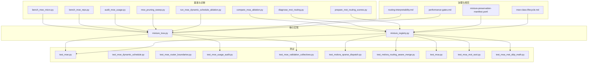
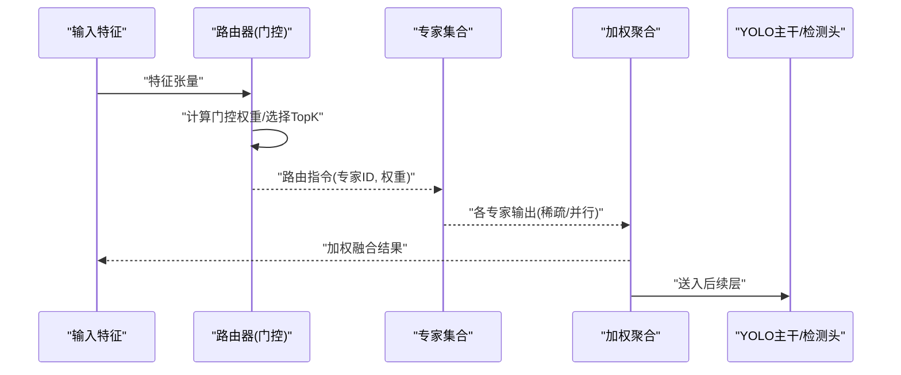
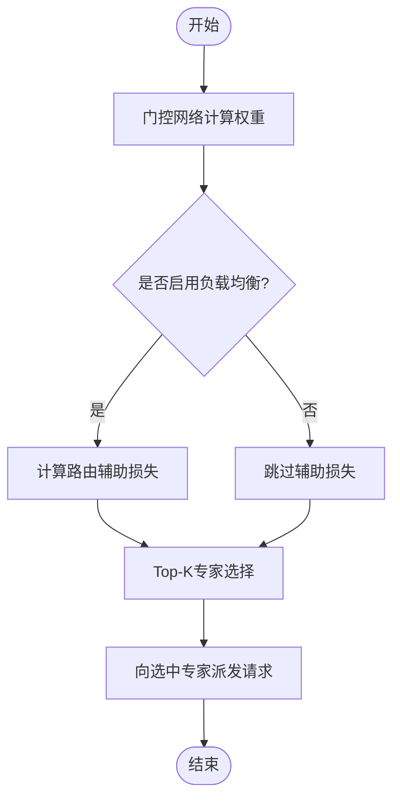
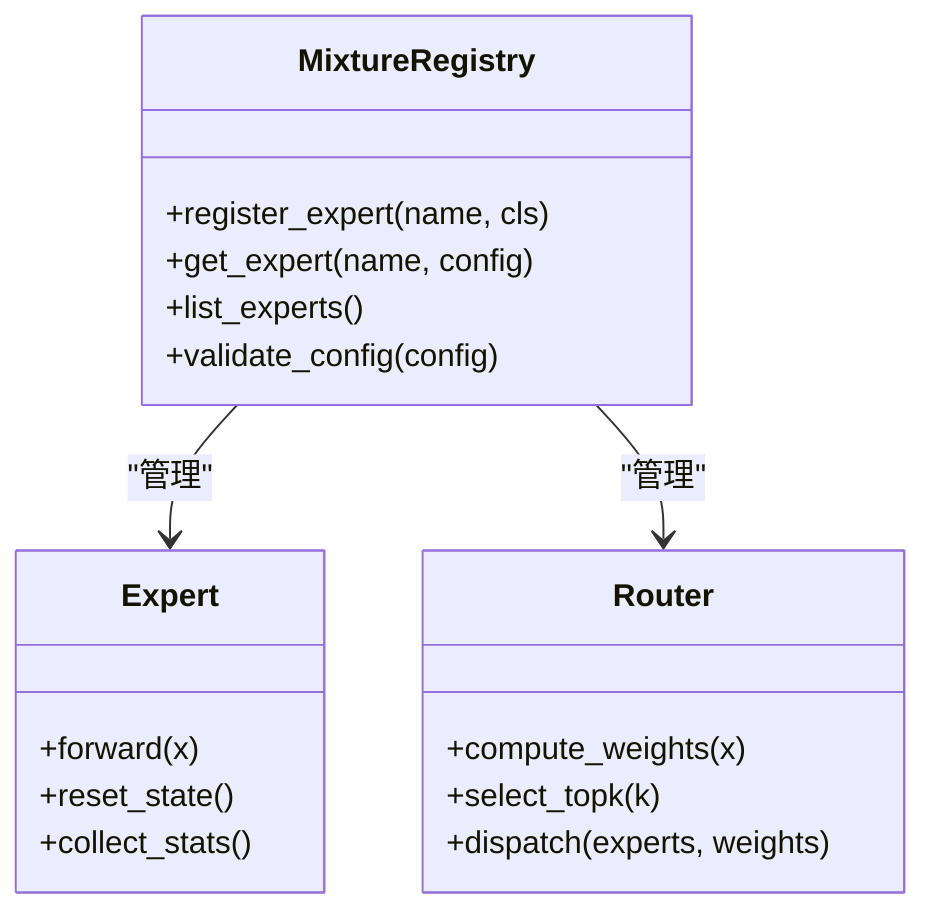
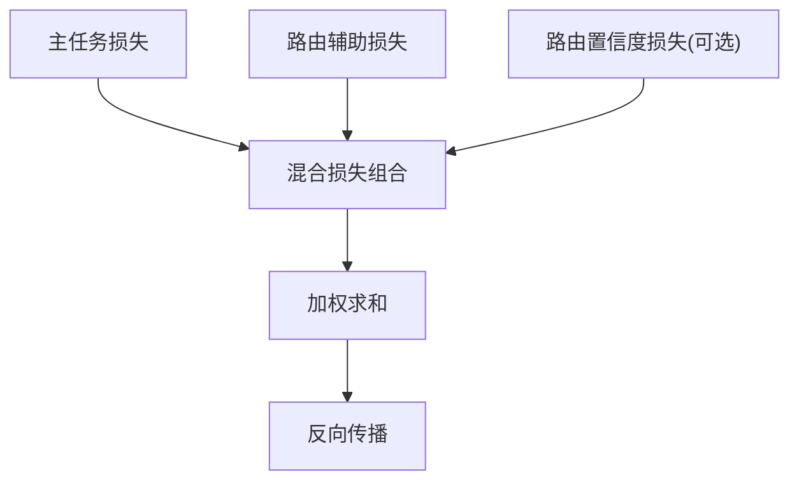
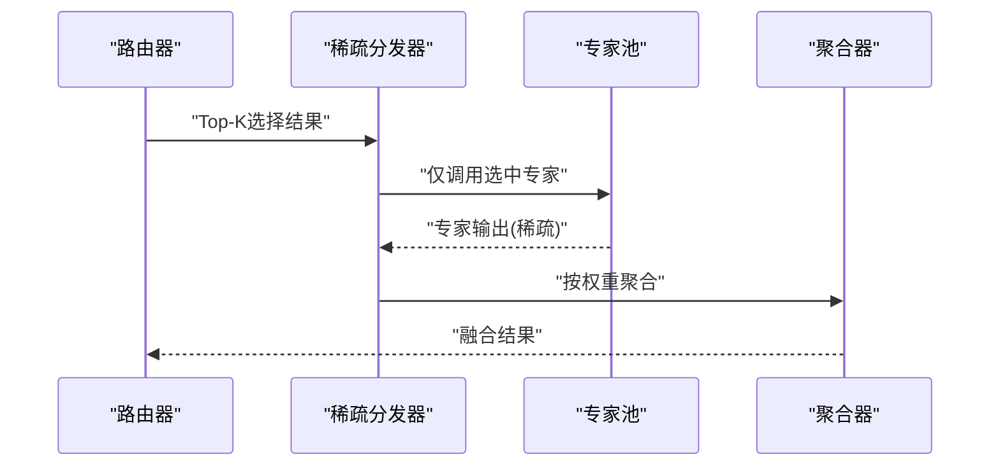
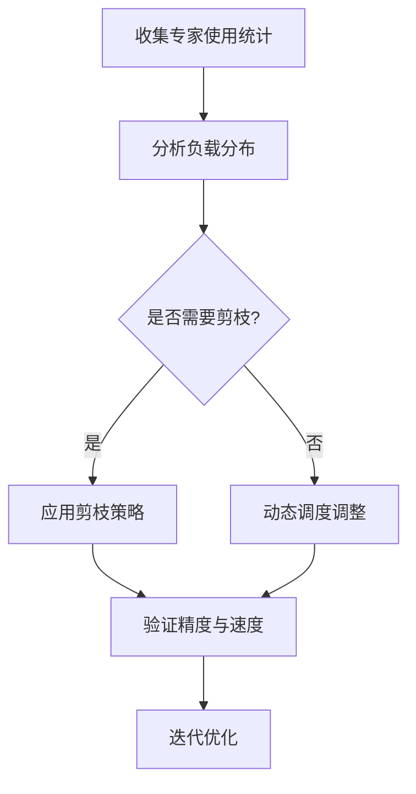
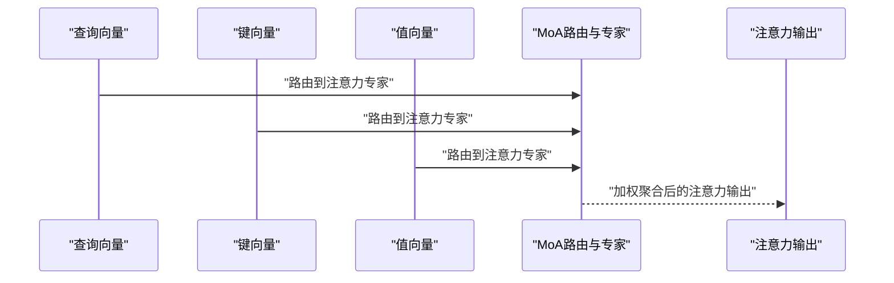
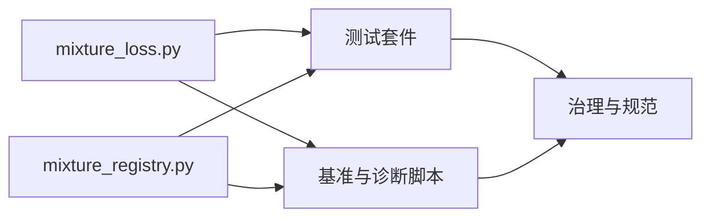

# 多专家混合系统

<cite>
**本文引用的文件**
- [mixture_loss.py](file://ultralytics/nn/mixture_loss.py)
- [mixture_registry.py](file://ultralytics/nn/mixture_registry.py)
- [test_mixture_config_registry.py](file://tests/test_mixture_config_registry.py)
- [test_mixture_model_registry.py](file://tests/test_mixture_model_registry.py)
- [test_mixture_loss_composition.py](file://tests/test_mixture_loss_composition.py)
- [test_moe.py](file://tests/test_moe.py)
- [test_moe_dynamic_schedule.py](file://tests/test_moe_dynamic_schedule.py)
- [test_moe_dynamic_scheduler.py](file://tests/test_moe_dynamic_scheduler.py)
- [test_moe_router_boundaries.py](file://tests/test_moe_router_boundaries.py)
- [test_moe_usage_audit.py](file://tests/test_moe_usage_audit.py)
- [test_moe_validation_collectives.py](file://tests/test_moe_validation_collectives.py)
- [test_molora_sparse_dispatch.py](file://tests/test_molora_sparse_dispatch.py)
- [test_molora_routing_aware_merge.py](file://tests/test_molora_routing_aware_merge.py)
- [test_moa.py](file://tests/test_moa.py)
- [test_moa_mot_ssot.py](file://tests/test_moa_mot_ssot.py)
- [test_moa_mot_ddp_math.py](file://tests/test_moa_mot_ddp_math.py)
- [bench_moe_micro.py](file://scripts/bench_moe_micro.py)
- [bench_moe_mps.py](file://scripts/bench_moe_mps.py)
- [audit_moe_usage.py](file://scripts/audit_moe_usage.py)
- [moe_pruning_sweep.py](file://scripts/moe_pruning_sweep.py)
- [run_moe_dynamic_schedule_ablation.py](file://scripts/run_moe_dynamic_schedule_ablation.py)
- [compare_moa_ablation.py](file://scripts/compare_moa_ablation.py)
- [diagnose_mot_routing.py](file://scripts/diagnose_mot_routing.py)
- [prepare_mot_routing_scenes.py](file://scripts/prepare_mot_routing_scenes.py)
- [moe_pruning_dynamic_schedule.md](file://docs/moe_pruning_dynamic_schedule.md)
- [molora_guide.md](file://docs/molora_guide.md)
- [mixture-preservation-manifest.yaml](file://docs/governance/mixture-preservation-manifest.yaml)
- [moe-class-lifecycle.md](file://docs/governance/moe-class-lifecycle.md)
- [routing-interpretability.md](file://docs/governance/routing-interpretability.md)
- [performance-gates.md](file://docs/governance/performance-gates.md)
</cite>

## 目录
1. [简介](#简介)
2. [项目结构](#项目结构)
3. [核心组件](#核心组件)
4. [架构总览](#架构总览)
5. [详细组件分析](#详细组件分析)
6. [依赖关系分析](#依赖关系分析)
7. [性能考量](#性能考量)
8. [故障排查指南](#故障排查指南)
9. [结论](#结论)
10. [附录](#附录)

## 简介
本技术文档面向YOLO-Master的多专家混合系统，系统性阐述MoE（Mixture of Experts）与MoA（Mixture of Attention）的架构设计、路由机制、专家注册与管理、混合损失函数、稀疏计算优化、动态调度与剪枝策略、在YOLO中的集成位置、配置参数与调优建议、训练稳定性与收敛性保障，以及导出与部署注意事项。文档以代码级实现为依据，结合测试与基准脚本，提供可操作的实践指导。

## 项目结构
多专家混合相关能力主要分布在以下模块：
- 核心实现与注册表
  - 混合损失与路由辅助损失：[mixture_loss.py](file://ultralytics/nn/mixture_loss.py)
  - 专家与路由注册中心：[mixture_registry.py](file://ultralytics/nn/mixture_registry.py)
- 测试套件
  - MoE/MoA功能与边界用例：见tests下以test_moe_*、test_moa_*开头的文件
  - 路由解释与审计：见tests下test_moe_usage_audit.py等
- 基准与诊断脚本
  - 微基准与平台适配：scripts/bench_moe_micro.py、scripts/bench_moe_mps.py
  - 使用统计与剪枝扫描：scripts/audit_moe_usage.py、scripts/moe_pruning_sweep.py
  - 动态调度消融与对比：scripts/run_moe_dynamic_schedule_ablation.py、scripts/compare_moa_ablation.py
  - MOT场景路由诊断与数据准备：scripts/diagnose_mot_routing.py、scripts/prepare_mot_routing_scenes.py
- 治理与规范
  - 混合保留清单、类生命周期、路由可解释性与性能门禁：docs/governance下相关文件

图表来源
- [mixture_loss.py](file://ultralytics/nn/mixture_loss.py)
- [mixture_registry.py](file://ultralytics/nn/mixture_registry.py)
- [test_moe.py](file://tests/test_moe.py)
- [test_moe_dynamic_schedule.py](file://tests/test_moe_dynamic_schedule.py)
- [test_moe_router_boundaries.py](file://tests/test_moe_router_boundaries.py)
- [test_moe_usage_audit.py](file://tests/test_moe_usage_audit.py)
- [test_moe_validation_collectives.py](file://tests/test_moe_validation_collectives.py)
- [test_molora_sparse_dispatch.py](file://tests/test_molora_sparse_dispatch.py)
- [test_molora_routing_aware_merge.py](file://tests/test_molora_routing_aware_merge.py)
- [test_moa.py](file://tests/test_moa.py)
- [test_moa_mot_ssot.py](file://tests/test_moa_mot_ssot.py)
- [test_moa_mot_ddp_math.py](file://tests/test_moa_mot_ddp_math.py)
- [bench_moe_micro.py](file://scripts/bench_moe_micro.py)
- [bench_moe_mps.py](file://scripts/bench_moe_mps.py)
- [audit_moe_usage.py](file://scripts/audit_moe_usage.py)
- [moe_pruning_sweep.py](file://scripts/moe_pruning_sweep.py)
- [run_moe_dynamic_schedule_ablation.py](file://scripts/run_moe_dynamic_schedule_ablation.py)
- [compare_moa_ablation.py](file://scripts/compare_moa_ablation.py)
- [diagnose_mot_routing.py](file://scripts/diagnose_mot_routing.py)
- [prepare_mot_routing_scenes.py](file://scripts/prepare_mot_routing_scenes.py)
- [mixture-preservation-manifest.yaml](file://docs/governance/mixture-preservation-manifest.yaml)
- [moe-class-lifecycle.md](file://docs/governance/moe-class-lifecycle.md)
- [routing-interpretability.md](file://docs/governance/routing-interpretability.md)
- [performance-gates.md](file://docs/governance/performance-gates.md)

章节来源
- [mixture_loss.py](file://ultralytics/nn/mixture_loss.py)
- [mixture_registry.py](file://ultralytics/nn/mixture_registry.py)
- [test_moe.py](file://tests/test_moe.py)
- [test_moe_dynamic_schedule.py](file://tests/test_moe_dynamic_schedule.py)
- [test_moe_router_boundaries.py](file://tests/test_moe_router_boundaries.py)
- [test_moe_usage_audit.py](file://tests/test_moe_usage_audit.py)
- [test_moe_validation_collectives.py](file://tests/test_moe_validation_collectives.py)
- [test_molora_sparse_dispatch.py](file://tests/test_molora_sparse_dispatch.py)
- [test_molora_routing_aware_merge.py](file://tests/test_molora_routing_aware_merge.py)
- [test_moa.py](file://tests/test_moa.py)
- [test_moa_mot_ssot.py](file://tests/test_moa_mot_ssot.py)
- [test_moa_mot_ddp_math.py](file://tests/test_moa_mot_ddp_math.py)
- [bench_moe_micro.py](file://scripts/bench_moe_micro.py)
- [bench_moe_mps.py](file://scripts/bench_moe_mps.py)
- [audit_moe_usage.py](file://scripts/audit_moe_usage.py)
- [moe_pruning_sweep.py](file://scripts/moe_pruning_sweep.py)
- [run_moe_dynamic_schedule_ablation.py](file://scripts/run_moe_dynamic_schedule_ablation.py)
- [compare_moa_ablation.py](file://scripts/compare_moa_ablation.py)
- [diagnose_mot_routing.py](file://scripts/diagnose_mot_routing.py)
- [prepare_mot_routing_scenes.py](file://scripts/prepare_mot_routing_scenes.py)
- [mixture-preservation-manifest.yaml](file://docs/governance/mixture-preservation-manifest.yaml)
- [moe-class-lifecycle.md](file://docs/governance/moe-class-lifecycle.md)
- [routing-interpretability.md](file://docs/governance/routing-interpretability.md)
- [performance-gates.md](file://docs/governance/performance-gates.md)

## 核心组件
- 混合损失与路由辅助损失
  - 负责组合主任务损失与路由相关的辅助损失，支持权重平衡与数值稳定处理。
  - 参考路径：[mixture_loss.py](file://ultralytics/nn/mixture_loss.py)
- 专家与路由注册中心
  - 提供专家类型、路由器的统一注册接口，支持动态发现与实例化，保证可插拔扩展。
  - 参考路径：[mixture_registry.py](file://ultralytics/nn/mixture_registry.py)
- 测试与契约
  - 覆盖MoE/MoA基本行为、路由边界条件、DDP一致性、稀疏分发与路由感知合并、使用审计与统计等。
  - 参考路径：tests下test_moe_*、test_moa_*系列文件

章节来源
- [mixture_loss.py](file://ultralytics/nn/mixture_loss.py)
- [mixture_registry.py](file://ultralytics/nn/mixture_registry.py)
- [test_mixture_config_registry.py](file://tests/test_mixture_config_registry.py)
- [test_mixture_model_registry.py](file://tests/test_mixture_model_registry.py)
- [test_mixture_loss_composition.py](file://tests/test_mixture_loss_composition.py)
- [test_moe.py](file://tests/test_moe.py)
- [test_moe_dynamic_schedule.py](file://tests/test_moe_dynamic_schedule.py)
- [test_moe_dynamic_scheduler.py](file://tests/test_moe_dynamic_scheduler.py)
- [test_moe_router_boundaries.py](file://tests/test_moe_router_boundaries.py)
- [test_moe_usage_audit.py](file://tests/test_moe_usage_audit.py)
- [test_moe_validation_collectives.py](file://tests/test_moe_validation_collectives.py)
- [test_molora_sparse_dispatch.py](file://tests/test_molora_sparse_dispatch.py)
- [test_molora_routing_aware_merge.py](file://tests/test_molora_routing_aware_merge.py)
- [test_moa.py](file://tests/test_moa.py)
- [test_moa_mot_ssot.py](file://tests/test_moa_mot_ssot.py)
- [test_moa_mot_ddp_math.py](file://tests/test_moa_mot_ddp_math.py)

## 架构总览
下图展示MoE/MoA在YOLO中的整体交互：输入特征进入路由器，路由器输出专家选择与权重；被选中的专家并行或稀疏执行；结果按权重聚合后回传至主干网络继续推理或训练。

图表来源
- [mixture_loss.py](file://ultralytics/nn/mixture_loss.py)
- [mixture_registry.py](file://ultralytics/nn/mixture_registry.py)
- [test_moe.py](file://tests/test_moe.py)
- [test_moa.py](file://tests/test_moa.py)

## 详细组件分析

### 路由机制：门控网络、负载均衡与专家选择
- 门控网络
  - 根据输入特征生成专家选择概率分布，支持Top-K稀疏激活以降低计算开销。
  - 关键实现参考：[mixture_loss.py](file://ultralytics/nn/mixture_loss.py)
- 负载均衡
  - 通过辅助损失对专家使用频率进行正则化，避免“赢家通吃”现象。
  - 关键实现参考：[mixture_loss.py](file://ultralytics/nn/mixture_loss.py)
- 专家选择策略
  - 支持Top-K选择与软/硬路由策略，兼顾精度与效率。
  - 关键实现参考：[mixture_loss.py](file://ultralytics/nn/mixture_loss.py)

图表来源
- [mixture_loss.py](file://ultralytics/nn/mixture_loss.py)
- [test_moe_router_boundaries.py](file://tests/test_moe_router_boundaries.py)

章节来源
- [mixture_loss.py](file://ultralytics/nn/mixture_loss.py)
- [test_moe_router_boundaries.py](file://tests/test_moe_router_boundaries.py)

### 专家模块设计与可插拔架构
- 注册与管理
  - 通过注册中心统一管理专家与路由器的类型、配置与实例化流程，支持热插拔与版本兼容。
  - 关键实现参考：[mixture_registry.py](file://ultralytics/nn/mixture_registry.py)
- 契约与生命周期
  - 定义专家接口契约、初始化/销毁流程、状态重置与统计收集点。
  - 参考文档：[moe-class-lifecycle.md](file://docs/governance/moe-class-lifecycle.md)

图表来源
- [mixture_registry.py](file://ultralytics/nn/mixture_registry.py)
- [moe-class-lifecycle.md](file://docs/governance/moe-class-lifecycle.md)

章节来源
- [mixture_registry.py](file://ultralytics/nn/mixture_registry.py)
- [moe-class-lifecycle.md](file://docs/governance/moe-class-lifecycle.md)

### 混合损失函数：主损失、辅助损失与路由损失
- 组成
  - 主任务损失（如检测损失）、路由辅助损失（用于负载均衡）、可能的路由置信度损失。
- 平衡策略
  - 通过超参控制辅助损失权重，确保训练稳定且不牺牲主任务性能。
- 数值稳定性
  - 采用归一化与裁剪策略防止梯度爆炸或NaN传播。

图表来源
- [mixture_loss.py](file://ultralytics/nn/mixture_loss.py)
- [test_mixture_loss_composition.py](file://tests/test_mixture_loss_composition.py)

章节来源
- [mixture_loss.py](file://ultralytics/nn/mixture_loss.py)
- [test_mixture_loss_composition.py](file://tests/test_mixture_loss_composition.py)

### 动态专家激活与稀疏计算优化
- 稀疏分发
  - 仅对被选中的专家执行前向，减少冗余计算。
  - 参考实现：[test_molora_sparse_dispatch.py](file://tests/test_molora_sparse_dispatch.py)
- 路由感知合并
  - 在权重合并阶段考虑路由分布，保持模型质量。
  - 参考实现：[test_molora_routing_aware_merge.py](file://tests/test_molora_routing_aware_merge.py)
- 基准验证
  - 微基准与跨平台（如MPS）验证稀疏路径的性能收益。
  - 参考脚本：[bench_moe_micro.py](file://scripts/bench_moe_micro.py)、[bench_moe_mps.py](file://scripts/bench_moe_mps.py)

图表来源
- [test_molora_sparse_dispatch.py](file://tests/test_molora_sparse_dispatch.py)
- [test_molora_routing_aware_merge.py](file://tests/test_molora_routing_aware_merge.py)
- [bench_moe_micro.py](file://scripts/bench_moe_micro.py)
- [bench_moe_mps.py](file://scripts/bench_moe_mps.py)

章节来源
- [test_molora_sparse_dispatch.py](file://tests/test_molora_sparse_dispatch.py)
- [test_molora_routing_aware_merge.py](file://tests/test_molora_routing_aware_merge.py)
- [bench_moe_micro.py](file://scripts/bench_moe_micro.py)
- [bench_moe_mps.py](file://scripts/bench_moe_mps.py)

### 专家剪枝与动态调度机制
- 使用统计与审计
  - 收集专家访问频次、负载分布与Gini系数等指标，为剪枝与调度提供依据。
  - 参考脚本：[audit_moe_usage.py](file://scripts/audit_moe_usage.py)
- 剪枝扫描与评估
  - 自动化扫描不同剪枝比例并评估精度影响。
  - 参考脚本：[moe_pruning_sweep.py](file://scripts/moe_pruning_sweep.py)
- 动态调度
  - 基于历史使用统计自适应调整Top-K或路由阈值，提升吞吐与稳定性。
  - 参考脚本：[run_moe_dynamic_schedule_ablation.py](file://scripts/run_moe_dynamic_schedule_ablation.py)
- 文档说明
  - 剪枝与动态调度策略详解：[moe_pruning_dynamic_schedule.md](file://docs/moe_pruning_dynamic_schedule.md)

图表来源
- [audit_moe_usage.py](file://scripts/audit_moe_usage.py)
- [moe_pruning_sweep.py](file://scripts/moe_pruning_sweep.py)
- [run_moe_dynamic_schedule_ablation.py](file://scripts/run_moe_dynamic_schedule_ablation.py)
- [moe_pruning_dynamic_schedule.md](file://docs/moe_pruning_dynamic_schedule.md)

章节来源
- [audit_moe_usage.py](file://scripts/audit_moe_usage.py)
- [moe_pruning_sweep.py](file://scripts/moe_pruning_sweep.py)
- [run_moe_dynamic_schedule_ablation.py](file://scripts/run_moe_dynamic_schedule_ablation.py)
- [moe_pruning_dynamic_schedule.md](file://docs/moe_pruning_dynamic_schedule.md)

### MoE在YOLO中的集成方式与位置选择
- 集成位置
  - 通常在骨干网络的中间层或颈部结构中插入MoE块，以增强特征表达并保持端到端训练。
- 兼容性
  - 通过注册中心与契约保证与现有YOLO模块无缝衔接。
- 参考实现与测试
  - 基础行为与边界用例：[test_moe.py](file://tests/test_moe.py)
  - 路由边界与统计：[test_moe_router_boundaries.py](file://tests/test_moe_router_boundaries.py)、[test_moe_usage_audit.py](file://tests/test_moe_usage_audit.py)

章节来源
- [test_moe.py](file://tests/test_moe.py)
- [test_moe_router_boundaries.py](file://tests/test_moe_router_boundaries.py)
- [test_moe_usage_audit.py](file://tests/test_moe_usage_audit.py)

### MoE配置参数参考与调优建议
- 关键参数类别
  - 路由：Top-K、温度系数、负载均衡权重、路由置信度损失权重
  - 专家：专家数量、维度、激活函数、正则化强度
  - 稀疏：稀疏阈值、缓存策略、内存对齐
  - 调度：动态阈值、滑动窗口长度、重平衡周期
- 调优建议
  - 从较小Top-K与较低负载均衡权重起步，逐步增加复杂度；监控专家使用分布与主任务指标。
  - 结合剪枝与动态调度，在精度与延迟之间寻找平衡点。
- 参考实现与契约
  - 配置解析与校验：[test_mixture_config_registry.py](file://tests/test_mixture_config_registry.py)
  - 模型注册与加载：[test_mixture_model_registry.py](file://tests/test_mixture_model_registry.py)
  - 混合保留清单与治理：[mixture-preservation-manifest.yaml](file://docs/governance/mixture-preservation-manifest.yaml)

章节来源
- [test_mixture_config_registry.py](file://tests/test_mixture_config_registry.py)
- [test_mixture_model_registry.py](file://tests/test_mixture_model_registry.py)
- [mixture-preservation-manifest.yaml](file://docs/governance/mixture-preservation-manifest.yaml)

### 训练稳定性与收敛性保证
- 数值稳定
  - 损失组合中引入归一化与裁剪，避免NaN与梯度爆炸。
  - 参考：[mixture_loss.py](file://ultralytics/nn/mixture_loss.py)
- 分布式一致性
  - 在多卡环境下保证路由统计与集合同步的正确性。
  - 参考：[test_moe_validation_collectives.py](file://tests/test_moe_validation_collectives.py)
- 性能门禁
  - 通过门禁检查训练曲线与资源占用，及时发现问题。
  - 参考：[performance-gates.md](file://docs/governance/performance-gates.md)

章节来源
- [mixture_loss.py](file://ultralytics/nn/mixture_loss.py)
- [test_moe_validation_collectives.py](file://tests/test_moe_validation_collectives.py)
- [performance-gates.md](file://docs/governance/performance-gates.md)

### MoA（Mixture of Attention）架构与实现
- 设计要点
  - 在注意力层引入多专家分支，按查询向量动态选择注意力专家，增强上下文建模能力。
- 单源事实与数学一致性
  - 确保多设备与多进程下的注意力聚合一致性与数值正确性。
  - 参考：[test_moa_mot_ssot.py](file://tests/test_moa_mot_ssot.py)、[test_moa_mot_ddp_math.py](file://tests/test_moa_mot_ddp_math.py)
- 消融与对比
  - 通过消融实验验证MoA对下游任务的增益。
  - 参考：[compare_moa_ablation.py](file://scripts/compare_moa_ablation.py)

图表来源
- [test_moa.py](file://tests/test_moa.py)
- [test_moa_mot_ssot.py](file://tests/test_moa_mot_ssot.py)
- [test_moa_mot_ddp_math.py](file://tests/test_moa_mot_ddp_math.py)
- [compare_moa_ablation.py](file://scripts/compare_moa_ablation.py)

章节来源
- [test_moa.py](file://tests/test_moa.py)
- [test_moa_mot_ssot.py](file://tests/test_moa_mot_ssot.py)
- [test_moa_mot_ddp_math.py](file://tests/test_moa_mot_ddp_math.py)
- [compare_moa_ablation.py](file://scripts/compare_moa_ablation.py)

### MOT场景路由诊断与可视化
- 诊断工具
  - 针对多目标跟踪场景的路由行为进行分析与可视化，定位热点专家与瓶颈。
  - 参考脚本：[diagnose_mot_routing.py](file://scripts/diagnose_mot_routing.py)
- 数据准备
  - 构建典型场景样本，便于复现实验与回归测试。
  - 参考脚本：[prepare_mot_routing_scenes.py](file://scripts/prepare_mot_routing_scenes.py)

章节来源
- [diagnose_mot_routing.py](file://scripts/diagnose_mot_routing.py)
- [prepare_mot_routing_scenes.py](file://scripts/prepare_mot_routing_scenes.py)

## 依赖关系分析
- 组件耦合
  - 混合损失与注册中心为核心依赖，测试与脚本围绕其展开。
- 外部依赖
  - 分布式通信与后端加速库（如CUDA/MPS）在基准脚本中得到验证。
- 潜在循环依赖
  - 通过注册中心解耦专家与路由器，降低直接耦合风险。

图表来源
- [mixture_loss.py](file://ultralytics/nn/mixture_loss.py)
- [mixture_registry.py](file://ultralytics/nn/mixture_registry.py)
- [test_moe.py](file://tests/test_moe.py)
- [bench_moe_micro.py](file://scripts/bench_moe_micro.py)
- [mixture-preservation-manifest.yaml](file://docs/governance/mixture-preservation-manifest.yaml)

章节来源
- [mixture_loss.py](file://ultralytics/nn/mixture_loss.py)
- [mixture_registry.py](file://ultralytics/nn/mixture_registry.py)
- [test_moe.py](file://tests/test_moe.py)
- [bench_moe_micro.py](file://scripts/bench_moe_micro.py)
- [mixture-preservation-manifest.yaml](file://docs/governance/mixture-preservation-manifest.yaml)

## 性能考量
- 稀疏计算收益
  - Top-K稀疏激活显著降低FLOPs与显存占用，适合边缘部署。
  - 参考：[bench_moe_micro.py](file://scripts/bench_moe_micro.py)、[bench_moe_mps.py](file://scripts/bench_moe_mps.py)
- 路由开销
  - 门控网络需轻量设计，避免成为瓶颈。
- 动态调度
  - 根据负载自适应调整路由策略，提升吞吐与稳定性。
  - 参考：[run_moe_dynamic_schedule_ablation.py](file://scripts/run_moe_dynamic_schedule_ablation.py)

章节来源
- [bench_moe_micro.py](file://scripts/bench_moe_micro.py)
- [bench_moe_mps.py](file://scripts/bench_moe_mps.py)
- [run_moe_dynamic_schedule_ablation.py](file://scripts/run_moe_dynamic_schedule_ablation.py)

## 故障排查指南
- 路由异常
  - 检查门控权重分布与Top-K选择逻辑，确认是否存在极端倾斜。
  - 参考：[test_moe_router_boundaries.py](file://tests/test_moe_router_boundaries.py)
- 数值不稳定
  - 关注损失组合中的归一化与裁剪设置，必要时降低学习率或增大正则化。
  - 参考：[mixture_loss.py](file://ultralytics/nn/mixture_loss.py)
- 分布式问题
  - 验证集合同步与统计收集是否正确，确保多卡一致性。
  - 参考：[test_moe_validation_collectives.py](file://tests/test_moe_validation_collectives.py)
- 使用审计
  - 通过审计脚本分析专家使用分布，定位冷/热专家。
  - 参考：[audit_moe_usage.py](file://scripts/audit_moe_usage.py)

章节来源
- [test_moe_router_boundaries.py](file://tests/test_moe_router_boundaries.py)
- [mixture_loss.py](file://ultralytics/nn/mixture_loss.py)
- [test_moe_validation_collectives.py](file://tests/test_moe_validation_collectives.py)
- [audit_moe_usage.py](file://scripts/audit_moe_usage.py)

## 结论
YOLO-Master的多专家混合系统通过模块化注册、稀疏路由与动态调度，实现了高精度与高效率的平衡。混合损失与路由辅助损失的协同确保了训练稳定性，而完善的测试与治理规范为工程落地提供了保障。建议在真实场景中结合使用统计与剪枝策略，持续优化专家结构与路由参数，以获得最佳性能。

## 附录
- 路由可解释性
  - 通过可视化工具分析路由决策过程，提升透明度与可维护性。
  - 参考：[routing-interpretability.md](file://docs/governance/routing-interpretability.md)
- MoA与MoE综合指南
  - 涵盖架构、训练与部署的最佳实践。
  - 参考：[molora_guide.md](file://docs/molora_guide.md)

章节来源
- [routing-interpretability.md](file://docs/governance/routing-interpretability.md)
- [molora_guide.md](file://docs/molora_guide.md)