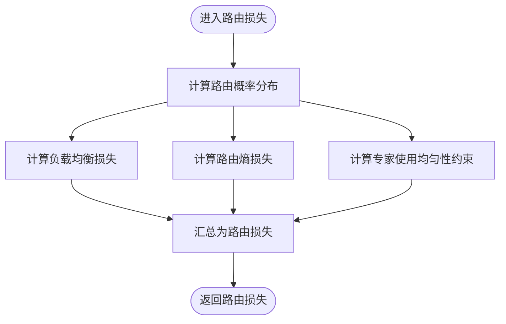
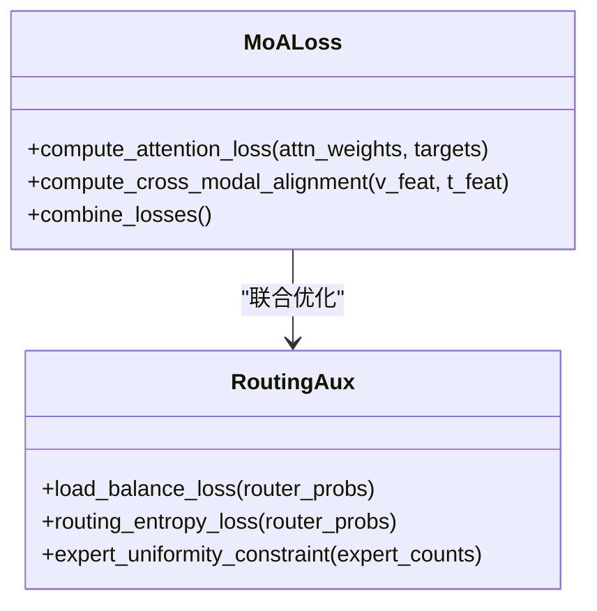
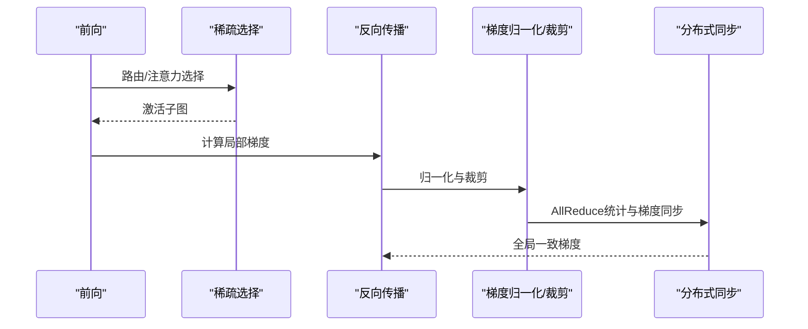
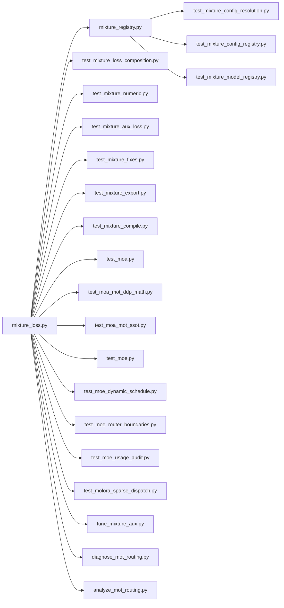

# 混合损失函数

<cite>
**本文引用的文件**
- [mixture_loss.py](file://ultralytics/nn/mixture_loss.py)
- [mixture_registry.py](file://ultralytics/nn/mixture_registry.py)
- [test_mixture_loss_composition.py](file://tests/test_mixture_loss_composition.py)
- [test_mixture_numeric.py](file://tests/test_mixture_numeric.py)
- [test_mixture_config_resolution.py](file://tests/test_mixture_config_resolution.py)
- [test_mixture_config_registry.py](file://tests/test_mixture_config_registry.py)
- [test_mixture_fixes.py](file://tests/test_mixture_fixes.py)
- [test_mixture_export.py](file://tests/test_mixture_export.py)
- [test_mixture_compile.py](file://tests/test_mixture_compile.py)
- [test_mixture_model_registry.py](file://tests/test_mixture_model_registry.py)
- [test_mixture_aux_loss.py](file://tests/test_mixture_aux_loss.py)
- [test_moa.py](file://tests/test_moa.py)
- [test_moa_mot_ddp_math.py](file://tests/test_moa_mot_ddp_math.py)
- [test_moa_mot_ssot.py](file://tests/test_moa_mot_ssot.py)
- [test_moe.py](file://tests/test_moe.py)
- [test_moe_dynamic_schedule.py](file://tests/test_moe_dynamic_schedule.py)
- [test_moe_router_boundaries.py](file://tests/test_moe_router_boundaries.py)
- [test_moe_usage_audit.py](file://tests/test_moe_usage_audit.py)
- [test_molora_sparse_dispatch.py](file://tests/test_molora_sparse_dispatch.py)
- [tune_mixture_aux.py](file://scripts/tune_mixture_aux.py)
- [diagnose_mot_routing.py](file://scripts/diagnose_mot_routing.py)
- [analyze_mot_routing.py](file://scripts/analyze_mot_routing.py)
</cite>

## 目录
1. [简介](#简介)
2. [项目结构](#项目结构)
3. [核心组件](#核心组件)
4. [架构总览](#架构总览)
5. [详细组件分析](#详细组件分析)
6. [依赖关系分析](#依赖关系分析)
7. [性能与数值稳定性](#性能与数值稳定性)
8. [故障排查指南](#故障排查指南)
9. [结论](#结论)
10. [附录](#附录)

## 简介
本文件面向YOLO-Master的MoE（Mixture of Experts）与MoA（Mixture of Attention）混合损失函数，系统性阐述其数学原理、设计目标、实现要点与训练策略。内容覆盖：
- 主任务损失与辅助损失的平衡策略
- 路由损失的设计：负载均衡损失、路由熵损失、专家使用均匀性约束
- MoA特有的注意力损失与跨模态对齐损失
- 梯度流与反向传播机制，稀疏梯度的处理
- 损失权重的动态调整与自适应策略
- 不同任务下的损失变体与配置选项
- 调试与监控工具方法
- 数值稳定性与训练稳定性保证
- 与优化器的配合使用及调参建议

## 项目结构
混合损失相关代码集中在模型层与测试/脚本中：
- 核心实现：ultralytics/nn/mixture_loss.py
- 注册表与配置解析：ultralytics/nn/mixture_registry.py
- 单元测试：tests/*_mixture*.py、tests/test_moa*.py、tests/test_moe*.py、tests/test_molora*.py
- 辅助脚本：scripts/tune_mixture_aux.py、scripts/diagnose_mot_routing.py、scripts/analyze_mot_routing.py

```mermaid
graph TB
subgraph "核心实现"
ML["mixture_loss.py"]
MR["mixture_registry.py"]
end
subgraph "测试套件"
T1["test_mixture_loss_composition.py"]
T2["test_mixture_numeric.py"]
T3["test_mixture_config_resolution.py"]
T4["test_mixture_config_registry.py"]
T5["test_mixture_fixes.py"]
T6["test_mixture_export.py"]
T7["test_mixture_compile.py"]
T8["test_mixture_model_registry.py"]
T9["test_mixture_aux_loss.py"]
TM["test_moa.py"]
TM2["test_moa_mot_ddp_math.py"]
TM3["test_moa_mot_ssot.py"]
TE["test_moe.py"]
TEDS["test_moe_dynamic_schedule.py"]
TERB["test_moe_router_boundaries.py"]
TEUA["test_moe_usage_audit.py"]
TMLR["test_molora_sparse_dispatch.py"]
end
subgraph "辅助脚本"
S1["tune_mixture_aux.py"]
S2["diagnose_mot_routing.py"]
S3["analyze_mot_routing.py"]
end
ML --> MR
T1 --> ML
T2 --> ML
T3 --> MR
T4 --> MR
T5 --> ML
T6 --> ML
T7 --> ML
T8 --> MR
T9 --> ML
TM --> ML
TM2 --> ML
TM3 --> ML
TE --> ML
TEDS --> ML
TERB --> ML
TEUA --> ML
TMLR --> ML
S1 --> ML
S2 --> ML
S3 --> ML
```



图表来源
- [mixture_loss.py](file://ultralytics/nn/mixture_loss.py)
- [mixture_registry.py](file://ultralytics/nn/mixture_registry.py)
- [test_mixture_loss_composition.py](file://tests/test_mixture_loss_composition.py)
- [test_mixture_numeric.py](file://tests/test_mixture_numeric.py)
- [test_mixture_config_resolution.py](file://tests/test_mixture_config_resolution.py)
- [test_mixture_config_registry.py](file://tests/test_mixture_config_registry.py)
- [test_mixture_fixes.py](file://tests/test_mixture_fixes.py)
- [test_mixture_export.py](file://tests/test_mixture_export.py)
- [test_mixture_compile.py](file://tests/test_mixture_compile.py)
- [test_mixture_model_registry.py](file://tests/test_mixture_model_registry.py)
- [test_mixture_aux_loss.py](file://tests/test_mixture_aux_loss.py)
- [test_moa.py](file://tests/test_moa.py)
- [test_moa_mot_ddp_math.py](file://tests/test_moa_mot_ddp_math.py)
- [test_moa_mot_ssot.py](file://tests/test_moa_mot_ssot.py)
- [test_moe.py](file://tests/test_moe.py)
- [test_moe_dynamic_schedule.py](file://tests/test_moe_dynamic_schedule.py)
- [test_moe_router_boundaries.py](file://tests/test_moe_router_boundaries.py)
- [test_moe_usage_audit.py](file://tests/test_moe_usage_audit.py)
- [test_molora_sparse_dispatch.py](file://tests/test_molora_sparse_dispatch.py)
- [tune_mixture_aux.py](file://scripts/tune_mixture_aux.py)
- [diagnose_mot_routing.py](file://scripts/diagnose_mot_routing.py)
- [analyze_mot_routing.py](file://scripts/analyze_mot_routing.py)

章节来源
- [mixture_loss.py](file://ultralytics/nn/mixture_loss.py)
- [mixture_registry.py](file://ultralytics/nn/mixture_registry.py)
- [test_mixture_loss_composition.py](file://tests/test_mixture_loss_composition.py)
- [test_mixture_numeric.py](file://tests/test_mixture_numeric.py)
- [test_mixture_config_resolution.py](file://tests/test_mixture_config_resolution.py)
- [test_mixture_config_registry.py](file://tests/test_mixture_config_registry.py)
- [test_mixture_fixes.py](file://tests/test_mixture_fixes.py)
- [test_mixture_export.py](file://tests/test_mixture_export.py)
- [test_mixture_compile.py](file://tests/test_mixture_compile.py)
- [test_mixture_model_registry.py](file://tests/test_mixture_model_registry.py)
- [test_mixture_aux_loss.py](file://tests/test_mixture_aux_loss.py)
- [test_moa.py](file://tests/test_moa.py)
- [test_moa_mot_ddp_math.py](file://tests/test_moa_mot_ddp_math.py)
- [test_moa_mot_ssot.py](file://tests/test_moa_mot_ssot.py)
- [test_moe.py](file://tests/test_moe.py)
- [test_moe_dynamic_schedule.py](file://tests/test_moe_dynamic_schedule.py)
- [test_moe_router_boundaries.py](file://tests/test_moe_router_boundaries.py)
- [test_moe_usage_audit.py](file://tests/test_moe_usage_audit.py)
- [test_molora_sparse_dispatch.py](file://tests/test_molora_sparse_dispatch.py)
- [tune_mixture_aux.py](file://scripts/tune_mixture_aux.py)
- [diagnose_mot_routing.py](file://scripts/diagnose_mot_routing.py)
- [analyze_mot_routing.py](file://scripts/analyze_mot_routing.py)

## 核心组件
- 混合损失组合器：负责将主任务损失与各类辅助损失按权重组合，支持动态权重与调度策略。
- 路由损失模块：包含负载均衡损失、路由熵损失、专家使用均匀性约束等，用于稳定MoE/MoA训练。
- MoA注意力损失与跨模态对齐损失：针对多模态融合场景，提升注意力分布质量与模态间一致性。
- 配置与注册中心：提供损失项的注册、解析、默认值与版本兼容管理。
- 数值稳定与稀疏梯度处理：在softmax、logsumexp、指数加权平均等关键路径上引入稳定化技巧；对稀疏激活进行归一化与裁剪。

章节来源
- [mixture_loss.py](file://ultralytics/nn/mixture_loss.py)
- [mixture_registry.py](file://ultralytics/nn/mixture_registry.py)
- [test_mixture_loss_composition.py](file://tests/test_mixture_loss_composition.py)
- [test_mixture_numeric.py](file://tests/test_mixture_numeric.py)
- [test_mixture_aux_loss.py](file://tests/test_mixture_aux_loss.py)

## 架构总览
下图展示了混合损失在训练流程中的位置与交互关系，包括主任务分支、MoE路由分支、MoA注意力分支以及辅助损失汇聚点。

```mermaid
sequenceDiagram
participant Train as "训练循环"
participant Model as "模型前向"
participant Router as "路由模块"
participant Experts as "专家集合"
participant MoA as "MoA注意力"
participant Loss as "混合损失组合器"
participant Opt as "优化器"
Train->>Model : 输入批次数据
Model->>Router : 计算路由权重
Router-->>Model : 路由分配/选择
Model->>Experts : 调用被选专家
Experts-->>Model : 专家输出
Model->>MoA : 计算注意力与对齐
MoA-->>Model : 注意力输出
Model-->>Train : 预测结果
Train->>Loss : 主任务损失 + 辅助损失
Loss-->>Train : 总损失
Train->>Opt : 反向传播更新参数
```

图表来源
- [mixture_loss.py](file://ultralytics/nn/mixture_loss.py)
- [test_mixture_loss_composition.py](file://tests/test_mixture_loss_composition.py)
- [test_moa.py](file://tests/test_moa.py)
- [test_moe.py](file://tests/test_moe.py)

## 详细组件分析

### 主任务损失与辅助损失的平衡策略
- 设计目标：在保证主任务收敛的同时，通过辅助损失引导路由与注意力学习，避免专家坍缩与模态失配。
- 平衡方式：采用可配置的静态权重或动态调度（如余弦退火、基于验证指标的反向调节），并支持按阶段切换权重。
- 监控指标：主任务损失、各辅助损失分量、总损失、权重变化曲线、专家使用分布。

章节来源
- [test_mixture_loss_composition.py](file://tests/test_mixture_loss_composition.py)
- [test_mixture_aux_loss.py](file://tests/test_mixture_aux_loss.py)
- [tune_mixture_aux.py](file://scripts/tune_mixture_aux.py)

### 路由损失：负载均衡、熵正则与使用均匀性
- 负载均衡损失：鼓励样本在各专家间均匀分配，防止“赢家通吃”。
- 路由熵损失：提高路由分布的熵，增强探索性与鲁棒性。
- 专家使用均匀性约束：统计层面约束专家被使用的频率接近均匀分布，抑制长尾。
- 实现要点：在路由概率上进行平滑与裁剪，结合全局统计量进行周期性校正。



图表来源
- [mixture_loss.py](file://ultralytics/nn/mixture_loss.py)
- [test_moe_router_boundaries.py](file://tests/test_moe_router_boundaries.py)
- [test_moe_usage_audit.py](file://tests/test_moe_usage_audit.py)

章节来源
- [mixture_loss.py](file://ultralytics/nn/mixture_loss.py)
- [test_moe_router_boundaries.py](file://tests/test_moe_router_boundaries.py)
- [test_moe_usage_audit.py](file://tests/test_moe_usage_audit.py)

### MoA注意力损失与跨模态对齐损失
- 注意力损失：约束注意力分布的质量，例如最大化有效熵、惩罚过度集中或分散。
- 跨模态对齐损失：在多模态输入下，促使视觉与文本（或其他模态）表征在共享空间中对齐，减少模态偏差。
- 适用场景：开放世界检测、描述生成、多模态检索等。



图表来源
- [mixture_loss.py](file://ultralytics/nn/mixture_loss.py)
- [test_moa.py](file://tests/test_moa.py)
- [test_moa_mot_ddp_math.py](file://tests/test_moa_mot_ddp_math.py)
- [test_moa_mot_ssot.py](file://tests/test_moa_mot_ssot.py)

章节来源
- [mixture_loss.py](file://ultralytics/nn/mixture_loss.py)
- [test_moa.py](file://tests/test_moa.py)
- [test_moa_mot_ddp_math.py](file://tests/test_moa_mot_ddp_math.py)
- [test_moa_mot_ssot.py](file://tests/test_moa_mot_ssot.py)

### 梯度流与反向传播：稀疏梯度处理
- 稀疏激活：仅对被选专家与注意力头计算梯度，降低计算与通信开销。
- 归一化与裁剪：对稀疏梯度进行范数归一化与阈值裁剪，防止梯度爆炸。
- 分布式注意：在多卡环境下，确保路由统计量的AllReduce同步，保持负载均衡的一致性。



图表来源
- [mixture_loss.py](file://ultralytics/nn/mixture_loss.py)
- [test_molora_sparse_dispatch.py](file://tests/test_molora_sparse_dispatch.py)
- [test_moe.py](file://tests/test_moe.py)

章节来源
- [mixture_loss.py](file://ultralytics/nn/mixture_loss.py)
- [test_molora_sparse_dispatch.py](file://tests/test_molora_sparse_dispatch.py)
- [test_moe.py](file://tests/test_moe.py)

### 损失权重的动态调整与自适应策略
- 动态权重：根据验证集指标（如mAP、召回率）或损失趋势自动调整辅助损失权重。
- 阶段式调度：预热期侧重主任务，中期引入路由与对齐，后期微调权重以稳定收敛。
- 监控与回退：当出现NaN或发散时，自动降低权重或切换至保守策略。

章节来源
- [test_mixture_loss_composition.py](file://tests/test_mixture_loss_composition.py)
- [tune_mixture_aux.py](file://scripts/tune_mixture_aux.py)
- [test_mixture_fixes.py](file://tests/test_mixture_fixes.py)

### 不同任务下的损失变体与配置选项
- 任务矩阵：检测、分割、姿态估计、跟踪等不同任务的主损失不同，但共享路由与MoA辅助损失。
- 配置解析：通过注册表加载任务特定的损失项与默认权重，支持覆盖与扩展。
- 兼容性：保留历史配置键名并提供迁移提示。

章节来源
- [mixture_registry.py](file://ultralytics/nn/mixture_registry.py)
- [test_mixture_config_resolution.py](file://tests/test_mixture_config_resolution.py)
- [test_mixture_config_registry.py](file://tests/test_mixture_config_registry.py)
- [test_mixture_model_registry.py](file://tests/test_mixture_model_registry.py)

### 调试与监控工具与方法
- 路由解释器：可视化路由分布、专家使用频率与边界行为。
- 诊断脚本：分析多目标跟踪场景下的路由异常与对齐问题。
- 超参搜索：对辅助损失权重进行网格或贝叶斯搜索，定位最佳组合。

章节来源
- [diagnose_mot_routing.py](file://scripts/diagnose_mot_routing.py)
- [analyze_mot_routing.py](file://scripts/analyze_mot_routing.py)
- [tune_mixture_aux.py](file://scripts/tune_mixture_aux.py)

### 数值稳定性与训练稳定性保证
- 数值稳定：在softmax/logsumexp中使用最大值平移、epsilon防除零、对数域运算。
- 梯度稳定：梯度裁剪、EMA平滑、权重衰减与早停策略。
- 编译与导出：确保在torch.compile与导出流程中保持稳定路径与形状。

章节来源
- [test_mixture_numeric.py](file://tests/test_mixture_numeric.py)
- [test_mixture_compile.py](file://tests/test_mixture_compile.py)
- [test_mixture_export.py](file://tests/test_mixture_export.py)

### 与优化器的配合使用与调参建议
- 优化器选择：AdamW/SGD与路由/注意力参数的差异化学习率。
- 学习率调度：主任务与辅助任务采用不同的warmup与退火策略。
- 批大小与步数：大batch有助于路由统计稳定，但需相应调整权重与学习率。

章节来源
- [test_mixture_loss_composition.py](file://tests/test_mixture_loss_composition.py)
- [test_mixture_aux_loss.py](file://tests/test_mixture_aux_loss.py)

## 依赖关系分析
混合损失模块与注册表、测试套件与脚本之间的依赖如下：



图表来源
- [mixture_loss.py](file://ultralytics/nn/mixture_loss.py)
- [mixture_registry.py](file://ultralytics/nn/mixture_registry.py)
- [test_mixture_loss_composition.py](file://tests/test_mixture_loss_composition.py)
- [test_mixture_numeric.py](file://tests/test_mixture_numeric.py)
- [test_mixture_aux_loss.py](file://tests/test_mixture_aux_loss.py)
- [test_mixture_fixes.py](file://tests/test_mixture_fixes.py)
- [test_mixture_export.py](file://tests/test_mixture_export.py)
- [test_mixture_compile.py](file://tests/test_mixture_compile.py)
- [test_mixture_config_resolution.py](file://tests/test_mixture_config_resolution.py)
- [test_mixture_config_registry.py](file://tests/test_mixture_config_registry.py)
- [test_mixture_model_registry.py](file://tests/test_mixture_model_registry.py)
- [test_moa.py](file://tests/test_moa.py)
- [test_moa_mot_ddp_math.py](file://tests/test_moa_mot_ddp_math.py)
- [test_moa_mot_ssot.py](file://tests/test_moa_mot_ssot.py)
- [test_moe.py](file://tests/test_moe.py)
- [test_moe_dynamic_schedule.py](file://tests/test_moe_dynamic_schedule.py)
- [test_moe_router_boundaries.py](file://tests/test_moe_router_boundaries.py)
- [test_moe_usage_audit.py](file://tests/test_moe_usage_audit.py)
- [test_molora_sparse_dispatch.py](file://tests/test_molora_sparse_dispatch.py)
- [tune_mixture_aux.py](file://scripts/tune_mixture_aux.py)
- [diagnose_mot_routing.py](file://scripts/diagnose_mot_routing.py)
- [analyze_mot_routing.py](file://scripts/analyze_mot_routing.py)

章节来源
- [mixture_loss.py](file://ultralytics/nn/mixture_loss.py)
- [mixture_registry.py](file://ultralytics/nn/mixture_registry.py)
- [test_mixture_loss_composition.py](file://tests/test_mixture_loss_composition.py)
- [test_mixture_numeric.py](file://tests/test_mixture_numeric.py)
- [test_mixture_aux_loss.py](file://tests/test_mixture_aux_loss.py)
- [test_mixture_fixes.py](file://tests/test_mixture_fixes.py)
- [test_mixture_export.py](file://tests/test_mixture_export.py)
- [test_mixture_compile.py](file://tests/test_mixture_compile.py)
- [test_mixture_config_resolution.py](file://tests/test_mixture_config_resolution.py)
- [test_mixture_config_registry.py](file://tests/test_mixture_config_registry.py)
- [test_mixture_model_registry.py](file://tests/test_mixture_model_registry.py)
- [test_moa.py](file://tests/test_moa.py)
- [test_moa_mot_ddp_math.py](file://tests/test_moa_mot_ddp_math.py)
- [test_moa_mot_ssot.py](file://tests/test_moa_mot_ssot.py)
- [test_moe.py](file://tests/test_moe.py)
- [test_moe_dynamic_schedule.py](file://tests/test_moe_dynamic_schedule.py)
- [test_moe_router_boundaries.py](file://tests/test_moe_router_boundaries.py)
- [test_moe_usage_audit.py](file://tests/test_moe_usage_audit.py)
- [test_molora_sparse_dispatch.py](file://tests/test_molora_sparse_dispatch.py)
- [tune_mixture_aux.py](file://scripts/tune_mixture_aux.py)
- [diagnose_mot_routing.py](file://scripts/diagnose_mot_routing.py)
- [analyze_mot_routing.py](file://scripts/analyze_mot_routing.py)

## 性能与数值稳定性
- 性能：稀疏激活与选择性计算显著降低FLOPs与内存占用；路由统计的异步聚合减少同步开销。
- 数值稳定：对概率分布进行平滑与裁剪，避免极端值；在日志与监控中记录条件数与梯度范数。
- 训练稳定：采用EMA、梯度裁剪、学习率预热与退火，结合动态权重回退策略。

[本节为通用指导，不直接分析具体文件]

## 故障排查指南
- 路由崩溃或专家坍缩：检查负载均衡与熵正则权重是否过小；查看专家使用审计与路由边界测试。
- NaN或发散：启用数值稳定性测试路径，确认softmax/logsumexp的稳定实现；降低学习率或权重。
- 多模态对齐失败：检查跨模态对齐损失权重与特征尺度；使用诊断脚本分析模态偏差。
- 分布式不一致：确认路由统计的AllReduce同步与单源真相（SSOT）约束。

章节来源
- [test_moe_router_boundaries.py](file://tests/test_moe_router_boundaries.py)
- [test_moe_usage_audit.py](file://tests/test_moe_usage_audit.py)
- [test_mixture_numeric.py](file://tests/test_mixture_numeric.py)
- [test_moa_mot_ssot.py](file://tests/test_moa_mot_ssot.py)
- [diagnose_mot_routing.py](file://scripts/diagnose_mot_routing.py)

## 结论
YOLO-Master的混合损失体系通过主任务与辅助损失的协同优化，结合路由与注意力层面的正则与对齐，实现了稳健且高效的MoE/MoA训练。借助完善的测试与诊断工具链，可在复杂任务与分布式环境中获得稳定的收敛与良好的泛化表现。

[本节为总结性内容，不直接分析具体文件]

## 附录
- 配置示例与覆盖方式：参考注册表与配置解析测试用例。
- 超参搜索流程：参考辅助损失权重调优脚本。
- 任务矩阵与变体：参考模型注册表与任务相关测试。

章节来源
- [test_mixture_config_resolution.py](file://tests/test_mixture_config_resolution.py)
- [test_mixture_config_registry.py](file://tests/test_mixture_config_registry.py)
- [test_mixture_model_registry.py](file://tests/test_mixture_model_registry.py)
- [tune_mixture_aux.py](file://scripts/tune_mixture_aux.py)