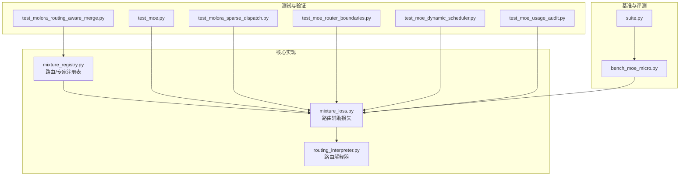
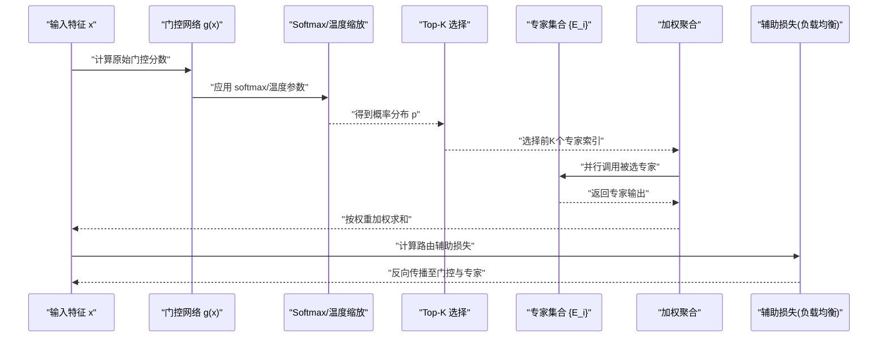
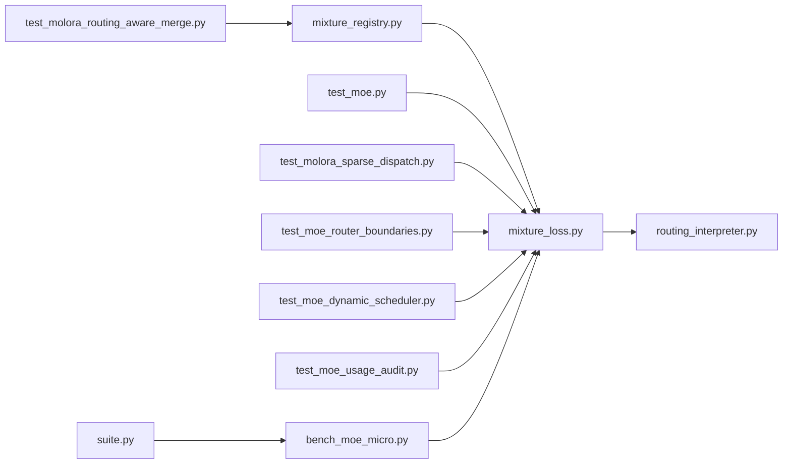

# 基础路由算法

<cite>
**本文引用的文件**
- [ultralytics/nn/mixture_loss.py](file://ultralytics/nn/mixture_loss.py)
- [ultralytics/nn/mixture_registry.py](file://ultralytics/nn/mixture_registry.py)
- [ultralytics/utils/routing_interpreter.py](file://ultralytics/utils/routing_interpreter.py)
- [tests/test_moe.py](file://tests/test_moe.py)
- [tests/test_molora_routing_aware_merge.py](file://tests/test_molora_routing_aware_merge.py)
- [tests/test_molora_sparse_dispatch.py](file://tests/test_molora_sparse_dispatch.py)
- [tests/test_moe_router_boundaries.py](file://tests/test_moe_router_boundaries.py)
- [tests/test_moe_dynamic_scheduler.py](file://tests/test_moe_dynamic_scheduler.py)
- [tests/test_moe_usage_audit.py](file://tests/test_moe_usage_audit.py)
- [scripts/bench_moe_micro.py](file://scripts/bench_moe_micro.py)
- [benchmarks/suite.py](file://benchmarks/suite.py)
</cite>

## 目录
1. [简介](#简介)
2. [项目结构](#项目结构)
3. [核心组件](#核心组件)
4. [架构总览](#架构总览)
5. [详细组件分析](#详细组件分析)
6. [依赖关系分析](#依赖关系分析)
7. [性能考量](#性能考量)
8. [故障排查指南](#故障排查指南)
9. [结论](#结论)
10. [附录](#附录)

## 简介
本技术文档聚焦于 YOLO-Master 的基础路由算法，围绕以下三类核心路由机制展开：
- Top-K 稀疏路由：通过门控权重选择前 K 个专家，实现计算与存储的稀疏化。
- Softmax 路由：基于概率分布的门控分配，强调数值稳定性与可微性。
- 注意力路由：结合自注意力特征进行动态路由决策，提升任务适配能力。

文档将系统阐述各算法的数学原理、时间/空间复杂度、配置参数、数值稳定性处理与梯度传播机制，并给出在代码库中的定位与使用路径，帮助读者在不同场景下做出合理的路由策略选择。

## 项目结构
YOLO-Master 中与“基础路由”相关的实现与验证主要分布在如下位置：
- 混合模型注册与损失辅助：用于路由辅助项（如负载平衡）的计算与注册。
- 路由解释器：提供路由权重的可视化与诊断工具。
- 测试套件：覆盖路由边界、动态调度、稀疏分发、路由感知合并等关键路径。
- 基准脚本：对路由相关模块进行微基准评估。

图表来源
- [ultralytics/nn/mixture_loss.py](file://ultralytics/nn/mixture_loss.py)
- [ultralytics/nn/mixture_registry.py](file://ultralytics/nn/mixture_registry.py)
- [ultralytics/utils/routing_interpreter.py](file://ultralytics/utils/routing_interpreter.py)
- [tests/test_moe.py](file://tests/test_moe.py)
- [tests/test_molora_routing_aware_merge.py](file://tests/test_molora_routing_aware_merge.py)
- [tests/test_molora_sparse_dispatch.py](file://tests/test_molora_sparse_dispatch.py)
- [tests/test_moe_router_boundaries.py](file://tests/test_moe_router_boundaries.py)
- [tests/test_moe_dynamic_scheduler.py](file://tests/test_moe_dynamic_scheduler.py)
- [tests/test_moe_usage_audit.py](file://tests/test_moe_usage_audit.py)
- [scripts/bench_moe_micro.py](file://scripts/bench_moe_micro.py)
- [benchmarks/suite.py](file://benchmarks/suite.py)

章节来源
- [ultralytics/nn/mixture_loss.py](file://ultralytics/nn/mixture_loss.py)
- [ultralytics/nn/mixture_registry.py](file://ultralytics/nn/mixture_registry.py)
- [ultralytics/utils/routing_interpreter.py](file://ultralytics/utils/routing_interpreter.py)
- [tests/test_moe.py](file://tests/test_moe.py)
- [tests/test_molora_routing_aware_merge.py](file://tests/test_molora_routing_aware_merge.py)
- [tests/test_molora_sparse_dispatch.py](file://tests/test_molora_sparse_dispatch.py)
- [tests/test_moe_router_boundaries.py](file://tests/test_moe_router_boundaries.py)
- [tests/test_moe_dynamic_scheduler.py](file://tests/test_moe_dynamic_scheduler.py)
- [tests/test_moe_usage_audit.py](file://tests/test_moe_usage_audit.py)
- [scripts/bench_moe_micro.py](file://scripts/bench_moe_micro.py)
- [benchmarks/suite.py](file://benchmarks/suite.py)

## 核心组件
本节概述与基础路由直接相关的核心模块及其职责：
- 路由辅助损失与注册表：提供路由相关的辅助项（例如负载均衡）以及路由/专家的统一注册接口。
- 路由解释器：解析和可视化路由权重，便于调试与解释性分析。
- 测试与基准：覆盖路由边界条件、动态调度、稀疏分发、路由感知合并等关键行为，并提供微基准数据。

章节来源
- [ultralytics/nn/mixture_loss.py](file://ultralytics/nn/mixture_loss.py)
- [ultralytics/nn/mixture_registry.py](file://ultralytics/nn/mixture_registry.py)
- [ultralytics/utils/routing_interpreter.py](file://ultralytics/utils/routing_interpreter.py)
- [tests/test_moe.py](file://tests/test_moe.py)
- [tests/test_molora_routing_aware_merge.py](file://tests/test_molora_routing_aware_merge.py)
- [tests/test_molora_sparse_dispatch.py](file://tests/test_molora_sparse_dispatch.py)
- [tests/test_moe_router_boundaries.py](file://tests/test_moe_router_boundaries.py)
- [tests/test_moe_dynamic_scheduler.py](file://tests/test_moe_dynamic_scheduler.py)
- [tests/test_moe_usage_audit.py](file://tests/test_moe_usage_audit.py)
- [scripts/bench_moe_micro.py](file://scripts/bench_moe_micro.py)
- [benchmarks/suite.py](file://benchmarks/suite.py)

## 架构总览
下图展示了从输入到路由决策再到专家计算的端到端流程，包括门控权重生成、Top-K 稀疏选择、Softmax 归一化与注意力融合的关键步骤。

图表来源
- [ultralytics/nn/mixture_loss.py](file://ultralytics/nn/mixture_loss.py)
- [ultralytics/nn/mixture_registry.py](file://ultralytics/nn/mixture_registry.py)
- [ultralytics/utils/routing_interpreter.py](file://ultralytics/utils/routing_interpreter.py)

## 详细组件分析

### Top-K 稀疏路由
- 数学原理
  - 给定输入 x，门控函数 g(x) 产生每个专家的原始得分。
  - 通过 Top-K 操作选择得分最高的 K 个专家，其余专家权重置零，形成稀疏激活。
  - 可选地，对选中专家进行局部归一化或保留全局 Softmax 权重以控制贡献度。
- 稀疏选择机制
  - 通过 argtopk 或等价操作获得索引，再构造稀疏权重向量。
  - 稀疏度由 K 控制；K 越小，计算与通信开销越低，但可能降低表达能力。
- 门控权重计算
  - 常见做法是先对 g(x) 做 Softmax 得到概率分布，再进行 Top-K 掩码；或在 Top-K 后对选中部分重新归一化。
- 复杂度
  - 时间复杂度：O(N·D + N·log D) 或 O(N·D + N·K)，其中 N 为样本数，D 为专家数，K 为选择的专家数。
  - 空间复杂度：O(N·K) 用于存储被选专家的输出与权重。
- 数值稳定性
  - 在 Softmax 前进行数值稳定化（减去最大值），避免溢出。
  - 对极端小的权重进行裁剪或阈值截断，防止数值噪声放大。
- 梯度传播
  - Top-K 是离散选择，通常采用直通估计（Straight-Through Estimator）或软近似（如 Gumbel-Softmax）以实现可微训练。
  - 若采用直通估计，梯度绕过离散选择，仅作用于连续门控分支。
- 配置参数
  - top_k：每样本选择的专家数量。
  - gate_temperature：控制 Softmax 尖锐度的温度参数。
  - load_balance_weight：负载均衡辅助损失的权重。
- 适用场景
  - 大规模专家且推理时希望显著降低计算量的场景。
  - 需要显式控制稀疏度与吞吐量的部署环境。

章节来源
- [tests/test_moe.py](file://tests/test_moe.py)
- [tests/test_molora_sparse_dispatch.py](file://tests/test_molora_sparse_dispatch.py)
- [tests/test_moe_router_boundaries.py](file://tests/test_moe_router_boundaries.py)
- [scripts/bench_moe_micro.py](file://scripts/bench_moe_micro.py)

### Softmax 路由
- 数学基础
  - 门控分数 z = g(x)，经 softmax 得到概率分布 p_i = exp(z_i/T)/Σ_j exp(z_j/T)，T 为温度。
  - 当 T→0 时分布趋近于 one-hot（接近 Top-1）；T→∞ 时趋于均匀分布。
- 概率分布特性
  - 所有专家权重之和为 1，保证加权聚合的稳定性。
  - 温度调节影响路由的“锐利度”，从而影响负载均衡与多样性。
- 复杂度
  - 时间复杂度：O(N·D) 用于计算指数与归一化。
  - 空间复杂度：O(N·D) 存储概率分布。
- 数值稳定性
  - 标准技巧：z' = z - max(z)，再计算 exp(z')，最后归一化。
  - 对极小值进行裁剪，避免 log/exp 下的下溢/上溢。
- 梯度传播
  - Softmax 是可微的，梯度可通过链式法则回传至门控网络。
  - 温度 T 也可学习，需小心梯度尺度。
- 配置参数
  - temperature：控制分布锐利度。
  - epsilon：数值稳定性的微小常数。
  - aux_loss_weight：辅助损失权重（如负载均衡）。
- 适用场景
  - 需要平滑路由与良好可微性的训练阶段。
  - 专家数量适中且希望充分利用多专家能力的场景。

章节来源
- [ultralytics/nn/mixture_loss.py](file://ultralytics/nn/mixture_loss.py)
- [ultralytics/nn/mixture_registry.py](file://ultralytics/nn/mixture_registry.py)
- [tests/test_moe.py](file://tests/test_moe.py)

### 注意力路由
- 设计动机
  - 传统门控仅依赖静态映射 g(x)，注意力路由引入上下文信息，使路由决策更灵活。
- 结合自注意力的方式
  - 将输入序列的特征作为查询 Q，专家键 K_expert 与价值 V_expert 构成专家池。
  - 通过多头注意力计算注意力权重 α = softmax(QK^T/√d)，并按 α 对专家输出进行加权聚合。
  - 可在注意力层之后接一个轻量门控，进一步约束稀疏性或增强选择性。
- 复杂度
  - 时间复杂度：O(N·D·d) 或 O((N+D)·N·d)，取决于具体实现与是否共享键值。
  - 空间复杂度：O(N·D) 存储注意力矩阵。
- 数值稳定性
  - 对 QK^T 进行缩放与裁剪，避免大值导致 softmax 饱和。
  - 对注意力权重进行最小值裁剪，防止某些专家完全失活。
- 梯度传播
  - 注意力层完全可微，梯度自然回传至 Q/K/V 投影与专家。
  - 若引入稀疏约束（如 Top-K 掩码），需考虑直通估计或软近似。
- 配置参数
  - num_heads：注意力头数。
  - d_model：嵌入维度。
  - dropout：注意力 Dropout。
  - sparse_top_k：在注意力后进行的稀疏选择数量。
- 适用场景
  - 长序列或多模态输入，需要跨位置/跨模态信息交互的路由。
  - 对路由可解释性与动态性要求较高的任务。

章节来源
- [ultralytics/utils/routing_interpreter.py](file://ultralytics/utils/routing_interpreter.py)
- [tests/test_moe.py](file://tests/test_moe.py)

### 路由辅助损失与负载均衡
- 目标
  - 防止少数专家过拟合，鼓励专家间负载均衡，提高整体吞吐与泛化。
- 常见形式
  - 基于专家使用频率的 KL 散度或方差惩罚，与主损失加权组合。
- 集成点
  - 在训练阶段加入辅助损失，不参与推理。
  - 与路由解释器配合，监控专家使用分布。
- 复杂度
  - 额外开销较小，通常为 O(N·D) 统计与简单聚合。
- 配置参数
  - aux_loss_type：辅助损失类型（如 KL、方差）。
  - aux_loss_weight：辅助损失权重。
  - warmup_steps：预热步数，避免早期不稳定。
- 适用场景
  - 专家数量较多、训练初期易出现负载不均衡的情况。

章节来源
- [ultralytics/nn/mixture_loss.py](file://ultralytics/nn/mixture_loss.py)
- [ultralytics/utils/routing_interpreter.py](file://ultralytics/utils/routing_interpreter.py)
- [tests/test_moe_usage_audit.py](file://tests/test_moe_usage_audit.py)

### 路由解释器与诊断
- 功能
  - 解析路由权重、专家使用率、负载分布等指标。
  - 提供可视化输出，辅助定位路由异常（如某专家长期失活）。
- 集成点
  - 与训练回调或日志系统集成，定期记录路由统计。
- 配置参数
  - save_dir：结果保存目录。
  - interval：记录间隔。
  - metrics：需要记录的指标列表。
- 适用场景
  - 路由调试、模型诊断与论文复现的数据收集。

章节来源
- [ultralytics/utils/routing_interpreter.py](file://ultralytics/utils/routing_interpreter.py)

## 依赖关系分析
路由相关模块之间的依赖关系如下：
- mixture_loss 提供辅助损失与路由统计，供测试与解释器使用。
- mixture_registry 统一注册路由与专家，确保接口一致性。
- routing_interpreter 读取路由权重与统计，生成诊断报告。
- 测试套件覆盖路由边界、动态调度、稀疏分发与路由感知合并等关键路径。
- 基准脚本对路由模块进行微基准评估，支撑性能优化。

图表来源
- [ultralytics/nn/mixture_loss.py](file://ultralytics/nn/mixture_loss.py)
- [ultralytics/nn/mixture_registry.py](file://ultralytics/nn/mixture_registry.py)
- [ultralytics/utils/routing_interpreter.py](file://ultralytics/utils/routing_interpreter.py)
- [tests/test_moe.py](file://tests/test_moe.py)
- [tests/test_molora_routing_aware_merge.py](file://tests/test_molora_routing_aware_merge.py)
- [tests/test_molora_sparse_dispatch.py](file://tests/test_molora_sparse_dispatch.py)
- [tests/test_moe_router_boundaries.py](file://tests/test_moe_router_boundaries.py)
- [tests/test_moe_dynamic_scheduler.py](file://tests/test_moe_dynamic_scheduler.py)
- [tests/test_moe_usage_audit.py](file://tests/test_moe_usage_audit.py)
- [scripts/bench_moe_micro.py](file://scripts/bench_moe_micro.py)
- [benchmarks/suite.py](file://benchmarks/suite.py)

章节来源
- [ultralytics/nn/mixture_loss.py](file://ultralytics/nn/mixture_loss.py)
- [ultralytics/nn/mixture_registry.py](file://ultralytics/nn/mixture_registry.py)
- [ultralytics/utils/routing_interpreter.py](file://ultralytics/utils/routing_interpreter.py)
- [tests/test_moe.py](file://tests/test_moe.py)
- [tests/test_molora_routing_aware_merge.py](file://tests/test_molora_routing_aware_merge.py)
- [tests/test_molora_sparse_dispatch.py](file://tests/test_molora_sparse_dispatch.py)
- [tests/test_moe_router_boundaries.py](file://tests/test_moe_router_boundaries.py)
- [tests/test_moe_dynamic_scheduler.py](file://tests/test_moe_dynamic_scheduler.py)
- [tests/test_moe_usage_audit.py](file://tests/test_moe_usage_audit.py)
- [scripts/bench_moe_micro.py](file://scripts/bench_moe_micro.py)
- [benchmarks/suite.py](file://benchmarks/suite.py)

## 性能考量
- 稀疏度与吞吐
  - Top-K 的 K 越小，推理速度越快，但可能牺牲精度；建议根据任务与硬件进行网格搜索。
- 内存占用
  - Softmax 路由需要存储完整的概率分布，内存开销较大；Top-K 可降低峰值内存。
- 数值稳定性
  - 温度缩放与最大值减法是关键；建议在极端输入下进行压力测试。
- 并行与通信
  - 专家并行执行可显著提升吞吐；在多设备环境下需注意数据分片与同步开销。
- 基准参考
  - 使用 micro-benchmark 脚本对不同路由策略进行对比，关注延迟与吞吐。

章节来源
- [scripts/bench_moe_micro.py](file://scripts/bench_moe_micro.py)
- [benchmarks/suite.py](file://benchmarks/suite.py)

## 故障排查指南
- 路由崩溃或 NaN
  - 检查 Softmax 前的数值稳定化处理；确认温度参数未过小或过大。
  - 查看路由解释器的权重分布，识别是否存在单专家垄断或全部失活。
- 负载不均衡
  - 调整辅助损失权重与预热步数；观察专家使用率变化。
- 稀疏分发异常
  - 核对 Top-K 的实现与掩码逻辑；确认直通估计或软近似是否正确启用。
- 路由感知合并问题
  - 检查合并前后的权重对齐与形状匹配；验证注册表的一致性。
- 动态调度失效
  - 确认调度策略的触发条件与状态机转换；检查边界用例。

章节来源
- [tests/test_moe.py](file://tests/test_moe.py)
- [tests/test_molora_routing_aware_merge.py](file://tests/test_molora_routing_aware_merge.py)
- [tests/test_molora_sparse_dispatch.py](file://tests/test_molora_sparse_dispatch.py)
- [tests/test_moe_router_boundaries.py](file://tests/test_moe_router_boundaries.py)
- [tests/test_moe_dynamic_scheduler.py](file://tests/test_moe_dynamic_scheduler.py)
- [tests/test_moe_usage_audit.py](file://tests/test_moe_usage_audit.py)
- [ultralytics/utils/routing_interpreter.py](file://ultralytics/utils/routing_interpreter.py)

## 结论
- Top-K 稀疏路由适合高吞吐与低延迟需求，配合直通估计或软近似可实现稳定训练。
- Softmax 路由具备良好可微性与概率解释性，适合需要平滑路由的场景。
- 注意力路由能利用上下文信息提升路由的动态性与可解释性，但计算与内存开销更高。
- 辅助损失与路由解释器是保障训练稳定与可诊断的重要基础设施。
- 建议在实际项目中结合任务特性、硬件资源与性能目标，选择合适的路由策略并进行系统化调参与基准评估。

## 附录
- 使用示例（路径指引）
  - 路由辅助损失与注册表：[ultralytics/nn/mixture_loss.py](file://ultralytics/nn/mixture_loss.py)、[ultralytics/nn/mixture_registry.py](file://ultralytics/nn/mixture_registry.py)
  - 路由解释器与诊断：[ultralytics/utils/routing_interpreter.py](file://ultralytics/utils/routing_interpreter.py)
  - 路由边界与稀疏分发测试：[tests/test_moe_router_boundaries.py](file://tests/test_moe_router_boundaries.py)、[tests/test_molora_sparse_dispatch.py](file://tests/test_molora_sparse_dispatch.py)
  - 路由感知合并与动态调度：[tests/test_molora_routing_aware_merge.py](file://tests/test_molora_routing_aware_merge.py)、[tests/test_moe_dynamic_scheduler.py](file://tests/test_moe_dynamic_scheduler.py)
  - 路由使用审计与基准：[tests/test_moe_usage_audit.py](file://tests/test_moe_usage_audit.py)、[scripts/bench_moe_micro.py](file://scripts/bench_moe_micro.py)