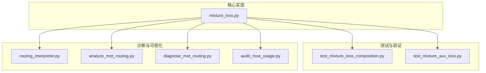
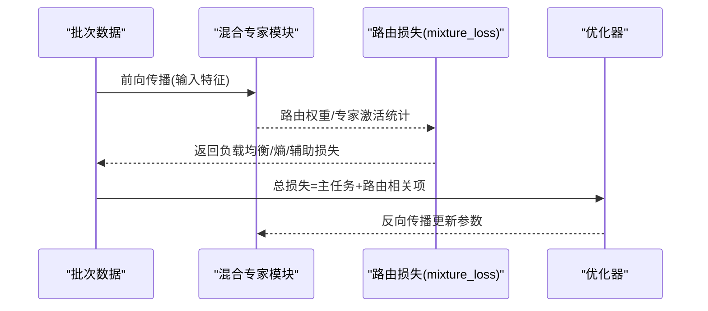
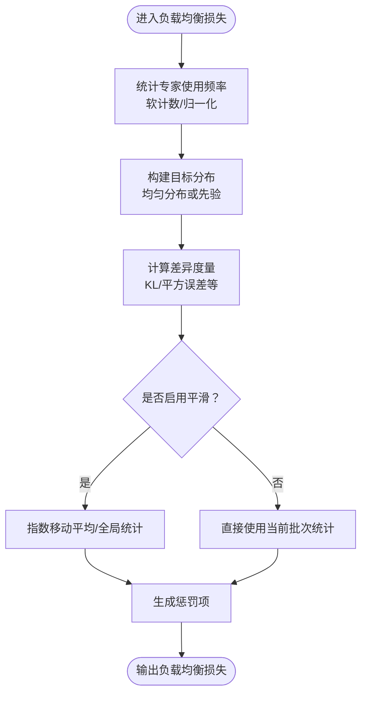
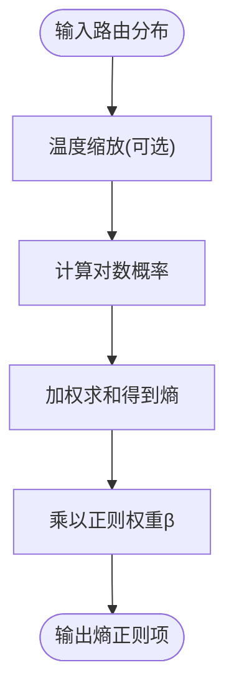
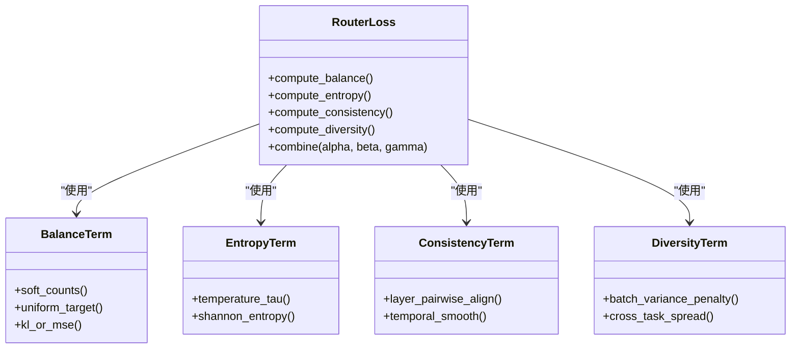
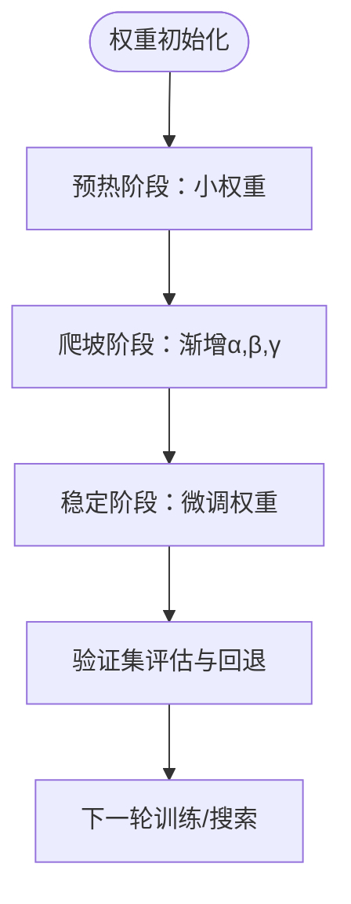
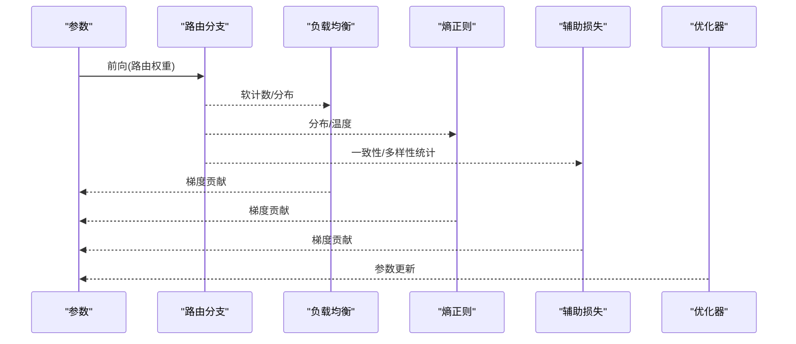
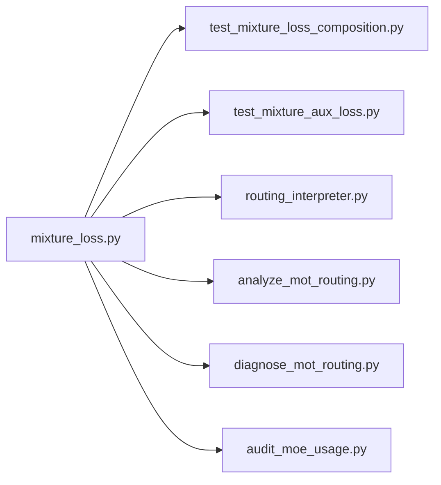

# 路由损失函数

<cite>
**本文引用的文件**
- [mixture_loss.py](file://ultralytics/nn/mixture_loss.py)
- [test_mixture_loss_composition.py](file://tests/test_mixture_loss_composition.py)
- [test_mixture_aux_loss.py](file://tests/test_mixture_aux_loss.py)
- [routing_interpreter.py](file://tools/routing_interpreter.py)
- [analyze_mot_routing.py](file://scripts/analyze_mot_routing.py)
- [diagnose_mot_routing.py](file://scripts/diagnose_mot_routing.py)
- [audit_moe_usage.py](file://scripts/audit_moe_usage.py)
</cite>

## 目录
1. [简介](#简介)
2. [项目结构](#项目结构)
3. [核心组件](#核心组件)
4. [架构总览](#架构总览)
5. [详细组件分析](#详细组件分析)
6. [依赖关系分析](#依赖关系分析)
7. [性能与数值稳定性](#性能与数值稳定性)
8. [故障排查指南](#故障排查指南)
9. [结论](#结论)
10. [附录](#附录)

## 简介
本技术文档聚焦于YOLO-Master中“路由损失函数”的设计与实现，围绕以下目标展开：
- 负载均衡损失函数的设计原理：专家使用频率均衡与负载惩罚项。
- 路由熵正则化的数学基础与强度控制。
- 辅助损失函数如何促进路由学习：路由一致性约束与专家多样性鼓励。
- 不同损失函数的组合策略与权重分配方法。
- 梯度计算与反向传播流程。
- 超参数调优方法与最佳实践。
- 对训练稳定性与收敛速度的影响分析。
- 数值稳定性与梯度爆炸/消失问题的解决方案。

## 项目结构
与路由损失相关的核心代码位于模型网络层与测试脚本中，同时配套工具用于诊断与可视化路由行为。关键位置如下：
- 路由损失主实现：ultralytics/nn/mixture_loss.py
- 路由损失组合与契约测试：tests/test_mixture_loss_composition.py
- 辅助损失相关测试：tests/test_mixture_aux_loss.py
- 路由解释与诊断工具：tools/routing_interpreter.py、scripts/analyze_mot_routing.py、scripts/diagnose_mot_routing.py
- 专家使用审计脚本：scripts/audit_moe_usage.py

图表来源
- [mixture_loss.py](file://ultralytics/nn/mixture_loss.py)
- [test_mixture_loss_composition.py](file://tests/test_mixture_loss_composition.py)
- [test_mixture_aux_loss.py](file://tests/test_mixture_aux_loss.py)
- [routing_interpreter.py](file://tools/routing_interpreter.py)
- [analyze_mot_routing.py](file://scripts/analyze_mot_routing.py)
- [diagnose_mot_routing.py](file://scripts/diagnose_mot_routing.py)
- [audit_moe_usage.py](file://scripts/audit_moe_usage.py)

章节来源
- [mixture_loss.py](file://ultralytics/nn/mixture_loss.py)
- [test_mixture_loss_composition.py](file://tests/test_mixture_loss_composition.py)
- [test_mixture_aux_loss.py](file://tests/test_mixture_aux_loss.py)
- [routing_interpreter.py](file://tools/routing_interpreter.py)
- [analyze_mot_routing.py](file://scripts/analyze_mot_routing.py)
- [diagnose_mot_routing.py](file://scripts/diagnose_mot_routing.py)
- [audit_moe_usage.py](file://scripts/audit_moe_usage.py)

## 核心组件
- 负载均衡损失（Load Balancing Loss）
  - 目标：促使各专家的使用频率趋于均匀，避免少数专家被过度使用。
  - 典型形式：基于专家使用概率分布与理想均匀分布之间的差异构造惩罚项；可结合每批次的软计数统计进行归一化。
  - 关键要点：批次维度聚合、指数移动平均或全局统计的平滑处理、防止稀疏导致的数值不稳定。
- 路由熵正则化（Routing Entropy Regularization）
  - 目标：通过最大化或约束路由输出的熵，鼓励更“分散”的路由选择，提升专家多样性与鲁棒性。
  - 数学基础：离散分布的香农熵；可通过温度系数调节熵的敏感度。
  - 强度控制：引入正则化权重，随训练阶段动态调整（如预热后逐步增大）。
- 辅助损失（Auxiliary Routing Losses）
  - 路由一致性约束：跨层或跨样本的路由分布应保持稳定或满足特定先验。
  - 专家多样性鼓励：限制同一批次内专家选择的重复度，或鼓励不同任务/场景下的差异化路由。
- 组合策略与权重分配
  - 总损失 = 主任务损失 + α·负载均衡损失 + β·路由熵正则 + γ·辅助损失
  - 权重分配建议：主任务优先，辅助项在稳定期逐步增强；采用网格搜索或贝叶斯优化进行超参扫描。

章节来源
- [mixture_loss.py](file://ultralytics/nn/mixture_loss.py)
- [test_mixture_loss_composition.py](file://tests/test_mixture_loss_composition.py)
- [test_mixture_aux_loss.py](file://tests/test_mixture_aux_loss.py)

## 架构总览
下图展示了路由损失在主训练循环中的集成方式与数据流：

图表来源
- [mixture_loss.py](file://ultralytics/nn/mixture_loss.py)
- [test_mixture_loss_composition.py](file://tests/test_mixture_loss_composition.py)

## 详细组件分析

### 负载均衡损失
- 设计动机
  - 在多专家结构中，若缺乏均衡约束，易出现“赢家通吃”，导致部分专家闲置、泛化能力下降。
- 实现要点
  - 统计每个专家在批次内的软使用频率（例如按路由权重求和并归一化）。
  - 与理想均匀分布比较，构造KL散度或平方误差形式的惩罚项。
  - 可选：引入指数移动平均以平滑历史使用信息，降低批次噪声。
- 复杂度与稳定性
  - 时间复杂度与专家数线性相关；需对零计数进行保护，避免除零或对数未定义。
- 常见陷阱
  - 批次过小导致估计偏差大；建议配合EMA或累积统计。
  - 权重过大可能压制主任务学习，需渐进式调度。

图表来源
- [mixture_loss.py](file://ultralytics/nn/mixture_loss.py)

章节来源
- [mixture_loss.py](file://ultralytics/nn/mixture_loss.py)

### 路由熵正则化
- 数学基础
  - 对路由输出分布p，熵H(p)=−∑ p_i log p_i；高熵意味着更均匀的专家选择。
  - 可通过温度τ调节分布尖锐程度，从而控制熵的敏感度。
- 作用机制
  - 作为正则项加入总损失，抑制过拟合到单一专家，提升多样性与鲁棒性。
- 强度控制
  - 初始较小，随训练推进逐步增加；也可根据验证集指标自适应调整。
- 数值考虑
  - 对极小概率值进行裁剪或加ε，避免log(0)。

图表来源
- [mixture_loss.py](file://ultralytics/nn/mixture_loss.py)

章节来源
- [mixture_loss.py](file://ultralytics/nn/mixture_loss.py)

### 辅助损失：路由一致性与多样性
- 路由一致性约束
  - 目标：使相邻层或相近样本的路由分布保持连贯，减少抖动。
  - 实现思路：对连续层的路由分布施加对齐损失（如KL或余弦相似度），或在时间序列上约束变化幅度。
- 专家多样性鼓励
  - 目标：在同一批次或跨任务中，避免所有样本都路由到相同专家集合。
  - 实现思路：对批次内专家选择分布的方差进行惩罚，或引入互信息最小化以降低冗余。
- 与主任务的协同
  - 辅助损失通常较弱且阶段性启用，确保不干扰主任务收敛。

图表来源
- [mixture_loss.py](file://ultralytics/nn/mixture_loss.py)
- [test_mixture_aux_loss.py](file://tests/test_mixture_aux_loss.py)

章节来源
- [mixture_loss.py](file://ultralytics/nn/mixture_loss.py)
- [test_mixture_aux_loss.py](file://tests/test_mixture_aux_loss.py)

### 组合策略与权重分配
- 总损失构成
  - 总损失 = 主任务损失 + α·负载均衡 + β·熵正则 + γ·辅助损失
- 权重分配建议
  - 初期：α、β、γ较小，保证主任务快速收敛。
  - 中期：逐步增大α、β，提升均衡与多样性。
  - 后期：维持或微调，避免破坏已学得的表征。
- 自动化搜索
  - 可使用网格搜索或贝叶斯优化在验证集上评估不同权重组合。

图表来源
- [test_mixture_loss_composition.py](file://tests/test_mixture_loss_composition.py)

章节来源
- [test_mixture_loss_composition.py](file://tests/test_mixture_loss_composition.py)

### 梯度计算与反向传播
- 梯度来源
  - 主任务损失对路由参数的直接梯度。
  - 负载均衡与熵正则对路由权重的间接梯度，通过路由分支回传。
- 数值稳定技巧
  - 对概率进行裁剪（如[ε, 1−ε]），避免log(0)与除零。
  - 对极端小的软计数加ε，防止梯度爆炸。
- 反向传播路径
  - 路由分支→负载均衡/熵/辅助项→总损失→优化器更新。

图表来源
- [mixture_loss.py](file://ultralytics/nn/mixture_loss.py)

章节来源
- [mixture_loss.py](file://ultralytics/nn/mixture_loss.py)

## 依赖关系分析
- 内部依赖
  - mixture_loss.py为路由损失的核心实现，被测试与诊断工具引用。
  - 测试用例覆盖组合策略与辅助损失的契约与边界条件。
- 外部依赖
  - 依赖PyTorch张量运算与自动微分；注意分布式环境下的规约操作（如all-reduce）的正确性。
- 耦合与内聚
  - 路由损失模块应保持高内聚（仅关注路由相关损失），低耦合（通过接口暴露统计量与损失项）。

图表来源
- [mixture_loss.py](file://ultralytics/nn/mixture_loss.py)
- [test_mixture_loss_composition.py](file://tests/test_mixture_loss_composition.py)
- [test_mixture_aux_loss.py](file://tests/test_mixture_aux_loss.py)
- [routing_interpreter.py](file://tools/routing_interpreter.py)
- [analyze_mot_routing.py](file://scripts/analyze_mot_routing.py)
- [diagnose_mot_routing.py](file://scripts/diagnose_mot_routing.py)
- [audit_moe_usage.py](file://scripts/audit_moe_usage.py)

章节来源
- [mixture_loss.py](file://ultralytics/nn/mixture_loss.py)
- [test_mixture_loss_composition.py](file://tests/test_mixture_loss_composition.py)
- [test_mixture_aux_loss.py](file://tests/test_mixture_aux_loss.py)
- [routing_interpreter.py](file://tools/routing_interpreter.py)
- [analyze_mot_routing.py](file://scripts/analyze_mot_routing.py)
- [diagnose_mot_routing.py](file://scripts/diagnose_mot_routing.py)
- [audit_moe_usage.py](file://scripts/audit_moe_usage.py)

## 性能与数值稳定性
- 性能特性
  - 负载均衡与熵正则的计算开销与专家数量线性相关；建议在大规模专家时采用近似或采样策略。
  - 辅助损失的对齐与多样性计算应避免全矩阵操作，尽量使用向量化的批次级统计。
- 数值稳定性
  - 对概率与软计数进行裁剪与加ε，防止log(0)、除零与NaN。
  - 在分布式训练中，确保统计量的规约正确，避免跨设备不一致。
- 梯度爆炸/消失
  - 对路由分支引入梯度裁剪；对熵正则权重进行上限控制。
  - 使用稳定的softmax实现与数值安全的log-sum-exp技巧。

章节来源
- [mixture_loss.py](file://ultralytics/nn/mixture_loss.py)

## 故障排查指南
- 常见问题
  - 路由崩溃：某专家独占，其他专家几乎不被使用。
    - 检查负载均衡权重是否过小；适当增大α。
    - 查看软计数是否出现大量零值，必要时引入EMA平滑。
  - 训练不稳定：损失震荡或NaN。
    - 检查熵正则是否过大导致分布过于平坦；减小β或提高温度τ。
    - 确认概率裁剪与ε设置合理。
  - 辅助损失无效：一致性/多样性未见改善。
    - 检查辅助损失权重γ是否过小；逐步增大并观察验证指标。
- 诊断工具
  - 使用路由解释器与诊断脚本分析专家使用分布、路由一致性与时序变化。
  - 使用审计脚本统计长期专家使用情况，识别偏斜与冷启动问题。

章节来源
- [routing_interpreter.py](file://tools/routing_interpreter.py)
- [analyze_mot_routing.py](file://scripts/analyze_mot_routing.py)
- [diagnose_mot_routing.py](file://scripts/diagnose_mot_routing.py)
- [audit_moe_usage.py](file://scripts/audit_moe_usage.py)

## 结论
路由损失函数在YOLO-Master的多专家架构中扮演关键角色：通过负载均衡、熵正则与辅助损失，有效缓解专家偏斜、提升多样性与鲁棒性。合理的组合策略与权重调度可显著提升训练稳定性与收敛速度。实践中需重视数值稳定性与分布式规约细节，并结合诊断工具持续监控路由行为。

## 附录
- 超参数调优建议
  - 初始权重：α≈0.01–0.1，β≈0.01–0.1，γ≈0.01–0.1。
  - 温度τ：从1.0开始，视分布尖锐程度调整。
  - ε裁剪：1e-6至1e-4范围。
- 最佳实践
  - 预热阶段禁用或弱化辅助损失，待主任务稳定后再逐步增强。
  - 定期评估专家使用分布，发现偏斜及时干预。
  - 在分布式环境中，统一统计口径，避免设备间差异。