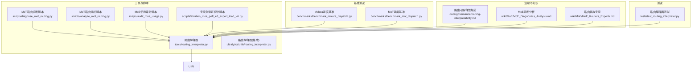
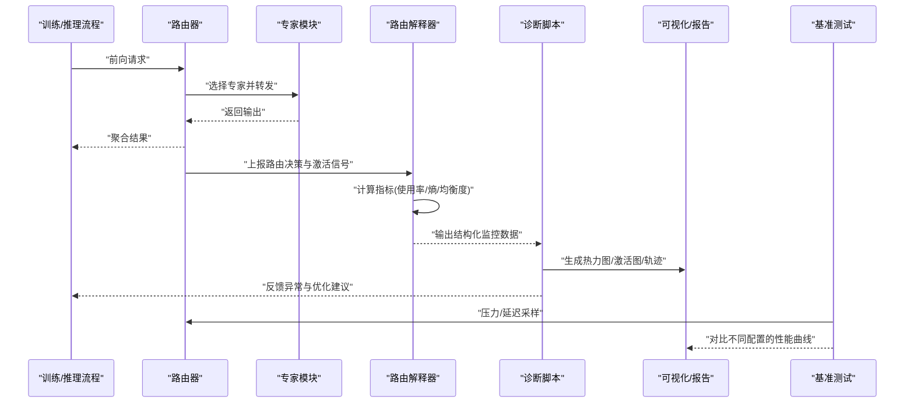
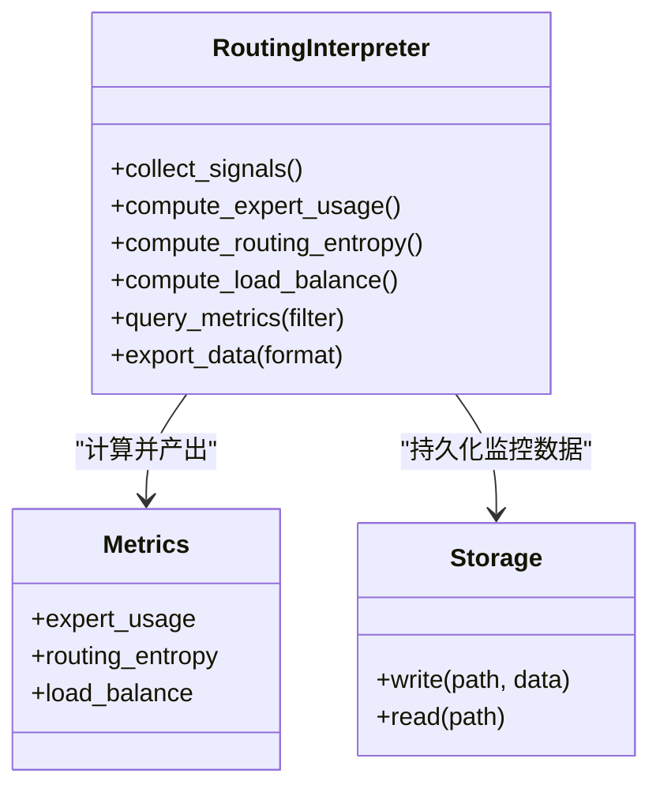
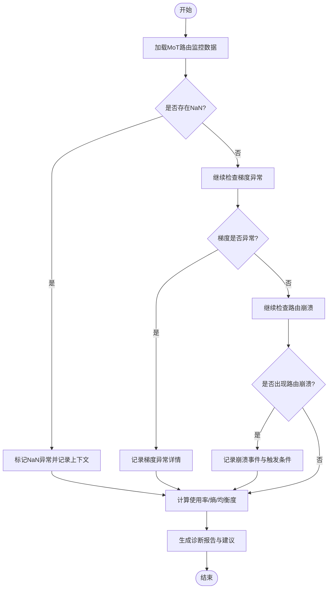
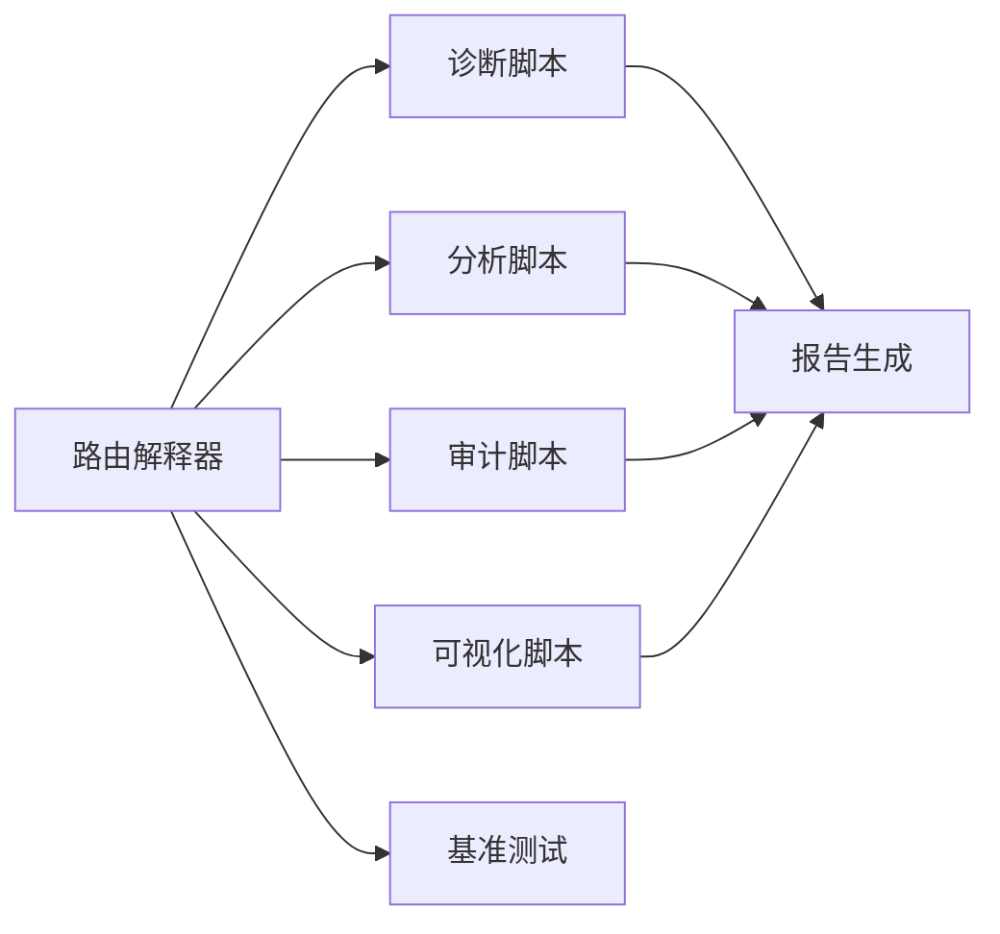

# 路由诊断与监控

<cite>
**本文引用的文件**
- [routing_interpreter.py](file://tools/routing_interpreter.py)
- [routing_interpreter.py](file://ultralytics/utils/routing_interpreter.py)
- [test_routing_interpreter.py](file://tests/test_routing_interpreter.py)
- [diagnose_mot_routing.py](file://scripts/diagnose_mot_routing.py)
- [analyze_mot_routing.py](file://scripts/analyze_mot_routing.py)
- [audit_moe_usage.py](file://scripts/audit_moe_usage.py)
- [ablation_moe_peft_e3_expert_load_viz.py](file://scripts/ablation_moe_peft_e3_expert_load_viz.py)
- [debug-router-nan-activations.md](file://debug-router-nan-activations.md)
- [governance/routing-interpretability.md](file://docs/governance/routing-interpretability.md)
- [wiki/MoE/MoE_Diagnostics_Analysis.md](file://wiki/MoE/MoE_Diagnostics_Analysis.md)
- [wiki/MoE/MoE_Routers_Experts.md](file://wiki/MoE/MoE_Routers_Experts.md)
- [benchmark_molora_dispatch.py](file://benchmarks/benchmark_molora_dispatch.py)
- [benchmark_mot_dispatch.py](file://benchmarks/benchmark_mot_dispatch.py)
</cite>

## 目录
1. [简介](#简介)
2. [项目结构](#项目结构)
3. [核心组件](#核心组件)
4. [架构总览](#架构总览)
5. [详细组件分析](#详细组件分析)
6. [依赖关系分析](#依赖关系分析)
7. [性能考量](#性能考量)
8. [故障排查指南](#故障排查指南)
9. [结论](#结论)
10. [附录](#附录)

## 简介
本技术文档面向YOLO-Master的路由诊断与监控系统，聚焦于以下目标：
- 解释路由性能指标的收集与分析方法，包括专家使用率、路由熵与负载均衡度。
- 说明路由行为可视化工具（热力图、专家激活图、路由轨迹分析）的使用方法。
- 阐述异常检测机制（NaN值检测、梯度异常、路由崩溃识别）。
- 描述监控数据的存储格式与查询接口。
- 提供诊断报告生成工具的使用说明。
- 给出瓶颈分析与优化建议。
- 介绍调试工具与交互式分析界面。
- 说明路由监控数据在模型优化中的作用与应用场景。

## 项目结构
与“路由诊断与监控”相关的代码与文档主要分布在如下位置：
- 工具层：路由解释器与诊断脚本
- 基准测试：调度与路由性能基准
- 治理与Wiki：指标定义、方法论与最佳实践
- 测试：契约与稳定性验证

图表来源
- [routing_interpreter.py](file://tools/routing_interpreter.py)
- [routing_interpreter.py](file://ultralytics/utils/routing_interpreter.py)
- [diagnose_mot_routing.py](file://scripts/diagnose_mot_routing.py)
- [analyze_mot_routing.py](file://scripts/analyze_mot_routing.py)
- [audit_moe_usage.py](file://scripts/audit_moe_usage.py)
- [ablation_moe_peft_e3_expert_load_viz.py](file://scripts/ablation_moe_peft_e3_expert_load_viz.py)
- [benchmark_molora_dispatch.py](file://benchmarks/benchmark_molora_dispatch.py)
- [benchmark_mot_dispatch.py](file://benchmarks/benchmark_mot_dispatch.py)
- [governance/routing-interpretability.md](file://docs/governance/routing-interpretability.md)
- [wiki/MoE/MoE_Diagnostics_Analysis.md](file://wiki/MoE/MoE_Diagnostics_Analysis.md)
- [wiki/MoE/MoE_Routers_Experts.md](file://wiki/MoE/MoE_Routers_Experts.md)
- [test_routing_interpreter.py](file://tests/test_routing_interpreter.py)

章节来源
- [routing_interpreter.py](file://tools/routing_interpreter.py)
- [routing_interpreter.py](file://ultralytics/utils/routing_interpreter.py)
- [diagnose_mot_routing.py](file://scripts/diagnose_mot_routing.py)
- [analyze_mot_routing.py](file://scripts/analyze_mot_routing.py)
- [audit_moe_usage.py](file://scripts/audit_moe_usage.py)
- [ablation_moe_peft_e3_expert_load_viz.py](file://scripts/ablation_moe_peft_e3_expert_load_viz.py)
- [benchmark_molora_dispatch.py](file://benchmarks/benchmark_molora_dispatch.py)
- [benchmark_mot_dispatch.py](file://benchmarks/benchmark_mot_dispatch.py)
- [governance/routing-interpretability.md](file://docs/governance/routing-interpretability.md)
- [wiki/MoE/MoE_Diagnostics_Analysis.md](file://wiki/MoE/MoE_Diagnostics_Analysis.md)
- [wiki/MoE/MoE_Routers_Experts.md](file://wiki/MoE/MoE_Routers_Experts.md)
- [test_routing_interpreter.py](file://tests/test_routing_interpreter.py)

## 核心组件
- 路由解释器（Routing Interpreter）
  - 负责从训练/推理过程中采集路由决策、专家激活、权重分布等信号，并计算关键指标（专家使用率、路由熵、负载均衡度），输出结构化结果供后续可视化与诊断使用。
  - 提供统一的数据结构与查询接口，便于跨模块复用。
- MoT路由诊断脚本
  - 针对多目标跟踪（MoT）场景的路由行为进行专项诊断，包含异常检测、统计汇总与问题定位。
- MoT路由分析脚本
  - 对历史或批处理数据进行深度分析，产出趋势、热点与退化信号。
- MoE使用审计脚本
  - 对专家使用情况进行审计，识别长期闲置或过载的专家，辅助剪枝与再平衡策略。
- 专家负载可视化脚本
  - 将专家激活与使用率转化为可视化图表，支持热力图与时间序列展示。
- 基准测试套件
  - 针对Molora与MoT调度路径的性能基准，用于评估不同路由策略与配置下的吞吐与时延。

章节来源
- [routing_interpreter.py](file://tools/routing_interpreter.py)
- [routing_interpreter.py](file://ultralytics/utils/routing_interpreter.py)
- [diagnose_mot_routing.py](file://scripts/diagnose_mot_routing.py)
- [analyze_mot_routing.py](file://scripts/analyze_mot_routing.py)
- [audit_moe_usage.py](file://scripts/audit_moe_usage.py)
- [ablation_moe_peft_e3_expert_load_viz.py](file://scripts/ablation_moe_peft_e3_expert_load_viz.py)
- [benchmark_molora_dispatch.py](file://benchmarks/benchmark_molora_dispatch.py)
- [benchmark_mot_dispatch.py](file://benchmarks/benchmark_mot_dispatch.py)

## 架构总览
下图展示了路由诊断与监控的整体架构：数据采集（解释器）、指标计算、异常检测、可视化与报告生成、以及基准评测之间的交互关系。

图表来源
- [routing_interpreter.py](file://tools/routing_interpreter.py)
- [diagnose_mot_routing.py](file://scripts/diagnose_mot_routing.py)
- [ablation_moe_peft_e3_expert_load_viz.py](file://scripts/ablation_moe_peft_e3_expert_load_viz.py)
- [benchmark_molora_dispatch.py](file://benchmarks/benchmark_molora_dispatch.py)
- [benchmark_mot_dispatch.py](file://benchmarks/benchmark_mot_dispatch.py)

## 详细组件分析

### 路由解释器（Routing Interpreter）
职责与能力
- 采集路由决策、专家激活、权重分布等原始信号。
- 计算关键指标：
  - 专家使用率：各专家被选中的频率分布。
  - 路由熵：衡量路由分布的均匀性与不确定性。
  - 负载均衡度：基于使用率分布的均衡程度度量。
- 提供统一数据结构与查询接口，支持按层、批次、时间窗口聚合。

图表来源
- [routing_interpreter.py](file://tools/routing_interpreter.py)
- [routing_interpreter.py](file://ultralytics/utils/routing_interpreter.py)

章节来源
- [routing_interpreter.py](file://tools/routing_interpreter.py)
- [routing_interpreter.py](file://ultralytics/utils/routing_interpreter.py)
- [test_routing_interpreter.py](file://tests/test_routing_interpreter.py)

### MoT路由诊断脚本
功能要点
- 针对MoT场景的路由行为进行专项诊断，包括：
  - 异常检测：NaN值检测、梯度异常、路由崩溃识别。
  - 统计汇总：专家使用率、路由熵、负载均衡度的时序变化。
  - 问题定位：结合场景特征与样本难度，定位退化原因。

图表来源
- [diagnose_mot_routing.py](file://scripts/diagnose_mot_routing.py)
- [debug-router-nan-activations.md](file://debug-router-nan-activations.md)

章节来源
- [diagnose_mot_routing.py](file://scripts/diagnose_mot_routing.py)
- [debug-router-nan-activations.md](file://debug-router-nan-activations.md)

### MoT路由分析脚本
功能要点
- 对历史或批处理数据进行深度分析，产出：
  - 趋势分析：指标随时间的演化。
  - 热点识别：高负载专家与热点样本区域。
  - 退化信号：熵升高、均衡度下降等预警。

章节来源
- [analyze_mot_routing.py](file://scripts/analyze_mot_routing.py)

### MoE使用审计脚本
功能要点
- 审计专家使用情况，识别：
  - 长期闲置专家：使用率接近零，考虑剪枝或冻结。
  - 过载专家：使用率过高，需引入再平衡或容量扩展。
- 输出审计报表，为动态调度与剪枝策略提供依据。

章节来源
- [audit_moe_usage.py](file://scripts/audit_moe_usage.py)

### 专家负载可视化脚本
功能要点
- 将专家激活与使用率转化为可视化图表：
  - 热力图：专家×样本/时间维度的激活强度。
  - 专家激活图：特定样本在各层的专家激活分布。
  - 路由轨迹分析：单个样本在多层的路径追踪。

章节来源
- [ablation_moe_peft_e3_expert_load_viz.py](file://scripts/ablation_moe_peft_e3_expert_load_viz.py)

### 基准测试套件
功能要点
- Molora调度基准：评估不同路由策略与配置下的吞吐与时延。
- MoT调度基准：针对多目标跟踪场景的端到端性能评估。
- 输出对比曲线与统计摘要，辅助策略选择与参数调优。

章节来源
- [benchmark_molora_dispatch.py](file://benchmarks/benchmark_molora_dispatch.py)
- [benchmark_mot_dispatch.py](file://benchmarks/benchmark_mot_dispatch.py)

## 依赖关系分析
- 组件耦合
  - 路由解释器作为核心枢纽，向上游（训练/推理）采集信号，向下游（诊断/可视化/基准）提供指标与数据。
  - 诊断与分析脚本依赖解释器的输出，形成稳定的数据契约。
- 外部依赖
  - 基准测试依赖调度实现与硬件环境，关注吞吐与时延。
  - 可视化与报告生成依赖数据处理与绘图库。
- 潜在循环依赖
  - 通过明确的数据契约与接口隔离，避免解释器与诊断脚本之间的直接双向依赖。

图表来源
- [routing_interpreter.py](file://tools/routing_interpreter.py)
- [diagnose_mot_routing.py](file://scripts/diagnose_mot_routing.py)
- [analyze_mot_routing.py](file://scripts/analyze_mot_routing.py)
- [audit_moe_usage.py](file://scripts/audit_moe_usage.py)
- [ablation_moe_peft_e3_expert_load_viz.py](file://scripts/ablation_moe_peft_e3_expert_load_viz.py)
- [benchmark_molora_dispatch.py](file://benchmarks/benchmark_molora_dispatch.py)
- [benchmark_mot_dispatch.py](file://benchmarks/benchmark_mot_dispatch.py)

章节来源
- [routing_interpreter.py](file://tools/routing_interpreter.py)
- [diagnose_mot_routing.py](file://scripts/diagnose_mot_routing.py)
- [analyze_mot_routing.py](file://scripts/analyze_mot_routing.py)
- [audit_moe_usage.py](file://scripts/audit_moe_usage.py)
- [ablation_moe_peft_e3_expert_load_viz.py](file://scripts/ablation_moe_peft_e3_expert_load_viz.py)
- [benchmark_molora_dispatch.py](file://benchmarks/benchmark_molora_dispatch.py)
- [benchmark_mot_dispatch.py](file://benchmarks/benchmark_mot_dispatch.py)

## 性能考量
- 指标计算开销
  - 路由熵与负载均衡度涉及概率分布计算，建议在批量聚合时采用向量化操作以降低开销。
- 存储与查询
  - 监控数据按层、批次、时间窗口组织，建议使用列式存储或索引以加速查询。
- 基准评测
  - 在不同硬件与批大小下运行基准，关注吞吐与时延的权衡；结合路由策略对比，识别最优配置。

[本节为通用指导，不直接分析具体文件]

## 故障排查指南
- NaN值检测
  - 在路由决策与专家激活中检测NaN，记录上下文（输入形状、设备、精度模式），快速定位数值不稳定来源。
- 梯度异常
  - 监控梯度范数与稀疏性，发现爆炸或消失迹象，结合学习率与正则化策略调整。
- 路由崩溃识别
  - 当路由熵急剧上升且负载均衡度显著下降时，可能指示路由崩溃；需要检查温度系数、门控网络稳定性与专家容量。
- 参考文档
  - 使用治理与Wiki文档中的方法论与阈值建议，辅助判断与修复。

章节来源
- [debug-router-nan-activations.md](file://debug-router-nan-activations.md)
- [governance/routing-interpretability.md](file://docs/governance/routing-interpretability.md)
- [wiki/MoE/MoE_Diagnostics_Analysis.md](file://wiki/MoE/MoE_Diagnostics_Analysis.md)
- [wiki/MoE/MoE_Routers_Experts.md](file://wiki/MoE/MoE_Routers_Experts.md)

## 结论
路由诊断与监控系统通过统一的数据采集、指标计算、异常检测与可视化，为YOLO-Master的MoE/MoT路由提供了完整的可观测性与可解释性。借助基准测试与审计工具，可在工程实践中持续优化路由策略与专家配置，提升整体性能与稳定性。

[本节为总结性内容，不直接分析具体文件]

## 附录

### 指标定义与计算方法
- 专家使用率
  - 定义：各专家被选中的频率分布。
  - 用途：识别过载与闲置专家，指导剪枝与再平衡。
- 路由熵
  - 定义：路由概率分布的香农熵，反映分布的均匀性与不确定性。
  - 用途：监测路由退化与崩溃风险。
- 负载均衡度
  - 定义：基于使用率分布的均衡程度度量（如Gini系数或方差归一化）。
  - 用途：评估系统资源利用效率。

章节来源
- [governance/routing-interpretability.md](file://docs/governance/routing-interpretability.md)
- [wiki/MoE/MoE_Diagnostics_Analysis.md](file://wiki/MoE/MoE_Diagnostics_Analysis.md)
- [wiki/MoE/MoE_Routers_Experts.md](file://wiki/MoE/MoE_Routers_Experts.md)

### 数据存储格式与查询接口
- 存储格式
  - 结构化字段：层号、批次ID、时间戳、专家ID、激活强度、路由概率、指标值。
  - 组织方式：按层与时间窗口聚合，支持列式存储与索引。
- 查询接口
  - 过滤条件：层范围、时间窗口、专家集合、指标阈值。
  - 聚合操作：均值、方差、分位数、时序平滑。
  - 导出格式：JSON/CSV/Parquet，便于下游工具消费。

章节来源
- [routing_interpreter.py](file://tools/routing_interpreter.py)
- [routing_interpreter.py](file://ultralytics/utils/routing_interpreter.py)

### 诊断报告生成工具使用方法
- 输入：路由监控数据（结构化文件）
- 步骤：
  - 加载数据并进行异常检测（NaN、梯度、崩溃）。
  - 计算指标（使用率、熵、均衡度）并生成趋势图。
  - 输出报告（PDF/HTML），包含问题定位与优化建议。
- 输出：诊断报告与可视化图表

章节来源
- [diagnose_mot_routing.py](file://scripts/diagnose_mot_routing.py)
- [analyze_mot_routing.py](file://scripts/analyze_mot_routing.py)

### 路由调试工具与交互式分析界面
- 调试工具
  - 单样本路由轨迹追踪：查看某样本在多层的路径与激活。
  - 专家激活图：对比不同样本在同一层的激活差异。
- 交互式界面
  - 支持筛选层、专家、时间窗口，实时渲染热力图与曲线。
  - 提供异常标注与回放功能，辅助问题复现与修复。

章节来源
- [ablation_moe_peft_e3_expert_load_viz.py](file://scripts/ablation_moe_peft_e3_expert_load_viz.py)

### 路由监控数据在模型优化中的作用与应用场景
- 作用
  - 指导路由策略调参（温度系数、门控网络结构）。
  - 驱动专家剪枝与容量扩展，提升资源利用率。
  - 支撑动态调度策略，降低尾延迟。
- 应用场景
  - 训练阶段：实时监控与早停策略。
  - 推理阶段：在线诊断与自适应路由。
  - 部署阶段：性能回归检测与容量规划。

章节来源
- [benchmark_molora_dispatch.py](file://benchmarks/benchmark_molora_dispatch.py)
- [benchmark_mot_dispatch.py](file://benchmarks/benchmark_mot_dispatch.py)
- [audit_moe_usage.py](file://scripts/audit_moe_usage.py)