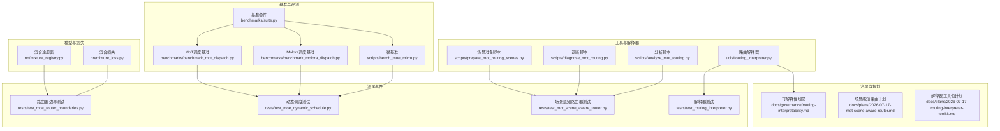
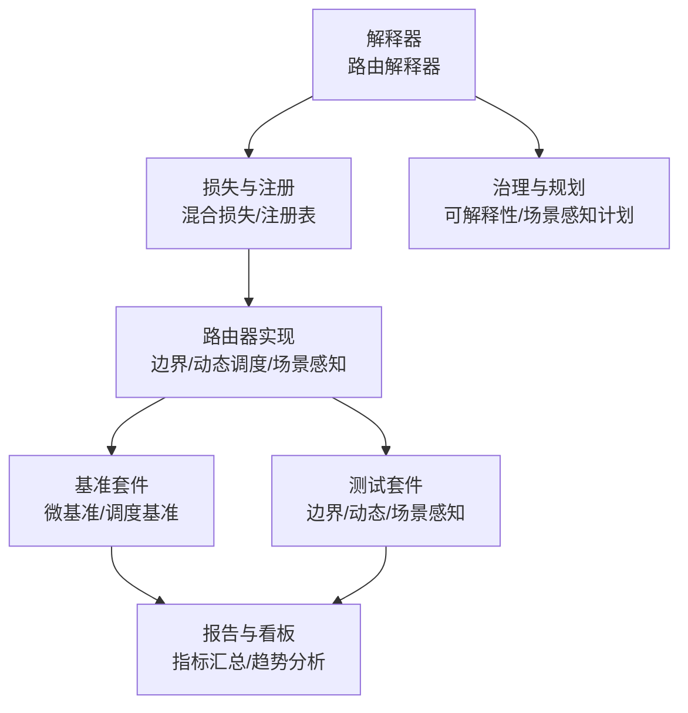
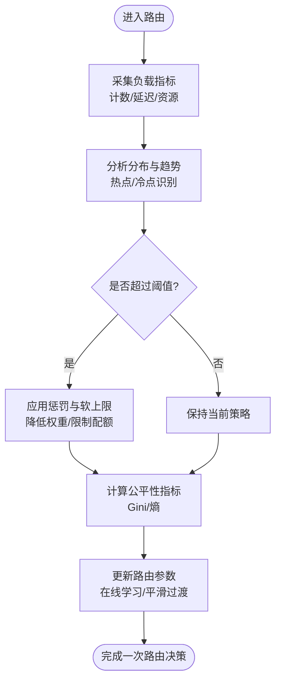
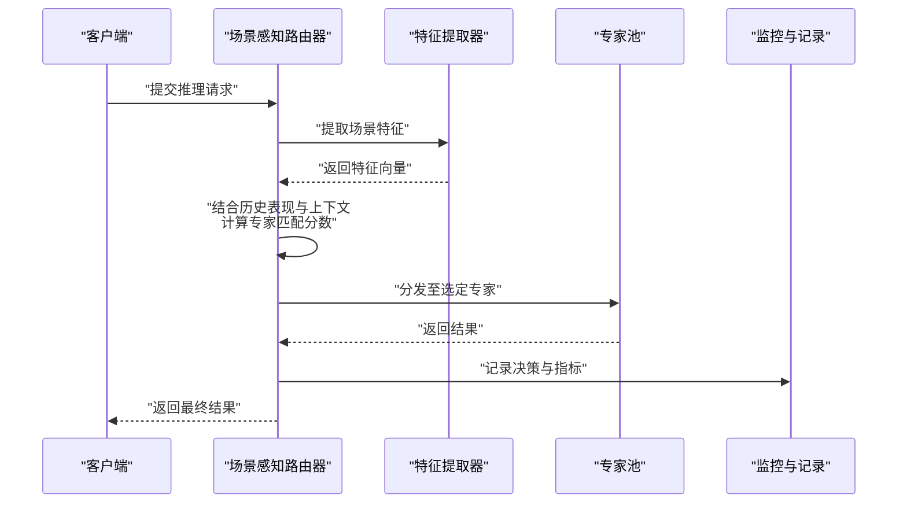
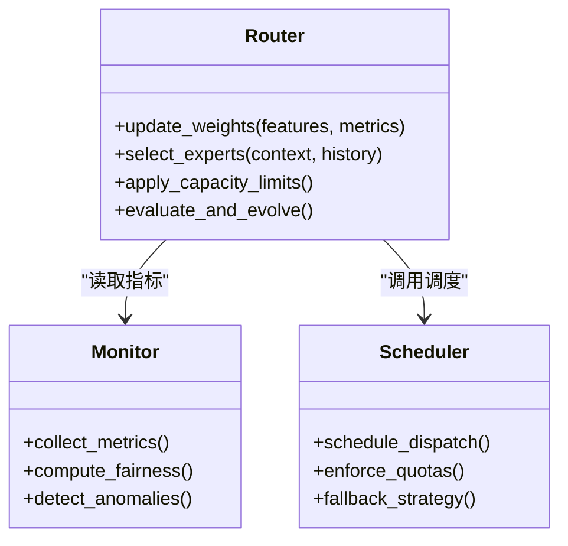
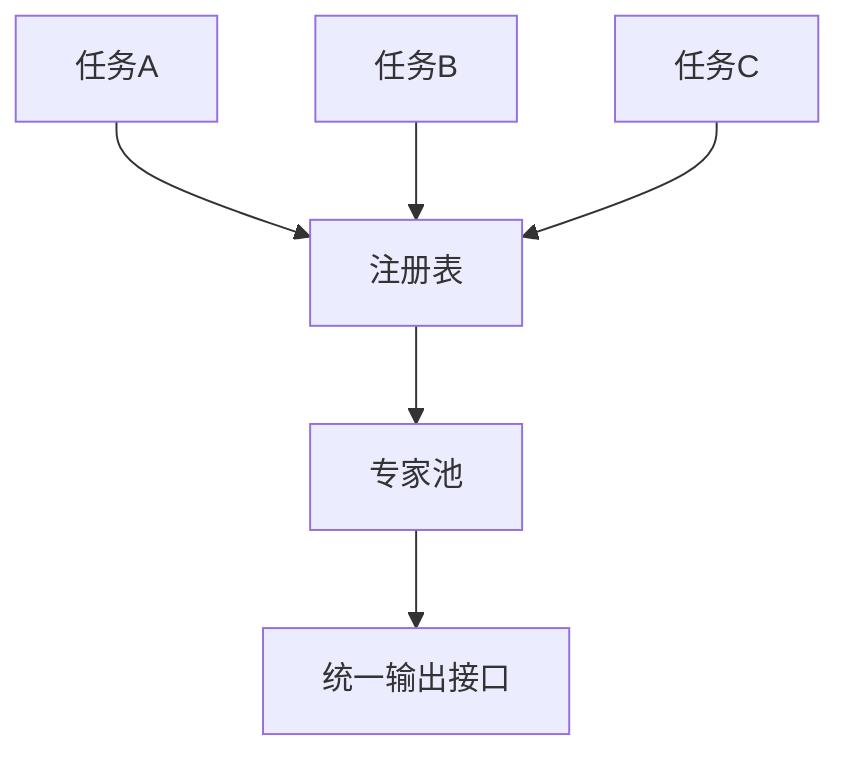
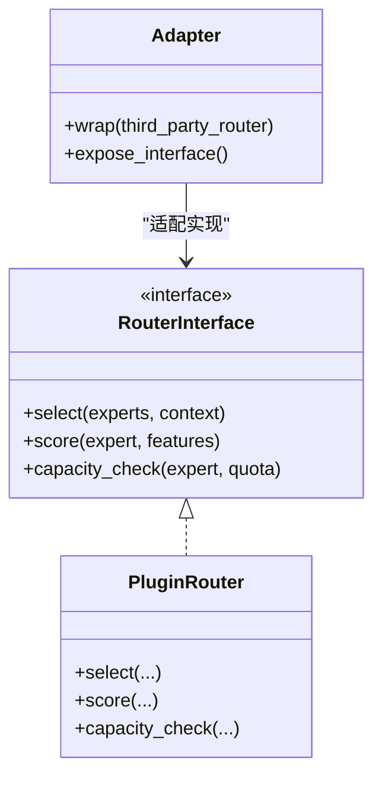
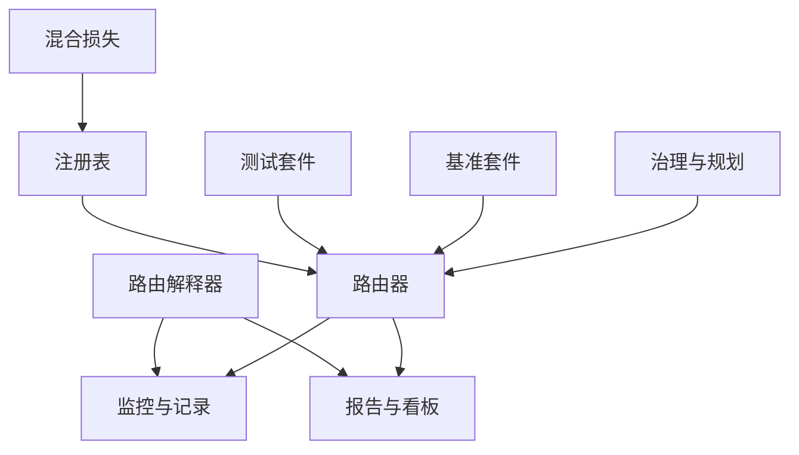

# 高级路由策略

<cite>
**本文引用的文件**
- [routing_interpreter.py](file://ultralytics/utils/routing_interpreter.py)
- [test_routing_interpreter.py](file://tests/test_routing_interpreter.py)
- [mixture_loss.py](file://ultralytics/nn/mixture_loss.py)
- [mixture_registry.py](file://ultralytics/nn/mixture_registry.py)
- [test_moe_router_boundaries.py](file://tests/test_moe_router_boundaries.py)
- [test_moe_dynamic_schedule.py](file://tests/test_moe_dynamic_schedule.py)
- [test_mot_scene_aware_router.py](file://tests/test_mot_scene_aware_router.py)
- [analyze_mot_routing.py](file://scripts/analyze_mot_routing.py)
- [diagnose_mot_routing.py](file://scripts/diagnose_mot_routing.py)
- [prepare_mot_routing_scenes.py](file://scripts/prepare_mot_routing_scenes.py)
- [bench_moe_micro.py](file://scripts/bench_moe_micro.py)
- [benchmark_molora_dispatch.py](file://benchmarks/benchmark_molora_dispatch.py)
- [benchmark_mot_dispatch.py](file://benchmarks/benchmark_mot_dispatch.py)
- [suite.py](file://benchmarks/suite.py)
- [governance/routing-interpretability.md](file://docs/governance/routing-interpretability.md)
- [plans/2026-07-17-mot-scene-aware-router.md](file://docs/plans/2026-07-17-mot-scene-aware-router.md)
- [plans/2026-07-17-routing-interpreter-toolkit.md](file://docs/plans/2026-07-17-routing-interpreter-toolkit.md)
</cite>

## 目录
1. [简介](#简介)
2. [项目结构](#项目结构)
3. [核心组件](#核心组件)
4. [架构总览](#架构总览)
5. [详细组件分析](#详细组件分析)
6. [依赖关系分析](#依赖关系分析)
7. [性能考量](#性能考量)
8. [故障排查指南](#故障排查指南)
9. [结论](#结论)
10. [附录](#附录)

## 简介
本技术文档聚焦于YOLO-Master的高级路由策略，围绕负载均衡、场景感知、动态调整、多任务共享与可插拔架构展开。文档从系统架构、数据流、处理逻辑、集成点、错误处理与性能特性等维度进行系统化阐述，并提供配置方法、调优建议、评估指标以及稳定性与收敛性保证的说明，帮助读者在工程实践中高效落地并持续优化路由策略。

## 项目结构
与“高级路由策略”直接相关的代码与文档主要分布在以下位置：
- 工具与解释器：路由解释器与诊断脚本
- 模型与损失：混合专家（MoE）相关模块与注册表
- 测试套件：边界条件、动态调度、场景感知路由器验证
- 基准与评测：微基准、调度基准与综合套件
- 治理与规划：可解释性与场景感知路由设计文档

图表来源
- [routing_interpreter.py](file://ultralytics/utils/routing_interpreter.py)
- [mixture_loss.py](file://ultralytics/nn/mixture_loss.py)
- [mixture_registry.py](file://ultralytics/nn/mixture_registry.py)
- [test_moe_router_boundaries.py](file://tests/test_moe_router_boundaries.py)
- [test_moe_dynamic_schedule.py](file://tests/test_moe_dynamic_schedule.py)
- [test_mot_scene_aware_router.py](file://tests/test_mot_scene_aware_router.py)
- [test_routing_interpreter.py](file://tests/test_routing_interpreter.py)
- [analyze_mot_routing.py](file://scripts/analyze_mot_routing.py)
- [diagnose_mot_routing.py](file://scripts/diagnose_mot_routing.py)
- [prepare_mot_routing_scenes.py](file://scripts/prepare_mot_routing_scenes.py)
- [bench_moe_micro.py](file://scripts/bench_moe_micro.py)
- [benchmark_molora_dispatch.py](file://benchmarks/benchmark_molora_dispatch.py)
- [benchmark_mot_dispatch.py](file://benchmarks/benchmark_mot_dispatch.py)
- [suite.py](file://benchmarks/suite.py)
- [governance/routing-interpretability.md](file://docs/governance/routing-interpretability.md)
- [plans/2026-07-17-mot-scene-aware-router.md](file://docs/plans/2026-07-17-mot-scene-aware-router.md)
- [plans/2026-07-17-routing-interpreter-toolkit.md](file://docs/plans/2026-07-17-routing-interpreter-toolkit.md)

章节来源
- [routing_interpreter.py](file://ultralytics/utils/routing_interpreter.py)
- [mixture_loss.py](file://ultralytics/nn/mixture_loss.py)
- [mixture_registry.py](file://ultralytics/nn/mixture_registry.py)
- [test_moe_router_boundaries.py](file://tests/test_moe_router_boundaries.py)
- [test_moe_dynamic_schedule.py](file://tests/test_moe_dynamic_schedule.py)
- [test_mot_scene_aware_router.py](file://tests/test_mot_scene_aware_router.py)
- [test_routing_interpreter.py](file://tests/test_routing_interpreter.py)
- [analyze_mot_routing.py](file://scripts/analyze_mot_routing.py)
- [diagnose_mot_routing.py](file://scripts/diagnose_mot_routing.py)
- [prepare_mot_routing_scenes.py](file://scripts/prepare_mot_routing_scenes.py)
- [bench_moe_micro.py](file://scripts/bench_moe_micro.py)
- [benchmark_molora_dispatch.py](file://benchmarks/benchmark_molora_dispatch.py)
- [benchmark_mot_dispatch.py](file://benchmarks/benchmark_mot_dispatch.py)
- [suite.py](file://benchmarks/suite.py)
- [governance/routing-interpretability.md](file://docs/governance/routing-interpretability.md)
- [plans/2026-07-17-mot-scene-aware-router.md](file://docs/plans/2026-07-17-mot-scene-aware-router.md)
- [plans/2026-07-17-routing-interpreter-toolkit.md](file://docs/plans/2026-07-17-routing-interpreter-toolkit.md)

## 核心组件
- 路由解释器：提供对路由决策的可解释性分析与可视化能力，支持统计摘要、分布对比与异常检测，便于定位负载倾斜与公平性问题。
- 混合损失与注册表：为多任务与多专家组合提供统一的损失组合与模块注册机制，支撑多任务路由的资源共享与策略演化。
- 路由器边界与动态调度测试：覆盖路由器的边界条件、容量约束与在线调整策略，确保负载均衡与公平性的工程实现正确性。
- 场景感知路由器测试与分析：面向多目标跟踪（MoT）等复杂场景，验证基于输入特征的自适应路由决策与在线学习机制。
- 基准套件：提供微基准与调度基准，用于量化吞吐、延迟、负载分布与公平性指标，指导策略调优与回归验证。

章节来源
- [routing_interpreter.py](file://ultralytics/utils/routing_interpreter.py)
- [mixture_loss.py](file://ultralytics/nn/mixture_loss.py)
- [mixture_registry.py](file://ultralytics/nn/mixture_registry.py)
- [test_moe_router_boundaries.py](file://tests/test_moe_router_boundaries.py)
- [test_moe_dynamic_schedule.py](file://tests/test_moe_dynamic_schedule.py)
- [test_mot_scene_aware_router.py](file://tests/test_mot_scene_aware_router.py)
- [bench_moe_micro.py](file://scripts/bench_moe_micro.py)
- [benchmark_molora_dispatch.py](file://benchmarks/benchmark_molora_dispatch.py)
- [benchmark_mot_dispatch.py](file://benchmarks/benchmark_mot_dispatch.py)
- [suite.py](file://benchmarks/suite.py)

## 架构总览
高级路由策略由“解释器—损失/注册—测试—基准—治理/规划”五层构成，形成闭环：解释器输出洞察驱动损失与注册表的策略演化；测试保障边界与动态调整的鲁棒性；基准提供量化评估；治理与规划明确可解释性与场景感知的设计原则。

图表来源
- [routing_interpreter.py](file://ultralytics/utils/routing_interpreter.py)
- [mixture_loss.py](file://ultralytics/nn/mixture_loss.py)
- [mixture_registry.py](file://ultralytics/nn/mixture_registry.py)
- [test_moe_router_boundaries.py](file://tests/test_moe_router_boundaries.py)
- [test_moe_dynamic_schedule.py](file://tests/test_moe_dynamic_schedule.py)
- [test_mot_scene_aware_router.py](file://tests/test_mot_scene_aware_router.py)
- [bench_moe_micro.py](file://scripts/bench_moe_micro.py)
- [benchmark_molora_dispatch.py](file://benchmarks/benchmark_molora_dispatch.py)
- [benchmark_mot_dispatch.py](file://benchmarks/benchmark_mot_dispatch.py)
- [suite.py](file://benchmarks/suite.py)
- [governance/routing-interpretability.md](file://docs/governance/routing-interpretability.md)
- [plans/2026-07-17-mot-scene-aware-router.md](file://docs/plans/2026-07-17-mot-scene-aware-router.md)

## 详细组件分析

### 负载均衡路由：监控、动态调整与公平性
- 负载监控：通过解释器收集各专家的请求计数、延迟分布与资源占用，生成时间序列与分位数统计，识别热点与冷点专家。
- 动态调整：结合容量阈值与历史负载趋势，采用软上限与惩罚项抑制过载专家，同时引入回退路径避免单点瓶颈。
- 公平性保证：以Gini系数或熵度量分配均匀度，设置最小流量下限与最大倾斜容忍度，防止长尾专家被饿死。

图表来源
- [routing_interpreter.py](file://ultralytics/utils/routing_interpreter.py)
- [test_moe_dynamic_schedule.py](file://tests/test_moe_dynamic_schedule.py)
- [bench_moe_micro.py](file://scripts/bench_moe_micro.py)

章节来源
- [routing_interpreter.py](file://ultralytics/utils/routing_interpreter.py)
- [test_moe_dynamic_schedule.py](file://tests/test_moe_dynamic_schedule.py)
- [bench_moe_micro.py](file://scripts/bench_moe_micro.py)

### 场景感知路由：基于输入特征的自适应决策
- 特征提取：从输入样本中提取场景特征（如对象密度、尺度分布、运动强度），作为路由器的上下文信号。
- 自适应决策：将场景特征与历史表现融合，选择更匹配的专家子集，提升准确率与效率。
- 在线学习：根据反馈（精度/延迟/成本）更新场景到专家的映射，逐步演化策略。

图表来源
- [test_mot_scene_aware_router.py](file://tests/test_mot_scene_aware_router.py)
- [analyze_mot_routing.py](file://scripts/analyze_mot_routing.py)
- [diagnose_mot_routing.py](file://scripts/diagnose_mot_routing.py)
- [prepare_mot_routing_scenes.py](file://scripts/prepare_mot_routing_scenes.py)

章节来源
- [test_mot_scene_aware_router.py](file://tests/test_mot_scene_aware_router.py)
- [analyze_mot_routing.py](file://scripts/analyze_mot_routing.py)
- [diagnose_mot_routing.py](file://scripts/diagnose_mot_routing.py)
- [prepare_mot_routing_scenes.py](file://scripts/prepare_mot_routing_scenes.py)

### 动态路由调整：在线学习与策略演化
- 在线学习：使用滑动窗口统计与指数平滑更新路由权重，兼顾响应速度与稳定性。
- 策略演化：定期评估路由效果，触发策略版本切换或回滚，确保演进过程可控。
- 容量管理：为每个专家维护容量预算与优先级队列，避免突发流量导致溢出。

图表来源
- [test_moe_dynamic_schedule.py](file://tests/test_moe_dynamic_schedule.py)
- [benchmark_molora_dispatch.py](file://benchmarks/benchmark_molora_dispatch.py)
- [benchmark_mot_dispatch.py](file://benchmarks/benchmark_mot_dispatch.py)

章节来源
- [test_moe_dynamic_schedule.py](file://tests/test_moe_dynamic_schedule.py)
- [benchmark_molora_dispatch.py](file://benchmarks/benchmark_molora_dispatch.py)
- [benchmark_mot_dispatch.py](file://benchmarks/benchmark_mot_dispatch.py)

### 多任务路由：跨任务共享专家资源
- 统一注册：通过注册表集中管理不同任务的专家实例，支持按需加载与复用。
- 损失组合：在多任务场景下，按任务权重组合损失，引导路由器在不同任务间平衡专家使用。
- 资源共享：同一专家可服务多个任务，减少冗余与内存占用，提高整体吞吐。

图表来源
- [mixture_registry.py](file://ultralytics/nn/mixture_registry.py)
- [mixture_loss.py](file://ultralytics/nn/mixture_loss.py)

章节来源
- [mixture_registry.py](file://ultralytics/nn/mixture_registry.py)
- [mixture_loss.py](file://ultralytics/nn/mixture_loss.py)

### 路由器可插拔架构与扩展接口
- 插件化设计：路由器以接口形式暴露选择、评分与容量控制方法，便于替换与扩展。
- 配置驱动：通过配置文件定义路由策略、阈值与监控参数，支持热更新与灰度发布。
- 兼容层：提供适配器封装第三方路由实现，确保与现有训练/推理管线无缝集成。

图表来源
- [test_moe_router_boundaries.py](file://tests/test_moe_router_boundaries.py)
- [governance/routing-interpretability.md](file://docs/governance/routing-interpretability.md)

章节来源
- [test_moe_router_boundaries.py](file://tests/test_moe_router_boundaries.py)
- [governance/routing-interpretability.md](file://docs/governance/routing-interpretability.md)

### 配置方法与调优指南
- 关键参数：
  - 负载阈值与惩罚系数：控制过载抑制强度与恢复速度
  - 公平性权重：调节Gini/熵在目标函数中的比重
  - 场景特征维度与权重：影响自适应决策的敏感度
  - 在线学习步长与平滑因子：决定策略演化的敏捷性与稳定性
- 调优步骤：
  - 基线评估：在无偏置条件下运行基准套件，建立性能基线
  - 敏感性分析：逐项调整参数，观察吞吐、延迟与公平性变化
  - 场景覆盖：使用场景准备脚本构造多样化用例，验证鲁棒性
  - 回归验证：通过测试套件确保变更不破坏边界条件与契约

章节来源
- [bench_moe_micro.py](file://scripts/bench_moe_micro.py)
- [benchmark_molora_dispatch.py](file://benchmarks/benchmark_molora_dispatch.py)
- [benchmark_mot_dispatch.py](file://benchmarks/benchmark_mot_dispatch.py)
- [prepare_mot_routing_scenes.py](file://scripts/prepare_mot_routing_scenes.py)
- [test_moe_router_boundaries.py](file://tests/test_moe_router_boundaries.py)

### 性能评估指标与优化建议
- 指标体系：
  - 吞吐（QPS）、P95/P99延迟、CPU/GPU利用率
  - 负载分布均匀度（Gini/熵）、专家命中率、回退率
  - 多任务加权精度与损失收敛速率
- 优化建议：
  - 引入缓存与批处理，减少重复计算与通信开销
  - 采用分层路由与粗粒度筛选，降低细粒度决策成本
  - 动态降级与弹性扩缩容，应对峰值流量
  - 定期重平衡与专家剪枝，维持长期稳定

章节来源
- [suite.py](file://benchmarks/suite.py)
- [bench_moe_micro.py](file://scripts/bench_moe_micro.py)
- [benchmark_molora_dispatch.py](file://benchmarks/benchmark_molora_dispatch.py)
- [benchmark_mot_dispatch.py](file://benchmarks/benchmark_mot_dispatch.py)

### 稳定性与收敛性保证
- 稳定性：
  - 指数平滑与滑动窗口避免剧烈波动
  - 容量上限与回退路径防止溢出与雪崩
  - 监控告警与自动回滚保障线上安全
- 收敛性：
  - 在线学习步长衰减与早停策略
  - 损失组合的正则化项抑制过拟合
  - 定期评估与策略版本管理确保渐进改进

章节来源
- [test_moe_dynamic_schedule.py](file://tests/test_moe_dynamic_schedule.py)
- [mixture_loss.py](file://ultralytics/nn/mixture_loss.py)
- [governance/routing-interpretability.md](file://docs/governance/routing-interpretability.md)

## 依赖关系分析
- 组件耦合：
  - 解释器依赖监控与记录模块，输出洞察供路由与损失模块消费
  - 损失与注册表为路由器提供统一接口与组合语义
  - 测试与基准贯穿全链路，保障正确性与性能
- 外部依赖：
  - 基准套件可能依赖外部数据集与硬件环境，需隔离与模拟
  - 治理与规划文档为设计与验收提供依据

图表来源
- [routing_interpreter.py](file://ultralytics/utils/routing_interpreter.py)
- [mixture_loss.py](file://ultralytics/nn/mixture_loss.py)
- [mixture_registry.py](file://ultralytics/nn/mixture_registry.py)
- [test_moe_router_boundaries.py](file://tests/test_moe_router_boundaries.py)
- [test_moe_dynamic_schedule.py](file://tests/test_moe_dynamic_schedule.py)
- [test_mot_scene_aware_router.py](file://tests/test_mot_scene_aware_router.py)
- [bench_moe_micro.py](file://scripts/bench_moe_micro.py)
- [benchmark_molora_dispatch.py](file://benchmarks/benchmark_molora_dispatch.py)
- [benchmark_mot_dispatch.py](file://benchmarks/benchmark_mot_dispatch.py)
- [suite.py](file://benchmarks/suite.py)
- [governance/routing-interpretability.md](file://docs/governance/routing-interpretability.md)

章节来源
- [routing_interpreter.py](file://ultralytics/utils/routing_interpreter.py)
- [mixture_loss.py](file://ultralytics/nn/mixture_loss.py)
- [mixture_registry.py](file://ultralytics/nn/mixture_registry.py)
- [test_moe_router_boundaries.py](file://tests/test_moe_router_boundaries.py)
- [test_moe_dynamic_schedule.py](file://tests/test_moe_dynamic_schedule.py)
- [test_mot_scene_aware_router.py](file://tests/test_mot_scene_aware_router.py)
- [bench_moe_micro.py](file://scripts/bench_moe_micro.py)
- [benchmark_molora_dispatch.py](file://benchmarks/benchmark_molora_dispatch.py)
- [benchmark_mot_dispatch.py](file://benchmarks/benchmark_mot_dispatch.py)
- [suite.py](file://benchmarks/suite.py)
- [governance/routing-interpretability.md](file://docs/governance/routing-interpretability.md)

## 性能考量
- 低延迟优先：在高频场景下，优先保证P95/P99延迟，适当牺牲少量吞吐
- 高吞吐优先：在批量场景下，最大化QPS，合理批大小与并行度
- 资源受限：在边缘设备上，采用轻量路由与专家裁剪，降低内存与算力需求
- 弹性伸缩：结合容器编排与自动扩缩容，应对流量波动

[本节为通用指导，无需特定文件引用]

## 故障排查指南
- 常见问题：
  - 路由震荡：检查在线学习步长与平滑因子，必要时增加回退路径
  - 专家饥饿：调整公平性权重与最小流量下限，启用冷启动预热
  - 场景误判：扩充场景特征维度，增强历史表现融合
  - 基准不一致：固定随机种子与环境依赖，隔离外部干扰
- 诊断流程：
  - 使用解释器查看分布与异常
  - 运行边界与动态调度测试复现问题
  - 借助场景感知测试与分析脚本定位根因
  - 通过基准套件验证修复效果

章节来源
- [routing_interpreter.py](file://ultralytics/utils/routing_interpreter.py)
- [test_moe_router_boundaries.py](file://tests/test_moe_router_boundaries.py)
- [test_moe_dynamic_schedule.py](file://tests/test_moe_dynamic_schedule.py)
- [test_mot_scene_aware_router.py](file://tests/test_mot_scene_aware_router.py)
- [analyze_mot_routing.py](file://scripts/analyze_mot_routing.py)
- [diagnose_mot_routing.py](file://scripts/diagnose_mot_routing.py)

## 结论
YOLO-Master的高级路由策略通过负载均衡、场景感知、动态调整与多任务共享，构建了可扩展、可解释且稳健的路由体系。配合完善的测试与基准套件，以及治理与规划文档，能够在复杂生产环境中持续优化性能与公平性，并为未来扩展预留充足空间。

[本节为总结性内容，无需特定文件引用]

## 附录
- 术语表：
  - 专家：执行具体任务的子模型或模块
  - 路由器：根据上下文与指标选择专家的组件
  - 公平性：专家间负载分配的均衡程度
  - 场景感知：基于输入特征自适应调整路由的策略
- 参考文档：
  - 可解释性规范与场景感知路由计划

章节来源
- [governance/routing-interpretability.md](file://docs/governance/routing-interpretability.md)
- [plans/2026-07-17-mot-scene-aware-router.md](file://docs/plans/2026-07-17-mot-scene-aware-router.md)
- [plans/2026-07-17-routing-interpreter-toolkit.md](file://docs/plans/2026-07-17-routing-interpreter-toolkit.md)