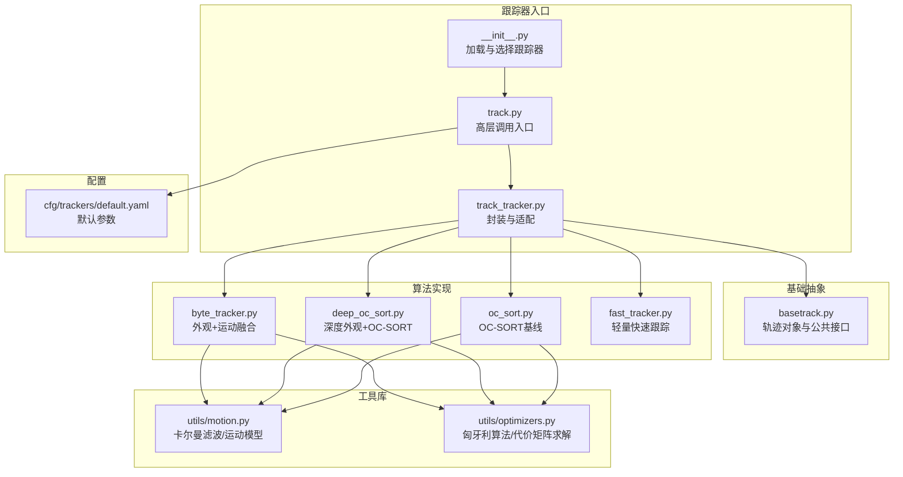
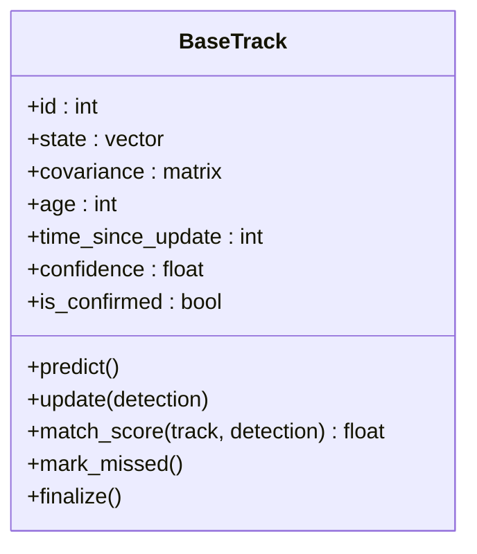
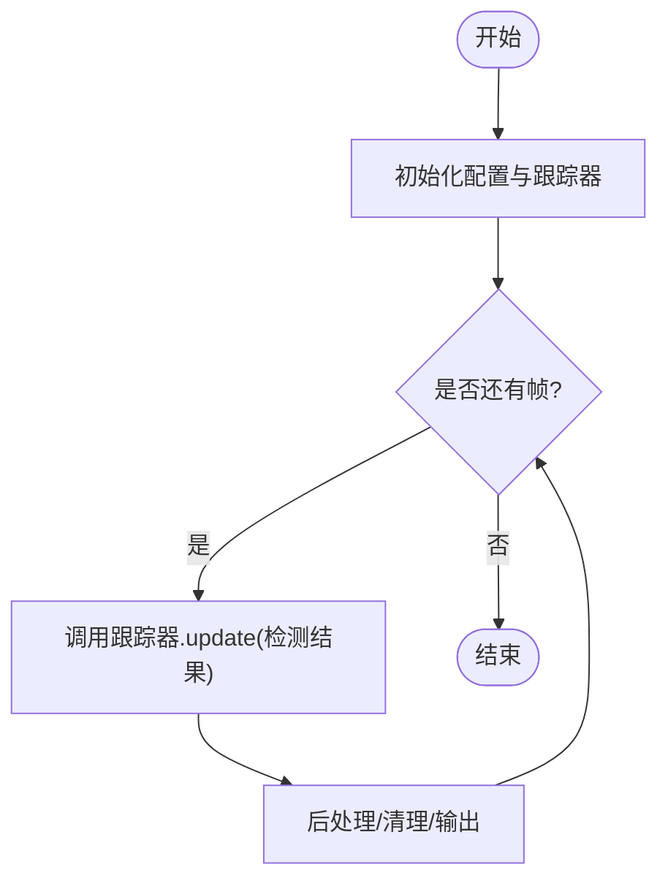
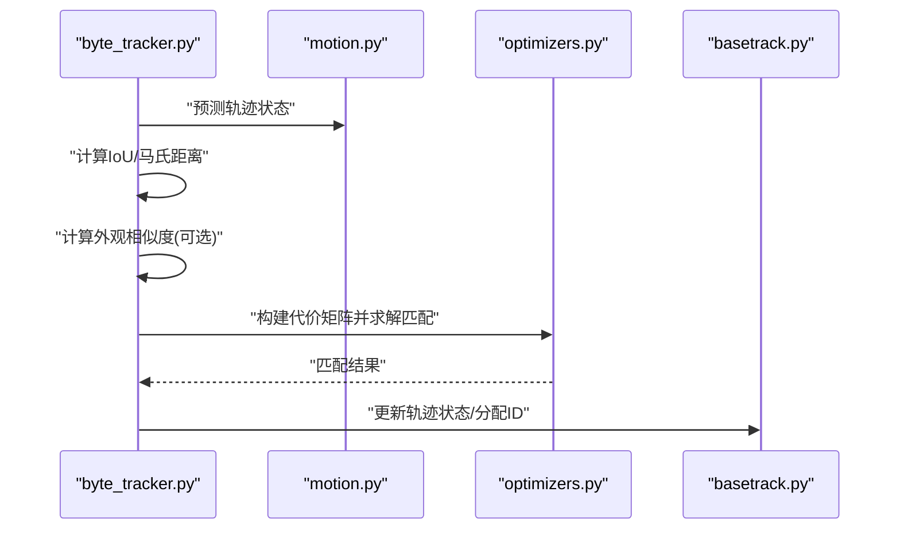
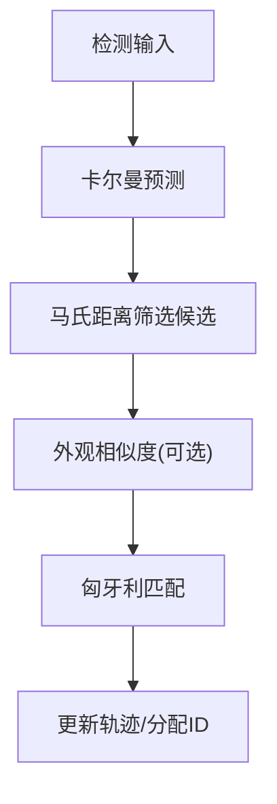
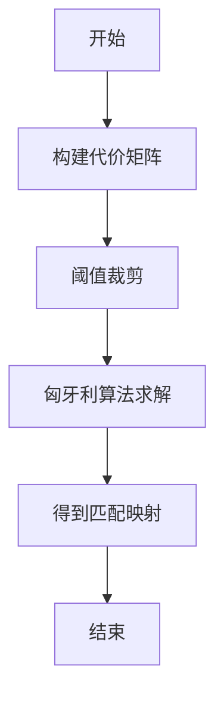
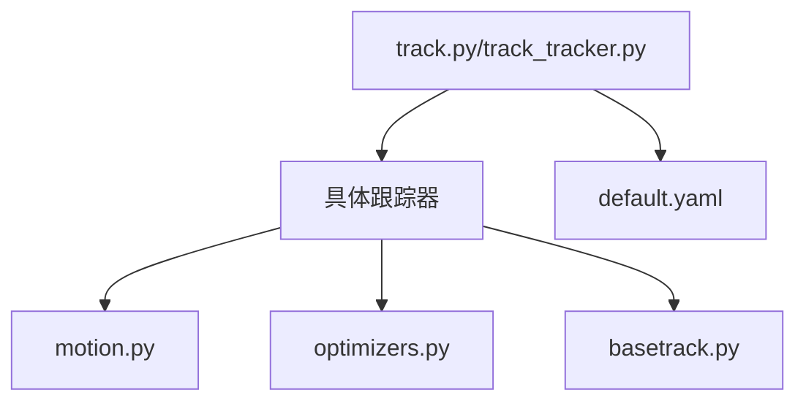

# ID分配与关联

<cite>
**本文引用的文件**
- [ultralytics/trackers/__init__.py](file://ultralytics/trackers/__init__.py)
- [ultralytics/trackers/basetrack.py](file://ultralytics/trackers/basetrack.py)
- [ultralytics/trackers/byte_tracker.py](file://ultralytics/trackers/byte_tracker.py)
- [ultralytics/trackers/deep_oc_sort.py](file://ultralytics/trackers/deep_oc_sort.py)
- [ultralytics/trackers/oc_sort.py](file://ultralytics/trackers/oc_sort.py)
- [ultralytics/trackers/fast_tracker.py](file://ultralytics/trackers/fast_tracker.py)
- [ultralytics/trackers/track.py](file://ultralytics/trackers/track.py)
- [ultralytics/trackers/track_tracker.py](file://ultralytics/trackers/track_tracker.py)
- [ultralytics/trackers/utils/motion.py](file://ultralytics/trackers/utils/motion.py)
- [ultralytics/trackers/utils/optimizers.py](file://ultralytics/trackers/utils/optimizers.py)
- [ultralytics/cfg/trackers/default.yaml](file://ultralytics/cfg/trackers/default.yaml)
</cite>

## 目录
1. [简介](#简介)
2. [项目结构](#项目结构)
3. [核心组件](#核心组件)
4. [架构总览](#架构总览)
5. [详细组件分析](#详细组件分析)
6. [依赖关系分析](#依赖关系分析)
7. [性能考虑](#性能考虑)
8. [故障排查指南](#故障排查指南)
9. [结论](#结论)
10. [附录：配置参数调优指南](#附录配置参数调优指南)

## 简介
本技术文档聚焦于YOLO-Master的ID分配与关联系统，围绕多目标跟踪（MOT）中的关键问题展开：如何在检测帧之间稳定地为同一目标维持唯一ID。文档深入解释匈牙利算法在目标关联中的应用、重识别特征提取与匹配机制、运动信息（卡尔曼滤波预测与轨迹匹配）的作用、外观与运动的融合策略、ID丢失处理与重新识别机制、ID冲突检测与解决策略，以及性能优化方法与配置参数调优建议。

## 项目结构
仓库中与ID分配与关联相关的代码主要位于 trackers 模块及其 utils 子模块中，同时提供默认配置文件以统一控制行为。整体组织方式采用“按功能分层 + 按算法模块化”的结构：
- 顶层入口与注册：负责加载与选择具体跟踪器实现
- 基础抽象：定义轨迹对象、跟踪器接口与通用流程
- 具体算法实现：包含基于外观+运动融合的ByteTrack风格方案、OC-SORT系列、快速跟踪器等
- 工具库：运动模型（卡尔曼滤波）、优化器（如匈牙利算法求解器）等
- 配置：默认跟踪器参数集中管理



图表来源
- [ultralytics/trackers/__init__.py](file://ultralytics/trackers/__init__.py)
- [ultralytics/trackers/track.py](file://ultralytics/trackers/track.py)
- [ultralytics/trackers/track_tracker.py](file://ultralytics/trackers/track_tracker.py)
- [ultralytics/trackers/basetrack.py](file://ultralytics/trackers/basetrack.py)
- [ultralytics/trackers/byte_tracker.py](file://ultralytics/trackers/byte_tracker.py)
- [ultralytics/trackers/deep_oc_sort.py](file://ultralytics/trackers/deep_oc_sort.py)
- [ultralytics/trackers/oc_sort.py](file://ultralytics/trackers/oc_sort.py)
- [ultralytics/trackers/fast_tracker.py](file://ultralytics/trackers/fast_tracker.py)
- [ultralytics/trackers/utils/motion.py](file://ultralytics/trackers/utils/motion.py)
- [ultralytics/trackers/utils/optimizers.py](file://ultralytics/trackers/utils/optimizers.py)
- [ultralytics/cfg/trackers/default.yaml](file://ultralytics/cfg/trackers/default.yaml)

章节来源
- [ultralytics/trackers/__init__.py](file://ultralytics/trackers/__init__.py)
- [ultralytics/trackers/track.py](file://ultralytics/trackers/track.py)
- [ultralytics/trackers/track_tracker.py](file://ultralytics/trackers/track_tracker.py)
- [ultralytics/trackers/basetrack.py](file://ultralytics/trackers/basetrack.py)
- [ultralytics/trackers/byte_tracker.py](file://ultralytics/trackers/byte_tracker.py)
- [ultralytics/trackers/deep_oc_sort.py](file://ultralytics/trackers/deep_oc_sort.py)
- [ultralytics/trackers/oc_sort.py](file://ultralytics/trackers/oc_sort.py)
- [ultralytics/trackers/fast_tracker.py](file://ultralytics/trackers/fast_tracker.py)
- [ultralytics/trackers/utils/motion.py](file://ultralytics/trackers/utils/motion.py)
- [ultralytics/trackers/utils/optimizers.py](file://ultralytics/trackers/utils/optimizers.py)
- [ultralytics/cfg/trackers/default.yaml](file://ultralytics/cfg/trackers/default.yaml)

## 核心组件
- 轨迹对象与接口（BaseTrack）
  - 职责：维护单条轨迹的状态（位置、速度、置信度、可见性、ID、年龄等），提供更新、预测、匹配得分计算等通用能力。
  - 关键点：状态表示通常包含中心点坐标与尺度，支持线性或扩展卡尔曼滤波；提供与检测框的IoU/马氏距离等度量接口。
- 跟踪器抽象与封装（track.py / track_tracker.py）
  - 职责：对外暴露统一的跟踪接口，内部根据配置实例化具体跟踪器；协调每帧的检测输入、历史轨迹、输出结果。
  - 关键点：封装了初始化、逐帧推进、清理过期轨迹、日志与可视化钩子。
- 具体跟踪器实现
  - ByteTrack风格（byte_tracker.py）：结合外观相似度与运动一致性进行两阶段关联，强调低分检测的召回与ID稳定性。
  - OC-SORT系列（oc_sort.py, deep_oc_sort.py）：以运动为主的外观辅助方案，深外观版本集成深度学习特征提取器用于再识别。
  - 快速跟踪器（fast_tracker.py）：简化外观分支，侧重速度与鲁棒性的折中。
- 工具库
  - 运动模型（motion.py）：提供卡尔曼滤波、预测协方差更新、马氏距离计算等。
  - 优化器（optimizers.py）：提供匈牙利算法求解器、代价矩阵构建与阈值裁剪等。
- 配置（default.yaml）
  - 统一管理各跟踪器的超参，包括外观/运动权重、阈值、最大失配次数、轨迹寿命等。

章节来源
- [ultralytics/trackers/basetrack.py](file://ultralytics/trackers/basetrack.py)
- [ultralytics/trackers/track.py](file://ultralytics/trackers/track.py)
- [ultralytics/trackers/track_tracker.py](file://ultralytics/trackers/track_tracker.py)
- [ultralytics/trackers/byte_tracker.py](file://ultralytics/trackers/byte_tracker.py)
- [ultralytics/trackers/oc_sort.py](file://ultralytics/trackers/oc_sort.py)
- [ultralytics/trackers/deep_oc_sort.py](file://ultralytics/trackers/deep_oc_sort.py)
- [ultralytics/trackers/fast_tracker.py](file://ultralytics/trackers/fast_tracker.py)
- [ultralytics/trackers/utils/motion.py](file://ultralytics/trackers/utils/motion.py)
- [ultralytics/trackers/utils/optimizers.py](file://ultralytics/trackers/utils/optimizers.py)
- [ultralytics/cfg/trackers/default.yaml](file://ultralytics/cfg/trackers/default.yaml)

## 架构总览
下图展示了从高层入口到具体算法与工具的调用关系，以及数据流与控制流的关键节点。

```mermaid
sequenceDiagram
participant App as "应用/上层调用"
participant Entry as "track.py"
participant Wrapper as "track_tracker.py"
participant Tracker as "具体跟踪器(如byte_tracker)"
participant Motion as "motion.py"
participant Opt as "optimizers.py"
participant Base as "basetrack.py"
App->>Entry : "初始化并传入配置"
Entry->>Wrapper : "创建跟踪器实例"
Wrapper->>Tracker : "实例化具体算法"
loop 每帧
App->>Entry : "传入检测结果"
Entry->>Wrapper : "调用update()"
Wrapper->>Tracker : "执行关联与ID分配"
Tracker->>Motion : "预测轨迹状态"
Tracker->>Opt : "构建代价矩阵并求解匹配"
Tracker->>Base : "更新轨迹状态/分配ID"
Tracker-->>Wrapper : "返回带ID的结果"
Wrapper-->>App : "输出跟踪结果"
end
```

图表来源
- [ultralytics/trackers/track.py](file://ultralytics/trackers/track.py)
- [ultralytics/trackers/track_tracker.py](file://ultralytics/trackers/track_tracker.py)
- [ultralytics/trackers/byte_tracker.py](file://ultralytics/trackers/byte_tracker.py)
- [ultralytics/trackers/oc_sort.py](file://ultralytics/trackers/oc_sort.py)
- [ultralytics/trackers/deep_oc_sort.py](file://ultralytics/trackers/deep_oc_sort.py)
- [ultralytics/trackers/utils/motion.py](file://ultralytics/trackers/utils/motion.py)
- [ultralytics/trackers/utils/optimizers.py](file://ultralytics/trackers/utils/optimizers.py)
- [ultralytics/trackers/basetrack.py](file://ultralytics/trackers/basetrack.py)

## 详细组件分析

### 轨迹对象与接口（BaseTrack）
- 设计要点
  - 状态向量：通常包含二维或三维位置、速度、尺度等；支持时间步进与协方差更新。
  - 生命周期：新增、活跃、失配计数、最大失配阈值、最终删除。
  - 匹配接口：提供与检测框的相似度计算（IoU、马氏距离、外观余弦相似度等）。
- 复杂度
  - 单步更新：常数时间；批量匹配：O(N×M)，N为轨迹数，M为检测数。
- 优化机会
  - 使用空间索引或区域过滤减少候选对数量；按需更新协方差；缓存外观特征。



图表来源
- [ultralytics/trackers/basetrack.py](file://ultralytics/trackers/basetrack.py)

章节来源
- [ultralytics/trackers/basetrack.py](file://ultralytics/trackers/basetrack.py)

### 高层入口与封装（track.py / track_tracker.py）
- 职责
  - 统一初始化：读取配置、实例化具体跟踪器、准备资源。
  - 逐帧推进：接收检测结果、调用跟踪器update、返回带ID的输出。
  - 生命周期管理：清理长期未更新的轨迹、重置状态。
- 控制流
  - 初始化 → 循环帧 → 调用具体跟踪器 → 后处理与输出。



图表来源
- [ultralytics/trackers/track.py](file://ultralytics/trackers/track.py)
- [ultralytics/trackers/track_tracker.py](file://ultralytics/trackers/track_tracker.py)

章节来源
- [ultralytics/trackers/track.py](file://ultralytics/trackers/track.py)
- [ultralytics/trackers/track_tracker.py](file://ultralytics/trackers/track_tracker.py)

### 外观+运动融合跟踪器（ByteTrack风格）
- 核心思想
  - 两阶段关联：先高置信度检测与轨迹匹配，再低置信度检测尝试恢复被遮挡或漏检的目标。
  - 融合策略：将外观相似度与运动一致性加权组合，形成综合代价矩阵。
- 关键步骤
  - 预测：使用卡尔曼滤波预测当前帧轨迹状态。
  - 匹配：构建代价矩阵（IoU/马氏距离 + 外观余弦相似度），使用匈牙利算法求解最优匹配。
  - 更新：成功匹配的轨迹更新状态；未匹配检测作为新轨迹；未匹配轨迹增加失配计数。
- 复杂度
  - 外观特征提取：取决于后端网络；匹配阶段O(N×M)。
- 优化技巧
  - 外观特征缓存与增量更新；仅对候选集计算外观；动态调整阈值。



图表来源
- [ultralytics/trackers/byte_tracker.py](file://ultralytics/trackers/byte_tracker.py)
- [ultralytics/trackers/utils/motion.py](file://ultralytics/trackers/utils/motion.py)
- [ultralytics/trackers/utils/optimizers.py](file://ultralytics/trackers/utils/optimizers.py)
- [ultralytics/trackers/basetrack.py](file://ultralytics/trackers/basetrack.py)

章节来源
- [ultralytics/trackers/byte_tracker.py](file://ultralytics/trackers/byte_tracker.py)

### OC-SORT系列（oc_sort.py / deep_oc_sort.py）
- 核心思想
  - 以运动为主：优先使用卡尔曼滤波预测与马氏距离进行匹配，外观作为辅助提升鲁棒性。
  - 深外观版本：集成深度学习特征提取器，在遮挡或外观变化场景下增强再识别能力。
- 关键步骤
  - 预测与匹配：基于运动模型的马氏距离筛选候选，再用外观相似度细化。
  - 轨迹管理：失配计数与最大寿命控制，避免ID漂移。
- 复杂度
  - 深外观版本额外开销来自特征提取与相似度计算。



图表来源
- [ultralytics/trackers/oc_sort.py](file://ultralytics/trackers/oc_sort.py)
- [ultralytics/trackers/deep_oc_sort.py](file://ultralytics/trackers/deep_oc_sort.py)
- [ultralytics/trackers/utils/motion.py](file://ultralytics/trackers/utils/motion.py)
- [ultralytics/trackers/utils/optimizers.py](file://ultralytics/trackers/utils/optimizers.py)

章节来源
- [ultralytics/trackers/oc_sort.py](file://ultralytics/trackers/oc_sort.py)
- [ultralytics/trackers/deep_oc_sort.py](file://ultralytics/trackers/deep_oc_sort.py)

### 快速跟踪器（fast_tracker.py）
- 特点
  - 简化外观分支，降低计算量，适合实时或边缘部署。
  - 更依赖运动一致性与阈值策略，保证基本ID稳定性。
- 适用场景
  - 高速视频、算力受限设备、对延迟敏感的应用。

章节来源
- [ultralytics/trackers/fast_tracker.py](file://ultralytics/trackers/fast_tracker.py)

### 匈牙利算法在目标关联中的应用与实现
- 作用
  - 在代价矩阵上求解最小权匹配，确保每个检测最多匹配一条轨迹，每条轨迹最多匹配一个检测。
- 实现要点
  - 代价矩阵构建：融合IoU/马氏距离与外观相似度，并进行阈值裁剪（超过阈值的边置为极大值）。
  - 求解器：使用高效实现（如scipy.optimize.linear_sum_assignment或自定义实现）。
  - 边界处理：未匹配检测与新轨迹；未匹配轨迹的失配计数。
- 复杂度
  - 典型O(N^3)，可通过限制候选集规模降低实际运行时间。



图表来源
- [ultralytics/trackers/utils/optimizers.py](file://ultralytics/trackers/utils/optimizers.py)

章节来源
- [ultralytics/trackers/utils/optimizers.py](file://ultralytics/trackers/utils/optimizers.py)

### 重识别特征提取与匹配机制
- 集成方式
  - 在深外观跟踪器中，通过外部特征提取器（如ReID网络）生成检测框的特征向量。
  - 相似度度量：常用余弦相似度或欧氏距离，需归一化以保证数值稳定。
- 匹配策略
  - 仅在候选集内计算外观相似度，减少计算量。
  - 与运动信息融合：加权组合或级联决策（先运动后外观）。
- 性能优化
  - 特征缓存与增量更新；批量化推理；降维与量化。

章节来源
- [ultralytics/trackers/deep_oc_sort.py](file://ultralytics/trackers/deep_oc_sort.py)

### 运动信息与卡尔曼滤波
- 角色
  - 预测下一帧目标位置与不确定性，提供马氏距离用于候选筛选与匹配。
- 关键参数
  - 过程噪声与观测噪声影响预测精度与收敛速度。
  - 初始协方差决定早期匹配灵敏度。
- 优化建议
  - 自适应噪声调节；基于检测质量的观测更新；区域约束减少误匹配。

章节来源
- [ultralytics/trackers/utils/motion.py](file://ultralytics/trackers/utils/motion.py)

### 外观与运动信息的融合策略
- 常见方法
  - 加权融合：综合代价 = α·运动代价 + β·外观代价。
  - 级联决策：先用运动筛选候选，再用外观细化匹配。
  - 动态权重：根据场景（遮挡、密集、快速运动）调整α/β。
- 效果权衡
  - 外观强有助于遮挡恢复，但可能引入误匹配；运动强有助于快速目标，但在外观相似时易混淆。

章节来源
- [ultralytics/trackers/byte_tracker.py](file://ultralytics/trackers/byte_tracker.py)
- [ultralytics/trackers/deep_oc_sort.py](file://ultralytics/trackers/deep_oc_sort.py)

### ID丢失处理与重新识别机制
- 失配计数与最大寿命
  - 未匹配轨迹累计失配次数，超过阈值则标记为待删除；达到最大年龄则强制终止。
- 重新识别
  - 深外观版本利用ReID特征在长时间遮挡后仍可进行再识别。
  - 低置信度检测的二次匹配（ByteTrack风格）有助于恢复被遮挡目标。
- 策略建议
  - 合理设置最大失配次数与轨迹寿命；在密集场景中放宽外观阈值。

章节来源
- [ultralytics/trackers/basetrack.py](file://ultralytics/trackers/basetrack.py)
- [ultralytics/trackers/byte_tracker.py](file://ultralytics/trackers/byte_tracker.py)
- [ultralytics/trackers/deep_oc_sort.py](file://ultralytics/trackers/deep_oc_sort.py)

### ID冲突检测与解决策略
- 冲突来源
  - 外观相似导致误匹配；运动预测偏差导致错误关联；阈值不当造成一对多或多对一。
- 检测方法
  - 检查匹配映射的唯一性；统计局部密度与相似度分布异常。
- 解决策略
  - 引入时空一致性校验（连续帧匹配一致性）；提高运动模型精度；动态阈值与回退策略。

章节来源
- [ultralytics/trackers/utils/optimizers.py](file://ultralytics/trackers/utils/optimizers.py)
- [ultralytics/trackers/utils/motion.py](file://ultralytics/trackers/utils/motion.py)

## 依赖关系分析
- 耦合与内聚
  - 高层入口与封装层解耦具体算法，便于替换与扩展。
  - 工具库（运动、优化）被多个跟踪器复用，内聚性强。
- 直接依赖
  - 具体跟踪器依赖运动模型与优化器；部分跟踪器依赖外观特征提取器。
- 潜在循环依赖
  - 通过分层与接口隔离避免循环；若出现，应抽取公共接口或使用事件回调。
- 外部依赖
  - 数值计算库（NumPy/Torch）、优化库（SciPy）、可能的ReID后端。



图表来源
- [ultralytics/trackers/track.py](file://ultralytics/trackers/track.py)
- [ultralytics/trackers/track_tracker.py](file://ultralytics/trackers/track_tracker.py)
- [ultralytics/trackers/byte_tracker.py](file://ultralytics/trackers/byte_tracker.py)
- [ultralytics/trackers/oc_sort.py](file://ultralytics/trackers/oc_sort.py)
- [ultralytics/trackers/deep_oc_sort.py](file://ultralytics/trackers/deep_oc_sort.py)
- [ultralytics/trackers/fast_tracker.py](file://ultralytics/trackers/fast_tracker.py)
- [ultralytics/trackers/utils/motion.py](file://ultralytics/trackers/utils/motion.py)
- [ultralytics/trackers/utils/optimizers.py](file://ultralytics/trackers/utils/optimizers.py)
- [ultralytics/trackers/basetrack.py](file://ultralytics/trackers/basetrack.py)
- [ultralytics/cfg/trackers/default.yaml](file://ultralytics/cfg/trackers/default.yaml)

章节来源
- [ultralytics/trackers/track.py](file://ultralytics/trackers/track.py)
- [ultralytics/trackers/track_tracker.py](file://ultralytics/trackers/track_tracker.py)
- [ultralytics/trackers/byte_tracker.py](file://ultralytics/trackers/byte_tracker.py)
- [ultralytics/trackers/oc_sort.py](file://ultralytics/trackers/oc_sort.py)
- [ultralytics/trackers/deep_oc_sort.py](file://ultralytics/trackers/deep_oc_sort.py)
- [ultralytics/trackers/fast_tracker.py](file://ultralytics/trackers/fast_tracker.py)
- [ultralytics/trackers/utils/motion.py](file://ultralytics/trackers/utils/motion.py)
- [ultralytics/trackers/utils/optimizers.py](file://ultralytics/trackers/utils/optimizers.py)
- [ultralytics/trackers/basetrack.py](file://ultralytics/trackers/basetrack.py)
- [ultralytics/cfg/trackers/default.yaml](file://ultralytics/cfg/trackers/default.yaml)

## 性能考虑
- 候选集裁剪
  - 使用空间区域或时间窗口限制匹配范围，显著降低O(N×M)成本。
- 外观特征优化
  - 缓存与增量更新；批量化推理；降维与半精度计算。
- 匈牙利算法优化
  - 限制代价矩阵规模；稀疏化处理；必要时使用近似匹配。
- 卡尔曼滤波优化
  - 自适应噪声；按需更新协方差；并行化独立轨迹更新。
- 内存与I/O
  - 减少中间对象创建；复用缓冲区；异步加载特征。

[本节为通用指导，不直接分析具体文件]

## 故障排查指南
- 常见问题
  - ID频繁切换：检查外观阈值与运动阈值；确认候选集裁剪是否过严。
  - 遮挡后无法恢复：增大最大失配次数；启用深外观再识别；调整低置信度检测匹配策略。
  - 匹配耗时过高：缩小候选集；关闭不必要的外观计算；使用更快的优化器实现。
- 诊断建议
  - 记录每帧匹配映射与代价分布；可视化轨迹与预测框；对比不同参数的HOTA/MOTA指标。
  - 监控失配计数与轨迹寿命，定位过早删除或过晚删除的问题。

章节来源
- [ultralytics/trackers/basetrack.py](file://ultralytics/trackers/basetrack.py)
- [ultralytics/trackers/byte_tracker.py](file://ultralytics/trackers/byte_tracker.py)
- [ultralytics/trackers/deep_oc_sort.py](file://ultralytics/trackers/deep_oc_sort.py)
- [ultralytics/trackers/utils/optimizers.py](file://ultralytics/trackers/utils/optimizers.py)
- [ultralytics/trackers/utils/motion.py](file://ultralytics/trackers/utils/motion.py)

## 结论
YOLO-Master的ID分配与关联系统通过分层设计与模块化实现，提供了多种跟踪策略以适应不同场景需求。外观与运动的融合、匈牙利算法的高效匹配、卡尔曼滤波的稳健预测以及深外观再识别共同构成了稳定的ID维持机制。通过合理的参数调优与性能优化，可在复杂场景中取得良好的跟踪质量与效率平衡。

[本节为总结，不直接分析具体文件]

## 附录：配置参数调优指南
- 外观与运动权重
  - 调整外观相似度与运动代价的权重比例，依据场景遮挡程度与目标外观变化强度。
- 阈值设置
  - IoU/马氏距离阈值：控制候选集大小与匹配严格度；外观相似度阈值：防止误匹配。
- 轨迹生命周期
  - 最大失配次数与最大寿命：在密集与遮挡场景中适当放宽，避免ID过早丢失。
- 特征提取
  - 开启/关闭深外观分支；选择合适特征维度与相似度度量；考虑半精度与缓存策略。
- 优化器
  - 匈牙利算法实现选择；候选集规模限制；稀疏代价矩阵。

章节来源
- [ultralytics/cfg/trackers/default.yaml](file://ultralytics/cfg/trackers/default.yaml)