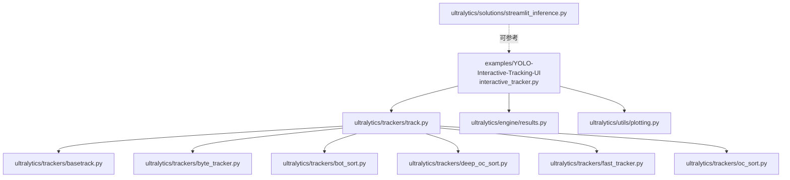
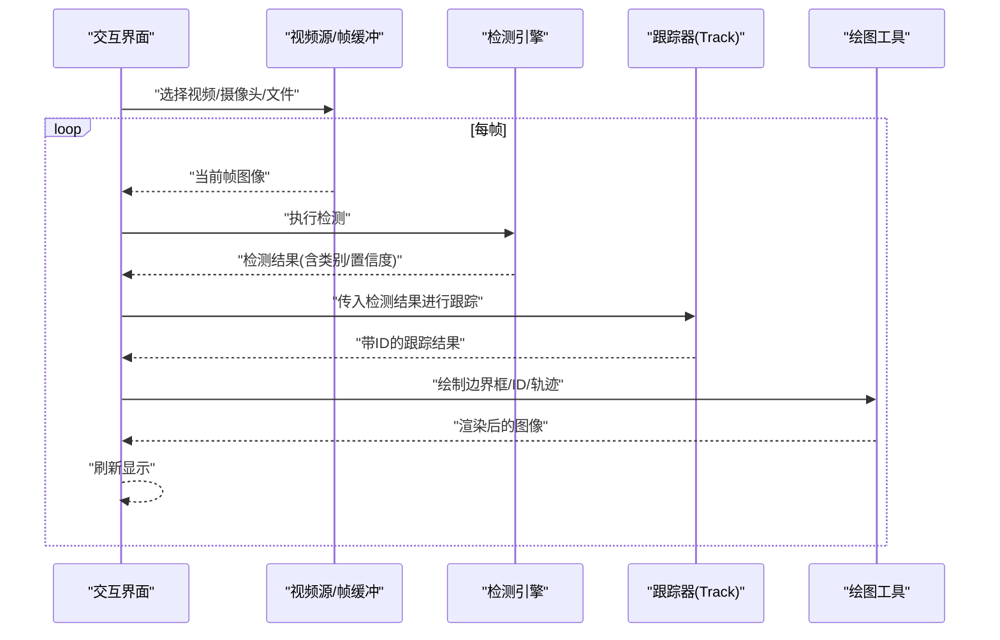
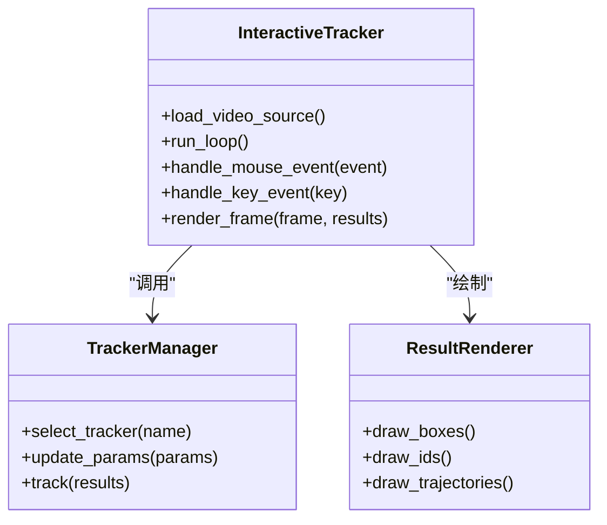
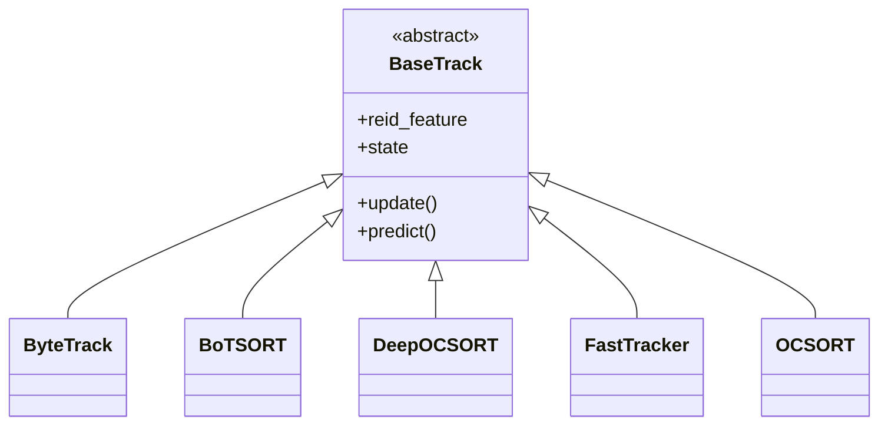
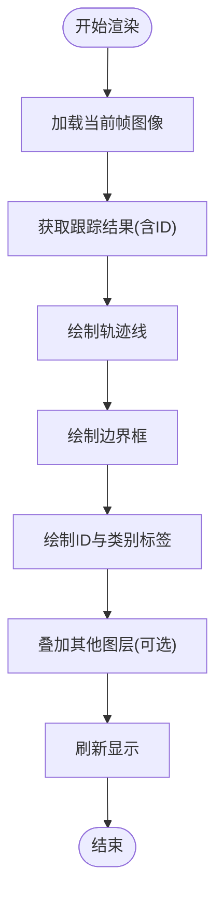
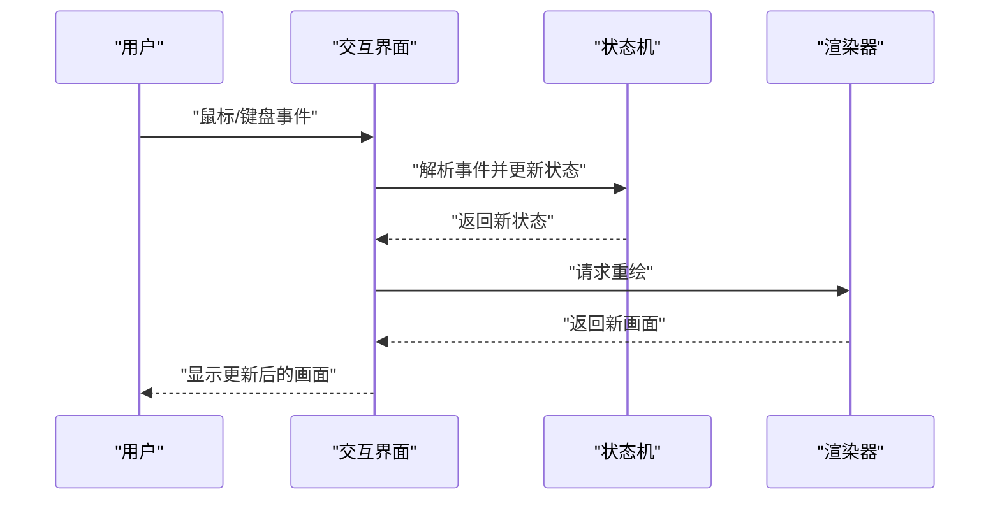
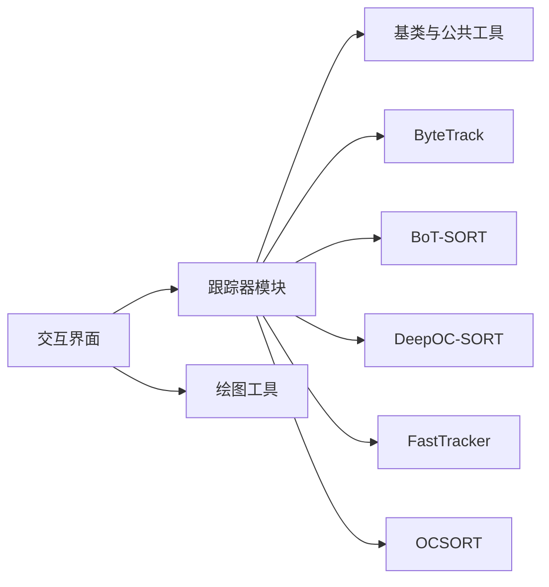

# 交互式跟踪界面

<cite>
**本文引用的文件**
- [interactive_tracker.py](file://examples/YOLO-Interactive-Tracking-UI/interactive_tracker.py)
- [README.md](file://examples/YOLO-Interactive-Tracking-UI/README.md)
- [streamlit_inference.py](file://ultralytics/solutions/streamlit_inference.py)
- [track.py](file://ultralytics/trackers/track.py)
- [basetrack.py](file://ultralytics/trackers/basetrack.py)
- [byte_tracker.py](file://ultralytics/trackers/byte_tracker.py)
- [bot_sort.py](file://ultralytics/trackers/bot_sort.py)
- [deep_oc_sort.py](file://ultralytics/trackers/deep_oc_sort.py)
- [fast_tracker.py](file://ultralytics/trackers/fast_tracker.py)
- [oc_sort.py](file://ultralytics/trackers/oc_sort.py)
- [results.py](file://ultralytics/engine/results.py)
- [predictor.py](file://ultralytics/engine/predictor.py)
- [plotting.py](file://ultralytics/utils/plotting.py)
</cite>

## 目录
1. [简介](#简介)
2. [项目结构](#项目结构)
3. [核心组件](#核心组件)
4. [架构总览](#架构总览)
5. [详细组件分析](#详细组件分析)
6. [依赖关系分析](#依赖关系分析)
7. [性能考虑](#性能考虑)
8. [故障排查指南](#故障排查指南)
9. [结论](#结论)
10. [附录](#附录)

## 简介
本文件面向YOLO-Master的“交互式跟踪界面”，提供从用户操作到开发集成的完整说明。内容覆盖：
- 实时视频流加载、显示与控制
- 鼠标与键盘交互事件处理机制
- 跟踪结果可视化渲染（边界框、ID标签、轨迹线等）
- 界面布局与响应式实现思路
- 自定义跟踪算法集成与插件化方法
- 性能优化策略（GPU加速、内存管理）
- 界面定制与主题开发指南
- 常见问题排查与解决方法

## 项目结构
交互式跟踪界面位于示例工程下，核心入口为交互式跟踪脚本；同时，系统内提供了基于Streamlit的推理演示模块，可作为界面参考与扩展基础。

图表来源
- [interactive_tracker.py](file://examples/YOLO-Interactive-Tracking-UI/interactive_tracker.py)
- [track.py](file://ultralytics/trackers/track.py)
- [basetrack.py](file://ultralytics/trackers/basetrack.py)
- [byte_tracker.py](file://ultralytics/trackers/byte_tracker.py)
- [bot_sort.py](file://ultralytics/trackers/bot_sort.py)
- [deep_oc_sort.py](file://ultralytics/trackers/deep_oc_sort.py)
- [fast_tracker.py](file://ultralytics/trackers/fast_tracker.py)
- [oc_sort.py](file://ultralytics/trackers/oc_sort.py)
- [results.py](file://ultralytics/engine/results.py)
- [plotting.py](file://ultralytics/utils/plotting.py)
- [streamlit_inference.py](file://ultralytics/solutions/streamlit_inference.py)

章节来源
- [interactive_tracker.py](file://examples/YOLO-Interactive-Tracking-UI/interactive_tracker.py)
- [README.md](file://examples/YOLO-Interactive-Tracking-UI/README.md)
- [streamlit_inference.py](file://ultralytics/solutions/streamlit_inference.py)

## 核心组件
- 交互式跟踪主程序
  - 负责视频源选择与加载、帧循环、推理与跟踪调用、结果绘制与展示、用户交互事件分发。
- 跟踪器注册与调度
  - 通过统一接口加载不同跟踪算法（如ByteTrack、BoT-SORT、DeepOC-SORT、FastTracker、OCSORT），并返回带目标ID的检测结果。
- 结果对象与绘图工具
  - 使用统一的检测结果对象承载边界框、类别、置信度、ID等信息；借助绘图工具在图像上叠加标注与轨迹。
- Streamlit推理演示（可选参考）
  - 提供基于Web的实时推理与可视化参考实现，便于快速搭建或替换前端。

章节来源
- [interactive_tracker.py](file://examples/YOLO-Interactive-Tracking-UI/interactive_tracker.py)
- [track.py](file://ultralytics/trackers/track.py)
- [basetrack.py](file://ultralytics/trackers/basetrack.py)
- [byte_tracker.py](file://ultralytics/trackers/byte_tracker.py)
- [bot_sort.py](file://ultralytics/trackers/bot_sort.py)
- [deep_oc_sort.py](file://ultralytics/trackers/deep_oc_sort.py)
- [fast_tracker.py](file://ultralytics/trackers/fast_tracker.py)
- [oc_sort.py](file://ultralytics/trackers/oc_sort.py)
- [results.py](file://ultralytics/engine/results.py)
- [plotting.py](file://ultralytics/utils/plotting.py)
- [streamlit_inference.py](file://ultralytics/solutions/streamlit_inference.py)

## 架构总览
下图展示了交互式跟踪界面的整体数据流与组件协作关系：视频输入经预处理后送入检测模型，随后由跟踪器维护目标ID，最终将结果渲染至画布并响应用户交互。

图表来源
- [interactive_tracker.py](file://examples/YOLO-Interactive-Tracking-UI/interactive_tracker.py)
- [track.py](file://ultralytics/trackers/track.py)
- [results.py](file://ultralytics/engine/results.py)
- [plotting.py](file://ultralytics/utils/plotting.py)

## 详细组件分析

### 交互式跟踪主程序
- 功能要点
  - 视频源管理：支持本地文件、摄像头、网络流等输入；具备播放/暂停/跳转控制。
  - 帧循环与同步：按帧读取、解码、缩放与格式转换，保证稳定帧率。
  - 推理与跟踪：调用检测与跟踪管线，获取带ID的目标集合。
  - 可视化渲染：绘制边界框、类别、置信度、ID标签、轨迹线等。
  - 交互事件：鼠标点击/拖拽用于选择/编辑目标；键盘快捷键用于控制播放、切换模式、保存截图等。
  - 状态管理：记录当前模式（仅检测/跟踪/标注）、参数面板、日志输出。
- 关键流程
  - 初始化：加载模型、配置跟踪器、准备画布与控件。
  - 主循环：读帧→推理→跟踪→绘制→刷新。
  - 事件回调：根据事件类型更新状态并重绘。
- 扩展点
  - 新增交互动作：在事件分发处注册新回调。
  - 新增可视化元素：在绘制管线中插入新的图层（如热力图、区域计数）。
  - 参数面板：动态绑定UI控件与推理/跟踪参数。

章节来源
- [interactive_tracker.py](file://examples/YOLO-Interactive-Tracking-UI/interactive_tracker.py)

#### 类与关系图（概念映射）

图表来源
- [interactive_tracker.py](file://examples/YOLO-Interactive-Tracking-UI/interactive_tracker.py)
- [track.py](file://ultralytics/trackers/track.py)
- [plotting.py](file://ultralytics/utils/plotting.py)

### 跟踪器注册与调度
- 统一接口
  - 通过跟踪器管理器选择具体算法实例，并在每帧对检测结果进行关联与ID分配。
- 内置算法
  - ByteTrack、BoT-SORT、DeepOC-SORT、FastTracker、OCSORT等，均遵循相同输入输出契约。
- 扩展方式
  - 实现标准接口并注册到管理器，即可在界面中选择使用。

章节来源
- [track.py](file://ultralytics/trackers/track.py)
- [basetrack.py](file://ultralytics/trackers/basetrack.py)
- [byte_tracker.py](file://ultralytics/trackers/byte_tracker.py)
- [bot_sort.py](file://ultralytics/trackers/bot_sort.py)
- [deep_oc_sort.py](file://ultralytics/trackers/deep_oc_sort.py)
- [fast_tracker.py](file://ultralytics/trackers/fast_tracker.py)
- [oc_sort.py](file://ultralytics/trackers/oc_sort.py)

#### 类关系图（跟踪器族）

图表来源
- [basetrack.py](file://ultralytics/trackers/basetrack.py)
- [byte_tracker.py](file://ultralytics/trackers/byte_tracker.py)
- [bot_sort.py](file://ultralytics/trackers/bot_sort.py)
- [deep_oc_sort.py](file://ultralytics/trackers/deep_oc_sort.py)
- [fast_tracker.py](file://ultralytics/trackers/fast_tracker.py)
- [oc_sort.py](file://ultralytics/trackers/oc_sort.py)

### 结果对象与可视化渲染
- 结果对象
  - 包含边界框坐标、类别索引、置信度、目标ID等字段，供渲染与导出使用。
- 绘图工具
  - 提供绘制矩形框、文本标签、多段轨迹线、热力图等通用能力。
- 渲染顺序建议
  - 底层图像→轨迹线→边界框→ID标签→其他叠加层，避免遮挡。

章节来源
- [results.py](file://ultralytics/engine/results.py)
- [plotting.py](file://ultralytics/utils/plotting.py)

#### 渲染流程图

图表来源
- [interactive_tracker.py](file://examples/YOLO-Interactive-Tracking-UI/interactive_tracker.py)
- [plotting.py](file://ultralytics/utils/plotting.py)
- [results.py](file://ultralytics/engine/results.py)

### 用户交互事件处理机制
- 鼠标事件
  - 单击：选中目标或切换模式（如标注/跟踪）。
  - 拖拽：调整感兴趣区域或移动目标中心。
  - 滚轮：缩放视图或调节阈值参数。
- 键盘快捷键
  - 空格：播放/暂停。
  - 方向键：逐帧前进/后退。
  - 数字键：切换跟踪算法或可视化开关。
  - S：保存当前帧截图。
- 事件分发
  - 事件队列→事件类型识别→状态机更新→触发重绘。

章节来源
- [interactive_tracker.py](file://examples/YOLO-Interactive-Tracking-UI/interactive_tracker.py)

#### 事件处理时序图

图表来源
- [interactive_tracker.py](file://examples/YOLO-Interactive-Tracking-UI/interactive_tracker.py)

### 界面布局与响应式设计
- 布局分区
  - 左侧：控制面板（模型、跟踪器、参数）。
  - 中间：视频/图像显示区。
  - 右侧：统计信息、日志与快捷操作。
- 响应式策略
  - 自适应窗口尺寸与DPI；动态调整控件大小与字体。
  - 大分辨率下启用降采样预览，按需加载高清层。
- 主题与样式
  - 支持明暗主题切换；颜色方案与字体可通过配置文件注入。

章节来源
- [interactive_tracker.py](file://examples/YOLO-Interactive-Tracking-UI/interactive_tracker.py)
- [streamlit_inference.py](file://ultralytics/solutions/streamlit_inference.py)

### 自定义跟踪算法集成与插件机制
- 集成步骤
  - 实现标准跟踪接口（继承基类），完成预测、匹配、ID分配逻辑。
  - 注册到跟踪器管理器，暴露名称与参数描述。
  - 在界面下拉菜单中可选择该算法。
- 插件约定
  - 输入：上一帧跟踪状态+当前帧检测结果。
  - 输出：当前帧跟踪结果（含ID、状态、特征等）。
  - 线程安全：确保多线程环境下的状态一致性。
- 调试与测试
  - 提供最小用例与断言，验证ID稳定性与召回率。

章节来源
- [track.py](file://ultralytics/trackers/track.py)
- [basetrack.py](file://ultralytics/trackers/basetrack.py)

### 性能优化策略
- GPU加速
  - 模型推理与部分预处理/后处理迁移至GPU；合理设置批大小与缓存。
- 内存管理
  - 复用帧缓冲区；及时释放临时张量；限制轨迹历史长度。
- 渲染优化
  - 增量绘制（仅更新变化区域）；降低非关键路径开销。
- 流水线并行
  - 解耦读帧、推理、跟踪、渲染为独立阶段，使用队列缓冲。

章节来源
- [interactive_tracker.py](file://examples/YOLO-Interactive-Tracking-UI/interactive_tracker.py)
- [predictor.py](file://ultralytics/engine/predictor.py)

### 界面定制与主题开发指南
- 主题配置
  - 定义颜色变量、字体、边距等；通过配置对象注入到各控件。
- 控件扩展
  - 新增滑块、复选框、下拉列表等，并绑定到推理/跟踪参数。
- 皮肤切换
  - 运行时切换主题，保持状态一致性与无闪烁刷新。

章节来源
- [interactive_tracker.py](file://examples/YOLO-Interactive-Tracking-UI/interactive_tracker.py)
- [streamlit_inference.py](file://ultralytics/solutions/streamlit_inference.py)

## 依赖关系分析
- 内部依赖
  - 交互式界面依赖跟踪器模块与绘图工具；跟踪器模块共享基类与公共工具。
- 外部依赖
  - 视频IO库、图像处理库、GUI/Web框架（取决于具体实现）。
- 耦合与内聚
  - 界面与跟踪器通过明确接口解耦；绘图工具高度内聚且可复用。

图表来源
- [interactive_tracker.py](file://examples/YOLO-Interactive-Tracking-UI/interactive_tracker.py)
- [track.py](file://ultralytics/trackers/track.py)
- [basetrack.py](file://ultralytics/trackers/basetrack.py)
- [byte_tracker.py](file://ultralytics/trackers/byte_tracker.py)
- [bot_sort.py](file://ultralytics/trackers/bot_sort.py)
- [deep_oc_sort.py](file://ultralytics/trackers/deep_oc_sort.py)
- [fast_tracker.py](file://ultralytics/trackers/fast_tracker.py)
- [oc_sort.py](file://ultralytics/trackers/oc_sort.py)
- [plotting.py](file://ultralytics/utils/plotting.py)

章节来源
- [interactive_tracker.py](file://examples/YOLO-Interactive-Tracking-UI/interactive_tracker.py)
- [track.py](file://ultralytics/trackers/track.py)
- [plotting.py](file://ultralytics/utils/plotting.py)

## 性能考虑
- 端到端延迟
  - 控制读帧、推理、跟踪、渲染各环节耗时，避免单点瓶颈。
- 资源占用
  - 监控GPU显存与CPU占用，适时降级画质或帧率。
- 并发与锁
  - 使用线程池与无锁队列提升吞吐；谨慎加锁范围。
- 缓存与预热
  - 模型预热、纹理缓存、轨迹历史滑动窗口。

[本节为通用指导，不直接分析具体文件]

## 故障排查指南
- 无法加载视频源
  - 检查路径权限、编码格式、设备占用；确认依赖库安装正确。
- 跟踪ID不稳定
  - 调整匹配阈值、外观特征权重、轨迹历史长度；对比不同跟踪器表现。
- 渲染卡顿
  - 关闭非必要叠加层；减少轨迹长度；启用GPU加速。
- 内存泄漏
  - 检查临时对象释放；限制历史数据结构规模；定期GC。
- 快捷键无效
  - 确认焦点在界面窗口；检查事件绑定是否被覆盖。

章节来源
- [interactive_tracker.py](file://examples/YOLO-Interactive-Tracking-UI/interactive_tracker.py)

## 结论
交互式跟踪界面将检测与跟踪能力以直观方式呈现，支持丰富的用户交互与可视化选项。通过清晰的接口与模块化设计，开发者可以快速集成自定义跟踪算法、扩展可视化元素与主题风格，并在性能与体验之间取得平衡。

[本节为总结性内容，不直接分析具体文件]

## 附录
- 快速上手
  - 运行交互式跟踪脚本，选择视频源与跟踪器，观察实时效果。
- 参考实现
  - 基于Streamlit的推理演示可作为Web界面替代方案或学习参考。

章节来源
- [README.md](file://examples/YOLO-Interactive-Tracking-UI/README.md)
- [streamlit_inference.py](file://ultralytics/solutions/streamlit_inference.py)