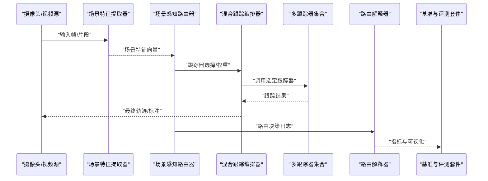
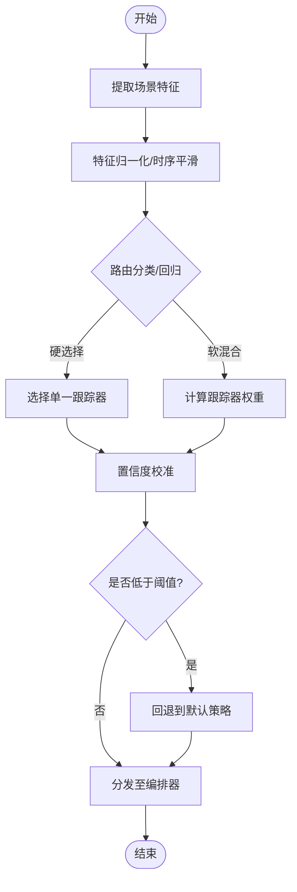
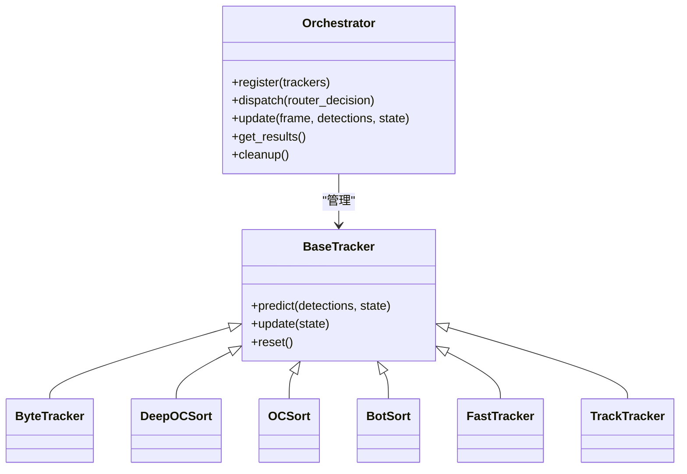
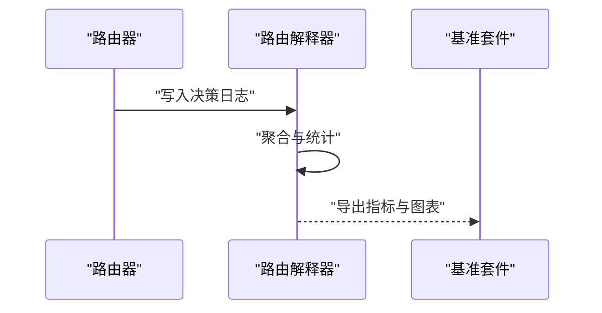
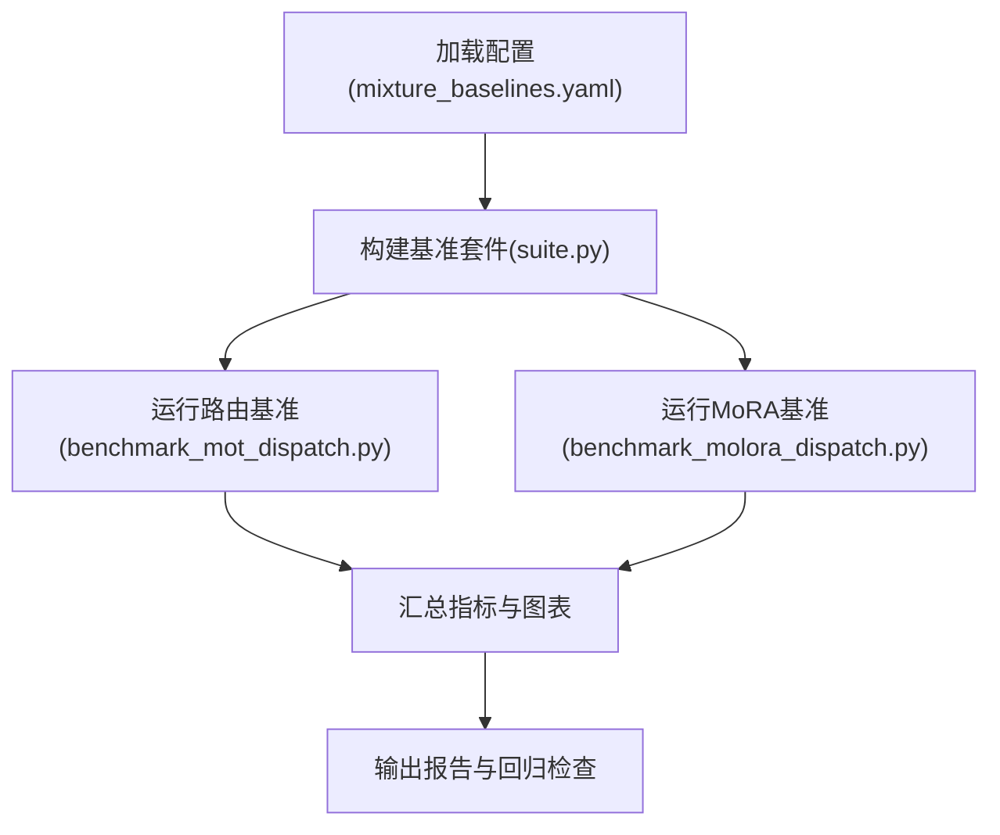
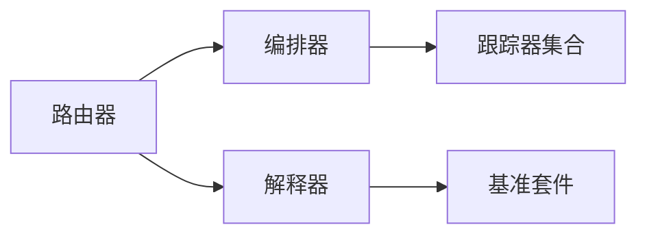

# 场景感知路由与混合架构

<cite>
**本文引用的文件**
- [mot-hybrid-architecture.md](file://docs/plans/mot-hybrid-architecture.md)
- [2026-07-17-mot-scene-aware-router.md](file://docs/plans/2026-07-17-mot-scene-aware-router.md)
- [routing-interpreter-toolkit.md](file://docs/plans/2026-07-17-routing-interpreter-toolkit.md)
- [benchmark_molora_dispatch.py](file://benchmarks/benchmark_molora_dispatch.py)
- [benchmark_mot_dispatch.py](file://benchmarks/benchmark_mot_dispatch.py)
- [suite.py](file://benchmarks/suite.py)
- [run.py](file://benchmarks/run.py)
- [mixture_baselines.yaml](file://benchmarks/mixture_baselines.yaml)
- [test_mot_scene_aware_router.py](file://tests/test_mot_scene_aware_router.py)
- [test_mot_routing_diagnostics.py](file://tests/test_mot_routing_diagnostics.py)
- [analyze_mot_routing.py](file://scripts/analyze_mot_routing.py)
- [diagnose_mot_routing.py](file://scripts/diagnose_mot_routing.py)
- [prepare_mot_routing_scenes.py](file://scripts/prepare_mot_routing_scenes.py)
- [compare_mot_ablation.py](file://scripts/compare_mot_ablation.py)
- [ablation_routing_cl.py](file://scripts/ablation_suite/ablation_routing_cl.py)
- [ablation_full_scenarios.py](file://scripts/ablation_suite/full_ablation_scenarios.py)
- [track.py](file://ultralytics/trackers/track.py)
- [basetrack.py](file://ultralytics/trackers/basetrack.py)
- [byte_tracker.py](file://ultralytics/trackers/byte_tracker.py)
- [deep_oc_sort.py](file://ultralytics/trackers/deep_oc_sort.py)
- [oc_sort.py](file://ultralytics/trackers/oc_sort.py)
- [bot_sort.py](file://ultralytics/trackers/bot_sort.py)
- [fast_tracker.py](file://ultralytics/trackers/fast_tracker.py)
- [track_tracker.py](file://ultralytics/trackers/track_tracker.py)
- [__init__.py](file://ultralytics/trackers/__init__.py)
- [utils/routing_interpreter.py](file://ultralytics/utils/routing_interpreter.py)
- [tools/routing_interpreter.py](file://tools/routing_interpreter.py)
- [governance/routing-interpretability.md](file://docs/governance/routing-interpretability.md)
</cite>

## 目录
1. [引言](#引言)
2. [项目结构](#项目结构)
3. [核心组件](#核心组件)
4. [架构总览](#架构总览)
5. [详细组件分析](#详细组件分析)
6. [依赖关系分析](#依赖关系分析)
7. [性能考量](#性能考量)
8. [故障排查指南](#故障排查指南)
9. [结论](#结论)
10. [附录](#附录)

## 引言
本技术文档围绕YOLO-Master在多目标跟踪（MOT）中的“场景感知路由与混合架构”展开，系统性阐述以下主题：
- 场景感知的概念与设计思想：如何从视频帧或局部场景中抽取可区分特征，以指导不同跟踪算法的选择。
- 动态路由器实现原理：包括场景特征提取、路由决策机制、训练策略与优化目标。
- 混合架构设计模式：支持多种跟踪算法的动态切换与统一接口。
- 路由器的训练流程与最佳实践：数据准备、损失设计、校准与评估。
- 不同场景下的路由策略与配置方法：典型场景分类、阈值与权重调优。
- 路由器与跟踪算法的接口设计与集成方式：统一调用契约、状态管理与资源调度。
- 路由性能监控与自适应调整机制：在线指标采集、漂移检测与回退策略。
- 分析与诊断工具：场景分类可视化、路由效果归因与解释性报告。

## 项目结构
与场景感知路由和混合架构相关的代码与文档分布在如下位置：
- 规划与设计文档：位于 docs/plans 与 docs/governance，定义整体方案、边界与治理要求。
- 基准测试套件：位于 benchmarks，提供路由与混合推理的性能对比与回归基线。
- 单元测试与验收用例：位于 tests，覆盖路由器行为、诊断与一致性校验。
- 脚本与分析工具：位于 scripts，包含场景准备、路由分析、消融实验与结果汇总。
- 跟踪器模块：位于 ultralytics/trackers，提供多类跟踪算法的统一封装与接口。
- 路由解释器：位于 ultralytics/utils 与 tools，提供路由决策的可解释性与可视化。

```mermaid
graph TB
subgraph "规划与治理"
P1["plans/mot-hybrid-architecture.md"]
P2["plans/2026-07-17-mot-scene-aware-router.md"]
G1["governance/routing-interpretability.md"]
end
subgraph "基准测试"
B1["benchmarks/benchmark_molora_dispatch.py"]
B2["benchmarks/benchmark_mot_dispatch.py"]
B3["benchmarks/suite.py"]
B4["benchmarks/run.py"]
B5["benchmarks/mixture_baselines.yaml"]
end
subgraph "测试与验证"
T1["tests/test_mot_scene_aware_router.py"]
T2["tests/test_mot_routing_diagnostics.py"]
end
subgraph "脚本与工具"
S1["scripts/analyze_mot_routing.py"]
S2["scripts/diagnose_mot_routing.py"]
S3["scripts/prepare_mot_routing_scenes.py"]
S4["scripts/compare_mot_ablation.py"]
S5["scripts/ablation_suite/ablation_routing_cl.py"]
S6["scripts/ablation_suite/full_ablation_scenarios.py"]
U1["ultralytics/utils/routing_interpreter.py"]
U2["tools/routing_interpreter.py"]
end
subgraph "跟踪器模块"
M0["ultralytics/trackers/__init__.py"]
M1["ultralytics/trackers/track.py"]
M2["ultralytics/trackers/basetrack.py"]
M3["ultralytics/trackers/byte_tracker.py"]
M4["ultralytics/trackers/deep_oc_sort.py"]
M5["ultralytics/trackers/oc_sort.py"]
M6["ultralytics/trackers/bot_sort.py"]
M7["ultralytics/trackers/fast_tracker.py"]
M8["ultralytics/trackers/track_tracker.py"]
end
P1 --> B1
P2 --> T1
G1 --> U1
B3 --> B1
B3 --> B2
S1 --> T2
S2 --> T2
S3 --> S1
S4 --> S1
S5 --> S1
S6 --> S1
U1 --> M0
U2 --> M0
M0 --> M1
M1 --> M2
M1 --> M3
M1 --> M4
M1 --> M5
M1 --> M6
M1 --> M7
M1 --> M8
```

图表来源
- [mot-hybrid-architecture.md](file://docs/plans/mot-hybrid-architecture.md)
- [2026-07-17-mot-scene-aware-router.md](file://docs/plans/2026-07-17-mot-scene-aware-router.md)
- [routing-interpretability.md](file://docs/governance/routing-interpretability.md)
- [benchmark_molora_dispatch.py](file://benchmarks/benchmark_molora_dispatch.py)
- [benchmark_mot_dispatch.py](file://benchmarks/benchmark_mot_dispatch.py)
- [suite.py](file://benchmarks/suite.py)
- [run.py](file://benchmarks/run.py)
- [mixture_baselines.yaml](file://benchmarks/mixture_baselines.yaml)
- [test_mot_scene_aware_router.py](file://tests/test_mot_scene_aware_router.py)
- [test_mot_routing_diagnostics.py](file://tests/test_mot_routing_diagnostics.py)
- [analyze_mot_routing.py](file://scripts/analyze_mot_routing.py)
- [diagnose_mot_routing.py](file://scripts/diagnose_mot_routing.py)
- [prepare_mot_routing_scenes.py](file://scripts/prepare_mot_routing_scenes.py)
- [compare_mot_ablation.py](file://scripts/compare_mot_ablation.py)
- [ablation_routing_cl.py](file://scripts/ablation_suite/ablation_routing_cl.py)
- [full_ablation_scenarios.py](file://scripts/ablation_suite/full_ablation_scenarios.py)
- [routing_interpreter.py](file://ultralytics/utils/routing_interpreter.py)
- [routing_interpreter.py](file://tools/routing_interpreter.py)
- [__init__.py](file://ultralytics/trackers/__init__.py)
- [track.py](file://ultralytics/trackers/track.py)
- [basetrack.py](file://ultralytics/trackers/basetrack.py)
- [byte_tracker.py](file://ultralytics/trackers/byte_tracker.py)
- [deep_oc_sort.py](file://ultralytics/trackers/deep_oc_sort.py)
- [oc_sort.py](file://ultralytics/trackers/oc_sort.py)
- [bot_sort.py](file://ultralytics/trackers/bot_sort.py)
- [fast_tracker.py](file://ultralytics/trackers/fast_tracker.py)
- [track_tracker.py](file://ultralytics/trackers/track_tracker.py)

章节来源
- [mot-hybrid-architecture.md](file://docs/plans/mot-hybrid-architecture.md)
- [2026-07-17-mot-scene-aware-router.md](file://docs/plans/2026-07-17-mot-scene-aware-router.md)
- [routing-interpretability.md](file://docs/governance/routing-interpretability.md)

## 核心组件
- 场景感知路由器：负责从输入帧或局部窗口中提取场景特征，并基于学习到的策略选择最优跟踪算法或组合策略。
- 混合跟踪编排器：统一管理多个跟踪器实例的生命周期、参数注入与结果融合，屏蔽底层差异。
- 路由解释器：对路由决策进行归因与可视化，输出专家使用分布、置信度与时序稳定性等指标。
- 基准与评测套件：提供端到端的路由+跟踪性能对比、回归基线与消融实验能力。
- 诊断与可视化工具：用于离线分析路由效果、场景分布与模型漂移，辅助迭代优化。

章节来源
- [2026-07-17-mot-scene-aware-router.md](file://docs/plans/2026-07-17-mot-scene-aware-router.md)
- [mot-hybrid-architecture.md](file://docs/plans/mot-hybrid-architecture.md)
- [routing-interpretability.md](file://docs/governance/routing-interpretability.md)

## 架构总览
下图展示了场景感知路由与混合架构的整体数据流与控制流：输入帧经场景特征提取后进入路由器，路由器输出跟踪器选择或权重；编排器根据决策加载或复用对应跟踪器，执行跟踪并返回结果；解释器与基准套件在旁路记录指标与可视化。

图表来源
- [2026-07-17-mot-scene-aware-router.md](file://docs/plans/2026-07-17-mot-scene-aware-router.md)
- [benchmark_mot_dispatch.py](file://benchmarks/benchmark_mot_dispatch.py)
- [benchmark_molora_dispatch.py](file://benchmarks/benchmark_molora_dispatch.py)
- [routing_interpreter.py](file://ultralytics/utils/routing_interpreter.py)
- [routing_interpreter.py](file://tools/routing_interpreter.py)

## 详细组件分析

### 场景感知路由器
- 功能职责
  - 场景特征提取：从单帧或多帧窗口中抽取结构化特征（如密度、遮挡比例、运动强度、类别先验等）。
  - 路由决策：将场景特征映射到具体跟踪器或软权重，支持硬选择与软混合两种模式。
  - 训练与校准：通过监督信号或强化学习信号优化路由网络，并进行置信度校准以保证稳定性。
- 关键设计点
  - 特征工程与表示：强调跨场景鲁棒性与时序平滑，避免过拟合特定数据集。
  - 决策空间约束：限制专家数量与激活稀疏性，降低计算开销与内存占用。
  - 容错与回退：当置信度低或异常时，回退到默认跟踪器或保守策略。
- 接口约定
  - 输入：场景特征向量、可选上下文（如历史路由、时间步）。
  - 输出：跟踪器索引或权重分布、置信度、解释信息。
- 训练策略与优化目标
  - 监督式：以各跟踪器在场景子集上的表现作为标签，最小化路由误差。
  - 联合式：与下游跟踪任务联合优化，引入路由正则项与稀疏约束。
  - 校准：温度缩放或保序回归，提升置信度可靠性。

图表来源
- [2026-07-17-mot-scene-aware-router.md](file://docs/plans/2026-07-17-mot-scene-aware-router.md)
- [routing_interpreter.py](file://ultralytics/utils/routing_interpreter.py)

章节来源
- [2026-07-17-mot-scene-aware-router.md](file://docs/plans/2026-07-17-mot-scene-aware-router.md)

### 混合跟踪编排器
- 功能职责
  - 统一接口：为上层提供一致的跟踪API，屏蔽不同跟踪器的差异。
  - 生命周期管理：按需加载/卸载跟踪器，缓存热路径，减少启动延迟。
  - 结果融合：对软混合输出的轨迹进行加权融合或冲突消解。
- 与路由器的协作
  - 接收路由器的选择或权重，按策略实例化或复用跟踪器。
  - 上报运行时指标（耗时、显存、吞吐）给解释器与基准套件。
- 接口约定
  - 初始化：注册可用跟踪器、设置全局参数与设备。
  - 推理：传入检测结果与上一帧状态，返回当前帧轨迹。
  - 清理：释放资源、重置内部状态。

图表来源
- [track.py](file://ultralytics/trackers/track.py)
- [basetrack.py](file://ultralytics/trackers/basetrack.py)
- [byte_tracker.py](file://ultralytics/trackers/byte_tracker.py)
- [deep_oc_sort.py](file://ultralytics/trackers/deep_oc_sort.py)
- [oc_sort.py](file://ultralytics/trackers/oc_sort.py)
- [bot_sort.py](file://ultralytics/trackers/bot_sort.py)
- [fast_tracker.py](file://ultralytics/trackers/fast_tracker.py)
- [track_tracker.py](file://ultralytics/trackers/track_tracker.py)

章节来源
- [track.py](file://ultralytics/trackers/track.py)
- [basetrack.py](file://ultralytics/trackers/basetrack.py)
- [byte_tracker.py](file://ultralytics/trackers/byte_tracker.py)
- [deep_oc_sort.py](file://ultralytics/trackers/deep_oc_sort.py)
- [oc_sort.py](file://ultralytics/trackers/oc_sort.py)
- [bot_sort.py](file://ultralytics/trackers/bot_sort.py)
- [fast_tracker.py](file://ultralytics/trackers/fast_tracker.py)
- [track_tracker.py](file://ultralytics/trackers/track_tracker.py)

### 路由解释器与可解释性
- 功能职责
  - 收集路由决策日志：记录每帧的场景特征、选择/权重、置信度与耗时。
  - 生成解释报告：统计专家使用分布、场景聚类、错误归因与稳定性指标。
  - 可视化：绘制路由热力图、时序曲线与混淆矩阵。
- 集成方式
  - 在路由器与编排器之间插入钩子，异步写入指标与中间产物。
  - 与基准套件对接，自动产出对比图表与回归告警。

图表来源
- [routing_interpreter.py](file://ultralytics/utils/routing_interpreter.py)
- [routing_interpreter.py](file://tools/routing_interpreter.py)
- [benchmark_mot_dispatch.py](file://benchmarks/benchmark_mot_dispatch.py)
- [benchmark_molora_dispatch.py](file://benchmarks/benchmark_molora_dispatch.py)

章节来源
- [routing_interpreter.py](file://ultralytics/utils/routing_interpreter.py)
- [routing_interpreter.py](file://tools/routing_interpreter.py)
- [routing-interpretability.md](file://docs/governance/routing-interpretability.md)

### 基准测试与评测套件
- 功能职责
  - 提供统一的运行入口与配置解析，支持多场景、多跟踪器与路由策略的组合。
  - 输出标准指标（精度、召回、F1、HOTA、MOTA等）与性能指标（FPS、显存、CPU/GPU利用率）。
  - 维护回归基线，确保路由与混合架构的改进不被退化。
- 关键文件
  - 运行器与套件：run.py、suite.py
  - 路由与混合调度基准：benchmark_mot_dispatch.py、benchmark_molora_dispatch.py
  - 基线配置：mixture_baselines.yaml

图表来源
- [run.py](file://benchmarks/run.py)
- [suite.py](file://benchmarks/suite.py)
- [benchmark_mot_dispatch.py](file://benchmarks/benchmark_mot_dispatch.py)
- [benchmark_molora_dispatch.py](file://benchmarks/benchmark_molora_dispatch.py)
- [mixture_baselines.yaml](file://benchmarks/mixture_baselines.yaml)

章节来源
- [run.py](file://benchmarks/run.py)
- [suite.py](file://benchmarks/suite.py)
- [benchmark_mot_dispatch.py](file://benchmarks/benchmark_mot_dispatch.py)
- [benchmark_molora_dispatch.py](file://benchmarks/benchmark_molora_dispatch.py)
- [mixture_baselines.yaml](file://benchmarks/mixture_baselines.yaml)

### 训练流程与最佳实践
- 数据准备
  - 场景划分：依据密度、遮挡、运动强度、类别分布等维度构造场景标签。
  - 样本均衡：对不同场景进行采样平衡，避免路由偏向多数场景。
- 训练步骤
  - 预训练场景特征提取器：在无监督或自监督任务上增强泛化。
  - 路由网络训练：监督信号来自各跟踪器在场景子集上的表现；加入稀疏与平滑正则。
  - 校准阶段：使用独立验证集进行置信度校准，提升稳定性。
- 最佳实践
  - 早停与验证：监控路由准确率与下游跟踪指标，防止过拟合。
  - 增量更新：定期用新数据微调路由，保持对长尾场景的敏感度。
  - 资源约束：控制专家数量与激活规模，满足边缘部署需求。

章节来源
- [2026-07-17-mot-scene-aware-router.md](file://docs/plans/2026-07-17-mot-scene-aware-router.md)
- [prepare_mot_routing_scenes.py](file://scripts/prepare_mot_routing_scenes.py)
- [ablation_routing_cl.py](file://scripts/ablation_suite/ablation_routing_cl.py)

### 不同场景下的路由策略与配置
- 典型场景
  - 高密度人群：优先选择抗遮挡与强关联能力的跟踪器。
  - 快速运动：偏好高帧率、低延迟的轻量级跟踪器。
  - 复杂背景：需要更强的外观建模与重识别能力。
- 配置方法
  - 场景阈值：调节特征空间的分割阈值，影响路由灵敏度。
  - 权重衰减：控制软混合的平滑程度，避免频繁切换。
  - 回退策略：设定置信度下限，触发默认跟踪器。
- 调优建议
  - 基于基准套件进行网格搜索与贝叶斯优化。
  - 结合解释器报告定位误判场景，针对性补充数据与正则。

章节来源
- [2026-07-17-mot-scene-aware-router.md](file://docs/plans/2026-07-17-mot-scene-aware-router.md)
- [compare_mot_ablation.py](file://scripts/compare_mot_ablation.py)
- [full_ablation_scenarios.py](file://scripts/ablation_suite/full_ablation_scenarios.py)

### 路由器与跟踪算法的接口设计与集成
- 统一接口
  - 初始化：注册跟踪器名称、参数模板与设备信息。
  - 推理：接收检测结果与状态，返回轨迹与元数据。
  - 清理：释放GPU/CPU资源，重置内部缓存。
- 集成要点
  - 状态隔离：每个跟踪器维护独立状态，避免交叉污染。
  - 资源池：对昂贵跟踪器进行预热与复用，降低冷启动开销。
  - 错误处理：捕获异常并记录，保证流水线稳定。

章节来源
- [__init__.py](file://ultralytics/trackers/__init__.py)
- [track.py](file://ultralytics/trackers/track.py)
- [basetrack.py](file://ultralytics/trackers/basetrack.py)

### 路由性能监控与自适应调整
- 监控指标
  - 路由准确率、专家使用分布、置信度均值与方差。
  - 下游跟踪指标（HOTA、MOTA、IDF1）、延迟与吞吐。
- 自适应调整
  - 滑动窗口统计：检测场景分布漂移，触发路由微调或回退。
  - 在线校准：动态调整温度参数，维持置信度可靠性。
  - 资源自适应：根据设备负载动态选择轻量或重型跟踪器。

章节来源
- [test_mot_routing_diagnostics.py](file://tests/test_mot_routing_diagnostics.py)
- [diagnose_mot_routing.py](file://scripts/diagnose_mot_routing.py)
- [routing-interpretability.md](file://docs/governance/routing-interpretability.md)

### 分析与诊断工具
- 场景准备
  - 自动化划分场景标签，生成训练/验证/测试集。
- 路由分析
  - 统计专家使用、场景聚类与错误归因，输出可视化报告。
- 消融实验
  - 对比不同路由策略、特征设计与正则项的效果。
- 工具清单
  - prepare_mot_routing_scenes.py：场景数据准备
  - analyze_mot_routing.py：路由效果分析
  - diagnose_mot_routing.py：诊断与可视化
  - compare_mot_ablation.py：消融对比
  - ablation_routing_cl.py：路由持续学习消融
  - full_ablation_scenarios.py：全量场景消融

章节来源
- [prepare_mot_routing_scenes.py](file://scripts/prepare_mot_routing_scenes.py)
- [analyze_mot_routing.py](file://scripts/analyze_mot_routing.py)
- [diagnose_mot_routing.py](file://scripts/diagnose_mot_routing.py)
- [compare_mot_ablation.py](file://scripts/compare_mot_ablation.py)
- [ablation_routing_cl.py](file://scripts/ablation_suite/ablation_routing_cl.py)
- [full_ablation_scenarios.py](file://scripts/ablation_suite/full_ablation_scenarios.py)

## 依赖关系分析
- 组件耦合
  - 路由器与编排器松耦合：通过统一接口通信，便于替换与扩展。
  - 解释器与基准套件弱依赖：仅消费日志与指标，不影响主链路。
- 外部依赖
  - 跟踪器实现遵循统一协议，新增跟踪器无需修改路由器与编排器。
- 潜在循环依赖
  - 通过分层与接口抽象避免循环导入，确保可维护性。

图表来源
- [2026-07-17-mot-scene-aware-router.md](file://docs/plans/2026-07-17-mot-scene-aware-router.md)
- [benchmark_mot_dispatch.py](file://benchmarks/benchmark_mot_dispatch.py)
- [routing_interpreter.py](file://ultralytics/utils/routing_interpreter.py)

章节来源
- [2026-07-17-mot-scene-aware-router.md](file://docs/plans/2026-07-17-mot-scene-aware-router.md)
- [benchmark_mot_dispatch.py](file://benchmarks/benchmark_mot_dispatch.py)
- [routing_interpreter.py](file://ultralytics/utils/routing_interpreter.py)

## 性能考量
- 计算开销
  - 场景特征提取应轻量化，避免成为瓶颈。
  - 路由决策需低延迟，必要时采用查表或近似匹配。
- 内存与显存
  - 跟踪器按需加载，避免同时驻留过多重型模型。
  - 结果缓冲与批处理策略平衡吞吐与延迟。
- 可扩展性
  - 插件化跟踪器注册机制，支持热插拔。
  - 配置驱动的路由策略，便于A/B测试与灰度发布。

## 故障排查指南
- 常见问题
  - 路由不稳定：检查置信度校准与平滑正则，必要时提高回退阈值。
  - 专家偏斜：重新平衡场景数据，增加少数场景的正则权重。
  - 性能退化：核对基准套件配置与数据版本，确认无回归。
- 诊断步骤
  - 使用解释器报告定位误判场景与高频切换帧。
  - 通过基准套件复现实验，对比不同策略与超参。
  - 逐步简化问题：关闭软混合、固定路由策略，观察是否改善。

章节来源
- [test_mot_routing_diagnostics.py](file://tests/test_mot_routing_diagnostics.py)
- [diagnose_mot_routing.py](file://scripts/diagnose_mot_routing.py)
- [benchmark_mot_dispatch.py](file://benchmarks/benchmark_mot_dispatch.py)

## 结论
场景感知路由与混合架构为多目标跟踪提供了灵活且高效的解决方案。通过合理的场景特征设计、稳健的路由决策与完善的监控解释体系，系统能够在多样化场景中取得更优的精度与性能平衡。配合基准套件与诊断工具，团队可以持续迭代与验证，确保长期演进的质量与效率。

## 附录
- 术语表
  - 场景感知：基于输入帧或片段的语义与统计特征进行决策。
  - 路由：将输入映射到具体跟踪器或权重分布的过程。
  - 软混合：对多个跟踪器结果进行加权融合的策略。
  - 校准：调整置信度使其与实际概率一致的技术。
- 参考文档
  - 混合架构规划：[mot-hybrid-architecture.md](file://docs/plans/mot-hybrid-architecture.md)
  - 场景感知路由器规划：[2026-07-17-mot-scene-aware-router.md](file://docs/plans/2026-07-17-mot-scene-aware-router.md)
  - 路由可解释性治理：[routing-interpretability.md](file://docs/governance/routing-interpretability.md)