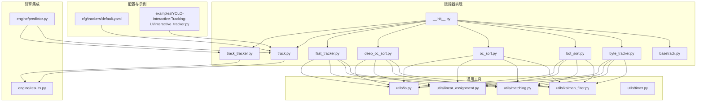
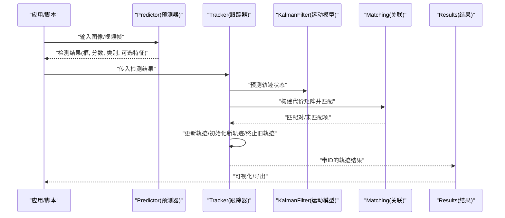
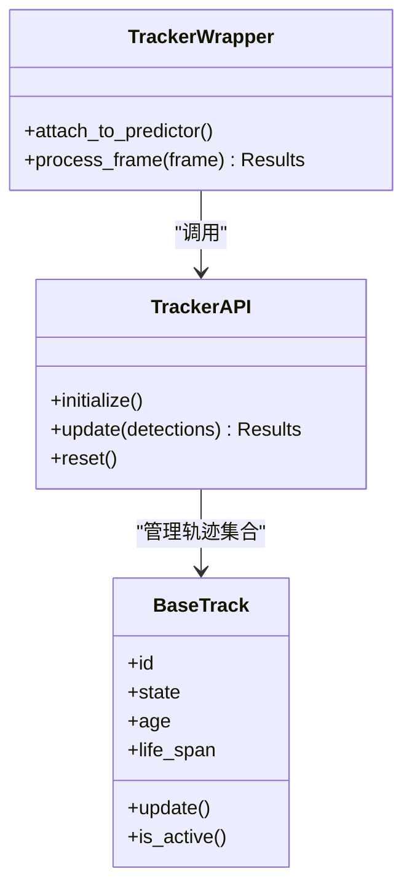
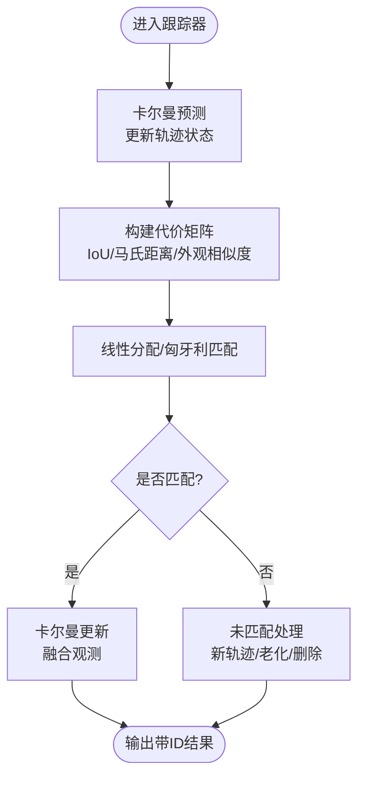
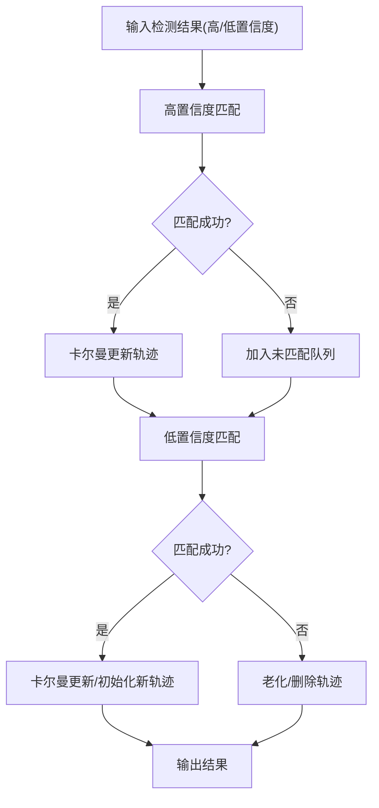
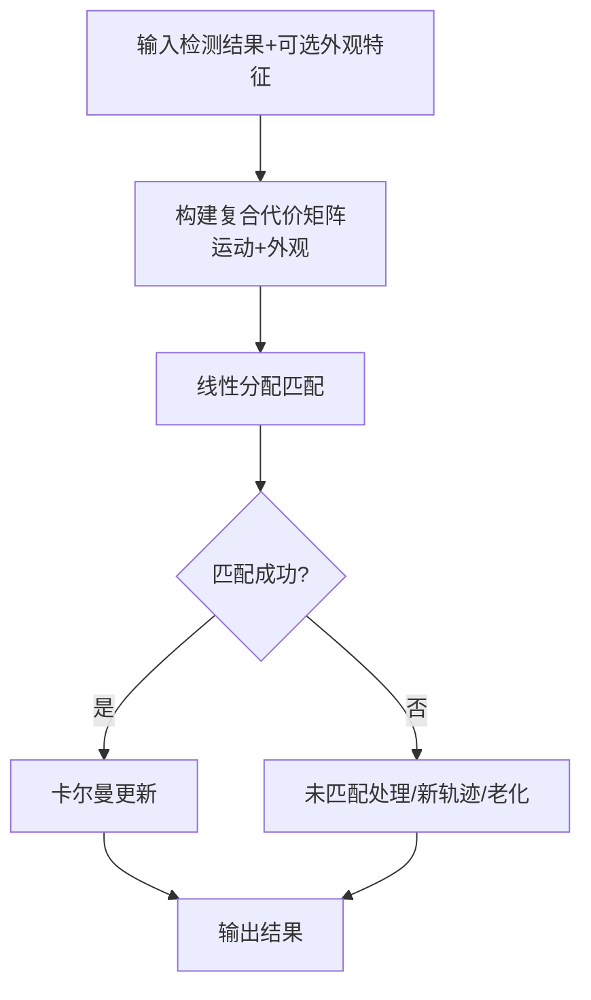
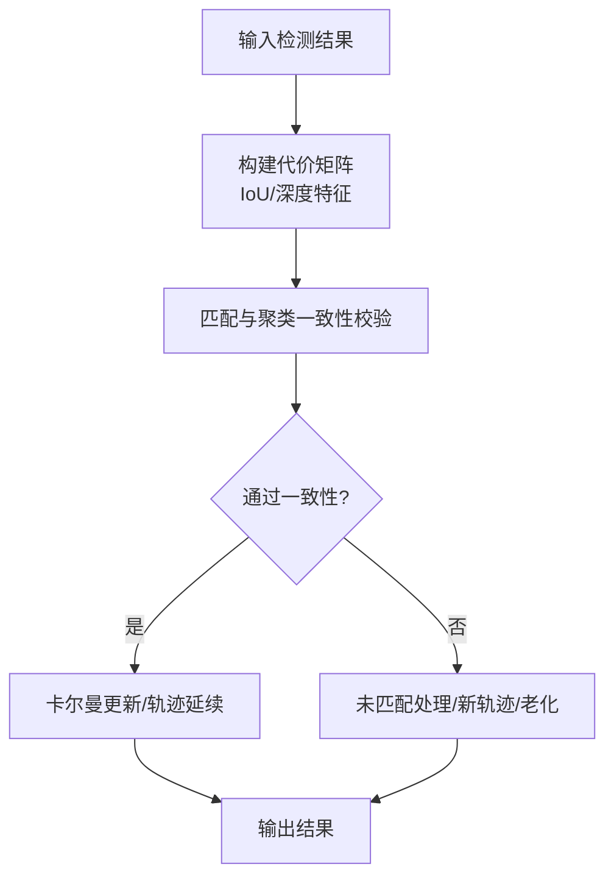
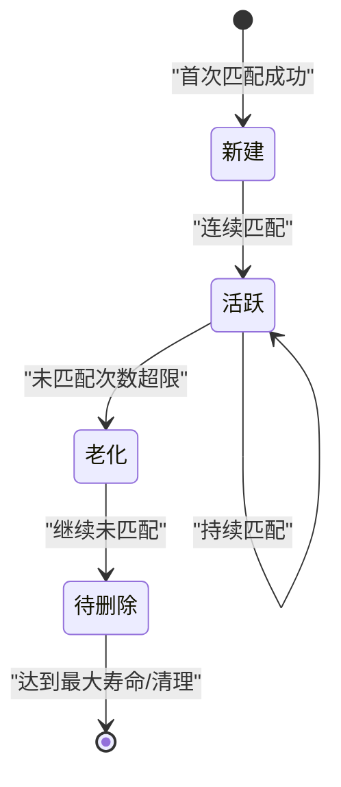
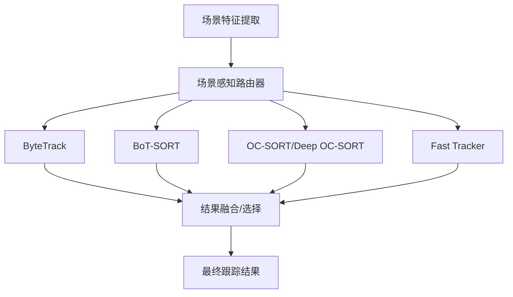
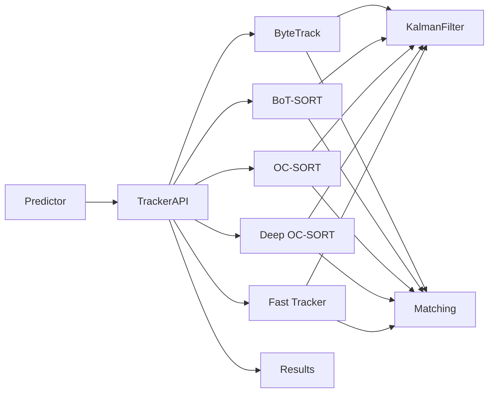

# 多目标跟踪系统

<cite>
**本文引用的文件**
- [ultralytics/trackers/__init__.py](file://ultralytics/trackers/__init__.py)
- [ultralytics/trackers/basetrack.py](file://ultralytics/trackers/basetrack.py)
- [ultralytics/trackers/byte_tracker.py](file://ultralytics/trackers/byte_tracker.py)
- [ultralytics/trackers/bot_sort.py](file://ultralytics/trackers/bot_sort.py)
- [ultralytics/trackers/deep_oc_sort.py](file://ultralytics/trackers/deep_oc_sort.py)
- [ultralytics/trackers/oc_sort.py](file://ultralytics/trackers/oc_sort.py)
- [ultralytics/trackers/fast_tracker.py](file://ultralytics/trackers/fast_tracker.py)
- [ultralytics/trackers/track.py](file://ultralytics/trackers/track.py)
- [ultralytics/trackers/track_tracker.py](file://ultralytics/trackers/track_tracker.py)
- [ultralytics/trackers/utils/kalman_filter.py](file://ultralytics/trackers/utils/kalman_filter.py)
- [ultralytics/trackers/utils/matching.py](file://ultralytics/trackers/utils/matching.py)
- [ultralytics/trackers/utils/linear_assignment.py](file://ultralytics/trackers/utils/linear_assignment.py)
- [ultralytics/trackers/utils/io.py](file://ultralytics/trackers/utils/io.py)
- [ultralytics/trackers/utils/timer.py](file://ultralytics/trackers/utils/timer.py)
- [ultralytics/engine/predictor.py](file://ultralytics/engine/predictor.py)
- [ultralytics/engine/results.py](file://ultralytics/engine/results.py)
- [ultralytics/cfg/trackers/default.yaml](file://ultralytics/cfg/trackers/default.yaml)
- [examples/YOLO-Interactive-Tracking-UI/interactive_tracker.py](file://examples/YOLO-Interactive-Tracking-UI/interactive_tracker.py)
- [benchmarks/benchmark_mot_dispatch.py](file://benchmarks/benchmark_mot_dispatch.py)
- [scripts/analyze_mot_routing.py](file://scripts/analyze_mot_routing.py)
- [scripts/diagnose_mot_routing.py](file://scripts/diagnose_mot_routing.py)
- [tests/test_mot.py](file://tests/test_mot.py)
- [tests/test_mot_scene_aware_router.py](file://tests/test_mot_scene_aware_router.py)
</cite>

## 目录
1. [简介](#简介)
2. [项目结构](#项目结构)
3. [核心组件](#核心组件)
4. [架构总览](#架构总览)
5. [详细组件分析](#详细组件分析)
6. [依赖关系分析](#依赖关系分析)
7. [性能考量](#性能考量)
8. [故障排查指南](#故障排查指南)
9. [结论](#结论)
10. [附录](#附录)

## 简介
本技术文档面向YOLO-Master的多目标跟踪（MOT）子系统，系统性阐述“检测-关联-跟踪”的完整流程与工程实现。重点覆盖：
- 跟踪算法族：ByteTrack、BoT-SORT、OC-SORT及其变体（Deep OC-SORT、Fast Tracker）的核心原理与配置要点
- ID分配策略与重识别（Re-ID）集成方式
- 运动建模与卡尔曼滤波的实现细节
- 轨迹管理与生命周期控制机制
- 场景感知路由器与混合架构设计
- 评估指标与基准测试方法
- 实时优化策略（内存管理、计算效率）
- 交互式跟踪UI使用与二次开发
- 结果后处理与可视化输出
- 不同场景下的配置调优建议

## 项目结构
多目标跟踪相关代码主要位于 ultralytics/trackers 目录，配套工具在 utils 子目录中；与推理引擎的集成通过 engine/predictor 和 engine/results 完成；配置文件集中于 cfg/trackers；示例与交互界面在 examples 下；基准与诊断脚本在 benchmarks 与 scripts 下；测试用例在 tests 下。

图表来源
- [ultralytics/trackers/__init__.py](file://ultralytics/trackers/__init__.py)
- [ultralytics/trackers/basetrack.py](file://ultralytics/trackers/basetrack.py)
- [ultralytics/trackers/byte_tracker.py](file://ultralytics/trackers/byte_tracker.py)
- [ultralytics/trackers/bot_sort.py](file://ultralytics/trackers/bot_sort.py)
- [ultralytics/trackers/oc_sort.py](file://ultralytics/trackers/oc_sort.py)
- [ultralytics/trackers/deep_oc_sort.py](file://ultralytics/trackers/deep_oc_sort.py)
- [ultralytics/trackers/fast_tracker.py](file://ultralytics/trackers/fast_tracker.py)
- [ultralytics/trackers/track.py](file://ultralytics/trackers/track.py)
- [ultralytics/trackers/track_tracker.py](file://ultralytics/trackers/track_tracker.py)
- [ultralytics/trackers/utils/kalman_filter.py](file://ultralytics/trackers/utils/kalman_filter.py)
- [ultralytics/trackers/utils/matching.py](file://ultralytics/trackers/utils/matching.py)
- [ultralytics/trackers/utils/linear_assignment.py](file://ultralytics/trackers/utils/linear_assignment.py)
- [ultralytics/trackers/utils/io.py](file://ultralytics/trackers/utils/io.py)
- [ultralytics/trackers/utils/timer.py](file://ultralytics/trackers/utils/timer.py)
- [ultralytics/engine/predictor.py](file://ultralytics/engine/predictor.py)
- [ultralytics/engine/results.py](file://ultralytics/engine/results.py)
- [ultralytics/cfg/trackers/default.yaml](file://ultralytics/cfg/trackers/default.yaml)
- [examples/YOLO-Interactive-Tracking-UI/interactive_tracker.py](file://examples/YOLO-Interactive-Tracking-UI/interactive_tracker.py)

章节来源
- [ultralytics/trackers/__init__.py](file://ultralytics/trackers/__init__.py)
- [ultralytics/trackers/track.py](file://ultralytics/trackers/track.py)
- [ultralytics/trackers/track_tracker.py](file://ultralytics/trackers/track_tracker.py)
- [ultralytics/engine/predictor.py](file://ultralytics/engine/predictor.py)
- [ultralytics/engine/results.py](file://ultralytics/engine/results.py)
- [ultralytics/cfg/trackers/default.yaml](file://ultralytics/cfg/trackers/default.yaml)

## 核心组件
- 统一跟踪接口与包装器
  - track.py：提供高层跟踪API，负责将检测结果输入到具体跟踪器实例，并返回带ID的轨迹结果。
  - track_tracker.py：封装跟踪器调用，便于与预测器流水线集成。
- 基类与轨迹对象
  - basetrack.py：定义轨迹基类，包含ID、状态、生命周期、更新接口等通用能力。
- 具体跟踪算法
  - byte_tracker.py：基于低置信度检测补全的匹配策略，强调召回率与稳定性。
  - bot_sort.py：融合外观特征（Re-ID）与运动模型，提升遮挡与长时跟踪鲁棒性。
  - oc_sort.py / deep_oc_sort.py：基于IoU与深度特征的SORT变体，兼顾速度与精度。
  - fast_tracker.py：轻量级快速跟踪实现，适合资源受限场景。
- 通用工具
  - kalman_filter.py：线性高斯运动模型，用于预测与更新轨迹状态。
  - matching.py：匈牙利匹配、阈值过滤、代价矩阵构建等。
  - linear_assignment.py：线性分配求解器封装。
  - io.py：IoU、NMS等几何操作。
  - timer.py：计时与统计辅助。

章节来源
- [ultralytics/trackers/track.py](file://ultralytics/trackers/track.py)
- [ultralytics/trackers/track_tracker.py](file://ultralytics/trackers/track_tracker.py)
- [ultralytics/trackers/basetrack.py](file://ultralytics/trackers/basetrack.py)
- [ultralytics/trackers/byte_tracker.py](file://ultralytics/trackers/byte_tracker.py)
- [ultralytics/trackers/bot_sort.py](file://ultralytics/trackers/bot_sort.py)
- [ultralytics/trackers/oc_sort.py](file://ultralytics/trackers/oc_sort.py)
- [ultralytics/trackers/deep_oc_sort.py](file://ultralytics/trackers/deep_oc_sort.py)
- [ultralytics/trackers/fast_tracker.py](file://ultralytics/trackers/fast_tracker.py)
- [ultralytics/trackers/utils/kalman_filter.py](file://ultralytics/trackers/utils/kalman_filter.py)
- [ultralytics/trackers/utils/matching.py](file://ultralytics/trackers/utils/matching.py)
- [ultralytics/trackers/utils/linear_assignment.py](file://ultralytics/trackers/utils/linear_assignment.py)
- [ultralytics/trackers/utils/io.py](file://ultralytics/trackers/utils/io.py)
- [ultralytics/trackers/utils/timer.py](file://ultralytics/trackers/utils/timer.py)

## 架构总览
整体遵循“检测-关联-跟踪”流水线：预测器输出检测框与可选特征，跟踪器根据当前帧检测结果与历史轨迹进行关联，更新轨迹状态并生成带ID的结果。

图表来源
- [ultralytics/engine/predictor.py](file://ultralytics/engine/predictor.py)
- [ultralytics/trackers/track.py](file://ultralytics/trackers/track.py)
- [ultralytics/trackers/utils/kalman_filter.py](file://ultralytics/trackers/utils/kalman_filter.py)
- [ultralytics/trackers/utils/matching.py](file://ultralytics/trackers/utils/matching.py)
- [ultralytics/engine/results.py](file://ultralytics/engine/results.py)

## 详细组件分析

### 统一跟踪接口与包装器
- track.py
  - 职责：对外暴露统一的跟踪API，接收检测结果，选择并调用具体跟踪器，返回标准化结果。
  - 关键点：支持多种跟踪器注册与切换；维护每帧处理时序；与Results对象对接。
- track_tracker.py
  - 职责：为预测器流水线提供跟踪包装，简化集成步骤。
  - 关键点：封装初始化、逐帧调用、结果合并与清理。

图表来源
- [ultralytics/trackers/track.py](file://ultralytics/trackers/track.py)
- [ultralytics/trackers/track_tracker.py](file://ultralytics/trackers/track_tracker.py)
- [ultralytics/trackers/basetrack.py](file://ultralytics/trackers/basetrack.py)

章节来源
- [ultralytics/trackers/track.py](file://ultralytics/trackers/track.py)
- [ultralytics/trackers/track_tracker.py](file://ultralytics/trackers/track_tracker.py)
- [ultralytics/trackers/basetrack.py](file://ultralytics/trackers/basetrack.py)

### 运动建模与卡尔曼滤波
- kalman_filter.py
  - 职责：实现线性高斯卡尔曼滤波，用于位置/速度预测与观测更新。
  - 关键点：状态向量维度、过程噪声、观测噪声、协方差更新；与匹配模块协同提供预测边界。

图表来源
- [ultralytics/trackers/utils/kalman_filter.py](file://ultralytics/trackers/utils/kalman_filter.py)
- [ultralytics/trackers/utils/matching.py](file://ultralytics/trackers/utils/matching.py)
- [ultralytics/trackers/utils/linear_assignment.py](file://ultralytics/trackers/utils/linear_assignment.py)

章节来源
- [ultralytics/trackers/utils/kalman_filter.py](file://ultralytics/trackers/utils/kalman_filter.py)
- [ultralytics/trackers/utils/matching.py](file://ultralytics/trackers/utils/matching.py)
- [ultralytics/trackers/utils/linear_assignment.py](file://ultralytics/trackers/utils/linear_assignment.py)

### ByteTrack 算法
- 核心思想：利用低置信度检测补充匹配，提高召回与连续性；结合IoU与置信度阈值进行两阶段匹配。
- 关键流程：
  - 第一阶段：高置信度检测与活跃轨迹匹配
  - 第二阶段：低置信度检测与未匹配轨迹或新候选匹配
  - 轨迹更新：成功匹配则卡尔曼更新，未匹配则老化计数增加
- 适用场景：密集人群、频繁遮挡、需要高召回率的场景

图表来源
- [ultralytics/trackers/byte_tracker.py](file://ultralytics/trackers/byte_tracker.py)
- [ultralytics/trackers/utils/matching.py](file://ultralytics/trackers/utils/matching.py)
- [ultralytics/trackers/utils/io.py](file://ultralytics/trackers/utils/io.py)

章节来源
- [ultralytics/trackers/byte_tracker.py](file://ultralytics/trackers/byte_tracker.py)
- [ultralytics/trackers/utils/matching.py](file://ultralytics/trackers/utils/matching.py)
- [ultralytics/trackers/utils/io.py](file://ultralytics/trackers/utils/io.py)

### BoT-SORT 算法
- 核心思想：融合外观特征（Re-ID）与运动模型，采用更稳健的代价组合与轨迹管理策略。
- 关键流程：
  - 外观特征提取与归一化
  - 运动代价与外观代价加权融合
  - 匹配策略与轨迹生命周期控制
- 适用场景：存在显著外观变化、长时间遮挡、需要稳定ID的场景

图表来源
- [ultralytics/trackers/bot_sort.py](file://ultralytics/trackers/bot_sort.py)
- [ultralytics/trackers/utils/matching.py](file://ultralytics/trackers/utils/matching.py)
- [ultralytics/trackers/utils/kalman_filter.py](file://ultralytics/trackers/utils/kalman_filter.py)

章节来源
- [ultralytics/trackers/bot_sort.py](file://ultralytics/trackers/bot_sort.py)
- [ultralytics/trackers/utils/matching.py](file://ultralytics/trackers/utils/matching.py)
- [ultralytics/trackers/utils/kalman_filter.py](file://ultralytics/trackers/utils/kalman_filter.py)

### OC-SORT 与 Deep OC-SORT
- OC-SORT：在SORT基础上引入在线聚类与轨迹一致性约束，增强遮挡恢复能力。
- Deep OC-SORT：进一步引入深度特征，提升复杂场景下的区分度与鲁棒性。
- 关键差异：
  - 代价函数：IoU vs IoU+深度特征
  - 轨迹管理：在线聚类策略与一致性检查
- 适用场景：中等至高密度场景，需要平衡速度与精度的应用

图表来源
- [ultralytics/trackers/oc_sort.py](file://ultralytics/trackers/oc_sort.py)
- [ultralytics/trackers/deep_oc_sort.py](file://ultralytics/trackers/deep_oc_sort.py)
- [ultralytics/trackers/utils/matching.py](file://ultralytics/trackers/utils/matching.py)

章节来源
- [ultralytics/trackers/oc_sort.py](file://ultralytics/trackers/oc_sort.py)
- [ultralytics/trackers/deep_oc_sort.py](file://ultralytics/trackers/deep_oc_sort.py)
- [ultralytics/trackers/utils/matching.py](file://ultralytics/trackers/utils/matching.py)

### Fast Tracker
- 定位：轻量级快速跟踪实现，减少计算开销，适合边缘设备或高帧率需求。
- 特点：简化匹配与轨迹管理逻辑，降低内存占用。
- 适用场景：移动端、嵌入式平台、实时性优先的应用

章节来源
- [ultralytics/trackers/fast_tracker.py](file://ultralytics/trackers/fast_tracker.py)

### 轨迹管理与生命周期控制
- 轨迹对象（BaseTrack）
  - 属性：唯一ID、状态向量、年龄、最大寿命、活跃度标志
  - 行为：更新状态、判断活跃、清理资源
- 生命周期策略
  - 初始化：首次匹配成功即创建新轨迹
  - 延续：连续匹配成功则更新状态
  - 老化：未匹配次数超过阈值则标记为待删除
  - 删除：达到最大寿命或不可恢复时移除

图表来源
- [ultralytics/trackers/basetrack.py](file://ultralytics/trackers/basetrack.py)

章节来源
- [ultralytics/trackers/basetrack.py](file://ultralytics/trackers/basetrack.py)

### 场景感知路由器与混合架构
- 动机：不同场景（如密集人群、稀疏道路、强遮挡）对跟踪器的偏好不同，单一算法难以兼顾所有指标。
- 设计思路：
  - 场景分类：基于帧内统计（密度、遮挡比例、运动强度）或外部元数据
  - 路由决策：根据场景标签选择最优跟踪器或动态混合权重
  - 混合模式：多跟踪器并行运行，按场景自适应融合结果
- 诊断与分析：
  - analyze_mot_routing.py：分析路由效果与性能分布
  - diagnose_mot_routing.py：定位路由异常与漂移

图表来源
- [scripts/analyze_mot_routing.py](file://scripts/analyze_mot_routing.py)
- [scripts/diagnose_mot_routing.py](file://scripts/diagnose_mot_routing.py)

章节来源
- [scripts/analyze_mot_routing.py](file://scripts/analyze_mot_routing.py)
- [scripts/diagnose_mot_routing.py](file://scripts/diagnose_mot_routing.py)

### 评估指标与基准测试
- 常用指标：MOTA、IDF1、IDs、MT、ML、FP、FN等
- 基准套件：
  - benchmark_mot_dispatch.py：调度不同跟踪器与数据集，汇总对比结果
  - tests/test_mot.py：单元测试与回归验证
  - tests/test_mot_scene_aware_router.py：场景感知路由的专项测试
- 使用方法：
  - 配置数据集路径与跟踪器参数
  - 运行基准脚本，输出指标与可视化报告
  - 对比不同配置与算法的性能差异

章节来源
- [benchmarks/benchmark_mot_dispatch.py](file://benchmarks/benchmark_mot_dispatch.py)
- [tests/test_mot.py](file://tests/test_mot.py)
- [tests/test_mot_scene_aware_router.py](file://tests/test_mot_scene_aware_router.py)

### 实时跟踪优化策略
- 内存管理
  - 限制轨迹缓存数量与生命周期，及时释放无用轨迹
  - 复用中间张量与缓冲区，避免频繁分配
- 计算效率
  - 选择合适的跟踪器（Fast Tracker用于边缘设备）
  - 调整匹配阈值与窗口大小，平衡召回与延迟
  - 使用向量化IoU与近似匹配加速
- 流水线并行
  - 预测与跟踪解耦，异步处理前后帧
  - 批处理小批量帧以提升吞吐

[本节为通用指导，不直接分析具体文件]

### 交互式跟踪UI与自定义开发
- interactive_tracker.py
  - 功能：提供交互式界面，支持加载视频/摄像头、选择跟踪器、调节参数、实时可视化
  - 扩展点：新增跟踪器、自定义可视化样式、添加业务逻辑（区域计数、越界报警等）
- 使用指南
  - 启动UI，选择模型与跟踪器
  - 加载输入源，开始跟踪
  - 通过界面控件调整阈值、窗口大小、外观权重等
  - 保存结果或导出轨迹

章节来源
- [examples/YOLO-Interactive-Tracking-UI/interactive_tracker.py](file://examples/YOLO-Interactive-Tracking-UI/interactive_tracker.py)

### 结果后处理与可视化输出
- 结果对象（Results）
  - 承载带ID的轨迹、边界框、类别、分数、可选特征
  - 提供绘制、导出、统计等方法
- 后处理
  - 轨迹平滑、去抖、跨视角拼接
  - 统计指标计算与报表生成
- 可视化
  - 绘制轨迹线、ID标签、热力图
  - 导出视频或序列图像

章节来源
- [ultralytics/engine/results.py](file://ultralytics/engine/results.py)

### 配置方法与最佳实践
- 默认配置（default.yaml）
  - 跟踪器选择、阈值、窗口大小、外观权重、卡尔曼噪声等
- 调优建议
  - 密集人群：提高低置信度阈值、增大匹配窗口、启用外观特征
  - 稀疏道路：降低外观权重、缩短轨迹寿命、提高删除阈值
  - 强遮挡：延长轨迹寿命、增加外观相似度权重、使用BoT-SORT或Deep OC-SORT
  - 边缘设备：选用Fast Tracker、减小窗口、降低分辨率

章节来源
- [ultralytics/cfg/trackers/default.yaml](file://ultralytics/cfg/trackers/default.yaml)

## 依赖关系分析
跟踪器之间的耦合度较低，主要通过统一接口与通用工具协作；与预测器和结果对象的集成清晰，便于替换与扩展。

图表来源
- [ultralytics/engine/predictor.py](file://ultralytics/engine/predictor.py)
- [ultralytics/trackers/track.py](file://ultralytics/trackers/track.py)
- [ultralytics/trackers/byte_tracker.py](file://ultralytics/trackers/byte_tracker.py)
- [ultralytics/trackers/bot_sort.py](file://ultralytics/trackers/bot_sort.py)
- [ultralytics/trackers/oc_sort.py](file://ultralytics/trackers/oc_sort.py)
- [ultralytics/trackers/deep_oc_sort.py](file://ultralytics/trackers/deep_oc_sort.py)
- [ultralytics/trackers/fast_tracker.py](file://ultralytics/trackers/fast_tracker.py)
- [ultralytics/trackers/utils/kalman_filter.py](file://ultralytics/trackers/utils/kalman_filter.py)
- [ultralytics/trackers/utils/matching.py](file://ultralytics/trackers/utils/matching.py)
- [ultralytics/engine/results.py](file://ultralytics/engine/results.py)

章节来源
- [ultralytics/trackers/__init__.py](file://ultralytics/trackers/__init__.py)
- [ultralytics/trackers/track.py](file://ultralytics/trackers/track.py)
- [ultralytics/trackers/track_tracker.py](file://ultralytics/trackers/track_tracker.py)
- [ultralytics/engine/predictor.py](file://ultralytics/engine/predictor.py)
- [ultralytics/engine/results.py](file://ultralytics/engine/results.py)

## 性能考量
- 算法选择
  - 高精度优先：BoT-SORT、Deep OC-SORT
  - 高召回优先：ByteTrack
  - 低延迟优先：Fast Tracker
- 参数调优
  - 匹配阈值、外观权重、轨迹寿命、窗口大小
- 硬件适配
  - CPU/GPU/边缘设备的权衡
  - 模型与跟踪器联合优化（分辨率、批次大小）

[本节为通用指导，不直接分析具体文件]

## 故障排查指南
- 常见问题
  - ID跳变：检查外观相似度阈值与轨迹寿命
  - 漏检过多：提高低置信度阈值、扩大匹配窗口
  - 延迟过高：更换轻量跟踪器、降低分辨率、减少窗口
- 诊断工具
  - analyze_mot_routing.py：分析路由效果
  - diagnose_mot_routing.py：定位路由异常
- 测试验证
  - tests/test_mot.py：回归测试
  - tests/test_mot_scene_aware_router.py：路由专项测试

章节来源
- [scripts/analyze_mot_routing.py](file://scripts/analyze_mot_routing.py)
- [scripts/diagnose_mot_routing.py](file://scripts/diagnose_mot_routing.py)
- [tests/test_mot.py](file://tests/test_mot.py)
- [tests/test_mot_scene_aware_router.py](file://tests/test_mot_scene_aware_router.py)

## 结论
YOLO-Master的多目标跟踪子系统提供了模块化、可扩展的跟踪框架，涵盖主流算法与实用工具。通过场景感知路由器与混合架构，可在不同场景中灵活选择与融合跟踪策略。配合完善的评估与诊断工具，用户可高效调优以满足多样化应用需求。

[本节为总结，不直接分析具体文件]

## 附录
- 快速上手
  - 使用默认配置快速运行跟踪
  - 通过交互式UI进行参数探索
- 进阶定制
  - 新增跟踪器实现与注册
  - 自定义代价函数与匹配策略
  - 集成外部Re-ID模型

[本节为补充说明，不直接分析具体文件]