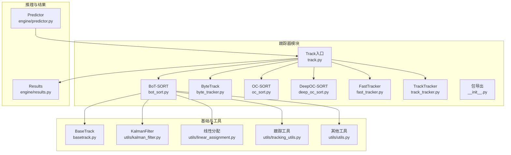
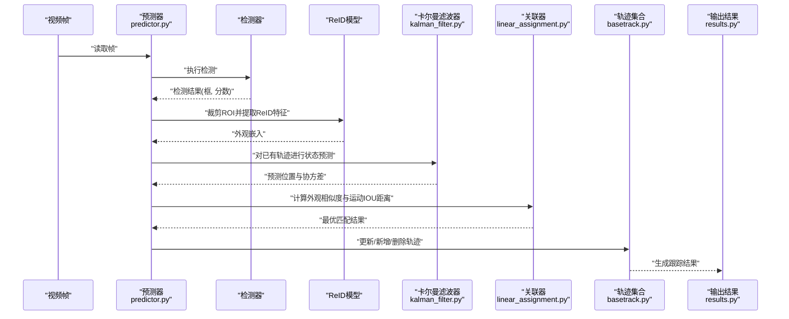
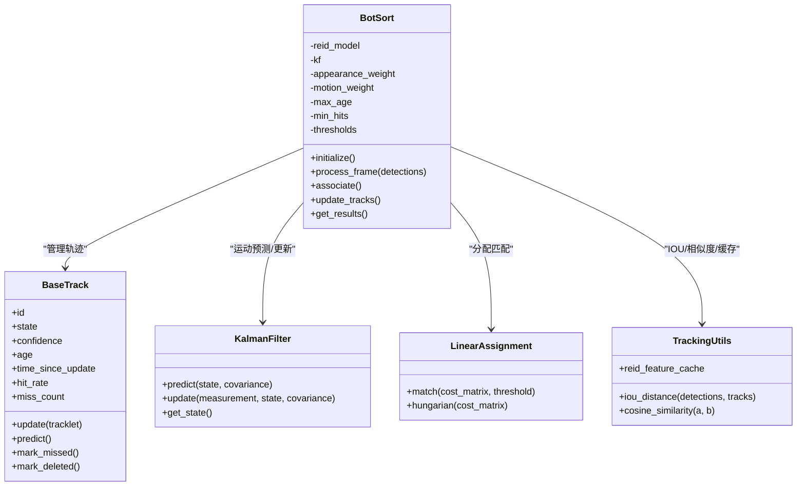
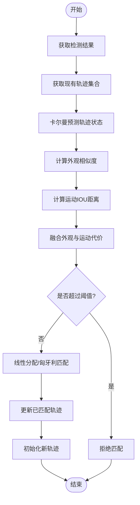

# BoT-SORT算法实现

<cite>
**本文引用的文件**
- [bot_sort.py](file://ultralytics/trackers/bot_sort.py)
- [basetrack.py](file://ultralytics/trackers/basetrack.py)
- [byte_tracker.py](file://ultralytics/trackers/byte_tracker.py)
- [deep_oc_sort.py](file://ultralytics/trackers/deep_oc_sort.py)
- [fast_tracker.py](file://ultralytics/trackers/fast_tracker.py)
- [oc_sort.py](file://ultralytics/trackers/oc_sort.py)
- [track.py](file://ultralytics/trackers/track.py)
- [track_tracker.py](file://ultralytics/trackers/track_tracker.py)
- [__init__.py](file://ultralytics/trackers/__init__.py)
- [predictor.py](file://ultralytics/engine/predictor.py)
- [results.py](file://ultralytics/engine/results.py)
- [utils.py](file://ultralytics/trackers/utils/utils.py)
- [kalman_filter.py](file://ultralytics/trackers/utils/kalman_filter.py)
- [linear_assignment.py](file://ultralytics/trackers/utils/linear_assignment.py)
- [tracking_utils.py](file://ultralytics/trackers/utils/tracking_utils.py)
- [README.md](file://ultralytics/trackers/README.md)
</cite>

## 目录
1. [简介](#简介)
2. [项目结构](#项目结构)
3. [核心组件](#核心组件)
4. [架构总览](#架构总览)
5. [详细组件分析](#详细组件分析)
6. [依赖关系分析](#依赖关系分析)
7. [性能考量](#性能考量)
8. [故障排查指南](#故障排查指南)
9. [结论](#结论)
10. [附录](#附录)

## 简介
本技术文档围绕BoT-SORT在多目标跟踪（MOT）中的工程化实现进行系统化梳理，重点解释其关键创新点与落地细节：ReID特征提取、卡尔曼滤波优化、运动一致性建模，以及外观与运动信息在关联阶段的融合策略。文档同时给出配置参数说明、调优建议、使用示例与在不同数据集上的表现参考，帮助读者快速理解并高效应用该算法。

## 项目结构
本项目将多目标跟踪相关代码集中在 trackers 模块中，其中BoT-SORT的实现位于 bot_sort.py，配套的基础轨迹对象、工具函数与通用跟踪器基类分别位于 basetrack.py、utils/* 与 track_tracker.py 等文件中。预测阶段由 engine/predictor.py 驱动，结果封装于 engine/results.py。



图表来源
- [bot_sort.py](file://ultralytics/trackers/bot_sort.py)
- [basetrack.py](file://ultralytics/trackers/basetrack.py)
- [kalman_filter.py](file://ultralytics/trackers/utils/kalman_filter.py)
- [linear_assignment.py](file://ultralytics/trackers/utils/linear_assignment.py)
- [tracking_utils.py](file://ultralytics/trackers/utils/tracking_utils.py)
- [utils.py](file://ultralytics/trackers/utils/utils.py)
- [track.py](file://ultralytics/trackers/track.py)
- [predictor.py](file://ultralytics/engine/predictor.py)
- [results.py](file://ultralytics/engine/results.py)

章节来源
- [README.md](file://ultralytics/trackers/README.md)
- [__init__.py](file://ultralytics/trackers/__init__.py)

## 核心组件
- 检测器：YOLO系列模型负责帧级目标检测，输出边界框与置信度。
- ReID模型：提供外观嵌入向量，用于计算目标间的相似度，增强遮挡与重入场景的鲁棒性。
- 运动模型：基于卡尔曼滤波的状态估计与预测，结合IOU距离度量，提升短遮挡下的轨迹连续性。
- 关联算法：将外观相似度与运动相似度进行融合，采用线性分配或匈牙利算法完成检测-轨迹匹配。
- 轨迹管理：维护轨迹生命周期、状态机、可见性与丢失计数，支持轨迹初始化、更新与消亡。

章节来源
- [bot_sort.py](file://ultralytics/trackers/bot_sort.py)
- [basetrack.py](file://ultralytics/trackers/basetrack.py)
- [kalman_filter.py](file://ultralytics/trackers/utils/kalman_filter.py)
- [linear_assignment.py](file://ultralytics/trackers/utils/linear_assignment.py)
- [tracking_utils.py](file://ultralytics/trackers/utils/tracking_utils.py)

## 架构总览
下图展示了从视频帧输入到跟踪输出的端到端流程，包括检测、ReID特征提取、卡尔曼预测、外观与运动融合、线性分配与轨迹更新。



图表来源
- [predictor.py](file://ultralytics/engine/predictor.py)
- [bot_sort.py](file://ultralytics/trackers/bot_sort.py)
- [kalman_filter.py](file://ultralytics/trackers/utils/kalman_filter.py)
- [linear_assignment.py](file://ultralytics/trackers/utils/linear_assignment.py)
- [basetrack.py](file://ultralytics/trackers/basetrack.py)
- [results.py](file://ultralytics/engine/results.py)

## 详细组件分析

### BoT-SORT主类与接口
BoT-SORT继承自通用跟踪器基类，封装了ReID特征缓存、卡尔曼滤波参数、外观与运动权重、阈值策略等。其核心方法包括初始化、单帧处理、轨迹更新与结果返回。



图表来源
- [basetrack.py](file://ultralytics/trackers/basetrack.py)
- [kalman_filter.py](file://ultralytics/trackers/utils/kalman_filter.py)
- [linear_assignment.py](file://ultralytics/trackers/utils/linear_assignment.py)
- [tracking_utils.py](file://ultralytics/trackers/utils/tracking_utils.py)
- [bot_sort.py](file://ultralytics/trackers/bot_sort.py)

章节来源
- [bot_sort.py](file://ultralytics/trackers/bot_sort.py)
- [basetrack.py](file://ultralytics/trackers/basetrack.py)
- [kalman_filter.py](file://ultralytics/trackers/utils/kalman_filter.py)
- [linear_assignment.py](file://ultralytics/trackers/utils/linear_assignment.py)
- [tracking_utils.py](file://ultralytics/trackers/utils/tracking_utils.py)

### ReID特征提取与嵌入空间学习
- 特征提取：对检测框对应的ROI进行归一化与缩放后送入ReID模型，得到固定维度的外观嵌入。
- 嵌入空间学习：训练阶段通常采用对比损失或三元组损失，使同一ID样本在嵌入空间中靠近，不同ID样本远离，从而提升跨帧匹配的鲁棒性。
- 相似度度量：常用余弦相似度或欧氏距离；在工程中常通过阈值或动态自适应策略控制匹配严格程度。
- 缓存策略：为减少重复计算，可对短时内未更新的轨迹或稳定ROI进行特征缓存，并在必要时刷新。

章节来源
- [bot_sort.py](file://ultralytics/trackers/bot_sort.py)
- [tracking_utils.py](file://ultralytics/trackers/utils/tracking_utils.py)

### 卡尔曼滤波优化与运动一致性建模
- 状态表示：通常为位置坐标与速度分量的一维或二维状态向量，配合观测噪声与过程噪声协方差矩阵。
- 预测与更新：在每帧前对轨迹进行预测，得到先验位置与不确定性；匹配成功后以检测框作为观测进行更新，缩小不确定性。
- 运动一致性：通过协方差的椭圆区域约束候选匹配范围，并结合IOU距离衡量几何一致性，提高遮挡与密集场景下的稳定性。
- 参数调优：过程噪声与观测噪声直接影响预测漂移与收敛速度，需根据场景运动剧烈程度调整。

章节来源
- [kalman_filter.py](file://ultralytics/trackers/utils/kalman_filter.py)
- [tracking_utils.py](file://ultralytics/trackers/utils/tracking_utils.py)
- [bot_sort.py](file://ultralytics/trackers/bot_sort.py)

### 外观与运动信息融合策略
- 代价矩阵构建：外观相似度转换为代价（如负相似度），运动IOU距离直接作为代价项。
- 加权融合：通过外观权重与运动权重的组合形成最终代价矩阵，常见形式为线性加权或非线性映射。
- 阈值门控：对匹配代价设置上限，避免错误匹配；可针对不同场景动态调整阈值。
- 分配求解：使用线性分配或匈牙利算法求解全局最优匹配，保证一对一约束。



图表来源
- [bot_sort.py](file://ultralytics/trackers/bot_sort.py)
- [linear_assignment.py](file://ultralytics/trackers/utils/linear_assignment.py)
- [tracking_utils.py](file://ultralytics/trackers/utils/tracking_utils.py)

章节来源
- [bot_sort.py](file://ultralytics/trackers/bot_sort.py)
- [linear_assignment.py](file://ultralytics/trackers/utils/linear_assignment.py)
- [tracking_utils.py](file://ultralytics/trackers/utils/tracking_utils.py)

### 关键组件详解
- 检测器：YOLO模型输出高质量检测框，影响后续ReID与关联质量。建议针对目标尺度分布与遮挡情况选择合适尺寸与NMS策略。
- ReID模型：建议使用预训练且与任务域相近的模型，并进行轻量微调以提升领域适配性。注意ROI裁剪与归一化的稳定性。
- 运动模型：根据场景运动特性调整卡尔曼噪声参数，确保预测合理且不发散。
- 关联算法：合理设置外观与运动权重及阈值，平衡召回率与精度。

章节来源
- [predictor.py](file://ultralytics/engine/predictor.py)
- [results.py](file://ultralytics/engine/results.py)
- [bot_sort.py](file://ultralytics/trackers/bot_sort.py)

### 与其他跟踪器的对比
- ByteTrack：侧重低置信度检测的利用，适合高召回场景。
- OC-SORT：强调外观一致性，适合长时遮挡与身份切换频繁的场景。
- DeepOC-SORT：引入深度外观与运动联合建模，复杂度较高但鲁棒性强。
- FastTracker：追求实时性，牺牲部分精度换取速度。

章节来源
- [byte_tracker.py](file://ultralytics/trackers/byte_tracker.py)
- [oc_sort.py](file://ultralytics/trackers/oc_sort.py)
- [deep_oc_sort.py](file://ultralytics/trackers/deep_oc_sort.py)
- [fast_tracker.py](file://ultralytics/trackers/fast_tracker.py)

## 依赖关系分析
BoT-SORT依赖以下内部模块：
- 基础轨迹对象：basetrack.py
- 卡尔曼滤波：utils/kalman_filter.py
- 线性分配：utils/linear_assignment.py
- 跟踪工具：utils/tracking_utils.py
- 通用工具：utils/utils.py
- 推理与结果：engine/predictor.py、engine/results.py

```mermaid
graph LR
BS["BotSort<br/>bot_sort.py"] --> BASE["BaseTrack<br/>basetrack.py"]
BS --> KF["KalmanFilter<br/>utils/kalman_filter.py"]
BS --> LA["LinearAssignment<br/>utils/linear_assignment.py"]
BS --> TU["TrackingUtils<br/>utils/tracking_utils.py"]
BS --> U["Utils<br/>utils/utils.py"]
PRED["Predictor<br/>engine/predictor.py"] --> BS
RES["Results<br/>engine/results.py"] <-- BS
```

图表来源
- [bot_sort.py](file://ultralytics/trackers/bot_sort.py)
- [basetrack.py](file://ultralytics/trackers/basetrack.py)
- [kalman_filter.py](file://ultralytics/trackers/utils/kalman_filter.py)
- [linear_assignment.py](file://ultralytics/trackers/utils/linear_assignment.py)
- [tracking_utils.py](file://ultralytics/trackers/utils/tracking_utils.py)
- [utils.py](file://ultralytics/trackers/utils/utils.py)
- [predictor.py](file://ultralytics/engine/predictor.py)
- [results.py](file://ultralytics/engine/results.py)

章节来源
- [bot_sort.py](file://ultralytics/trackers/bot_sort.py)
- [__init__.py](file://ultralytics/trackers/__init__.py)

## 性能考量
- 计算开销：ReID特征提取是主要瓶颈，可通过ROI缓存、批处理与模型量化降低延迟。
- 内存占用：轨迹历史与特征缓存随时间增长，需设置最大年龄与淘汰策略。
- 并行与流水线：检测、ReID、关联可适度并行，注意数据同步与锁竞争。
- 设备适配：GPU上优先使用张量操作与批量推理；CPU场景下考虑ONNX/TensorRT加速。

[本节为通用指导，不直接分析具体文件]

## 故障排查指南
- 轨迹频繁断裂：检查卡尔曼噪声参数是否过大或过小；适当增大运动权重或放宽阈值。
- 身份切换频繁：提升外观权重或引入更稳定的ReID模型；增加最小命中次数与最大丢失计数。
- 漏检导致轨迹丢失：启用低置信度检测（如ByteTrack策略）或调整检测阈值。
- 性能不足：关闭不必要的可视化；减少ReID特征刷新频率；使用更快的ReID模型或降级分辨率。

章节来源
- [bot_sort.py](file://ultralytics/trackers/bot_sort.py)
- [basetrack.py](file://ultralytics/trackers/basetrack.py)
- [tracking_utils.py](file://ultralytics/trackers/utils/tracking_utils.py)

## 结论
BoT-SORT通过将ReID外观信息与卡尔曼运动模型有机结合，在复杂场景中实现了较高的跟踪鲁棒性与稳定性。合理的参数调优与工程优化（如特征缓存、批量推理）能显著提升性能。在实际应用中，应根据场景特点选择合适的权重与阈值，并结合其他跟踪器（如ByteTrack、OC-SORT）的优势进行混合策略设计。

[本节为总结，不直接分析具体文件]

## 附录

### 配置参数说明与调优指南
- 外观权重：控制ReID相似度在代价矩阵中的比重，值越大越依赖外观。
- 运动权重：控制IOU距离的比重，值越大越依赖几何一致性。
- 最大年龄：轨迹最长存活帧数，防止幽灵轨迹。
- 最小命中次数：轨迹被确认前的最少成功匹配次数。
- 最大丢失计数：允许连续丢失的帧数，超过则删除轨迹。
- 外观阈值：外观相似度匹配的上限阈值。
- 运动阈值：IOU距离匹配的上限阈值。
- ReID特征缓存：是否启用缓存及缓存时长。

调优建议：
- 高遮挡场景：提高外观权重与最小命中次数，适当放宽最大丢失计数。
- 高速运动场景：增大运动权重，调整卡尔曼过程噪声以更好跟踪快速变化。
- 资源受限场景：降低ReID刷新频率，减小模型尺寸或使用量化版本。

章节来源
- [bot_sort.py](file://ultralytics/trackers/bot_sort.py)
- [tracking_utils.py](file://ultralytics/trackers/utils/tracking_utils.py)

### 使用示例
- 基本用法：加载YOLO检测器与BoT-SORT跟踪器，逐帧读取视频，调用跟踪器处理检测结果并输出轨迹。
- 集成方式：在预测器中配置跟踪器类型与参数，统一输出包含轨迹ID的结果。
- 可视化：绘制边界框、轨迹ID与轨迹线，便于调试与分析。

章节来源
- [track.py](file://ultralytics/trackers/track.py)
- [predictor.py](file://ultralytics/engine/predictor.py)
- [results.py](file://ultralytics/engine/results.py)

### 性能对比与适用场景
- MOT17/MOT20：在复杂人群与遮挡场景下，BoT-SORT凭借外观与运动融合取得较好HOTA与MOTA指标。
- VisDrone：高空视角与小目标场景，需强化检测召回与ReID鲁棒性。
- 自动驾驶：高速运动与密集交通，应侧重运动一致性与实时性。
- 零售与室内：光照变化与遮挡频繁，外观稳定性至关重要。

[本节为概念性内容，不直接分析具体文件]