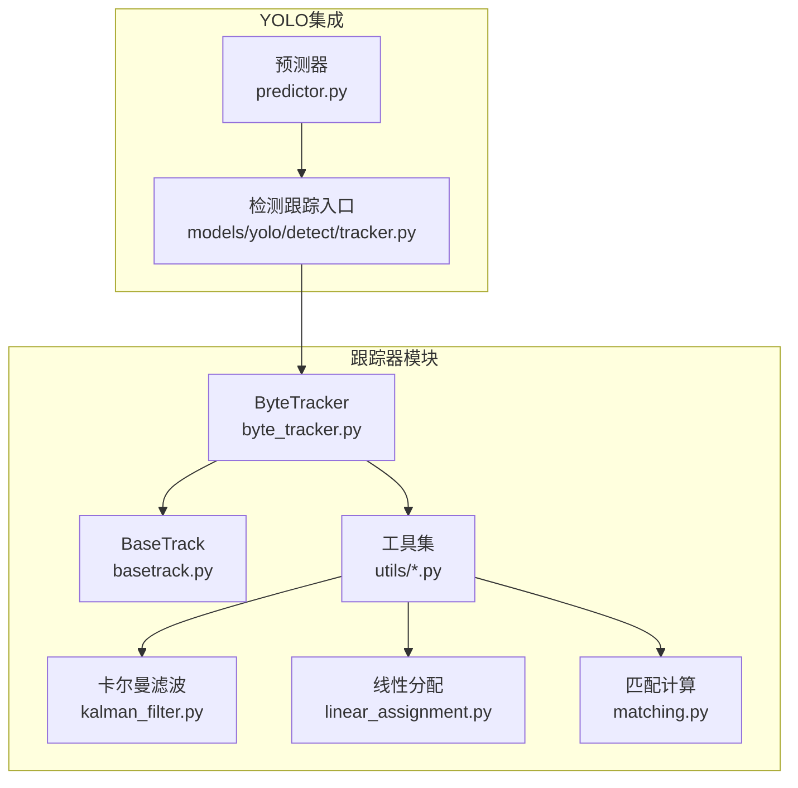
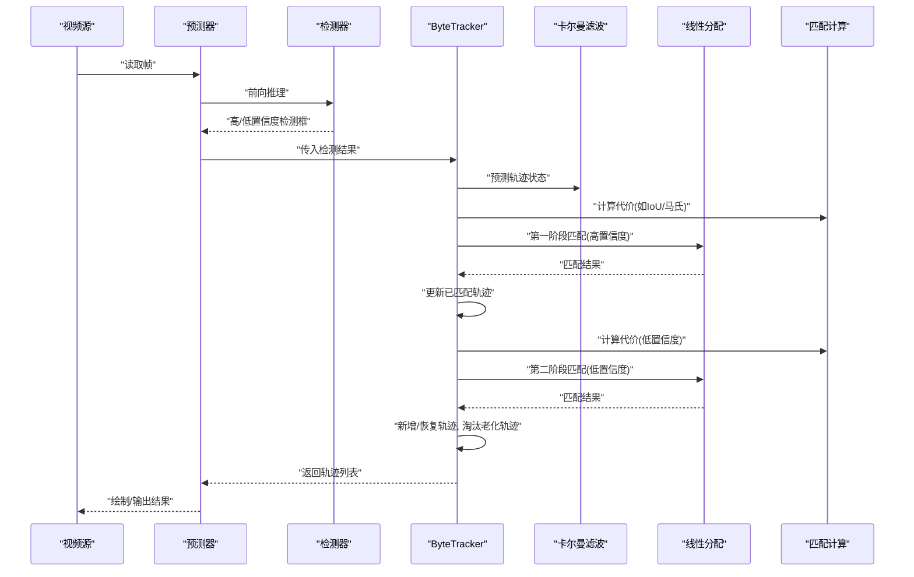
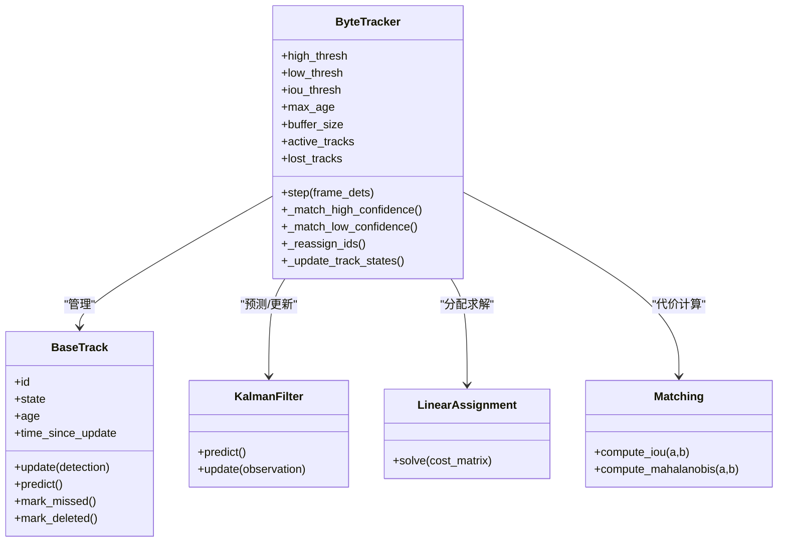
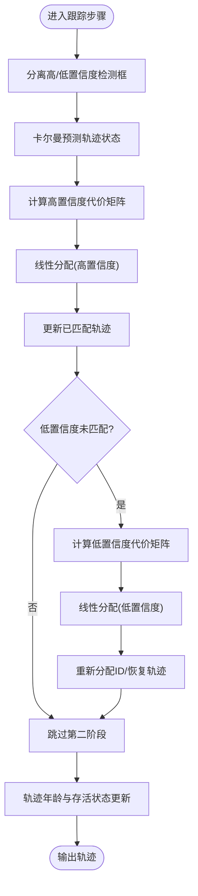
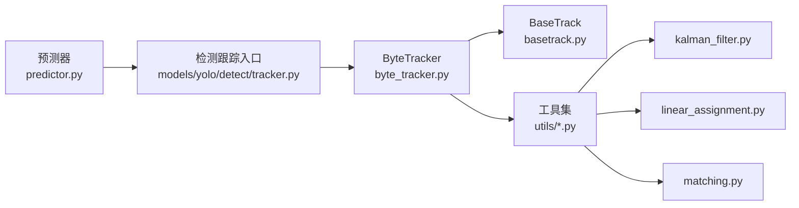

# ByteTrack算法实现

<cite>
**本文引用的文件**
- [byte_tracker.py](file://ultralytics/trackers/byte_tracker.py)
- [basetrack.py](file://ultralytics/trackers/basetrack.py)
- [deep_oc_sort.py](file://ultralytics/trackers/deep_oc_sort.py)
- [fast_tracker.py](file://ultralytics/trackers/fast_tracker.py)
- [oc_sort.py](file://ultralytics/trackers/oc_sort.py)
- [track.py](file://ultralytics/trackers/track.py)
- [track_tracker.py](file://ultralytics/trackers/track_tracker.py)
- [__init__.py](file://ultralytics/trackers/__init__.py)
- [utils.py](file://ultralytics/trackers/utils/utils.py)
- [kalman_filter.py](file://ultralytics/trackers/utils/kalman_filter.py)
- [linear_assignment.py](file://ultralytics/trackers/utils/linear_assignment.py)
- [matching.py](file://ultralytics/trackers/utils/matching.py)
- [models/yolo/detect/tracker.py](file://ultralytics/models/yolo/detect/tracker.py)
- [engine/predictor.py](file://ultralytics/engine/predictor.py)
- [cfg/trackers/byte.yaml](file://ultralytics/cfg/trackers/byte.yaml)
</cite>

## 目录
1. [简介](#简介)
2. [项目结构](#项目结构)
3. [核心组件](#核心组件)
4. [架构总览](#架构总览)
5. [详细组件分析](#详细组件分析)
6. [依赖关系分析](#依赖关系分析)
7. [性能考量](#性能考量)
8. [故障排查指南](#故障排查指南)
9. [结论](#结论)
10. [附录](#附录)

## 简介
本技术文档围绕ByteTrack多目标跟踪算法在仓库中的实现，系统阐述其核心原理、关键参数与匹配策略，重点解释低分检测框重用机制与两阶段匹配优化。文档同时提供配置模板、使用示例、调优建议以及适用场景与局限性分析，帮助读者快速理解并高效应用该算法。

## 项目结构
ByteTrack在多目标跟踪模块中作为独立跟踪器实现，并与YOLO检测流程集成。整体结构如下：
- 跟踪器实现位于 trackers 子包，包含ByteTrack及其工具函数（卡尔曼滤波、线性分配、匹配等）。
- YOLO检测推理时通过预测器调用跟踪器，完成“检测—匹配—轨迹更新”的闭环。
- 配置文件提供默认阈值与行为开关，便于在不同数据集和场景下快速切换。

图表来源
- [byte_tracker.py](file://ultralytics/trackers/byte_tracker.py)
- [basetrack.py](file://ultralytics/trackers/basetrack.py)
- [kalman_filter.py](file://ultralytics/trackers/utils/kalman_filter.py)
- [linear_assignment.py](file://ultralytics/trackers/utils/linear_assignment.py)
- [matching.py](file://ultralytics/trackers/utils/matching.py)
- [predictor.py](file://ultralytics/engine/predictor.py)
- [tracker.py](file://ultralytics/models/yolo/detect/tracker.py)

章节来源
- [byte_tracker.py](file://ultralytics/trackers/byte_tracker.py)
- [predictor.py](file://ultralytics/engine/predictor.py)
- [tracker.py](file://ultralytics/models/yolo/detect/tracker.py)

## 核心组件
- ByteTracker：实现两阶段匹配与低分框重用策略，维护轨迹状态、ID管理与轨迹输出。
- BaseTrack：轨迹基类，封装轨迹生命周期、状态更新接口与可视化所需属性。
- 工具库：
  - 卡尔曼滤波：用于运动模型预测与观测更新。
  - 线性分配：匈牙利算法或近似求解器，完成检测框与轨迹的代价矩阵最小化匹配。
  - 匹配计算：IoU、马氏距离等代价度量。
- 集成层：YOLO预测器在每帧推理后调用跟踪器进行匹配与轨迹更新。

章节来源
- [byte_tracker.py](file://ultralytics/trackers/byte_tracker.py)
- [basetrack.py](file://ultralytics/trackers/basetrack.py)
- [kalman_filter.py](file://ultralytics/trackers/utils/kalman_filter.py)
- [linear_assignment.py](file://ultralytics/trackers/utils/linear_assignment.py)
- [matching.py](file://ultralytics/trackers/utils/matching.py)

## 架构总览
ByteTrack在YOLO检测流水线中的工作流如下：
- 输入帧经检测模型得到高置信度与低置信度两类候选框。
- 第一阶段：对高置信度检测框与现有轨迹进行匹配，更新已存在轨迹。
- 第二阶段：对未被匹配的低置信度检测框与未匹配轨迹再次匹配，以恢复被遮挡或短时漏检的目标。
- 未匹配的轨迹按老化策略逐步淘汰，最终输出稳定轨迹集合。

图表来源
- [predictor.py](file://ultralytics/engine/predictor.py)
- [byte_tracker.py](file://ultralytics/trackers/byte_tracker.py)
- [kalman_filter.py](file://ultralytics/trackers/utils/kalman_filter.py)
- [linear_assignment.py](file://ultralytics/trackers/utils/linear_assignment.py)
- [matching.py](file://ultralytics/trackers/utils/matching.py)

## 详细组件分析

### ByteTracker 组件分析
ByteTracker的核心在于两阶段匹配与低分框重用：
- 两阶段匹配：先匹配高置信度检测框，再对低置信度检测框进行二次匹配，提升召回率。
- 低分框重用：将低置信度检测框视为潜在真实目标，结合轨迹预测与代价阈值判断是否恢复轨迹。
- 轨迹管理：维护轨迹状态（活跃、隐藏、终止）、ID分配与轨迹寿命控制。
- 代价度量：通常采用IoU与马氏距离组合，兼顾空间重叠与运动一致性。

图表来源
- [byte_tracker.py](file://ultralytics/trackers/byte_tracker.py)
- [basetrack.py](file://ultralytics/trackers/basetrack.py)
- [kalman_filter.py](file://ultralytics/trackers/utils/kalman_filter.py)
- [linear_assignment.py](file://ultralytics/trackers/utils/linear_assignment.py)
- [matching.py](file://ultralytics/trackers/utils/matching.py)

章节来源
- [byte_tracker.py](file://ultralytics/trackers/byte_tracker.py)
- [basetrack.py](file://ultralytics/trackers/basetrack.py)

#### 两阶段匹配流程（算法流程图）

图表来源
- [byte_tracker.py](file://ultralytics/trackers/byte_tracker.py)
- [kalman_filter.py](file://ultralytics/trackers/utils/kalman_filter.py)
- [linear_assignment.py](file://ultralytics/trackers/utils/linear_assignment.py)
- [matching.py](file://ultralytics/trackers/utils/matching.py)

章节来源
- [byte_tracker.py](file://ultralytics/trackers/byte_tracker.py)

### 其他跟踪器对比（参考）
仓库中还包含其他跟踪器实现，可作为对照理解ByteTrack的优势：
- DeepOCSort：引入外观特征增强匹配鲁棒性。
- FastTracker：侧重速度优化的简化匹配策略。
- OCSort：基于运动一致性的基础跟踪器。
- TrackTracker：通用跟踪框架封装。

章节来源
- [deep_oc_sort.py](file://ultralytics/trackers/deep_oc_sort.py)
- [fast_tracker.py](file://ultralytics/trackers/fast_tracker.py)
- [oc_sort.py](file://ultralytics/trackers/oc_sort.py)
- [track_tracker.py](file://ultralytics/trackers/track_tracker.py)

## 依赖关系分析
ByteTracker与其依赖模块的关系如下：
- ByteTracker依赖BaseTrack进行轨迹对象管理。
- 工具库提供卡尔曼滤波、线性分配与匹配计算。
- YOLO预测器在每帧推理后调用跟踪器，形成端到端跟踪链路。

图表来源
- [predictor.py](file://ultralytics/engine/predictor.py)
- [tracker.py](file://ultralytics/models/yolo/detect/tracker.py)
- [byte_tracker.py](file://ultralytics/trackers/byte_tracker.py)
- [basetrack.py](file://ultralytics/trackers/basetrack.py)
- [kalman_filter.py](file://ultralytics/trackers/utils/kalman_filter.py)
- [linear_assignment.py](file://ultralytics/trackers/utils/linear_assignment.py)
- [matching.py](file://ultralytics/trackers/utils/matching.py)

章节来源
- [predictor.py](file://ultralytics/engine/predictor.py)
- [tracker.py](file://ultralytics/models/yolo/detect/tracker.py)
- [byte_tracker.py](file://ultralytics/trackers/byte_tracker.py)

## 性能考量
- 两阶段匹配复杂度：主要受检测框数量与轨迹数量影响，线性分配通常为O(n^3)，可通过阈值裁剪与批量处理降低实际开销。
- 代价矩阵规模：在高密度场景中，建议限制候选框数量或使用近似分配算法。
- 卡尔曼滤波稳定性：合理设置过程噪声与观测噪声，避免过度平滑导致延迟。
- 内存与缓存：轨迹缓冲大小与最大年龄需根据场景调整，避免过多历史轨迹占用资源。
- 并行与向量化：匹配与代价计算可考虑GPU加速或向量化实现以提升吞吐。

[本节为通用指导，不直接分析具体文件]

## 故障排查指南
- 轨迹频繁丢失：检查高/低置信度阈值是否过严；适当放宽低置信度阈值并增大第二阶段匹配窗口。
- ID跳变严重：确认ID重分配逻辑与轨迹寿命控制；增加轨迹最小存活帧数。
- 匹配错误率高：调整IoU与马氏距离权重；在复杂遮挡场景引入外观特征辅助。
- 运行缓慢：减少候选框数量、限制匹配范围、启用近似分配或批处理。
- 初始化不稳定：提高初始置信度阈值，确保首帧高质量轨迹建立。

章节来源
- [byte_tracker.py](file://ultralytics/trackers/byte_tracker.py)
- [matching.py](file://ultralytics/trackers/utils/matching.py)
- [linear_assignment.py](file://ultralytics/trackers/utils/linear_assignment.py)

## 结论
ByteTrack通过两阶段匹配与低分框重用策略，在复杂遮挡与密集场景下显著提升跟踪稳定性与召回率。合理配置置信度阈值、IoU阈值与轨迹寿命参数，并结合场景特性优化匹配代价与分配策略，可在精度与效率之间取得良好平衡。

[本节为总结性内容，不直接分析具体文件]

## 附录

### 关键参数说明
- 置信度阈值（高/低）：控制检测框进入跟踪的门槛，高阈值保证准确性，低阈值提升召回。
- IoU阈值：决定检测框与轨迹的空间重叠要求，过大易漏配，过小易误配。
- 轨迹最大年龄：控制轨迹存活时长，防止长期未观测目标占用ID。
- 缓冲区大小：限制历史轨迹数量，平衡记忆能力与内存占用。
- 匹配代价权重：IoU与马氏距离的组合权重，需根据运动模式与遮挡程度调整。

章节来源
- [byte.yaml](file://ultralytics/cfg/trackers/byte.yaml)
- [byte_tracker.py](file://ultralytics/trackers/byte_tracker.py)

### 使用示例与配置模板
- 基本用法：在YOLO预测流程中指定跟踪器为ByteTrack，并加载对应配置文件。
- 配置模板：参考字节跟踪配置文件，设置高/低置信度阈值、IoU阈值、最大年龄与缓冲区大小等。
- 实战建议：
  - 交通监控：提高IoU阈值，适度放宽低置信度阈值以应对遮挡。
  - 人群跟踪：降低IoU阈值，增加轨迹最大年龄以维持长时关联。
  - 无人机航拍：增大缓冲区与最大年龄，配合外观特征提升鲁棒性。

章节来源
- [byte.yaml](file://ultralytics/cfg/trackers/byte.yaml)
- [predictor.py](file://ultralytics/engine/predictor.py)
- [tracker.py](file://ultralytics/models/yolo/detect/tracker.py)

### 适用场景与局限性
- 适用场景：
  - 复杂遮挡环境（如十字路口、拥挤人群）。
  - 目标短时消失与重现频繁的场景。
  - 需要较高召回率的实时跟踪任务。
- 局限性：
  - 高度密集且快速运动目标可能导致匹配歧义。
  - 缺乏外观特征时，长时间遮挡下的身份保持能力有限。
  - 参数敏感，需针对数据集与硬件平台进行细致调优。

[本节为概念性内容，不直接分析具体文件]